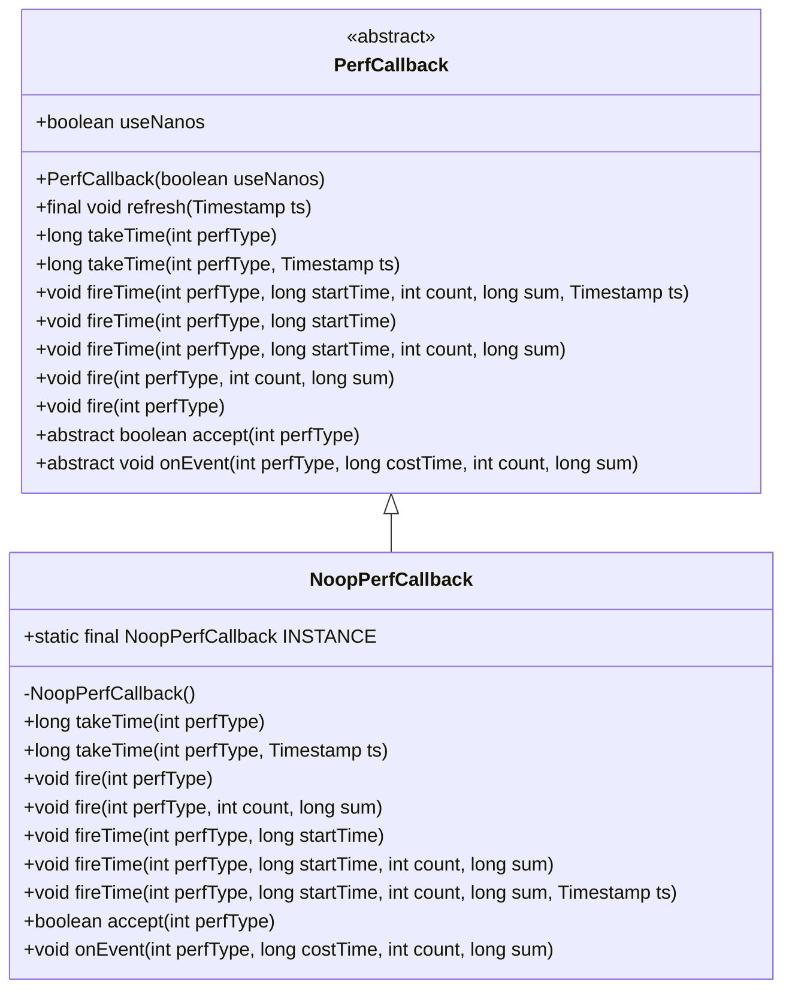
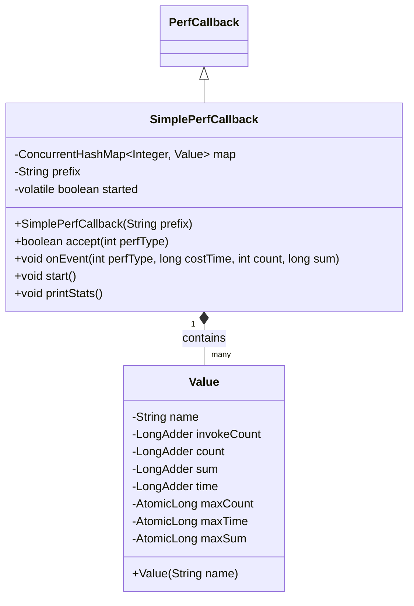
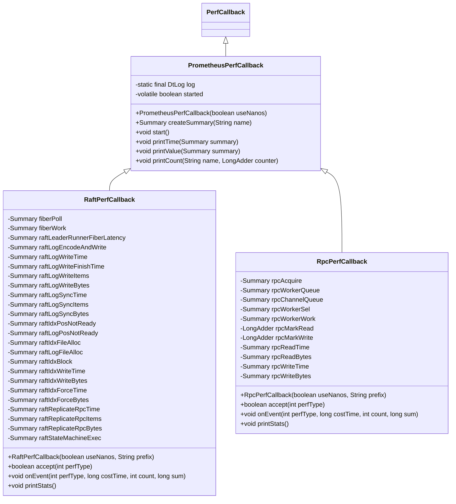
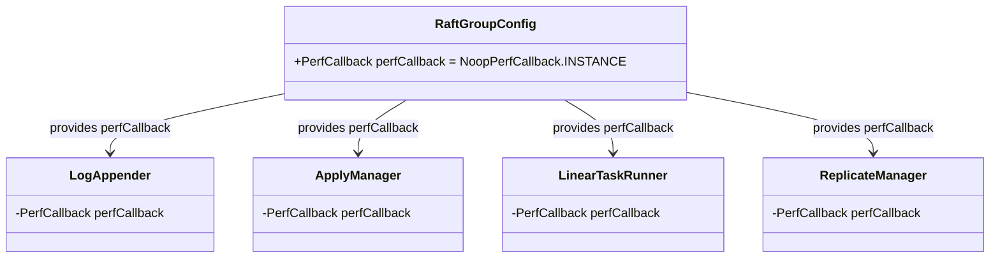
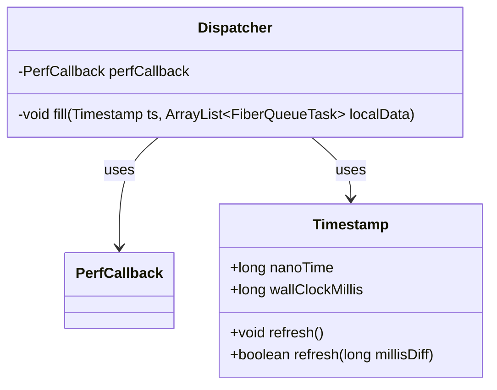
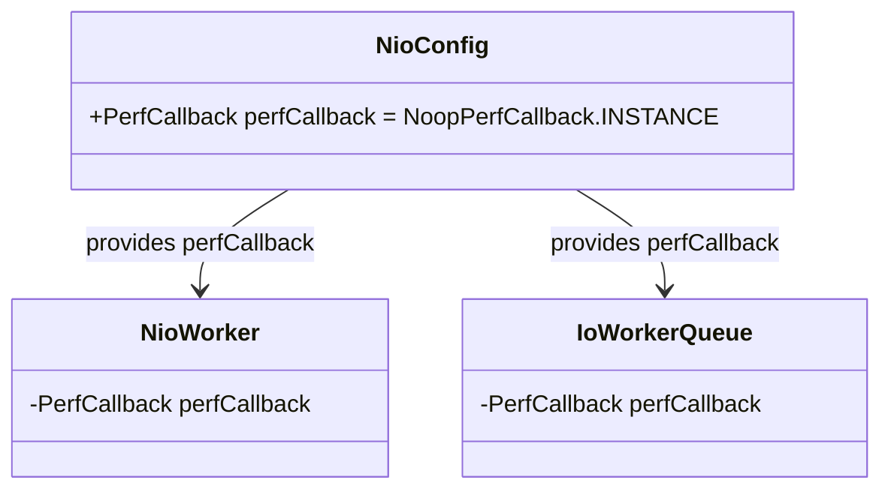
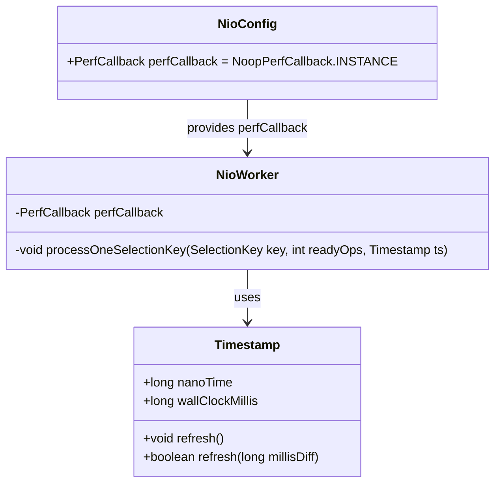

# Performance Callback System

<cite>
**Referenced Files in This Document**   
- [PerfCallback.java](file://client/src/main/java/com/github/dtprj/dongting/common/PerfCallback.java)
- [NoopPerfCallback.java](file://client/src/main/java/com/github/dtprj/dongting/common/NoopPerfCallback.java)
- [PerfConsts.java](file://client/src/main/java/com/github/dtprj/dongting/common/PerfConsts.java)
- [Timestamp.java](file://client/src/main/java/com/github/dtprj/dongting/common/Timestamp.java)
- [BenchBase.java](file://benchmark/src/main/java/com/github/dtprj/dongting/bench/common/BenchBase.java)
- [SimplePerfCallback.java](file://benchmark/src/main/java/com/github/dtprj/dongting/bench/common/SimplePerfCallback.java)
- [PrometheusPerfCallback.java](file://benchmark/src/main/java/com/github/dtprj/dongting/bench/common/PrometheusPerfCallback.java)
- [RaftPerfCallback.java](file://benchmark/src/main/java/com/github/dtprj/dongting/bench/raft/RaftPerfCallback.java)
- [RpcPerfCallback.java](file://benchmark/src/main/java/com/github/dtprj/dongting/bench/rpc/RpcPerfCallback.java)
- [NioConfig.java](file://client/src/main/java/com/github/dtprj/dongting/net/NioConfig.java)
- [NioWorker.java](file://client/src/main/java/com/github/dtprj/dongting/net/NioWorker.java)
- [IoWorkerQueue.java](file://client/src/main/java/com/github/dtprj/dongting/net/IoWorkerQueue.java)
- [Dispatcher.java](file://server/src/main/java/com/github/dtprj/dongting/fiber/Dispatcher.java)
- [RaftGroupConfig.java](file://server/src/main/java/com/github/dtprj/dongting/raft/server/RaftGroupConfig.java)
- [LogAppender.java](file://server/src/main/java/com/github/dtprj/dongting/raft/store/LogAppender.java)
</cite>

## Table of Contents
1. [Introduction](#introduction)
2. [Core Components](#core-components)
3. [Architecture Overview](#architecture-overview)
4. [Detailed Component Analysis](#detailed-component-analysis)
5. [Integration Points](#integration-points)
6. [Performance Overhead Considerations](#performance-overhead-considerations)
7. [Best Practices](#best-practices)
8. [Conclusion](#conclusion)

## Introduction
The Performance Callback System in the Dongting project provides a flexible framework for collecting and reporting performance metrics across various subsystems. This system enables detailed monitoring of critical operations in RAFT, Fiber, RPC, and I/O components while maintaining minimal performance impact when disabled. The design follows the null object pattern with the NoopPerfCallback as the default implementation, ensuring that performance monitoring can be seamlessly enabled or disabled without affecting the core functionality. The system is designed with performance in mind, using efficient data structures and minimizing overhead through conditional execution and optimized time measurement.

## Core Components

The performance callback system consists of several key components that work together to provide a comprehensive metrics collection framework. At its core is the abstract PerfCallback class, which defines the interface for recording events, timing, and statistics. The system includes specialized implementations for different use cases, from the null object pattern (NoopPerfCallback) to detailed monitoring (SimplePerfCallback and PrometheusPerfCallback). The integration with the Timestamp class ensures efficient time measurement while maintaining monotonicity and reducing the overhead of frequent time queries.

**Section sources**
- [PerfCallback.java](file://client/src/main/java/com/github/dtprj/dongting/common/PerfCallback.java#L21-L110)
- [NoopPerfCallback.java](file://client/src/main/java/com/github/dtprj/dongting/common/NoopPerfCallback.java#L21-L65)
- [Timestamp.java](file://client/src/main/java/com/github/dtprj/dongting/common/Timestamp.java#L23-L72)

## Architecture Overview

The performance callback system follows a hierarchical architecture with clear separation of concerns. The base PerfCallback class provides the foundation for all performance monitoring, with concrete implementations extending this base to provide specific functionality. The system integrates with various subsystems through configuration objects that expose a perfCallback property, allowing components to access the callback without direct dependencies. This design enables conditional metrics collection, where performance monitoring can be enabled only in specific environments or for specific components.

```mermaid
classDiagram
class PerfCallback {
+boolean useNanos
+PerfCallback(boolean useNanos)
+final void refresh(Timestamp ts)
+long takeTime(int perfType)
+long takeTime(int perfType, Timestamp ts)
+void fireTime(int perfType, long startTime, int count, long sum, Timestamp ts)
+void fireTime(int perfType, long startTime)
+void fireTime(int perfType, long startTime, int count, long sum)
+void fire(int perfType, int count, long sum)
+void fire(int perfType)
+abstract boolean accept(int perfType)
+abstract void onEvent(int perfType, long costTime, int count, long sum)
}
class NoopPerfCallback {
+static final NoopPerfCallback INSTANCE
+NoopPerfCallback()
+long takeTime(int perfType)
+long takeTime(int perfType, Timestamp ts)
+void fire(int perfType)
+void fire(int perfType, int count, long sum)
+void fireTime(int perfType, long startTime)
+void fireTime(int perfType, long startTime, int count, long sum)
+void fireTime(int perfType, long startTime, int count, long sum, Timestamp ts)
+boolean accept(int perfType)
+void onEvent(int perfType, long costTime, int count, long sum)
}
class SimplePerfCallback {
-ConcurrentHashMap~Integer, Value~ map
-String prefix
-volatile boolean started
+SimplePerfCallback(String prefix)
+boolean accept(int perfType)
+void onEvent(int perfType, long costTime, int count, long sum)
+void start()
+void printStats()
}
class PrometheusPerfCallback {
-static final DtLog log
-volatile boolean started
+PrometheusPerfCallback(boolean useNanos)
+Summary createSummary(String name)
+void start()
+void printTime(Summary summary)
+void printValue(Summary summary)
+void printCount(String name, LongAdder counter)
}
class RaftPerfCallback {
-Summary fiberPoll
-Summary fiberWork
-Summary raftLeaderRunnerFiberLatency
-Summary raftLogEncodeAndWrite
-Summary raftLogWriteTime
-Summary raftLogWriteFinishTime
-Summary raftLogWriteItems
-Summary raftLogWriteBytes
-Summary raftLogSyncTime
-Summary raftLogSyncItems
-Summary raftLogSyncBytes
-Summary raftIdxPosNotReady
-Summary raftLogPosNotReady
-Summary raftIdxFileAlloc
-Summary raftLogFileAlloc
-Summary raftIdxBlock
-Summary raftIdxWriteTime
-Summary raftIdxWriteBytes
-Summary raftIdxForceTime
-Summary raftIdxForceBytes
-Summary raftReplicateRpcTime
-Summary raftReplicateRpcItems
-Summary raftReplicateRpcBytes
-Summary raftStateMachineExec
+RaftPerfCallback(boolean useNanos, String prefix)
+boolean accept(int perfType)
+void onEvent(int perfType, long costTime, int count, long sum)
+void printStats()
}
class RpcPerfCallback {
-Summary rpcAcquire
-Summary rpcWorkerQueue
-Summary rpcChannelQueue
-Summary rpcWorkerSel
-Summary rpcWorkerWork
-LongAdder rpcMarkRead
-LongAdder rpcMarkWrite
-Summary rpcReadTime
-Summary rpcReadBytes
-Summary rpcWriteTime
-Summary rpcWriteBytes
+RpcPerfCallback(boolean useNanos, String prefix)
+boolean accept(int perfType)
+void onEvent(int perfType, long costTime, int count, long sum)
+void printStats()
}
PerfCallback <|-- NoopPerfCallback
PerfCallback <|-- SimplePerfCallback
PerfCallback <|-- PrometheusPerfCallback
PrometheusPerfCallback <|-- RaftPerfCallback
PrometheusPerfCallback <|-- RpcPerfCallback
SimplePerfCallback "1" *-- "many" SimplePerfCallback : : Value : contains
```

**Diagram sources **
- [PerfCallback.java](file://client/src/main/java/com/github/dtprj/dongting/common/PerfCallback.java#L21-L110)
- [NoopPerfCallback.java](file://client/src/main/java/com/github/dtprj/dongting/common/NoopPerfCallback.java#L21-L65)
- [SimplePerfCallback.java](file://benchmark/src/main/java/com/github/dtprj/dongting/bench/common/SimplePerfCallback.java#L29-L151)
- [PrometheusPerfCallback.java](file://benchmark/src/main/java/com/github/dtprj/dongting/bench/common/PrometheusPerfCallback.java#L31-L102)
- [RaftPerfCallback.java](file://benchmark/src/main/java/com/github/dtprj/dongting/bench/raft/RaftPerfCallback.java#L24-L183)
- [RpcPerfCallback.java](file://benchmark/src/main/java/com/github/dtprj/dongting/bench/rpc/RpcPerfCallback.java#L26-L117)

## Detailed Component Analysis

### PerfCallback Base Class
The PerfCallback class serves as the foundation of the metrics collection framework, providing a standardized interface for recording performance data. It implements the PerfConsts interface which defines constants for different performance measurement types across various subsystems. The class is designed to minimize overhead by using conditional execution - all methods check the accept() method before performing any work. The useNanos field determines whether to use nanosecond or millisecond precision for time measurements, allowing for configuration based on performance requirements.

The class provides several key methods for recording different types of performance data:
- takeTime(): Records the current timestamp for timing operations
- fireTime(): Records the duration of an operation with optional count and sum parameters
- fire(): Records event counts and sums without timing information

The implementation uses a two-layer approach with public methods that check acceptance before calling private implementation methods, ensuring consistent behavior across all operations.

**Section sources**
- [PerfCallback.java](file://client/src/main/java/com/github/dtprj/dongting/common/PerfCallback.java#L21-L110)
- [PerfConsts.java](file://client/src/main/java/com/github/dtprj/dongting/common/PerfConsts.java#L21-L53)

### NoopPerfCallback Implementation
The NoopPerfCallback class implements the null object pattern, providing a default implementation that disables all performance monitoring. This is the default configuration for production environments where metrics collection is disabled. The implementation is highly optimized for performance, with all methods having minimal overhead - typically just a single return statement or a simple boolean check.

Key features of the NoopPerfCallback:
- Singleton pattern with static INSTANCE field for efficient reuse
- All fire* methods are no-ops with empty implementations
- accept() method always returns false, preventing any performance measurement
- takeTime() methods return 0, indicating no timing information available

The design ensures that when performance monitoring is disabled, the overhead is minimal, making it suitable for production use where every microsecond counts.



**Diagram sources **
- [NoopPerfCallback.java](file://client/src/main/java/com/github/dtprj/dongting/common/NoopPerfCallback.java#L21-L65)
- [PerfCallback.java](file://client/src/main/java/com/github/dtprj/dongting/common/PerfCallback.java#L21-L110)

### SimplePerfCallback Implementation
The SimplePerfCallback provides a basic implementation for performance monitoring that collects statistics in memory. It extends the PerfCallback class and uses concurrent data structures to handle multi-threaded access efficiently. The implementation stores performance data in a ConcurrentHashMap where each performance type has a corresponding Value object that tracks various metrics.

Key features of the SimplePerfCallback:
- Uses ConcurrentHashMap for thread-safe storage of performance data
- Tracks invoke count, operation count, sum, time, and maximum values
- Supports both nanosecond and millisecond precision
- Provides a printStats() method to output collected metrics
- Uses a prefix to identify metrics from different instances

The Value inner class stores detailed statistics for each performance type, including invoke count, operation count, sum of values, time duration, and maximum values for each metric. This allows for comprehensive analysis of performance characteristics.



**Diagram sources **
- [SimplePerfCallback.java](file://benchmark/src/main/java/com/github/dtprj/dongting/bench/common/SimplePerfCallback.java#L29-L151)

### PrometheusPerfCallback Implementation
The PrometheusPerfCallback serves as a base class for implementations that integrate with Prometheus metrics collection. It extends PerfCallback and provides utility methods for creating and managing Prometheus Summary metrics. This class is designed to be extended by subsystem-specific implementations that define the specific metrics to be collected.

Key features of the PrometheusPerfCallback:
- Provides createSummary() method to create Prometheus Summary metrics
- Includes utility methods for printing time, value, and count statistics
- Manages the started state to control when metrics are collected
- Uses reflection to extract metric names from Prometheus collectors
- Provides consistent formatting for metric output

The class is designed to be extended by specific implementations like RaftPerfCallback and RpcPerfCallback, which define the actual metrics to be collected for their respective subsystems.



**Diagram sources **
- [PrometheusPerfCallback.java](file://benchmark/src/main/java/com/github/dtprj/dongting/bench/common/PrometheusPerfCallback.java#L31-L102)
- [RaftPerfCallback.java](file://benchmark/src/main/java/com/github/dtprj/dongting/bench/raft/RaftPerfCallback.java#L24-L183)
- [RpcPerfCallback.java](file://benchmark/src/main/java/com/github/dtprj/dongting/bench/rpc/RpcPerfCallback.java#L26-L117)

## Integration Points

### RAFT Subsystem Integration
The performance callback system integrates with the RAFT subsystem through the RaftGroupConfig class, which exposes a perfCallback property that defaults to NoopPerfCallback.INSTANCE. Components within the RAFT implementation, such as ApplyManager, LinearTaskRunner, ReplicateManager, and LogAppender, receive the performance callback through their configuration and use it to record various metrics.

The RaftPerfCallback implementation collects detailed metrics for RAFT operations, including:
- Leader runner fiber latency
- Log encoding and writing performance
- Log write and sync times
- Index file operations
- Replication RPC performance
- State machine execution time

These metrics provide comprehensive visibility into the performance characteristics of the RAFT consensus algorithm implementation.



**Diagram sources **
- [RaftGroupConfig.java](file://server/src/main/java/com/github/dtprj/dongting/raft/server/RaftGroupConfig.java#L48)
- [LogAppender.java](file://server/src/main/java/com/github/dtprj/dongting/raft/store/LogAppender.java#L73)
- [ApplyManager.java](file://server/src/main/java/com/github/dtprj/dongting/raft/impl/ApplyManager.java#L89)
- [LinearTaskRunner.java](file://server/src/main/java/com/github/dtprj/dongting/raft/impl/LinearTaskRunner.java#L69)
- [ReplicateManager.java](file://server/src/main/java/com/github/dtprj/dongting/raft/impl/ReplicateManager.java#L236)

### Fiber Subsystem Integration
The performance callback system integrates with the Fiber subsystem through the Dispatcher class, which receives the performance callback during construction. The Dispatcher uses the callback to measure fiber scheduling and execution performance, particularly in the fill() method where it records polling and work times.

Key integration points in the Fiber subsystem:
- Dispatcher records FIBER_D_POLL and FIBER_D_WORK metrics
- Uses Timestamp for efficient time measurement
- Conditional execution based on accept() method
- Calculates fiber thread utilization rate

The integration allows monitoring of fiber scheduling efficiency and helps identify potential bottlenecks in the fiber-based concurrency model.



**Diagram sources **
- [Dispatcher.java](file://server/src/main/java/com/github/dtprj/dongting/fiber/Dispatcher.java#L91)
- [Timestamp.java](file://client/src/main/java/com/github/dtprj/dongting/common/Timestamp.java#L23-L72)

### RPC Subsystem Integration
The performance callback system integrates with the RPC subsystem through the NioConfig class, which exposes a perfCallback property that defaults to NoopPerfCallback.INSTANCE. The NioWorker and IoWorkerQueue classes receive the performance callback through their configuration and use it to record various network-related metrics.

The RpcPerfCallback implementation collects detailed metrics for RPC operations, including:
- Connection acquisition time
- Worker and channel queue times
- Selector and worker execution times
- Read and write operation times and bytes
- Mark read and write counters

These metrics provide comprehensive visibility into the performance characteristics of the RPC communication layer.



**Diagram sources **
- [NioConfig.java](file://client/src/main/java/com/github/dtprj/dongting/net/NioConfig.java#L52)
- [NioWorker.java](file://client/src/main/java/com/github/dtprj/dongting/net/NioWorker.java#L102)
- [IoWorkerQueue.java](file://client/src/main/java/com/github/dtprj/dongting/net/IoWorkerQueue.java#L36)

### I/O Subsystem Integration
The performance callback system integrates with the I/O subsystem through the NioConfig class, which exposes a perfCallback property that is passed down to various I/O components. The NioWorker class uses the callback to measure I/O operation performance, particularly in the processOneSelectionKey() method where it records read and write times.

Key integration points in the I/O subsystem:
- NioWorker records RPC_D_READ and RPC_D_WRITE metrics
- Uses Timestamp for efficient time measurement
- Conditional execution based on accept() method
- Measures both time and byte counts for I/O operations

The integration allows monitoring of I/O performance and helps identify potential bottlenecks in network communication.



**Diagram sources **
- [NioConfig.java](file://client/src/main/java/com/github/dtprj/dongting/net/NioConfig.java#L52)
- [NioWorker.java](file://client/src/main/java/com/github/dtprj/dongting/net/NioWorker.java#L102)
- [Timestamp.java](file://client/src/main/java/com/github/dtprj/dongting/common/Timestamp.java#L23-L72)

## Performance Overhead Considerations

The performance callback system is designed with minimal overhead in mind, particularly when disabled. The NoopPerfCallback implementation ensures that when performance monitoring is disabled, the overhead is negligible - typically just a single method call with a simple return statement.

Key performance considerations:
- The use of the accept() method to gate all performance measurements
- Efficient time measurement using the Timestamp class
- Conditional execution of expensive operations
- Use of lightweight data structures for metric storage

The Timestamp class plays a crucial role in reducing performance overhead by caching time values and only refreshing them when necessary. This reduces the frequency of expensive System.nanoTime() calls, which can have significant overhead when called frequently.

The system also minimizes overhead by using primitive types and efficient concurrent data structures. The SimplePerfCallback uses ConcurrentHashMap and atomic counters to handle multi-threaded access without excessive synchronization overhead.

## Best Practices

When implementing custom performance monitoring by extending the PerfCallback base interface, consider the following best practices:

1. **Use appropriate precision**: Set useNanos based on your performance requirements. Use nanosecond precision only when necessary, as it has higher overhead.

2. **Implement efficient accept() logic**: The accept() method is called before every performance measurement, so it should be as lightweight as possible.

3. **Minimize object creation**: Avoid creating objects in hot paths, particularly in the onEvent() method.

4. **Use thread-safe data structures**: When storing metrics, use concurrent collections or atomic variables to handle multi-threaded access.

5. **Consider memory usage**: Balance the level of detail in metrics with memory consumption, especially in long-running applications.

6. **Provide meaningful metric names**: Use descriptive names that clearly indicate what is being measured.

7. **Implement proper lifecycle management**: Use the started flag to control when metrics are collected, allowing for dynamic enabling/disabling.

8. **Handle edge cases**: Ensure your implementation handles overflow, negative values, and other edge cases appropriately.

When using the performance callback system, follow these guidelines:
- Use NoopPerfCallback in production environments unless metrics are needed
- Enable detailed monitoring only for specific components during troubleshooting
- Use the provided utility methods in PrometheusPerfCallback when integrating with Prometheus
- Consider the performance impact when adding new metrics
- Regularly review and clean up unused metrics

## Conclusion
The Performance Callback System in the Dongting project provides a flexible and efficient framework for collecting performance metrics across various subsystems. The design follows sound software engineering principles, including the null object pattern, separation of concerns, and minimal overhead when disabled. The system enables detailed monitoring of critical operations in RAFT, Fiber, RPC, and I/O components while maintaining excellent performance characteristics.

The architecture allows for easy extension and customization, making it possible to implement custom performance monitoring for specific use cases. The integration with various subsystems is clean and consistent, using configuration objects to pass the performance callback without creating tight coupling.

By following the best practices outlined in this document, developers can effectively use the performance callback system to monitor and optimize the performance of their applications while minimizing the impact on production systems.