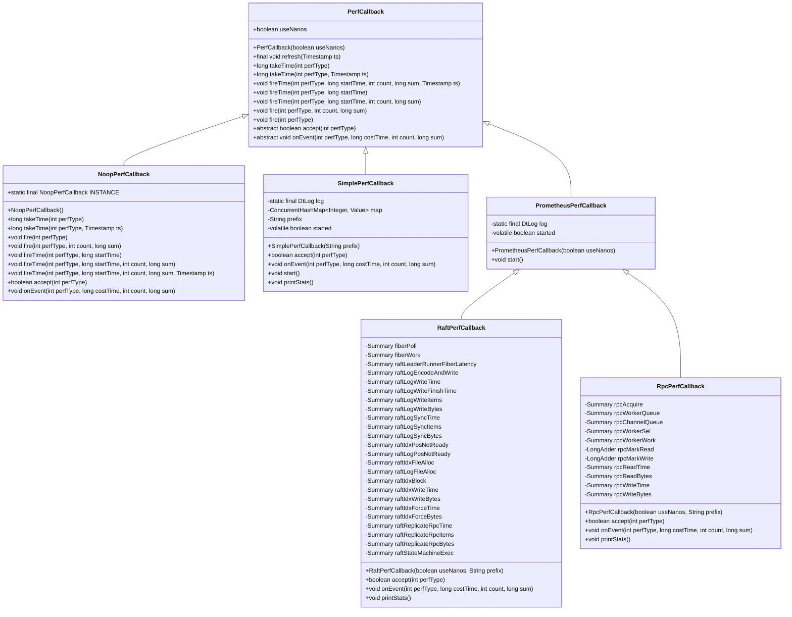
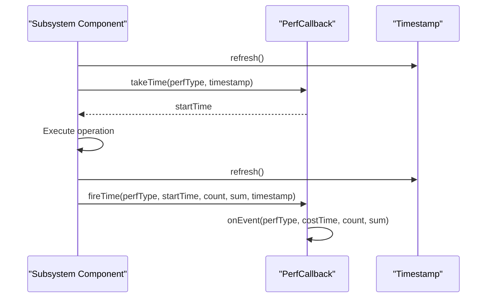
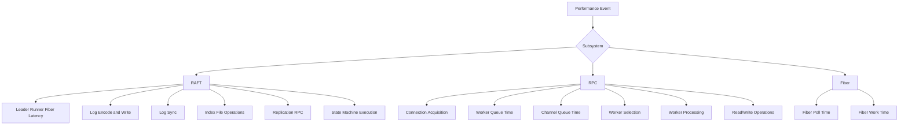

# Performance Metrics Collection

<cite>
**Referenced Files in This Document**   
- [PerfCallback.java](file://client/src/main/java/com/github/dtprj/dongting/common/PerfCallback.java)
- [NoopPerfCallback.java](file://client/src/main/java/com/github/dtprj/dongting/common/NoopPerfCallback.java)
- [PerfConsts.java](file://client/src/main/java/com/github/dtprj/dongting/common/PerfConsts.java)
- [Timestamp.java](file://client/src/main/java/com/github/dtprj/dongting/common/Timestamp.java)
- [SimplePerfCallback.java](file://benchmark/src/main/java/com/github/dtprj/dongting/bench/common/SimplePerfCallback.java)
- [PrometheusPerfCallback.java](file://benchmark/src/main/java/com/github/dtprj/dongting/bench/common/PrometheusPerfCallback.java)
- [RaftPerfCallback.java](file://benchmark/src/main/java/com/github/dtprj/dongting/bench/raft/RaftPerfCallback.java)
- [RpcPerfCallback.java](file://benchmark/src/main/java/com/github/dtprj/dongting/bench/rpc/RpcPerfCallback.java)
- [Dispatcher.java](file://server/src/main/java/com/github/dtprj/dongting/fiber/Dispatcher.java)
- [NioConfig.java](file://client/src/main/java/com/github/dtprj/dongting/net/NioConfig.java)
- [RaftGroupConfig.java](file://server/src/main/java/com/github/dtprj/dongting/raft/server/RaftGroupConfig.java)
</cite>

## Table of Contents
1. [Introduction](#introduction)
2. [Architecture Overview](#architecture-overview)
3. [Core Components](#core-components)
4. [Performance Event Collection Methodology](#performance-event-collection-methodology)
5. [Subsystem-Specific Metrics](#subsystem-specific-metrics)
6. [Metrics Aggregation and Statistical Analysis](#metrics-aggregation-and-statistical-analysis)
7. [Configuration and Usage](#configuration-and-usage)
8. [Integration with Prometheus](#integration-with-prometheus)
9. [Custom Performance Callback Development](#custom-performance-callback-development)
10. [Performance Considerations](#performance-considerations)

## Introduction

The performance metrics collection system in the Dongting framework is designed to provide comprehensive monitoring and analysis capabilities for various subsystems including RAFT, RPC, Fiber, and I/O operations. The system is built around the PerfCallback abstraction, which enables flexible and efficient collection of performance data across different components of the distributed system. This documentation provides a detailed explanation of the architecture, implementation, and usage of the performance instrumentation framework, focusing on how performance events are collected, aggregated, and analyzed to provide insights into system behavior and performance characteristics.

**Section sources**
- [PerfCallback.java](file://client/src/main/java/com/github/dtprj/dongting/common/PerfCallback.java#L1-L110)

## Architecture Overview

The performance metrics collection framework follows a callback-based architecture where performance events are captured at various points in the system and processed by registered callback implementations. The core of this architecture is the abstract PerfCallback class, which defines the interface for receiving performance events and provides common functionality for time measurement and event processing.

The framework supports multiple implementations of the PerfCallback interface, each tailored for different use cases:
- SimplePerfCallback: Provides basic in-memory aggregation of performance metrics with detailed statistical analysis
- PrometheusPerfCallback: Integrates with Prometheus for metrics export and monitoring
- NoopPerfCallback: A null implementation that disables performance collection with minimal overhead

The architecture is designed to be non-intrusive, allowing performance instrumentation to be enabled or disabled without affecting the core functionality of the system. Performance callbacks are injected into components through configuration, enabling flexible deployment scenarios where different callback implementations can be used for development, testing, and production environments.



**Diagram sources**
- [PerfCallback.java](file://client/src/main/java/com/github/dtprj/dongting/common/PerfCallback.java#L21-L110)
- [NoopPerfCallback.java](file://client/src/main/java/com/github/dtprj/dongting/common/NoopPerfCallback.java#L21-L65)
- [SimplePerfCallback.java](file://benchmark/src/main/java/com/github/dtprj/dongting/bench/common/SimplePerfCallback.java#L29-L151)
- [PrometheusPerfCallback.java](file://benchmark/src/main/java/com/github/dtprj/dongting/bench/common/PrometheusPerfCallback.java#L31-L102)
- [RaftPerfCallback.java](file://benchmark/src/main/java/com/github/dtprj/dongting/bench/raft/RaftPerfCallback.java#L24-L183)
- [RpcPerfCallback.java](file://benchmark/src/main/java/com/github/dtprj/dongting/bench/rpc/RpcPerfCallback.java#L26-L117)

**Section sources**
- [PerfCallback.java](file://client/src/main/java/com/github/dtprj/dongting/common/PerfCallback.java#L21-L110)
- [NoopPerfCallback.java](file://client/src/main/java/com/github/dtprj/dongting/common/NoopPerfCallback.java#L21-L65)
- [SimplePerfCallback.java](file://benchmark/src/main/java/com/github/dtprj/dongting/bench/common/SimplePerfCallback.java#L29-L151)
- [PrometheusPerfCallback.java](file://benchmark/src/main/java/com/github/dtprj/dongting/bench/common/PrometheusPerfCallback.java#L31-L102)
- [RaftPerfCallback.java](file://benchmark/src/main/java/com/github/dtprj/dongting/bench/raft/RaftPerfCallback.java#L24-L183)
- [RpcPerfCallback.java](file://benchmark/src/main/java/com/github/dtprj/dongting/bench/rpc/RpcPerfCallback.java#L26-L117)

## Core Components

The performance metrics collection system consists of several core components that work together to capture, process, and analyze performance data. The foundation of the system is the PerfCallback abstract class, which defines the interface for receiving performance events. This class provides common functionality for time measurement and event processing, while allowing concrete implementations to define their specific behavior for handling performance data.

The NoopPerfCallback implementation serves as a null object that disables performance collection with minimal overhead. This is particularly useful in production environments where performance monitoring might not be required, or in scenarios where the overhead of metrics collection needs to be eliminated for benchmarking purposes.

The SimplePerfCallback implementation provides in-memory aggregation of performance metrics with detailed statistical analysis. It maintains counters for invocation counts, time measurements, and value aggregations, along with tracking maximum values for various metrics. This implementation is suitable for development and testing environments where detailed performance analysis is needed without the complexity of external monitoring systems.

The PrometheusPerfCallback serves as a base class for implementations that integrate with Prometheus, providing methods for creating Summary metrics and printing statistics in a format compatible with Prometheus monitoring. Concrete implementations like RaftPerfCallback and RpcPerfCallback extend this base class to provide subsystem-specific metrics collection and export capabilities.

**Section sources**
- [PerfCallback.java](file://client/src/main/java/com/github/dtprj/dongting/common/PerfCallback.java#L21-L110)
- [NoopPerfCallback.java](file://client/src/main/java/com/github/dtprj/dongting/common/NoopPerfCallback.java#L21-L65)
- [SimplePerfCallback.java](file://benchmark/src/main/java/com/github/dtprj/dongting/bench/common/SimplePerfCallback.java#L29-L151)
- [PrometheusPerfCallback.java](file://benchmark/src/main/java/com/github/dtprj/dongting/bench/common/PrometheusPerfCallback.java#L31-L102)

## Performance Event Collection Methodology

The performance event collection methodology in the Dongting framework is based on a callback mechanism that allows for efficient and flexible instrumentation of various subsystems. The core of this methodology is the PerfCallback interface, which defines methods for capturing different types of performance events, including time measurements, invocation counts, and value aggregations.

The framework uses a performance type system defined in the PerfConsts interface, which assigns unique integer identifiers to different types of performance events. These identifiers are used to categorize events and determine how they should be processed by the callback implementation. The system supports various types of events, including:

- Time measurement events: Capture the duration of specific operations
- Invocation count events: Track the number of times specific operations are performed
- Value aggregation events: Collect and aggregate numerical values associated with operations

The collection process typically follows a pattern where a timestamp is captured at the beginning of an operation, and then the elapsed time is calculated and reported when the operation completes. This is facilitated by the takeTime and fireTime methods in the PerfCallback class, which handle the details of time measurement and event reporting.

To optimize performance, the framework uses the Timestamp class, which provides a high-performance time measurement mechanism that balances accuracy with minimal overhead. The Timestamp class caches the results of System.nanoTime() calls and only refreshes them when necessary, reducing the performance impact of frequent time measurements.



**Diagram sources**
- [PerfCallback.java](file://client/src/main/java/com/github/dtprj/dongting/common/PerfCallback.java#L29-L89)
- [Timestamp.java](file://client/src/main/java/com/github/dtprj/dongting/common/Timestamp.java#L69-L71)

**Section sources**
- [PerfCallback.java](file://client/src/main/java/com/github/dtprj/dongting/common/PerfCallback.java#L29-L89)
- [Timestamp.java](file://client/src/main/java/com/github/dtprj/dongting/common/Timestamp.java#L69-L71)
- [PerfConsts.java](file://client/src/main/java/com/github/dtprj/dongting/common/PerfConsts.java#L21-L53)

## Subsystem-Specific Metrics

The performance metrics collection framework provides specialized implementations for different subsystems, each capturing metrics relevant to the specific characteristics and performance considerations of that subsystem.

### RAFT Subsystem Metrics

The RaftPerfCallback implementation captures performance metrics related to the RAFT consensus algorithm, including:
- Leader runner fiber latency: Measures the delay between when a leader should process entries and when it actually does
- Log encoding and writing: Tracks the time taken to encode and write log entries to storage
- Log synchronization: Measures the time taken to fsync log files to ensure durability
- Index file operations: Captures performance of index file allocation, writing, and forcing
- Replication RPC: Measures the time taken for replication RPC calls between RAFT nodes
- State machine execution: Tracks the time taken to apply committed entries to the state machine

These metrics provide insights into the performance characteristics of the RAFT consensus algorithm, helping to identify bottlenecks in log processing, replication, and state machine execution.

### RPC Subsystem Metrics

The RpcPerfCallback implementation captures performance metrics related to remote procedure calls, including:
- Connection acquisition: Measures the time taken to acquire a connection from the pool
- Worker queue time: Tracks the time requests spend waiting in the worker queue
- Channel queue time: Measures the time requests spend waiting in the channel queue
- Worker selection time: Tracks the time taken to select a worker thread
- Worker processing time: Measures the time taken by worker threads to process requests
- Read and write operations: Captures the time and volume of data transferred

These metrics help in understanding the performance of the RPC subsystem, identifying bottlenecks in connection management, request queuing, and data transfer.

### Fiber Subsystem Metrics

The fiber subsystem metrics, captured by both RaftPerfCallback and RpcPerfCallback, include:
- Fiber poll time: Measures the time taken to poll for ready fibers
- Fiber work time: Tracks the time spent executing fiber tasks

These metrics provide insights into the efficiency of the fiber scheduler and the balance between polling overhead and actual work execution.



**Diagram sources**
- [RaftPerfCallback.java](file://benchmark/src/main/java/com/github/dtprj/dongting/bench/raft/RaftPerfCallback.java#L26-L77)
- [RpcPerfCallback.java](file://benchmark/src/main/java/com/github/dtprj/dongting/bench/rpc/RpcPerfCallback.java#L28-L38)
- [PerfConsts.java](file://client/src/main/java/com/github/dtprj/dongting/common/PerfConsts.java#L39-L52)

**Section sources**
- [RaftPerfCallback.java](file://benchmark/src/main/java/com/github/dtprj/dongting/bench/raft/RaftPerfCallback.java#L26-L77)
- [RpcPerfCallback.java](file://benchmark/src/main/java/com/github/dtprj/dongting/bench/rpc/RpcPerfCallback.java#L28-L38)
- [PerfConsts.java](file://client/src/main/java/com/github/dtprj/dongting/common/PerfConsts.java#L26-L52)

## Metrics Aggregation and Statistical Analysis

The performance metrics collection framework provides comprehensive aggregation and statistical analysis capabilities through the SimplePerfCallback implementation. This implementation maintains detailed statistics for each performance event type, including:

- Invocation count: The total number of times an event has occurred
- Total time: The cumulative time spent in operations of this type
- Average time: The mean duration of operations
- Maximum time: The longest duration observed for operations of this type
- Count aggregation: The total number of items processed in operations
- Sum aggregation: The total value of measurements associated with operations

The SimplePerfCallback uses thread-safe data structures such as LongAdder and AtomicLong to ensure efficient aggregation in concurrent environments. For each performance event type, it maintains a Value object that contains LongAdder instances for counting invocations, accumulating time, and aggregating values, along with AtomicLong instances for tracking maximum values.

The statistical analysis provided by SimplePerfCallback includes calculation of average values, which helps in understanding the typical performance characteristics of operations. The framework also tracks maximum values, which are useful for identifying outliers and potential performance bottlenecks.

For implementations that integrate with Prometheus, the statistical analysis is performed by the Prometheus client library, which automatically calculates quantiles, averages, and other statistical measures. The RaftPerfCallback and RpcPerfCallback implementations leverage Prometheus Summary metrics to provide detailed statistical analysis, including percentiles (p50, p99), minimum and maximum values, and average values.

The framework also provides methods for printing statistics in a human-readable format, making it easy to interpret the collected data. The printStats method in SimplePerfCallback and the printTime and printValue methods in PrometheusPerfCallback generate formatted output that includes key statistical measures, facilitating quick analysis of performance data.

```mermaid
classDiagram
class SimplePerfCallback : : Value {
+String name
+LongAdder invokeCount
+LongAdder count
+LongAdder sum
+LongAdder time
+AtomicLong maxCount
+AtomicLong maxTime
+AtomicLong maxSum
+Value(String name)
}
class SimplePerfCallback {
-ConcurrentHashMap~Integer, Value~ map
+void onEvent(int perfType, long costTime, int count, long sum)
+void printStats()
}
SimplePerfCallback --> SimplePerfCallback : : Value : "contains"
```

**Diagram sources**
- [SimplePerfCallback.java](file://benchmark/src/main/java/com/github/dtprj/dongting/bench/common/SimplePerfCallback.java#L42-L55)
- [SimplePerfCallback.java](file://benchmark/src/main/java/com/github/dtprj/dongting/bench/common/SimplePerfCallback.java#L62-L91)
- [SimplePerfCallback.java](file://benchmark/src/main/java/com/github/dtprj/dongting/bench/common/SimplePerfCallback.java#L131-L149)

**Section sources**
- [SimplePerfCallback.java](file://benchmark/src/main/java/com/github/dtprj/dongting/bench/common/SimplePerfCallback.java#L42-L55)
- [SimplePerfCallback.java](file://benchmark/src/main/java/com/github/dtprj/dongting/bench/common/SimplePerfCallback.java#L62-L91)
- [SimplePerfCallback.java](file://benchmark/src/main/java/com/github/dtprj/dongting/bench/common/SimplePerfCallback.java#L131-L149)

## Configuration and Usage

The performance metrics collection system is configured through the configuration objects of various subsystems, where the perfCallback property can be set to an appropriate implementation. By default, the NoopPerfCallback.INSTANCE is used, which disables performance collection with minimal overhead.

To enable performance collection, the perfCallback property should be set to an instance of SimplePerfCallback, RaftPerfCallback, or RpcPerfCallback, depending on the subsystem and requirements. For example, in the RAFT subsystem, the RaftGroupConfig class has a perfCallback property that can be set to a RaftPerfCallback instance:

```java
RaftGroupConfig config = new RaftGroupConfig();
config.perfCallback = new RaftPerfCallback(true, "node1_");
```

Similarly, in the RPC subsystem, the NioConfig class has a perfCallback property that can be set to an RpcPerfCallback instance:

```java
NioConfig config = new NioConfig();
config.perfCallback = new RpcPerfCallback(true, "client_");
```

The useNanos parameter in the constructor determines whether time measurements should be in nanoseconds or milliseconds. Setting this to true provides higher precision measurements, which is recommended for performance-critical applications.

For the SimplePerfCallback, the prefix parameter is used to identify the source of the metrics in the output, making it easier to distinguish between metrics from different components or instances.

To start collecting metrics with implementations that require initialization (such as those extending PrometheusPerfCallback), the start() method should be called:

```java
RaftPerfCallback callback = new RaftPerfCallback(true, "node1_");
callback.start();
```

The collected metrics can be printed using the printStats() method, which outputs the aggregated statistics in a human-readable format:

```java
callback.printStats();
```

This configuration approach allows for flexible deployment scenarios, where different performance callback implementations can be used for development, testing, and production environments, and where performance collection can be enabled or disabled as needed.

**Section sources**
- [RaftGroupConfig.java](file://server/src/main/java/com/github/dtprj/dongting/raft/server/RaftGroupConfig.java#L48)
- [NioConfig.java](file://client/src/main/java/com/github/dtprj/dongting/net/NioConfig.java#L52)
- [RaftPerfCallback.java](file://benchmark/src/main/java/com/github/dtprj/dongting/bench/raft/RaftPerfCallback.java#L52-L78)
- [RpcPerfCallback.java](file://benchmark/src/main/java/com/github/dtprj/dongting/bench/rpc/RpcPerfCallback.java#L40-L51)
- [SimplePerfCallback.java](file://benchmark/src/main/java/com/github/dtprj/dongting/bench/common/SimplePerfCallback.java#L37-L40)

## Integration with Prometheus

The performance metrics collection framework provides built-in integration with Prometheus through the PrometheusPerfCallback base class and its concrete implementations. This integration allows for seamless export of performance metrics to Prometheus, enabling comprehensive monitoring and alerting capabilities.

The integration is implemented using the Prometheus Java client library, which provides the Summary metric type used by the framework. Summary metrics are particularly well-suited for performance monitoring as they automatically calculate quantiles, averages, and other statistical measures, providing detailed insights into the distribution of performance data.

The RaftPerfCallback and RpcPerfCallback classes extend PrometheusPerfCallback and create Summary metrics for each type of performance event they track. For example, RaftPerfCallback creates metrics such as "raft_leader_runner_fiber_latency", "raft_log_encode_and_write", and "raft_replicate_rpc_time", while RpcPerfCallback creates metrics such as "rpc_acquire", "rpc_worker_queue", and "rpc_read_time".

The metrics are registered with the Prometheus default registry through the createSummary method, which configures the Summary with appropriate quantiles for performance monitoring:

```java
protected Summary createSummary(String name) {
    return Summary.build()
            .name(name)
            .help(name)
            .quantile(0.0, 0.0)
            .quantile(0.5, 0.02)
            .quantile(0.99, 0.003)
            .quantile(1.0, 0.0)
            .register();
}
```

This configuration captures the full distribution of values, including minimum (0.0 quantile), median (0.5 quantile), 99th percentile (0.99 quantile), and maximum (1.0 quantile) values, with appropriate error margins.

The integration also provides methods for printing statistics in a format compatible with Prometheus monitoring, making it easy to verify the collected data. The printTime and printValue methods format the statistics with appropriate units (microseconds for nanosecond measurements, milliseconds for millisecond measurements) and include key statistical measures.

To use the Prometheus integration, simply configure the appropriate performance callback implementation and ensure that the Prometheus Java client library is included in the application's dependencies. The metrics will then be automatically exposed through the Prometheus endpoint, where they can be scraped by a Prometheus server for monitoring and alerting.

**Section sources**
- [PrometheusPerfCallback.java](file://benchmark/src/main/java/com/github/dtprj/dongting/bench/common/PrometheusPerfCallback.java#L40-L48)
- [RaftPerfCallback.java](file://benchmark/src/main/java/com/github/dtprj/dongting/bench/raft/RaftPerfCallback.java#L52-L78)
- [RpcPerfCallback.java](file://benchmark/src/main/java/com/github/dtprj/dongting/bench/rpc/RpcPerfCallback.java#L40-L51)

## Custom Performance Callback Development

Developing custom performance callbacks allows for specialized monitoring requirements and integration with different monitoring systems. To create a custom performance callback, extend the PerfCallback abstract class and implement the required methods.

The key methods that need to be implemented are:
- accept(int perfType): Determines whether the callback should process events of the specified type
- onEvent(int perfType, long costTime, int count, long sum): Processes a performance event with the specified parameters

When developing a custom callback, consider the following guidelines:

1. **Performance overhead**: Minimize the overhead of the callback implementation, especially for operations that are called frequently. Use efficient data structures and algorithms for aggregating and processing metrics.

2. **Thread safety**: Ensure that the implementation is thread-safe, as performance events may be reported from multiple threads concurrently. Use appropriate synchronization mechanisms or thread-safe collections.

3. **Memory usage**: Be mindful of memory usage, especially when storing aggregated metrics. Consider implementing mechanisms for limiting memory consumption, such as aging out old data or using approximate data structures.

4. **Extensibility**: Design the implementation to be extensible, allowing for easy addition of new performance event types or metrics.

5. **Configuration**: Provide appropriate configuration options to control the behavior of the callback, such as enabling/disabling specific metrics, setting aggregation intervals, or configuring output formats.

Here's an example of a custom performance callback that logs performance events to a file:

```java
public class FileLoggingPerfCallback extends PerfCallback {
    private final PrintWriter writer;
    private final String prefix;
    private volatile boolean started = false;
    
    public FileLoggingPerfCallback(String filename, String prefix, boolean useNanos) throws FileNotFoundException {
        super(useNanos);
        this.writer = new PrintWriter(new FileWriter(filename, true));
        this.prefix = prefix;
    }
    
    @Override
    public boolean accept(int perfType) {
        return started;
    }
    
    @Override
    public void onEvent(int perfType, long costTime, int count, long sum) {
        if (!started) {
            return;
        }
        
        String eventName = getEventName(perfType);
        long timestamp = System.currentTimeMillis();
        
        writer.printf("%d,%s,%d,%d,%d%n", timestamp, eventName, costTime, count, sum);
        writer.flush();
    }
    
    public void start() {
        started = true;
    }
    
    public void stop() {
        started = false;
        writer.close();
    }
    
    private String getEventName(int perfType) {
        // Map perfType to descriptive names
        switch (perfType) {
            case PERF_DEBUG1: return prefix + "debug1";
            case PERF_DEBUG2: return prefix + "debug2";
            // ... other cases
            default: return prefix + "unknown";
        }
    }
}
```

This example demonstrates how to create a custom callback that writes performance events to a CSV file, which can then be processed by external tools for analysis and visualization.

**Section sources**
- [PerfCallback.java](file://client/src/main/java/com/github/dtprj/dongting/common/PerfCallback.java#L105-L107)
- [PerfCallback.java](file://client/src/main/java/com/github/dtprj/dongting/common/PerfCallback.java#L108-L109)

## Performance Considerations

The performance metrics collection framework is designed with performance as a primary consideration, recognizing that the act of measuring performance should not significantly impact the performance being measured. Several design decisions and implementation techniques contribute to minimizing the overhead of performance collection:

1. **Conditional event processing**: The accept(int perfType) method allows callback implementations to quickly determine whether a particular event type should be processed. This enables efficient filtering of events, avoiding unnecessary processing when metrics collection is disabled or when specific event types are not being monitored.

2. **Efficient time measurement**: The framework uses the Timestamp class to optimize time measurement operations. This class caches the results of System.nanoTime() calls and only refreshes them when necessary, reducing the performance impact of frequent time measurements. The use of cached timestamps is particularly important in high-throughput scenarios where time measurement operations might otherwise become a bottleneck.

3. **Lazy initialization**: Many callback implementations, such as those extending PrometheusPerfCallback, use a started flag to control whether metrics are actually collected. This allows for efficient disabling of metrics collection without the overhead of object creation or complex conditional logic in the hot path.

4. **Thread-safe data structures**: The SimplePerfCallback implementation uses thread-safe data structures like LongAdder and AtomicLong, which are optimized for high-concurrency scenarios. These data structures minimize contention and provide efficient aggregation of metrics across multiple threads.

5. **Minimal overhead in NoopPerfCallback**: The NoopPerfCallback implementation is designed to have minimal overhead, with empty method implementations and a false return value for the accept method. This ensures that when performance collection is disabled, the impact on system performance is negligible.

6. **Batched operations**: Where possible, the framework uses batched operations to reduce the frequency of expensive operations. For example, the refresh method in Timestamp can be called with a minimum time difference, ensuring that the expensive System.nanoTime() call is only made when necessary.

7. **Efficient string operations**: The framework minimizes string operations in the hot path, using pre-computed names and avoiding unnecessary string concatenation or formatting during event processing.

These performance considerations ensure that the metrics collection framework can be used in production environments without significantly impacting the performance of the monitored system, while still providing valuable insights into system behavior and performance characteristics.

**Section sources**
- [PerfCallback.java](file://client/src/main/java/com/github/dtprj/dongting/common/PerfCallback.java#L38-L40)
- [Timestamp.java](file://client/src/main/java/com/github/dtprj/dongting/common/Timestamp.java#L45-L53)
- [NoopPerfCallback.java](file://client/src/main/java/com/github/dtprj/dongting/common/NoopPerfCallback.java#L58-L59)
- [SimplePerfCallback.java](file://benchmark/src/main/java/com/github/dtprj/dongting/bench/common/SimplePerfCallback.java#L57-L60)