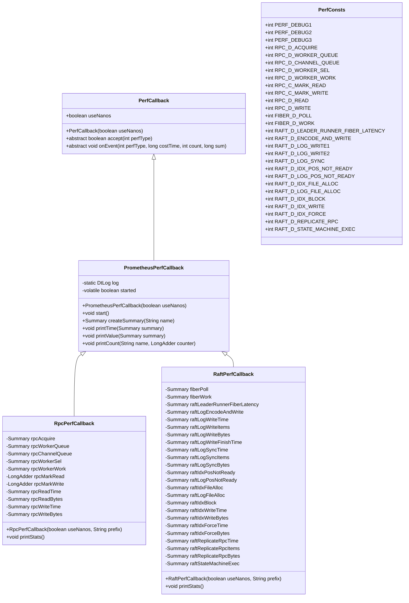
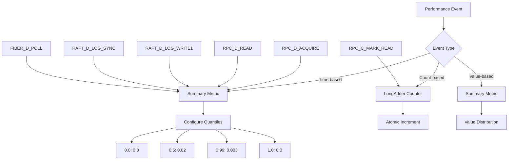
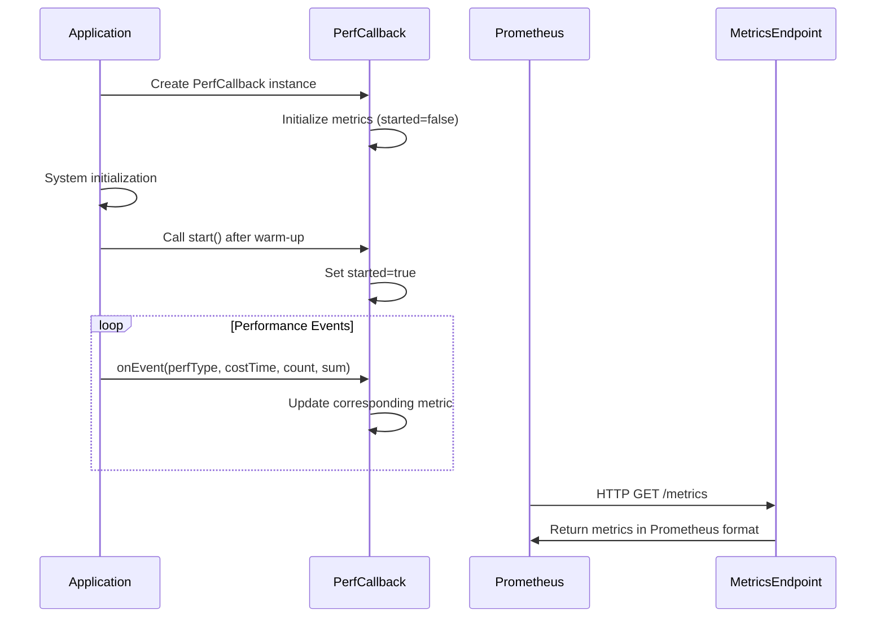

# Prometheus Metrics Integration

<cite>
**Referenced Files in This Document**   
- [PrometheusPerfCallback.java](file://benchmark/src/main/java/com/github/dtprj/dongting/bench/common/PrometheusPerfCallback.java)
- [RpcPerfCallback.java](file://benchmark/src/main/java/com/github/dtprj/dongting/bench/rpc/RpcPerfCallback.java)
- [RaftPerfCallback.java](file://benchmark/src/main/java/com/github/dtprj/dongting/bench/raft/RaftPerfCallback.java)
- [PerfCallback.java](file://client/src/main/java/com/github/dtprj/dongting/common/PerfCallback.java)
- [PerfConsts.java](file://client/src/main/java/com/github/dtprj/dongting/common/PerfConsts.java)
- [RpcBenchmark.java](file://benchmark/src/main/java/com/github/dtprj/dongting/bench/rpc/RpcBenchmark.java)
- [RaftBenchmark.java](file://benchmark/src/main/java/com/github/dtprj/dongting/bench/raft/RaftBenchmark.java)
- [pom.xml](file://benchmark/pom.xml)
</cite>

## Table of Contents
1. [Introduction](#introduction)
2. [Architecture Overview](#architecture-overview)
3. [Core Components](#core-components)
4. [Metric Type Mapping](#metric-type-mapping)
5. [Configuration and Setup](#configuration-and-setup)
6. [Monitoring Best Practices](#monitoring-best-practices)
7. [Security Considerations](#security-considerations)
8. [Performance Implications](#performance-implications)
9. [Conclusion](#conclusion)

## Introduction

The Dongting project implements Prometheus integration through the `PrometheusPerfCallback` class, which serves as a bridge between the internal performance instrumentation system and Prometheus monitoring. This integration enables comprehensive monitoring of system performance by exposing key metrics that can be scraped by Prometheus servers. The implementation is designed for benchmarking and performance analysis, providing detailed insights into RPC, fiber, and Raft protocol operations.

The integration leverages the Prometheus Java client library to expose metrics in a format compatible with Prometheus scraping. The system is built around a callback-based performance monitoring framework that captures various performance events and translates them into appropriate Prometheus metric types. This document explains the architecture, configuration, and best practices for using this integration effectively.

**Section sources**
- [PrometheusPerfCallback.java](file://benchmark/src/main/java/com/github/dtprj/dongting/bench/common/PrometheusPerfCallback.java#L1-L103)

## Architecture Overview

The Prometheus integration in Dongting follows a layered architecture that connects the internal performance instrumentation system with external monitoring tools. At the core of this architecture is the `PerfCallback` interface, which defines the contract for performance monitoring callbacks. The `PrometheusPerfCallback` class extends this interface to provide Prometheus-specific functionality.

The architecture consists of several key components:
- The base `PerfCallback` interface that defines the performance monitoring contract
- The abstract `PrometheusPerfCallback` class that implements Prometheus integration
- Concrete implementations like `RpcPerfCallback` and `RaftPerfCallback` for specific subsystems
- Performance constants defined in `PerfConsts` that identify different performance events

The integration works by intercepting performance events from various subsystems (RPC, fiber, Raft) and converting them into Prometheus metrics. When a performance event occurs, the system calls the appropriate callback method, which then updates the corresponding Prometheus metric. This approach allows for detailed performance monitoring without tightly coupling the core system components to the monitoring infrastructure.

**Diagram sources **
- [PerfCallback.java](file://client/src/main/java/com/github/dtprj/dongting/common/PerfCallback.java#L21-L110)
- [PrometheusPerfCallback.java](file://benchmark/src/main/java/com/github/dtprj/dongting/bench/common/PrometheusPerfCallback.java#L31-L101)
- [RpcPerfCallback.java](file://benchmark/src/main/java/com/github/dtprj/dongting/bench/rpc/RpcPerfCallback.java#L26-L51)
- [RaftPerfCallback.java](file://benchmark/src/main/java/com/github/dtprj/dongting/bench/raft/RaftPerfCallback.java#L26-L78)
- [PerfConsts.java](file://client/src/main/java/com/github/dtprj/dongting/common/PerfConsts.java#L21-L53)

## Core Components

The Prometheus integration in Dongting is built around several core components that work together to provide comprehensive performance monitoring. The foundation of this system is the `PerfCallback` interface, which defines the contract for performance monitoring callbacks. This interface includes methods for accepting performance events and processing them.

The `PrometheusPerfCallback` class extends `PerfCallback` to provide Prometheus-specific functionality. It includes utility methods for creating Summary metrics, printing time-based statistics, and printing value-based statistics. The class uses reflection to extract metric names from Prometheus collectors, which allows for consistent naming and labeling of metrics.

Concrete implementations like `RpcPerfCallback` and `RaftPerfCallback` extend `PrometheusPerfCallback` to monitor specific subsystems. These classes define Summary metrics for various performance aspects of their respective subsystems and implement the `onEvent` method to update these metrics based on performance events. For example, `RpcPerfCallback` monitors RPC acquisition time, worker queue time, channel queue time, and network I/O operations.

The integration also includes the `PerfConsts` interface, which defines constants for different performance event types. These constants are used to identify specific performance events when they are reported to the callback system. This approach provides a type-safe way to handle different performance events and ensures consistency across the system.

**Section sources**
- [PrometheusPerfCallback.java](file://benchmark/src/main/java/com/github/dtprj/dongting/bench/common/PrometheusPerfCallback.java#L31-L101)
- [PerfCallback.java](file://client/src/main/java/com/github/dtprj/dongting/common/PerfCallback.java#L21-L110)
- [PerfConsts.java](file://client/src/main/java/com/github/dtprj/dongting/common/PerfConsts.java#L21-L53)

## Metric Type Mapping

The Dongting Prometheus integration maps internal performance events to appropriate Prometheus metric types based on the nature of the data being collected. The primary metric type used is Summary, which is well-suited for capturing latency distributions and other time-based measurements.

For time-based performance events, the system uses Summary metrics with predefined quantiles (0.0, 0.5, 0.99, 1.0) to capture the distribution of values. This allows for detailed analysis of latency characteristics, including median (p50) and tail latency (p99). The quantile error tolerances are configured to provide accurate measurements while minimizing resource usage.

For count-based metrics, the system uses LongAdder counters in conjunction with Summary metrics. The LongAdder provides high-performance atomic counting, while the Summary captures the distribution of values. This combination allows for both precise counting and distribution analysis.

The mapping between Dongting performance events and Prometheus metrics is defined in the concrete `PerfCallback` implementations. For example, in `RpcPerfCallback`, the `RPC_D_ACQUIRE` event type is mapped to the `rpc_acquire` Summary metric, which captures the time taken to acquire RPC resources. Similarly, `RPC_D_READ` is mapped to both `rpc_read_time` and `rpc_read_bytes` metrics to capture both the duration and volume of read operations.

**Diagram sources **
- [PrometheusPerfCallback.java](file://benchmark/src/main/java/com/github/dtprj/dongting/bench/common/PrometheusPerfCallback.java#L40-L48)
- [RpcPerfCallback.java](file://benchmark/src/main/java/com/github/dtprj/dongting/bench/rpc/RpcPerfCallback.java#L28-L39)
- [RaftPerfCallback.java](file://benchmark/src/main/java/com/github/dtprj/dongting/bench/raft/RaftPerfCallback.java#L26-L78)

## Configuration and Setup

Setting up Prometheus metric collection in Dongting involves configuring the appropriate `PerfCallback` implementation and enabling it in the system configuration. The process begins with adding the Prometheus client dependency to the project, which is already included in the benchmark module's pom.xml file.

To enable metrics collection, the `PerfCallback` instance must be configured in the relevant system components. For example, in the RPC subsystem, the `RpcPerfCallback` is set in the `NioClientConfig` or `NioServerConfig` as shown in the `RpcBenchmark` class. The callback is instantiated with a boolean indicating whether to use nanoseconds for timing and a prefix for metric names.

The metrics collection is controlled by the `started` flag in the `PrometheusPerfCallback` class. Initially, this flag is set to false to avoid collecting metrics during system initialization. The `start()` method is called after the warm-up period to begin collecting metrics, ensuring that the collected data represents steady-state performance.

Export intervals are not explicitly configured in the current implementation, as the metrics are continuously updated whenever performance events occur. However, the Prometheus client library handles the exposure of metrics through its default HTTP server, which can be scraped by Prometheus at the configured interval.

**Diagram sources **
- [RpcBenchmark.java](file://benchmark/src/main/java/com/github/dtprj/dongting/bench/rpc/RpcBenchmark.java#L69-L80)
- [RaftBenchmark.java](file://benchmark/src/main/java/com/github/dtprj/dongting/bench/raft/RaftBenchmark.java#L100-L102)
- [PrometheusPerfCallback.java](file://benchmark/src/main/java/com/github/dtprj/dongting/bench/common/PrometheusPerfCallback.java#L51-L53)

## Monitoring Best Practices

When using the Dongting Prometheus integration in production environments, several best practices should be followed to ensure effective monitoring while minimizing performance impact. First, it's important to carefully select which metrics to expose based on their value for monitoring and debugging. Not all performance metrics may be necessary for production monitoring, and exposing too many metrics can increase resource usage and make it harder to identify important issues.

One critical consideration is avoiding high-cardinality labels, which can lead to an explosion in the number of time series and significantly impact Prometheus server performance. In the current Dongting implementation, metrics are named with prefixes (e.g., "server_" or "client_") rather than using labels, which helps prevent high-cardinality issues. When customizing metrics, avoid adding labels with high-cardinality values such as request IDs, user IDs, or timestamps.

Effective alerting rules should be based on meaningful performance indicators rather than raw metrics. For example, instead of alerting on individual RPC latency, consider alerting on the 99th percentile latency exceeding a threshold, which indicates tail latency issues that may affect user experience. The Summary metrics with predefined quantiles make it easy to create such alerts.

Regularly review and refine the set of exposed metrics to ensure they continue to provide value. As the system evolves, some metrics may become less relevant while new performance characteristics emerge that warrant monitoring. The modular design of the `PerfCallback` system makes it easy to add or remove metrics as needed.

**Section sources**
- [RpcPerfCallback.java](file://benchmark/src/main/java/com/github/dtprj/dongting/bench/rpc/RpcPerfCallback.java#L26-L51)
- [RaftPerfCallback.java](file://benchmark/src/main/java/com/github/dtprj/dongting/bench/raft/RaftPerfCallback.java#L26-L78)
- [PrometheusPerfCallback.java](file://benchmark/src/main/java/com/github/dtprj/dongting/bench/common/PrometheusPerfCallback.java#L40-L48)

## Security Considerations

Exposing metrics endpoints for Prometheus scraping introduces several security considerations that must be addressed in production environments. The current implementation in Dongting does not include built-in security features for the metrics endpoint, so additional measures should be implemented to protect sensitive information.

One important consideration is that performance metrics may contain information about system internals that could be valuable to attackers. For example, metrics showing high RPC latency or fiber utilization could indicate system bottlenecks that might be exploited. To mitigate this risk, access to the metrics endpoint should be restricted to authorized monitoring systems using network-level controls such as firewalls or security groups.

In environments where additional security is required, consider implementing authentication and authorization for the metrics endpoint. This could be done at the network level (e.g., IP whitelisting) or application level (e.g., requiring API keys or tokens). The metrics should also be served over HTTPS to prevent eavesdropping and ensure data integrity.

Another consideration is the potential for the metrics endpoint to be used as an attack vector. An attacker could repeatedly scrape the endpoint to generate load on the system. To mitigate this risk, implement rate limiting on the metrics endpoint and monitor access patterns for suspicious activity.

**Section sources**
- [PrometheusPerfCallback.java](file://benchmark/src/main/java/com/github/dtprj/dongting/bench/common/PrometheusPerfCallback.java#L31-L101)

## Performance Implications

Continuous metrics collection has performance implications that should be carefully considered when using the Dongting Prometheus integration. The act of collecting and updating metrics introduces overhead that can affect system performance, particularly in high-throughput scenarios.

The primary performance impact comes from the atomic operations required to update metrics. Summary metrics involve updating multiple values (count, sum, and quantile estimators) for each observation, which requires synchronization. The LongAdder counters used for counting operations also involve atomic operations that can create contention in highly concurrent environments.

The reflection-based name extraction in the `getName` method of `PrometheusPerfCallback` adds additional overhead, as it requires accessing private fields through reflection. While this operation is not performed on the critical path of metric updates, it does contribute to the overall resource usage of the monitoring system.

To minimize performance impact, the integration includes a `started` flag that allows metrics collection to be disabled during system initialization and enabled only when needed. This approach ensures that metrics are not collected during warm-up periods or when not actively monitoring performance.

In production environments, consider sampling metrics rather than collecting every event, or use less frequent metric updates for non-critical performance indicators. The current implementation does not include sampling, so the performance impact is proportional to the volume of performance events being monitored.

**Section sources**
- [PrometheusPerfCallback.java](file://benchmark/src/main/java/com/github/dtprj/dongting/bench/common/PrometheusPerfCallback.java#L92-L100)
- [RpcPerfCallback.java](file://benchmark/src/main/java/com/github/dtprj/dongting/bench/rpc/RpcPerfCallback.java#L59-L93)
- [RaftPerfCallback.java](file://benchmark/src/main/java/com/github/dtprj/dongting/bench/raft/RaftPerfCallback.java#L86-L147)

## Conclusion

The Prometheus integration in Dongting through the `PrometheusPerfCallback` provides a robust mechanism for bridging the internal performance instrumentation system with external monitoring tools. By leveraging the Prometheus client library and a well-designed callback architecture, the system enables comprehensive monitoring of key performance indicators across various subsystems.

The integration effectively maps Dongting performance events to appropriate Prometheus metric types, primarily using Summary metrics for time-based measurements and LongAdder counters for counting operations. The configuration system allows for flexible setup of metrics collection, with support for custom metric names and prefixes.

When implementing this integration in production environments, it's important to follow monitoring best practices, including careful selection of metrics to expose, avoidance of high-cardinality labels, and creation of effective alerting rules. Security considerations should also be addressed by restricting access to metrics endpoints and protecting sensitive information.

While continuous metrics collection has performance implications, the system is designed to minimize impact through features like the `started` flag that allows controlled activation of metrics collection. By understanding these implications and configuring the system appropriately, organizations can gain valuable insights into system performance without compromising operational efficiency.