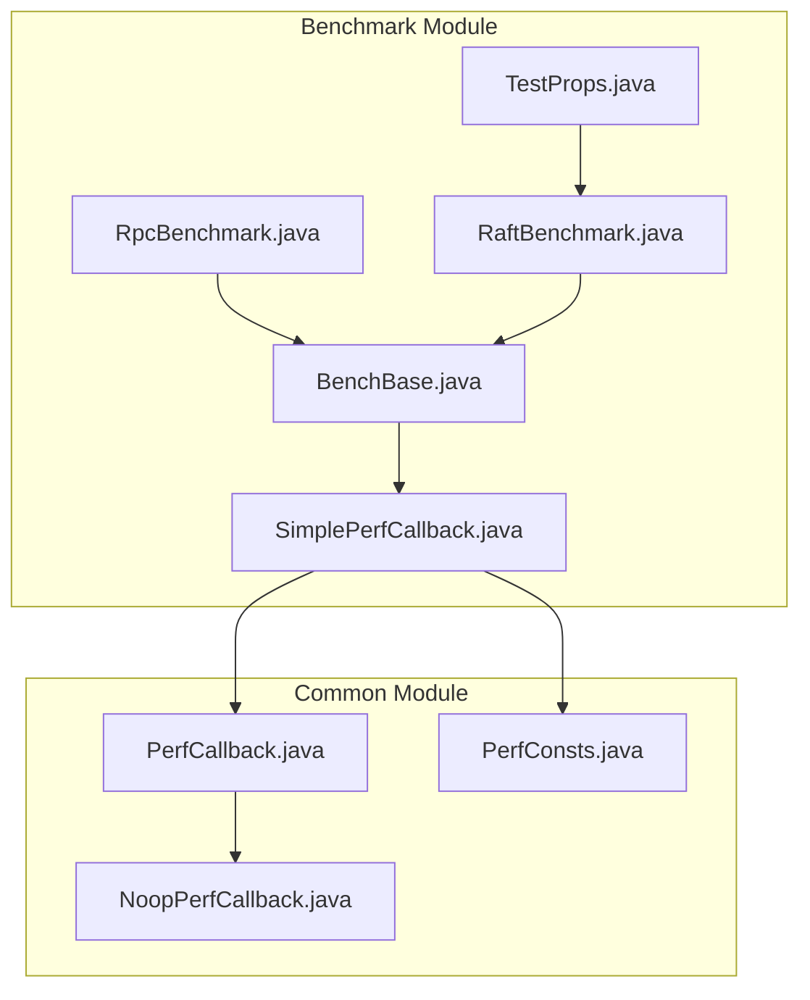
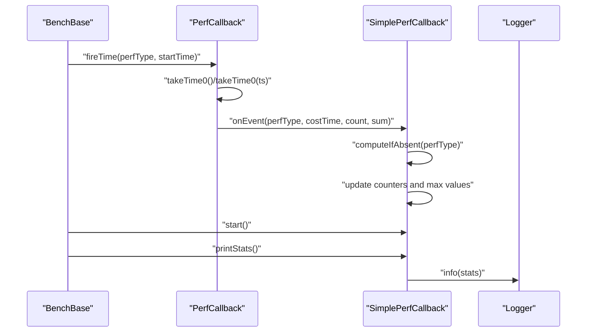
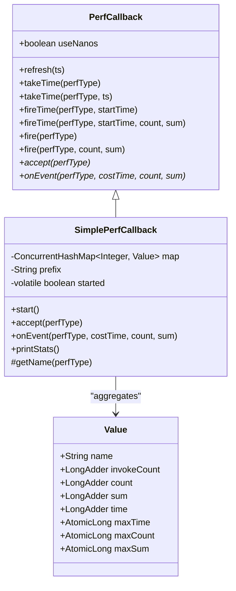
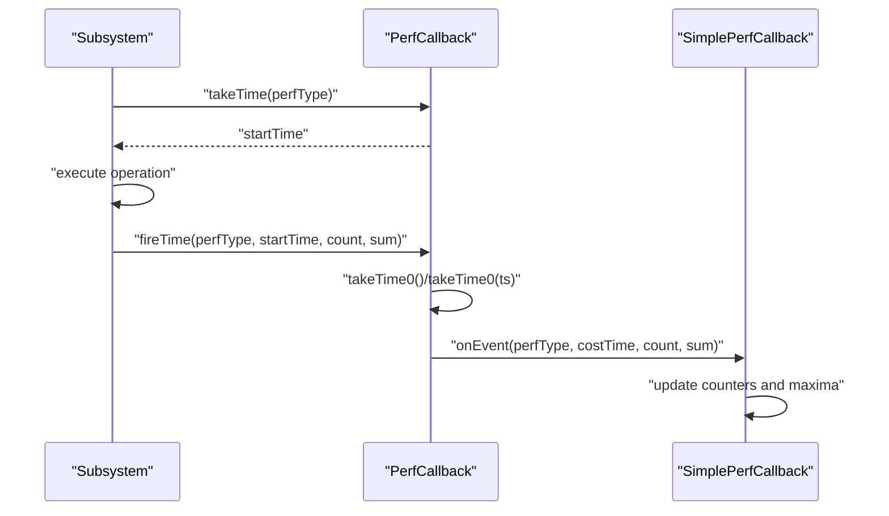
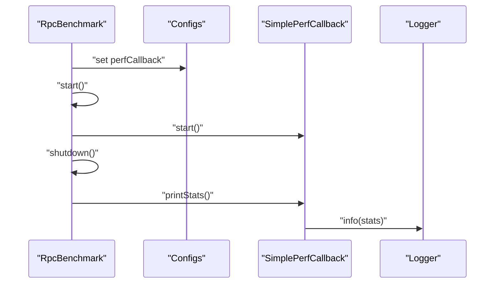
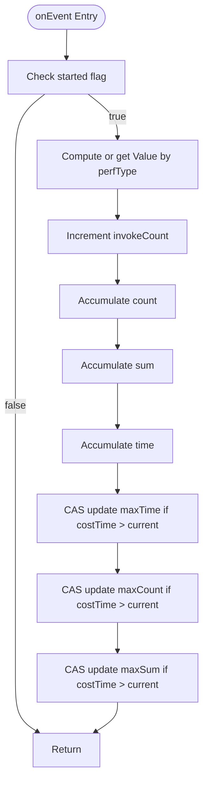
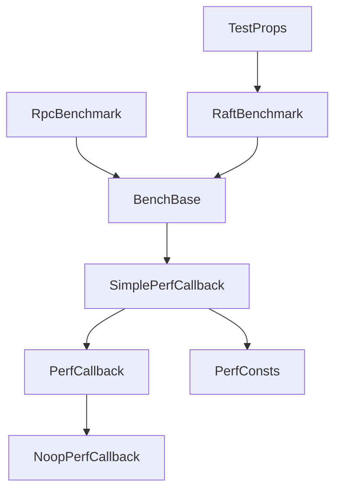

# Simple Performance Metrics

<cite>
**Referenced Files in This Document**
- [SimplePerfCallback.java](file://benchmark/src/main/java/com/github/dtprj/dongting/bench/common/SimplePerfCallback.java)
- [PerfCallback.java](file://client/src/main/java/com/github/dtprj/dongting/common/PerfCallback.java)
- [PerfConsts.java](file://client/src/main/java/com/github/dtprj/dongting/common/PerfConsts.java)
- [NoopPerfCallback.java](file://client/src/main/java/com/github/dtprj/dongting/common/NoopPerfCallback.java)
- [TestProps.java](file://benchmark/src/main/java/com/github/dtprj/dongting/bench/common/TestProps.java)
- [BenchBase.java](file://benchmark/src/main/java/com/github/dtprj/dongting/bench/common/BenchBase.java)
- [RpcBenchmark.java](file://benchmark/src/main/java/com/github/dtprj/dongting/bench/rpc/RpcBenchmark.java)
- [RaftBenchmark.java](file://benchmark/src/main/java/com/github/dtprj/dongting/bench/raft/RaftBenchmark.java)
</cite>

## Table of Contents
1. [Introduction](#introduction)
2. [Project Structure](#project-structure)
3. [Core Components](#core-components)
4. [Architecture Overview](#architecture-overview)
5. [Detailed Component Analysis](#detailed-component-analysis)
6. [Dependency Analysis](#dependency-analysis)
7. [Performance Considerations](#performance-considerations)
8. [Troubleshooting Guide](#troubleshooting-guide)
9. [Conclusion](#conclusion)
10. [Appendices](#appendices)

## Introduction
This document explains the SimplePerfCallback implementation for collecting lightweight performance metrics with minimal overhead. It covers how invocation counting, time measurement, and maximum value tracking are aggregated across multiple events and threads, the internal data structures used for aggregation, configuration options via TestProps, practical usage patterns for benchmarking specific code paths, interpretation of output statistics (count, total time, max time), and integration into custom performance tests. It also includes troubleshooting guidance for timing accuracy and thread-safety considerations.

## Project Structure
SimplePerfCallback resides in the benchmark module alongside other performance callbacks and benchmark harnesses. It extends the common PerfCallback abstraction and integrates with the broader benchmarking framework.

**Diagram sources**
- [SimplePerfCallback.java](file://benchmark/src/main/java/com/github/dtprj/dongting/bench/common/SimplePerfCallback.java#L1-L152)
- [PerfCallback.java](file://client/src/main/java/com/github/dtprj/dongting/common/PerfCallback.java#L1-L110)
- [PerfConsts.java](file://client/src/main/java/com/github/dtprj/dongting/common/PerfConsts.java#L1-L54)
- [NoopPerfCallback.java](file://client/src/main/java/com/github/dtprj/dongting/common/NoopPerfCallback.java#L1-L66)
- [TestProps.java](file://benchmark/src/main/java/com/github/dtprj/dongting/bench/common/TestProps.java#L1-L47)
- [BenchBase.java](file://benchmark/src/main/java/com/github/dtprj/dongting/bench/common/BenchBase.java#L1-L153)
- [RpcBenchmark.java](file://benchmark/src/main/java/com/github/dtprj/dongting/bench/rpc/RpcBenchmark.java#L1-L162)
- [RaftBenchmark.java](file://benchmark/src/main/java/com/github/dtprj/dongting/bench/raft/RaftBenchmark.java#L1-L229)

**Section sources**
- [SimplePerfCallback.java](file://benchmark/src/main/java/com/github/dtprj/dongting/bench/common/SimplePerfCallback.java#L1-L152)
- [PerfCallback.java](file://client/src/main/java/com/github/dtprj/dongting/common/PerfCallback.java#L1-L110)
- [PerfConsts.java](file://client/src/main/java/com/github/dtprj/dongting/common/PerfConsts.java#L1-L54)
- [NoopPerfCallback.java](file://client/src/main/java/com/github/dtprj/dongting/common/NoopPerfCallback.java#L1-L66)
- [TestProps.java](file://benchmark/src/main/java/com/github/dtprj/dongting/bench/common/TestProps.java#L1-L47)
- [BenchBase.java](file://benchmark/src/main/java/com/github/dtprj/dongting/bench/common/BenchBase.java#L1-L153)
- [RpcBenchmark.java](file://benchmark/src/main/java/com/github/dtprj/dongting/bench/rpc/RpcBenchmark.java#L1-L162)
- [RaftBenchmark.java](file://benchmark/src/main/java/com/github/dtprj/dongting/bench/raft/RaftBenchmark.java#L1-L229)

## Core Components
- SimplePerfCallback: A concrete PerfCallback that aggregates invocation counts, total time, and maximum values per perf type. It uses concurrent data structures for thread-safe accumulation and prints per-type statistics.
- PerfCallback: The abstract base providing timing helpers and event firing APIs. It supports nanosecond or millisecond resolution based on constructor flag.
- PerfConsts: Defines numeric identifiers for perf types (RPC, fiber, Raft stages).
- NoopPerfCallback: A zero-cost callback that accepts no events and returns immediately, useful for disabling metrics.
- TestProps: Loads configuration from a user home config file for benchmarks.
- BenchBase: Provides benchmark lifecycle hooks and runtime logging utilities.

Key capabilities:
- Minimal overhead: Uses LongAdder for counters and AtomicLong for max tracking to reduce contention.
- Per-type aggregation: Maintains separate statistics per perf type via a ConcurrentHashMap keyed by perf type.
- Flexible timing: Supports nanosecond or millisecond resolution depending on constructor argument.
- Controlled enablement: start() toggles whether metrics are collected.

**Section sources**
- [SimplePerfCallback.java](file://benchmark/src/main/java/com/github/dtprj/dongting/bench/common/SimplePerfCallback.java#L1-L152)
- [PerfCallback.java](file://client/src/main/java/com/github/dtprj/dongting/common/PerfCallback.java#L1-L110)
- [PerfConsts.java](file://client/src/main/java/com/github/dtprj/dongting/common/PerfConsts.java#L1-L54)
- [NoopPerfCallback.java](file://client/src/main/java/com/github/dtprj/dongting/common/NoopPerfCallback.java#L1-L66)
- [TestProps.java](file://benchmark/src/main/java/com/github/dtprj/dongting/bench/common/TestProps.java#L1-L47)
- [BenchBase.java](file://benchmark/src/main/java/com/github/dtprj/dongting/bench/common/BenchBase.java#L1-L153)

## Architecture Overview
SimplePerfCallback extends PerfCallback and participates in the benchmarking lifecycle. Benchmarks configure perf callbacks during initialization and start them after warmup. Metrics are fired from subsystems using PerfCallback’s fire/fireTime methods and collected by SimplePerfCallback.

**Diagram sources**
- [PerfCallback.java](file://client/src/main/java/com/github/dtprj/dongting/common/PerfCallback.java#L37-L108)
- [SimplePerfCallback.java](file://benchmark/src/main/java/com/github/dtprj/dongting/bench/common/SimplePerfCallback.java#L57-L151)
- [BenchBase.java](file://benchmark/src/main/java/com/github/dtprj/dongting/bench/common/BenchBase.java#L65-L108)

## Detailed Component Analysis

### SimplePerfCallback Implementation
SimplePerfCallback provides:
- Invocation counting: LongAdder per perf type to track call counts.
- Time measurement: Accumulates total elapsed time per perf type.
- Maximum tracking: AtomicLong fields track max time, max count, and max sum.
- Per-type naming: getName maps perf type constants to human-readable names with a configurable prefix.
- Thread safety: ConcurrentHashMap for per-type storage and LongAdder/AtomicLong for updates.
- Output: printStats computes averages and logs formatted statistics.

Internal data structures:
- ConcurrentHashMap<Integer, Value> map: Stores per-type statistics keyed by perf type.
- Value class fields:
  - invokeCount: LongAdder for invocation count.
  - count: LongAdder for accumulated count metric.
  - sum: LongAdder for accumulated sum metric.
  - time: LongAdder for total elapsed time.
  - maxTime: AtomicLong for maximum observed elapsed time.
  - maxCount: AtomicLong for maximum observed count.
  - maxSum: AtomicLong for maximum observed sum.

Behavior highlights:
- accept returns started flag to gate collection.
- onEvent atomically increments counters and updates maxima using compare-and-set loops.
- getName maps PerfConsts constants to prefixed names.
- start toggles collection on/off.

**Diagram sources**
- [PerfCallback.java](file://client/src/main/java/com/github/dtprj/dongting/common/PerfCallback.java#L1-L110)
- [SimplePerfCallback.java](file://benchmark/src/main/java/com/github/dtprj/dongting/bench/common/SimplePerfCallback.java#L1-L152)

**Section sources**
- [SimplePerfCallback.java](file://benchmark/src/main/java/com/github/dtprj/dongting/bench/common/SimplePerfCallback.java#L26-L151)
- [PerfCallback.java](file://client/src/main/java/com/github/dtprj/dongting/common/PerfCallback.java#L21-L108)
- [PerfConsts.java](file://client/src/main/java/com/github/dtprj/dongting/common/PerfConsts.java#L1-L54)

### PerfCallback Timing and Event Flow
PerfCallback provides:
- takeTime: returns current time in nanoseconds or milliseconds depending on constructor flag.
- fireTime: calculates elapsed time and dispatches onEvent.
- accept/onEvent: abstract hooks for subclasses to decide whether to collect and how to aggregate.

**Diagram sources**
- [PerfCallback.java](file://client/src/main/java/com/github/dtprj/dongting/common/PerfCallback.java#L37-L108)
- [SimplePerfCallback.java](file://benchmark/src/main/java/com/github/dtprj/dongting/bench/common/SimplePerfCallback.java#L57-L125)

**Section sources**
- [PerfCallback.java](file://client/src/main/java/com/github/dtprj/dongting/common/PerfCallback.java#L37-L108)

### Benchmark Integration Patterns
- RpcBenchmark demonstrates enabling perf callbacks on server and client configs, starting them after warmup, and printing stats during shutdown.
- RaftBenchmark shows configuring perf callbacks on Raft group configs and printing stats after shutdown.

**Diagram sources**
- [RpcBenchmark.java](file://benchmark/src/main/java/com/github/dtprj/dongting/bench/rpc/RpcBenchmark.java#L63-L124)
- [RaftBenchmark.java](file://benchmark/src/main/java/com/github/dtprj/dongting/bench/raft/RaftBenchmark.java#L173-L196)
- [SimplePerfCallback.java](file://benchmark/src/main/java/com/github/dtprj/dongting/bench/common/SimplePerfCallback.java#L127-L151)

**Section sources**
- [RpcBenchmark.java](file://benchmark/src/main/java/com/github/dtprj/dongting/bench/rpc/RpcBenchmark.java#L63-L124)
- [RaftBenchmark.java](file://benchmark/src/main/java/com/github/dtprj/dongting/bench/raft/RaftBenchmark.java#L173-L196)

### Data Aggregation Flow
The following flowchart illustrates how SimplePerfCallback aggregates metrics per perf type:

**Diagram sources**
- [SimplePerfCallback.java](file://benchmark/src/main/java/com/github/dtprj/dongting/bench/common/SimplePerfCallback.java#L57-L91)

**Section sources**
- [SimplePerfCallback.java](file://benchmark/src/main/java/com/github/dtprj/dongting/bench/common/SimplePerfCallback.java#L57-L91)

## Dependency Analysis
- SimplePerfCallback depends on PerfCallback for timing and event dispatch, and on PerfConsts for perf type identifiers.
- BenchBase orchestrates benchmark lifecycle and interacts with perf callbacks indirectly via benchmark-specific classes.
- TestProps provides configuration loading for benchmarks, enabling environment-driven tuning.

**Diagram sources**
- [SimplePerfCallback.java](file://benchmark/src/main/java/com/github/dtprj/dongting/bench/common/SimplePerfCallback.java#L1-L152)
- [PerfCallback.java](file://client/src/main/java/com/github/dtprj/dongting/common/PerfCallback.java#L1-L110)
- [PerfConsts.java](file://client/src/main/java/com/github/dtprj/dongting/common/PerfConsts.java#L1-L54)
- [NoopPerfCallback.java](file://client/src/main/java/com/github/dtprj/dongting/common/NoopPerfCallback.java#L1-L66)
- [BenchBase.java](file://benchmark/src/main/java/com/github/dtprj/dongting/bench/common/BenchBase.java#L1-L153)
- [RpcBenchmark.java](file://benchmark/src/main/java/com/github/dtprj/dongting/bench/rpc/RpcBenchmark.java#L1-L162)
- [RaftBenchmark.java](file://benchmark/src/main/java/com/github/dtprj/dongting/bench/raft/RaftBenchmark.java#L1-L229)
- [TestProps.java](file://benchmark/src/main/java/com/github/dtprj/dongting/bench/common/TestProps.java#L1-L47)

**Section sources**
- [SimplePerfCallback.java](file://benchmark/src/main/java/com/github/dtprj/dongting/bench/common/SimplePerfCallback.java#L1-L152)
- [PerfCallback.java](file://client/src/main/java/com/github/dtprj/dongting/common/PerfCallback.java#L1-L110)
- [PerfConsts.java](file://client/src/main/java/com/github/dtprj/dongting/common/PerfConsts.java#L1-L54)
- [NoopPerfCallback.java](file://client/src/main/java/com/github/dtprj/dongting/common/NoopPerfCallback.java#L1-L66)
- [BenchBase.java](file://benchmark/src/main/java/com/github/dtprj/dongting/bench/common/BenchBase.java#L1-L153)
- [RpcBenchmark.java](file://benchmark/src/main/java/com/github/dtprj/dongting/bench/rpc/RpcBenchmark.java#L1-L162)
- [RaftBenchmark.java](file://benchmark/src/main/java/com/github/dtprj/dongting/bench/raft/RaftBenchmark.java#L1-L229)
- [TestProps.java](file://benchmark/src/main/java/com/github/dtprj/dongting/bench/common/TestProps.java#L1-L47)

## Performance Considerations
- Overhead characteristics:
  - LongAdder reduces contention for counters compared to synchronized alternatives.
  - AtomicLong CAS loops minimize blocking for max tracking.
  - ConcurrentHashMap enables per-type isolation across threads.
- Resolution choice:
  - useNanos constructor flag determines whether to use nanosecond or millisecond resolution. Nanosecond resolution yields finer-grained timing but may incur higher overhead.
- Memory footprint:
  - Each perf type creates a Value entry; keep the number of distinct perf types reasonable to avoid excessive map growth.
- Output cost:
  - printStats iterates the map and computes averages; call it sparingly in hot paths.

[No sources needed since this section provides general guidance]

## Troubleshooting Guide
Common issues and remedies:
- Inaccurate timing measurements:
  - Ensure useNanos is set appropriately for desired precision.
  - Verify that takeTime is invoked consistently around the measured operation and that startTime is non-zero when firing events.
  - Confirm that accept returns true during the period you intend to measure.
- Thread-safety considerations:
  - SimplePerfCallback is designed to be thread-safe; however, ensure that start() is called after all threads have started measuring to avoid missing early events.
  - Avoid concurrent modifications to the map entries; SimplePerfCallback manages this internally.
- Missing metrics:
  - If accept always returns false, no metrics will be recorded. Call start() to enable collection.
  - Ensure perf types match PerfConsts constants used by the subsystems emitting events.
- Interpreting output:
  - count: number of invocations per perf type.
  - total time: cumulative elapsed time for the perf type.
  - max time: maximum observed elapsed time for a single invocation.
  - avg time: total time divided by count.
  - avg count and avg sum: averages of count and sum metrics per invocation.

**Section sources**
- [PerfCallback.java](file://client/src/main/java/com/github/dtprj/dongting/common/PerfCallback.java#L37-L108)
- [SimplePerfCallback.java](file://benchmark/src/main/java/com/github/dtprj/dongting/bench/common/SimplePerfCallback.java#L57-L151)

## Conclusion
SimplePerfCallback offers a lightweight, thread-safe mechanism to collect invocation counts, total elapsed time, and maximum values per perf type. Its design minimizes overhead while providing actionable statistics suitable for benchmarking. By integrating with PerfCallback and leveraging PerfConsts, it fits seamlessly into the benchmarking framework. Use TestProps for environment-driven configuration and follow the benchmark patterns shown in RpcBenchmark and RaftBenchmark to enable, start, and print metrics reliably.

[No sources needed since this section summarizes without analyzing specific files]

## Appendices

### Configuration Options via TestProps
- TestProps loads a configuration file from the user’s home directory and exposes getters for key-value pairs.
- Example usage: RaftBenchmark reads a data directory property from TestProps to configure Raft group data directories.

Practical tips:
- Place a configuration file at ~/.dt-test with key-value pairs for environment-specific tuning.
- Use keys aligned with benchmark configuration needs (e.g., directories, flags).

**Section sources**
- [TestProps.java](file://benchmark/src/main/java/com/github/dtprj/dongting/bench/common/TestProps.java#L1-L47)
- [RaftBenchmark.java](file://benchmark/src/main/java/com/github/dtprj/dongting/bench/raft/RaftBenchmark.java#L95-L102)

### How to Use SimplePerfCallback for Benchmarking Specific Code Paths
Steps:
1. Instantiate SimplePerfCallback with a prefix to distinguish metrics.
2. Enable perf callbacks in the relevant subsystems (e.g., server/client or Raft group).
3. Start metrics collection after warmup completes.
4. Run the benchmark workload.
5. Print statistics during shutdown to review aggregated metrics.

Reference examples:
- RpcBenchmark: Enables perf callbacks on server and client configs, starts them after warmup, and prints stats during shutdown.
- RaftBenchmark: Configures perf callbacks on Raft group configs and prints stats after shutdown.

**Section sources**
- [RpcBenchmark.java](file://benchmark/src/main/java/com/github/dtprj/dongting/bench/rpc/RpcBenchmark.java#L63-L124)
- [RaftBenchmark.java](file://benchmark/src/main/java/com/github/dtprj/dongting/bench/raft/RaftBenchmark.java#L173-L196)
- [SimplePerfCallback.java](file://benchmark/src/main/java/com/github/dtprj/dongting/bench/common/SimplePerfCallback.java#L127-L151)

### Interpreting Output Statistics
- count: Number of invocations per perf type.
- total time: Sum of elapsed times for all invocations.
- avg time: Average elapsed time per invocation.
- max time: Maximum elapsed time observed for a single invocation.
- avg count and avg sum: Averages of auxiliary metrics per invocation.

These metrics help identify hotspots and outliers across different stages of your system.

**Section sources**
- [SimplePerfCallback.java](file://benchmark/src/main/java/com/github/dtprj/dongting/bench/common/SimplePerfCallback.java#L131-L151)