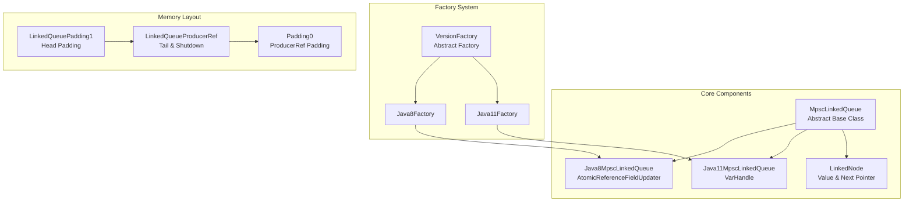
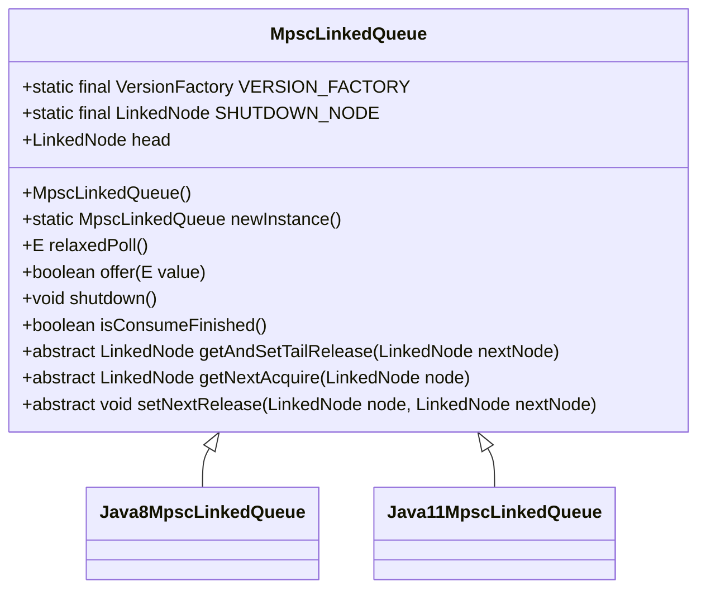
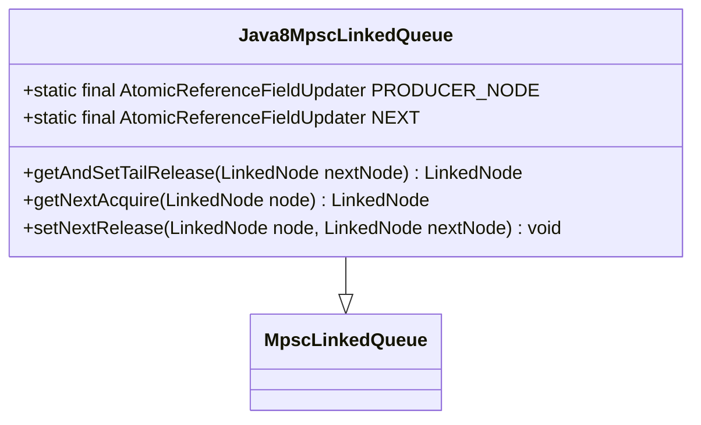
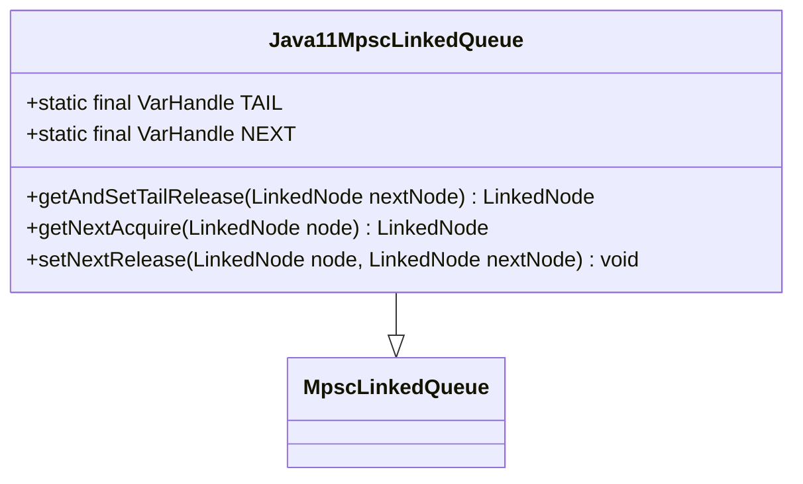
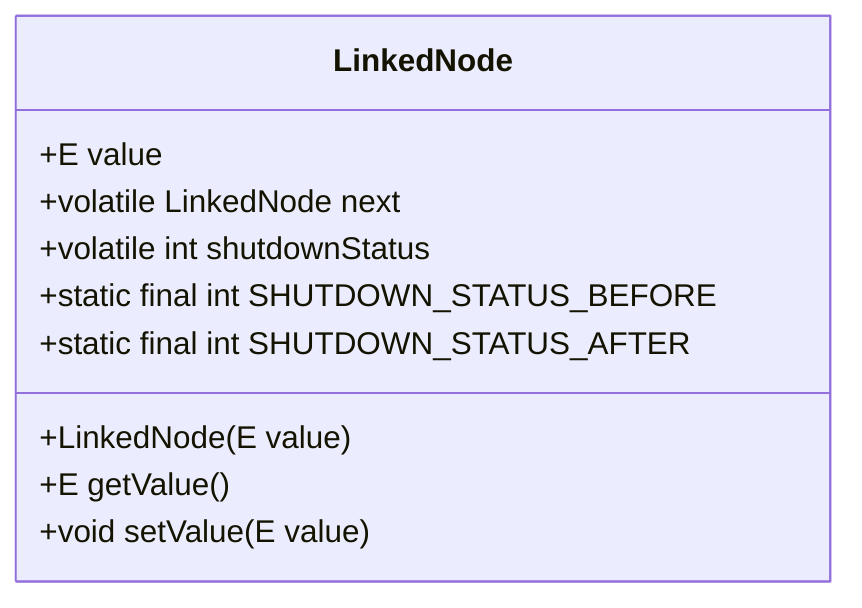
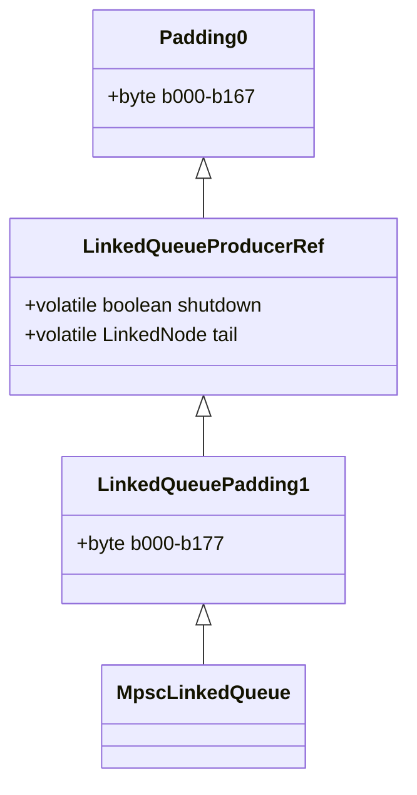
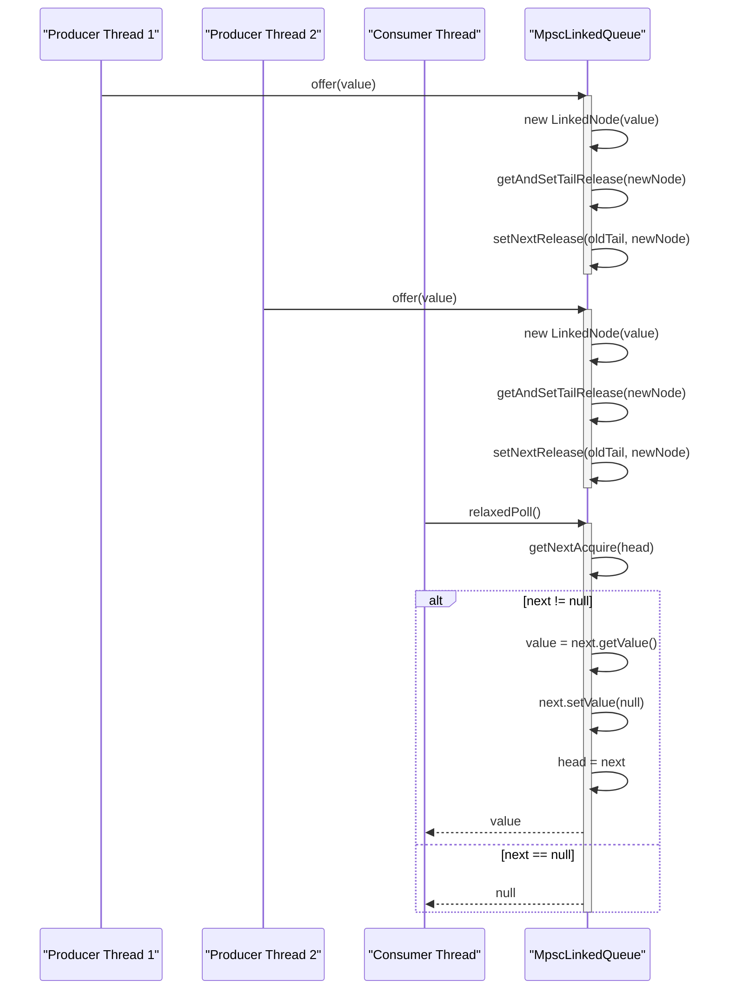
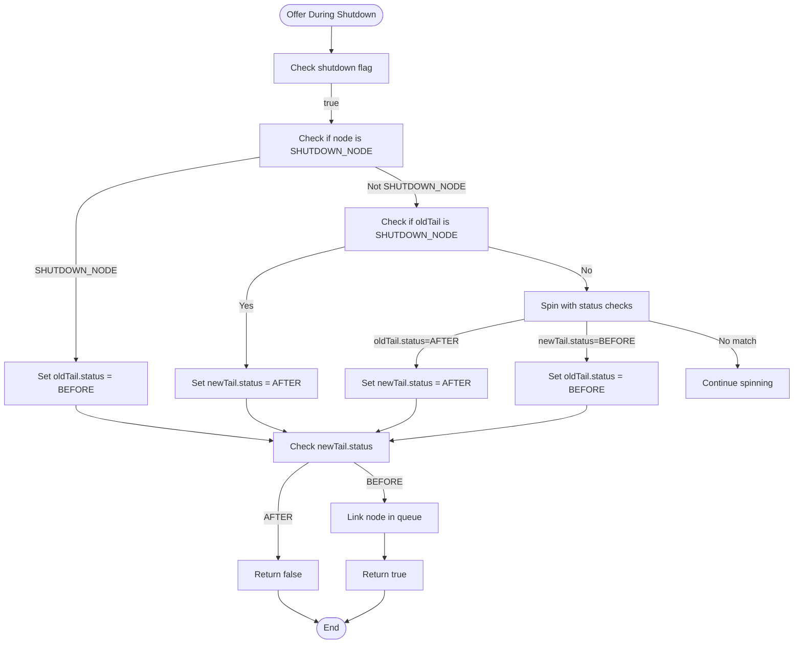
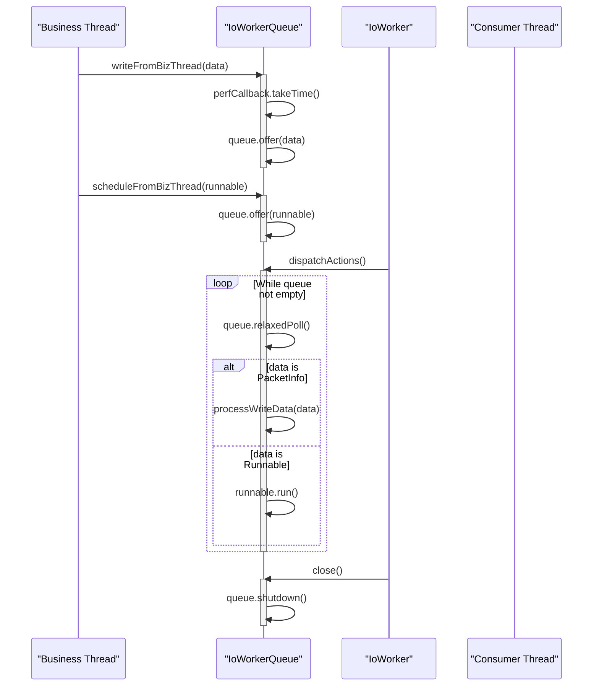

# MPSC Queue Implementation

<cite>
**Referenced Files in This Document**   
- [MpscLinkedQueue.java](file://client/src/main/java/com/github/dtprj/dongting/queue/MpscLinkedQueue.java)
- [Java8MpscLinkedQueue.java](file://client/src/main/java/com/github/dtprj/dongting/java8/Java8MpscLinkedQueue.java)
- [Java11MpscLinkedQueue.java](file://client/src/main/java/com/github/dtprj/dongting/java11/Java11MpscLinkedQueue.java)
- [VersionFactory.java](file://client/src/main/java/com/github/dtprj/dongting/common/VersionFactory.java)
- [Java8Factory.java](file://client/src/main/java/com/github/dtprj/dongting/java8/Java8Factory.java)
- [Java11Factory.java](file://client/src/main/java/com/github/dtprj/dongting/java11/Java11Factory.java)
- [LinkedNode.java](file://client/src/main/java/com/github/dtprj/dongting/queue/LinkedNode.java)
- [LinkedQueuePadding1.java](file://client/src/main/java/com/github/dtprj/dongting/queue/LinkedQueuePadding1.java)
- [LinkedQueueProducerRef.java](file://client/src/main/java/com/github/dtprj/dongting/queue/LinkedQueueProducerRef.java)
- [Padding0.java](file://client/src/main/java/com/github/dtprj/dongting/common/Padding0.java)
- [MpscLinkedQueueTest.java](file://client/src/test/java/com/github/dtprj/dongting/java11/MpscLinkedQueueTest.java)
- [IoWorkerQueue.java](file://client/src/main/java/com/github/dtprj/dongting/net/IoWorkerQueue.java)
- [DtUnsafe.java](file://client/src/main/java/com/github/dtprj/dongting/unsafe/DtUnsafe.java)
</cite>

## Table of Contents
1. [Introduction](#introduction)
2. [Architecture Overview](#architecture-overview)
3. [Core Components](#core-components)
4. [Detailed Component Analysis](#detailed-component-analysis)
5. [Memory Layout and False Sharing Prevention](#memory-layout-and-false-sharing-prevention)
6. [Producer-Consumer Coordination](#producer-consumer-coordination)
7. [Shutdown Propagation Mechanism](#shutdown-propagation-mechanism)
8. [Java Version-Specific Optimizations](#java-version-specific-optimizations)
9. [Integration and Usage Patterns](#integration-and-usage-patterns)
10. [Performance Considerations](#performance-considerations)
11. [Common Issues and Mitigation](#common-issues-and-mitigation)

## Introduction
The MPSC (Multi-Producer Single-Consumer) queue implementation in the Dongting project provides a high-performance, lock-free data structure optimized for scenarios where multiple threads produce data and a single thread consumes it. This document details the design, implementation, and usage of the MpscLinkedQueue and its Java version-specific variants, focusing on the lock-free design using atomic operations, memory layout optimizations, and integration patterns.

**Section sources**
- [MpscLinkedQueue.java](file://client/src/main/java/com/github/dtprj/dongting/queue/MpscLinkedQueue.java#L1-L155)

## Architecture Overview
The MPSC queue architecture is built around a node-based linked structure with specialized implementations for different Java versions. The core design leverages atomic operations and relaxed memory semantics to achieve high throughput while maintaining thread safety. The architecture includes version-specific implementations that utilize the most efficient atomic primitives available for each Java version.



**Diagram sources**
- [MpscLinkedQueue.java](file://client/src/main/java/com/github/dtprj/dongting/queue/MpscLinkedQueue.java#L27-L155)
- [Java8MpscLinkedQueue.java](file://client/src/main/java/com/github/dtprj/dongting/java8/Java8MpscLinkedQueue.java#L27-L57)
- [Java11MpscLinkedQueue.java](file://client/src/main/java/com/github/dtprj/dongting/java11/Java11MpscLinkedQueue.java#L28-L61)
- [VersionFactory.java](file://client/src/main/java/com/github/dtprj/dongting/common/VersionFactory.java#L28-L76)
- [Java8Factory.java](file://client/src/main/java/com/github/dtprj/dongting/java8/Java8Factory.java#L34-L110)
- [Java11Factory.java](file://client/src/main/java/com/github/dtprj/dongting/java11/Java11Factory.java#L33-L79)
- [LinkedNode.java](file://client/src/main/java/com/github/dtprj/dongting/queue/LinkedNode.java#L21-L42)
- [LinkedQueueProducerRef.java](file://client/src/main/java/com/github/dtprj/dongting/queue/LinkedQueueProducerRef.java#L23-L27)
- [LinkedQueuePadding1.java](file://client/src/main/java/com/github/dtprj/dongting/queue/LinkedQueuePadding1.java#L22-L39)
- [Padding0.java](file://client/src/main/java/com/github/dtprj/dongting/common/Padding0.java#L22-L40)

## Core Components
The MPSC queue implementation consists of several core components that work together to provide a high-performance, lock-free queue. The base class MpscLinkedQueue defines the abstract interface and common functionality, while concrete implementations for Java 8 and Java 11 provide optimized atomic operations. The LinkedNode class represents individual queue elements, and the factory system selects the appropriate implementation based on the Java version.

**Section sources**
- [MpscLinkedQueue.java](file://client/src/main/java/com/github/dtprj/dongting/queue/MpscLinkedQueue.java#L27-L155)
- [LinkedNode.java](file://client/src/main/java/com/github/dtprj/dongting/queue/LinkedNode.java#L21-L42)
- [VersionFactory.java](file://client/src/main/java/com/github/dtprj/dongting/common/VersionFactory.java#L28-L76)

## Detailed Component Analysis

### MpscLinkedQueue Analysis
The MpscLinkedQueue class serves as the abstract base for the MPSC queue implementation. It provides the core queue operations including offer, relaxedPoll, and shutdown, while delegating atomic operations to concrete implementations. The queue uses a linked node structure with separate head and tail pointers to enable lock-free operation.



**Diagram sources**
- [MpscLinkedQueue.java](file://client/src/main/java/com/github/dtprj/dongting/queue/MpscLinkedQueue.java#L27-L155)

### Java8MpscLinkedQueue Analysis
The Java8MpscLinkedQueue implementation uses AtomicReferenceFieldUpdater to provide atomic operations on the tail pointer. This approach is compatible with Java 8's memory model and provides good performance through the use of lazySet for the next pointer update.



**Diagram sources**
- [Java8MpscLinkedQueue.java](file://client/src/main/java/com/github/dtprj/dongting/java8/Java8MpscLinkedQueue.java#L27-L57)

### Java11MpscLinkedQueue Analysis
The Java11MpscLinkedQueue implementation leverages VarHandle for atomic operations, which provides more efficient memory ordering controls compared to AtomicReferenceFieldUpdater. The implementation uses getAndSetRelease for the tail update and getAcquire/setRelease for the next pointer operations.



**Diagram sources**
- [Java11MpscLinkedQueue.java](file://client/src/main/java/com/github/dtprj/dongting/java11/Java11MpscLinkedQueue.java#L28-L61)

### LinkedNode Analysis
The LinkedNode class represents individual elements in the queue, containing the value and a reference to the next node. It also includes a shutdown status field used for graceful shutdown propagation.



**Diagram sources**
- [LinkedNode.java](file://client/src/main/java/com/github/dtprj/dongting/queue/LinkedNode.java#L21-L42)

## Memory Layout and False Sharing Prevention
The MPSC queue implementation employs memory padding to prevent false sharing between the producer and consumer sides of the queue. The padding is implemented through a hierarchy of classes that add byte fields to ensure that critical fields are on separate cache lines.



**Diagram sources**
- [Padding0.java](file://client/src/main/java/com/github/dtprj/dongting/common/Padding0.java#L22-L40)
- [LinkedQueueProducerRef.java](file://client/src/main/java/com/github/dtprj/dongting/queue/LinkedQueueProducerRef.java#L23-L27)
- [LinkedQueuePadding1.java](file://client/src/main/java/com/github/dtprj/dongting/queue/LinkedQueuePadding1.java#L22-L39)

## Producer-Consumer Coordination
The MPSC queue uses a lock-free algorithm for coordination between multiple producers and a single consumer. Producers use atomic operations to update the tail pointer, while the consumer advances the head pointer after processing elements.



**Diagram sources**
- [MpscLinkedQueue.java](file://client/src/main/java/com/github/dtprj/dongting/queue/MpscLinkedQueue.java#L43-L108)
- [Java8MpscLinkedQueue.java](file://client/src/main/java/com/github/dtprj/dongting/java8/Java8MpscLinkedQueue.java#L42-L55)
- [Java11MpscLinkedQueue.java](file://client/src/main/java/com/github/dtprj/dongting/java11/Java11MpscLinkedQueue.java#L45-L58)

## Shutdown Propagation Mechanism
The MPSC queue implements a sophisticated shutdown mechanism that ensures all elements offered before shutdown are processed, while preventing new elements from being added after shutdown. The mechanism uses a special SHUTDOWN_NODE and status propagation to coordinate between producers and consumers.



**Diagram sources**
- [MpscLinkedQueue.java](file://client/src/main/java/com/github/dtprj/dongting/queue/MpscLinkedQueue.java#L62-L108)
- [LinkedNode.java](file://client/src/main/java/com/github/dtprj/dongting/queue/LinkedNode.java#L26-L28)

## Java Version-Specific Optimizations
The MPSC queue implementation uses the VERSION_FACTORY to select the optimal implementation based on the Java version. This allows the queue to leverage the most efficient atomic operations available for each Java version.

```mermaid
graph TD
Start([VersionFactory.getInstance()]) --> CheckJavaVersion["Check DtUtil.JAVA_VER > 8"]
CheckJavaVersion --> |true| UseJava11["Use Java11Factory"]
CheckJavaVersion --> |false| UseJava8["Use Java8Factory"]
UseJava11 --> Java11Impl["Java11MpscLinkedQueue with VarHandle"]
UseJava8 --> Java8Impl["Java8MpscLinkedQueue with AtomicReferenceFieldUpdater"]
Java11Impl --> |getAndSetRelease| VarHandle["VarHandle TAIL"]
Java11Impl --> |getAcquire/setRelease| VarHandle["VarHandle NEXT"]
Java8Impl --> |getAndSet| AtomicReferenceFieldUpdater["PRODUCER_NODE"]
Java8Impl --> |get/lazySet| AtomicReferenceFieldUpdater["NEXT"]
```

**Diagram sources**
- [VersionFactory.java](file://client/src/main/java/com/github/dtprj/dongting/common/VersionFactory.java#L58-L62)
- [Java8Factory.java](file://client/src/main/java/com/github/dtprj/dongting/java8/Java8Factory.java#L67-L69)
- [Java11Factory.java](file://client/src/main/java/com/github/dtprj/dongting/java11/Java11Factory.java#L41-L43)
- [Java8MpscLinkedQueue.java](file://client/src/main/java/com/github/dtprj/dongting/java8/Java8MpscLinkedQueue.java#L30-L38)
- [Java11MpscLinkedQueue.java](file://client/src/main/java/com/github/dtprj/dongting/java11/Java11MpscLinkedQueue.java#L34-L41)

## Integration and Usage Patterns
The MPSC queue is integrated into various components of the Dongting system, particularly in the network I/O subsystem where it coordinates between business threads and I/O worker threads.



**Diagram sources**
- [IoWorkerQueue.java](file://client/src/main/java/com/github/dtprj/dongting/net/IoWorkerQueue.java#L34-L67)
- [IoWorkerQueue.java](file://client/src/main/java/com/github/dtprj/dongting/net/IoWorkerQueue.java#L44-L52)
- [IoWorkerQueue.java](file://client/src/main/java/com/github/dtprj/dongting/net/IoWorkerQueue.java#L58-L67)
- [IoWorkerQueue.java](file://client/src/main/java/com/github/dtprj/dongting/net/IoWorkerQueue.java#L143-L145)

## Performance Considerations
The MPSC queue is designed for high-throughput scenarios with multiple producers. The lock-free design minimizes contention, and the use of relaxed memory operations reduces overhead. The implementation includes optimizations for different Java versions and prevents false sharing through memory padding.

**Section sources**
- [MpscLinkedQueue.java](file://client/src/main/java/com/github/dtprj/dongting/queue/MpscLinkedQueue.java#L133-L143)
- [Java8MpscLinkedQueue.java](file://client/src/main/java/com/github/dtprj/dongting/java8/Java8MpscLinkedQueue.java#L54-L55)
- [Java11MpscLinkedQueue.java](file://client/src/main/java/com/github/dtprj/dongting/java11/Java11MpscLinkedQueue.java#L57-L58)

## Common Issues and Mitigation
The MPSC queue implementation addresses several common issues in concurrent programming, including thread starvation, backpressure, and performance degradation under high contention. The spin-wait strategy in the shutdown mechanism helps prevent excessive CPU usage, and the graceful shutdown ensures all pending elements are processed.

**Section sources**
- [MpscLinkedQueue.java](file://client/src/main/java/com/github/dtprj/dongting/queue/MpscLinkedQueue.java#L133-L143)
- [MpscLinkedQueue.java](file://client/src/main/java/com/github/dtprj/dongting/queue/MpscLinkedQueue.java#L65-L99)
- [MpscLinkedQueueTest.java](file://client/src/test/java/com/github/dtprj/dongting/java11/MpscLinkedQueueTest.java#L54-L101)