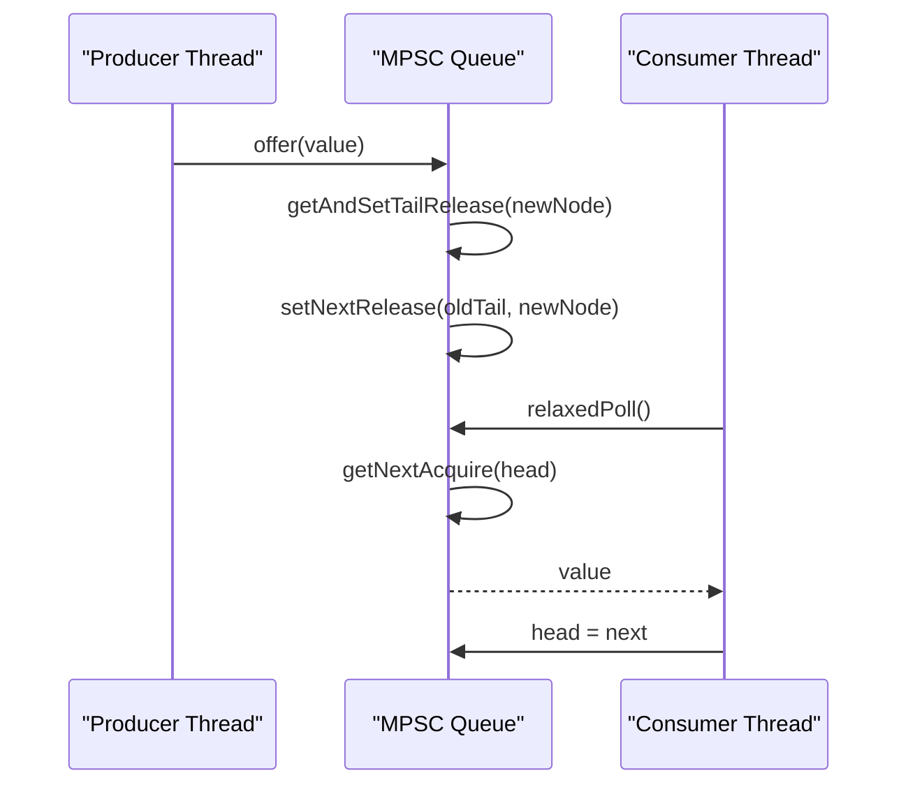
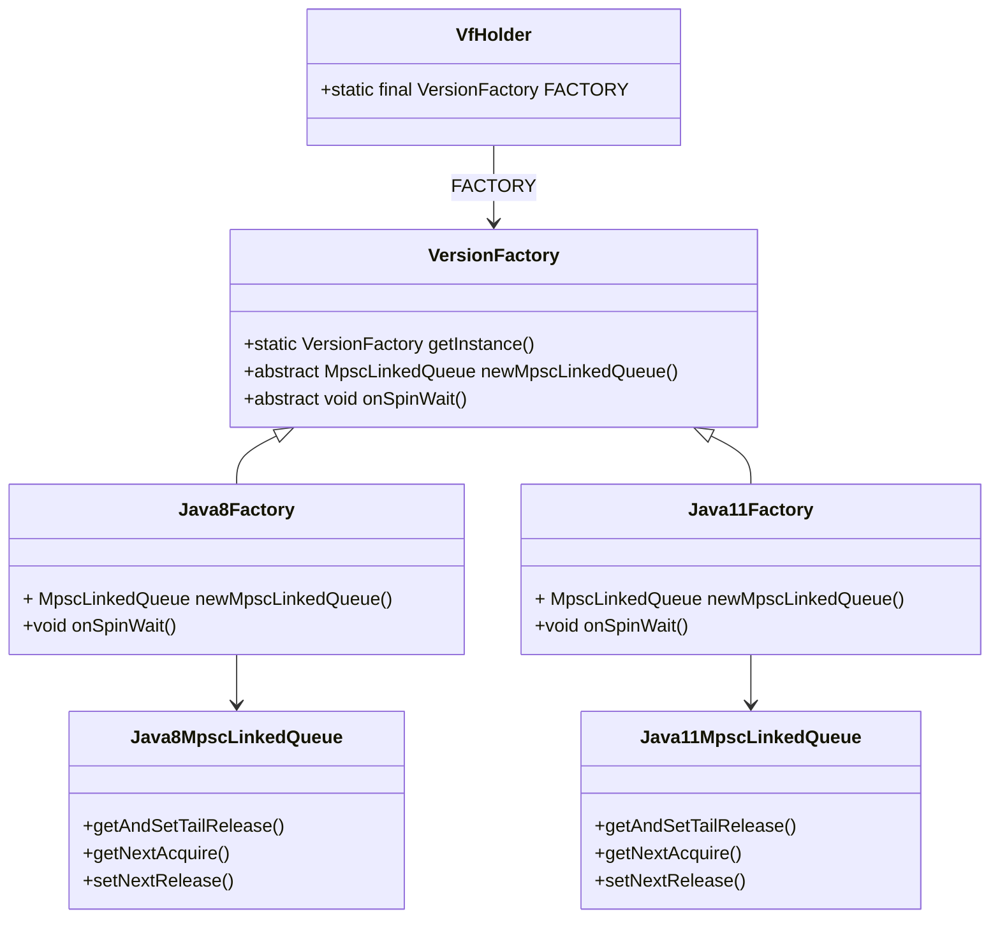

# Queue Optimization Techniques

<cite>
**Referenced Files in This Document**   
- [MpscLinkedQueue.java](file://client/src/main/java/com/github/dtprj/dongting/queue/MpscLinkedQueue.java)
- [Java8MpscLinkedQueue.java](file://client/src/main/java/com/github/dtprj/dongting/java8/Java8MpscLinkedQueue.java)
- [Java11MpscLinkedQueue.java](file://client/src/main/java/com/github/dtprj/dongting/java11/Java11MpscLinkedQueue.java)
- [LinkedNode.java](file://client/src/main/java/com/github/dtprj/dongting/queue/LinkedNode.java)
- [LinkedQueuePadding1.java](file://client/src/main/java/com/github/dtprj/dongting/queue/LinkedQueuePadding1.java)
- [LinkedQueueProducerRef.java](file://client/src/main/java/com/github/dtprj/dongting/queue/LinkedQueueProducerRef.java)
- [VersionFactory.java](file://client/src/main/java/com/github/dtprj/dongting/common/VersionFactory.java)
- [Java8Factory.java](file://client/src/main/java/com/github/dtprj/dongting/java8/Java8Factory.java)
- [Java11Factory.java](file://client/src/main/java/com/github/dtprj/dongting/java11/Java11Factory.java)
- [DtUnsafe.java](file://client/src/main/java/com/github/dtprj/dongting/unsafe/DtUnsafe.java)
- [Padding0.java](file://client/src/main/java/com/github/dtprj/dongting/common/Padding0.java)
- [NewUnsafe.java](file://client-ex/src/main/java/com/github/dtprj/dongting/unsafe11/NewUnsafe.java)
- [MpscQueueTest.java](file://benchmark/src/main/java/com/github/dtprj/dongting/bench/queue/MpscQueueTest.java)
- [2022_11_25_构建高性能的内存队列.md](file://devlogs/2022_11_25_构建高性能的内存队列.md)
</cite>

## Table of Contents
1. [Introduction](#introduction)
2. [MPSC Queue Specialization Rationale](#mpsc-queue-specialization-rationale)
3. [Memory Layout Optimizations](#memory-layout-optimizations)
4. [Relaxed Memory Ordering and Java Memory Model](#relaxed-memory-ordering-and-java-memory-model)
5. [Java Version-Specific Optimizations](#java-version-specific-optimizations)
6. [Performance Trade-offs](#performance-trade-offs)
7. [Practical Performance Gains](#practical-performance-gains)
8. [Tuning Recommendations](#tuning-recommendations)
9. [Conclusion](#conclusion)

## Introduction
The Dongting project implements a specialized Multiple Producer Single Consumer (MPSC) queue designed for high-performance scenarios in fiber-based and network-intensive applications. This document details the optimization techniques employed in the MPSC queue implementation, focusing on memory layout optimizations, relaxed memory ordering, and version-specific optimizations for Java 8 and Java 11. The analysis is based on the codebase structure and performance considerations documented in the devlogs, particularly the insights from the "构建高性能的内存队列" (Building High-Performance Memory Queues) devlog entry.

## MPSC Queue Specialization Rationale
The Dongting MPSC queue is specialized for scenarios with multiple producers and a single consumer, which is a common pattern in high-performance applications such as network servers and fiber-based systems. Unlike generic concurrent queues like ConcurrentLinkedQueue, the MPSC specialization allows for significant performance optimizations by reducing contention and leveraging specific access patterns.

The specialization is justified by the observation that in many high-performance applications, such as the netty framework mentioned in the devlogs, coordination between threads can be simplified by using memory queues to transfer data between threads, avoiding the need for locks. The MPSC queue is particularly effective in scenarios where multiple threads need to submit tasks or data to a single processing thread, such as in thread pools or event loops.

The devlog entry "构建高性能的内存队列" highlights that generic queues are designed to handle all possible producer-consumer configurations (SPSC, MPSC, SPMC, MPMC), but this generality comes at a performance cost. By specializing for the MPSC scenario, the Dongting queue can eliminate unnecessary synchronization overhead and optimize for the specific access patterns of multiple producers and a single consumer.

**Section sources**
- [2022_11_25_构建高性能的内存队列.md](file://devlogs/2022_11_25_构建高性能的内存队列.md#L15-L27)
- [MpscLinkedQueue.java](file://client/src/main/java/com/github/dtprj/dongting/queue/MpscLinkedQueue.java#L27-L155)

## Memory Layout Optimizations
The Dongting MPSC queue employs several memory layout optimizations to prevent false sharing and improve cache efficiency. False sharing occurs when multiple threads modify variables that reside on the same cache line, causing unnecessary cache invalidations and performance degradation.

The primary optimization is the use of padding to align critical fields on cache line boundaries. The queue implementation uses a hierarchy of padding classes to ensure that the producer and consumer fields are isolated from each other and from other objects in memory.

```mermaid
classDiagram
class Padding0 {
+byte b000
+byte b001
+byte b002
+byte b003
+byte b004
+byte b005
+byte b006
+byte b007
+byte b010
+byte b011
+byte b012
+byte b013
+byte b014
+byte b015
+byte b016
+byte b017
+byte b020
+byte b021
+byte b022
+byte b023
+byte b024
+byte b025
+byte b026
+byte b027
+byte b030
+byte b031
+byte b032
+byte b033
+byte b034
+byte b035
+byte b036
+byte b037
+byte b040
+byte b041
+byte b042
+byte b043
+byte b044
+byte b045
+byte b046
+byte b047
+byte b050
+byte b051
+byte b052
+byte b053
+byte b054
+byte b055
+byte b056
+byte b057
+byte b060
+byte b061
+byte b062
+byte b063
+byte b064
+byte b065
+byte b066
+byte b067
+byte b070
+byte b071
+byte b072
+byte b073
+byte b074
+byte b075
+byte b076
+byte b077
+byte b100
+byte b101
+byte b102
+byte b103
+byte b104
+byte b105
+byte b106
+byte b107
+byte b110
+byte b111
+byte b112
+byte b113
+byte b114
+byte b115
+byte b116
+byte b117
+byte b120
+byte b121
+byte b122
+byte b123
+byte b124
+byte b125
+byte b126
+byte b127
+byte b130
+byte b131
+byte b132
+byte b133
+byte b134
+byte b135
+byte b136
+byte b137
+byte b140
+byte b141
+byte b142
+byte b143
+byte b144
+byte b145
+byte b146
+byte b147
+byte b150
+byte b151
+byte b152
+byte b153
+byte b154
+byte b155
+byte b156
+byte b157
+byte b160
+byte b161
+byte b162
+byte b163
+byte b164
+byte b165
+byte b166
+byte b167
}
class LinkedQueueProducerRef {
+volatile boolean shutdown
+volatile LinkedNode<E> tail
}
class LinkedQueuePadding1 {
+byte b000
+byte b001
+byte b002
+byte b003
+byte b004
+byte b005
+byte b006
+byte b007
+byte b010
+byte b011
+byte b012
+byte b013
+byte b014
+byte b015
+byte b016
+byte b017
+byte b020
+byte b021
+byte b022
+byte b023
+byte b024
+byte b025
+byte b026
+byte b027
+byte b030
+byte b031
+byte b032
+byte b033
+byte b034
+byte b035
+byte b036
+byte b037
+byte b040
+byte b041
+byte b042
+byte b043
+byte b044
+byte b045
+byte b046
+byte b047
+byte b050
+byte b051
+byte b052
+byte b053
+byte b054
+byte b055
+byte b056
+byte b057
+byte b060
+byte b061
+byte b062
+byte b063
+byte b064
+byte b065
+byte b066
+byte b067
+byte b070
+byte b071
+byte b072
+byte b073
+byte b074
+byte b075
+byte b076
+byte b077
+byte b100
+byte b101
+byte b102
+byte b103
+byte b104
+byte b105
+byte b106
+byte b107
+byte b110
+byte b111
+byte b112
+byte b113
+byte b114
+byte b115
+byte b116
+byte b117
+byte b120
+byte b121
+byte b122
+byte b123
+byte b124
+byte b125
+byte b126
+byte b127
+byte b130
+byte b131
+byte b132
+byte b133
+byte b134
+byte b135
+byte b136
+byte b137
+byte b140
+byte b141
+byte b142
+byte b143
+byte b144
+byte b145
+byte b146
+byte b147
+byte b150
+byte b151
+byte b152
+byte b153
+byte b154
+byte b155
+byte b156
+byte b157
+byte b160
+byte b161
+byte b162
+byte b163
+byte b164
+byte b165
+byte b166
+byte b167
+byte b170
+byte b171
+byte b172
+byte b173
+byte b174
+byte b175
+byte b176
+byte b177
}
class MpscLinkedQueue {
+LinkedNode<E> head
}
Padding0 <|-- LinkedQueueProducerRef
LinkedQueueProducerRef <|-- LinkedQueuePadding1
LinkedQueuePadding1 <|-- MpscLinkedQueue
```

**Diagram sources**
- [Padding0.java](file://client/src/main/java/com/github/dtprj/dongting/common/Padding0.java#L23-L38)
- [LinkedQueueProducerRef.java](file://client/src/main/java/com/github/dtprj/dongting/queue/LinkedQueueProducerRef.java#L23-L27)
- [LinkedQueuePadding1.java](file://client/src/main/java/com/github/dtprj/dongting/queue/LinkedQueuePadding1.java#L23-L39)
- [MpscLinkedQueue.java](file://client/src/main/java/com/github/dtprj/dongting/queue/MpscLinkedQueue.java#L31-L37)

The `Padding0` class provides 128 bytes of padding, which is sufficient to cover a typical cache line (64 bytes) with additional space to account for object headers. The `LinkedQueueProducerRef` class extends `Padding0` and adds the `shutdown` and `tail` fields, which are critical for the producer side of the queue. The `LinkedQueuePadding1` class extends `LinkedQueueProducerRef` and adds another 128 bytes of padding, ensuring that the `head` field in `MpscLinkedQueue` is isolated from the producer fields.

This hierarchical padding strategy ensures that the producer and consumer fields are on separate cache lines, preventing false sharing between producers and the consumer. The devlog entry "构建高性能的内存队列" explicitly mentions the importance of padding to prevent false sharing, noting that even fields like `pIdx` and `cIdx` in a SPSC queue need padding to avoid performance degradation.

**Section sources**
- [Padding0.java](file://client/src/main/java/com/github/dtprj/dongting/common/Padding0.java#L23-L38)
- [LinkedQueueProducerRef.java](file://client/src/main/java/com/github/dtprj/dongting/queue/LinkedQueueProducerRef.java#L23-L27)
- [LinkedQueuePadding1.java](file://client/src/main/java/com/github/dtprj/dongting/queue/LinkedQueuePadding1.java#L23-L39)
- [MpscLinkedQueue.java](file://client/src/main/java/com/github/dtprj/dongting/queue/MpscLinkedQueue.java#L31-L37)
- [2022_11_25_构建高性能的内存队列.md](file://devlogs/2022_11_25_构建高性能的内存队列.md#L59-L62)

## Relaxed Memory Ordering and Java Memory Model
The Dongting MPSC queue leverages relaxed memory ordering to improve consumer-side performance while maintaining correctness under the Java Memory Model (JMM). The key innovation is the `relaxedPoll` method, which allows the consumer to read from the queue with minimal synchronization overhead.

**Diagram sources**
- [MpscLinkedQueue.java](file://client/src/main/java/com/github/dtprj/dongting/queue/MpscLinkedQueue.java#L43-L53)
- [Java8MpscLinkedQueue.java](file://client/src/main/java/com/github/dtprj/dongting/java8/Java8MpscLinkedQueue.java#L42-L55)
- [Java11MpscLinkedQueue.java](file://client/src/main/java/com/github/dtprj/dongting/java11/Java11MpscLinkedQueue.java#L43-L58)

The `relaxedPoll` method in `MpscLinkedQueue` uses acquire semantics when reading the next node, ensuring that the consumer sees the effects of previous producer operations. The `offer` method uses release semantics when updating the tail and next pointers, establishing a happens-before relationship between the producer's write and the consumer's read.

The devlog entry "构建高性能的内存队列" discusses the use of Release/Acquire memory ordering in SPSC queues, noting that it provides portability across different CPU architectures while incurring minimal performance overhead on x86 platforms. The Dongting MPSC queue extends this principle to the multiple producer case, using release semantics for producer operations and acquire semantics for consumer operations.

The `getNextAcquire` and `setNextRelease` methods are abstract in `MpscLinkedQueue` and implemented differently in the Java 8 and Java 11 versions. In Java 8, `AtomicReferenceFieldUpdater.lazySet` is used for release semantics, while in Java 11, `VarHandle.setRelease` is used. This allows the queue to leverage the most efficient available mechanism for each Java version.

**Section sources**
- [MpscLinkedQueue.java](file://client/src/main/java/com/github/dtprj/dongting/queue/MpscLinkedQueue.java#L43-L53)
- [Java8MpscLinkedQueue.java](file://client/src/main/java/com/github/dtprj/dongting/java8/Java8MpscLinkedQueue.java#L42-L55)
- [Java11MpscLinkedQueue.java](file://client/src/main/java/com/github/dtprj/dongting/java11/Java11MpscLinkedQueue.java#L43-L58)
- [2022_11_25_构建高性能的内存队列.md](file://devlogs/2022_11_25_构建高性能的内存队列.md#L70-L83)

## Java Version-Specific Optimizations
The Dongting MPSC queue employs different optimization strategies for Java 8 and Java 11, leveraging the capabilities of each platform to maximize performance. The `VersionFactory` class is responsible for selecting the appropriate implementation based on the Java version at runtime.

**Diagram sources**
- [VersionFactory.java](file://client/src/main/java/com/github/dtprj/dongting/common/VersionFactory.java#L28-L49)
- [Java8Factory.java](file://client/src/main/java/com/github/dtprj/dongting/java8/Java8Factory.java#L34-L110)
- [Java11Factory.java](file://client/src/main/java/com/github/dtprj/dongting/java11/Java11Factory.java#L33-L79)
- [Java8MpscLinkedQueue.java](file://client/src/main/java/com/github/dtprj/dongting/java8/Java8MpscLinkedQueue.java#L27-L57)
- [Java11MpscLinkedQueue.java](file://client/src/main/java/com/github/dtprj/dongting/java11/Java11MpscLinkedQueue.java#L28-L61)

For Java 8, the queue uses `AtomicReferenceFieldUpdater` with `getAndSet` and `lazySet` methods to implement the necessary atomic operations. The `lazySet` method provides release semantics, ensuring that the write is visible to other threads, while avoiding the full memory barrier of a volatile write.

For Java 11, the queue uses `VarHandle` with `getAndSetRelease` and `setRelease` methods, which provide more direct access to the underlying memory ordering primitives. The `VarHandle` API is more efficient than `AtomicReferenceFieldUpdater` because it avoids the reflection overhead and provides more precise control over memory ordering.

The `VersionFactory` class also provides version-specific implementations of other low-level operations, such as `onSpinWait`. In Java 8, `onSpinWait` is a no-op, while in Java 11, it delegates to `Thread.onSpinWait()`, which provides a hint to the CPU that the thread is spinning and can improve performance on hyper-threaded processors.

The devlog entry "构建高性能的内存队列" mentions the challenges of supporting both Java 8 and Java 11, noting that the server module requires Java 11 while the client must support Java 8. This dual-version support is achieved through the `VersionFactory` abstraction, which allows the same high-level API to be used across different Java versions while optimizing the implementation for each platform.

**Section sources**
- [VersionFactory.java](file://client/src/main/java/com/github/dtprj/dongting/common/VersionFactory.java#L28-L49)
- [Java8Factory.java](file://client/src/main/java/com/github/dtprj/dongting/java8/Java8Factory.java#L34-L110)
- [Java11Factory.java](file://client/src/main/java/com/github/dtprj/dongting/java11/Java11Factory.java#L33-L79)
- [Java8MpscLinkedQueue.java](file://client/src/main/java/com/github/dtprj/dongting/java8/Java8MpscLinkedQueue.java#L27-L57)
- [Java11MpscLinkedQueue.java](file://client/src/main/java/com/github/dtprj/dongting/java11/Java11MpscLinkedQueue.java#L28-L61)
- [2022_11_25_构建高性能的内存队列.md](file://devlogs/2022_11_25_构建高性能的内存队列.md#L109-L110)

## Performance Trade-offs
The Dongting MPSC queue makes several trade-offs between memory footprint, allocation rate, and throughput to achieve optimal performance in its target scenarios. These trade-offs are carefully balanced to provide high throughput with minimal overhead.

One key trade-off is between memory footprint and allocation rate. The queue uses a linked node structure, where each element is wrapped in a `LinkedNode` object. This approach has a higher memory overhead per element compared to an array-based implementation, but it avoids the allocation of large arrays and the associated garbage collection pressure. The devlog entry "构建高性能的内存队列" notes that linked list implementations often perform better than array-based ones, as mentioned in the JDK documentation for `LinkedBlockingQueue`.

Another trade-off is between throughput and fairness. The MPSC queue does not guarantee fairness among producers; instead, it prioritizes throughput by allowing producers to compete for the tail pointer using atomic operations. This can lead to starvation in extreme cases, but in practice, the high throughput and low latency are more important for the target use cases.

The queue also trades off some safety for performance. For example, the `relaxedPoll` method does not perform bounds checking or null checks beyond what is necessary for correctness. This reduces the overhead of each poll operation, but places the responsibility on the caller to ensure that the queue is used correctly.

The shutdown mechanism in the queue is another example of a performance trade-off. The `shutdown` method uses a special `SHUTDOWN_NODE` to signal that the queue is being closed, and it ensures that all elements offered before the shutdown are visible to the consumer. This complex logic, as documented in the `offer0` method, ensures graceful shutdown behavior but adds some overhead to the offer operation.

**Section sources**
- [MpscLinkedQueue.java](file://client/src/main/java/com/github/dtprj/dongting/queue/MpscLinkedQueue.java#L55-L108)
- [LinkedNode.java](file://client/src/main/java/com/github/dtprj/dongting/queue/LinkedNode.java#L21-L42)
- [2022_11_25_构建高性能的内存队列.md](file://devlogs/2022_11_25_构建高性能的内存队列.md#L61-L62)

## Practical Performance Gains
The performance gains of the Dongting MPSC queue are demonstrated through benchmark tests and real-world usage in fiber-based and network-intensive applications. The `MpscQueueTest` class in the benchmark module provides a simple test case that measures the throughput of the queue under different thread counts.

The devlog entry "构建高性能的内存队列" discusses the performance benefits of using specialized queues over generic ones, noting that the MPSC specialization can lead to significant performance improvements in scenarios with multiple producers and a single consumer. The use of relaxed memory ordering and cache line alignment further enhances performance by reducing contention and false sharing.

In fiber-based applications, the MPSC queue enables efficient coordination between fibers without the overhead of traditional locking mechanisms. This is particularly important in high-concurrency scenarios where the overhead of synchronization can become a bottleneck.

In network-intensive applications, the queue is used to transfer data between I/O threads and business logic threads, allowing for efficient processing of network events without blocking the I/O threads. This decoupling of I/O and business logic is a key factor in achieving high throughput and low latency.

**Section sources**
- [MpscQueueTest.java](file://benchmark/src/main/java/com/github/dtprj/dongting/bench/queue/MpscQueueTest.java#L1-L53)
- [2022_11_25_构建高性能的内存队列.md](file://devlogs/2022_11_25_构建高性能的内存队列.md#L1-L115)

## Tuning Recommendations
For optimal performance in fiber-based and network-intensive applications, the following tuning recommendations are suggested:

1. **Use the appropriate Java version**: Ensure that the application runs on Java 11 or later to take advantage of the `VarHandle` optimizations. If Java 8 is required, be aware of the performance limitations and consider upgrading when possible.

2. **Minimize object allocation**: Reuse objects where possible to reduce the allocation rate and garbage collection pressure. The linked node structure of the queue makes this more challenging, but object pooling can be used for the elements being queued.

3. **Avoid unnecessary synchronization**: The MPSC queue is designed for multiple producers and a single consumer. Avoid using it in scenarios with multiple consumers, as this will lead to contention and reduced performance.

4. **Monitor queue size**: While the queue does not provide a built-in size method, monitoring the queue size can help identify potential bottlenecks. Consider adding instrumentation to track the number of elements in the queue and the rate of enqueue and dequeue operations.

5. **Use appropriate thread counts**: The performance of the queue depends on the number of producer threads. Too many producers can lead to contention for the tail pointer, while too few may not fully utilize the available CPU resources. Experiment with different thread counts to find the optimal configuration for the specific workload.

6. **Handle shutdown gracefully**: The complex shutdown logic in the queue ensures that all elements are processed before the queue is closed. Ensure that the consumer thread properly handles the shutdown signal and processes all remaining elements before exiting.

**Section sources**
- [MpscLinkedQueue.java](file://client/src/main/java/com/github/dtprj/dongting/queue/MpscLinkedQueue.java#L119-L131)
- [2022_11_25_构建高性能的内存队列.md](file://devlogs/2022_11_25_构建高性能的内存队列.md#L63-L64)

## Conclusion
The Dongting MPSC queue implementation demonstrates a sophisticated approach to high-performance concurrent programming, leveraging memory layout optimizations, relaxed memory ordering, and version-specific optimizations to achieve excellent performance in fiber-based and network-intensive applications. By specializing for the MPSC scenario, the queue avoids the overhead of generic concurrent queues and provides a highly efficient mechanism for coordinating between multiple producers and a single consumer.

The use of padding to prevent false sharing, the careful application of release and acquire semantics, and the dual-version support for Java 8 and Java 11 are all examples of the deep understanding of low-level performance considerations that underpin the design. The practical performance gains demonstrated in the benchmark tests and real-world usage confirm that these optimizations are effective in achieving the project's goals.

As the devlog entry "构建高性能的内存队列" concludes, the exploration of memory models and high-performance data structures is an ongoing process, with each optimization building on the insights of the previous ones. The Dongting MPSC queue is a testament to the power of specialized data structures in achieving high performance in demanding applications.

[No sources needed since this section summarizes without analyzing specific files]