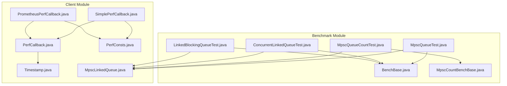
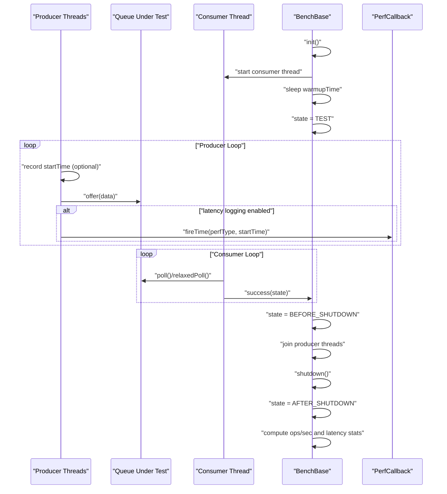
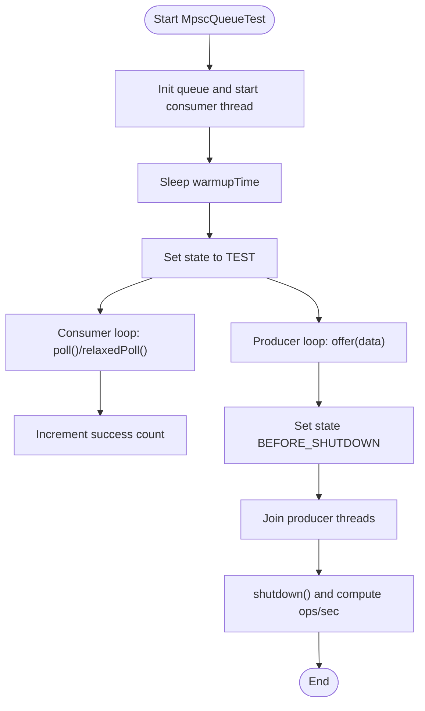
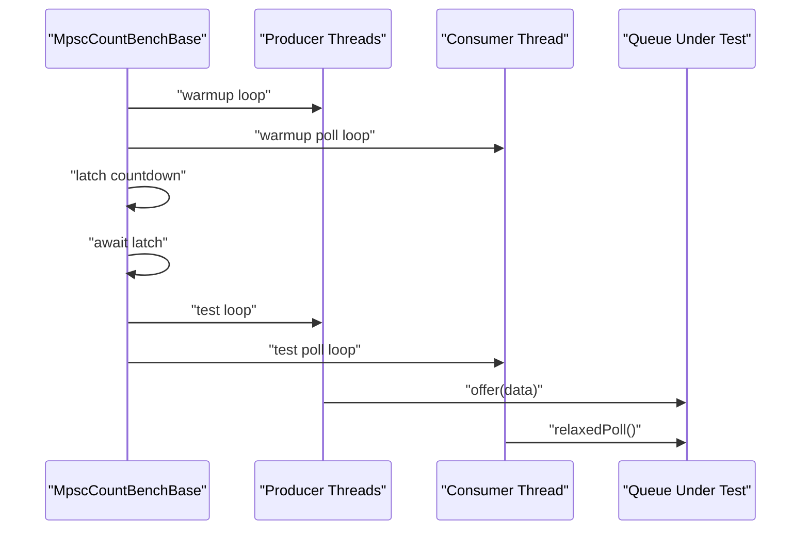
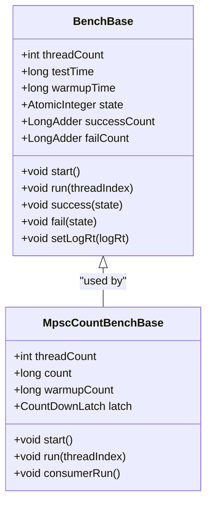
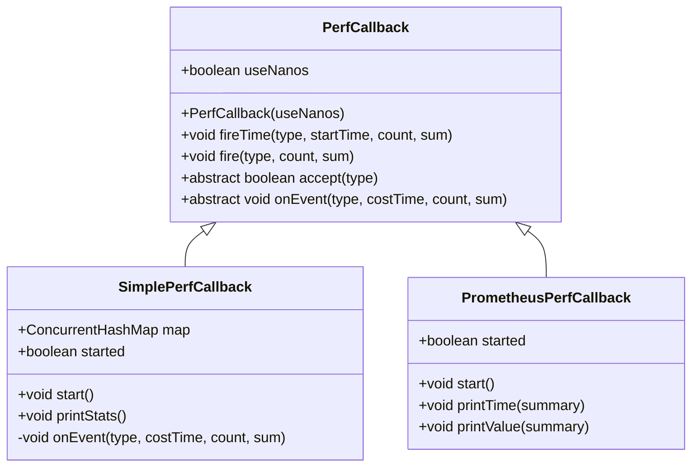
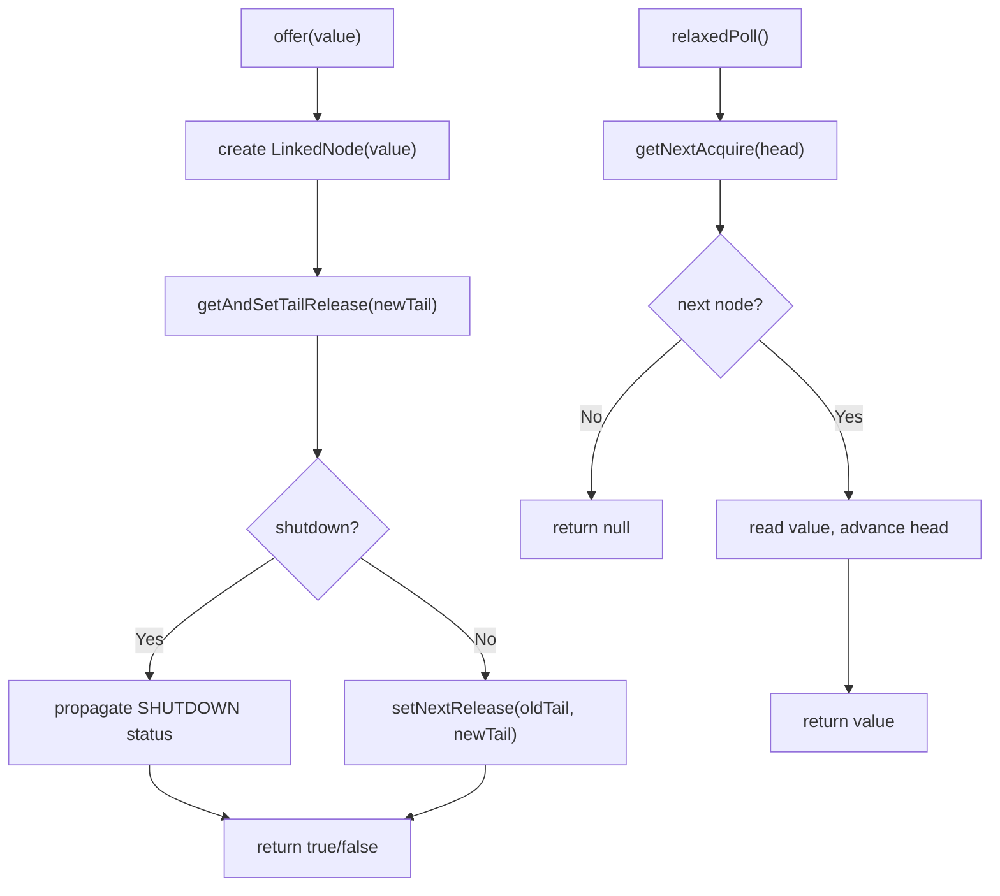
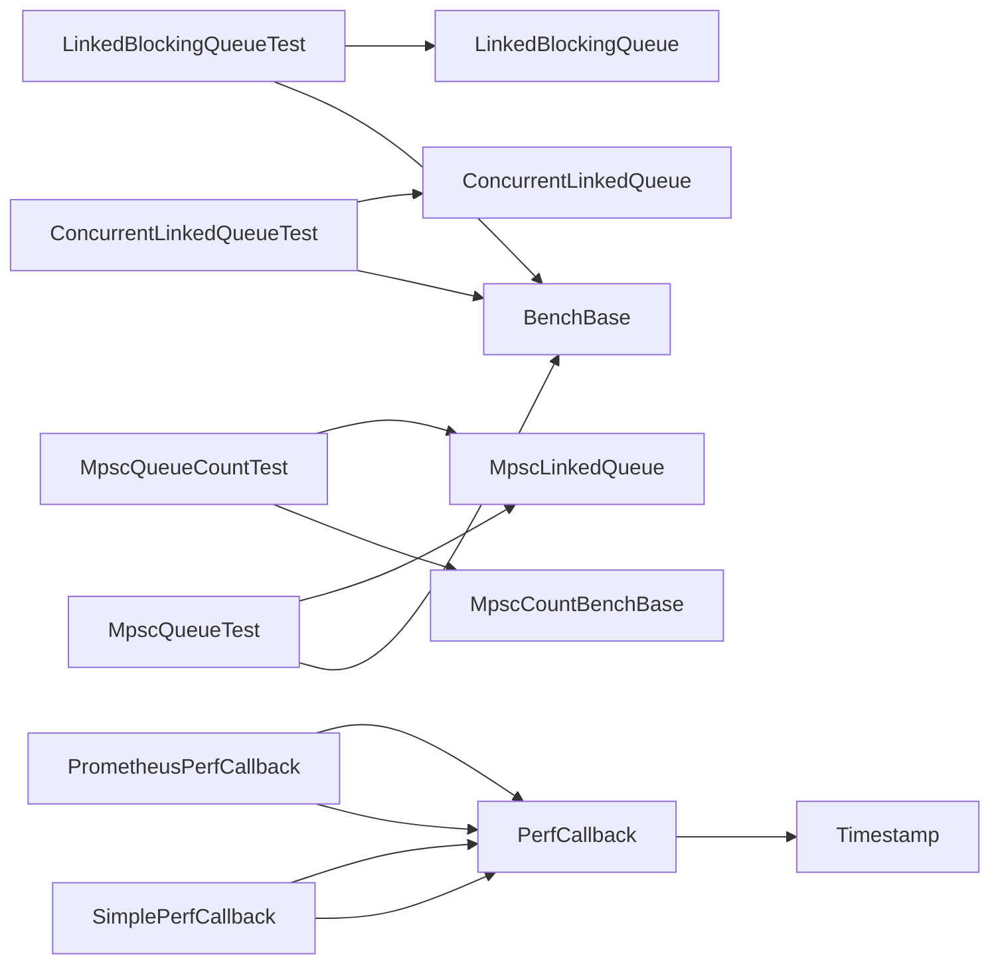

# Queue Performance Metrics

<cite>
**Referenced Files in This Document**
- [MpscQueueTest.java](file://benchmark/src/main/java/com/github/dtprj/dongting/bench/queue/MpscQueueTest.java)
- [MpscQueueCountTest.java](file://benchmark/src/main/java/com/github/dtprj/dongting/bench/fixcount/MpscQueueCountTest.java)
- [ConcurrentLinkedQueueTest.java](file://benchmark/src/main/java/com/github/dtprj/dongting/bench/queue/ConcurrentLinkedQueueTest.java)
- [LinkedBlockingQueueTest.java](file://benchmark/src/main/java/com/github/dtprj/dongting/bench/queue/LinkedBlockingQueueTest.java)
- [BenchBase.java](file://benchmark/src/main/java/com/github/dtprj/dongting/bench/common/BenchBase.java)
- [MpscCountBenchBase.java](file://benchmark/src/main/java/com/github/dtprj/dongting/bench/fixcount/MpscCountBenchBase.java)
- [PerfCallback.java](file://client/src/main/java/com/github/dtprj/dongting/common/PerfCallback.java)
- [SimplePerfCallback.java](file://benchmark/src/main/java/com/github/dtprj/dongting/bench/common/SimplePerfCallback.java)
- [PrometheusPerfCallback.java](file://benchmark/src/main/java/com/github/dtprj/dongting/bench/common/PrometheusPerfCallback.java)
- [PerfConsts.java](file://client/src/main/java/com/github/dtprj/dongting/common/PerfConsts.java)
- [Timestamp.java](file://client/src/main/java/com/github/dtprj/dongting/common/Timestamp.java)
- [MpscLinkedQueue.java](file://client/src/main/java/com/github/dtprj/dongting/queue/MpscLinkedQueue.java)
</cite>

## Table of Contents
1. [Introduction](#introduction)
2. [Project Structure](#project-structure)
3. [Core Components](#core-components)
4. [Architecture Overview](#architecture-overview)
5. [Detailed Component Analysis](#detailed-component-analysis)
6. [Dependency Analysis](#dependency-analysis)
7. [Performance Considerations](#performance-considerations)
8. [Troubleshooting Guide](#troubleshooting-guide)
9. [Conclusion](#conclusion)
10. [Appendices](#appendices)

## Introduction
This document explains how queue performance metrics are collected and analyzed using the MpscQueueTest and MpscQueueCountTest benchmarks. It covers throughput (operations per second), enqueue/dequeue latency, and contention under varying thread counts and workloads. It documents the use of PerfCallback and SimplePerfCallback for capturing timing data across different phases, and how metrics such as invoke count, max time, sum, and distribution are aggregated and reported. Guidance is included for interpreting benchmark results, identifying bottlenecks, and comparing performance across different queue implementations (e.g., MpscLinkedQueue vs LinkedBlockingQueue). Practical examples show how to configure test parameters like threadCount, testTime, and warmupTime for accurate measurement.

## Project Structure
The queue performance benchmarks reside in the benchmark module, with shared benchmark infrastructure in BenchBase and MpscCountBenchBase. Performance measurement utilities live in the client module under common. The queue implementations under client/src/main/java/com/github/dtprj/dongting/queue are used by the benchmarks.

**Diagram sources**
- [MpscQueueTest.java](file://benchmark/src/main/java/com/github/dtprj/dongting/bench/queue/MpscQueueTest.java#L1-L53)
- [MpscQueueCountTest.java](file://benchmark/src/main/java/com/github/dtprj/dongting/bench/fixcount/MpscQueueCountTest.java#L1-L34)
- [ConcurrentLinkedQueueTest.java](file://benchmark/src/main/java/com/github/dtprj/dongting/bench/queue/ConcurrentLinkedQueueTest.java#L1-L53)
- [LinkedBlockingQueueTest.java](file://benchmark/src/main/java/com/github/dtprj/dongting/bench/queue/LinkedBlockingQueueTest.java#L1-L53)
- [BenchBase.java](file://benchmark/src/main/java/com/github/dtprj/dongting/bench/common/BenchBase.java#L1-L153)
- [MpscCountBenchBase.java](file://benchmark/src/main/java/com/github/dtprj/dongting/bench/fixcount/MpscCountBenchBase.java#L1-L132)
- [PerfCallback.java](file://client/src/main/java/com/github/dtprj/dongting/common/PerfCallback.java#L1-L110)
- [SimplePerfCallback.java](file://benchmark/src/main/java/com/github/dtprj/dongting/bench/common/SimplePerfCallback.java#L1-L152)
- [PrometheusPerfCallback.java](file://benchmark/src/main/java/com/github/dtprj/dongting/bench/common/PrometheusPerfCallback.java#L1-L103)
- [PerfConsts.java](file://client/src/main/java/com/github/dtprj/dongting/common/PerfConsts.java#L1-L54)
- [Timestamp.java](file://client/src/main/java/com/github/dtprj/dongting/common/Timestamp.java#L1-L73)
- [MpscLinkedQueue.java](file://client/src/main/java/com/github/dtprj/dongting/queue/MpscLinkedQueue.java#L1-L155)

**Section sources**
- [MpscQueueTest.java](file://benchmark/src/main/java/com/github/dtprj/dongting/bench/queue/MpscQueueTest.java#L1-L53)
- [MpscQueueCountTest.java](file://benchmark/src/main/java/com/github/dtprj/dongting/bench/fixcount/MpscQueueCountTest.java#L1-L34)
- [ConcurrentLinkedQueueTest.java](file://benchmark/src/main/java/com/github/dtprj/dongting/bench/queue/ConcurrentLinkedQueueTest.java#L1-L53)
- [LinkedBlockingQueueTest.java](file://benchmark/src/main/java/com/github/dtprj/dongting/bench/queue/LinkedBlockingQueueTest.java#L1-L53)
- [BenchBase.java](file://benchmark/src/main/java/com/github/dtprj/dongting/bench/common/BenchBase.java#L1-L153)
- [MpscCountBenchBase.java](file://benchmark/src/main/java/com/github/dtprj/dongting/bench/fixcount/MpscCountBenchBase.java#L1-L132)
- [PerfCallback.java](file://client/src/main/java/com/github/dtprj/dongting/common/PerfCallback.java#L1-L110)
- [SimplePerfCallback.java](file://benchmark/src/main/java/com/github/dtprj/dongting/bench/common/SimplePerfCallback.java#L1-L152)
- [PrometheusPerfCallback.java](file://benchmark/src/main/java/com/github/dtprj/dongting/bench/common/PrometheusPerfCallback.java#L1-L103)
- [PerfConsts.java](file://client/src/main/java/com/github/dtprj/dongting/common/PerfConsts.java#L1-L54)
- [Timestamp.java](file://client/src/main/java/com/github/dtprj/dongting/common/Timestamp.java#L1-L73)
- [MpscLinkedQueue.java](file://client/src/main/java/com/github/dtprj/dongting/queue/MpscLinkedQueue.java#L1-L155)

## Core Components
- MpscQueueTest and MpscQueueCountTest: Benchmarks that measure MpscLinkedQueue throughput and latency under producer/consumer scenarios.
- BenchBase and MpscCountBenchBase: Shared benchmark infrastructure handling lifecycle, warmup, test windows, and basic throughput reporting.
- PerfCallback family: Timing and aggregation utilities for performance events, including SimplePerfCallback and PrometheusPerfCallback.
- Queue implementations: MpscLinkedQueue (high-performance MPSC queue), plus baseline comparisons using ConcurrentLinkedQueue and LinkedBlockingQueue.

Key responsibilities:
- Throughput calculation: BenchBase computes operations per millisecond during the test window.
- Latency capture: BenchBase optionally measures per-operation latency using nanosecond timestamps.
- Contention and distribution: PerfCallback subclasses aggregate invoke count, max time, sums, and quantiles.

**Section sources**
- [MpscQueueTest.java](file://benchmark/src/main/java/com/github/dtprj/dongting/bench/queue/MpscQueueTest.java#L1-L53)
- [MpscQueueCountTest.java](file://benchmark/src/main/java/com/github/dtprj/dongting/bench/fixcount/MpscQueueCountTest.java#L1-L34)
- [BenchBase.java](file://benchmark/src/main/java/com/github/dtprj/dongting/bench/common/BenchBase.java#L1-L153)
- [MpscCountBenchBase.java](file://benchmark/src/main/java/com/github/dtprj/dongting/bench/fixcount/MpscCountBenchBase.java#L1-L132)
- [PerfCallback.java](file://client/src/main/java/com/github/dtprj/dongting/common/PerfCallback.java#L1-L110)
- [SimplePerfCallback.java](file://benchmark/src/main/java/com/github/dtprj/dongting/bench/common/SimplePerfCallback.java#L1-L152)
- [PrometheusPerfCallback.java](file://benchmark/src/main/java/com/github/dtprj/dongting/bench/common/PrometheusPerfCallback.java#L1-L103)
- [MpscLinkedQueue.java](file://client/src/main/java/com/github/dtprj/dongting/queue/MpscLinkedQueue.java#L1-L155)

## Architecture Overview
The benchmark architecture separates concerns:
- Producer threads execute test loops and optionally record per-operation latency.
- A dedicated consumer thread continuously polls the queue to simulate real-world dequeue load.
- BenchBase manages state transitions (warmup/test/shutdown) and aggregates throughput.
- Optional PerfCallback-based instrumentation captures timing across distinct phases and aggregates statistics.

**Diagram sources**
- [MpscQueueTest.java](file://benchmark/src/main/java/com/github/dtprj/dongting/bench/queue/MpscQueueTest.java#L1-L53)
- [BenchBase.java](file://benchmark/src/main/java/com/github/dtprj/dongting/bench/common/BenchBase.java#L1-L153)
- [PerfCallback.java](file://client/src/main/java/com/github/dtprj/dongting/common/PerfCallback.java#L1-L110)

## Detailed Component Analysis

### MpscQueueTest Analysis
- Purpose: Measures MpscLinkedQueue throughput with a dedicated consumer thread polling the queue.
- Producer behavior: Each producer thread offers a fixed object in a tight loop during the test phase.
- Consumer behavior: A separate thread continuously polls the queue and increments success counters when items are removed.
- Lifecycle: Uses BenchBase to manage warmup, test window, and shutdown.

**Diagram sources**
- [MpscQueueTest.java](file://benchmark/src/main/java/com/github/dtprj/dongting/bench/queue/MpscQueueTest.java#L1-L53)
- [BenchBase.java](file://benchmark/src/main/java/com/github/dtprj/dongting/bench/common/BenchBase.java#L1-L153)

**Section sources**
- [MpscQueueTest.java](file://benchmark/src/main/java/com/github/dtprj/dongting/bench/queue/MpscQueueTest.java#L1-L53)
- [BenchBase.java](file://benchmark/src/main/java/com/github/dtprj/dongting/bench/common/BenchBase.java#L1-L153)

### MpscQueueCountTest Analysis
- Purpose: Fixed-count benchmark variant that runs a deterministic number of operations per thread.
- Producer/consumer coordination: Uses MpscCountBenchBase to synchronize warmup and test phases across producers and a consumer thread.
- Polling: Uses relaxedPoll() to minimize overhead in the consumer loop.

**Diagram sources**
- [MpscQueueCountTest.java](file://benchmark/src/main/java/com/github/dtprj/dongting/bench/fixcount/MpscQueueCountTest.java#L1-L34)
- [MpscCountBenchBase.java](file://benchmark/src/main/java/com/github/dtprj/dongting/bench/fixcount/MpscCountBenchBase.java#L1-L132)

**Section sources**
- [MpscQueueCountTest.java](file://benchmark/src/main/java/com/github/dtprj/dongting/bench/fixcount/MpscQueueCountTest.java#L1-L34)
- [MpscCountBenchBase.java](file://benchmark/src/main/java/com/github/dtprj/dongting/bench/fixcount/MpscCountBenchBase.java#L1-L132)

### BenchBase and MpscCountBenchBase
- BenchBase:
  - Manages thread lifecycle, warmup, test window, and shutdown.
  - Computes operations per second from success/failure counts and test duration.
  - Optionally logs per-operation latency (max and average) when enabled.
- MpscCountBenchBase:
  - Synchronizes warmup and test phases across producers and a consumer.
  - Provides elapsed-time reporting for producer/consumer phases.

**Diagram sources**
- [BenchBase.java](file://benchmark/src/main/java/com/github/dtprj/dongting/bench/common/BenchBase.java#L1-L153)
- [MpscCountBenchBase.java](file://benchmark/src/main/java/com/github/dtprj/dongting/bench/fixcount/MpscCountBenchBase.java#L1-L132)

**Section sources**
- [BenchBase.java](file://benchmark/src/main/java/com/github/dtprj/dongting/bench/common/BenchBase.java#L1-L153)
- [MpscCountBenchBase.java](file://benchmark/src/main/java/com/github/dtprj/dongting/bench/fixcount/MpscCountBenchBase.java#L1-L132)

### PerfCallback Family and Metrics Aggregation
- PerfCallback:
  - Provides timing helpers and event firing methods.
  - Supports two modes: nanosecond or millisecond timestamps.
  - Delegates acceptance and handling to subclasses.
- SimplePerfCallback:
  - Aggregates invoke count, total count/sum, total time, and per-event maxima.
  - Computes averages and prints formatted stats.
- PrometheusPerfCallback:
  - Builds on PerfCallback to expose quantile summaries and counts for Prometheus scraping.

**Diagram sources**
- [PerfCallback.java](file://client/src/main/java/com/github/dtprj/dongting/common/PerfCallback.java#L1-L110)
- [SimplePerfCallback.java](file://benchmark/src/main/java/com/github/dtprj/dongting/bench/common/SimplePerfCallback.java#L1-L152)
- [PrometheusPerfCallback.java](file://benchmark/src/main/java/com/github/dtprj/dongting/bench/common/PrometheusPerfCallback.java#L1-L103)

**Section sources**
- [PerfCallback.java](file://client/src/main/java/com/github/dtprj/dongting/common/PerfCallback.java#L1-L110)
- [SimplePerfCallback.java](file://benchmark/src/main/java/com/github/dtprj/dongting/bench/common/SimplePerfCallback.java#L1-L152)
- [PrometheusPerfCallback.java](file://benchmark/src/main/java/com/github/dtprj/dongting/bench/common/PrometheusPerfCallback.java#L1-L103)

### Queue Implementation Notes
- MpscLinkedQueue:
  - Offer path sets next pointers with release semantics and handles shutdown propagation.
  - Poll path advances head pointer and returns value; relaxedPoll avoids shutdown checks for higher throughput.
  - Implements graceful shutdown with a special sentinel node and back-and-forward propagation.

**Diagram sources**
- [MpscLinkedQueue.java](file://client/src/main/java/com/github/dtprj/dongting/queue/MpscLinkedQueue.java#L1-L155)

**Section sources**
- [MpscLinkedQueue.java](file://client/src/main/java/com/github/dtprj/dongting/queue/MpscLinkedQueue.java#L1-L155)

## Dependency Analysis
- Benchmark-to-queue dependencies:
  - MpscQueueTest and MpscQueueCountTest depend on MpscLinkedQueue.
  - ConcurrentLinkedQueueTest and LinkedBlockingQueueTest depend on JDK queues for baseline comparison.
- Benchmark lifecycle:
  - BenchBase orchestrates thread creation, warmup, test window, and shutdown.
  - MpscCountBenchBase adds coordinated warmup/test synchronization.
- Performance instrumentation:
  - PerfCallback subclasses rely on PerfConsts for event type identifiers and Timestamp for precise timing.

**Diagram sources**
- [MpscQueueTest.java](file://benchmark/src/main/java/com/github/dtprj/dongting/bench/queue/MpscQueueTest.java#L1-L53)
- [MpscQueueCountTest.java](file://benchmark/src/main/java/com/github/dtprj/dongting/bench/fixcount/MpscQueueCountTest.java#L1-L34)
- [ConcurrentLinkedQueueTest.java](file://benchmark/src/main/java/com/github/dtprj/dongting/bench/queue/ConcurrentLinkedQueueTest.java#L1-L53)
- [LinkedBlockingQueueTest.java](file://benchmark/src/main/java/com/github/dtprj/dongting/bench/queue/LinkedBlockingQueueTest.java#L1-L53)
- [BenchBase.java](file://benchmark/src/main/java/com/github/dtprj/dongting/bench/common/BenchBase.java#L1-L153)
- [MpscCountBenchBase.java](file://benchmark/src/main/java/com/github/dtprj/dongting/bench/fixcount/MpscCountBenchBase.java#L1-L132)
- [PerfCallback.java](file://client/src/main/java/com/github/dtprj/dongting/common/PerfCallback.java#L1-L110)
- [SimplePerfCallback.java](file://benchmark/src/main/java/com/github/dtprj/dongting/bench/common/SimplePerfCallback.java#L1-L152)
- [PrometheusPerfCallback.java](file://benchmark/src/main/java/com/github/dtprj/dongting/bench/common/PrometheusPerfCallback.java#L1-L103)
- [Timestamp.java](file://client/src/main/java/com/github/dtprj/dongting/common/Timestamp.java#L1-L73)
- [MpscLinkedQueue.java](file://client/src/main/java/com/github/dtprj/dongting/queue/MpscLinkedQueue.java#L1-L155)

**Section sources**
- [MpscQueueTest.java](file://benchmark/src/main/java/com/github/dtprj/dongting/bench/queue/MpscQueueTest.java#L1-L53)
- [MpscQueueCountTest.java](file://benchmark/src/main/java/com/github/dtprj/dongting/bench/fixcount/MpscQueueCountTest.java#L1-L34)
- [ConcurrentLinkedQueueTest.java](file://benchmark/src/main/java/com/github/dtprj/dongting/bench/queue/ConcurrentLinkedQueueTest.java#L1-L53)
- [LinkedBlockingQueueTest.java](file://benchmark/src/main/java/com/github/dtprj/dongting/bench/queue/LinkedBlockingQueueTest.java#L1-L53)
- [BenchBase.java](file://benchmark/src/main/java/com/github/dtprj/dongting/bench/common/BenchBase.java#L1-L153)
- [MpscCountBenchBase.java](file://benchmark/src/main/java/com/github/dtprj/dongting/bench/fixcount/MpscCountBenchBase.java#L1-L132)
- [PerfCallback.java](file://client/src/main/java/com/github/dtprj/dongting/common/PerfCallback.java#L1-L110)
- [SimplePerfCallback.java](file://benchmark/src/main/java/com/github/dtprj/dongting/bench/common/SimplePerfCallback.java#L1-L152)
- [PrometheusPerfCallback.java](file://benchmark/src/main/java/com/github/dtprj/dongting/bench/common/PrometheusPerfCallback.java#L1-L103)
- [Timestamp.java](file://client/src/main/java/com/github/dtprj/dongting/common/Timestamp.java#L1-L73)
- [MpscLinkedQueue.java](file://client/src/main/java/com/github/dtprj/dongting/queue/MpscLinkedQueue.java#L1-L155)

## Performance Considerations
- Throughput measurement:
  - BenchBase computes ops/sec from success/failure counts divided by testTime in seconds.
  - For fixed-count tests, MpscCountBenchBase reports elapsed time per phase for producers/consumers.
- Latency measurement:
  - BenchBase optionally records per-operation latency using nanosecond timestamps.
  - SimplePerfCallback aggregates invoke count, total time, and per-event maxima; it prints averages and maxima.
- Contention and scalability:
  - Vary threadCount to observe saturation and contention effects.
  - Compare MpscLinkedQueue with ConcurrentLinkedQueue and LinkedBlockingQueue to assess impact of blocking vs non-blocking designs.
- Warmup and stability:
  - warmupTime reduces JVM warmup effects and stabilizes measurements.
  - For fixed-count tests, warmupCount ensures steady-state before test phase.

[No sources needed since this section provides general guidance]

## Troubleshooting Guide
- No results printed:
  - Ensure BenchBase state transitions reach TEST and that success() is invoked in consumer loops.
- Unexpected low throughput:
  - Verify threadCount is appropriate for CPU cores and that producers/consumers are both active.
  - Confirm warmupTime is sufficient for JIT and GC stabilization.
- Latency spikes:
  - Enable BenchBase latency logging and inspect maxNanos and totalNanos averages.
  - Use SimplePerfCallback to capture and review per-event maxima and averages.
- Queue-specific issues:
  - For MpscLinkedQueue, ensure relaxedPoll() is used in hot consumer loops to minimize overhead.
  - For LinkedBlockingQueue, expect blocking behavior under high contention; adjust threadCount accordingly.

**Section sources**
- [BenchBase.java](file://benchmark/src/main/java/com/github/dtprj/dongting/bench/common/BenchBase.java#L1-L153)
- [SimplePerfCallback.java](file://benchmark/src/main/java/com/github/dtprj/dongting/bench/common/SimplePerfCallback.java#L1-L152)
- [MpscLinkedQueue.java](file://client/src/main/java/com/github/dtprj/dongting/queue/MpscLinkedQueue.java#L1-L155)

## Conclusion
The queue performance measurement framework combines robust benchmark scaffolding with flexible performance instrumentation. MpscQueueTest and MpscQueueCountTest provide complementary views of throughput and latency under varying thread counts and workloads. PerfCallback and SimplePerfCallback enable detailed aggregation of invoke counts, totals, and maxima, while BenchBase and MpscCountBenchBase handle lifecycle and throughput computation. By comparing MpscLinkedQueue against ConcurrentLinkedQueue and LinkedBlockingQueue, practitioners can identify bottlenecks and select queue implementations aligned with their concurrency and latency goals.

[No sources needed since this section summarizes without analyzing specific files]

## Appendices

### Methodology for Measuring Throughput, Latency, and Contention
- Throughput:
  - Compute operations per second from success and failure counts divided by testTime in seconds.
  - For fixed-count tests, report elapsed time per phase for producers and consumers.
- Enqueue/Dequeue latency:
  - Record per-operation start time during test phase and pass to PerfCallback.fireTime().
  - Aggregate and report average and maximum latencies.
- Contention:
  - Increase threadCount gradually to identify saturation points.
  - Compare queue implementations to isolate design impacts.

**Section sources**
- [BenchBase.java](file://benchmark/src/main/java/com/github/dtprj/dongting/bench/common/BenchBase.java#L1-L153)
- [MpscCountBenchBase.java](file://benchmark/src/main/java/com/github/dtprj/dongting/bench/fixcount/MpscCountBenchBase.java#L1-L132)
- [PerfCallback.java](file://client/src/main/java/com/github/dtprj/dongting/common/PerfCallback.java#L1-L110)

### Using PerfCallback and SimplePerfCallback for Timing Phases
- PerfCallback:
  - Use fireTime() variants to record elapsed time for specific phases.
  - Utilize accept() to gate instrumentation during active test periods.
- SimplePerfCallback:
  - Start instrumentation when ready to collect data.
  - PrintStats() displays invoke count, average time, total time, average count/sum, and per-event maxima.

**Section sources**
- [PerfCallback.java](file://client/src/main/java/com/github/dtprj/dongting/common/PerfCallback.java#L1-L110)
- [SimplePerfCallback.java](file://benchmark/src/main/java/com/github/dtprj/dongting/bench/common/SimplePerfCallback.java#L1-L152)
- [PerfConsts.java](file://client/src/main/java/com/github/dtprj/dongting/common/PerfConsts.java#L1-L54)
- [Timestamp.java](file://client/src/main/java/com/github/dtprj/dongting/common/Timestamp.java#L1-L73)

### Comparing Queue Implementations
- MpscLinkedQueue:
  - Non-blocking, high-throughput MPSC design; use relaxedPoll() in consumer loops.
- ConcurrentLinkedQueue:
  - Baseline concurrent linked-list queue; useful for comparison under similar workloads.
- LinkedBlockingQueue:
  - Blocking queue; expect higher latency under contention; suitable for scenarios requiring blocking semantics.

**Section sources**
- [MpscLinkedQueue.java](file://client/src/main/java/com/github/dtprj/dongting/queue/MpscLinkedQueue.java#L1-L155)
- [ConcurrentLinkedQueueTest.java](file://benchmark/src/main/java/com/github/dtprj/dongting/bench/queue/ConcurrentLinkedQueueTest.java#L1-L53)
- [LinkedBlockingQueueTest.java](file://benchmark/src/main/java/com/github/dtprj/dongting/bench/queue/LinkedBlockingQueueTest.java#L1-L53)

### Configuring Test Parameters
- threadCount: Number of producer threads; increase gradually to observe saturation.
- testTime: Duration of the test window in milliseconds; ensure sufficient time for stable averages.
- warmupTime: Warmup duration in milliseconds; reduce JIT/GC effects.
- For fixed-count tests, configure count and warmupCount in MpscCountBenchBase.

Examples:
- MpscQueueTest main entry demonstrates threadCount=1, testTime=5000 ms, warmupTime=1000 ms.
- MpscQueueCountTest main entry demonstrates threadCount=1, count=5_000_000, warmupCount=10000.

**Section sources**
- [MpscQueueTest.java](file://benchmark/src/main/java/com/github/dtprj/dongting/bench/queue/MpscQueueTest.java#L1-L53)
- [MpscQueueCountTest.java](file://benchmark/src/main/java/com/github/dtprj/dongting/bench/fixcount/MpscQueueCountTest.java#L1-L34)
- [BenchBase.java](file://benchmark/src/main/java/com/github/dtprj/dongting/bench/common/BenchBase.java#L1-L153)
- [MpscCountBenchBase.java](file://benchmark/src/main/java/com/github/dtprj/dongting/bench/fixcount/MpscCountBenchBase.java#L1-L132)