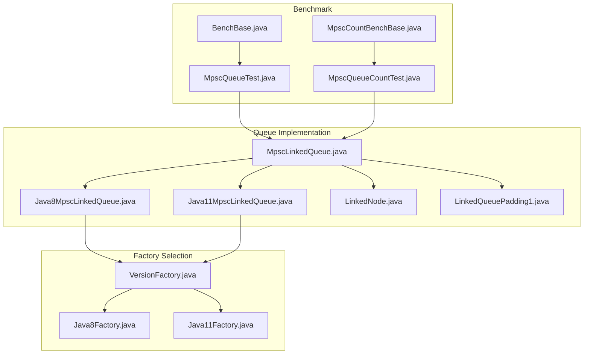
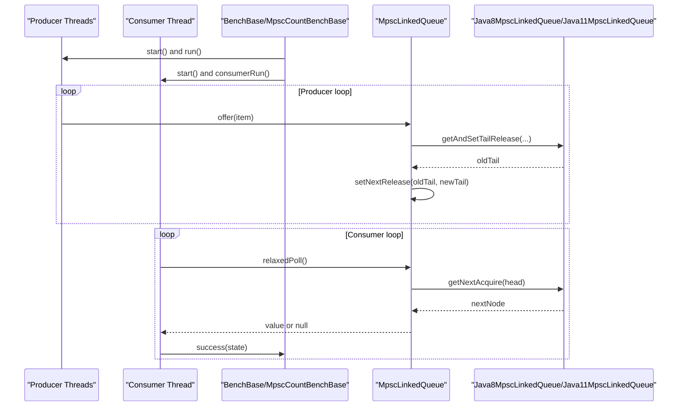
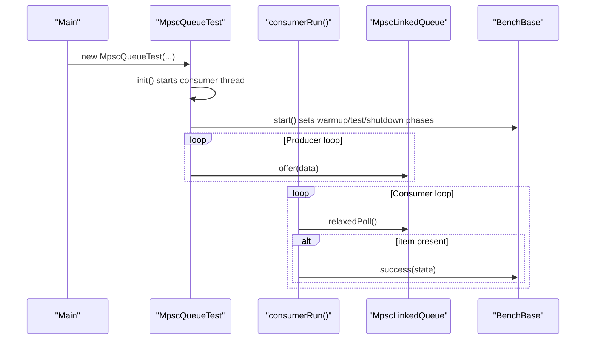
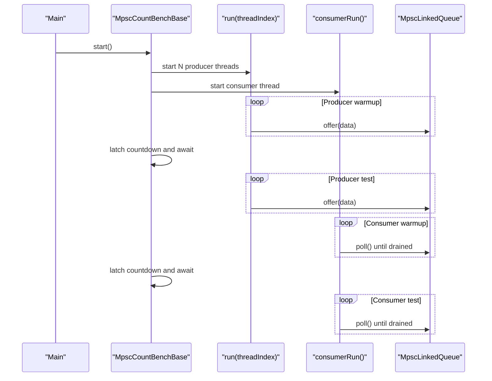
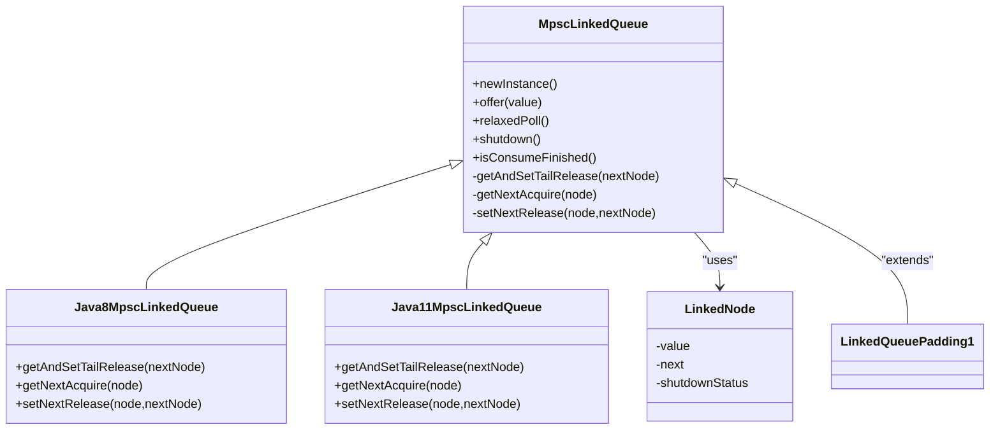
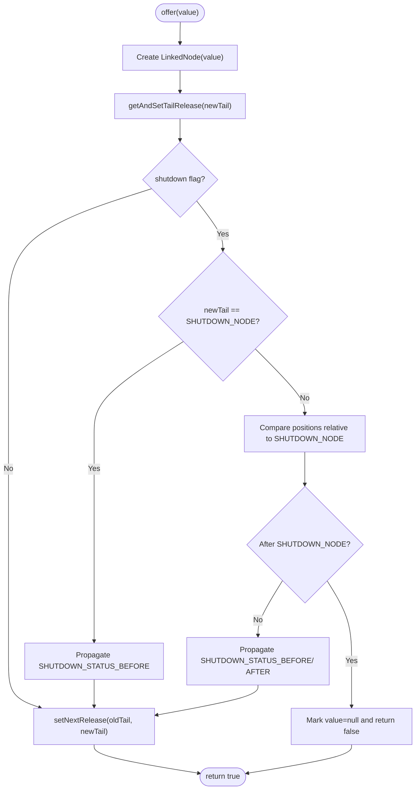
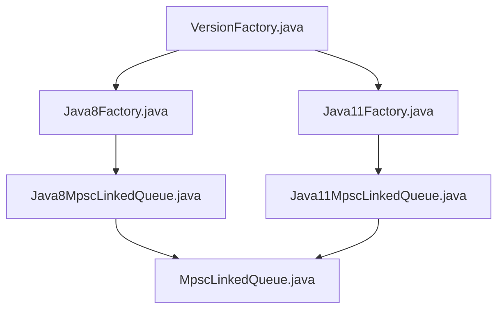

# Queue Throughput Benchmarking

<cite>
**Referenced Files in This Document**
- [MpscQueueTest.java](file://benchmark/src/main/java/com/github/dtprj/dongting/bench/queue/MpscQueueTest.java)
- [MpscQueueCountTest.java](file://benchmark/src/main/java/com/github/dtprj/dongting/bench/fixcount/MpscQueueCountTest.java)
- [MpscCountBenchBase.java](file://benchmark/src/main/java/com/github/dtprj/dongting/bench/fixcount/MpscCountBenchBase.java)
- [BenchBase.java](file://benchmark/src/main/java/com/github/dtprj/dongting/bench/common/BenchBase.java)
- [MpscLinkedQueue.java](file://client/src/main/java/com/github/dtprj/dongting/queue/MpscLinkedQueue.java)
- [Java8MpscLinkedQueue.java](file://client/src/main/java/com/github/dtprj/dongting/java8/Java8MpscLinkedQueue.java)
- [Java11MpscLinkedQueue.java](file://client/src/main/java/com/github/dtprj/dongting/java11/Java11MpscLinkedQueue.java)
- [VersionFactory.java](file://client/src/main/java/com/github/dtprj/dongting/common/VersionFactory.java)
- [Java8Factory.java](file://client/src/main/java/com/github/dtprj/dongting/java8/Java8Factory.java)
- [Java11Factory.java](file://client/src/main/java/com/github/dtprj/dongting/java11/Java11Factory.java)
- [LinkedNode.java](file://client/src/main/java/com/github/dtprj/dongting/queue/LinkedNode.java)
- [LinkedQueuePadding1.java](file://client/src/main/java/com/github/dtprj/dongting/queue/LinkedQueuePadding1.java)
- [MpscLinkedQueueTest.java](file://client/src/test/java/com/github/dtprj/dongting/java11/MpscLinkedQueueTest.java)
</cite>

## Table of Contents
1. [Introduction](#introduction)
2. [Project Structure](#project-structure)
3. [Core Components](#core-components)
4. [Architecture Overview](#architecture-overview)
5. [Detailed Component Analysis](#detailed-component-analysis)
6. [Dependency Analysis](#dependency-analysis)
7. [Performance Considerations](#performance-considerations)
8. [Troubleshooting Guide](#troubleshooting-guide)
9. [Conclusion](#conclusion)
10. [Appendices](#appendices)

## Introduction
This document explains the architecture and methodology behind queue throughput benchmarking for MPSC (Multi-Producer Single-Consumer) queues, focusing on the benchmark classes MpscQueueTest and MpscQueueCountTest. It covers how high-concurrency producer threads and a single consumer are orchestrated, how throughput and enqueue/dequeue latency are measured, and how to interpret results. It also compares Java8 and Java11 queue implementations, describes ABA problem mitigation strategies, and evaluates padding techniques for reducing false sharing. Guidance is included for adapting benchmarks to different queue sizes, producer-consumer ratios, and analyzing results for optimizing fiber scheduling and network I/O.

## Project Structure
The benchmarking code resides under the benchmark module, while the queue implementations live in the client module. The key files are:
- Benchmark entry points: MpscQueueTest and MpscQueueCountTest
- Shared benchmark base: MpscCountBenchBase and BenchBase
- Queue implementations: MpscLinkedQueue and platform-specific variants Java8MpscLinkedQueue and Java11MpscLinkedQueue
- Factory selection: VersionFactory, Java8Factory, Java11Factory
- Queue internals: LinkedNode and LinkedQueuePadding1

**Diagram sources**
- [MpscQueueTest.java](file://benchmark/src/main/java/com/github/dtprj/dongting/bench/queue/MpscQueueTest.java#L1-L52)
- [MpscQueueCountTest.java](file://benchmark/src/main/java/com/github/dtprj/dongting/bench/fixcount/MpscQueueCountTest.java#L1-L34)
- [MpscCountBenchBase.java](file://benchmark/src/main/java/com/github/dtprj/dongting/bench/fixcount/MpscCountBenchBase.java#L1-L132)
- [BenchBase.java](file://benchmark/src/main/java/com/github/dtprj/dongting/bench/common/BenchBase.java#L1-L153)
- [MpscLinkedQueue.java](file://client/src/main/java/com/github/dtprj/dongting/queue/MpscLinkedQueue.java#L1-L155)
- [Java8MpscLinkedQueue.java](file://client/src/main/java/com/github/dtprj/dongting/java8/Java8MpscLinkedQueue.java#L1-L57)
- [Java11MpscLinkedQueue.java](file://client/src/main/java/com/github/dtprj/dongting/java11/Java11MpscLinkedQueue.java#L1-L61)
- [VersionFactory.java](file://client/src/main/java/com/github/dtprj/dongting/common/VersionFactory.java#L1-L76)
- [Java8Factory.java](file://client/src/main/java/com/github/dtprj/dongting/java8/Java8Factory.java#L1-L110)
- [Java11Factory.java](file://client/src/main/java/com/github/dtprj/dongting/java11/Java11Factory.java#L1-L79)
- [LinkedNode.java](file://client/src/main/java/com/github/dtprj/dongting/queue/LinkedNode.java#L1-L42)
- [LinkedQueuePadding1.java](file://client/src/main/java/com/github/dtprj/dongting/queue/LinkedQueuePadding1.java#L1-L40)

**Section sources**
- [MpscQueueTest.java](file://benchmark/src/main/java/com/github/dtprj/dongting/bench/queue/MpscQueueTest.java#L1-L52)
- [MpscQueueCountTest.java](file://benchmark/src/main/java/com/github/dtprj/dongting/bench/fixcount/MpscQueueCountTest.java#L1-L34)
- [MpscCountBenchBase.java](file://benchmark/src/main/java/com/github/dtprj/dongting/bench/fixcount/MpscCountBenchBase.java#L1-L132)
- [BenchBase.java](file://benchmark/src/main/java/com/github/dtprj/dongting/bench/common/BenchBase.java#L1-L153)
- [MpscLinkedQueue.java](file://client/src/main/java/com/github/dtprj/dongting/queue/MpscLinkedQueue.java#L1-L155)
- [Java8MpscLinkedQueue.java](file://client/src/main/java/com/github/dtprj/dongting/java8/Java8MpscLinkedQueue.java#L1-L57)
- [Java11MpscLinkedQueue.java](file://client/src/main/java/com/github/dtprj/dongting/java11/Java11MpscLinkedQueue.java#L1-L61)
- [VersionFactory.java](file://client/src/main/java/com/github/dtprj/dongting/common/VersionFactory.java#L1-L76)
- [Java8Factory.java](file://client/src/main/java/com/github/dtprj/dongting/java8/Java8Factory.java#L1-L110)
- [Java11Factory.java](file://client/src/main/java/com/github/dtprj/dongting/java11/Java11Factory.java#L1-L79)
- [LinkedNode.java](file://client/src/main/java/com/github/dtprj/dongting/queue/LinkedNode.java#L1-L42)
- [LinkedQueuePadding1.java](file://client/src/main/java/com/github/dtprj/dongting/queue/LinkedQueuePadding1.java#L1-L40)

## Core Components
- MpscQueueTest: A time-based benchmark with a single consumer thread and configurable producer threads. It measures throughput during a fixed test window and logs success counts.
- MpscQueueCountTest: A fixed-count benchmark with a consumer that drains items produced by producers. It measures total time to process a fixed number of items and prints elapsed times for producer/consumer phases.
- MpscCountBenchBase: Provides shared logic for fixed-count benchmarks, including warmup, coordinated start/end, and timing for producer/consumer loops.
- BenchBase: Provides shared logic for time-based benchmarks, including state transitions, warmup/test/shutdown phases, and throughput calculation.
- MpscLinkedQueue and platform variants: Abstract queue with platform-specific implementations using AtomicReferenceFieldUpdater (Java8) or VarHandle (Java11) for low-level atomic operations.
- VersionFactory and factories: Selects the appropriate queue implementation and memory fence/spin wait semantics based on runtime Java version.

Key performance-critical methods:
- Enqueue: offer(...) and offer0(...) in MpscLinkedQueue
- Dequeue: relaxedPoll() in MpscLinkedQueue
- Platform-specific memory ordering: getAndSetTailRelease(...), getNextAcquire(...), setNextRelease(...) in Java8MpscLinkedQueue and Java11MpscLinkedQueue

**Section sources**
- [MpscQueueTest.java](file://benchmark/src/main/java/com/github/dtprj/dongting/bench/queue/MpscQueueTest.java#L1-L52)
- [MpscQueueCountTest.java](file://benchmark/src/main/java/com/github/dtprj/dongting/bench/fixcount/MpscQueueCountTest.java#L1-L34)
- [MpscCountBenchBase.java](file://benchmark/src/main/java/com/github/dtprj/dongting/bench/fixcount/MpscCountBenchBase.java#L1-L132)
- [BenchBase.java](file://benchmark/src/main/java/com/github/dtprj/dongting/bench/common/BenchBase.java#L1-L153)
- [MpscLinkedQueue.java](file://client/src/main/java/com/github/dtprj/dongting/queue/MpscLinkedQueue.java#L1-L155)
- [Java8MpscLinkedQueue.java](file://client/src/main/java/com/github/dtprj/dongting/java8/Java8MpscLinkedQueue.java#L1-L57)
- [Java11MpscLinkedQueue.java](file://client/src/main/java/com/github/dtprj/dongting/java11/Java11MpscLinkedQueue.java#L1-L61)
- [VersionFactory.java](file://client/src/main/java/com/github/dtprj/dongting/common/VersionFactory.java#L1-L76)

## Architecture Overview
The benchmark architecture separates concerns:
- Producer threads: run test loops and enqueue items
- Consumer thread: continuously polls items and increments success counters
- Shared state: BenchBase manages state transitions and timing
- Queue abstraction: MpscLinkedQueue delegates memory ordering to platform-specific implementations

**Diagram sources**
- [MpscQueueTest.java](file://benchmark/src/main/java/com/github/dtprj/dongting/bench/queue/MpscQueueTest.java#L1-L52)
- [MpscQueueCountTest.java](file://benchmark/src/main/java/com/github/dtprj/dongting/bench/fixcount/MpscQueueCountTest.java#L1-L34)
- [MpscCountBenchBase.java](file://benchmark/src/main/java/com/github/dtprj/dongting/bench/fixcount/MpscCountBenchBase.java#L1-L132)
- [BenchBase.java](file://benchmark/src/main/java/com/github/dtprj/dongting/bench/common/BenchBase.java#L1-L153)
- [MpscLinkedQueue.java](file://client/src/main/java/com/github/dtprj/dongting/queue/MpscLinkedQueue.java#L1-L155)
- [Java8MpscLinkedQueue.java](file://client/src/main/java/com/github/dtprj/dongting/java8/Java8MpscLinkedQueue.java#L1-L57)
- [Java11MpscLinkedQueue.java](file://client/src/main/java/com/github/dtprj/dongting/java11/Java11MpscLinkedQueue.java#L1-L61)

## Detailed Component Analysis

### MpscQueueTest (time-based throughput)
- Setup: Initializes a single consumer thread and starts producer threads. The consumer runs a loop polling the queue and invoking success(state) for each successful dequeue.
- Producer logic: Each producer thread enqueues a constant item in a tight loop during the test phase.
- Metrics: BenchBase accumulates success and failure counts and prints throughput (operations per second) at the end.

**Diagram sources**
- [MpscQueueTest.java](file://benchmark/src/main/java/com/github/dtprj/dongting/bench/queue/MpscQueueTest.java#L1-L52)
- [BenchBase.java](file://benchmark/src/main/java/com/github/dtprj/dongting/bench/common/BenchBase.java#L1-L153)

**Section sources**
- [MpscQueueTest.java](file://benchmark/src/main/java/com/github/dtprj/dongting/bench/queue/MpscQueueTest.java#L1-L52)
- [BenchBase.java](file://benchmark/src/main/java/com/github/dtprj/dongting/bench/common/BenchBase.java#L1-L153)

### MpscQueueCountTest (fixed-count throughput)
- Setup: Extends MpscCountBenchBase to coordinate warmup and test phases for both producers and consumer. The consumer drains items produced by all producers.
- Producer logic: Each producer enqueues a constant item in a fixed loop during warmup and test phases.
- Consumer logic: Polls the queue until all items are drained, printing elapsed time for warmup and test phases.

**Diagram sources**
- [MpscQueueCountTest.java](file://benchmark/src/main/java/com/github/dtprj/dongting/bench/fixcount/MpscQueueCountTest.java#L1-L34)
- [MpscCountBenchBase.java](file://benchmark/src/main/java/com/github/dtprj/dongting/bench/fixcount/MpscCountBenchBase.java#L1-L132)

**Section sources**
- [MpscQueueCountTest.java](file://benchmark/src/main/java/com/github/dtprj/dongting/bench/fixcount/MpscQueueCountTest.java#L1-L34)
- [MpscCountBenchBase.java](file://benchmark/src/main/java/com/github/dtprj/dongting/bench/fixcount/MpscCountBenchBase.java#L1-L132)

### Queue Implementation and Memory Ordering
- MpscLinkedQueue: Abstract base with offer(...) and relaxedPoll(...) methods. It uses VersionFactory to select platform-specific implementations.
- Java8MpscLinkedQueue: Uses AtomicReferenceFieldUpdater for getAndSetTailRelease(...), getNextAcquire(...), and setNextRelease(...).
- Java11MpscLinkedQueue: Uses VarHandle for getAndSetTailRelease(...), getNextAcquire(...), and setNextRelease(...).
- LinkedNode: Holds value and next pointer, plus a shutdownStatus field used for graceful shutdown signaling.
- LinkedQueuePadding1: Adds padding bytes to reduce false sharing between queue fields.

**Diagram sources**
- [MpscLinkedQueue.java](file://client/src/main/java/com/github/dtprj/dongting/queue/MpscLinkedQueue.java#L1-L155)
- [Java8MpscLinkedQueue.java](file://client/src/main/java/com/github/dtprj/dongting/java8/Java8MpscLinkedQueue.java#L1-L57)
- [Java11MpscLinkedQueue.java](file://client/src/main/java/com/github/dtprj/dongting/java11/Java11MpscLinkedQueue.java#L1-L61)
- [LinkedNode.java](file://client/src/main/java/com/github/dtprj/dongting/queue/LinkedNode.java#L1-L42)
- [LinkedQueuePadding1.java](file://client/src/main/java/com/github/dtprj/dongting/queue/LinkedQueuePadding1.java#L1-L40)

**Section sources**
- [MpscLinkedQueue.java](file://client/src/main/java/com/github/dtprj/dongting/queue/MpscLinkedQueue.java#L1-L155)
- [Java8MpscLinkedQueue.java](file://client/src/main/java/com/github/dtprj/dongting/java8/Java8MpscLinkedQueue.java#L1-L57)
- [Java11MpscLinkedQueue.java](file://client/src/main/java/com/github/dtprj/dongting/java11/Java11MpscLinkedQueue.java#L1-L61)
- [LinkedNode.java](file://client/src/main/java/com/github/dtprj/dongting/queue/LinkedNode.java#L1-L42)
- [LinkedQueuePadding1.java](file://client/src/main/java/com/github/dtprj/dongting/queue/LinkedQueuePadding1.java#L1-L40)

### ABA Problem Mitigation Strategy
The queue implements a shutdown mechanism that prevents ABA-like issues during graceful shutdown:
- A sentinel SHUTDOWN_NODE is used to mark the end of the queue.
- During offer(...), if the queue is shutting down, the implementation determines whether the new node should be visible to consumers based on the position relative to SHUTDOWN_NODE.
- It propagates shutdownStatus forward or backward to ensure producers after shutdown do not enqueue items that consumers can observe.

**Diagram sources**
- [MpscLinkedQueue.java](file://client/src/main/java/com/github/dtprj/dongting/queue/MpscLinkedQueue.java#L62-L108)
- [LinkedNode.java](file://client/src/main/java/com/github/dtprj/dongting/queue/LinkedNode.java#L21-L42)

**Section sources**
- [MpscLinkedQueue.java](file://client/src/main/java/com/github/dtprj/dongting/queue/MpscLinkedQueue.java#L62-L108)
- [LinkedNode.java](file://client/src/main/java/com/github/dtprj/dongting/queue/LinkedNode.java#L21-L42)

### False Sharing Mitigation with Padding
- LinkedQueuePadding1 adds padding bytes around queue fields to prevent adjacent cache-line updates between producer/consumer threads.
- This reduces contention when producers update tail and consumers update head, improving throughput under high concurrency.

**Section sources**
- [LinkedQueuePadding1.java](file://client/src/main/java/com/github/dtprj/dongting/queue/LinkedQueuePadding1.java#L1-L40)

## Dependency Analysis
- Factory selection: VersionFactory chooses Java8Factory or Java11Factory based on runtime Java version. Both factories return platform-specific MpscLinkedQueue implementations.
- Memory ordering: Java8MpscLinkedQueue uses AtomicReferenceFieldUpdater; Java11MpscLinkedQueue uses VarHandle. Both implement the same abstract queue contract.
- Benchmark orchestration: MpscQueueTest and MpscQueueCountTest depend on BenchBase and MpscCountBenchBase respectively for timing and coordination.

**Diagram sources**
- [VersionFactory.java](file://client/src/main/java/com/github/dtprj/dongting/common/VersionFactory.java#L1-L76)
- [Java8Factory.java](file://client/src/main/java/com/github/dtprj/dongting/java8/Java8Factory.java#L1-L110)
- [Java11Factory.java](file://client/src/main/java/com/github/dtprj/dongting/java11/Java11Factory.java#L1-L79)
- [MpscLinkedQueue.java](file://client/src/main/java/com/github/dtprj/dongting/queue/MpscLinkedQueue.java#L1-L155)
- [Java8MpscLinkedQueue.java](file://client/src/main/java/com/github/dtprj/dongting/java8/Java8MpscLinkedQueue.java#L1-L57)
- [Java11MpscLinkedQueue.java](file://client/src/main/java/com/github/dtprj/dongting/java11/Java11MpscLinkedQueue.java#L1-L61)

**Section sources**
- [VersionFactory.java](file://client/src/main/java/com/github/dtprj/dongting/common/VersionFactory.java#L1-L76)
- [Java8Factory.java](file://client/src/main/java/com/github/dtprj/dongting/java8/Java8Factory.java#L1-L110)
- [Java11Factory.java](file://client/src/main/java/com/github/dtprj/dongting/java11/Java11Factory.java#L1-L79)
- [MpscLinkedQueue.java](file://client/src/main/java/com/github/dtprj/dongting/queue/MpscLinkedQueue.java#L1-L155)
- [Java8MpscLinkedQueue.java](file://client/src/main/java/com/github/dtprj/dongting/java8/Java8MpscLinkedQueue.java#L1-L57)
- [Java11MpscLinkedQueue.java](file://client/src/main/java/com/github/dtprj/dongting/java11/Java11MpscLinkedQueue.java#L1-L61)

## Performance Considerations
- Throughput metrics:
  - Time-based: BenchBase prints success and fail counts and computes operations per second during the test window.
  - Fixed-count: MpscCountBenchBase prints elapsed time for producer and consumer phases, enabling throughput calculation as total items / wall time.
- Enqueue/dequeue latency:
  - BenchBase can optionally log per-operation latency (max and average) when enabled.
  - MpscLinkedQueue offers relaxedPoll() for fast-path dequeue without strict memory ordering.
- Contention:
  - Java11 implementation uses VarHandle for memory ordering and Thread.onSpinWait() for reduced CPU usage during retries.
  - Java8 implementation uses AtomicReferenceFieldUpdater and yields/parks during spin-wait.
- ABA mitigation:
  - Shutdown mechanism with SHUTDOWN_NODE and shutdownStatus propagation prevents producers from enqueueing items after shutdown that would be visible to consumers.
- False sharing:
  - Padding in LinkedQueuePadding1 reduces cache-line bouncing between producers and consumers.

**Section sources**
- [BenchBase.java](file://benchmark/src/main/java/com/github/dtprj/dongting/bench/common/BenchBase.java#L1-L153)
- [MpscCountBenchBase.java](file://benchmark/src/main/java/com/github/dtprj/dongting/bench/fixcount/MpscCountBenchBase.java#L1-L132)
- [MpscLinkedQueue.java](file://client/src/main/java/com/github/dtprj/dongting/queue/MpscLinkedQueue.java#L1-L155)
- [Java8MpscLinkedQueue.java](file://client/src/main/java/com/github/dtprj/dongting/java8/Java8MpscLinkedQueue.java#L1-L57)
- [Java11MpscLinkedQueue.java](file://client/src/main/java/com/github/dtprj/dongting/java11/Java11MpscLinkedQueue.java#L1-L61)
- [LinkedQueuePadding1.java](file://client/src/main/java/com/github/dtprj/dongting/queue/LinkedQueuePadding1.java#L1-L40)

## Troubleshooting Guide
- Unexpected zero throughput:
  - Verify that the consumer thread is started and polling the queue during the test phase.
  - Ensure state transitions occur (warmup -> test -> before shutdown).
- Inconsistent results across runs:
  - Increase test duration or item count to smooth out noise.
  - Use fixed-count benchmark to measure wall-clock time consistently.
- JVM version mismatch:
  - Confirm runtime Java version selects the intended factory (Java8 vs Java11).
- Shutdown behavior:
  - Ensure the consumer drains until null and exits gracefully when using shutdown logic.

**Section sources**
- [MpscQueueTest.java](file://benchmark/src/main/java/com/github/dtprj/dongting/bench/queue/MpscQueueTest.java#L1-L52)
- [MpscQueueCountTest.java](file://benchmark/src/main/java/com/github/dtprj/dongting/bench/fixcount/MpscQueueCountTest.java#L1-L34)
- [MpscCountBenchBase.java](file://benchmark/src/main/java/com/github/dtprj/dongting/bench/fixcount/MpscCountBenchBase.java#L1-L132)
- [VersionFactory.java](file://client/src/main/java/com/github/dtprj/dongting/common/VersionFactory.java#L1-L76)

## Conclusion
The MPSC queue benchmark suite provides two complementary approaches: time-based throughput measurement and fixed-count latency measurement. The queue implementations leverage platform-specific memory ordering primitives and include robust shutdown semantics to mitigate ABA-like issues. Padding reduces false sharing, and the benchmark bases coordinate producer/consumer synchronization. These designs enable accurate performance evaluation and informed tuning for fiber scheduling and network I/O workloads.

## Appendices

### How to Modify Benchmarks for Different Scenarios
- Different queue sizes:
  - Adjust the item payload size or use larger objects to increase per-enqueue cost and change contention dynamics.
- Producer-consumer ratios:
  - Change threadCount in constructor to vary producer threads while keeping a single consumer.
- Operation volumes:
  - Time-based: adjust testTime and warmupTime.
  - Fixed-count: adjust count and warmupCount in constructors.
- Analyzing results for fiber scheduling and network I/O:
  - Use fixed-count mode to measure wall-clock latency per operation.
  - Compare Java8 vs Java11 implementations to assess memory ordering overhead and spin-wait behavior.
  - Evaluate shutdown behavior under load to ensure safe draining and no missed items.

**Section sources**
- [MpscQueueTest.java](file://benchmark/src/main/java/com/github/dtprj/dongting/bench/queue/MpscQueueTest.java#L1-L52)
- [MpscQueueCountTest.java](file://benchmark/src/main/java/com/github/dtprj/dongting/bench/fixcount/MpscQueueCountTest.java#L1-L34)
- [MpscCountBenchBase.java](file://benchmark/src/main/java/com/github/dtprj/dongting/bench/fixcount/MpscCountBenchBase.java#L1-L132)
- [MpscLinkedQueue.java](file://client/src/main/java/com/github/dtprj/dongting/queue/MpscLinkedQueue.java#L1-L155)
- [Java8MpscLinkedQueue.java](file://client/src/main/java/com/github/dtprj/dongting/java8/Java8MpscLinkedQueue.java#L1-L57)
- [Java11MpscLinkedQueue.java](file://client/src/main/java/com/github/dtprj/dongting/java11/Java11MpscLinkedQueue.java#L1-L61)