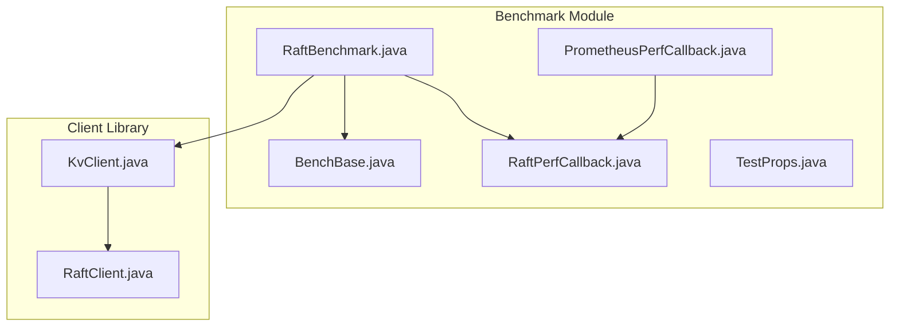
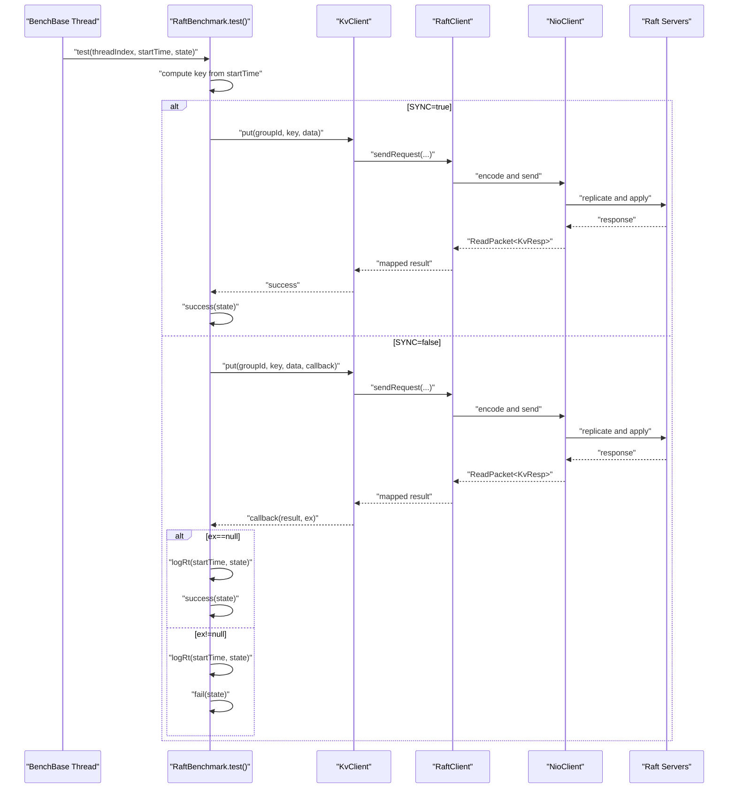
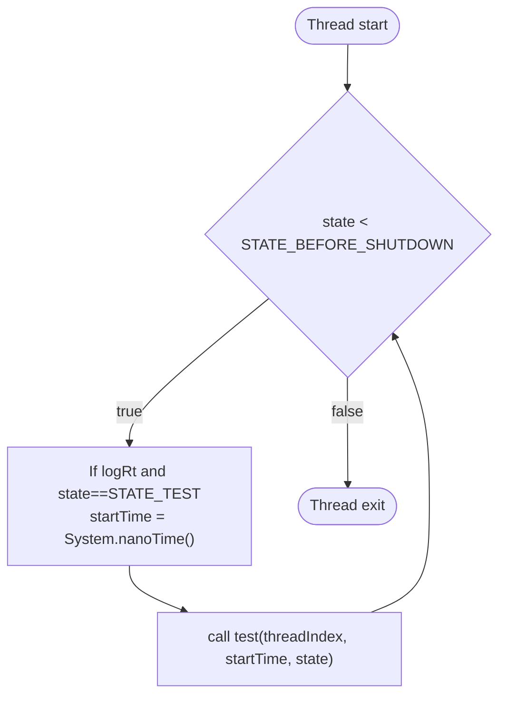
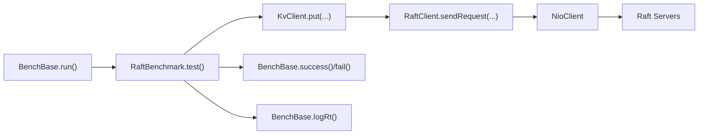

# RAFT Benchmark Execution and Workload Generation

<cite>
**Referenced Files in This Document**
- [RaftBenchmark.java](file://benchmark/src/main/java/com/github/dtprj/dongting/bench/raft/RaftBenchmark.java)
- [BenchBase.java](file://benchmark/src/main/java/com/github/dtprj/dongting/bench/common/BenchBase.java)
- [KvClient.java](file://client/src/main/java/com/github/dtprj/dongting/dtkv/KvClient.java)
- [RaftClient.java](file://client/src/main/java/com/github/dtprj/dongting/raft/RaftClient.java)
- [RaftPerfCallback.java](file://benchmark/src/main/java/com/github/dtprj/dongting/bench/raft/RaftPerfCallback.java)
- [PrometheusPerfCallback.java](file://benchmark/src/main/java/com/github/dtprj/dongting/bench/common/PrometheusPerfCallback.java)
- [TestProps.java](file://benchmark/src/main/java/com/github/dtprj/dongting/bench/common/TestProps.java)
</cite>

## Table of Contents
1. [Introduction](#introduction)
2. [Project Structure](#project-structure)
3. [Core Components](#core-components)
4. [Architecture Overview](#architecture-overview)
5. [Detailed Component Analysis](#detailed-component-analysis)
6. [Dependency Analysis](#dependency-analysis)
7. [Performance Considerations](#performance-considerations)
8. [Troubleshooting Guide](#troubleshooting-guide)
9. [Conclusion](#conclusion)
10. [Appendices](#appendices)

## Introduction
This document explains how the RAFT benchmark executes a PUT workload across multiple threads, how keys are generated, how distributed writes are performed via KvClient, and how latency and throughput metrics are captured. It also covers warmup and test phases, success/failure accounting, and how to modify the workload pattern and tune parameters safely.

## Project Structure
The RAFT benchmark resides in the benchmark module and uses shared benchmark infrastructure and the client library for distributed KV operations.

**Diagram sources**
- [RaftBenchmark.java](file://benchmark/src/main/java/com/github/dtprj/dongting/bench/raft/RaftBenchmark.java#L1-L229)
- [BenchBase.java](file://benchmark/src/main/java/com/github/dtprj/dongting/bench/common/BenchBase.java#L1-L153)
- [KvClient.java](file://client/src/main/java/com/github/dtprj/dongting/dtkv/KvClient.java#L1-L771)
- [RaftClient.java](file://client/src/main/java/com/github/dtprj/dongting/raft/RaftClient.java#L1-L200)
- [RaftPerfCallback.java](file://benchmark/src/main/java/com/github/dtprj/dongting/bench/raft/RaftPerfCallback.java#L1-L184)
- [PrometheusPerfCallback.java](file://benchmark/src/main/java/com/github/dtprj/dongting/bench/common/PrometheusPerfCallback.java#L1-L103)
- [TestProps.java](file://benchmark/src/main/java/com/github/dtprj/dongting/bench/common/TestProps.java#L1-L47)

**Section sources**
- [RaftBenchmark.java](file://benchmark/src/main/java/com/github/dtprj/dongting/bench/raft/RaftBenchmark.java#L1-L229)
- [BenchBase.java](file://benchmark/src/main/java/com/github/dtprj/dongting/bench/common/BenchBase.java#L1-L153)

## Core Components
- RaftBenchmark orchestrates server startup, client initialization, warmup, test loop, and shutdown. It defines constants for concurrency, data size, and key space.
- BenchBase provides the threading model, warmup/test phases, and latency tracking via logRt.
- KvClient exposes synchronous and asynchronous PUT operations used by the benchmark.
- RaftClient manages Raft membership and network transport for distributed requests.
- PrometheusPerfCallback and RaftPerfCallback capture and expose performance metrics.

**Section sources**
- [RaftBenchmark.java](file://benchmark/src/main/java/com/github/dtprj/dongting/bench/raft/RaftBenchmark.java#L59-L108)
- [BenchBase.java](file://benchmark/src/main/java/com/github/dtprj/dongting/bench/common/BenchBase.java#L30-L153)
- [KvClient.java](file://client/src/main/java/com/github/dtprj/dongting/dtkv/KvClient.java#L237-L258)
- [RaftClient.java](file://client/src/main/java/com/github/dtprj/dongting/raft/RaftClient.java#L1-L200)
- [RaftPerfCallback.java](file://benchmark/src/main/java/com/github/dtprj/dongting/bench/raft/RaftPerfCallback.java#L1-L184)
- [PrometheusPerfCallback.java](file://benchmark/src/main/java/com/github/dtprj/dongting/bench/common/PrometheusPerfCallback.java#L1-L103)

## Architecture Overview
The benchmark runs multiple threads, each executing PUT operations to a Raft group through KvClient. RaftClient routes requests to the leader and coordinates replication. Metrics are collected via PrometheusPerfCallback and RaftPerfCallback.

**Diagram sources**
- [RaftBenchmark.java](file://benchmark/src/main/java/com/github/dtprj/dongting/bench/raft/RaftBenchmark.java#L199-L225)
- [BenchBase.java](file://benchmark/src/main/java/com/github/dtprj/dongting/bench/common/BenchBase.java#L110-L136)
- [KvClient.java](file://client/src/main/java/com/github/dtprj/dongting/dtkv/KvClient.java#L132-L153)
- [RaftClient.java](file://client/src/main/java/com/github/dtprj/dongting/raft/RaftClient.java#L1-L200)

## Detailed Component Analysis

### Workload Generation Across Threads
- Each thread runs a loop controlled by BenchBase. The loop sets a per-iteration startTime when latency logging is enabled and calls test(threadIndex, startTime, state).
- The threadIndex parameter identifies the client instance and determines which KvClient to use for issuing requests.
- The startTime value is unique per iteration and is used to compute the key and to measure round-trip latency.

**Diagram sources**
- [BenchBase.java](file://benchmark/src/main/java/com/github/dtprj/dongting/bench/common/BenchBase.java#L110-L123)
- [BenchBase.java](file://benchmark/src/main/java/com/github/dtprj/dongting/bench/common/BenchBase.java#L127-L135)

**Section sources**
- [BenchBase.java](file://benchmark/src/main/java/com/github/dtprj/dongting/bench/common/BenchBase.java#L65-L123)
- [BenchBase.java](file://benchmark/src/main/java/com/github/dtprj/dongting/bench/common/BenchBase.java#L127-L135)

### PUT Operation Execution Pattern Using KvClient
- Synchronous mode: RaftBenchmark.test invokes KvClient.put(groupId, key, data) and increments success(state) upon completion.
- Asynchronous mode: RaftBenchmark.test invokes KvClient.put(groupId, key, data, callback). The callback updates latency and success/failure counters based on whether an exception occurred.

Key behaviors:
- Key validation and value checks are performed inside KvClient.put.
- The callback path maps network responses to success or failure and triggers latency logging.

**Section sources**
- [RaftBenchmark.java](file://benchmark/src/main/java/com/github/dtprj/dongting/bench/raft/RaftBenchmark.java#L204-L225)
- [KvClient.java](file://client/src/main/java/com/github/dtprj/dongting/dtkv/KvClient.java#L237-L258)
- [KvClient.java](file://client/src/main/java/com/github/dtprj/dongting/dtkv/KvClient.java#L132-L153)

### Key Generation Strategy
- The benchmark computes k = Integer.reverse((int) startTime) and then k = Math.abs(k % KEYS).
- This produces a pseudo-random distribution of keys across the KEYS range, leveraging the bit-reversal property to improve distribution characteristics.

Implications:
- The key space is bounded by KEYS, which helps control memory footprint and contention.
- Uneven distribution can occur if the modulo operation introduces bias; consider alternatives like hashing or modulo with prime if needed.

**Section sources**
- [RaftBenchmark.java](file://benchmark/src/main/java/com/github/dtprj/dongting/bench/raft/RaftBenchmark.java#L201-L202)

### State Management During Warmup and Test Phases
- BenchBase controls phases via an atomic state field:
  - STATE_WARMUP: initial sleep for warmupTime.
  - STATE_TEST: switches to test phase and records latency if enabled.
  - STATE_BEFORE_SHUTDOWN: signals threads to finish current iterations.
  - STATE_AFTER_SHUTDOWN: prints final statistics and shuts down.
- After warmup, RaftPerfCallback is started for Prometheus metrics collection.

**Section sources**
- [BenchBase.java](file://benchmark/src/main/java/com/github/dtprj/dongting/bench/common/BenchBase.java#L30-L61)
- [BenchBase.java](file://benchmark/src/main/java/com/github/dtprj/dongting/bench/common/BenchBase.java#L65-L108)
- [RaftBenchmark.java](file://benchmark/src/main/java/com/github/dtprj/dongting/bench/raft/RaftBenchmark.java#L173-L181)

### Success and Failure Counts Tracking
- BenchBase maintains successCount and failCount via LongAdder and AtomicLong.
- success(state) and fail(state) increment counters only during STATE_TEST.
- At the end of the test, BenchBase prints success and failure rates in ops.

**Section sources**
- [BenchBase.java](file://benchmark/src/main/java/com/github/dtprj/dongting/bench/common/BenchBase.java#L40-L47)
- [BenchBase.java](file://benchmark/src/main/java/com/github/dtprj/dongting/bench/common/BenchBase.java#L137-L147)
- [BenchBase.java](file://benchmark/src/main/java/com/github/dtprj/dongting/bench/common/BenchBase.java#L90-L104)

### Latency Measurement with logRt
- logRt measures round-trip time in nanoseconds when enabled and state equals STATE_TEST.
- It updates totalNanos and maxNanos for later reporting.

**Section sources**
- [BenchBase.java](file://benchmark/src/main/java/com/github/dtprj/dongting/bench/common/BenchBase.java#L127-L135)
- [BenchBase.java](file://benchmark/src/main/java/com/github/dtprj/dongting/bench/common/BenchBase.java#L99-L103)

### Test Duration Control
- BenchBase sleeps for warmupTime initially, then switches state to STATE_TEST, sleeps for testTime, transitions to STATE_BEFORE_SHUTDOWN, waits for threads to join, and calls shutdown.

**Section sources**
- [BenchBase.java](file://benchmark/src/main/java/com/github/dtprj/dongting/bench/common/BenchBase.java#L65-L88)

### Modifying the Workload Pattern
Examples of changes you can make in RaftBenchmark:

- Adjust operation types:
  - Replace PUT with GET, BATCH_PUT, BATCH_GET, REMOVE, or CAS by invoking the corresponding methods on KvClient and adapting the callback to update success/failure accordingly.
  - Example paths to review: [KvClient.java](file://client/src/main/java/com/github/dtprj/dongting/dtkv/KvClient.java#L303-L339), [KvClient.java](file://client/src/main/java/com/github/dtprj/dongting/dtkv/KvClient.java#L488-L517), [KvClient.java](file://client/src/main/java/com/github/dtprj/dongting/dtkv/KvClient.java#L613-L650).

- Change concurrency:
  - Modify CLIENT_COUNT to scale client threads and TCP connections. Each client’s maxOutRequests is divided by threadCount to balance load.
  - Reference: [RaftBenchmark.java](file://benchmark/src/main/java/com/github/dtprj/dongting/bench/raft/RaftBenchmark.java#L153-L163).

- Tune data sizes:
  - Adjust DATA_LEN to vary payload size. The DATA buffer is preallocated and reused.
  - Reference: [RaftBenchmark.java](file://benchmark/src/main/java/com/github/dtprj/dongting/bench/raft/RaftBenchmark.java#L62-L71).

- Configure client concurrency limits:
  - CLIENT_MAX_OUT_REQUESTS controls the maximum outstanding requests per client. Lower values reduce memory pressure; higher values increase throughput and latency.
  - Reference: [RaftBenchmark.java](file://benchmark/src/main/java/com/github/dtprj/dongting/bench/raft/RaftBenchmark.java#L65-L66).

- Switch between sync and async:
  - Toggle SYNC to true for synchronous PUT calls; false for asynchronous callbacks.
  - Reference: [RaftBenchmark.java](file://benchmark/src/main/java/com/github/dtprj/dongting/bench/raft/RaftBenchmark.java#L61-L61).

- Change key space:
  - Increase KEYS to reduce hot-spotting and contention.
  - Reference: [RaftBenchmark.java](file://benchmark/src/main/java/com/github/dtprj/dongting/bench/raft/RaftBenchmark.java#L69-L69).

- Modify key generation:
  - Replace Integer.reverse and modulo with a hash-based scheme or prime modulo to improve distribution.
  - Reference: [RaftBenchmark.java](file://benchmark/src/main/java/com/github/dtprj/dongting/bench/raft/RaftBenchmark.java#L201-L202).

- Enable performance metrics:
  - Set PERF to true to attach RaftPerfCallback for detailed metrics.
  - Reference: [RaftBenchmark.java](file://benchmark/src/main/java/com/github/dtprj/dongting/bench/raft/RaftBenchmark.java#L66-L66), [RaftBenchmark.java](file://benchmark/src/main/java/com/github/dtprj/dongting/bench/raft/RaftBenchmark.java#L100-L102).

**Section sources**
- [RaftBenchmark.java](file://benchmark/src/main/java/com/github/dtprj/dongting/bench/raft/RaftBenchmark.java#L59-L108)
- [RaftBenchmark.java](file://benchmark/src/main/java/com/github/dtprj/dongting/bench/raft/RaftBenchmark.java#L153-L163)
- [KvClient.java](file://client/src/main/java/com/github/dtprj/dongting/dtkv/KvClient.java#L237-L258)
- [KvClient.java](file://client/src/main/java/com/github/dtprj/dongting/dtkv/KvClient.java#L303-L339)
- [KvClient.java](file://client/src/main/java/com/github/dtprj/dongting/dtkv/KvClient.java#L488-L517)
- [KvClient.java](file://client/src/main/java/com/github/dtprj/dongting/dtkv/KvClient.java#L613-L650)

### Guidance on Avoiding Common Pitfalls
- Uneven key distribution:
  - The current modulo strategy can introduce bias. Consider using a hash-based key generator or prime modulo to spread keys more evenly.
  - Reference: [RaftBenchmark.java](file://benchmark/src/main/java/com/github/dtprj/dongting/bench/raft/RaftBenchmark.java#L201-L202).

- Client bottlenecks:
  - Ensure CLIENT_MAX_OUT_REQUESTS is sufficient for desired throughput; divide by threadCount to avoid per-client overload.
  - Reference: [RaftBenchmark.java](file://benchmark/src/main/java/com/github/dtprj/dongting/bench/raft/RaftBenchmark.java#L158-L158).

- Memory pressure:
  - Reduce DATA_LEN or increase KEYS to lower per-key memory overhead.
  - Reference: [RaftBenchmark.java](file://benchmark/src/main/java/com/github/dtprj/dongting/bench/raft/RaftBenchmark.java#L62-L71), [RaftBenchmark.java](file://benchmark/src/main/java/com/github/dtprj/dongting/bench/raft/RaftBenchmark.java#L69-L69).

- Leader imbalance:
  - Increase CLIENT_COUNT to distribute load across more clients and reduce contention on a single client.
  - Reference: [RaftBenchmark.java](file://benchmark/src/main/java/com/github/dtprj/dongting/bench/raft/RaftBenchmark.java#L60-L60).

## Dependency Analysis
The following diagram shows the primary runtime dependencies among components during a typical test iteration.

**Diagram sources**
- [BenchBase.java](file://benchmark/src/main/java/com/github/dtprj/dongting/bench/common/BenchBase.java#L110-L136)
- [RaftBenchmark.java](file://benchmark/src/main/java/com/github/dtprj/dongting/bench/raft/RaftBenchmark.java#L199-L225)
- [KvClient.java](file://client/src/main/java/com/github/dtprj/dongting/dtkv/KvClient.java#L132-L153)
- [RaftClient.java](file://client/src/main/java/com/github/dtprj/dongting/raft/RaftClient.java#L1-L200)

**Section sources**
- [RaftBenchmark.java](file://benchmark/src/main/java/com/github/dtprj/dongting/bench/raft/RaftBenchmark.java#L199-L225)
- [BenchBase.java](file://benchmark/src/main/java/com/github/dtprj/dongting/bench/common/BenchBase.java#L110-L136)
- [KvClient.java](file://client/src/main/java/com/github/dtprj/dongting/dtkv/KvClient.java#L132-L153)
- [RaftClient.java](file://client/src/main/java/com/github/dtprj/dongting/raft/RaftClient.java#L1-L200)

## Performance Considerations
- Throughput vs. latency trade-offs:
  - Higher CLIENT_MAX_OUT_REQUESTS increases throughput but may raise latency and memory usage.
  - Reference: [RaftBenchmark.java](file://benchmark/src/main/java/com/github/dtprj/dongting/bench/raft/RaftBenchmark.java#L65-L66).

- Concurrency scaling:
  - CLIENT_COUNT controls client threads and connections; increasing it can improve throughput but requires adequate CPU and network capacity.
  - Reference: [RaftBenchmark.java](file://benchmark/src/main/java/com/github/dtprj/dongting/bench/raft/RaftBenchmark.java#L60-L60).

- Payload sizing:
  - Larger DATA_LEN increases bandwidth and CPU usage; adjust based on target workload.
  - Reference: [RaftBenchmark.java](file://benchmark/src/main/java/com/github/dtprj/dongting/bench/raft/RaftBenchmark.java#L62-L71).

- Metrics overhead:
  - Enabling PERF adds performance callback overhead; use selectively for detailed profiling.
  - Reference: [RaftBenchmark.java](file://benchmark/src/main/java/com/github/dtprj/dongting/bench/raft/RaftBenchmark.java#L66-L66), [RaftPerfCallback.java](file://benchmark/src/main/java/com/github/dtprj/dongting/bench/raft/RaftPerfCallback.java#L1-L184).

## Troubleshooting Guide
- No leader elected or timeouts:
  - Verify Raft group members and ports. Ensure servers are started and reachable.
  - Reference: [RaftBenchmark.java](file://benchmark/src/main/java/com/github/dtprj/dongting/bench/raft/RaftBenchmark.java#L144-L163).

- Excessive failures:
  - Check network connectivity, maxOutRequests limits, and key validity.
  - Reference: [KvClient.java](file://client/src/main/java/com/github/dtprj/dongting/dtkv/KvClient.java#L190-L219), [RaftBenchmark.java](file://benchmark/src/main/java/com/github/dtprj/dongting/bench/raft/RaftBenchmark.java#L158-L158).

- Uneven distribution:
  - Consider changing key generation strategy to reduce hot spots.
  - Reference: [RaftBenchmark.java](file://benchmark/src/main/java/com/github/dtprj/dongting/bench/raft/RaftBenchmark.java#L201-L202).

- Metrics not appearing:
  - Ensure Prometheus is configured and RaftPerfCallback.start() is invoked after warmup.
  - Reference: [RaftBenchmark.java](file://benchmark/src/main/java/com/github/dtprj/dongting/bench/raft/RaftBenchmark.java#L173-L181), [PrometheusPerfCallback.java](file://benchmark/src/main/java/com/github/dtprj/dongting/bench/common/PrometheusPerfCallback.java#L51-L53).

**Section sources**
- [RaftBenchmark.java](file://benchmark/src/main/java/com/github/dtprj/dongting/bench/raft/RaftBenchmark.java#L144-L163)
- [KvClient.java](file://client/src/main/java/com/github/dtprj/dongting/dtkv/KvClient.java#L190-L219)
- [PrometheusPerfCallback.java](file://benchmark/src/main/java/com/github/dtprj/dongting/bench/common/PrometheusPerfCallback.java#L51-L53)

## Conclusion
The RAFT benchmark demonstrates a clean separation between workload generation (BenchBase), distributed KV operations (KvClient), and Raft coordination (RaftClient). By tuning concurrency, payload size, and key distribution, you can tailor the benchmark to your performance goals while accurately measuring latency and throughput.

## Appendices

### Appendix A: Configuration Options
- CLIENT_COUNT: Number of client threads and TCP connections.
- CLIENT_MAX_OUT_REQUESTS: Maximum outstanding requests per client.
- DATA_LEN: Size of the value payload.
- KEYS: Total number of distinct keys.
- SYNC: Toggle synchronous vs asynchronous PUT.
- PERF: Enable detailed performance metrics.
- Test durations: Controlled by warmupTime and testTime in BenchBase.

**Section sources**
- [RaftBenchmark.java](file://benchmark/src/main/java/com/github/dtprj/dongting/bench/raft/RaftBenchmark.java#L60-L71)
- [BenchBase.java](file://benchmark/src/main/java/com/github/dtprj/dongting/bench/common/BenchBase.java#L48-L54)

### Appendix B: Environment Configuration
- TestProps allows overriding directories via a user config file for server data directories.
- Reference: [TestProps.java](file://benchmark/src/main/java/com/github/dtprj/dongting/bench/common/TestProps.java#L1-L47).