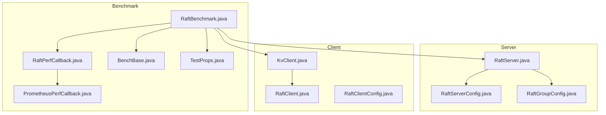
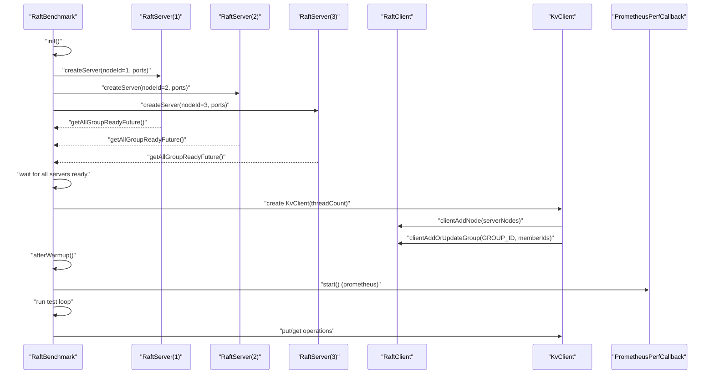
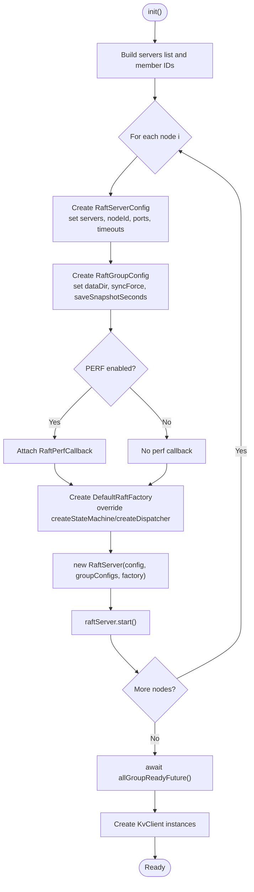
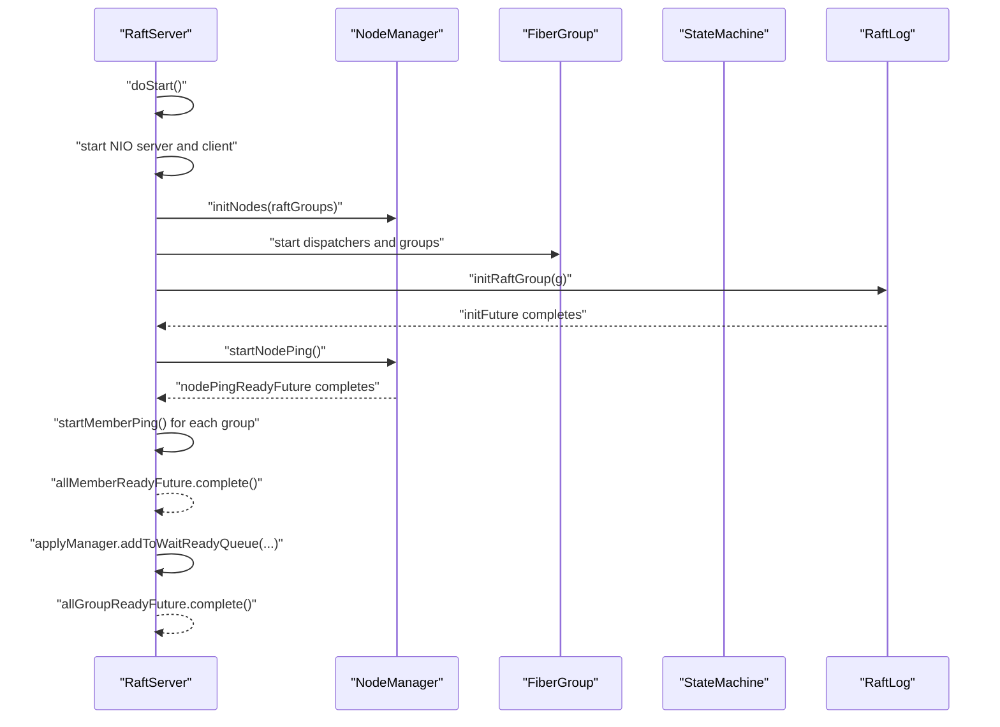
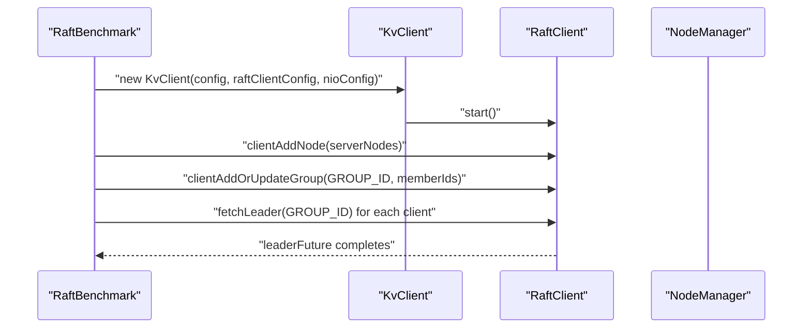
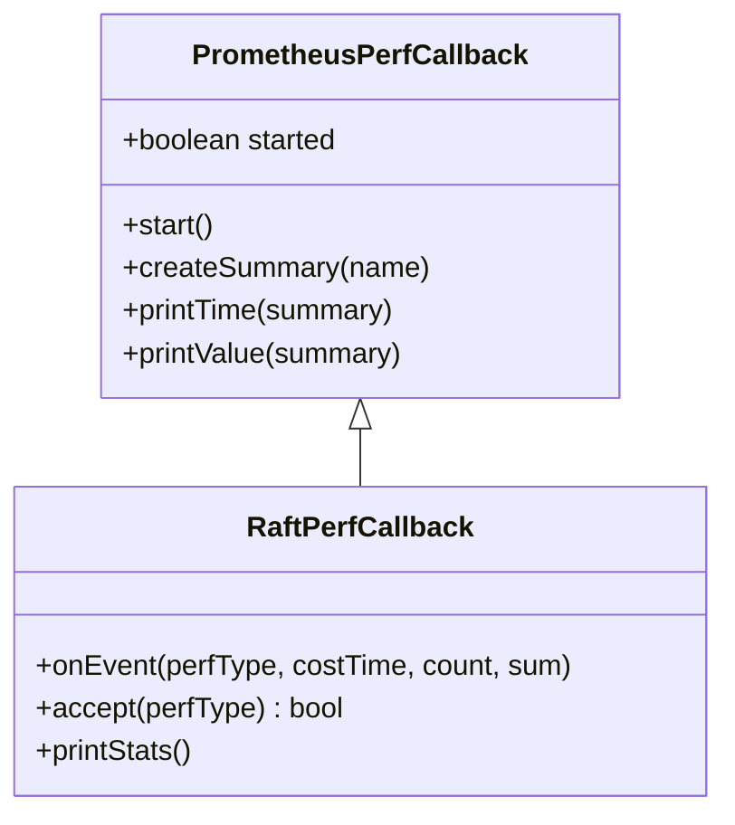
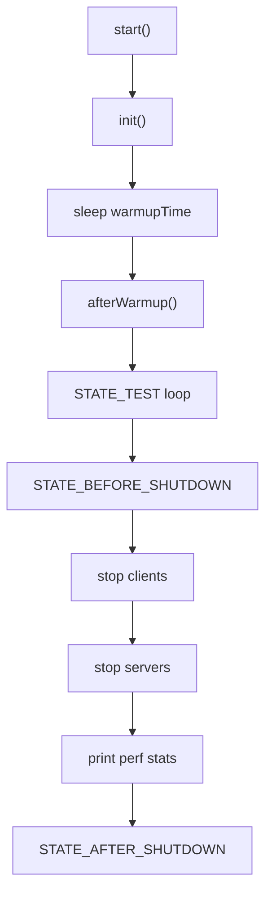
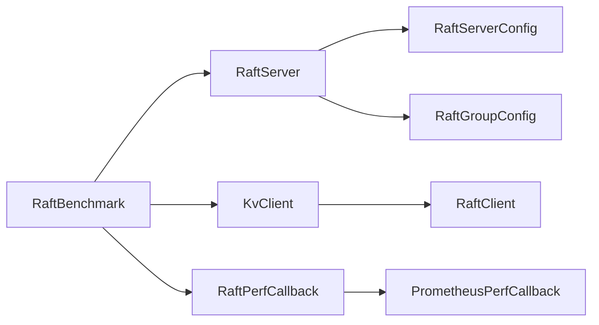

# RAFT Benchmark Setup and Configuration

<cite>
**Referenced Files in This Document**
- [RaftBenchmark.java](file://benchmark/src/main/java/com/github/dtprj/dongting/bench/raft/RaftBenchmark.java)
- [RaftPerfCallback.java](file://benchmark/src/main/java/com/github/dtprj/dongting/bench/raft/RaftPerfCallback.java)
- [RaftServer.java](file://server/src/main/java/com/github/dtprj/dongting/raft/server/RaftServer.java)
- [RaftServerConfig.java](file://server/src/main/java/com/github/dtprj/dongting/raft/server/RaftServerConfig.java)
- [RaftGroupConfig.java](file://server/src/main/java/com/github/dtprj/dongting/raft/server/RaftGroupConfig.java)
- [KvClient.java](file://client/src/main/java/com/github/dtprj/dongting/dtkv/KvClient.java)
- [RaftClient.java](file://client/src/main/java/com/github/dtprj/dongting/raft/RaftClient.java)
- [RaftClientConfig.java](file://client/src/main/java/com/github/dtprj/dongting/raft/RaftClientConfig.java)
- [BenchBase.java](file://benchmark/src/main/java/com/github/dtprj/dongting/bench/common/BenchBase.java)
- [TestProps.java](file://benchmark/src/main/java/com/github/dtprj/dongting/bench/common/TestProps.java)
- [PrometheusPerfCallback.java](file://benchmark/src/main/java/com/github/dtprj/dongting/bench/common/PrometheusPerfCallback.java)
</cite>

## Table of Contents
1. [Introduction](#introduction)
2. [Project Structure](#project-structure)
3. [Core Components](#core-components)
4. [Architecture Overview](#architecture-overview)
5. [Detailed Component Analysis](#detailed-component-analysis)
6. [Dependency Analysis](#dependency-analysis)
7. [Performance Considerations](#performance-considerations)
8. [Troubleshooting Guide](#troubleshooting-guide)
9. [Conclusion](#conclusion)
10. [Appendices](#appendices)

## Introduction
This document explains how the RAFT benchmark initializes a multi-node cluster, configures Raft servers and groups, sets up distributed key-value clients, and prepares for warmup and test phases. It focuses on:
- Creating multiple RaftServer instances with unique node IDs, replicate ports, and service ports
- Configuring RaftServerConfig (servers list, node ID, timing parameters)
- Creating RaftGroupConfig with data directory, SYNC_FORCE, and performance callback integration
- Initializing KvClient instances for distributed key-value operations
- Modifying cluster topology and adjusting group membership
- Configuring performance monitoring options and Prometheus metrics

## Project Structure
The RAFT benchmark lives under the benchmark module and interacts with server-side Raft primitives and client-side KV APIs.

**Diagram sources**
- [RaftBenchmark.java](file://benchmark/src/main/java/com/github/dtprj/dongting/bench/raft/RaftBenchmark.java#L1-L229)
- [RaftPerfCallback.java](file://benchmark/src/main/java/com/github/dtprj/dongting/bench/raft/RaftPerfCallback.java#L1-L184)
- [RaftServer.java](file://server/src/main/java/com/github/dtprj/dongting/raft/server/RaftServer.java#L1-L718)
- [RaftServerConfig.java](file://server/src/main/java/com/github/dtprj/dongting/raft/server/RaftServerConfig.java#L1-L40)
- [RaftGroupConfig.java](file://server/src/main/java/com/github/dtprj/dongting/raft/server/RaftGroupConfig.java#L1-L76)
- [KvClient.java](file://client/src/main/java/com/github/dtprj/dongting/dtkv/KvClient.java#L1-L771)
- [RaftClient.java](file://client/src/main/java/com/github/dtprj/dongting/raft/RaftClient.java#L1-L590)
- [RaftClientConfig.java](file://client/src/main/java/com/github/dtprj/dongting/raft/RaftClientConfig.java#L1-L34)
- [BenchBase.java](file://benchmark/src/main/java/com/github/dtprj/dongting/bench/common/BenchBase.java#L1-L153)
- [TestProps.java](file://benchmark/src/main/java/com/github/dtprj/dongting/bench/common/TestProps.java#L1-L47)
- [PrometheusPerfCallback.java](file://benchmark/src/main/java/com/github/dtprj/dongting/bench/common/PrometheusPerfCallback.java#L1-L103)

**Section sources**
- [RaftBenchmark.java](file://benchmark/src/main/java/com/github/dtprj/dongting/bench/raft/RaftBenchmark.java#L1-L229)
- [RaftServer.java](file://server/src/main/java/com/github/dtprj/dongting/raft/server/RaftServer.java#L1-L718)
- [KvClient.java](file://client/src/main/java/com/github/dtprj/dongting/dtkv/KvClient.java#L1-L771)

## Core Components
- RaftBenchmark orchestrates cluster startup, client creation, warmup/test phases, and performance reporting.
- RaftServerConfig defines per-node networking and timing parameters.
- RaftGroupConfig defines per-group storage, durability, concurrency, and performance callback integration.
- KvClient and RaftClient provide distributed key-value operations and leader routing.

**Section sources**
- [RaftBenchmark.java](file://benchmark/src/main/java/com/github/dtprj/dongting/bench/raft/RaftBenchmark.java#L60-L120)
- [RaftServerConfig.java](file://server/src/main/java/com/github/dtprj/dongting/raft/server/RaftServerConfig.java#L18-L40)
- [RaftGroupConfig.java](file://server/src/main/java/com/github/dtprj/dongting/raft/server/RaftGroupConfig.java#L18-L76)
- [KvClient.java](file://client/src/main/java/com/github/dtprj/dongting/dtkv/KvClient.java#L60-L120)
- [RaftClient.java](file://client/src/main/java/com/github/dtprj/dongting/raft/RaftClient.java#L80-L170)

## Architecture Overview
The benchmark starts N RaftServer instances, each bound to a unique node ID and port pair. Each server hosts one Raft group configured with a data directory and performance callback. After all servers are ready, the benchmark creates multiple KvClient instances, registers them with the Raft cluster, and waits for leaders to be elected.

**Diagram sources**
- [RaftBenchmark.java](file://benchmark/src/main/java/com/github/dtprj/dongting/bench/raft/RaftBenchmark.java#L130-L171)
- [RaftServer.java](file://server/src/main/java/com/github/dtprj/dongting/raft/server/RaftServer.java#L330-L474)
- [RaftClient.java](file://client/src/main/java/com/github/dtprj/dongting/raft/RaftClient.java#L80-L170)
- [KvClient.java](file://client/src/main/java/com/github/dtprj/dongting/dtkv/KvClient.java#L60-L120)
- [RaftPerfCallback.java](file://benchmark/src/main/java/com/github/dtprj/dongting/bench/raft/RaftPerfCallback.java#L1-L184)

## Detailed Component Analysis

### Cluster Initialization and Server Creation
- Node IDs and ports:
  - The benchmark iterates over node IDs from 1 to N, assigning each a replicate port and a service port. These are derived from a base offset plus the node ID.
  - Example: node i uses replicatePort 4000 + i and servicePort 5000 + i.
- RaftServerConfig construction:
  - servers string lists all nodes with format "nodeId,host:port;" entries.
  - nodeId identifies the local node.
  - replicatePort and servicePort define the replication and client-facing ports.
  - Timing parameters include election timeout and heartbeat interval.
- RaftGroupConfig construction:
  - dataDir is set per-node using a directory path template and node ID.
  - syncForce controls whether to force writes to disk after append.
  - saveSnapshotSeconds is set to a large value to reduce snapshot frequency during benchmarks.
  - perfCallback can be attached to collect performance metrics.
- Factory customization:
  - DefaultRaftFactory is overridden to supply a state machine (DtKV), a dispatcher with a node-specific name, and a perf callback.

**Diagram sources**
- [RaftBenchmark.java](file://benchmark/src/main/java/com/github/dtprj/dongting/bench/raft/RaftBenchmark.java#L130-L171)
- [RaftServer.java](file://server/src/main/java/com/github/dtprj/dongting/raft/server/RaftServer.java#L112-L189)

**Section sources**
- [RaftBenchmark.java](file://benchmark/src/main/java/com/github/dtprj/dongting/bench/raft/RaftBenchmark.java#L86-L128)
- [RaftServerConfig.java](file://server/src/main/java/com/github/dtprj/dongting/raft/server/RaftServerConfig.java#L18-L40)
- [RaftGroupConfig.java](file://server/src/main/java/com/github/dtprj/dongting/raft/server/RaftGroupConfig.java#L18-L76)
- [RaftServer.java](file://server/src/main/java/com/github/dtprj/dongting/raft/server/RaftServer.java#L112-L189)

### RaftServer Lifecycle and Group Readiness
- Server startup:
  - Creates a replicate NIO server and client with configured ports and IO limits.
  - Initializes NodeManager and registers RPC processors for Raft and admin commands.
  - Builds Raft groups from RaftGroupConfig list, parsing member IDs and observers.
  - Starts dispatchers and fiber groups per group, then initializes Raft logs and state machines.
- Readiness:
  - allMemberReadyFuture completes when all nodes are reachable and ping checks pass.
  - allGroupReadyFuture completes when all groups have applied the initial ready index and services are available.

**Diagram sources**
- [RaftServer.java](file://server/src/main/java/com/github/dtprj/dongting/raft/server/RaftServer.java#L330-L474)

**Section sources**
- [RaftServer.java](file://server/src/main/java/com/github/dtprj/dongting/raft/server/RaftServer.java#L330-L474)

### Client Initialization and Group Membership
- KvClient creation:
  - Each thread creates a KvClient with a RaftClientConfig and NioClientConfig.
  - maxOutRequests is divided among threads to control concurrency.
- Group membership:
  - clientAddNode adds RaftNode entries with nodeId and HostPort.
  - clientAddOrUpdateGroup registers the group and its members; the benchmark passes the member IDs derived from the servers list.
- Leader discovery:
  - The benchmark waits for leader futures to resolve before starting the test phase.

**Diagram sources**
- [RaftBenchmark.java](file://benchmark/src/main/java/com/github/dtprj/dongting/bench/raft/RaftBenchmark.java#L153-L171)
- [RaftClient.java](file://client/src/main/java/com/github/dtprj/dongting/raft/RaftClient.java#L80-L170)
- [KvClient.java](file://client/src/main/java/com/github/dtprj/dongting/dtkv/KvClient.java#L60-L120)

**Section sources**
- [RaftBenchmark.java](file://benchmark/src/main/java/com/github/dtprj/dongting/bench/raft/RaftBenchmark.java#L153-L171)
- [RaftClient.java](file://client/src/main/java/com/github/dtprj/dongting/raft/RaftClient.java#L80-L170)
- [KvClient.java](file://client/src/main/java/com/github/dtprj/dongting/dtkv/KvClient.java#L60-L120)

### Performance Monitoring and Metrics
- PrometheusPerfCallback:
  - Provides a base for registering summaries and printing quantiles.
  - RaftPerfCallback registers summaries for fiber polling/work, leader runner latency, log encode/write/sync, index write/sync, replicate RPC, and state machine execution.
- Enabling metrics:
  - When PERF is true, RaftPerfCallback is attached to each RaftGroupConfig.
  - afterWarmup triggers PrometheusPerfCallback.start() to enable metric collection.
  - shutdown prints aggregated statistics from RaftPerfCallback.

**Diagram sources**
- [PrometheusPerfCallback.java](file://benchmark/src/main/java/com/github/dtprj/dongting/bench/common/PrometheusPerfCallback.java#L1-L103)
- [RaftPerfCallback.java](file://benchmark/src/main/java/com/github/dtprj/dongting/bench/raft/RaftPerfCallback.java#L1-L184)

**Section sources**
- [RaftPerfCallback.java](file://benchmark/src/main/java/com/github/dtprj/dongting/bench/raft/RaftPerfCallback.java#L1-L184)
- [PrometheusPerfCallback.java](file://benchmark/src/main/java/com/github/dtprj/dongting/bench/common/PrometheusPerfCallback.java#L1-L103)
- [RaftBenchmark.java](file://benchmark/src/main/java/com/github/dtprj/dongting/bench/raft/RaftBenchmark.java#L173-L196)

### Test Loop and Warmup/Shutdown
- BenchBase manages warmup, test, and shutdown phases:
  - Warmup phase runs before switching to test state.
  - Test phase executes the benchmark’s test method per thread.
  - Shutdown stops clients and servers and prints performance stats.
- RaftBenchmark.test performs synchronous or asynchronous KV operations and updates counters.

**Diagram sources**
- [BenchBase.java](file://benchmark/src/main/java/com/github/dtprj/dongting/bench/common/BenchBase.java#L65-L153)
- [RaftBenchmark.java](file://benchmark/src/main/java/com/github/dtprj/dongting/bench/raft/RaftBenchmark.java#L173-L226)

**Section sources**
- [BenchBase.java](file://benchmark/src/main/java/com/github/dtprj/dongting/bench/common/BenchBase.java#L65-L153)
- [RaftBenchmark.java](file://benchmark/src/main/java/com/github/dtprj/dongting/bench/raft/RaftBenchmark.java#L173-L226)

## Dependency Analysis
- RaftBenchmark depends on:
  - RaftServer for cluster hosting
  - RaftServerConfig and RaftGroupConfig for per-node and per-group configuration
  - RaftPerfCallback and PrometheusPerfCallback for metrics
  - KvClient and RaftClient for distributed operations
- RaftServer depends on:
  - RaftServerConfig for node identity and timing
  - RaftGroupConfig for storage and concurrency settings
  - DefaultRaftFactory for state machine, dispatcher, and IO executors
- Client depends on:
  - RaftClient for leader discovery and routing
  - NioClient for transport

**Diagram sources**
- [RaftBenchmark.java](file://benchmark/src/main/java/com/github/dtprj/dongting/bench/raft/RaftBenchmark.java#L1-L229)
- [RaftServer.java](file://server/src/main/java/com/github/dtprj/dongting/raft/server/RaftServer.java#L1-L718)
- [RaftServerConfig.java](file://server/src/main/java/com/github/dtprj/dongting/raft/server/RaftServerConfig.java#L1-L40)
- [RaftGroupConfig.java](file://server/src/main/java/com/github/dtprj/dongting/raft/server/RaftGroupConfig.java#L1-L76)
- [KvClient.java](file://client/src/main/java/com/github/dtprj/dongting/dtkv/KvClient.java#L1-L771)
- [RaftClient.java](file://client/src/main/java/com/github/dtprj/dongting/raft/RaftClient.java#L1-L590)
- [RaftPerfCallback.java](file://benchmark/src/main/java/com/github/dtprj/dongting/bench/raft/RaftPerfCallback.java#L1-L184)
- [PrometheusPerfCallback.java](file://benchmark/src/main/java/com/github/dtprj/dongting/bench/common/PrometheusPerfCallback.java#L1-L103)

**Section sources**
- [RaftBenchmark.java](file://benchmark/src/main/java/com/github/dtprj/dongting/bench/raft/RaftBenchmark.java#L1-L229)
- [RaftServer.java](file://server/src/main/java/com/github/dtprj/dongting/raft/server/RaftServer.java#L1-L718)
- [KvClient.java](file://client/src/main/java/com/github/dtprj/dongting/dtkv/KvClient.java#L1-L771)

## Performance Considerations
- Concurrency and batching:
  - CLIENT_MAX_OUT_REQUESTS controls per-thread outstanding requests; it is divided among threads to balance load.
  - RaftGroupConfig exposes maxPendingTasks and related thresholds to tune memory pressure.
- Durability and sync:
  - syncForce toggles whether to force writes after append; disabling can improve throughput at the cost of durability.
- Timing parameters:
  - electTimeout and heartbeatInterval influence leader stability and responsiveness.
- Metrics overhead:
  - Enabling PERF introduces overhead; PrometheusPerfCallback is designed to minimize impact while capturing useful latencies.

[No sources needed since this section provides general guidance]

## Troubleshooting Guide
- Cluster readiness:
  - If allGroupReadyFuture does not complete, verify that all nodes are reachable and that the servers list includes the local node ID.
- Client leader discovery:
  - Ensure clientAddNode and clientAddOrUpdateGroup are called with the correct member IDs and that leader futures resolve.
- Data directory conflicts:
  - When changing NODE_COUNT, clean the target data directories to avoid stale state.
- Port conflicts:
  - Ensure replicatePort and servicePort combinations are unique per node and not in use by other processes.

**Section sources**
- [RaftServer.java](file://server/src/main/java/com/github/dtprj/dongting/raft/server/RaftServer.java#L112-L189)
- [RaftBenchmark.java](file://benchmark/src/main/java/com/github/dtprj/dongting/bench/raft/RaftBenchmark.java#L130-L171)

## Conclusion
The RAFT benchmark demonstrates a complete setup for multi-node Raft clusters with per-node configuration, group-level storage tuning, and distributed KV client operations. By controlling node IDs, ports, timing parameters, and performance callbacks, it enables reproducible and measurable performance experiments. The design cleanly separates server lifecycle, client routing, and metrics collection, facilitating easy modification for topology changes and monitoring preferences.

[No sources needed since this section summarizes without analyzing specific files]

## Appendices

### A. Modifying Cluster Topology and Group Membership
- Adding/removing nodes:
  - Use RaftServer admin APIs to addNode/removeNode for dynamic membership changes.
- Adding/removing groups:
  - Use addGroup/removeGroup to manage multiple Raft groups within the same server process.
- Client-side membership updates:
  - Use RaftClient clientAddOrUpdateGroup to update group members and leader discovery.

**Section sources**
- [RaftServer.java](file://server/src/main/java/com/github/dtprj/dongting/raft/server/RaftServer.java#L548-L716)
- [RaftClient.java](file://client/src/main/java/com/github/dtprj/dongting/raft/RaftClient.java#L153-L248)

### B. Environment Setup and Data Directory Management
- Data directory:
  - Each node uses a separate dataDir derived from a template and node ID.
- Test environment:
  - Use TestProps to override directories via a user config file.
- Cleanup:
  - When changing NODE_COUNT, remove the target data directories to avoid cross-node interference.

**Section sources**
- [RaftBenchmark.java](file://benchmark/src/main/java/com/github/dtprj/dongting/bench/raft/RaftBenchmark.java#L56-L108)
- [TestProps.java](file://benchmark/src/main/java/com/github/dtprj/dongting/bench/common/TestProps.java#L18-L47)

### C. Warmup and Test Phases
- Warmup:
  - BenchBase sleeps for warmupTime before switching to test state.
- Test:
  - RaftBenchmark.test performs KV operations and updates counters.
- Shutdown:
  - Stops clients and servers gracefully and prints performance statistics.

**Section sources**
- [BenchBase.java](file://benchmark/src/main/java/com/github/dtprj/dongting/bench/common/BenchBase.java#L65-L153)
- [RaftBenchmark.java](file://benchmark/src/main/java/com/github/dtprj/dongting/bench/raft/RaftBenchmark.java#L173-L226)