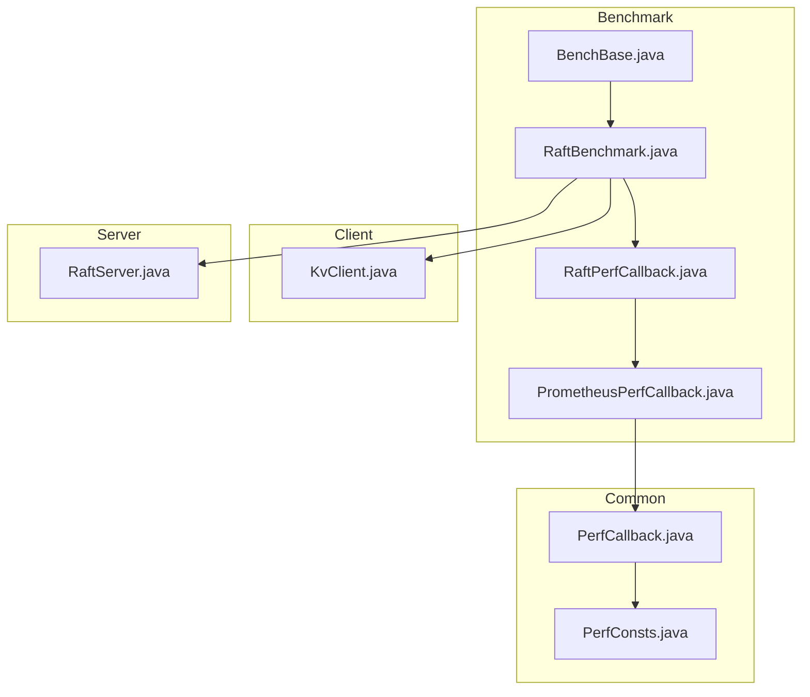
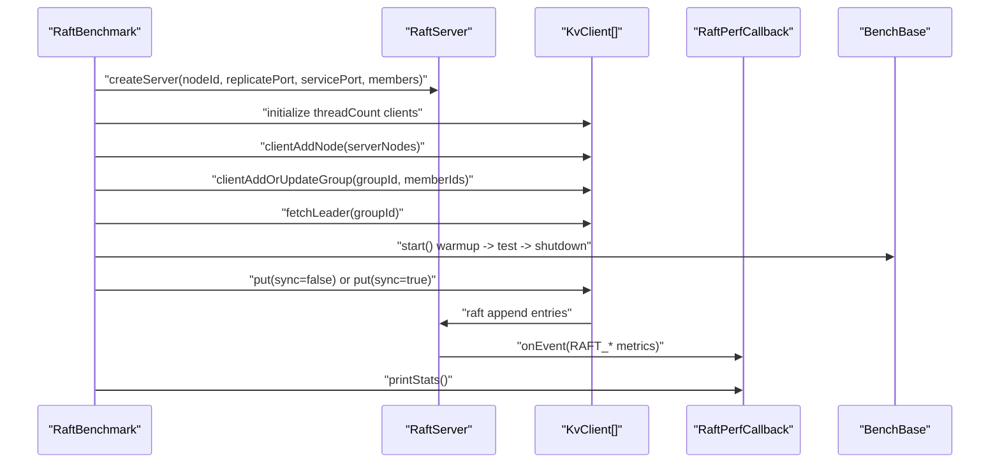
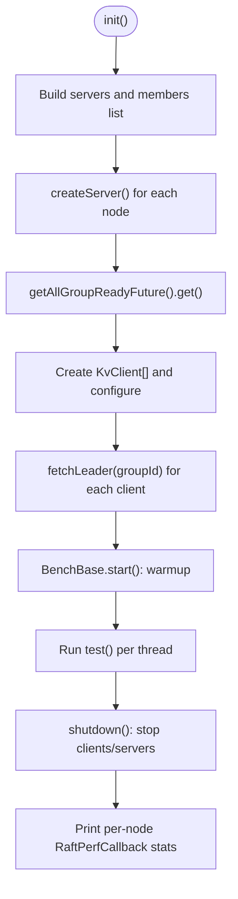
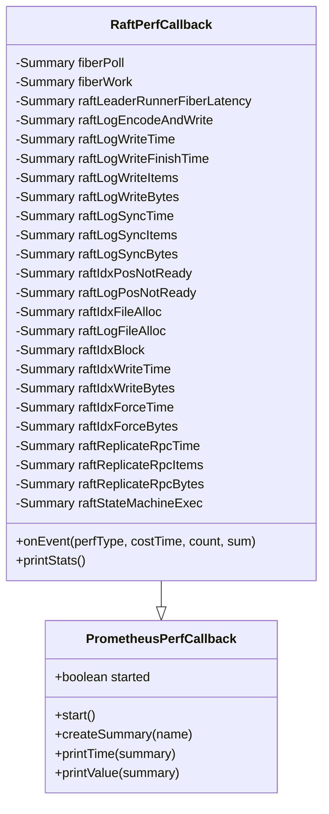
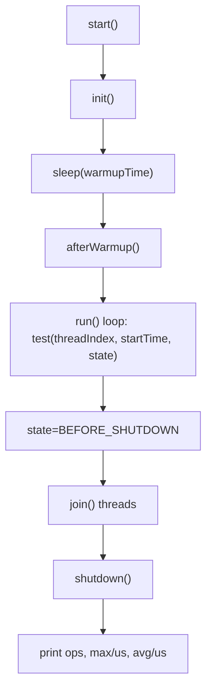
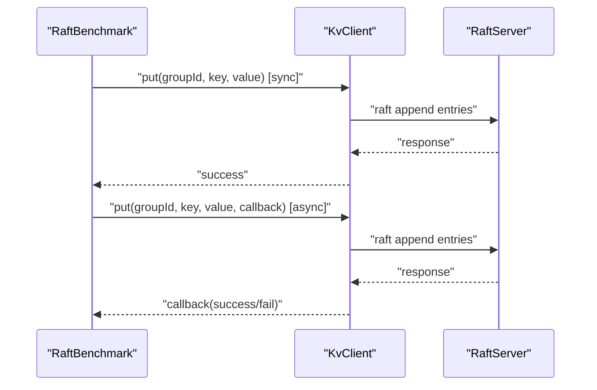
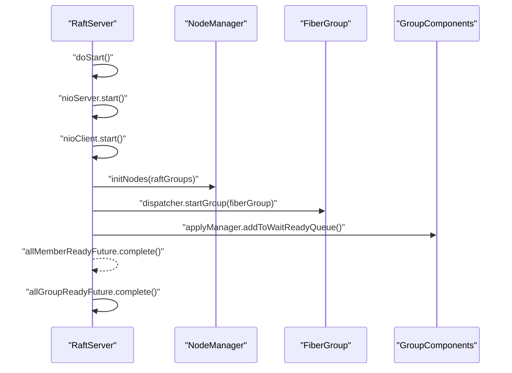
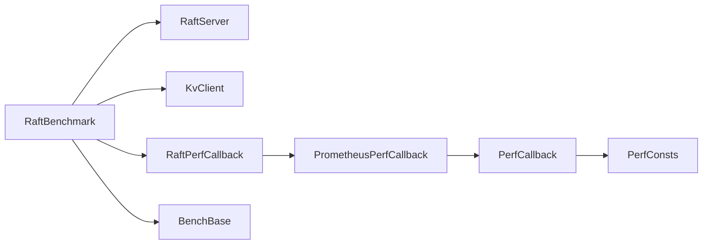

# RAFT Consensus Benchmarking

<cite>
**Referenced Files in This Document**
- [RaftBenchmark.java](file://benchmark/src/main/java/com/github/dtprj/dongting/bench/raft/RaftBenchmark.java)
- [RaftPerfCallback.java](file://benchmark/src/main/java/com/github/dtprj/dongting/bench/raft/RaftPerfCallback.java)
- [BenchBase.java](file://benchmark/src/main/java/com/github/dtprj/dongting/bench/common/BenchBase.java)
- [PrometheusPerfCallback.java](file://benchmark/src/main/java/com/github/dtprj/dongting/bench/common/PrometheusPerfCallback.java)
- [KvClient.java](file://client/src/main/java/com/github/dtprj/dongting/dtkv/KvClient.java)
- [RaftServer.java](file://server/src/main/java/com/github/dtprj/dongting/raft/server/RaftServer.java)
- [PerfConsts.java](file://client/src/main/java/com/github/dtprj/dongting/common/PerfConsts.java)
- [PerfCallback.java](file://client/src/main/java/com/github/dtprj/dongting/common/PerfCallback.java)
- [logback.xml](file://benchmark/src/main/resources/logback.xml)
</cite>

## Table of Contents
1. [Introduction](#introduction)
2. [Project Structure](#project-structure)
3. [Core Components](#core-components)
4. [Architecture Overview](#architecture-overview)
5. [Detailed Component Analysis](#detailed-component-analysis)
6. [Dependency Analysis](#dependency-analysis)
7. [Performance Considerations](#performance-considerations)
8. [Troubleshooting Guide](#troubleshooting-guide)
9. [Conclusion](#conclusion)
10. [Appendices](#appendices)

## Introduction
This document explains the RAFT consensus benchmarking implementation centered on the RaftBenchmark class. It covers the architecture for setting up a multi-node Raft cluster, configuring group parameters, initializing KvClient for distributed operations, and measuring PUT throughput and latency under different configurations. It also documents the performance metrics collected via RaftPerfCallback, including key latency points such as raft_leader_runner_fiber_latency, raft_encode_and_write, raft_log_write1, raft_log_write2, and raft_log_sync. Guidance is provided for interpreting results, tuning parameters for optimal performance, and understanding the impact of SYNC_FORCE and PERF flags. Practical examples show how to modify the benchmark for different scenarios and analyze the performance statistics output.

## Project Structure
The RAFT benchmark resides in the benchmark module and integrates with the client and server modules. The key files are:
- RaftBenchmark: orchestrates cluster startup, client creation, and test loop
- RaftPerfCallback: Prometheus-backed performance collector for RAFT metrics
- BenchBase: generic benchmark harness for warmup, test, and shutdown phases
- PrometheusPerfCallback: base for metric registration and printing
- KvClient: distributed KV client used by the benchmark
- RaftServer: RAFT server hosting the state machine and replication
- PerfConsts and PerfCallback: performance event constants and callback base
- logback.xml: logging configuration for the benchmark process

**Diagram sources**
- [RaftBenchmark.java](file://benchmark/src/main/java/com/github/dtprj/dongting/bench/raft/RaftBenchmark.java#L1-L229)
- [RaftPerfCallback.java](file://benchmark/src/main/java/com/github/dtprj/dongting/bench/raft/RaftPerfCallback.java#L1-L184)
- [BenchBase.java](file://benchmark/src/main/java/com/github/dtprj/dongting/bench/common/BenchBase.java#L1-L153)
- [PrometheusPerfCallback.java](file://benchmark/src/main/java/com/github/dtprj/dongting/bench/common/PrometheusPerfCallback.java#L1-L103)
- [KvClient.java](file://client/src/main/java/com/github/dtprj/dongting/dtkv/KvClient.java#L1-L771)
- [RaftServer.java](file://server/src/main/java/com/github/dtprj/dongting/raft/server/RaftServer.java#L1-L718)
- [PerfCallback.java](file://client/src/main/java/com/github/dtprj/dongting/common/PerfCallback.java#L1-L109)
- [PerfConsts.java](file://client/src/main/java/com/github/dtprj/dongting/common/PerfConsts.java#L1-L53)

**Section sources**
- [RaftBenchmark.java](file://benchmark/src/main/java/com/github/dtprj/dongting/bench/raft/RaftBenchmark.java#L1-L229)
- [logback.xml](file://benchmark/src/main/resources/logback.xml#L1-L15)

## Core Components
- RaftBenchmark: initializes a 3-node cluster, starts RaftServer instances, creates KvClient instances, waits for leader readiness, runs the PUT benchmark loop, and prints performance stats.
- RaftPerfCallback: registers summaries for RAFT-related metrics and prints quantiles and totals.
- BenchBase: manages warmup/test/shutdown lifecycle, tracks success/failure counts, and optionally logs per-operation latencies.
- PrometheusPerfCallback: base class for registering Prometheus summaries and printing aggregated statistics.
- KvClient: provides synchronous and asynchronous PUT operations used by the benchmark.
- RaftServer: hosts the RAFT group, replication, and state machine; exposes readiness futures and lifecycle controls.
- PerfConsts and PerfCallback: define performance event types and the callback contract used by the framework.

**Section sources**
- [RaftBenchmark.java](file://benchmark/src/main/java/com/github/dtprj/dongting/bench/raft/RaftBenchmark.java#L55-L229)
- [RaftPerfCallback.java](file://benchmark/src/main/java/com/github/dtprj/dongting/bench/raft/RaftPerfCallback.java#L1-L184)
- [BenchBase.java](file://benchmark/src/main/java/com/github/dtprj/dongting/bench/common/BenchBase.java#L1-L153)
- [PrometheusPerfCallback.java](file://benchmark/src/main/java/com/github/dtprj/dongting/bench/common/PrometheusPerfCallback.java#L1-L103)
- [KvClient.java](file://client/src/main/java/com/github/dtprj/dongting/dtkv/KvClient.java#L230-L301)
- [RaftServer.java](file://server/src/main/java/com/github/dtprj/dongting/raft/server/RaftServer.java#L330-L474)
- [PerfConsts.java](file://client/src/main/java/com/github/dtprj/dongting/common/PerfConsts.java#L1-L53)
- [PerfCallback.java](file://client/src/main/java/com/github/dtprj/dongting/common/PerfCallback.java#L1-L109)

## Architecture Overview
The benchmark sets up a 3-node RAFT cluster locally, each node listening on separate replicate and service ports. Each benchmark thread creates its own KvClient instance and sends PUT requests to the group leader. Performance metrics are recorded via Prometheus summaries registered by RaftPerfCallback and printed at shutdown.

**Diagram sources**
- [RaftBenchmark.java](file://benchmark/src/main/java/com/github/dtprj/dongting/bench/raft/RaftBenchmark.java#L114-L229)
- [RaftPerfCallback.java](file://benchmark/src/main/java/com/github/dtprj/dongting/bench/raft/RaftPerfCallback.java#L80-L184)
- [BenchBase.java](file://benchmark/src/main/java/com/github/dtprj/dongting/bench/common/BenchBase.java#L65-L124)
- [KvClient.java](file://client/src/main/java/com/github/dtprj/dongting/dtkv/KvClient.java#L230-L301)
- [RaftServer.java](file://server/src/main/java/com/github/dtprj/dongting/raft/server/RaftServer.java#L330-L474)

## Detailed Component Analysis

### RaftBenchmark: Cluster Setup and Test Loop
- Cluster setup:
  - Creates NODE_COUNT RaftServer instances with distinct ports and member lists.
  - Initializes RaftGroupConfig with dataDir, syncForce flag, and optional PerfCallback.
  - Uses DefaultRaftFactory to bind a DtKV state machine and a Dispatcher per node.
- Client initialization:
  - Creates threadCount KvClient instances, sets maxOutRequests per client thread, adds nodes and group membership, and fetches the leader.
- Test loop:
  - Chooses a random key from KEYS range and performs PUT (sync or async).
  - Records per-op latency when enabled and updates success/failure counters.
- Shutdown:
  - Stops clients and servers gracefully and prints per-node performance stats.

**Diagram sources**
- [RaftBenchmark.java](file://benchmark/src/main/java/com/github/dtprj/dongting/bench/raft/RaftBenchmark.java#L130-L196)

**Section sources**
- [RaftBenchmark.java](file://benchmark/src/main/java/com/github/dtprj/dongting/bench/raft/RaftBenchmark.java#L86-L113)
- [RaftBenchmark.java](file://benchmark/src/main/java/com/github/dtprj/dongting/bench/raft/RaftBenchmark.java#L130-L196)
- [RaftBenchmark.java](file://benchmark/src/main/java/com/github/dtprj/dongting/bench/raft/RaftBenchmark.java#L198-L229)

### RaftPerfCallback: Metrics Collection and Printing
- Registers summaries for:
  - Fiber polling and work time
  - Leader runner fiber latency
  - Log encode and write durations
  - Log write items and bytes, finish time
  - Log sync time, items, and bytes
  - Index and log position not ready
  - Index file allocation and block/write/force metrics
  - Replicate RPC time, items, and bytes
  - State machine execution time
- Prints aggregated statistics (call count, average, total, p50, p99, max, min) and computes fiber thread utilization.

**Diagram sources**
- [PrometheusPerfCallback.java](file://benchmark/src/main/java/com/github/dtprj/dongting/bench/common/PrometheusPerfCallback.java#L1-L103)
- [RaftPerfCallback.java](file://benchmark/src/main/java/com/github/dtprj/dongting/bench/raft/RaftPerfCallback.java#L1-L184)

**Section sources**
- [RaftPerfCallback.java](file://benchmark/src/main/java/com/github/dtprj/dongting/bench/raft/RaftPerfCallback.java#L24-L175)
- [PrometheusPerfCallback.java](file://benchmark/src/main/java/com/github/dtprj/dongting/bench/common/PrometheusPerfCallback.java#L36-L103)

### BenchBase: Benchmark Lifecycle and Latency Tracking
- Manages warmup, test, and shutdown phases.
- Tracks success/failure counts and optionally logs per-operation latency (max and average).
- Provides a simple test() hook for subclasses to implement workload logic.

**Diagram sources**
- [BenchBase.java](file://benchmark/src/main/java/com/github/dtprj/dongting/bench/common/BenchBase.java#L65-L124)

**Section sources**
- [BenchBase.java](file://benchmark/src/main/java/com/github/dtprj/dongting/bench/common/BenchBase.java#L30-L124)

### KvClient: PUT Operations Used by Benchmark
- Supports synchronous and asynchronous PUT operations.
- Asynchronous PUT invokes a callback upon completion; synchronous PUT blocks until response.
- The benchmark uses synchronous PUT when SYNC=true and asynchronous PUT otherwise.

**Diagram sources**
- [KvClient.java](file://client/src/main/java/com/github/dtprj/dongting/dtkv/KvClient.java#L230-L301)
- [RaftBenchmark.java](file://benchmark/src/main/java/com/github/dtprj/dongting/bench/raft/RaftBenchmark.java#L200-L225)

**Section sources**
- [KvClient.java](file://client/src/main/java/com/github/dtprj/dongting/dtkv/KvClient.java#L230-L301)
- [RaftBenchmark.java](file://benchmark/src/main/java/com/github/dtprj/dongting/bench/raft/RaftBenchmark.java#L198-L225)

### RaftServer: Cluster Lifecycle and Readiness
- Starts NIO server and client, initializes node manager, and fires fiber groups per group.
- Exposes futures for member readiness and group readiness.
- Provides administrative APIs to add/remove nodes/groups.

**Diagram sources**
- [RaftServer.java](file://server/src/main/java/com/github/dtprj/dongting/raft/server/RaftServer.java#L330-L474)

**Section sources**
- [RaftServer.java](file://server/src/main/java/com/github/dtprj/dongting/raft/server/RaftServer.java#L180-L221)
- [RaftServer.java](file://server/src/main/java/com/github/dtprj/dongting/raft/server/RaftServer.java#L330-L474)

## Dependency Analysis
- RaftBenchmark depends on RaftServer for cluster lifecycle, KvClient for distributed operations, and RaftPerfCallback for metrics.
- RaftPerfCallback extends PrometheusPerfCallback, which extends PerfCallback, and uses PerfConsts constants for event types.
- BenchBase provides the benchmarking harness used by RaftBenchmark.

**Diagram sources**
- [RaftBenchmark.java](file://benchmark/src/main/java/com/github/dtprj/dongting/bench/raft/RaftBenchmark.java#L1-L229)
- [RaftPerfCallback.java](file://benchmark/src/main/java/com/github/dtprj/dongting/bench/raft/RaftPerfCallback.java#L1-L184)
- [PrometheusPerfCallback.java](file://benchmark/src/main/java/com/github/dtprj/dongting/bench/common/PrometheusPerfCallback.java#L1-L103)
- [PerfCallback.java](file://client/src/main/java/com/github/dtprj/dongting/common/PerfCallback.java#L1-L109)
- [PerfConsts.java](file://client/src/main/java/com/github/dtprj/dongting/common/PerfConsts.java#L1-L53)
- [BenchBase.java](file://benchmark/src/main/java/com/github/dtprj/dongting/bench/common/BenchBase.java#L1-L153)

**Section sources**
- [RaftBenchmark.java](file://benchmark/src/main/java/com/github/dtprj/dongting/bench/raft/RaftBenchmark.java#L1-L229)
- [PerfConsts.java](file://client/src/main/java/com/github/dtprj/dongting/common/PerfConsts.java#L1-L53)
- [PerfCallback.java](file://client/src/main/java/com/github/dtprj/dongting/common/PerfCallback.java#L1-L109)

## Performance Considerations
- Throughput vs latency trade-offs:
  - Increasing CLIENT_COUNT increases concurrency and can improve throughput but may raise contention and latency.
  - Larger DATA_LEN increases payload size and can increase encode/write and sync times.
  - CLIENT_MAX_OUT_REQUESTS controls per-thread outstanding requests; increasing it can raise throughput but also memory and latency.
- Sync vs async:
  - SYNC=true reduces overhead per request but requires more threads to achieve high throughput.
  - SYNC=false enables higher concurrency and throughput with callbacks.
- Disk durability and sync:
  - SYNC_FORCE toggles whether FileChannel.force is invoked after writes. Disabling it can reduce raft_log_sync time but lowers durability guarantees.
- Metrics granularity:
  - PERF=true enables detailed metrics collection per node; it has significant overhead and should be used only during targeted experiments.
- Fiber thread utilization:
  - The benchmark prints fiber thread utilization derived from fiber_poll and fiber_work summaries.

[No sources needed since this section provides general guidance]

## Troubleshooting Guide
- Cluster not ready:
  - Ensure all RaftServer instances start successfully and allGroupReadyFuture completes within the timeout.
  - Verify ports and member lists are consistent across nodes.
- Leader not found:
  - Confirm fetchLeader(groupId) futures complete before starting the test phase.
- High latency:
  - Check raft_log_sync_time and raft_log_sync_bytes; consider adjusting SYNC_FORCE and disk settings.
  - Review raft_encode_and_write and raft_log_write1/2 for encoding and write bottlenecks.
- Logging:
  - Benchmark logs are configured via logback.xml; adjust thresholds and appenders as needed.

**Section sources**
- [RaftBenchmark.java](file://benchmark/src/main/java/com/github/dtprj/dongting/bench/raft/RaftBenchmark.java#L144-L171)
- [logback.xml](file://benchmark/src/main/resources/logback.xml#L1-L15)

## Conclusion
The RaftBenchmark provides a structured way to measure PUT throughput and latency under configurable conditions. By controlling sync mode, payload size, client concurrency, and disk durability, operators can isolate and optimize key RAFT stages. The RaftPerfCallback offers granular visibility into leader runner latency, log encode/write, and sync costs, enabling targeted tuning. Use the provided flags and metrics to iteratively improve performance while balancing durability and resource usage.

[No sources needed since this section summarizes without analyzing specific files]

## Appendices

### Performance Metrics Collected by RaftPerfCallback
- Fiber: fiber_poll, fiber_work
- Leader runner: raft_leader_runner_fiber_latency
- Log encode and write: raft_log_encode_and_write
- Log write: raft_log_write_time, raft_log_write_finish_time, raft_log_write_items, raft_log_write_bytes
- Log sync: raft_log_sync_time, raft_log_sync_items, raft_log_sync_bytes
- Position readiness: raft_idx_pos_not_ready, raft_log_pos_not_ready
- Index and log file allocation: raft_idx_file_alloc, raft_log_file_alloc
- Index block/write/force: raft_idx_block, raft_idx_write_time, raft_idx_write_bytes, raft_idx_force_time, raft_idx_force_bytes
- Replicate RPC: raft_replicate_rpc_time, raft_replicate_rpc_items, raft_replicate_rpc_bytes
- State machine: raft_state_machine_exec

**Section sources**
- [RaftPerfCallback.java](file://benchmark/src/main/java/com/github/dtprj/dongting/bench/raft/RaftPerfCallback.java#L24-L175)

### Benchmark Flags and Their Impact
- SYNC: toggles synchronous vs asynchronous PUT; affects throughput and thread usage.
- DATA_LEN: increases payload size; impacts encode and write times.
- CLIENT_COUNT: increases concurrent clients; improves throughput but may raise contention.
- CLIENT_MAX_OUT_REQUESTS: limits outstanding requests per client thread; affects memory and latency.
- PERF: enables detailed metrics collection per node; significant overhead.
- SYNC_FORCE: toggles disk force after write; reduces raft_log_sync time but lowers durability.

**Section sources**
- [RaftBenchmark.java](file://benchmark/src/main/java/com/github/dtprj/dongting/bench/raft/RaftBenchmark.java#L59-L70)
- [RaftBenchmark.java](file://benchmark/src/main/java/com/github/dtprj/dongting/bench/raft/RaftBenchmark.java#L95-L102)

### How to Modify the Benchmark for Different Scenarios
- Change client concurrency:
  - Adjust CLIENT_COUNT and split CLIENT_MAX_OUT_REQUESTS accordingly.
- Vary payload sizes:
  - Modify DATA_LEN to simulate small, medium, and large records.
- Toggle durability:
  - Set SYNC_FORCE to true or false to compare sync vs async durability.
- Enable/disable detailed metrics:
  - Set PERF to true for granular insights; keep false for baseline measurements.
- Test different sync modes:
  - Switch SYNC between true and false to compare throughput and latency.

**Section sources**
- [RaftBenchmark.java](file://benchmark/src/main/java/com/github/dtprj/dongting/bench/raft/RaftBenchmark.java#L59-L70)
- [RaftBenchmark.java](file://benchmark/src/main/java/com/github/dtprj/dongting/bench/raft/RaftBenchmark.java#L95-L102)

### Interpreting Performance Statistics Output
- Look for:
  - raft_leader_runner_fiber_latency: leader scheduling overhead
  - raft_log_encode_and_write: serialization and initial write cost
  - raft_log_write1/2: batching and completion timing
  - raft_log_sync_time/items/bytes: disk sync cost and throughput
  - raft_replicate_rpc_time/items/bytes: inter-node replication cost
  - raft_state_machine_exec: application-side execution
- Compute fiber thread utilization from fiber_poll and fiber_work summaries.
- Compare p99 latency vs average to assess tail behavior.

**Section sources**
- [RaftPerfCallback.java](file://benchmark/src/main/java/com/github/dtprj/dongting/bench/raft/RaftPerfCallback.java#L150-L181)
- [PrometheusPerfCallback.java](file://benchmark/src/main/java/com/github/dtprj/dongting/bench/common/PrometheusPerfCallback.java#L55-L103)