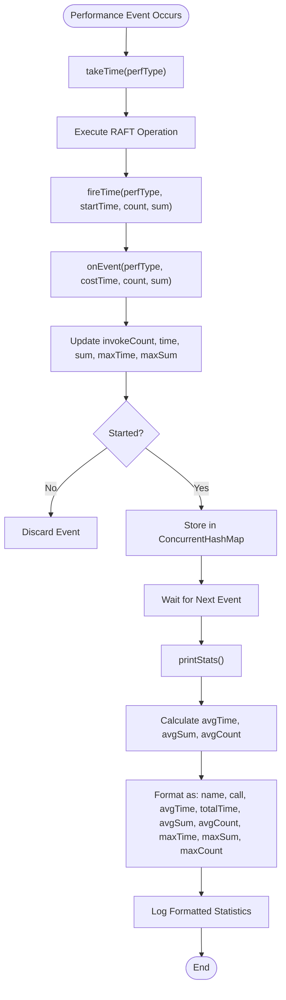

# RAFT Performance Metrics and Result Analysis

<cite>
**Referenced Files in This Document**   
- [RaftPerfCallback.java](file://benchmark/src/main/java/com/github/dtprj/dongting/bench/raft/RaftPerfCallback.java)
- [SimplePerfCallback.java](file://benchmark/src/main/java/com/github/dtprj/dongting/bench/common/SimplePerfCallback.java)
- [PerfConsts.java](file://client/src/main/java/com/github/dtprj/dongting/common/PerfConsts.java)
- [PrometheusPerfCallback.java](file://benchmark/src/main/java/com/github/dtprj/dongting/bench/common/PrometheusPerfCallback.java)
- [RaftBenchmark.java](file://benchmark/src/main/java/com/github/dtprj/dongting/bench/raft/RaftBenchmark.java)
- [ApplyManager.java](file://server/src/main/java/com/github/dtprj/dongting/raft/impl/ApplyManager.java)
- [ReplicateManager.java](file://server/src/main/java/com/github/dtprj/dongting/raft/impl/ReplicateManager.java)
- [LogFileQueue.java](file://server/src/main/java/com/github/dtprj/dongting/raft/store/LogFileQueue.java)
- [ChainWriter.java](file://server/src/main/java/com/github/dtprj/dongting/raft/store/ChainWriter.java)
- [FileQueue.java](file://server/src/main/java/com/github/dtprj/dongting/raft/store/FileQueue.java)
</cite>

## Table of Contents
1. [Introduction](#introduction)
2. [Core Performance Metrics](#core-performance-metrics)
3. [Metrics Aggregation and Formatting](#metrics-aggregation-and-formatting)
4. [Interpreting Performance Statistics](#interpreting-performance-statistics)
5. [Configuration Impact Analysis](#configuration-impact-analysis)
6. [Extending Performance Callbacks](#extending-performance-callbacks)
7. [Conclusion](#conclusion)

## Introduction
This document provides a comprehensive analysis of the RAFT consensus algorithm's performance metrics as implemented in the Dongting project. The performance monitoring system is built around the `RaftPerfCallback` class, which extends `PrometheusPerfCallback` to collect and report detailed timing and throughput data during RAFT operations. The metrics system captures critical performance indicators across the entire RAFT consensus process, from log file operations and network replication to state machine execution. This analysis focuses on understanding how these metrics are collected, aggregated, and interpreted to identify bottlenecks and optimize system performance.

**Section sources**
- [RaftPerfCallback.java](file://benchmark/src/main/java/com/github/dtprj/dongting/bench/raft/RaftPerfCallback.java)
- [RaftBenchmark.java](file://benchmark/src/main/java/com/github/dtprj/dongting/bench/raft/RaftBenchmark.java)

## Core Performance Metrics
The RAFT performance monitoring system collects several key performance indicators that provide insights into different aspects of the consensus process. These metrics are defined in the `PerfConsts` interface and implemented in the `RaftPerfCallback` class, which creates dedicated `Summary` objects for each metric type. The primary metrics include:

- **raft_log_file_alloc**: Measures the time taken to allocate new log files when existing files reach their size limit. This metric captures the overhead associated with file system operations for log persistence.
- **raft_idx_block**: Tracks the time spent waiting for index file operations to complete, indicating potential I/O bottlenecks in the indexing subsystem.
- **raft_idx_write_time**: Records the duration of index write operations, providing insight into the performance of metadata persistence.
- **raft_idx_force_time**: Measures the time required to force index data to disk, which is critical for durability guarantees and varies significantly between synchronous and asynchronous configurations.
- **raft_replicate_rpc_time**: Captures the end-to-end latency of replication RPC calls, including network transmission time and remote processing overhead.
- **raft_state_machine_exec**: Tracks the execution time of state machine operations, which represents the application-level processing cost of applying committed log entries.

These metrics are strategically placed throughout the RAFT implementation to capture performance data at critical junctures in the consensus algorithm. For example, file allocation timing is captured in the `FileQueue.FileAllocFrame` constructor, while replication RPC timing begins when a request is sent and ends when the response is processed. The state machine execution time is measured from the start of the `exec` method in the `ApplyManager` to its completion, providing a comprehensive view of application-level processing overhead.

**Section sources**
- [RaftPerfCallback.java](file://benchmark/src/main/java/com/github/dtprj/dongting/bench/raft/RaftPerfCallback.java#L26-L77)
- [PerfConsts.java](file://client/src/main/java/com/github/dtprj/dongting/common/PerfConsts.java#L37-L52)
- [FileQueue.java](file://server/src/main/java/com/github/dtprj/dongting/raft/store/FileQueue.java#L371-L372)
- [ReplicateManager.java](file://server/src/main/java/com/github/dtprj/dongting/raft/impl/ReplicateManager.java#L400-L401)
- [ApplyManager.java](file://server/src/main/java/com/github/dtprj/dongting/raft/impl/ApplyManager.java#L178-L191)

## Metrics Aggregation and Formatting
The performance metrics are aggregated and formatted through the `SimplePerfCallback` class's `printStats` method, which processes collected data and presents it in a human-readable format. The aggregation process involves maintaining several counters for each performance type: invocation count, total time, maximum time, total sum, and maximum sum. These counters are updated in the `onEvent` method whenever a performance event is recorded.

The `printStats` method formats the output to include average time, total time, maximum values, and invocation counts for each metric. The formatting converts nanoseconds to microseconds for average time and milliseconds for total time, making the results more interpretable. For each metric, the output includes:
- Invocation count (call)
- Average time in microseconds (avgTime)
- Total time in milliseconds (totalTime)
- Average sum value (avgSum)
- Average count value (avgCount)
- Maximum time in microseconds (maxTime)
- Maximum sum value (maxSum)
- Maximum count value (maxCount)

The formatting uses standard Java string formatting with comma separators for thousands, enhancing readability of large numbers. The `Value` inner class in `SimplePerfCallback` uses thread-safe counters (`LongAdder` and `AtomicLong`) to ensure accurate aggregation in concurrent environments. This design allows multiple threads to update counters simultaneously without contention, which is essential for accurate performance measurement in high-throughput scenarios.

**Diagram sources**
- [SimplePerfCallback.java](file://benchmark/src/main/java/com/github/dtprj/dongting/bench/common/SimplePerfCallback.java#L62-L91)
- [SimplePerfCallback.java](file://benchmark/src/main/java/com/github/dtprj/dongting/bench/common/SimplePerfCallback.java#L131-L150)

**Section sources**
- [SimplePerfCallback.java](file://benchmark/src/main/java/com/github/dtprj/dongting/bench/common/SimplePerfCallback.java#L32-L55)
- [SimplePerfCallback.java](file://benchmark/src/main/java/com/github/dtprj/dongting/bench/common/SimplePerfCallback.java#L131-L150)

## Interpreting Performance Statistics
Interpreting the performance statistics output requires understanding how different metrics correlate with system bottlenecks in the RAFT consensus process. High values in specific metrics can indicate particular performance issues that require attention. For disk I/O delays, elevated `raft_idx_force_time` and `raft_log_sync` metrics suggest that the storage subsystem is a bottleneck, particularly when `SYNC_FORCE` is enabled. These metrics reflect the time spent ensuring data durability through synchronous disk operations.

Network replication latency is primarily indicated by the `raft_replicate_rpc_time` metric, which captures the complete round-trip time for replication requests. High values in this metric could stem from network congestion, high processing overhead on follower nodes, or serialization/deserialization costs. The accompanying `raft_replicate_rpc_items` and `raft_replicate_rpc_bytes` metrics provide context on the payload size, helping to distinguish between latency issues caused by small, frequent requests versus large, infrequent ones.

State machine execution overhead is directly measured by the `raft_state_machine_exec` metric. High values here indicate that the application logic for processing committed entries is consuming significant resources, potentially due to complex business logic, database operations, or external service calls. When analyzing these metrics, it's important to consider the relationship between them—for example, high state machine execution time can indirectly increase replication latency by delaying the commitment of new entries.

The fiber utilization rate calculation in `RaftPerfCallback.printStats` provides additional insight into CPU resource usage, showing the proportion of time spent on productive work versus polling. A low utilization rate may indicate that the system is I/O-bound rather than CPU-bound, suggesting different optimization strategies.

**Section sources**
- [RaftPerfCallback.java](file://benchmark/src/main/java/com/github/dtprj/dongting/bench/raft/RaftPerfCallback.java#L150-L180)
- [LogFileQueue.java](file://server/src/main/java/com/github/dtprj/dongting/raft/store/LogFileQueue.java#L70-L74)
- [ChainWriter.java](file://server/src/main/java/com/github/dtprj/dongting/raft/store/ChainWriter.java#L255-L261)

## Configuration Impact Analysis
The performance characteristics of the RAFT implementation are significantly influenced by configuration settings, particularly the `SYNC_FORCE` flag and the `PERF` flag. The `SYNC_FORCE` configuration determines whether the system waits for data to be physically written to disk before acknowledging operations. When `SYNC_FORCE` is true, the `raft_idx_force_time` and `raft_log_sync` metrics will show higher values, reflecting the additional latency introduced by synchronous durability guarantees. This configuration provides stronger data safety but at the cost of reduced throughput.

Conversely, when `SYNC_FORCE` is false, these metrics will show much lower values, indicating that the system relies on the operating system's buffer cache and periodic flushing. This asynchronous approach improves performance but increases the risk of data loss in the event of a system crash. The impact of this configuration can be dramatic, with synchronous mode potentially being orders of magnitude slower than asynchronous mode, depending on the underlying storage hardware.

The `PERF` flag controls whether performance monitoring is enabled during benchmarking. When set to true, the overhead of collecting and aggregating metrics can significantly impact the measured performance, potentially skewing results. This is particularly important when comparing configurations, as the performance difference between two configurations might be masked or exaggerated by the monitoring overhead. For accurate benchmarking, it's recommended to run tests both with and without the `PERF` flag enabled to understand the true performance characteristics versus the observed performance including monitoring overhead.

Correlating metrics with system resource utilization requires analyzing the performance data alongside external monitoring of CPU, memory, disk I/O, and network usage. For example, high `raft_replicate_rpc_time` combined with high network utilization suggests network saturation, while high `raft_state_machine_exec` with high CPU usage indicates compute-bound application logic.

**Section sources**
- [RaftBenchmark.java](file://benchmark/src/main/java/com/github/dtprj/dongting/bench/raft/RaftBenchmark.java#L66-L67)
- [RaftBenchmark.java](file://benchmark/src/main/java/com/github/dtprj/dongting/bench/raft/RaftBenchmark.java#L97)
- [RaftPerfCallback.java](file://benchmark/src/main/java/com/github/dtprj/dongting/bench/raft/RaftPerfCallback.java#L176-L180)

## Extending Performance Callbacks
Extending the performance callback system for custom metrics collection involves creating new callback classes that inherit from the base `PerfCallback` class or extending existing implementations like `SimplePerfCallback` or `PrometheusPerfCallback`. The extension process requires defining new performance type constants in the `PerfConsts` interface and implementing appropriate handling in the callback's `accept` and `onEvent` methods.

To add custom metrics, developers should follow the pattern established in `RaftPerfCallback`, where each metric is represented by a dedicated field (typically a `Summary` object for Prometheus integration) initialized in the constructor. The `onEvent` method must be updated to handle the new performance types by observing the appropriate values. For example, to add a custom metric for snapshot operations, a developer would add a new constant to `PerfConsts`, create a corresponding `Summary` field, initialize it in the constructor, and add a case to the `onEvent` switch statement.

The callback system is designed to be extensible through composition and inheritance. Custom callbacks can be integrated into the RAFT configuration by setting the `perfCallback` field in `RaftGroupConfig`, allowing different monitoring strategies to be applied to different RAFT groups within the same application. This flexibility enables targeted performance monitoring for specific use cases or components without affecting the entire system.

When extending the performance callback system, it's important to consider the performance overhead of additional metrics collection and ensure that the implementation remains thread-safe, as the callbacks are invoked from multiple threads concurrently. The use of atomic operations and thread-safe collections, as demonstrated in `SimplePerfCallback`, is essential for maintaining data integrity under high concurrency.

**Section sources**
- [RaftPerfCallback.java](file://benchmark/src/main/java/com/github/dtprj/dongting/bench/raft/RaftPerfCallback.java#L26-L77)
- [PrometheusPerfCallback.java](file://benchmark/src/main/java/com/github/dtprj/dongting/bench/common/PrometheusPerfCallback.java#L40-L49)
- [SimplePerfCallback.java](file://benchmark/src/main/java/com/github/dtprj/dongting/bench/common/SimplePerfCallback.java#L32-L55)
- [PerfConsts.java](file://client/src/main/java/com/github/dtprj/dongting/common/PerfConsts.java#L21-L53)

## Conclusion
The RAFT performance metrics system in the Dongting project provides a comprehensive framework for monitoring and analyzing the performance of the consensus algorithm. By collecting detailed timing data across critical operations such as log file management, network replication, and state machine execution, the system enables deep performance analysis and bottleneck identification. The metrics aggregation and formatting in `SimplePerfCallback` present this data in an accessible format that facilitates comparison across different configurations and workloads.

Understanding the impact of configuration options like `SYNC_FORCE` and the `PERF` flag is crucial for accurate performance evaluation and system tuning. The extensible callback architecture allows for custom metrics collection, enabling developers to monitor application-specific performance characteristics. By correlating the collected metrics with system resource utilization, operators can make informed decisions about hardware provisioning, configuration tuning, and architectural improvements to optimize the performance and reliability of their RAFT-based distributed systems.

[No sources needed since this section summarizes without analyzing specific files]