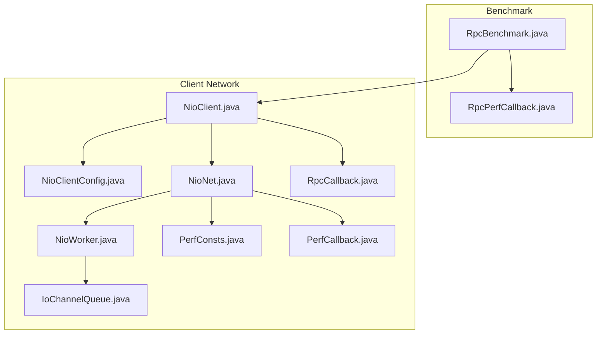
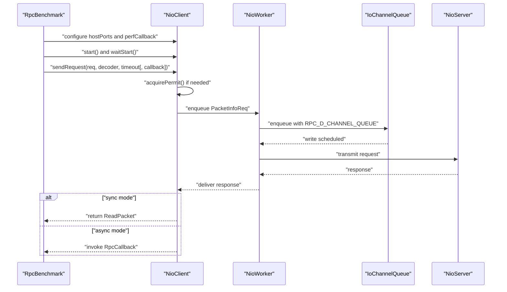
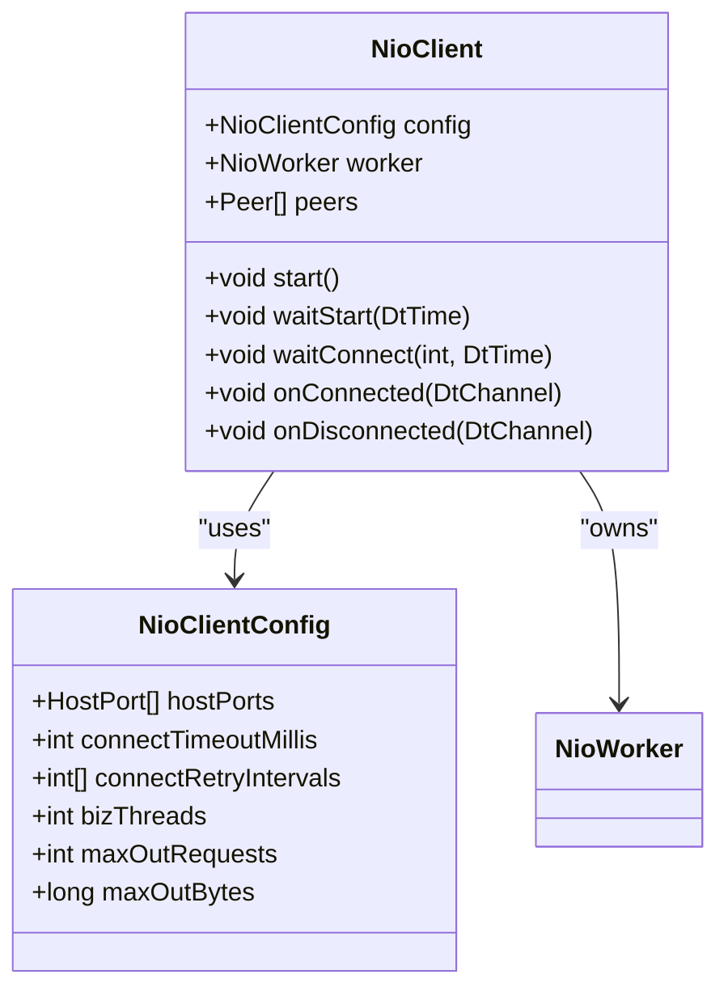
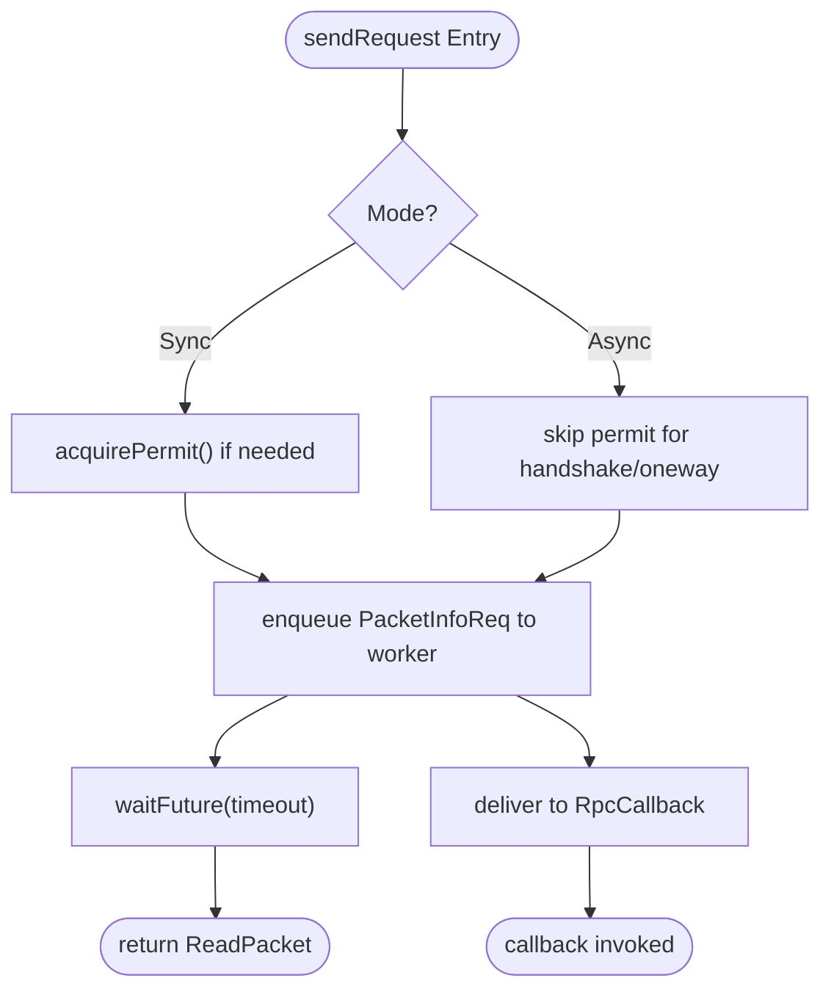
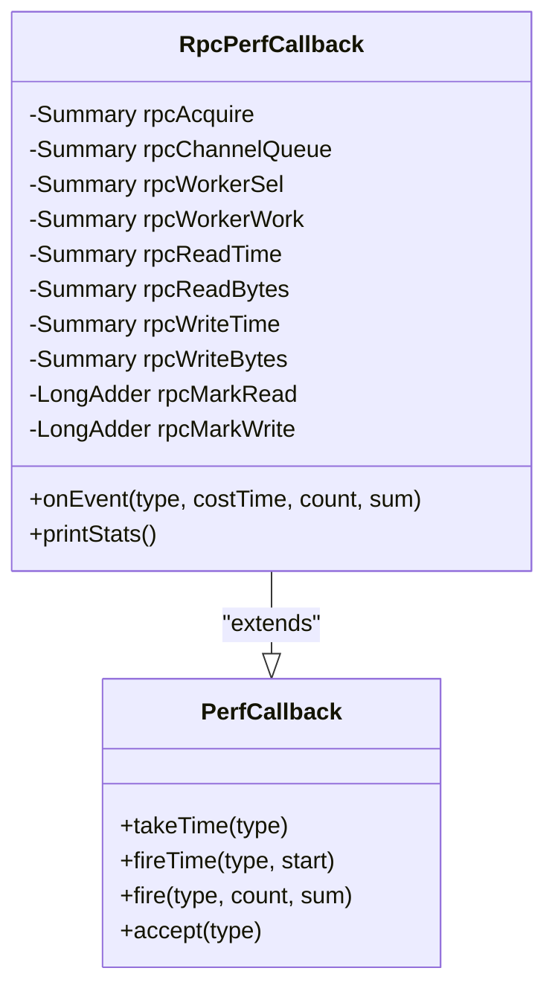
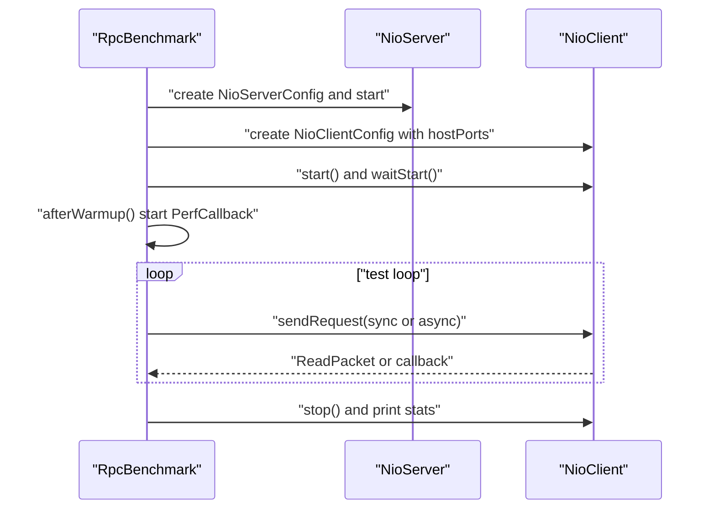
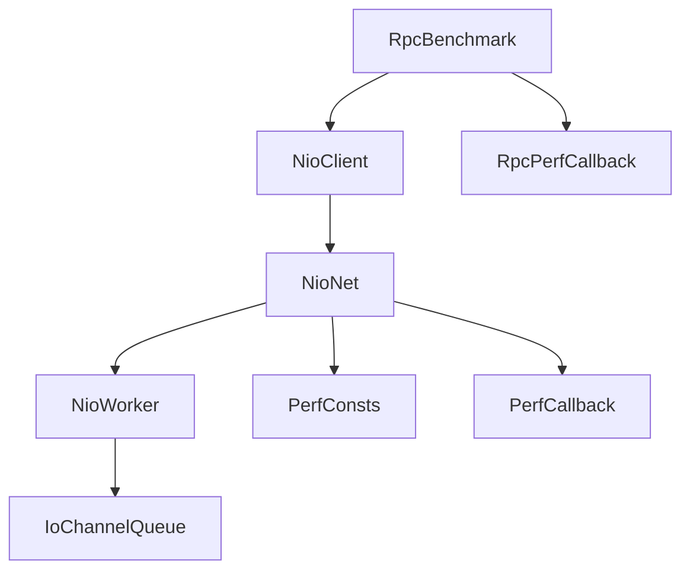

# RPC Client Benchmarking

<cite>
**Referenced Files in This Document**
- [RpcBenchmark.java](file://benchmark/src/main/java/com/github/dtprj/dongting/bench/rpc/RpcBenchmark.java)
- [RpcPerfCallback.java](file://benchmark/src/main/java/com/github/dtprj/dongting/bench/rpc/RpcPerfCallback.java)
- [NioClient.java](file://client/src/main/java/com/github/dtprj/dongting/net/NioClient.java)
- [NioClientConfig.java](file://client/src/main/java/com/github/dtprj/dongting/net/NioClientConfig.java)
- [NioNet.java](file://client/src/main/java/com/github/dtprj/dongting/net/NioNet.java)
- [NioWorker.java](file://client/src/main/java/com/github/dtprj/dongting/net/NioWorker.java)
- [RpcCallback.java](file://client/src/main/java/com/github/dtprj/dongting/net/RpcCallback.java)
- [PerfConsts.java](file://client/src/main/java/com/github/dtprj/dongting/common/PerfConsts.java)
- [PerfCallback.java](file://client/src/main/java/com/github/dtprj/dongting/common/PerfCallback.java)
- [IoChannelQueue.java](file://client/src/main/java/com/github/dtprj/dongting/net/IoChannelQueue.java)
</cite>

## Table of Contents
1. [Introduction](#introduction)
2. [Project Structure](#project-structure)
3. [Core Components](#core-components)
4. [Architecture Overview](#architecture-overview)
5. [Detailed Component Analysis](#detailed-component-analysis)
6. [Dependency Analysis](#dependency-analysis)
7. [Performance Considerations](#performance-considerations)
8. [Troubleshooting Guide](#troubleshooting-guide)
9. [Conclusion](#conclusion)

## Introduction
This document explains how the RPC client benchmarking works in the project, focusing on the NioClient initialization and request submission process used by RpcBenchmark. It covers:
- How NioClient is configured with hostPorts and optional performance callbacks
- How the client connects to the server and submits requests
- Two operational modes: synchronous sendRequest that blocks until response, and asynchronous callback-based invocation
- Client-side metrics captured by RpcPerfCallback, including rpc_acquire, rpc_channel_queue latency, and rpc_mark_write counts
- Guidance on configuring timeouts, thread models, and performance monitoring
- Interpretation of client-side statistics to identify bottlenecks in high-throughput scenarios

## Project Structure
The RPC benchmark resides in the benchmark module and uses the client networking stack:
- RpcBenchmark orchestrates server startup, client startup, warmup, and test loops
- RpcPerfCallback implements Prometheus-based metrics collection for RPC events
- NioClient is the client transport that manages connections, request submission, and lifecycle
- NioNet and NioWorker implement the underlying network pipeline and worker scheduling
- RpcCallback defines the callback contract for asynchronous invocations

**Diagram sources**
- [RpcBenchmark.java](file://benchmark/src/main/java/com/github/dtprj/dongting/bench/rpc/RpcBenchmark.java#L58-L161)
- [RpcPerfCallback.java](file://benchmark/src/main/java/com/github/dtprj/dongting/bench/rpc/RpcPerfCallback.java#L1-L117)
- [NioClient.java](file://client/src/main/java/com/github/dtprj/dongting/net/NioClient.java#L57-L110)
- [NioClientConfig.java](file://client/src/main/java/com/github/dtprj/dongting/net/NioClientConfig.java#L1-L44)
- [NioNet.java](file://client/src/main/java/com/github/dtprj/dongting/net/NioNet.java#L92-L124)
- [NioWorker.java](file://client/src/main/java/com/github/dtprj/dongting/net/NioWorker.java#L138-L200)
- [RpcCallback.java](file://client/src/main/java/com/github/dtprj/dongting/net/RpcCallback.java#L1-L47)
- [PerfConsts.java](file://client/src/main/java/com/github/dtprj/dongting/common/PerfConsts.java#L21-L35)
- [PerfCallback.java](file://client/src/main/java/com/github/dtprj/dongting/common/PerfCallback.java#L37-L108)
- [IoChannelQueue.java](file://client/src/main/java/com/github/dtprj/dongting/net/IoChannelQueue.java#L84-L102)

**Section sources**
- [RpcBenchmark.java](file://benchmark/src/main/java/com/github/dtprj/dongting/bench/rpc/RpcBenchmark.java#L58-L161)
- [NioClient.java](file://client/src/main/java/com/github/dtprj/dongting/net/NioClient.java#L57-L110)
- [NioClientConfig.java](file://client/src/main/java/com/github/dtprj/dongting/net/NioClientConfig.java#L1-L44)

## Core Components
- RpcBenchmark: Initializes server and client, configures performance callbacks, runs warmup, and executes test loops with either synchronous or asynchronous RPC submissions.
- NioClient: Manages peers, starts worker threads, connects to servers, and exposes synchronous and asynchronous sendRequest APIs.
- RpcPerfCallback: Collects and prints RPC performance metrics including request acquisition time, worker queue latency, channel queue latency, worker selection and work time, read/write timing and bytes, and mark counters.
- NioNet/NioWorker: Implements the request pipeline, including permit acquisition, request dispatch to worker queues, and channel queueing with latency measurement.

**Section sources**
- [RpcBenchmark.java](file://benchmark/src/main/java/com/github/dtprj/dongting/bench/rpc/RpcBenchmark.java#L58-L161)
- [NioClient.java](file://client/src/main/java/com/github/dtprj/dongting/net/NioClient.java#L132-L174)
- [RpcPerfCallback.java](file://benchmark/src/main/java/com/github/dtprj/dongting/bench/rpc/RpcPerfCallback.java#L26-L117)
- [NioNet.java](file://client/src/main/java/com/github/dtprj/dongting/net/NioNet.java#L92-L124)
- [NioWorker.java](file://client/src/main/java/com/github/dtprj/dongting/net/NioWorker.java#L138-L200)

## Architecture Overview
The benchmark initializes a server and a client, then submits RPC requests in either synchronous or asynchronous mode. Metrics are recorded via PerfCallback implementations.

**Diagram sources**
- [RpcBenchmark.java](file://benchmark/src/main/java/com/github/dtprj/dongting/bench/rpc/RpcBenchmark.java#L126-L161)
- [NioClient.java](file://client/src/main/java/com/github/dtprj/dongting/net/NioClient.java#L132-L174)
- [NioNet.java](file://client/src/main/java/com/github/dtprj/dongting/net/NioNet.java#L92-L124)
- [IoChannelQueue.java](file://client/src/main/java/com/github/dtprj/dongting/net/IoChannelQueue.java#L84-L102)
- [NioWorker.java](file://client/src/main/java/com/github/dtprj/dongting/net/NioWorker.java#L138-L200)

## Detailed Component Analysis

### NioClient Initialization and Connection
- NioClient is constructed with NioClientConfig, peers are built from hostPorts, and a worker thread is created. On start, the client creates the business executor, starts the worker, and initiates connections to peers with a connect timeout. It signals connected/disconnected events and provides waitStart to synchronize readiness.

**Diagram sources**
- [NioClient.java](file://client/src/main/java/com/github/dtprj/dongting/net/NioClient.java#L57-L110)
- [NioClientConfig.java](file://client/src/main/java/com/github/dtprj/dongting/net/NioClientConfig.java#L18-L44)

**Section sources**
- [NioClient.java](file://client/src/main/java/com/github/dtprj/dongting/net/NioClient.java#L57-L110)
- [NioClientConfig.java](file://client/src/main/java/com/github/dtprj/dongting/net/NioClientConfig.java#L18-L44)

### Request Submission Modes
- Synchronous mode: NioClient.sendRequest returns a ReadPacket after acquiring a permit and waiting on a future. The future is completed by RpcCallback.fromFuture.
- Asynchronous mode: NioClient.sendRequest accepts an RpcCallback that is invoked upon completion or failure. RpcCallback provides convenience converters from futures and unwrapped futures.

**Diagram sources**
- [NioClient.java](file://client/src/main/java/com/github/dtprj/dongting/net/NioClient.java#L132-L174)
- [NioNet.java](file://client/src/main/java/com/github/dtprj/dongting/net/NioNet.java#L92-L124)
- [RpcCallback.java](file://client/src/main/java/com/github/dtprj/dongting/net/RpcCallback.java#L22-L47)

**Section sources**
- [NioClient.java](file://client/src/main/java/com/github/dtprj/dongting/net/NioClient.java#L132-L174)
- [RpcCallback.java](file://client/src/main/java/com/github/dtprj/dongting/net/RpcCallback.java#L22-L47)

### Client-Side Metrics Collected by RpcPerfCallback
RpcPerfCallback observes the following client-side metrics:
- rpc_acquire: time spent acquiring outbound permits (request acquisition delay)
- rpc_channel_queue: latency from enqueuing to channel write scheduling
- rpc_worker_sel: worker thread selection time
- rpc_worker_work: worker thread processing time
- rpc_read_time and rpc_read_bytes: read latency and bytes
- rpc_write_time and rpc_write_bytes: write latency and bytes
- rpc_mark_write: count of write marks
- rpc_mark_read: count of read marks

These metrics are emitted by PerfCallback and collected into summaries, then printed with percentiles and totals.

**Diagram sources**
- [RpcPerfCallback.java](file://benchmark/src/main/java/com/github/dtprj/dongting/bench/rpc/RpcPerfCallback.java#L26-L117)
- [PerfCallback.java](file://client/src/main/java/com/github/dtprj/dongting/common/PerfCallback.java#L37-L108)

**Section sources**
- [RpcPerfCallback.java](file://benchmark/src/main/java/com/github/dtprj/dongting/bench/rpc/RpcPerfCallback.java#L26-L117)
- [PerfConsts.java](file://client/src/main/java/com/github/dtprj/dongting/common/PerfConsts.java#L21-L35)

### Benchmark Execution and Warmup
- RpcBenchmark initializes a server with NioServerConfig and optional RpcPerfCallback, then initializes a client with NioClientConfig, sets up hostPorts, and starts both. After warmup, it starts the PerfCallback instances and runs test loops. Requests are submitted with a fixed-size payload and configurable timeout. The benchmark toggles between sync and async modes via a flag.

**Diagram sources**
- [RpcBenchmark.java](file://benchmark/src/main/java/com/github/dtprj/dongting/bench/rpc/RpcBenchmark.java#L58-L161)

**Section sources**
- [RpcBenchmark.java](file://benchmark/src/main/java/com/github/dtprj/dongting/bench/rpc/RpcBenchmark.java#L58-L161)

## Dependency Analysis
- RpcBenchmark depends on NioClient and RpcPerfCallback to drive the benchmark scenario.
- NioClient depends on NioNet for request pipeline and NioWorker for IO scheduling.
- NioNet depends on PerfCallback and PerfConsts to record timing and counts.
- IoChannelQueue measures channel queue latency by capturing timestamps around enqueue.

**Diagram sources**
- [RpcBenchmark.java](file://benchmark/src/main/java/com/github/dtprj/dongting/bench/rpc/RpcBenchmark.java#L58-L161)
- [NioClient.java](file://client/src/main/java/com/github/dtprj/dongting/net/NioClient.java#L57-L110)
- [NioNet.java](file://client/src/main/java/com/github/dtprj/dongting/net/NioNet.java#L92-L124)
- [NioWorker.java](file://client/src/main/java/com/github/dtprj/dongting/net/NioWorker.java#L138-L200)
- [IoChannelQueue.java](file://client/src/main/java/com/github/dtprj/dongting/net/IoChannelQueue.java#L84-L102)
- [PerfConsts.java](file://client/src/main/java/com/github/dtprj/dongting/common/PerfConsts.java#L21-L35)
- [PerfCallback.java](file://client/src/main/java/com/github/dtprj/dongting/common/PerfCallback.java#L37-L108)

**Section sources**
- [NioNet.java](file://client/src/main/java/com/github/dtprj/dongting/net/NioNet.java#L92-L124)
- [IoChannelQueue.java](file://client/src/main/java/com/github/dtprj/dongting/net/IoChannelQueue.java#L84-L102)

## Performance Considerations
- Thread model:
  - Biz threads: NioClientConfig sets bizThreads to a bounded multiple of available processors. Tune bizThreads to match workload concurrency.
  - IO worker threads: NioWorker is a dedicated thread per worker; adjust ioThreads on the server side accordingly.
- Backpressure and permits:
  - Outbound limits: maxOutRequests and maxOutBytes control permit acquisition. Excessive pending requests or bytes cause blocking waits and timeouts.
  - Permit acquisition latency (rpc_acquire) reflects contention for outbound capacity.
- Queue latencies:
  - rpc_channel_queue captures the time from enqueue to write scheduling. High values indicate channel queue pressure or selector throughput issues.
  - rpc_worker_sel and rpc_worker_work capture worker thread scheduling and processing overhead.
- Throughput and batching:
  - Increase bizThreads and tune maxOut* to improve throughput under load.
  - Monitor rpc_mark_write and rpc_mark_read counts to track write/read pacing.
- Timeouts:
  - Configure connectTimeoutMillis and per-request timeout in the benchmark to detect slow paths early.

[No sources needed since this section provides general guidance]

## Troubleshooting Guide
- Symptom: rpc_acquire high and frequent timeouts
  - Cause: outbound capacity exhausted (too many pending requests or bytes)
  - Action: increase maxOutRequests and/or maxOutBytes; reduce payload sizes; increase bizThreads
- Symptom: rpc_channel_queue high
  - Cause: channel queue pressure or selector saturation
  - Action: reduce payload sizes; increase ioThreads on server; monitor selector throughput
- Symptom: rpc_worker_sel + rpc_worker_work high
  - Cause: worker thread overload
  - Action: increase bizThreads; reduce per-request CPU work; offload heavy tasks to dedicated executors
- Symptom: timeouts during sendRequest
  - Cause: exceeded nearTimeoutThreshold or connectTimeoutMillis
  - Action: increase timeouts; ensure server responsiveness; verify network connectivity

**Section sources**
- [NioNet.java](file://client/src/main/java/com/github/dtprj/dongting/net/NioNet.java#L126-L172)
- [NioClient.java](file://client/src/main/java/com/github/dtprj/dongting/net/NioClient.java#L115-L131)
- [RpcBenchmark.java](file://benchmark/src/main/java/com/github/dtprj/dongting/bench/rpc/RpcBenchmark.java#L126-L161)

## Conclusion
The RPC client benchmark demonstrates a robust, metric-driven approach to evaluating client-side performance. By configuring NioClient with hostPorts and optional performance callbacks, and by leveraging both synchronous and asynchronous request submission modes, RpcBenchmark enables precise measurement of request acquisition delays, channel queuing times, and worker thread utilization. Interpreting metrics such as rpc_acquire, rpc_channel_queue, rpc_worker_sel, rpc_worker_work, and rpc_mark_write helps identify bottlenecks and guide tuning of thread models, backpressure limits, and timeouts for high-throughput scenarios.