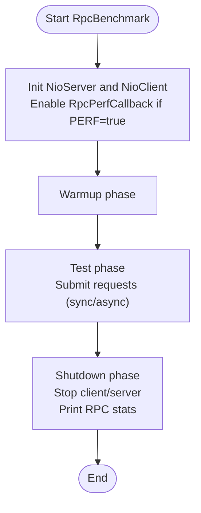

# RPC Framework Benchmarking

<cite>
**Referenced Files in This Document**
- [RpcBenchmark.java](file://benchmark/src/main/java/com/github/dtprj/dongting/bench/rpc/RpcBenchmark.java)
- [RpcPerfCallback.java](file://benchmark/src/main/java/com/github/dtprj/dongting/bench/rpc/RpcPerfCallback.java)
- [BenchBase.java](file://benchmark/src/main/java/com/github/dtprj/dongting/bench/common/BenchBase.java)
- [PrometheusPerfCallback.java](file://benchmark/src/main/java/com/github/dtprj/dongting/bench/common/PrometheusPerfCallback.java)
- [PerfCallback.java](file://client/src/main/java/com/github/dtprj/dongting/common/PerfCallback.java)
- [PerfConsts.java](file://client/src/main/java/com/github/dtprj/dongting/common/PerfConsts.java)
- [NioServer.java](file://client/src/main/java/com/github/dtprj/dongting/net/NioServer.java)
- [NioClient.java](file://client/src/main/java/com/github/dtprj/dongting/net/NioClient.java)
- [NioServerConfig.java](file://client/src/main/java/com/github/dtprj/dongting/net/NioServerConfig.java)
- [NioClientConfig.java](file://client/src/main/java/com/github/dtprj/dongting/net/NioClientConfig.java)
- [NioNet.java](file://client/src/main/java/com/github/dtprj/dongting/net/NioNet.java)
- [NioWorker.java](file://client/src/main/java/com/github/dtprj/dongting/net/NioWorker.java)
</cite>

## Table of Contents
1. [Introduction](#introduction)
2. [Project Structure](#project-structure)
3. [Core Components](#core-components)
4. [Architecture Overview](#architecture-overview)
5. [Detailed Component Analysis](#detailed-component-analysis)
6. [Dependency Analysis](#dependency-analysis)
7. [Performance Considerations](#performance-considerations)
8. [Troubleshooting Guide](#troubleshooting-guide)
9. [Conclusion](#conclusion)
10. [Appendices](#appendices)

## Introduction
This document explains the RPC framework benchmarking setup centered on the RpcBenchmark class. It covers how the NioServer and NioClient are configured for performance testing, how the benchmark measures throughput and latency for different command types (notably CMD_PING), and how RpcPerfCallback collects and reports detailed RPC performance metrics. It also provides guidance on interpreting results, understanding the RPC processing pipeline, and identifying potential bottlenecks in the network stack. Finally, it shows how to configure synchronous versus asynchronous operations and how to analyze the detailed RPC statistics output from both client and server perspectives.

## Project Structure
The benchmarking code resides under the benchmark module and integrates with the core networking stack in the client module. The RpcBenchmark orchestrates the lifecycle of a minimal RPC test, while RpcPerfCallback instruments the network stack to collect granular timing and counters.

**Diagram sources**
- [RpcBenchmark.java](file://benchmark/src/main/java/com/github/dtprj/dongting/bench/rpc/RpcBenchmark.java#L52-L161)
- [RpcPerfCallback.java](file://benchmark/src/main/java/com/github/dtprj/dongting/bench/rpc/RpcPerfCallback.java#L26-L118)
- [BenchBase.java](file://benchmark/src/main/java/com/github/dtprj/dongting/bench/common/BenchBase.java#L30-L153)
- [PrometheusPerfCallback.java](file://benchmark/src/main/java/com/github/dtprj/dongting/bench/common/PrometheusPerfCallback.java#L31-L103)
- [NioClient.java](file://client/src/main/java/com/github/dtprj/dongting/net/NioClient.java#L41-L175)
- [NioServer.java](file://client/src/main/java/com/github/dtprj/dongting/net/NioServer.java#L49-L118)
- [NioClientConfig.java](file://client/src/main/java/com/github/dtprj/dongting/net/NioClientConfig.java#L23-L44)
- [NioServerConfig.java](file://client/src/main/java/com/github/dtprj/dongting/net/NioServerConfig.java#L21-L67)
- [NioNet.java](file://client/src/main/java/com/github/dtprj/dongting/net/NioNet.java#L44-L200)
- [NioWorker.java](file://client/src/main/java/com/github/dtprj/dongting/net/NioWorker.java#L49-L200)
- [PerfConsts.java](file://client/src/main/java/com/github/dtprj/dongting/common/PerfConsts.java#L17-L52)
- [PerfCallback.java](file://client/src/main/java/com/github/dtprj/dongting/common/PerfCallback.java#L16-L110)

**Section sources**
- [RpcBenchmark.java](file://benchmark/src/main/java/com/github/dtprj/dongting/bench/rpc/RpcBenchmark.java#L52-L161)
- [NioServer.java](file://client/src/main/java/com/github/dtprj/dongting/net/NioServer.java#L49-L118)
- [NioClient.java](file://client/src/main/java/com/github/dtprj/dongting/net/NioClient.java#L41-L175)

## Core Components
- RpcBenchmark: Orchestrates the benchmark lifecycle, initializes NioServer and NioClient, configures request submission (sync vs async), and prints aggregated statistics.
- RpcPerfCallback: Collects and prints detailed RPC performance metrics (latency and counts) and computes worker utilization.
- BenchBase: Provides the benchmark harness with warmup, test, and shutdown phases, plus basic throughput and latency reporting.
- NioServer/NioClient: Network endpoints with configurable IO and business threads; support for request/response and one-way messages.
- NioNet/NioWorker: Shared networking core that enforces backpressure, schedules work, and emits performance events.
- PerfConsts/PerfCallback: Defines performance event types and the callback mechanism used to record timings and counts.

**Section sources**
- [RpcBenchmark.java](file://benchmark/src/main/java/com/github/dtprj/dongting/bench/rpc/RpcBenchmark.java#L52-L161)
- [RpcPerfCallback.java](file://benchmark/src/main/java/com/github/dtprj/dongting/bench/rpc/RpcPerfCallback.java#L26-L118)
- [BenchBase.java](file://benchmark/src/main/java/com/github/dtprj/dongting/bench/common/BenchBase.java#L30-L153)
- [NioServer.java](file://client/src/main/java/com/github/dtprj/dongting/net/NioServer.java#L49-L118)
- [NioClient.java](file://client/src/main/java/com/github/dtprj/dongting/net/NioClient.java#L41-L175)
- [NioNet.java](file://client/src/main/java/com/github/dtprj/dongting/net/NioNet.java#L44-L200)
- [NioWorker.java](file://client/src/main/java/com/github/dtprj/dongting/net/NioWorker.java#L49-L200)
- [PerfConsts.java](file://client/src/main/java/com/github/dtprj/dongting/common/PerfConsts.java#L17-L52)
- [PerfCallback.java](file://client/src/main/java/com/github/dtprj/dongting/common/PerfCallback.java#L16-L110)

## Architecture Overview
The benchmark sets up a single-threaded NioServer and a single-threaded NioClient, both with configurable business threads. Requests are submitted by the benchmark threads to the client, which enforces backpressure and queues work on the IO worker. The server decodes and processes the request (e.g., CMD_PING) and responds. RpcPerfCallback records granular timing and counters across the pipeline.

**Diagram sources**
- [RpcBenchmark.java](file://benchmark/src/main/java/com/github/dtprj/dongting/bench/rpc/RpcBenchmark.java#L126-L161)
- [NioClient.java](file://client/src/main/java/com/github/dtprj/dongting/net/NioClient.java#L132-L175)
- [NioNet.java](file://client/src/main/java/com/github/dtprj/dongting/net/NioNet.java#L92-L172)
- [NioWorker.java](file://client/src/main/java/com/github/dtprj/dongting/net/NioWorker.java#L182-L238)
- [NioServer.java](file://client/src/main/java/com/github/dtprj/dongting/net/NioServer.java#L256-L292)
- [RpcPerfCallback.java](file://benchmark/src/main/java/com/github/dtprj/dongting/bench/rpc/RpcPerfCallback.java#L58-L94)

## Detailed Component Analysis

### RpcBenchmark: Benchmark Orchestration
- Initializes NioServer with configurable IO and business threads and optional RpcPerfCallback.
- Initializes NioClient with host/port and optional RpcPerfCallback.
- Submits requests in a loop using either synchronous or asynchronous mode.
- Starts and stops the client and server, printing detailed RPC statistics.

Key behaviors:
- Synchronous vs asynchronous:
  - Synchronous: waits for a ReadPacket and releases the buffer.
  - Asynchronous: registers a callback to handle success/failure and release the buffer.
- Warmup and test phases are managed by BenchBase.
- Data payload size is configurable and randomized.

**Section sources**
- [RpcBenchmark.java](file://benchmark/src/main/java/com/github/dtprj/dongting/bench/rpc/RpcBenchmark.java#L52-L161)
- [BenchBase.java](file://benchmark/src/main/java/com/github/dtprj/dongting/bench/common/BenchBase.java#L30-L153)

### RpcPerfCallback: Metrics Collection and Reporting
- Extends PrometheusPerfCallback to emit summaries for RPC-related metrics.
- Tracks:
  - rpc_acquire: time to acquire outbound permits/backpressure.
  - rpc_worker_queue: time spent in worker queue.
  - rpc_channel_queue: time spent in channel queue.
  - rpc_worker_sel: time spent in selector/selectNow.
  - rpc_worker_work: time spent in worker loop iteration.
  - rpc_read_time and rpc_read_bytes: read throughput and latency.
  - rpc_write_time and rpc_write_bytes: write throughput and latency.
  - rpc_mark_read and rpc_mark_write: counts of read/write interest toggles.
- Computes worker thread utilization as ratio of work time to total selector+work time.

**Section sources**
- [RpcPerfCallback.java](file://benchmark/src/main/java/com/github/dtprj/dongting/bench/rpc/RpcPerfCallback.java#L26-L118)
- [PrometheusPerfCallback.java](file://benchmark/src/main/java/com/github/dtprj/dongting/bench/common/PrometheusPerfCallback.java#L31-L103)
- [PerfConsts.java](file://client/src/main/java/com/github/dtprj/dongting/common/PerfConsts.java#L17-L52)

### NioServer: Request Processing Pipeline
- Accepts connections and dispatches to NioWorker instances.
- Registers processors for commands (e.g., CMD_PING) and responds with the same body.
- Exposes methods to send requests and one-way messages.

**Section sources**
- [NioServer.java](file://client/src/main/java/com/github/dtprj/dongting/net/NioServer.java#L49-L118)
- [NioServer.java](file://client/src/main/java/com/github/dtprj/dongting/net/NioServer.java#L256-L292)

### NioClient: Request Submission and Backpressure
- Manages peers and connects to servers.
- Supports synchronous and asynchronous request submission.
- Enforces backpressure via acquirePermit and condition-based waits.

**Section sources**
- [NioClient.java](file://client/src/main/java/com/github/dtprj/dongting/net/NioClient.java#L41-L175)
- [NioNet.java](file://client/src/main/java/com/github/dtprj/dongting/net/NioNet.java#L126-L200)

### NioNet and NioWorker: Performance Event Emission
- NioNet:
  - Enforces backpressure and emits RPC_D_ACQUIRE timing.
  - Schedules packets to NioWorker via writeReqInBizThreads.
- NioWorker:
  - Emits RPC_D_WORKER_SEL and RPC_D_WORKER_WORK timings around select/selectNow.
  - Emits RPC_D_READ and RPC_D_WRITE timings for socket I/O.
  - Emits RPC_C_MARK_READ and RPC_C_MARK_WRITE counts for interest toggles.

**Section sources**
- [NioNet.java](file://client/src/main/java/com/github/dtprj/dongting/net/NioNet.java#L92-L172)
- [NioWorker.java](file://client/src/main/java/com/github/dtprj/dongting/net/NioWorker.java#L182-L238)
- [NioWorker.java](file://client/src/main/java/com/github/dtprj/dongting/net/NioWorker.java#L298-L356)
- [NioWorker.java](file://client/src/main/java/com/github/dtprj/dongting/net/NioWorker.java#L358-L401)

### Performance Metrics and Interpretation
RpcPerfCallback records the following key metrics:
- rpc_acquire: Indicates backpressure contention; higher values suggest client-side throttling.
- rpc_worker_sel: Selector wait time; high values indicate low activity or scheduling overhead.
- rpc_worker_work: Work loop time; high values indicate heavy processing or contention.
- rpc_read_time and rpc_write_time: Network I/O latency; useful for detecting slow reads/writes.
- rpc_read_bytes and rpc_write_bytes: Throughput indicators; combined with latencies to assess efficiency.
- rpc_mark_read and rpc_mark_write: Counts of interest toggles; helps diagnose excessive read/write readiness signaling.

Interpretation tips:
- If rpc_worker_sel dominates, the system may be idle or under-utilized; consider increasing load or reducing select timeout.
- If rpc_worker_work dominates, CPU-bound processing or contention is likely; review business thread configuration and workload.
- If rpc_read_time or rpc_write_time are high, investigate network conditions, buffer sizes, or payload sizes.
- If rpc_acquire is high, consider tuning maxOutRequests/maxOutBytes or increasing business threads.

**Section sources**
- [RpcPerfCallback.java](file://benchmark/src/main/java/com/github/dtprj/dongting/bench/rpc/RpcPerfCallback.java#L58-L115)
- [NioNet.java](file://client/src/main/java/com/github/dtprj/dongting/net/NioNet.java#L126-L172)
- [NioWorker.java](file://client/src/main/java/com/github/dtprj/dongting/net/NioWorker.java#L182-L238)
- [NioWorker.java](file://client/src/main/java/com/github/dtprj/dongting/net/NioWorker.java#L298-L356)

### Test Methodology and Command Types
- Command type: The benchmark uses CMD_PING by default, which echoes the request body as the response.
- Data sizes: The benchmark initializes a fixed-size byte array for request bodies; varying this size allows measuring throughput and latency across different payload sizes.
- Throughput and latency:
  - BenchBase tracks success/fail counts and average/max request times when enabled.
  - RpcPerfCallback provides quantile-based summaries for RPC_D_* metrics.

To measure different command types:
- Register additional processors in NioServer and adjust RpcBenchmark to submit different commands.
- Ensure the client’s decoder callback matches the response body type.

**Section sources**
- [RpcBenchmark.java](file://benchmark/src/main/java/com/github/dtprj/dongting/bench/rpc/RpcBenchmark.java#L126-L161)
- [NioServer.java](file://client/src/main/java/com/github/dtprj/dongting/net/NioServer.java#L274-L292)

### Synchronous vs Asynchronous Operations
- Synchronous:
  - Uses sendRequest returning a ReadPacket.
  - Releases the response body buffer after use.
- Asynchronous:
  - Uses sendRequest with a callback to handle completion.
  - Releases the response body buffer in the callback.

Configuration toggles:
- The benchmark defines a SYNC flag to switch between modes.

**Section sources**
- [RpcBenchmark.java](file://benchmark/src/main/java/com/github/dtprj/dongting/bench/rpc/RpcBenchmark.java#L126-L161)
- [NioClient.java](file://client/src/main/java/com/github/dtprj/dongting/net/NioClient.java#L132-L175)

### Analyzing Detailed RPC Statistics Output
- Client and server both print RPC statistics after shutdown when RpcPerfCallback is enabled.
- The output includes:
  - rpc_acquire, rpc_worker_queue, rpc_channel_queue, rpc_worker_sel, rpc_worker_work.
  - rpc_read_time, rpc_read_bytes, rpc_write_time, rpc_write_bytes.
  - rpc_mark_read, rpc_mark_write.
  - Worker utilization computed from rpc_worker_sel and rpc_worker_work.

Use these outputs to:
- Compare client vs server contributions to latency.
- Identify whether the bottleneck is in selector/selectNow, work loop, or I/O.
- Evaluate throughput scaling with payload size and thread counts.

**Section sources**
- [RpcBenchmark.java](file://benchmark/src/main/java/com/github/dtprj/dongting/bench/rpc/RpcBenchmark.java#L102-L124)
- [RpcPerfCallback.java](file://benchmark/src/main/java/com/github/dtprj/dongting/bench/rpc/RpcPerfCallback.java#L96-L115)

## Dependency Analysis
The benchmark depends on the client networking stack and the benchmarking utilities. The key dependency chain is:
- RpcBenchmark -> NioClient/NioServer -> NioNet -> NioWorker -> PerfCallback -> RpcPerfCallback.

**Diagram sources**
- [RpcBenchmark.java](file://benchmark/src/main/java/com/github/dtprj/dongting/bench/rpc/RpcBenchmark.java#L52-L161)
- [NioClient.java](file://client/src/main/java/com/github/dtprj/dongting/net/NioClient.java#L41-L175)
- [NioServer.java](file://client/src/main/java/com/github/dtprj/dongting/net/NioServer.java#L49-L118)
- [NioNet.java](file://client/src/main/java/com/github/dtprj/dongting/net/NioNet.java#L44-L200)
- [NioWorker.java](file://client/src/main/java/com/github/dtprj/dongting/net/NioWorker.java#L49-L200)
- [PerfCallback.java](file://client/src/main/java/com/github/dtprj/dongting/common/PerfCallback.java#L16-L110)
- [RpcPerfCallback.java](file://benchmark/src/main/java/com/github/dtprj/dongting/bench/rpc/RpcPerfCallback.java#L26-L118)

**Section sources**
- [RpcBenchmark.java](file://benchmark/src/main/java/com/github/dtprj/dongting/bench/rpc/RpcBenchmark.java#L52-L161)
- [NioNet.java](file://client/src/main/java/com/github/dtprj/dongting/net/NioNet.java#L92-L172)
- [NioWorker.java](file://client/src/main/java/com/github/dtprj/dongting/net/NioWorker.java#L182-L238)

## Performance Considerations
- Thread model:
  - NioServerConfig defaults to a dynamic IO thread count and a business thread count proportional to CPU cores.
  - NioClientConfig defaults to a smaller business thread count suitable for client-side processing.
- Backpressure:
  - Tune maxOutRequests and maxOutBytes to balance throughput and memory usage.
  - Monitor rpc_acquire to detect when backpressure is limiting throughput.
- Selector behavior:
  - Adjust selectTimeout to trade off responsiveness vs CPU usage.
- Payload sizing:
  - Vary the request body size to evaluate impact on rpc_read_time, rpc_write_time, and rpc_read_bytes/rpc_write_bytes.
- Worker utilization:
  - Use rpc_worker_sel and rpc_worker_work to assess whether the worker thread is saturated.

[No sources needed since this section provides general guidance]

## Troubleshooting Guide
Common issues and remedies:
- High rpc_acquire:
  - Increase maxOutRequests or maxOutBytes in client configuration.
  - Reduce payload size or batch size.
- High rpc_worker_sel:
  - Lower selectTimeout or increase load to keep selector busy.
  - Verify no external wakeups are causing immediate selectNow.
- High rpc_worker_work:
  - Review business thread configuration and workload.
  - Consider reducing per-request processing overhead.
- High rpc_read_time/rpc_write_time:
  - Investigate network conditions, buffer sizes, and payload sizes.
  - Ensure TCP_NODELAY is enabled (already set in worker initialization).
- rpc_mark_read/rpc_mark_write anomalies:
  - Excessive toggling may indicate frequent readiness signaling; verify queue sizes and backpressure.

**Section sources**
- [NioNet.java](file://client/src/main/java/com/github/dtprj/dongting/net/NioNet.java#L126-L172)
- [NioWorker.java](file://client/src/main/java/com/github/dtprj/dongting/net/NioWorker.java#L298-L356)
- [NioWorker.java](file://client/src/main/java/com/github/dtprj/dongting/net/NioWorker.java#L358-L401)

## Conclusion
The RpcBenchmark provides a focused, configurable way to measure RPC throughput and latency across the Dongting network stack. By leveraging RpcPerfCallback, it captures detailed timing and counters that reveal bottlenecks in backpressure, selector behavior, worker processing, and I/O. Adjusting thread counts, payload sizes, and backpressure limits enables controlled experiments to optimize performance for different workloads.

[No sources needed since this section summarizes without analyzing specific files]

## Appendices

### Configuration Options for NioServer and NioClient
- NioServerConfig:
  - port/ports: listening ports.
  - ioThreads: number of IO threads.
  - backlog: accept backlog.
  - bizThreads: business thread count (auto-tuned).
- NioClientConfig:
  - hostPorts: list of server endpoints.
  - connectTimeoutMillis: connection timeout.
  - connectRetryIntervals: retry intervals for auto-reconnect.
  - bizThreads: business thread count (auto-tuned).

**Section sources**
- [NioServerConfig.java](file://client/src/main/java/com/github/dtprj/dongting/net/NioServerConfig.java#L21-L67)
- [NioClientConfig.java](file://client/src/main/java/com/github/dtprj/dongting/net/NioClientConfig.java#L23-L44)

### Benchmark Execution Flow

**Diagram sources**
- [RpcBenchmark.java](file://benchmark/src/main/java/com/github/dtprj/dongting/bench/rpc/RpcBenchmark.java#L52-L124)
- [BenchBase.java](file://benchmark/src/main/java/com/github/dtprj/dongting/bench/common/BenchBase.java#L65-L108)