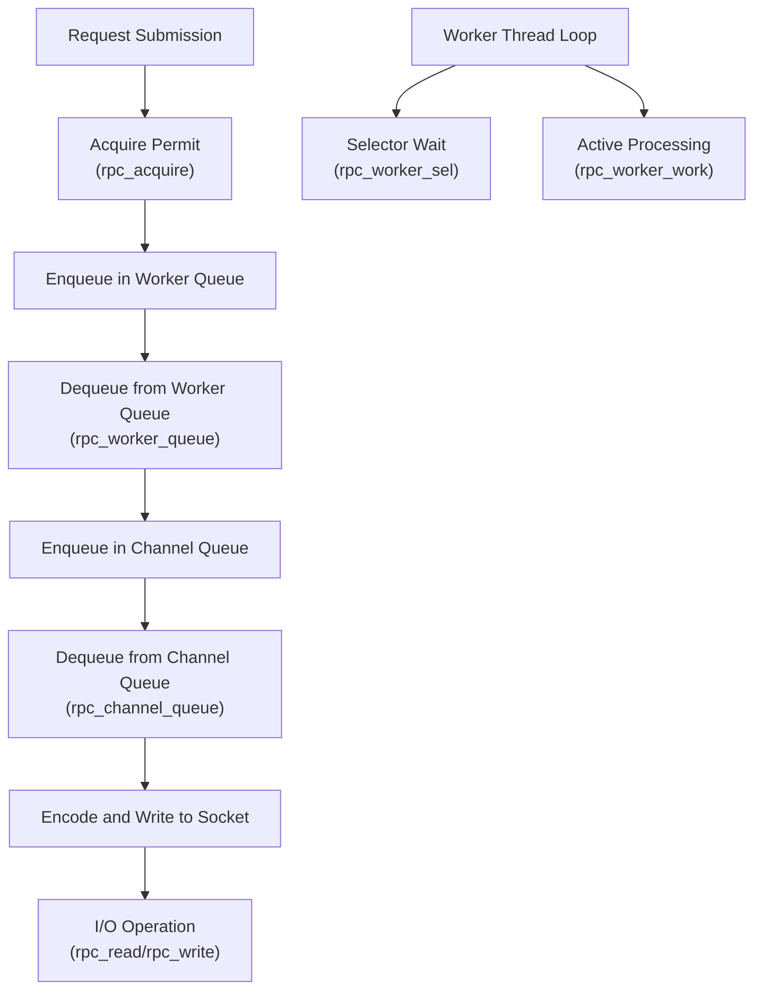
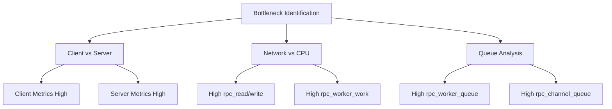

# RPC Performance Metrics

<cite>
**Referenced Files in This Document**   
- [RpcPerfCallback.java](file://benchmark/src/main/java/com/github/dtprj/dongting/bench/rpc/RpcPerfCallback.java)
- [PerfConsts.java](file://client/src/main/java/com/github/dtprj/dongting/common/PerfConsts.java)
- [PerfCallback.java](file://client/src/main/java/com/github/dtprj/dongting/common/PerfCallback.java)
- [PrometheusPerfCallback.java](file://benchmark/src/main/java/com/github/dtprj/dongting/bench/common/PrometheusPerfCallback.java)
- [NioNet.java](file://client/src/main/java/com/github/dtprj/dongting/net/NioNet.java)
- [IoWorkerQueue.java](file://client/src/main/java/com/github/dtprj/dongting/net/IoWorkerQueue.java)
- [IoChannelQueue.java](file://client/src/main/java/com/github/dtprj/dongting/net/IoChannelQueue.java)
- [NioWorker.java](file://client/src/main/java/com/github/dtprj/dongting/net/NioWorker.java)
- [RpcBenchmark.java](file://benchmark/src/main/java/com/github/dtprj/dongting/bench/rpc/RpcBenchmark.java)
</cite>

## Table of Contents
1. [Introduction](#introduction)
2. [Core Metrics Overview](#core-metrics-overview)
3. [Metric Collection Mechanism](#metric-collection-mechanism)
4. [Worker Thread Utilization Rate](#worker-thread-utilization-rate)
5. [End-to-End Latency Analysis](#end-to-end-latency-analysis)
6. [Bottleneck Identification](#bottleneck-identification)
7. [Throughput Optimization](#throughput-optimization)
8. [Benchmark Output Interpretation](#benchmark-output-interpretation)
9. [Conclusion](#conclusion)

## Introduction
The RPC performance metrics system in the dongting project provides comprehensive monitoring capabilities for analyzing the performance of remote procedure calls. Implemented through the `RpcPerfCallback` class, this system tracks various stages of the RPC pipeline, from request acquisition to I/O operations, enabling detailed performance analysis and optimization. The metrics are collected using Prometheus summaries and can be printed via the `printStats()` method, providing insights into system behavior under different workloads. This documentation explains each tracked metric, their collection mechanism, and how to use them for performance analysis and optimization.

**Section sources**
- [RpcPerfCallback.java](file://benchmark/src/main/java/com/github/dtprj/dongting/bench/rpc/RpcPerfCallback.java#L1-L118)
- [RpcBenchmark.java](file://benchmark/src/main/java/com/github/dtprj/dongting/bench/rpc/RpcBenchmark.java#L1-L162)

## Core Metrics Overview
The `RpcPerfCallback` class tracks several key performance metrics that represent different stages of the RPC pipeline. These metrics are categorized into timing metrics (measured in nanoseconds) and counter metrics (counting operations).

### Request Acquisition Delay (rpc_acquire)
This metric measures the time taken to acquire a permit for sending an RPC request. It represents the initial delay before a request can be processed, typically occurring when flow control mechanisms are in place to limit the number of pending requests. The metric is recorded in the `NioNet` class when a request is submitted and the permit is acquired.

### Worker Task Queue Time (rpc_worker_queue)
This metric captures the time a request spends waiting in the worker thread's task queue before being processed. After a request is submitted, it is placed in the worker queue where it waits for the worker thread to pick it up for further processing. This metric helps identify if the worker threads are overloaded or if there are bottlenecks in task dispatching.

### Channel Write Queue Time (rpc_channel_queue)
This metric measures the duration a request spends in the channel-specific write queue before encoding begins. Once a worker thread picks up a request, it is assigned to a specific channel and placed in the channel's write queue. This metric indicates the queuing delay at the channel level and can reveal issues with channel utilization or contention.

### Selector Loop Time (rpc_worker_sel)
This metric tracks the time spent in the NIO selector loop between processing events. The worker thread uses a selector to monitor multiple channels for I/O events. This metric represents the idle time or waiting time in the selector, which can indicate whether the system is CPU-bound or I/O-bound.

### Actual Processing Time (rpc_worker_work)
This metric measures the actual time spent by the worker thread processing tasks, including handling I/O events and executing queued tasks. It represents the active processing time of the worker thread and is crucial for understanding CPU utilization and processing efficiency.

### I/O Operation Duration (rpc_read/rpc_write)
These metrics track the duration of read and write operations on the network. `rpc_read` measures the time taken to read data from the network into buffers, while `rpc_write` measures the time taken to write encoded data to the network. These metrics help identify network-related performance issues and can distinguish between network latency and processing latency.

### Buffer Reference Operations (rpc_mark_read/write)
These counter metrics track the number of buffer reference operations for read and write operations. They count how many times buffers are marked for reference counting purposes, which is important for understanding memory management overhead and buffer pool utilization.

**Section sources**
- [RpcPerfCallback.java](file://benchmark/src/main/java/com/github/dtprj/dongting/bench/rpc/RpcPerfCallback.java#L28-L38)
- [PerfConsts.java](file://client/src/main/java/com/github/dtprj/dongting/common/PerfConsts.java#L26-L34)

## Metric Collection Mechanism
The RPC performance metrics are collected through a well-defined mechanism that integrates with the core networking components of the system. The collection process follows the observer pattern, where timing events are fired at specific points in the code and captured by the `RpcPerfCallback` instance.

### Timing Event Lifecycle
The metric collection process begins with the `PerfCallback` abstract class, which provides the foundation for performance monitoring. The `fireTime` method is used to record timing events by capturing the start time and later calculating the duration when the event completes. The `takeTime` method captures the current timestamp, which is then used to calculate the elapsed time when `fireTime` is called.

### Integration Points in the Codebase
The metrics are recorded at specific integration points throughout the RPC pipeline:

- **Request Acquisition**: In `NioNet.java`, the `rpc_acquire` metric is recorded immediately after acquiring a permit for a new request, capturing the flow control overhead.
- **Worker Queue Processing**: In `IoWorkerQueue.java`, the `rpc_worker_queue` metric is recorded when a task is dequeued from the worker's task queue, measuring the queuing delay.
- **Channel Queue Processing**: In `IoChannelQueue.java`, the `rpc_channel_queue` metric is recorded when a packet is dequeued from the channel's write queue, capturing the channel-level queuing delay.
- **Worker Thread Processing**: In `NioWorker.java`, both `rpc_worker_sel` and `rpc_worker_work` metrics are recorded around the selector loop, measuring the time spent in active processing versus waiting for I/O events.
- **I/O Operations**: In `NioWorker.java`, the `rpc_read` and `rpc_write` metrics are recorded during the actual read and write operations on the socket channel, capturing the network I/O duration.

### Prometheus Integration
The `PrometheusPerfCallback` class serves as the base for `RpcPerfCallback`, providing integration with Prometheus monitoring. It creates Summary metrics for each performance counter, which automatically calculate quantiles (0.0, 0.5, 0.99, 1.0) to provide statistical insights into the distribution of values. The summaries are configured with specific quantile settings to balance accuracy and performance.



**Diagram sources **
- [NioNet.java](file://client/src/main/java/com/github/dtprj/dongting/net/NioNet.java#L167)
- [IoWorkerQueue.java](file://client/src/main/java/com/github/dtprj/dongting/net/IoWorkerQueue.java#L73)
- [IoChannelQueue.java](file://client/src/main/java/com/github/dtprj/dongting/net/IoChannelQueue.java#L152)
- [NioWorker.java](file://client/src/main/java/com/github/dtprj/dongting/net/NioWorker.java#L277)
- [NioWorker.java](file://client/src/main/java/com/github/dtprj/dongting/net/NioWorker.java#L247)

**Section sources**
- [PerfCallback.java](file://client/src/main/java/com/github/dtprj/dongting/common/PerfCallback.java#L51-L109)
- [PrometheusPerfCallback.java](file://benchmark/src/main/java/com/github/dtprj/dongting/bench/common/PrometheusPerfCallback.java#L40-L103)
- [NioNet.java](file://client/src/main/java/com/github/dtprj/dongting/net/NioNet.java#L167)
- [IoWorkerQueue.java](file://client/src/main/java/com/github/dtprj/dongting/net/IoWorkerQueue.java#L73)
- [IoChannelQueue.java](file://client/src/main/java/com/github/dtprj/dongting/net/IoChannelQueue.java#L152)
- [NioWorker.java](file://client/src/main/java/com/github/dtprj/dongting/net/NioWorker.java#L247)

## Worker Thread Utilization Rate
The worker thread utilization rate is a derived metric calculated from the `rpc_worker_sel` and `rpc_worker_work` metrics, providing insight into how efficiently worker threads are being utilized. This rate is computed in the `printStats()` method of `RpcPerfCallback` by comparing the time spent in active processing to the total time (processing + waiting).

The calculation follows this formula:
```
worker thread utilization rate = rpc_worker_work / (rpc_worker_work + rpc_worker_sel)
```

A high utilization rate (close to 100%) indicates that worker threads are spending most of their time actively processing tasks, which is generally desirable for CPU-intensive workloads. However, if the rate is too high, it may indicate that the system is CPU-bound and could benefit from additional worker threads or optimization of processing logic.

A low utilization rate suggests that worker threads are spending significant time waiting in the selector loop, which could indicate I/O bottlenecks, network latency, or underutilization of CPU resources. In such cases, the system might benefit from optimizing I/O operations, increasing the number of concurrent operations, or adjusting the worker thread count.

The worker thread utilization rate is particularly useful for capacity planning and identifying whether performance bottlenecks are CPU-related or I/O-related. By monitoring this metric under different workloads, system administrators can make informed decisions about resource allocation and system configuration.

**Section sources**
- [RpcPerfCallback.java](file://benchmark/src/main/java/com/github/dtprj/dongting/bench/rpc/RpcPerfCallback.java#L110-L114)

## End-to-End Latency Analysis
The comprehensive set of RPC metrics enables detailed end-to-end latency analysis by breaking down the total request processing time into its constituent components. This decomposition allows for precise identification of performance bottlenecks and optimization opportunities.

### Latency Breakdown
The total end-to-end latency can be decomposed into the following components:
1. **Flow Control Delay**: Represented by `rpc_acquire`, this is the time spent waiting for system resources or flow control permits.
2. **Task Scheduling Delay**: Captured by `rpc_worker_queue`, this is the time a request waits in the worker thread's task queue.
3. **Channel Queuing Delay**: Measured by `rpc_channel_queue`, this is the time spent waiting in the channel-specific write queue.
4. **Processing Delay**: Represented by `rpc_worker_work`, this is the actual time spent processing the request.
5. **I/O Delay**: Captured by `rpc_read` and `rpc_write`, these are the times spent on network operations.

### Correlation Analysis
Analyzing the correlation between these metrics provides valuable insights into system behavior:
- If `rpc_worker_queue` and `rpc_channel_queue` are both high, it suggests that worker threads or channels are overloaded.
- If `rpc_worker_work` is high while `rpc_worker_sel` is low, the system is CPU-bound.
- If `rpc_worker_sel` is high while `rpc_worker_work` is low, the system is I/O-bound or waiting for external resources.
- High `rpc_read` or `rpc_write` times indicate network-related issues, such as bandwidth limitations or high latency.

### Performance Patterns
Certain patterns in the metrics can indicate specific performance issues:
- **Spike in rpc_acquire**: May indicate flow control throttling due to system resource constraints.
- **High rpc_worker_queue with low rpc_worker_work**: Suggests that tasks are queuing up but worker threads are not busy, possibly due to thread contention or blocking operations.
- **High rpc_channel_queue with balanced worker metrics**: Indicates that a specific channel is becoming a bottleneck, possibly due to uneven load distribution.

**Section sources**
- [RpcPerfCallback.java](file://benchmark/src/main/java/com/github/dtprj/dongting/bench/rpc/RpcPerfCallback.java#L64-L93)
- [PerfConsts.java](file://client/src/main/java/com/github/dtprj/dongting/common/PerfConsts.java#L26-L34)

## Bottleneck Identification
The RPC performance metrics provide a systematic approach to identifying bottlenecks in the system by analyzing the relative magnitudes and patterns of different metrics. This section outlines how to use the metrics to distinguish between client-side and server-side bottlenecks, as well as network and CPU bottlenecks.

### Client vs Server Bottlenecks
By comparing metrics from both client and server sides, it's possible to determine where bottlenecks occur:
- **Client-side bottlenecks**: Characterized by high `rpc_acquire`, `rpc_worker_queue`, or `rpc_worker_work` on the client, while server metrics remain low. This suggests that the client is unable to generate or process requests fast enough.
- **Server-side bottlenecks**: Indicated by high processing metrics on the server while client metrics are normal. This suggests that the server is struggling to keep up with the request load.

The `RpcBenchmark` class demonstrates this by collecting and printing metrics from both client and server configurations, allowing for direct comparison.

### Network vs CPU Bottlenecks
Distinguishing between network and CPU bottlenecks is crucial for effective optimization:
- **Network bottlenecks**: Characterized by high `rpc_read` and `rpc_write` times, especially when compared to processing times. High network I/O durations suggest bandwidth limitations, high latency, or network congestion.
- **CPU bottlenecks**: Indicated by high `rpc_worker_work` times and high worker thread utilization rates. When worker threads are consistently busy, the system is limited by CPU processing capacity.

### Queue Analysis
The queue-related metrics (`rpc_worker_queue` and `rpc_channel_queue`) are particularly useful for identifying resource contention:
- **High worker queue times**: Suggest that worker threads are overloaded and cannot process tasks as quickly as they arrive.
- **High channel queue times**: Indicate that specific channels are becoming bottlenecks, possibly due to uneven load distribution or channel-specific processing delays.



**Diagram sources **
- [RpcBenchmark.java](file://benchmark/src/main/java/com/github/dtprj/dongting/bench/rpc/RpcBenchmark.java#L112-L123)

**Section sources**
- [RpcPerfCallback.java](file://benchmark/src/main/java/com/github/dtprj/dongting/bench/rpc/RpcPerfCallback.java#L64-L93)
- [RpcBenchmark.java](file://benchmark/src/main/java/com/github/dtprj/dongting/bench/rpc/RpcBenchmark.java#L112-L123)

## Throughput Optimization
The RPC performance metrics provide valuable insights for optimizing system throughput by identifying and addressing performance bottlenecks. This section outlines strategies for improving throughput based on the analysis of the collected metrics.

### Worker Thread Optimization
The worker thread metrics (`rpc_worker_work` and `rpc_worker_sel`) are key indicators for optimizing thread configuration:
- **Increase worker threads**: If `rpc_worker_work` is consistently high and utilization is near 100%, adding more worker threads can improve throughput by enabling parallel processing.
- **Decrease worker threads**: If `rpc_worker_sel` is high and utilization is low, reducing the number of worker threads can improve efficiency by reducing context switching overhead.

### Flow Control Tuning
The `rpc_acquire` metric provides insights into flow control effectiveness:
- **Relax flow control**: If `rpc_acquire` times are high while processing metrics are low, the flow control limits may be too restrictive and can be increased to allow more concurrent requests.
- **Tighten flow control**: If system resources are being overwhelmed, reducing flow control limits can prevent resource exhaustion and improve stability.

### Queue Management
The queue metrics (`rpc_worker_queue` and `rpc_channel_queue`) guide optimization of task dispatching:
- **Optimize queue sizes**: If queue times are consistently high, increasing queue capacities or optimizing queue processing can reduce latency.
- **Improve load balancing**: High `rpc_channel_queue` times on specific channels suggest uneven load distribution, which can be addressed by improving load balancing algorithms.

### I/O Optimization
The I/O metrics (`rpc_read` and `rpc_write`) inform network-related optimizations:
- **Batch operations**: If write operations are frequent but small, batching can reduce the number of I/O operations and improve throughput.
- **Buffer sizing**: Analyzing the relationship between I/O times and data sizes can help optimize buffer sizes for better network efficiency.

**Section sources**
- [RpcPerfCallback.java](file://benchmark/src/main/java/com/github/dtprj/dongting/bench/rpc/RpcPerfCallback.java#L64-L93)
- [NioNet.java](file://client/src/main/java/com/github/dtprj/dongting/net/NioNet.java#L167)
- [IoWorkerQueue.java](file://client/src/main/java/com/github/dtprj/dongting/net/IoWorkerQueue.java#L73)

## Benchmark Output Interpretation
Interpreting the benchmark output from `printStats()` requires understanding the format and meaning of the reported metrics. The output provides statistical summaries for each metric, including call count, average, total, percentiles, maximum, and minimum values.

### Output Format
Each metric is reported in the following format:
```
metric_name: call N, avg X, total Y, p50 Z, p99 W, max V, min U
```
Where:
- **call**: Total number of observations
- **avg**: Average value
- **total**: Sum of all values
- **p50**: 50th percentile (median)
- **p99**: 99th percentile
- **max**: Maximum value
- **min**: Minimum value

### Real-World Example
Consider a benchmark output showing:
```
rpc_worker_queue: call 10,000, avg 500us, total 5s, p50 400us, p99 2ms, max 10ms, min 100us
```
This indicates that while the average queuing time is 500 microseconds, 1% of requests experience queuing delays of up to 2 milliseconds, with a maximum of 10 milliseconds. The significant difference between average and p99 values suggests occasional queuing spikes that may need investigation.

### Correlation Analysis
When interpreting benchmark results, it's essential to analyze metrics in correlation:
- Compare `rpc_worker_work` and `rpc_worker_sel` to assess CPU utilization
- Examine the relationship between `rpc_worker_queue` and `rpc_channel_queue` to identify queuing bottlenecks
- Analyze `rpc_read` and `rpc_write` in relation to data sizes to assess network efficiency

The worker thread utilization rate, calculated as a percentage, provides a quick assessment of system efficiency and helps determine whether the system is CPU-bound or I/O-bound.

**Section sources**
- [RpcPerfCallback.java](file://benchmark/src/main/java/com/github/dtprj/dongting/bench/rpc/RpcPerfCallback.java#L96-L114)
- [PrometheusPerfCallback.java](file://benchmark/src/main/java/com/github/dtprj/dongting/bench/common/PrometheusPerfCallback.java#L55-L91)

## Conclusion
The RPC performance metrics system in the dongting project provides a comprehensive framework for monitoring and optimizing remote procedure call performance. By tracking key metrics across the entire RPC pipeline—from request acquisition to I/O operations—the system enables detailed performance analysis and bottleneck identification. The integration with Prometheus summaries provides statistical insights through quantile calculations, while the `printStats()` method offers a convenient way to view and interpret performance data.

The metrics can be used to analyze end-to-end latency, identify system bottlenecks (distinguishing between client and server, network and CPU), and optimize throughput through informed configuration changes. The worker thread utilization rate provides a valuable derived metric for assessing system efficiency and guiding capacity planning decisions.

By leveraging these performance metrics, developers and system administrators can make data-driven decisions to improve system performance, ensure optimal resource utilization, and maintain high service quality under varying workloads.