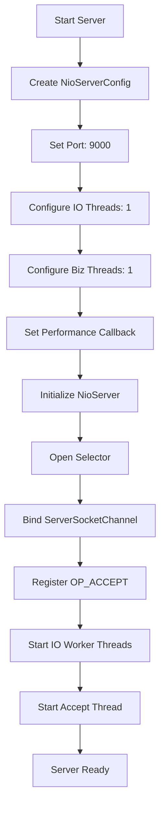
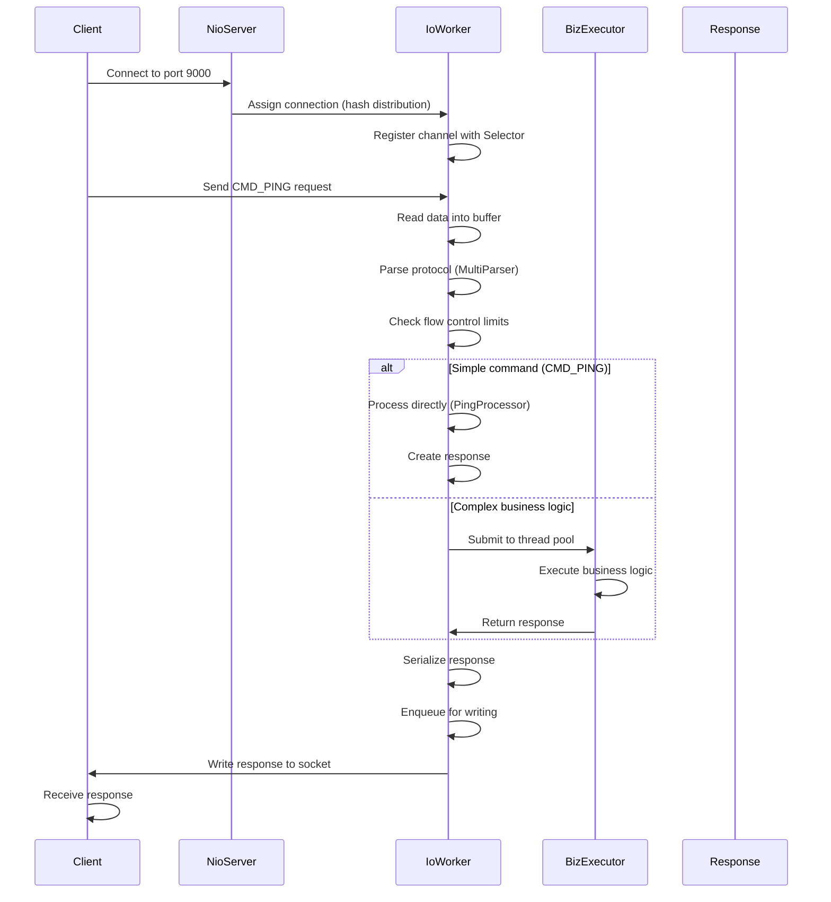
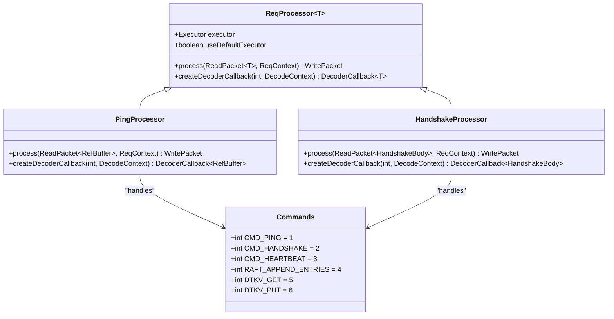
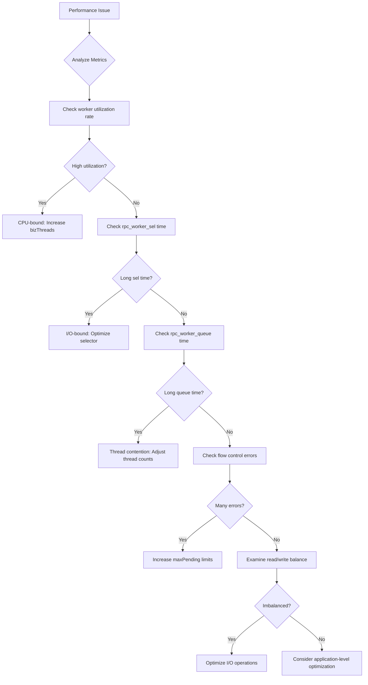

# RPC Server Benchmarking

<cite>
**Referenced Files in This Document**   
- [RpcBenchmark.java](file://benchmark/src/main/java/com/github/dtprj/dongting/bench/rpc/RpcBenchmark.java)
- [RpcPerfCallback.java](file://benchmark/src/main/java/com/github/dtprj/dongting/bench/rpc/RpcPerfCallback.java)
- [NioServer.java](file://client/src/main/java/com/github/dtprj/dongting/net/NioServer.java)
- [NioServerConfig.java](file://client/src/main/java/com/github/dtprj/dongting/net/NioServerConfig.java)
- [NioWorker.java](file://client/src/main/java/com/github/dtprj/dongting/net/NioWorker.java)
- [IoWorkerQueue.java](file://client/src/main/java/com/github/dtprj/dongting/net/IoWorkerQueue.java)
- [PerfCallback.java](file://client/src/main/java/com/github/dtprj/dongting/common/PerfCallback.java)
- [PerfConsts.java](file://client/src/main/java/com/github/dtprj/dongting/common/PerfConsts.java)
- [Commands.java](file://client/src/main/java/com/github/dtprj/dongting/net/Commands.java)
- [ReqProcessor.java](file://client/src/main/java/com/github/dtprj/dongting/net/ReqProcessor.java)
- [NioNet.java](file://client/src/main/java/com/github/dtprj/dongting/net/NioNet.java)
</cite>

## Table of Contents
1. [Introduction](#introduction)
2. [Server Configuration and Setup](#server-configuration-and-setup)
3. [Thread Model and Worker Architecture](#thread-model-and-worker-architecture)
4. [Request Processing Pipeline](#request-processing-pipeline)
5. [Performance Monitoring with RpcPerfCallback](#performance-monitoring-with-rpcperfcallback)
6. [Command Processing and Response Handling](#command-processing-and-response-handling)
7. [Performance Tuning and Bottleneck Analysis](#performance-tuning-and-bottleneck-analysis)
8. [Conclusion](#conclusion)

## Introduction

This document provides a comprehensive analysis of the RPC server benchmarking framework within the Dongting project, focusing on the NioServer implementation used in RpcBenchmark. The system is designed for high-performance network communication with a sophisticated threading model that separates I/O operations from business logic processing. The benchmarking framework allows for detailed performance analysis through comprehensive metrics collection, enabling optimization of server-side throughput and latency. This documentation explains the server's architecture, configuration parameters, request processing flow, and performance monitoring capabilities, providing insights into tuning strategies and bottleneck identification.

**Section sources**
- [RpcBenchmark.java](file://benchmark/src/main/java/com/github/dtprj/dongting/bench/rpc/RpcBenchmark.java#L41-L162)

## Server Configuration and Setup

The NioServer configuration is established through the NioServerConfig class, which defines critical parameters for server operation. The configuration includes port binding specifications, where a single port or multiple ports can be specified for the server to listen on. The server's threading model is configured through ioThreads and bizThreads parameters, which determine the number of threads dedicated to I/O operations and business logic processing respectively. By default, the system calculates an optimal number of I/O threads based on available processors, ranging from 1 thread for systems with 3 or fewer cores to 8 threads for systems with more than 100 cores. Business threads are set to twice the number of available processors, with a minimum of 6 and maximum of 16 threads.

The server setup process begins with the initialization of the NioServer instance using the configured parameters. During initialization, the server creates ServerSocketChannel instances for each specified port and registers them with a Selector for non-blocking I/O operations. The accept thread is started to handle incoming connection requests, while I/O worker threads are initialized to process established connections. The server also sets up a business executor thread pool for handling business logic, which can be customized or disabled based on the specific requirements. The configuration includes backpressure settings such as maximum pending requests and bytes, which help prevent resource exhaustion under high load conditions.



**Diagram sources **
- [NioServer.java](file://client/src/main/java/com/github/dtprj/dongting/net/NioServer.java#L50-L121)
- [NioServerConfig.java](file://client/src/main/java/com/github/dtprj/dongting/net/NioServerConfig.java#L21-L66)

**Section sources**
- [NioServer.java](file://client/src/main/java/com/github/dtprj/dongting/net/NioServer.java#L50-L121)
- [NioServerConfig.java](file://client/src/main/java/com/github/dtprj/dongting/net/NioServerConfig.java#L21-L66)
- [RpcBenchmark.java](file://benchmark/src/main/java/com/github/dtprj/dongting/bench/rpc/RpcBenchmark.java#L65-L73)

## Thread Model and Worker Architecture

The NioServer implements a hybrid threading model that separates I/O operations from business processing to maximize throughput and minimize latency. The architecture consists of three main thread types: the accept thread, I/O worker threads, and business executor threads. The accept thread is responsible for accepting new incoming connections and distributing them across the I/O worker threads using a hash-based distribution strategy. Each I/O worker thread manages its own Selector and processes all I/O operations (read and write) for the connections assigned to it, following the Reactor pattern.

The I/O worker threads operate in an event-driven loop, continuously selecting on their Selector for ready I/O events. When events are detected, the worker processes them by reading incoming data into buffers or writing pending data to channels. For incoming requests that require business logic processing, the worker enqueues the request to be processed by the business executor thread pool. This separation ensures that I/O operations do not block business processing and vice versa, allowing the system to maintain high responsiveness even under heavy load.

The worker architecture is implemented in the NioWorker class, which maintains several critical components: a Selector for I/O multiplexing, an IoWorkerQueue for receiving tasks from business threads, a channels map to track active connections, and thread-local object pools for efficient memory management. The worker's main loop alternates between selector operations (rpc_worker_sel phase) and processing queued tasks (rpc_worker_work phase), with performance metrics collected for each phase to enable detailed analysis of thread utilization.

```mermaid
classDiagram
class NioServer {
+NioServerConfig config
+ServerSocketChannel[] serverSocketChannels
+Selector selector
+Thread acceptThread
+NioWorker[] workers
+ConcurrentHashMap<UUID, DtChannel> clients
+doStart()
+doStop()
+run()
}
class NioWorker {
+String workerName
+WorkerThread thread
+Selector selector
+IntObjMap<DtChannelImpl> channels
+IoWorkerQueue ioWorkerQueue
+ByteBufferPool directPool
+ByteBufferPool heapPool
+WorkerStatus workerStatus
+run()
+run0()
+sel()
+processOneSelectionKey()
}
class IoWorkerQueue {
+MpscLinkedQueue<Object> queue
+NioWorker worker
+PerfCallback perfCallback
+writeFromBizThread()
+scheduleFromBizThread()
+dispatchActions()
}
NioServer --> NioWorker : "has multiple"
NioWorker --> IoWorkerQueue : "has"
NioWorker --> "Selector" : "uses"
NioWorker --> "IntObjMap<DtChannelImpl>" : "manages"
```

**Diagram sources **
- [NioServer.java](file://client/src/main/java/com/github/dtprj/dongting/net/NioServer.java#L49-L293)
- [NioWorker.java](file://client/src/main/java/com/github/dtprj/dongting/net/NioWorker.java#L55-L809)
- [IoWorkerQueue.java](file://client/src/main/java/com/github/dtprj/dongting/net/IoWorkerQueue.java#L32-L147)

**Section sources**
- [NioWorker.java](file://client/src/main/java/com/github/dtprj/dongting/net/NioWorker.java#L55-L809)
- [IoWorkerQueue.java](file://client/src/main/java/com/github/dtprj/dongting/net/IoWorkerQueue.java#L32-L147)
- [NioServer.java](file://client/src/main/java/com/github/dtprj/dongting/net/NioServer.java#L49-L293)

## Request Processing Pipeline

The request processing pipeline in the NioServer follows a multi-stage flow that begins with connection acceptance and ends with response transmission. When a client connects to the server, the accept thread receives the connection and assigns it to an I/O worker thread using a hash-based distribution strategy. The worker thread then initializes the connection by creating a DtChannelImpl instance and registering the socket channel with its Selector for read operations.

Incoming data is processed through a series of phases: first, the I/O worker reads data from the socket into a direct ByteBuffer, then passes it to the MultiParser for protocol decoding. The decoded request is processed based on its command type, with special handling for system commands like CMD_PING and CMD_HANDSHAKE. For business requests, the system checks flow control limits (maximum pending requests and bytes) before queuing the request for processing. If flow control limits are exceeded, the server responds with a FLOW_CONTROL error code to prevent resource exhaustion.

The processing of requests occurs in two possible paths: direct processing on the I/O thread for simple operations, or delegation to the business executor thread pool for complex business logic. After processing, the response is serialized and enqueued in the channel's write queue. The I/O worker detects when data is available to write and performs the actual socket write operation, updating performance metrics for the write phase. The pipeline is designed to minimize context switching and maximize throughput by keeping I/O operations on dedicated threads while allowing business logic to scale independently.



**Diagram sources **
- [NioWorker.java](file://client/src/main/java/com/github/dtprj/dongting/net/NioWorker.java#L284-L357)
- [DtChannelImpl.java](file://client/src/main/java/com/github/dtprj/dongting/net/DtChannelImpl.java#L200-L506)
- [NioNet.java](file://client/src/main/java/com/github/dtprj/dongting/net/NioNet.java#L150-L301)

**Section sources**
- [NioWorker.java](file://client/src/main/java/com/github/dtprj/dongting/net/NioWorker.java#L284-L357)
- [DtChannelImpl.java](file://client/src/main/java/com/github/dtprj/dongting/net/DtChannelImpl.java#L200-L506)
- [NioNet.java](file://client/src/main/java/com/github/dtprj/dongting/net/NioNet.java#L150-L301)

## Performance Monitoring with RpcPerfCallback

The RpcPerfCallback class provides comprehensive performance monitoring capabilities for the RPC server, enabling detailed analysis of system behavior under load. The callback implements the PerfCallback interface and collects metrics across multiple phases of the request processing pipeline, including rpc_acquire, rpc_worker_queue, rpc_channel_queue, rpc_worker_sel, rpc_worker_work, rpc_read_time, rpc_read_bytes, rpc_write_time, and rpc_write_bytes. These metrics are collected using high-resolution timers and aggregated using Prometheus Summary objects for statistical analysis.

During server operation, the RpcPerfCallback records the time spent in each processing phase, allowing for identification of bottlenecks and optimization opportunities. The callback also tracks the number of read and write operations through counters (rpc_mark_read and rpc_mark_write), providing insights into I/O patterns. When performance tracing is enabled, the callback starts collecting metrics after the warmup period and continues until the benchmark completes, at which point it prints detailed statistics including percentiles, averages, and totals for each metric.

A key feature of the RpcPerfCallback is its ability to calculate worker thread utilization rate by comparing the time spent in selector operations (rpc_worker_sel) versus actual work processing (rpc_worker_work). This metric is crucial for determining whether the server is I/O bound or CPU bound, and for making informed decisions about thread count tuning. The utilization rate is calculated as the ratio of work time to total time (sel + work), expressed as a percentage.

```mermaid
flowchart TD
A[Start Benchmark] --> B[Enable PERF flag]
B --> C[Initialize RpcPerfCallback]
C --> D[Set useNanos=true]
D --> E[Create Summary metrics]
E --> F[Register with serverConfig]
F --> G[After Warmup]
G --> H[Call start() on callback]
H --> I[Collect metrics during test]
I --> J[Record rpc_worker_sel time]
I --> K[Record rpc_worker_work time]
I --> L[Record rpc_read_time]
I --> M[Record rpc_write_time]
I --> N[Track rpc_mark_read/write]
J --> O[Calculate utilization rate]
K --> O
O --> P[Print stats on shutdown]
P --> Q[Display worker utilization]
P --> R[Display latency percentiles]
P --> S[Display throughput metrics]
```

**Diagram sources **
- [RpcPerfCallback.java](file://benchmark/src/main/java/com/github/dtprj/dongting/bench/rpc/RpcPerfCallback.java#L26-L118)
- [PerfCallback.java](file://client/src/main/java/com/github/dtprj/dongting/common/PerfCallback.java#L21-L110)
- [PerfConsts.java](file://client/src/main/java/com/github/dtprj/dongting/common/PerfConsts.java#L21-L54)

**Section sources**
- [RpcPerfCallback.java](file://benchmark/src/main/java/com/github/dtprj/dongting/bench/rpc/RpcPerfCallback.java#L26-L118)
- [PerfCallback.java](file://client/src/main/java/com/github/dtprj/dongting/common/PerfCallback.java#L21-L110)
- [PerfConsts.java](file://client/src/main/java/com/github/dtprj/dongting/common/PerfConsts.java#L21-L54)

## Command Processing and Response Handling

The NioServer handles different command types through a registry-based processor system, where each command is associated with a specific ReqProcessor implementation. The server comes with built-in processors for system commands such as CMD_PING and CMD_HANDSHAKE, and allows for custom processors to be registered for application-specific commands. The command processing system is designed to handle both synchronous and asynchronous operations, with support for flow control and timeout handling.

For the CMD_PING command, the server uses the PingProcessor class which simply echoes the received data back to the client. This processor is optimized for low latency and high throughput, making it ideal for benchmarking scenarios. The processor creates a RefBufWritePacket containing the received data and sets the appropriate response code, which is then serialized and sent back to the client. The simplicity of this command makes it an excellent choice for measuring raw network performance without the overhead of complex business logic.

Response handling is implemented through a consistent pattern across all command types. After processing a request, the server creates a response packet with the appropriate command, sequence number, and packet type (TYPE_RESP). The response is then enqueued in the channel's write queue, where it will be processed by the I/O worker during the next write cycle. For one-way requests (TYPE_ONE_WAY), no response is generated, allowing for maximum throughput in scenarios where acknowledgment is not required.



**Diagram sources **
- [NioServer.java](file://client/src/main/java/com/github/dtprj/dongting/net/NioServer.java#L274-L292)
- [ReqProcessor.java](file://client/src/main/java/com/github/dtprj/dongting/net/ReqProcessor.java#L26-L36)
- [Commands.java](file://client/src/main/java/com/github/dtprj/dongting/net/Commands.java#L21-L70)

**Section sources**
- [NioServer.java](file://client/src/main/java/com/github/dtprj/dongting/net/NioServer.java#L274-L292)
- [ReqProcessor.java](file://client/src/main/java/com/github/dtprj/dongting/net/ReqProcessor.java#L26-L36)
- [Commands.java](file://client/src/main/java/com/github/dtprj/dongting/net/Commands.java#L21-L70)

## Performance Tuning and Bottleneck Analysis

Optimizing the NioServer performance requires careful tuning of thread counts and analysis of the collected performance metrics. The key to effective tuning is understanding the relationship between I/O threads, business threads, and the workload characteristics. For I/O-bound workloads (such as CMD_PING benchmarking), the optimal configuration typically has fewer business threads than I/O threads, as the processing overhead is minimal. For CPU-intensive workloads, increasing the business thread count can improve throughput by better utilizing available CPU cores.

The worker thread utilization rate, calculated from rpc_worker_sel and rpc_worker_work times, is a critical metric for identifying bottlenecks. A high utilization rate (close to 100%) indicates that worker threads are spending most of their time processing work rather than waiting for I/O events, suggesting the system is CPU-bound. Conversely, a low utilization rate indicates that threads spend significant time in selector operations, suggesting the system is I/O-bound or underutilized.

To diagnose server-side bottlenecks, administrators should examine the complete performance profile:
- High rpc_worker_queue times indicate contention in transferring work from business threads to I/O threads
- Long rpc_worker_sel durations suggest the selector is taking too long to detect ready events
- Extended rpc_worker_work times may indicate complex processing logic or blocking operations
- Imbalanced read/write times could reveal network or disk I/O bottlenecks
- High flow control errors suggest insufficient processing capacity relative to incoming request rates

Tuning strategies include adjusting the number of I/O and business threads, modifying the selector timeout, optimizing object pooling settings, and implementing appropriate flow control limits. The RpcPerfCallback's detailed metrics provide the necessary insights to make data-driven decisions about these optimizations, ensuring the server operates at peak efficiency for the specific workload.



**Diagram sources **
- [RpcPerfCallback.java](file://benchmark/src/main/java/com/github/dtprj/dongting/bench/rpc/RpcPerfCallback.java#L96-L117)
- [NioWorker.java](file://client/src/main/java/com/github/dtprj/dongting/net/NioWorker.java#L251-L283)
- [NioNet.java](file://client/src/main/java/com/github/dtprj/dongting/net/NioNet.java#L150-L301)

**Section sources**
- [RpcPerfCallback.java](file://benchmark/src/main/java/com/github/dtprj/dongting/bench/rpc/RpcPerfCallback.java#L96-L117)
- [NioWorker.java](file://client/src/main/java/com/github/dtprj/dongting/net/NioWorker.java#L251-L283)
- [NioNet.java](file://client/src/main/java/com/github/dtprj/dongting/net/NioNet.java#L150-L301)

## Conclusion

The NioServer implementation in the Dongting project provides a robust foundation for high-performance RPC benchmarking with comprehensive performance monitoring capabilities. The server's architecture effectively separates I/O operations from business processing through a hybrid threading model, allowing for independent scaling of each component. The detailed performance metrics collected by RpcPerfCallback enable precise analysis of system behavior, facilitating data-driven optimization decisions.

Key insights from the analysis include the importance of proper thread count configuration based on workload characteristics, the value of the worker thread utilization rate metric for identifying bottlenecks, and the effectiveness of the multi-phase request processing pipeline in maintaining high throughput. The system's design allows for both micro-benchmarking of raw network performance (using CMD_PING) and macro-benchmarking of complex business logic, making it a versatile tool for performance evaluation.

For optimal results, administrators should use the RpcPerfCallback to collect detailed metrics during benchmarking runs, analyze the worker utilization rate and phase timings, and iteratively tune configuration parameters based on the observed bottlenecks. The combination of the NioServer's efficient architecture and the comprehensive performance monitoring capabilities makes it well-suited for identifying and resolving performance issues in distributed systems.

**Section sources**
- [RpcBenchmark.java](file://benchmark/src/main/java/com/github/dtprj/dongting/bench/rpc/RpcBenchmark.java#L41-L162)
- [RpcPerfCallback.java](file://benchmark/src/main/java/com/github/dtprj/dongting/bench/rpc/RpcPerfCallback.java#L26-L118)
- [NioServer.java](file://client/src/main/java/com/github/dtprj/dongting/net/NioServer.java#L49-L293)