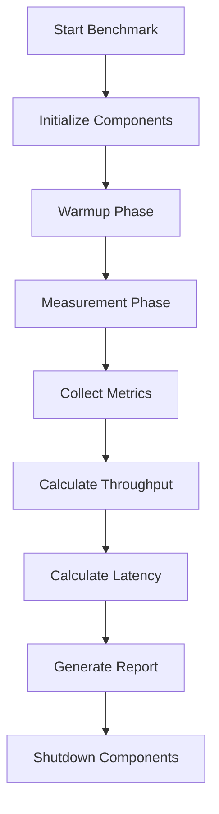
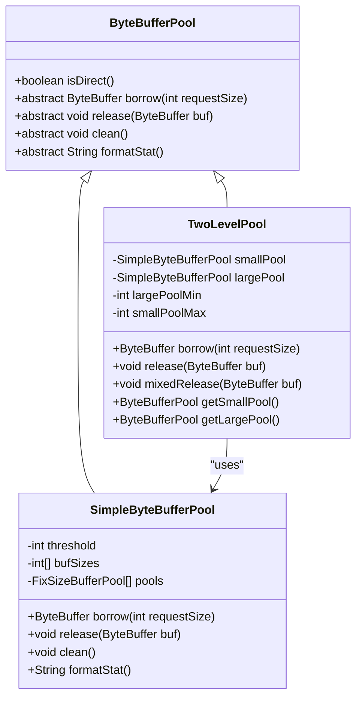
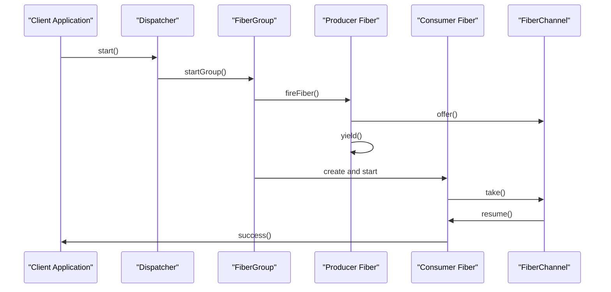
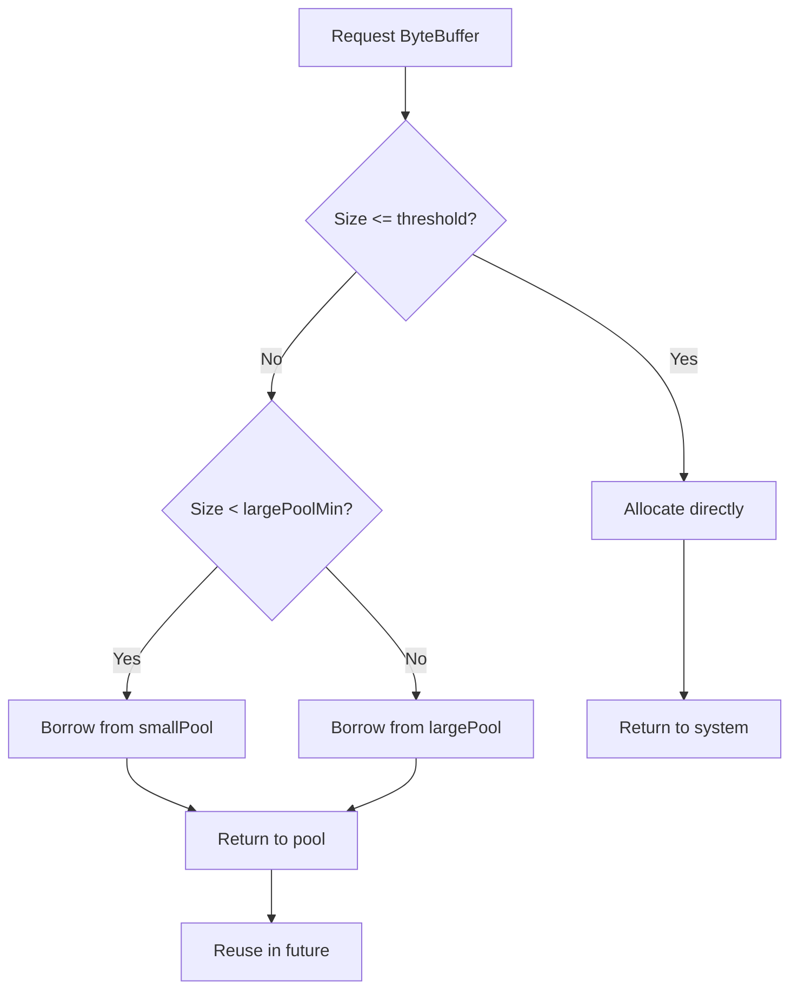
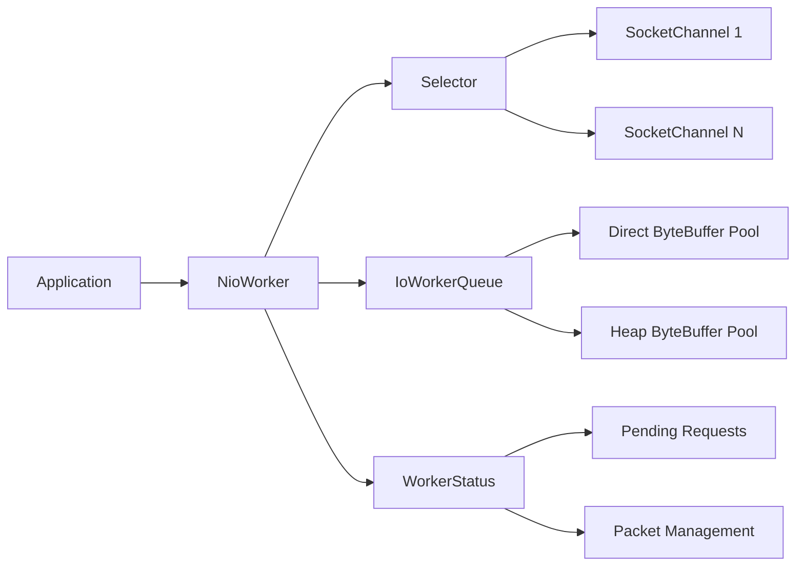
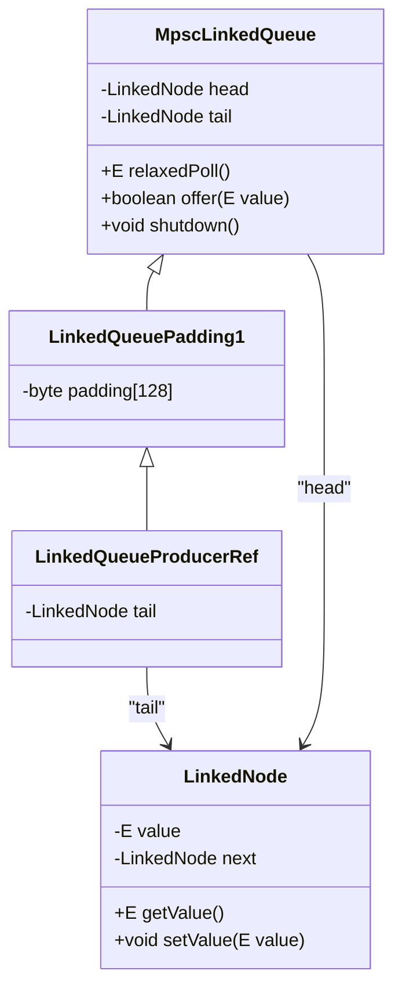
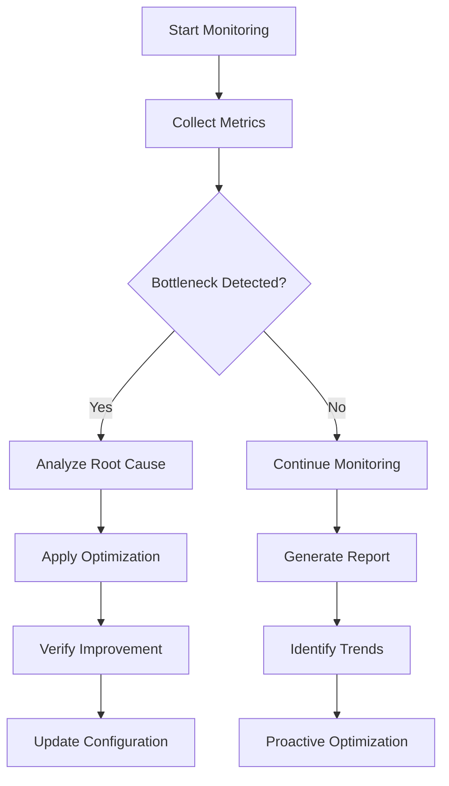

# Performance Optimization

<cite>
**Referenced Files in This Document**   
- [FiberTest.java](file://benchmark/src/main/java/com/github/dtprj/dongting/bench/fiber/FiberTest.java)
- [MpscQueueTest.java](file://benchmark/src/main/java/com/github/dtprj/dongting/bench/queue/MpscQueueTest.java)
- [IoTest.java](file://benchmark/src/main/java/com/github/dtprj/dongting/bench/io/IoTest.java)
- [RaftBenchmark.java](file://benchmark/src/main/java/com/github/dtprj/dongting/bench/raft/RaftBenchmark.java)
- [ByteBufferPool.java](file://client/src/main/java/com/github/dtprj/dongting/buf/ByteBufferPool.java)
- [MpscLinkedQueue.java](file://client/src/main/java/com/github/dtprj/dongting/queue/MpscLinkedQueue.java)
- [TwoLevelPool.java](file://client/src/main/java/com/github/dtprj/dongting/buf/TwoLevelPool.java)
- [Padding0.java](file://client/src/main/java/com/github/dtprj/dongting/common/Padding0.java)
- [SimpleByteBufferPool.java](file://client/src/main/java/com/github/dtprj/dongting/buf/SimpleByteBufferPool.java)
- [NioWorker.java](file://client/src/main/java/com/github/dtprj/dongting/net/NioWorker.java)
- [BenchBase.java](file://benchmark/src/main/java/com/github/dtprj/dongting/bench/common/BenchBase.java)
- [Java11MpscLinkedQueue.java](file://client/src/main/java/com/github/dtprj/dongting/java11/Java11MpscLinkedQueue.java)
- [2023_07_20_现代硬件下的IO程序开发.txt](file://devlogs/2023_07_20_现代硬件下的IO程序开发.txt)
- [2023_07_27_dongting的定位和原则.txt](file://devlogs/2023_07_27_dongting的定位和原则.txt)
</cite>

## Table of Contents
1. [Introduction](#introduction)
2. [Benchmarking Methodology](#benchmarking-methodology)
3. [Key Optimization Techniques](#key-optimization-techniques)
4. [Fiber-Based Concurrency](#fiber-based-concurrency)
5. [Memory Management](#memory-management)
6. [I/O Optimization](#io-optimization)
7. [CPU Cache Efficiency](#cpu-cache-efficiency)
8. [Performance Monitoring and Tuning](#performance-monitoring-and-tuning)
9. [Trade-offs and Recommendations](#trade-offs-and-recommendations)

## Introduction
Dongting is designed as a high-performance, zero-dependency engine combining RPC, configuration management, messaging, and RAFT consensus capabilities. This document focuses on the performance optimization strategies that enable Dongting to achieve high throughput and low latency across various workloads. The optimization approach spans multiple layers including concurrency models, memory management, I/O patterns, and CPU cache utilization. By leveraging modern hardware characteristics—particularly SSD performance—and implementing custom data structures, Dongting achieves significant performance advantages over traditional approaches. The benchmarking framework provides comprehensive insights into fiber operations, queue performance, I/O throughput, and RAFT consensus latency, enabling systematic optimization and tuning.

**Section sources**
- [2023_07_27_dongting的定位和原则.txt](file://devlogs/2023_07_27_dongting的定位和原则.txt#L1-L19)

## Benchmarking Methodology
The benchmarking framework in Dongting provides comprehensive performance evaluation across multiple dimensions. The `BenchBase` class serves as the foundation for all benchmarks, implementing a standardized testing protocol with warmup, measurement, and shutdown phases. Benchmarks are designed to measure throughput (operations per second) and latency (response time distribution) under controlled conditions. The framework supports multi-threaded testing with configurable thread counts, test durations, and warmup periods to ensure stable measurements. Performance metrics are collected using high-resolution timers and statistical aggregation to provide accurate results. The benchmark suite includes specialized tests for fiber operations, queue performance, I/O throughput, and RAFT consensus latency, allowing for targeted optimization of specific components. The `RaftBenchmark` class, for example, measures end-to-end performance of distributed consensus operations, while `IoTest` evaluates I/O patterns and throughput characteristics.

**Diagram sources**
- [BenchBase.java](file://benchmark/src/main/java/com/github/dtprj/dongting/bench/common/BenchBase.java#L1-L153)
- [RaftBenchmark.java](file://benchmark/src/main/java/com/github/dtprj/dongting/bench/raft/RaftBenchmark.java#L1-L229)

## Key Optimization Techniques
Dongting employs several key optimization techniques to achieve high performance. The custom `MpscLinkedQueue` implementation provides efficient multi-producer, single-consumer queue operations with minimal contention. Object pooling through `ByteBufferPool` and `TwoLevelPool` reduces garbage collection pressure and allocation overhead. Memory layout optimizations, including padding to prevent false sharing, improve CPU cache efficiency. The fiber-based concurrency model enables high-throughput, low-latency operations by minimizing thread context switching. These techniques work together to create a high-performance foundation for distributed systems operations.

**Diagram sources**
- [ByteBufferPool.java](file://client/src/main/java/com/github/dtprj/dongting/buf/ByteBufferPool.java#L1-L46)
- [TwoLevelPool.java](file://client/src/main/java/com/github/dtprj/dongting/buf/TwoLevelPool.java#L1-L146)
- [SimpleByteBufferPool.java](file://client/src/main/java/com/github/dtprj/dongting/buf/SimpleByteBufferPool.java#L1-L347)

## Fiber-Based Concurrency
Dongting's fiber-based concurrency model provides high-throughput, low-latency operations by minimizing thread context switching and maximizing CPU utilization. The `FiberTest` benchmark demonstrates the performance characteristics of fiber operations, including creation, scheduling, and communication. Fibers are lightweight, user-space threads that enable massive concurrency without the overhead of OS threads. The dispatcher manages fiber execution across a fixed number of worker threads, providing efficient load balancing and minimal contention. Fiber channels enable communication between fibers with low overhead, supporting complex asynchronous workflows. This model is particularly effective for I/O-bound operations, where fibers can yield during I/O waits and resume when data is available, maximizing throughput.

**Diagram sources**
- [FiberTest.java](file://benchmark/src/main/java/com/github/dtprj/dongting/bench/fiber/FiberTest.java#L1-L89)
- [Fiber.java](file://server/src/main/java/com/github/dtprj/dongting/fiber/Fiber.java)
- [Dispatcher.java](file://server/src/main/java/com/github/dtprj/dongting/fiber/Dispatcher.java)

## Memory Management
Dongting's memory management system is designed to minimize allocation overhead and garbage collection pressure through object pooling and efficient memory layout. The `TwoLevelPool` implementation combines small and large buffer pools to handle different allocation sizes efficiently. The `SimpleByteBufferPool` manages fixed-size buffer pools with configurable minimum and maximum counts, reducing fragmentation and improving reuse. Memory layout optimizations, including the use of padding classes like `Padding0`, prevent false sharing and improve CPU cache efficiency. The pooling system is designed to be thread-safe when necessary, with options for thread-local or shared pools depending on the use case.

**Diagram sources**
- [TwoLevelPool.java](file://client/src/main/java/com/github/dtprj/dongting/buf/TwoLevelPool.java#L1-L146)
- [SimpleByteBufferPool.java](file://client/src/main/java/com/github/dtprj/dongting/buf/SimpleByteBufferPool.java#L1-L347)
- [Padding0.java](file://client/src/main/java/com/github/dtprj/dongting/common/Padding0.java#L1-L40)

## I/O Optimization
Dongting's I/O optimization strategy leverages modern SSD characteristics and NIO patterns to achieve high throughput and low latency. The `IoTest` benchmark evaluates different I/O patterns and their performance characteristics on modern storage hardware. By understanding the performance profile of SSDs—where random and sequential access performance are much closer than with traditional HDDs—the system can optimize I/O patterns accordingly. The NIO-based implementation uses non-blocking I/O operations and efficient buffer management to minimize system call overhead and maximize throughput. The `NioWorker` class manages I/O operations across multiple channels, using selectors to efficiently handle multiple connections with minimal threads.

**Diagram sources**
- [IoTest.java](file://benchmark/src/main/java/com/github/dtprj/dongting/bench/io/IoTest.java#L1-L196)
- [NioWorker.java](file://client/src/main/java/com/github/dtprj/dongting/net/NioWorker.java#L1-L800)

## CPU Cache Efficiency
Dongting employs several techniques to maximize CPU cache efficiency and minimize performance penalties from memory access patterns. The use of padding classes like `Padding0` prevents false sharing by ensuring that frequently accessed fields from different threads are not located on the same cache line. Memory layout optimizations ensure that related data is co-located in memory to improve spatial locality. The custom `MpscLinkedQueue` implementation uses specialized memory access patterns to minimize cache invalidation and maximize throughput. These optimizations are particularly important for high-frequency operations like queue enqueue/dequeue, where cache misses can significantly impact performance.

**Diagram sources**
- [MpscLinkedQueue.java](file://client/src/main/java/com/github/dtprj/dongting/queue/MpscLinkedQueue.java#L1-L155)
- [Java11MpscLinkedQueue.java](file://client/src/main/java/com/github/dtprj/dongting/java11/Java11MpscLinkedQueue.java#L1-L61)
- [Padding0.java](file://client/src/main/java/com/github/dtprj/dongting/common/Padding0.java#L1-L40)

## Performance Monitoring and Tuning
Dongting provides comprehensive performance monitoring and tuning capabilities through its benchmarking framework and runtime metrics. The `PerfCallback` interface enables detailed performance tracking across various operations, allowing for bottleneck identification and optimization. The `RaftBenchmark` class includes detailed performance statistics for consensus operations, including latency measurements and throughput calculations. Tuning recommendations are provided for different workload patterns and hardware configurations, helping users optimize performance for their specific use cases. The system also includes guidelines for profiling and monitoring, enabling users to identify and address performance issues in production environments.

**Diagram sources**
- [RaftBenchmark.java](file://benchmark/src/main/java/com/github/dtprj/dongting/bench/raft/RaftBenchmark.java#L1-L229)
- [PerfCallback.java](file://client/src/main/java/com/github/dtprj/dongting/common/PerfCallback.java)
- [BenchBase.java](file://benchmark/src/main/java/com/github/dtprj/dongting/bench/common/BenchBase.java#L1-L153)

## Trade-offs and Recommendations
Dongting's performance optimization approach involves several trade-offs between performance, memory usage, and code complexity. The custom data structures and low-level optimizations provide significant performance benefits but increase code complexity and maintenance requirements. Object pooling reduces garbage collection overhead but requires careful management to avoid memory leaks. The fiber-based concurrency model enables high throughput but requires developers to think differently about asynchronous programming. For different workload patterns and hardware configurations, specific tuning recommendations can maximize performance. On systems with high-performance SSDs, I/O optimizations become less critical, while CPU and memory optimizations become more important. The system is designed to be flexible, allowing users to adjust configuration parameters to balance performance, resource usage, and complexity according to their specific requirements.

**Section sources**
- [2023_07_20_现代硬件下的IO程序开发.txt](file://devlogs/2023_07_20_现代硬件下的IO程序开发.txt#L1-L15)
- [2023_07_27_dongting的定位和原则.txt](file://devlogs/2023_07_27_dongting的定位和原则.txt#L1-L19)