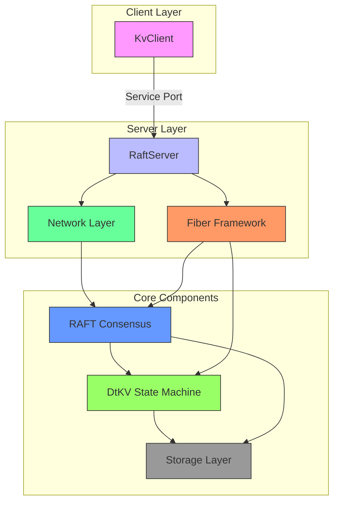
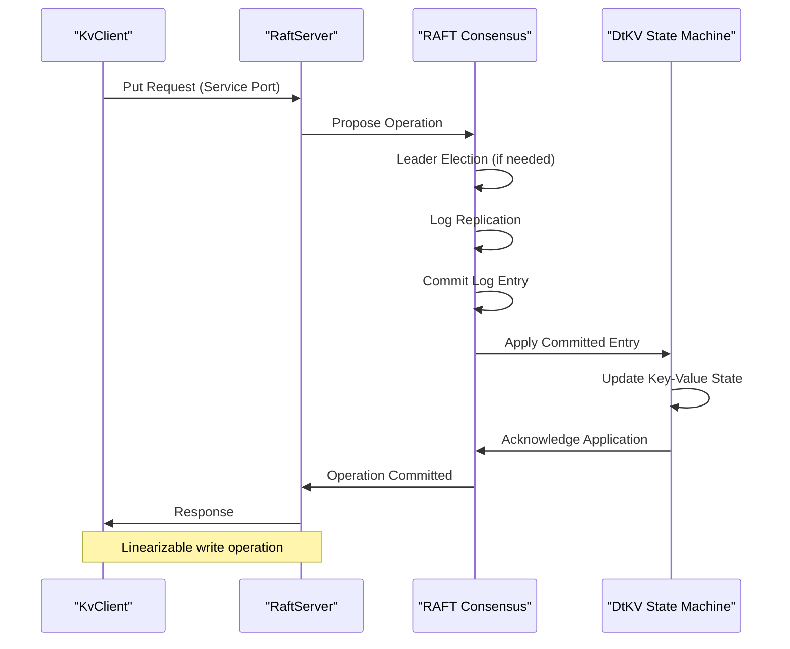

# Project Overview

<cite>
**Referenced Files in This Document**   
- [README.md](file://README.md)
- [docs/README.md](file://docs/README.md)
- [server/src/main/java/com/github/dtprj/dongting/raft/server/RaftServer.java](file://server/src/main/java/com/github/dtprj/dongting/raft/server/RaftServer.java)
- [server/src/main/java/com/github/dtprj/dongting/dtkv/server/DtKV.java](file://server/src/main/java/com/github/dtprj/dongting/dtkv/server/DtKV.java)
- [server/src/main/java/com/github/dtprj/dongting/fiber/Fiber.java](file://server/src/main/java/com/github/dtprj/dongting/fiber/Fiber.java)
- [client/src/main/java/com/github/dtprj/dongting/dtkv/KvClient.java](file://client/src/main/java/com/github/dtprj/dongting/dtkv/KvClient.java)
- [demos/src/main/java/com/github/dtprj/dongting/demos/standalone/StandaloneDemoServer.java](file://demos/src/main/java/com/github/dtprj/dongting/demos/standalone/StandaloneDemoServer.java)
- [demos/src/main/java/com/github/dtprj/dongting/demos/cluster/DemoServer1.java](file://demos/src/main/java/com/github/dtprj/dongting/demos/cluster/DemoServer1.java)
- [demos/src/main/java/com/github/dtprj/dongting/demos/multiraft/MultiRaftDemoServer1.java](file://demos/src/main/java/com/github/dtprj/dongting/demos/multiraft/MultiRaftDemoServer1.java)
- [demos/src/main/java/com/github/dtprj/dongting/demos/embedded/EmbeddedDemo.java](file://demos/src/main/java/com/github/dtprj/dongting/demos/embedded/EmbeddedDemo.java)
</cite>

## Table of Contents
1. [Introduction](#introduction)
2. [Architectural Vision](#architectural-vision)
3. [Core Components](#core-components)
4. [Design Principles](#design-principles)
5. [Key Features](#key-features)
6. [System Architecture](#system-architecture)
7. [Data Flow and Processing](#data-flow-and-processing)
8. [Use Cases](#use-cases)
9. [Performance Characteristics](#performance-characteristics)
10. [Deployment Models](#deployment-models)
11. [Developer Prerequisites](#developer-prerequisites)

## Introduction

The Dongting framework is a high-performance, zero-dependency distributed systems engine designed for building resilient and scalable distributed applications. It integrates RAFT consensus, a distributed configuration server (DtKV), fiber-based concurrency, and low-level RPC into a unified platform. The framework is engineered for performance-oriented programming, achieving exceptional throughput while maintaining minimal resource footprint.

Dongting's architecture is built around three core pillars: RAFT consensus for distributed agreement, DtKV as a linearizable distributed key-value store, and a fiber-based concurrency model for efficient execution. The framework supports multi-RAFT groups, allowing for dynamic scaling and sharding capabilities. With its zero-dependency design, Dongting produces only two JAR packages totaling less than 1MB, making it ideal for embedded systems and microservices architectures.

The framework demonstrates impressive performance characteristics, achieving up to 1.7 million TPS in asynchronous write mode on commodity hardware. It requires only Java 8 for the client and Java 11 for the server, with no reliance on external libraries or specialized hardware. This makes Dongting accessible for a wide range of deployment scenarios, from resource-constrained devices to high-performance server clusters.

**Section sources**
- [README.md](file://README.md#L4-L141)
- [docs/README.md](file://docs/README.md#L1-L108)

## Architectural Vision

Dongting's architectural vision centers on creating a high-performance, minimal-dependency distributed systems engine that combines RAFT consensus, distributed configuration management, and efficient concurrency in a single cohesive framework. The design philosophy emphasizes performance optimization, linearizability, and embeddability, enabling developers to build distributed systems without the complexity typically associated with such architectures.

The framework's architecture is organized around a layered approach where the fiber concurrency model provides the execution foundation, the network layer handles communication, the RAFT consensus algorithm ensures distributed agreement, and the DtKV state machine implements the distributed key-value store functionality. This layered design allows for clear separation of concerns while maintaining tight integration between components for optimal performance.

Dongting's vision includes supporting multiple RAFT groups within a single process, enabling dynamic scaling and sharding capabilities. The framework allows for runtime addition, removal, and updating of RAFT groups, providing flexibility for evolving system requirements. The state machine implementation is customizable, allowing developers to extend the framework for specific use cases beyond the built-in DtKV functionality.

The architectural vision also emphasizes zero dependencies and minimal footprint. By avoiding third-party libraries and optimizing for size, Dongting can be easily embedded into applications, making it suitable for both large-scale distributed systems and resource-constrained environments like embedded devices.

**Section sources**
- [README.md](file://README.md#L4-L141)
- [server/src/main/java/com/github/dtprj/dongting/raft/server/RaftServer.java](file://server/src/main/java/com/github/dtprj/dongting/raft/server/RaftServer.java#L84-L718)

## Core Components

Dongting's architecture comprises several core components that work together to provide a comprehensive distributed systems platform. The framework's foundation is built on a fiber-based concurrency model that enables efficient, lightweight execution of concurrent operations. These fibers run on dispatchers that manage execution across threads, providing a cooperative multitasking environment optimized for I/O-bound operations.

The network layer implements a custom RPC mechanism that handles communication between nodes in a RAFT cluster. This layer supports both the replicate port for internal RAFT communication and the service port for client interactions. The network components are designed for high throughput and low latency, leveraging non-blocking I/O operations to maximize performance.

At the heart of the framework is the RAFT consensus implementation, which provides distributed agreement across cluster nodes. The RAFT server manages multiple RAFT groups, each representing an independent consensus cluster. The implementation includes all standard RAFT operations such as leader election, log replication, and membership changes, with optimizations for performance and reliability.

The DtKV component serves as the distributed key-value store and state machine implementation. It provides tree-structured configuration storage with support for various operations including get, put, remove, list, mkdir, compare-and-set, TTL-based expiration, and distributed locking. DtKV ensures linearizability of operations through the underlying RAFT consensus mechanism.

**Section sources**
- [server/src/main/java/com/github/dtprj/dongting/raft/server/RaftServer.java](file://server/src/main/java/com/github/dtprj/dongting/raft/server/RaftServer.java#L84-L718)
- [server/src/main/java/com/github/dtprj/dongting/dtkv/server/DtKV.java](file://server/src/main/java/com/github/dtprj/dongting/dtkv/server/DtKV.java#L61-L413)
- [server/src/main/java/com/github/dtprj/dongting/fiber/Fiber.java](file://server/src/main/java/com/github/dtprj/dongting/fiber/Fiber.java#L27-L237)

## Design Principles

Dongting is built on several fundamental design principles that guide its architecture and implementation. The primary principle is performance optimization, with the framework engineered to achieve maximum throughput and minimal latency. This is evident in the reported performance metrics, where the framework achieves up to 1.7 million TPS in asynchronous write mode on commodity hardware.

Linearizability is another core design principle, ensuring that all operations on the distributed key-value store appear to occur instantaneously at some point between their invocation and completion. This guarantee is provided through the RAFT consensus algorithm, which sequences all state-changing operations and ensures that clients see a consistent view of the system state.

The principle of minimal dependencies is central to Dongting's design. The framework has no third-party library dependencies, with only SLF4J as an optional logging dependency. This zero-dependency approach results in a small footprint (under 1MB for both client and server JARs) and eliminates dependency management issues that often plague distributed systems.

The framework also adheres to the principle of embeddability, allowing it to be integrated directly into applications rather than requiring a separate deployment. This enables use cases ranging from microservices coordination to embedded systems where resources are constrained. The design supports both standalone operation and clustering, providing flexibility for different deployment scenarios.

**Section sources**
- [README.md](file://README.md#L4-L141)
- [docs/README.md](file://docs/README.md#L1-L108)

## Key Features

Dongting offers a comprehensive set of features for building distributed systems. One of its standout capabilities is support for multiple RAFT groups within a single process, enabling sharding and dynamic scaling. This allows the system to handle increased load by distributing data across multiple independent consensus clusters, with the ability to add or remove groups at runtime.

The framework provides distributed locking capabilities through both manual operations (tryLock/unlock) and automated lease renewal mechanisms. These distributed locks can be used for leader election in business code, providing a reliable coordination mechanism for distributed applications. The lock implementation ensures consistency through the underlying RAFT consensus.

DtKV, the distributed configuration server, supports a tree-structured key-value model with hierarchical organization. It implements a watch mechanism that allows clients to monitor keys or directories for changes, receiving notifications when modifications occur. This feature is particularly useful for configuration management and service discovery scenarios.

Time-to-live (TTL) support enables automatic expiration of keys after a specified duration, making it suitable for implementing cache-like behavior or temporary data storage. The framework also supports various data operations including batch operations, conditional updates (compare-and-set), and directory operations (mkdir, list), providing a rich API for data manipulation.

The embedded deployment capability allows all components to run within a single process, making it ideal for microservices architectures where each service can include its own instance of the coordination layer. This eliminates the need for external coordination services and reduces operational complexity.

**Section sources**
- [README.md](file://README.md#L4-L141)
- [docs/README.md](file://docs/README.md#L1-L108)
- [demos/src/main/java/com/github/dtprj/dongting/demos/lock/LockDemoServer.java](file://demos/src/main/java/com/github/dtprj/dongting/demos/lock/LockDemoServer.java)
- [demos/src/main/java/com/github/dtprj/dongting/demos/ttl/TtlDemoServer.java](file://demos/src/main/java/com/github/dtprj/dongting/demos/ttl/TtlDemoServer.java)
- [demos/src/main/java/com/github/dtprj/dongting/demos/watch/WatchDemoServer.java](file://demos/src/main/java/com/github/dtprj/dongting/demos/watch/WatchDemoServer.java)

## System Architecture

**Diagram sources **
- [server/src/main/java/com/github/dtprj/dongting/raft/server/RaftServer.java](file://server/src/main/java/com/github/dtprj/dongting/raft/server/RaftServer.java#L84-L718)
- [server/src/main/java/com/github/dtprj/dongting/dtkv/server/DtKV.java](file://server/src/main/java/com/github/dtprj/dongting/dtkv/server/DtKV.java#L61-L413)
- [server/src/main/java/com/github/dtprj/dongting/fiber/Fiber.java](file://server/src/main/java/com/github/dtprj/dongting/fiber/Fiber.java#L27-L237)

The Dongting framework's system architecture consists of multiple interconnected layers that work together to provide distributed consensus and coordination services. At the highest level, the KvClient component provides the interface for applications to interact with the distributed system through the service port.

The RaftServer component serves as the central coordinator, managing multiple RAFT groups and their associated state machines. It leverages the fiber framework for efficient concurrency and the network layer for communication between nodes. The fiber framework provides lightweight, cooperative multitasking that enables high-throughput processing of concurrent operations without the overhead of traditional threading models.

The network layer handles both internal RAFT communication through the replicate port and external client interactions through the service port. This separation allows for optimized communication patterns for different types of traffic. The RAFT consensus algorithm ensures distributed agreement across cluster nodes, with the DtKV state machine implementing the distributed key-value store functionality on top of the consensus log.

Data persistence is handled by the storage layer, which writes RAFT logs and snapshots to disk. The architecture supports both synchronous and asynchronous write modes, allowing for trade-offs between durability and performance. The modular design enables customization of components while maintaining the core guarantees of consistency and availability.

**Section sources**
- [server/src/main/java/com/github/dtprj/dongting/raft/server/RaftServer.java](file://server/src/main/java/com/github/dtprj/dongting/raft/server/RaftServer.java#L84-L718)
- [server/src/main/java/com/github/dtprj/dongting/dtkv/server/DtKV.java](file://server/src/main/java/com/github/dtprj/dongting/dtkv/server/DtKV.java#L61-L413)

## Data Flow and Processing

**Diagram sources **
- [server/src/main/java/com/github/dtprj/dongting/raft/server/RaftServer.java](file://server/src/main/java/com/github/dtprj/dongting/raft/server/RaftServer.java#L84-L718)
- [server/src/main/java/com/github/dtprj/dongting/dtkv/server/DtKV.java](file://server/src/main/java/com/github/dtprj/dongting/dtkv/server/DtKV.java#L61-L413)
- [client/src/main/java/com/github/dtprj/dongting/dtkv/KvClient.java](file://client/src/main/java/com/github/dtprj/dongting/dtkv/KvClient.java#L52-L771)

The data flow in Dongting follows a well-defined pattern that ensures consistency and reliability. When a client application makes a write request through the KvClient, the operation is sent to the RaftServer via the service port. The RaftServer then coordinates with the RAFT consensus algorithm to ensure the operation is replicated across the cluster.

For write operations, the RAFT leader receives the proposal and appends it to its log. It then replicates the log entry to follower nodes, requiring a majority quorum to acknowledge the entry before committing it. Once committed, the entry is applied to the DtKV state machine, which updates the key-value store state accordingly. The response is then sent back to the client, completing the linearizable write operation.

Read operations can be served by any node in the cluster through lease-based reads, which maintain linearizability while reducing the need for consensus on every read. The fiber framework processes these operations efficiently, suspending and resuming fibers as needed to handle I/O operations without blocking threads.

The processing pipeline is optimized for performance, with the fiber-based concurrency model allowing thousands of concurrent operations to be managed efficiently. The network layer handles serialization and deserialization of messages, while the RAFT implementation ensures fault tolerance and consistency even in the presence of network partitions or node failures.

**Section sources**
- [server/src/main/java/com/github/dtprj/dongting/raft/server/RaftServer.java](file://server/src/main/java/com/github/dtprj/dongting/raft/server/RaftServer.java#L84-L718)
- [server/src/main/java/com/github/dtprj/dongting/dtkv/server/DtKV.java](file://server/src/main/java/com/github/dtprj/dongting/dtkv/server/DtKV.java#L61-L413)
- [client/src/main/java/com/github/dtprj/dongting/dtkv/KvClient.java](file://client/src/main/java/com/github/dtprj/dongting/dtkv/KvClient.java#L52-L771)

## Use Cases

Dongting is designed for a variety of use cases in distributed systems. In microservices architectures, it serves as a lightweight coordination service for configuration management, service discovery, and distributed locking. Each microservice can embed a Dongting instance, eliminating the need for external coordination services like ZooKeeper or etcd while maintaining the same consistency guarantees.

For embedded systems, Dongting's small footprint and minimal resource requirements make it ideal for IoT devices and edge computing scenarios. The framework can run on devices with limited memory and processing power, providing distributed coordination capabilities even in resource-constrained environments. The ability to operate in standalone mode or as part of a cluster provides flexibility for different deployment patterns.

As a coordination service, Dongting supports leader election through its distributed locking mechanism, making it suitable for implementing highly available services where only one instance should be active at a time. The watch mechanism enables reactive programming patterns, where services can respond immediately to configuration changes or state updates.

The multi-RAFT group capability enables sharding of data across multiple consensus clusters, allowing for horizontal scaling of the coordination layer. This is particularly useful for large-scale systems that need to handle high volumes of coordination requests. The dynamic addition and removal of RAFT groups at runtime provides operational flexibility for evolving system requirements.

**Section sources**
- [README.md](file://README.md#L4-L141)
- [demos/src/main/java/com/github/dtprj/dongting/demos/cluster/DemoServer1.java](file://demos/src/main/java/com/github/dtprj/dongting/demos/cluster/DemoServer1.java#L16-L33)
- [demos/src/main/java/com/github/dtprj/dongting/demos/multiraft/MultiRaftDemoServer1.java](file://demos/src/main/java/com/github/dtprj/dongting/demos/multiraft/MultiRaftDemoServer1.java#L16-L32)
- [demos/src/main/java/com/github/dtprj/dongting/demos/embedded/EmbeddedDemo.java](file://demos/src/main/java/com/github/dtprj/dongting/demos/embedded/EmbeddedDemo.java#L16-L61)

## Performance Characteristics

Dongting demonstrates exceptional performance characteristics, achieving high throughput with low latency on commodity hardware. Performance tests conducted on a system with an AMD 5600X CPU, 32GB RAM, and a PCI-E 3.0 SSD showed throughput of up to 1.7 million TPS in asynchronous write mode with an average response time of 1.1ms for a single server configuration.

In a 3-server RAFT group configuration, the framework achieved 903,760 TPS in asynchronous write mode with an average response time of 2.2ms. When configured for synchronous writes (with fsync), the throughput was 272,540 TPS with an average response time of 7.3ms. These performance metrics highlight the framework's efficiency in handling high volumes of distributed operations.

The performance is achieved through several optimizations, including the fiber-based concurrency model that minimizes thread contention, efficient serialization and deserialization of messages, and optimized RAFT implementation that reduces the overhead of consensus operations. The zero-dependency design eliminates the performance overhead associated with third-party libraries.

The framework's performance is not dependent on specialized hardware, as it can run effectively on HDDs and even Raspberry Pi devices. This makes Dongting suitable for a wide range of deployment scenarios, from high-performance data centers to resource-constrained edge devices. The performance characteristics make it competitive with established distributed coordination services while offering a much smaller footprint and simpler deployment model.

**Section sources**
- [README.md](file://README.md#L16-L46)
- [server/src/main/java/com/github/dtprj/dongting/raft/server/RaftServer.java](file://server/src/main/java/com/github/dtprj/dongting/raft/server/RaftServer.java#L84-L718)

## Deployment Models

Dongting supports multiple deployment models to accommodate different application requirements. The standalone deployment model runs a single-node RAFT group, suitable for development, testing, or applications that don't require high availability. This model is demonstrated in the StandaloneDemoServer example, which configures a single-node cluster for simple use cases.

The clustered deployment model runs multiple nodes in a RAFT group, providing high availability and fault tolerance. The cluster demo shows a 3-node configuration where the cluster can tolerate the failure of one node while maintaining availability. This model is appropriate for production environments where reliability is critical.

The embedded deployment model allows multiple server instances and a client to run within a single process, as demonstrated in the EmbeddedDemo example. This model is ideal for microservices architectures where each service includes its own coordination layer, eliminating dependencies on external services and reducing operational complexity.

The multi-RAFT deployment model supports multiple independent RAFT groups within a single process, enabling sharding and dynamic scaling. This model allows for horizontal scaling of the coordination layer by distributing data across multiple consensus clusters, with the ability to add or remove groups at runtime based on workload requirements.

**Section sources**
- [demos/src/main/java/com/github/dtprj/dongting/demos/standalone/StandaloneDemoServer.java](file://demos/src/main/java/com/github/dtprj/dongting/demos/standalone/StandaloneDemoServer.java#L16-L33)
- [demos/src/main/java/com/github/dtprj/dongting/demos/cluster/DemoServer1.java](file://demos/src/main/java/com/github/dtprj/dongting/demos/cluster/DemoServer1.java#L16-L33)
- [demos/src/main/java/com/github/dtprj/dongting/demos/embedded/EmbeddedDemo.java](file://demos/src/main/java/com/github/dtprj/dongting/demos/embedded/EmbeddedDemo.java#L16-L61)
- [demos/src/main/java/com/github/dtprj/dongting/demos/multiraft/MultiRaftDemoServer1.java](file://demos/src/main/java/com/github/dtprj/dongting/demos/multiraft/MultiRaftDemoServer1.java#L16-L32)

## Developer Prerequisites

Developers working with Dongting should have proficiency in Java 8/11, as the client requires Java 8 and the server requires Java 11. Understanding of distributed systems fundamentals is essential, particularly concepts related to consensus algorithms, linearizability, and fault tolerance. Familiarity with RAFT consensus algorithm is beneficial for effectively utilizing the framework's capabilities.

Knowledge of concurrent programming is important, especially understanding the fiber-based concurrency model used by Dongting. Developers should be comfortable with asynchronous programming patterns and understand the implications of non-blocking I/O operations. The framework's API supports both synchronous and asynchronous interfaces, with recommendations to use synchronous interfaces for simplicity unless maximum throughput is required.

Understanding of network programming concepts is valuable, particularly regarding the distinction between the replicate port (for internal RAFT communication) and service port (for client interactions). Developers should also be familiar with configuration patterns for distributed systems, including node definitions, group configurations, and membership management.

The framework's zero-dependency design means developers don't need to manage complex dependency trees, but they should understand the implications of this design choice, particularly regarding logging (with SLF4J as an optional dependency) and the absence of external libraries for functionality that might be provided by third parties in other frameworks.

**Section sources**
- [README.md](file://README.md#L4-L141)
- [docs/README.md](file://docs/README.md#L1-L108)
- [docs/developer.md](file://docs/developer.md#L1-L45)