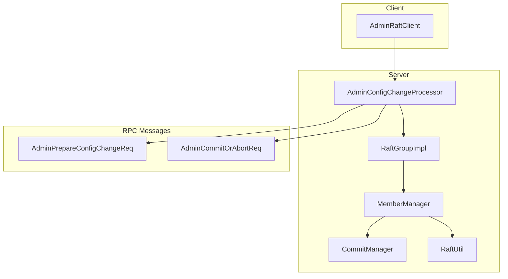
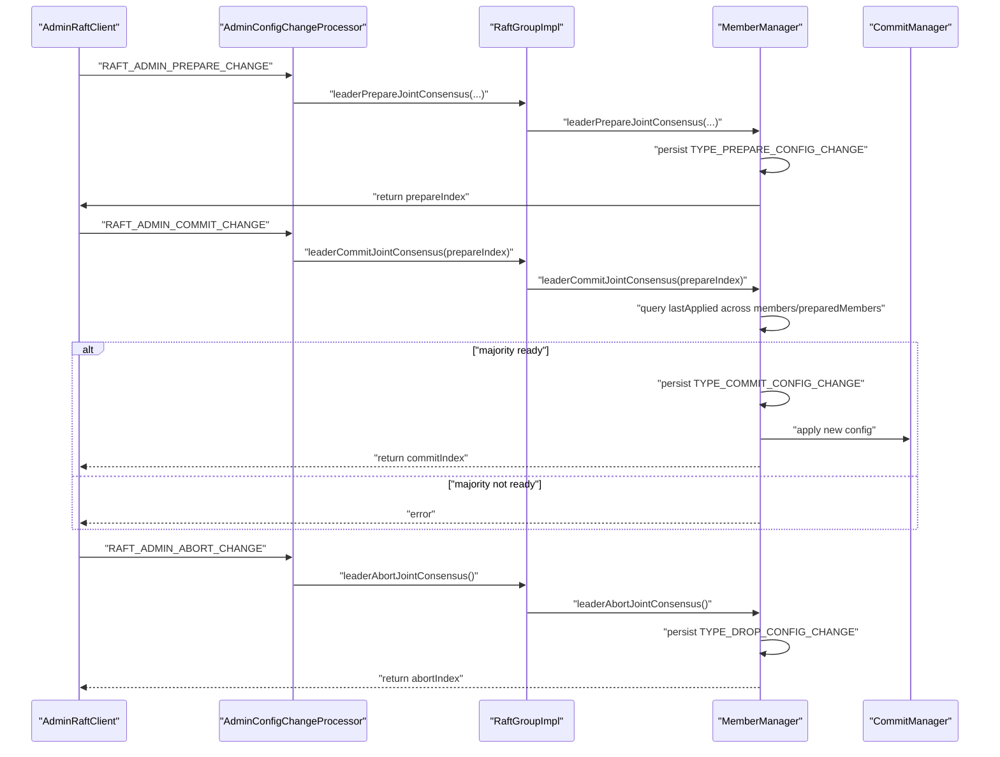
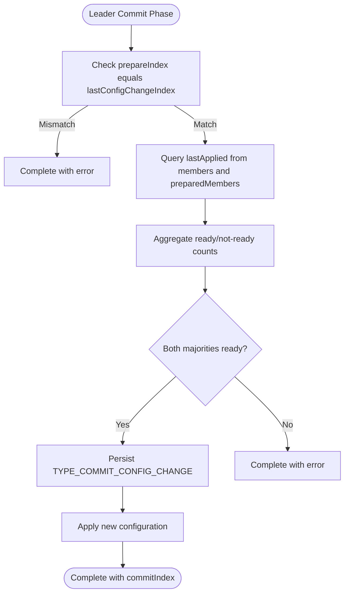
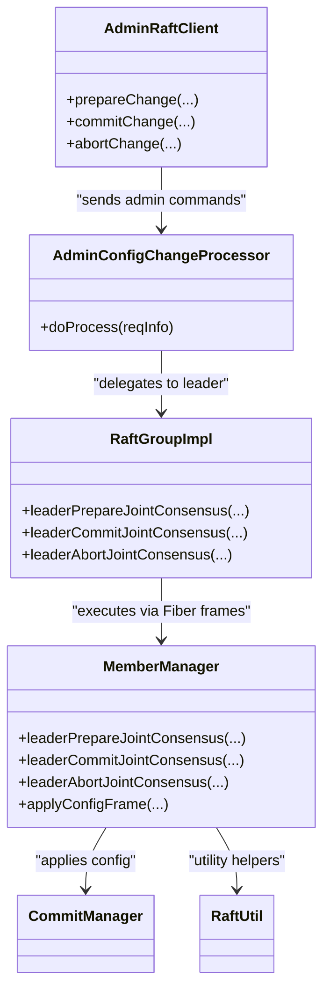

# Dynamic Membership Changes

<cite>
**Referenced Files in This Document**
- [AdminRaftClient.java](file://server/src/main/java/com/github/dtprj/dongting/raft/admin/AdminRaftClient.java)
- [AdminConfigChangeProcessor.java](file://server/src/main/java/com/github/dtprj/dongting/raft/rpc/AdminConfigChangeProcessor.java)
- [RaftGroupImpl.java](file://server/src/main/java/com/github/dtprj/dongting/raft/impl/RaftGroupImpl.java)
- [MemberManager.java](file://server/src/main/java/com/github/dtprj/dongting/raft/impl/MemberManager.java)
- [AdminPrepareConfigChangeReq.java](file://server/src/main/java/com/github/dtprj/dongting/raft/rpc/AdminPrepareConfigChangeReq.java)
- [AdminCommitOrAbortReq.java](file://server/src/main/java/com/github/dtprj/dongting/raft/rpc/AdminCommitOrAbortReq.java)
- [ChangeTo123Client.java](file://demos/src/main/java/com/github/dtprj/dongting/demos/configchange/ChangeTo123Client.java)
- [ChangeTo234Client.java](file://demos/src/main/java/com/github/dtprj/dongting/demos/configchange/ChangeTo234Client.java)
- [RaftUtil.java](file://server/src/main/java/com/github/dtprj/dongting/raft/impl/RaftUtil.java)
- [CommitManager.java](file://server/src/main/java/com/github/dtprj/dongting/raft/impl/CommitManager.java)
</cite>

## Table of Contents
1. [Introduction](#introduction)
2. [Project Structure](#project-structure)
3. [Core Components](#core-components)
4. [Architecture Overview](#architecture-overview)
5. [Detailed Component Analysis](#detailed-component-analysis)
6. [Dependency Analysis](#dependency-analysis)
7. [Performance Considerations](#performance-considerations)
8. [Troubleshooting Guide](#troubleshooting-guide)
9. [Conclusion](#conclusion)
10. [Appendices](#appendices)

## Introduction
This document explains the Dynamic Membership Changes feature in the RAFT cluster, focusing on the joint consensus algorithm for safe membership reconfiguration. It covers how administrative commands are processed to prepare, commit, and abort membership changes, and how the system prevents split-brain scenarios, maintains quorum safety, and handles network partitions during reconfiguration. The guide is structured for both beginners and experienced developers, with code-level references and diagrams mapped to actual source files.

## Project Structure
The dynamic membership change feature spans client-side administrative commands, server-side RPC processors, and internal RAFT group logic. The key modules are:
- Admin client API for issuing prepare/commit/abort requests
- RPC processor that validates and dispatches to the leader
- RAFT group implementation that exposes leaderPrepareJointConsensus, leaderCommitJointConsensus, leaderAbortJointConsensus
- MemberManager orchestrating the joint consensus lifecycle and applying configuration changes
- Request/response message types for administrative commands

**Diagram sources**
- [AdminRaftClient.java](file://server/src/main/java/com/github/dtprj/dongting/raft/admin/AdminRaftClient.java#L104-L155)
- [AdminConfigChangeProcessor.java](file://server/src/main/java/com/github/dtprj/dongting/raft/rpc/AdminConfigChangeProcessor.java#L45-L103)
- [RaftGroupImpl.java](file://server/src/main/java/com/github/dtprj/dongting/raft/impl/RaftGroupImpl.java#L182-L218)
- [MemberManager.java](file://server/src/main/java/com/github/dtprj/dongting/raft/impl/MemberManager.java#L339-L539)
- [AdminPrepareConfigChangeReq.java](file://server/src/main/java/com/github/dtprj/dongting/raft/rpc/AdminPrepareConfigChangeReq.java#L31-L112)
- [AdminCommitOrAbortReq.java](file://server/src/main/java/com/github/dtprj/dongting/raft/rpc/AdminCommitOrAbortReq.java#L27-L67)

**Section sources**
- [AdminRaftClient.java](file://server/src/main/java/com/github/dtprj/dongting/raft/admin/AdminRaftClient.java#L104-L155)
- [AdminConfigChangeProcessor.java](file://server/src/main/java/com/github/dtprj/dongting/raft/rpc/AdminConfigChangeProcessor.java#L45-L103)
- [RaftGroupImpl.java](file://server/src/main/java/com/github/dtprj/dongting/raft/impl/RaftGroupImpl.java#L182-L218)
- [MemberManager.java](file://server/src/main/java/com/github/dtprj/dongting/raft/impl/MemberManager.java#L339-L539)
- [AdminPrepareConfigChangeReq.java](file://server/src/main/java/com/github/dtprj/dongting/raft/rpc/AdminPrepareConfigChangeReq.java#L31-L112)
- [AdminCommitOrAbortReq.java](file://server/src/main/java/com/github/dtprj/dongting/raft/rpc/AdminCommitOrAbortReq.java#L27-L67)

## Core Components
- AdminRaftClient: Exposes prepareChange, commitChange, abortChange methods that send administrative commands to the cluster leader and return the resulting log index.
- AdminConfigChangeProcessor: Receives administrative commands, validates the target group, and delegates to RaftGroupImpl’s leader methods.
- RaftGroupImpl: Validates leadership and delegates to MemberManager to execute prepare/commit/abort operations.
- MemberManager: Implements the joint consensus algorithm, including preparing a pending configuration, verifying readiness across majorities, and applying the new configuration.
- RPC messages: AdminPrepareConfigChangeReq and AdminCommitOrAbortReq define the wire protocol for administrative commands.

Key implementation references:
- AdminRaftClient.prepareChange, commitChange, abortChange: [AdminRaftClient.java](file://server/src/main/java/com/github/dtprj/dongting/raft/admin/AdminRaftClient.java#L104-L155)
- AdminConfigChangeProcessor.doProcess: [AdminConfigChangeProcessor.java](file://server/src/main/java/com/github/dtprj/dongting/raft/rpc/AdminConfigChangeProcessor.java#L69-L103)
- RaftGroupImpl.leaderPrepareJointConsensus, leaderCommitJointConsensus, leaderAbortJointConsensus: [RaftGroupImpl.java](file://server/src/main/java/com/github/dtprj/dongting/raft/impl/RaftGroupImpl.java#L182-L218)
- MemberManager.prepare/commit/abort frames and applyConfigFrame: [MemberManager.java](file://server/src/main/java/com/github/dtprj/dongting/raft/impl/MemberManager.java#L339-L803)

**Section sources**
- [AdminRaftClient.java](file://server/src/main/java/com/github/dtprj/dongting/raft/admin/AdminRaftClient.java#L104-L155)
- [AdminConfigChangeProcessor.java](file://server/src/main/java/com/github/dtprj/dongting/raft/rpc/AdminConfigChangeProcessor.java#L69-L103)
- [RaftGroupImpl.java](file://server/src/main/java/com/github/dtprj/dongting/raft/impl/RaftGroupImpl.java#L182-L218)
- [MemberManager.java](file://server/src/main/java/com/github/dtprj/dongting/raft/impl/MemberManager.java#L339-L803)

## Architecture Overview
The dynamic membership change workflow follows a three-phase joint consensus:
1. Prepare: The leader persists a pending configuration and waits for readiness checks.
2. Commit: The leader verifies that all members and prepared members have applied the prepare index, then commits the new configuration.
3. Abort: The leader cancels a pending configuration change.

**Diagram sources**
- [AdminRaftClient.java](file://server/src/main/java/com/github/dtprj/dongting/raft/admin/AdminRaftClient.java#L104-L155)
- [AdminConfigChangeProcessor.java](file://server/src/main/java/com/github/dtprj/dongting/raft/rpc/AdminConfigChangeProcessor.java#L69-L103)
- [RaftGroupImpl.java](file://server/src/main/java/com/github/dtprj/dongting/raft/impl/RaftGroupImpl.java#L182-L218)
- [MemberManager.java](file://server/src/main/java/com/github/dtprj/dongting/raft/impl/MemberManager.java#L339-L539)
- [CommitManager.java](file://server/src/main/java/com/github/dtprj/dongting/raft/impl/CommitManager.java#L166-L195)

## Detailed Component Analysis

### AdminRaftClient: Administrative Command API
- prepareChange(groupId, oldMembers, oldObservers, newMembers, newObservers, timeout): Sends RAFT_ADMIN_PREPARE_CHANGE and returns the prepareIndex.
- commitChange(groupId, prepareIndex, timeout): Sends RAFT_ADMIN_COMMIT_CHANGE and returns the commitIndex.
- abortChange(groupId, timeout): Sends RAFT_ADMIN_ABORT_CHANGE and returns the abortIndex.

These methods encapsulate RPC sending and response decoding, and are idempotent as documented in the code.

**Section sources**
- [AdminRaftClient.java](file://server/src/main/java/com/github/dtprj/dongting/raft/admin/AdminRaftClient.java#L104-L155)

### AdminConfigChangeProcessor: RPC Dispatch and Validation
- Determines the target group from the request payload.
- Delegates to RaftGroupImpl.leaderPrepareJointConsensus, leaderCommitJointConsensus, or leaderAbortJointConsensus depending on the command.
- Handles errors (e.g., NotLeaderException) and writes appropriate responses.

**Section sources**
- [AdminConfigChangeProcessor.java](file://server/src/main/java/com/github/dtprj/dongting/raft/rpc/AdminConfigChangeProcessor.java#L45-L103)

### RaftGroupImpl: Leader Gatekeeping and Fiber Execution
- Validates that the group is initialized and running.
- Enforces that the caller is the leader for prepare/commit/abort operations.
- Uses MemberManager to execute the joint consensus operations via Fiber frames.

**Section sources**
- [RaftGroupImpl.java](file://server/src/main/java/com/github/dtprj/dongting/raft/impl/RaftGroupImpl.java#L182-L218)

### MemberManager: Joint Consensus Implementation
- Prepare phase:
  - Validates oldMembers and oldObservers match current configuration.
  - Persists TYPE_PREPARE_CONFIG_CHANGE with new member sets.
  - Issues a heartbeat and waits until prepareIndex+1 is applied to ensure consistency before commit.
- Commit phase:
  - Queries lastApplied from all members and preparedMembers.
  - Requires majority readiness from both current members and prepared members.
  - Persists TYPE_COMMIT_CONFIG_CHANGE and applies the new configuration atomically.
- Abort phase:
  - Persists TYPE_DROP_CONFIG_CHANGE to cancel a pending change.
- Apply phase:
  - Recomputes replicated lists, quorums, and roles.
  - Adjusts leader and replication fibers accordingly.

**Diagram sources**
- [MemberManager.java](file://server/src/main/java/com/github/dtprj/dongting/raft/impl/MemberManager.java#L383-L539)

**Section sources**
- [MemberManager.java](file://server/src/main/java/com/github/dtprj/dongting/raft/impl/MemberManager.java#L339-L539)

### RPC Messages: AdminPrepareConfigChangeReq and AdminCommitOrAbortReq
- AdminPrepareConfigChangeReq carries groupId, current members/observers, and proposed preparedMembers/preparedObservers.
- AdminCommitOrAbortReq carries groupId and prepareIndex for commit/abort.

**Section sources**
- [AdminPrepareConfigChangeReq.java](file://server/src/main/java/com/github/dtprj/dongting/raft/rpc/AdminPrepareConfigChangeReq.java#L31-L112)
- [AdminCommitOrAbortReq.java](file://server/src/main/java/com/github/dtprj/dongting/raft/rpc/AdminCommitOrAbortReq.java#L27-L67)

### Example Workflows from Demos
- ChangeTo123Client demonstrates changing membership from [2,3,4] to [1,2,3].
- ChangeTo234Client demonstrates changing membership from [1,2,3] to [2,3,4].

These demos show the recommended sequence: prepareChange, then commitChange, and optionally abortChange if needed.

**Section sources**
- [ChangeTo123Client.java](file://demos/src/main/java/com/github/dtprj/dongting/demos/configchange/ChangeTo123Client.java#L32-L71)
- [ChangeTo234Client.java](file://demos/src/main/java/com/github/dtprj/dongting/demos/configchange/ChangeTo234Client.java#L32-L71)

## Dependency Analysis
The following diagram shows the primary dependencies among components involved in dynamic membership changes:

**Diagram sources**
- [AdminRaftClient.java](file://server/src/main/java/com/github/dtprj/dongting/raft/admin/AdminRaftClient.java#L104-L155)
- [AdminConfigChangeProcessor.java](file://server/src/main/java/com/github/dtprj/dongting/raft/rpc/AdminConfigChangeProcessor.java#L69-L103)
- [RaftGroupImpl.java](file://server/src/main/java/com/github/dtprj/dongting/raft/impl/RaftGroupImpl.java#L182-L218)
- [MemberManager.java](file://server/src/main/java/com/github/dtprj/dongting/raft/impl/MemberManager.java#L339-L539)
- [CommitManager.java](file://server/src/main/java/com/github/dtprj/dongting/raft/impl/CommitManager.java#L166-L195)
- [RaftUtil.java](file://server/src/main/java/com/github/dtprj/dongting/raft/impl/RaftUtil.java#L72-L82)

**Section sources**
- [RaftUtil.java](file://server/src/main/java/com/github/dtprj/dongting/raft/impl/RaftUtil.java#L72-L82)
- [CommitManager.java](file://server/src/main/java/com/github/dtprj/dongting/raft/impl/CommitManager.java#L166-L195)

## Performance Considerations
- Idempotency: prepareChange, commitChange, and abortChange are designed to be idempotent, reducing operational complexity.
- Heartbeat and wait: After prepareIndex is applied, a heartbeat is issued and the system waits for prepareIndex+1 to be applied before committing, ensuring consistency across nodes.
- Quorum computation: The system computes elect and read/write quorums dynamically based on current membership sizes, adapting to changes.

[No sources needed since this section provides general guidance]

## Troubleshooting Guide
Common issues and resolutions:
- Old members/observers mismatch: The prepare phase validates that the provided oldMembers and oldObservers match the current configuration; mismatches cause immediate failure.
- Not leader: If the target node is not the leader, administrative commands fail with NotLeaderException.
- Prepare index mismatch: Commit phase requires that the prepareIndex equals lastConfigChangeIndex; otherwise, it fails early.
- Majority not ready: Commit requires both current members and prepared members to have applied the prepareIndex; otherwise, it fails with a readiness error.
- Node is both member and observer: The prepare phase rejects configurations where a node appears in both sets.
- Network partitions: During commit, the leader queries lastApplied from peers; failures are treated conservatively to avoid unsafe commits.
- Preventing split-brain: The joint consensus ensures that both sides of the transition (current and prepared) must reach agreement before applying changes, and the leader enforces quorum checks.

Operational tips:
- Always sequence operations: prepareChange, then commitChange; abortChange can be used to cancel a pending change.
- Use leader transfer when necessary to move administrative operations to the leader.
- Monitor logs for warnings and errors indicating readiness or configuration mismatches.

**Section sources**
- [MemberManager.java](file://server/src/main/java/com/github/dtprj/dongting/raft/impl/MemberManager.java#L339-L539)
- [AdminConfigChangeProcessor.java](file://server/src/main/java/com/github/dtprj/dongting/raft/rpc/AdminConfigChangeProcessor.java#L69-L103)

## Conclusion
The Dynamic Membership Changes feature implements a robust joint consensus algorithm that safely evolves RAFT cluster membership. Administrative commands are routed to the leader, validated, and executed through a multi-stage pipeline that ensures quorum safety and prevents split-brain scenarios. The design emphasizes idempotency, readiness checks, and careful application of configuration changes, with clear separation of concerns between client, RPC processor, group, and member management.

## Appendices

### Best Practices for Membership Changes
- Use observers for new nodes before promoting them to members to minimize disruption.
- Always verify the current membership and leader before initiating changes.
- Sequence operations carefully: prepare, then commit; abort if needed.
- Handle timeouts and transient failures gracefully; retry only after diagnosing root causes.

[No sources needed since this section provides general guidance]