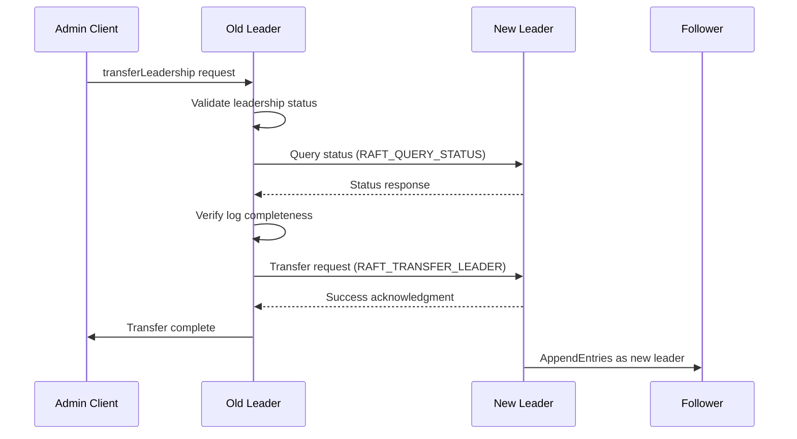
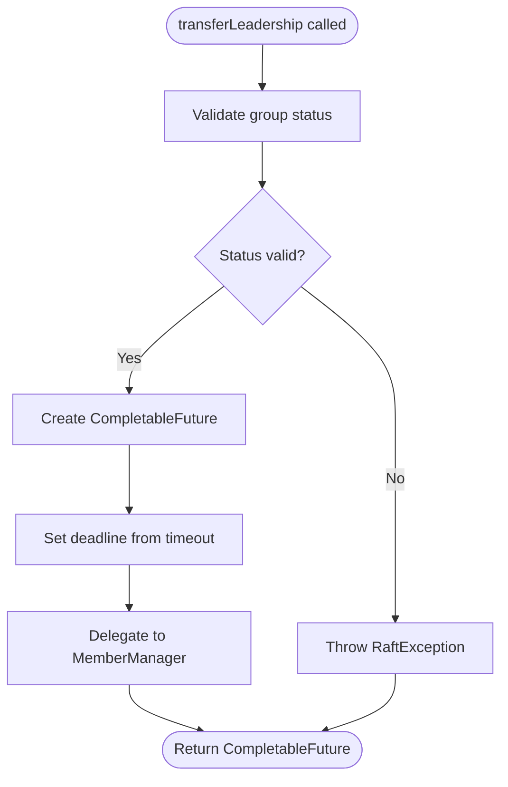
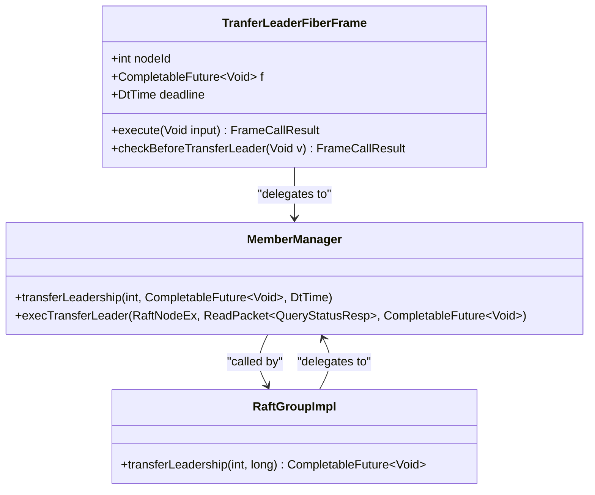

# Leadership Control

<cite>
**Referenced Files in This Document**   
- [AdminTransferLeaderProcessor.java](file://server/src/main/java/com/github/dtprj/dongting/raft/rpc/AdminTransferLeaderProcessor.java)
- [RaftGroupImpl.java](file://server/src/main/java/com/github/dtprj/dongting/raft/impl/RaftGroupImpl.java)
- [AdminRaftClient.java](file://server/src/main/java/com/github/dtprj/dongting/raft/admin/AdminRaftClient.java)
- [TransferLeaderProcessor.java](file://server/src/main/java/com/github/dtprj/dongting/raft/rpc/TransferLeaderProcessor.java)
- [TransferLeaderReq.java](file://server/src/main/java/com/github/dtprj/dongting/raft/rpc/TransferLeaderReq.java)
- [MemberManager.java](file://server/src/main/java/com/github/dtprj/dongting/raft/impl/MemberManager.java)
- [RaftStatusImpl.java](file://server/src/main/java/com/github/dtprj/dongting/raft/impl/RaftStatusImpl.java)
- [VoteManager.java](file://server/src/main/java/com/github/dtprj/dongting/raft/impl/VoteManager.java)
- [ApplyManager.java](file://server/src/main/java/com/github/dtprj/dongting/raft/impl/ApplyManager.java)
</cite>

## Table of Contents
1. [Introduction](#introduction)
2. [Leadership Transfer Mechanisms](#leadership-transfer-mechanisms)
3. [AdminTransferLeaderProcessor Role](#admintransferleaderprocessor-role)
4. [transferLeadership Method in RaftGroupImpl](#transferleadership-method-in-raftgroupimpl)
5. [transferLeader Method in AdminRaftClient](#transferleader-method-in-adminraftclient)
6. [Fiber-Based Execution Model](#fiber-based-execution-model)
7. [Term Management and Cluster Stability](#term-management-and-cluster-stability)
8. [Common Issues and Best Practices](#common-issues-and-best-practices)
9. [Conclusion](#conclusion)

## Introduction
The Dongting RAFT implementation provides robust mechanisms for leadership control within a distributed cluster. This document details the processes for transferring leadership between nodes, covering both automatic leader election and manual transfer operations. The system ensures high availability and consistency through careful coordination of term management, log replication, and state machine application. The fiber-based execution model enables efficient, non-blocking operations while maintaining the correctness guarantees required by the RAFT consensus algorithm.

**Section sources**
- [AdminTransferLeaderProcessor.java](file://server/src/main/java/com/github/dtprj/dongting/raft/rpc/AdminTransferLeaderProcessor.java#L1-L81)
- [RaftGroupImpl.java](file://server/src/main/java/com/github/dtprj/dongting/raft/impl/RaftGroupImpl.java#L1-L220)

## Leadership Transfer Mechanisms
Leadership transfer in the Dongting RAFT implementation occurs through two primary mechanisms: automatic leader election and manual leadership transfer. Automatic leader election is triggered when a follower node detects leader inactivity through timeout mechanisms, initiating a pre-vote and vote process to establish new leadership. Manual leadership transfer allows administrators to proactively move leadership to a specific node, which is particularly useful for planned maintenance, load balancing, or optimizing network topology.

The leadership transfer process ensures that the new leader has caught up with the current log state before assuming leadership. This is verified through multiple checks including log index comparison, term validation, and persistence status verification. The system prevents split-brain scenarios by requiring quorum agreement during leadership changes and maintaining strict term progression rules. During transfer, the outgoing leader ensures all pending operations are committed before handing over responsibility to the new leader.

**Diagram sources **
- [AdminRaftClient.java](file://server/src/main/java/com/github/dtprj/dongting/raft/admin/AdminRaftClient.java#L72-L102)
- [MemberManager.java](file://server/src/main/java/com/github/dtprj/dongting/raft/impl/MemberManager.java#L868-L1008)
- [TransferLeaderProcessor.java](file://server/src/main/java/com/github/dtprj/dongting/raft/rpc/TransferLeaderProcessor.java#L36-L99)

## AdminTransferLeaderProcessor Role
The AdminTransferLeaderProcessor handles leadership transfer requests from administrative clients. It validates that the requesting node is indeed the current leader by comparing the oldLeaderId parameter with the local node ID. Upon validation, it delegates the transfer operation to the RaftGroup's transferLeadership method, passing the target node ID and timeout duration.

The processor operates asynchronously, returning immediately while the transfer operation executes in the background. It uses CompletableFuture to manage the asynchronous operation, with callbacks to handle success and failure scenarios. On success, it logs the completion and sends a success response to the client. On failure, it logs the error details and returns an appropriate error response. This design ensures that administrative operations do not block the main processing threads while providing proper error handling and feedback.

**Section sources**
- [AdminTransferLeaderProcessor.java](file://server/src/main/java/com/github/dtprj/dongting/raft/rpc/AdminTransferLeaderProcessor.java#L37-L72)

## transferLeadership Method in RaftGroupImpl
The transferLeadership method in RaftGroupImpl serves as the entry point for leadership transfer operations. It performs initial validation by checking the group's initialization status and operational state. If the group is not properly initialized or is marked for shutdown, the method throws a RaftException to prevent invalid operations.

After validation, the method creates a CompletableFuture to represent the asynchronous transfer operation and delegates the actual work to MemberManager's transferLeadership method. It passes the target node ID, the future object for completion signaling, and a deadline calculated from the specified timeout. This delegation pattern separates the high-level API interface from the implementation details, allowing for cleaner code organization and easier maintenance.

**Diagram sources **
- [RaftGroupImpl.java](file://server/src/main/java/com/github/dtprj/dongting/raft/impl/RaftGroupImpl.java#L163-L170)

## transferLeader Method in AdminRaftClient
The transferLeader method in AdminRaftClient provides the client-side interface for initiating leadership transfers. It first validates that the old and new leader IDs are different, preventing accidental self-transfer requests. The method then uses updateLeaderInfo to discover the current leader, ensuring the operation targets the correct node.

After leader discovery, the method validates that the new leader is a member of the cluster by checking the server list. It constructs a TransferLeaderReq message containing the group ID, old leader ID, new leader ID, and other relevant information. The request is packaged in a SimpleWritePacket with the RAFT_ADMIN_TRANSFER_LEADER command code and sent to the current leader using the NIO client. The method returns a CompletableFuture that completes when the transfer operation succeeds or fails, enabling asynchronous handling of the operation result.

**Section sources**
- [AdminRaftClient.java](file://server/src/main/java/com/github/dtprj/dongting/raft/admin/AdminRaftClient.java#L72-L102)

## Fiber-Based Execution Model
The Dongting RAFT implementation uses a fiber-based execution model to handle leadership transfer operations efficiently. Fibers are lightweight, cooperative threads that enable high concurrency without the overhead of traditional OS threads. The transferLeadership operation executes within a dedicated fiber, allowing it to perform blocking operations like network I/O without affecting other cluster operations.

The execution flow begins with the TranferLeaderFiberFrame, which performs initial validation checks including leadership status, node membership, and timeout conditions. The fiber uses sleep operations with continuation callbacks to periodically recheck conditions without busy-waiting. When conditions are met, it proceeds with the transfer by sending a query request to verify the target node's status, then initiates the actual transfer process.

This model provides several advantages: it prevents resource exhaustion from too many concurrent operations, enables fine-grained control over execution flow, and simplifies error handling through structured exception management. The fiber scheduler ensures fair execution among multiple pending operations, maintaining system responsiveness even under heavy load.

**Diagram sources **
- [MemberManager.java](file://server/src/main/java/com/github/dtprj/dongting/raft/impl/MemberManager.java#L876-L963)
- [RaftGroupImpl.java](file://server/src/main/java/com/github/dtprj/dongting/raft/impl/RaftGroupImpl.java#L163-L170)

## Term Management and Cluster Stability
Term management plays a critical role in maintaining cluster stability during leadership transfers. Each leadership term is strictly increasing, preventing stale leaders from disrupting the cluster. During a transfer, the outgoing leader ensures its term remains current until the handover is complete. The new leader inherits the current term rather than incrementing it, maintaining continuity in the cluster's logical timeline.

The system prevents unnecessary leadership changes by requiring the target node to have the most up-to-date log entries before accepting leadership. This is verified through multiple mechanisms: the matchIndex comparison ensures the follower has replicated all log entries, the commitIndex check confirms all entries are committed, and the persistence verification ensures data durability. These checks prevent leadership transfers to nodes that might cause log divergence or data loss.

Cluster stability is further enhanced through lease-based leadership, where the leader maintains a lease period during which it can serve read requests without contacting other nodes. This reduces network overhead while maintaining consistency. The lease duration is dynamically adjusted based on cluster conditions, balancing performance and fault detection speed.

**Section sources**
- [RaftStatusImpl.java](file://server/src/main/java/com/github/dtprj/dongting/raft/impl/RaftStatusImpl.java#L65-L70)
- [VoteManager.java](file://server/src/main/java/com/github/dtprj/dongting/raft/impl/VoteManager.java#L43-L492)
- [ApplyManager.java](file://server/src/main/java/com/github/dtprj/dongting/raft/impl/ApplyManager.java#L1-L548)

## Common Issues and Best Practices
Several common issues can arise during leadership transfer operations. Transfer failures may occur due to network partitions, node failures, or configuration mismatches between cluster members. The system handles these by implementing timeout mechanisms and retry logic, with appropriate error reporting to facilitate troubleshooting.

To avoid unnecessary leadership changes, the system implements several safeguards: it verifies the target node's readiness, checks log completeness, and confirms configuration consistency before proceeding with a transfer. These checks prevent transfers to nodes that might not be able to maintain cluster stability.

Best practices for leadership transfer include performing transfers during periods of low activity to minimize disruption, ensuring adequate network connectivity between nodes, and monitoring the transfer process for any signs of issues. Manual transfers should be preferred over automatic elections when possible, as they allow for more controlled and predictable cluster behavior. Administrators should also ensure that the target node has sufficient resources and is properly configured before initiating a transfer.

For optimal performance, leadership should be transferred to nodes with the lowest network latency to the majority of clients, reducing request-response times. Regular monitoring of leadership stability metrics can help identify patterns that might indicate underlying issues with the cluster configuration or network infrastructure.

**Section sources**
- [TransferLeaderProcessor.java](file://server/src/main/java/com/github/dtprj/dongting/raft/rpc/TransferLeaderProcessor.java#L55-L84)
- [MemberManager.java](file://server/src/main/java/com/github/dtprj/dongting/raft/impl/MemberManager.java#L942-L961)
- [RaftStatusImpl.java](file://server/src/main/java/com/github/dtprj/dongting/raft/impl/RaftStatusImpl.java#L176-L185)

## Conclusion
The Dongting RAFT implementation provides a comprehensive and robust framework for leadership control in distributed systems. Through a combination of automatic election mechanisms and manual transfer capabilities, it ensures high availability and consistent cluster operation. The fiber-based execution model enables efficient handling of leadership operations without compromising system responsiveness.

The careful integration of term management, log verification, and configuration consistency checks ensures that leadership transfers maintain cluster stability and data integrity. By following best practices and understanding the underlying mechanisms, administrators can effectively manage cluster leadership to optimize performance and reliability.

The system's design balances the need for automated fault recovery with the benefits of controlled manual intervention, providing flexibility for different operational scenarios. As distributed systems continue to grow in complexity, the principles demonstrated in this implementation offer valuable insights for building reliable and maintainable consensus-based applications.