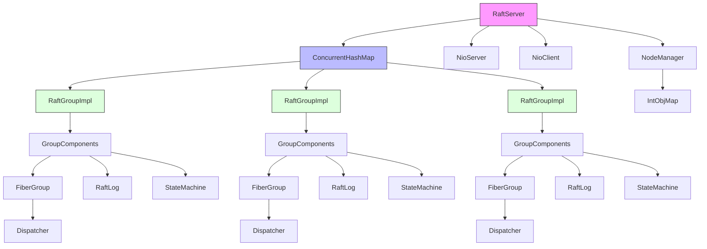
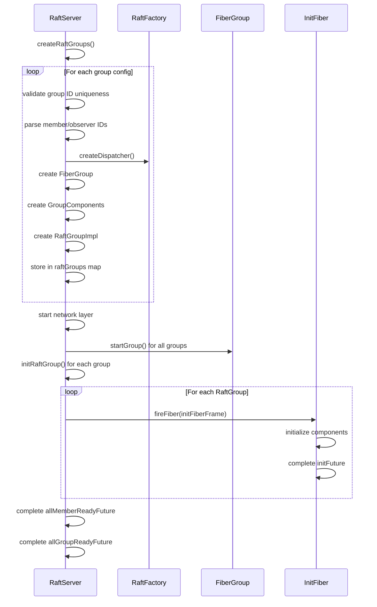
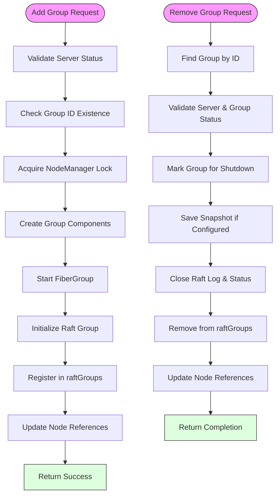
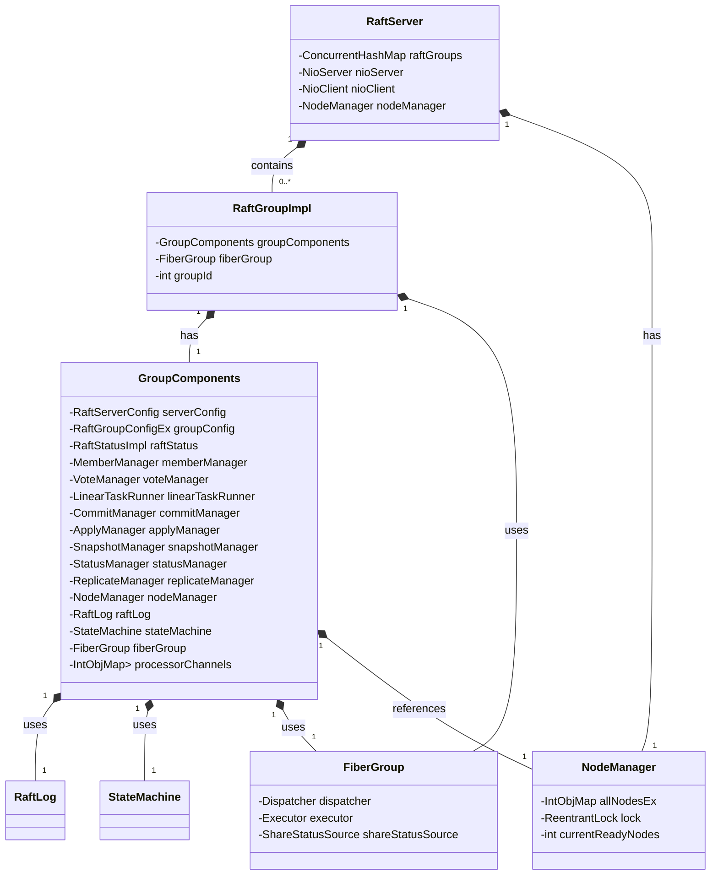
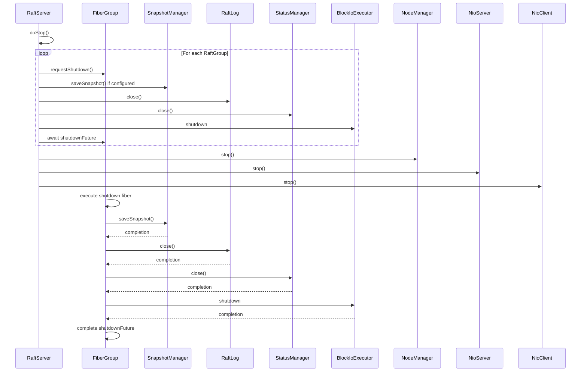
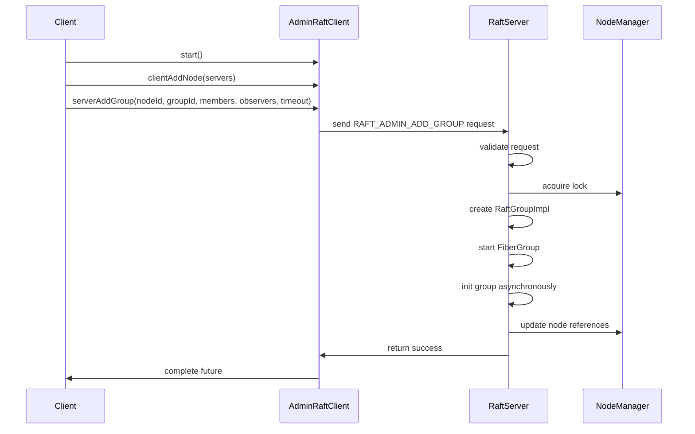

# Multi-RAFT Groups

<cite>
**Referenced Files in This Document**   
- [RaftServer.java](file://server/src/main/java/com/github/dtprj/dongting/raft/server/RaftServer.java)
- [RaftGroupImpl.java](file://server/src/main/java/com/github/dtprj/dongting/raft/impl/RaftGroupImpl.java)
- [NodeManager.java](file://server/src/main/java/com/github/dtprj/dongting/raft/impl/NodeManager.java)
- [RaftGroupConfig.java](file://server/src/main/java/com/github/dtprj/dongting/raft/server/RaftGroupConfig.java)
- [RaftGroupConfigEx.java](file://server/src/main/java/com/github/dtprj/dongting/raft/server/RaftGroupConfigEx.java)
- [GroupComponents.java](file://server/src/main/java/com/github/dtprj/dongting/raft/impl/GroupComponents.java)
- [AdminGroupAndNodeProcessor.java](file://server/src/main/java/com/github/dtprj/dongting/raft/rpc/AdminGroupAndNodeProcessor.java)
- [AddGroup103Demo.java](file://demos/src/main/java/com/github/dtprj/dongting/demos/multiraft/AddGroup103Demo.java)
- [RemoveGroup103Demo.java](file://demos/src/main/java/com/github/dtprj/dongting/demos/multiraft/RemoveGroup103Demo.java)
- [MultiRaftTest.java](file://server/src/test/java/com/github/dtprj/dongting/raft/server/MultiRaftTest.java)
</cite>

## Table of Contents
1. [Introduction](#introduction)
2. [Architecture Overview](#architecture-overview)
3. [Core Components](#core-components)
4. [Initialization Process](#initialization-process)
5. [Dynamic Group Management](#dynamic-group-management)
6. [Resource Isolation and Scheduling](#resource-isolation-and-scheduling)
7. [Lifecycle Management](#lifecycle-management)
8. [Error Handling and Common Issues](#error-handling-and-common-issues)
9. [Example Usage](#example-usage)
10. [Conclusion](#conclusion)

## Introduction

The Multi-RAFT Groups feature enables a single RaftServer process to manage multiple independent RAFT consensus groups simultaneously. This architecture allows for efficient resource utilization while maintaining strong consistency guarantees for each group. The implementation provides mechanisms for dynamic group creation and removal, proper resource isolation, and coordinated lifecycle management. This document explains the design and operation of this feature, focusing on the RaftServer class's role in managing multiple RAFT groups through its ConcurrentHashMap<Integer, RaftGroupImpl> raftGroups field and related methods.

**Section sources**
- [RaftServer.java](file://server/src/main/java/com/github/dtprj/dongting/raft/server/RaftServer.java#L93)
- [RaftGroupImpl.java](file://server/src/main/java/com/github/dtprj/dongting/raft/impl/RaftGroupImpl.java#L46)

## Architecture Overview

The Multi-RAFT Groups architecture centers around the RaftServer class, which acts as a container for multiple independent RAFT consensus groups. Each group operates as a self-contained unit with its own state machine, log storage, and network communication, while sharing common infrastructure components like the network I/O layer and node management.

**Diagram sources**
- [RaftServer.java](file://server/src/main/java/com/github/dtprj/dongting/raft/server/RaftServer.java#L93)
- [RaftGroupImpl.java](file://server/src/main/java/com/github/dtprj/dongting/raft/impl/RaftGroupImpl.java#L46)
- [GroupComponents.java](file://server/src/main/java/com/github/dtprj/dongting/raft/impl/GroupComponents.java#L31)

## Core Components

The Multi-RAFT Groups implementation relies on several key components that work together to manage multiple consensus groups within a single process. The RaftServer class maintains a ConcurrentHashMap<Integer, RaftGroupImpl> field named raftGroups, which serves as the central registry for all active RAFT groups, indexed by their unique group IDs.

Each RaftGroupImpl instance encapsulates a complete RAFT consensus group with its own GroupComponents, which include essential services like MemberManager, VoteManager, CommitManager, ApplyManager, and ReplicateManager. These components are isolated per group to prevent interference between different consensus groups. The GroupComponents also contain references to shared resources like the NodeManager, which coordinates network connectivity across all groups.

Resource isolation is achieved through dedicated FiberGroup instances for each RAFT group, ensuring that fiber scheduling and execution are isolated. Each group has its own Dispatcher for managing fiber execution, preventing one group's processing load from affecting others. The state machine and log storage are completely independent for each group, maintaining data isolation.

**Section sources**
- [RaftServer.java](file://server/src/main/java/com/github/dtprj/dongting/raft/server/RaftServer.java#L93)
- [RaftGroupImpl.java](file://server/src/main/java/com/github/dtprj/dongting/raft/impl/RaftGroupImpl.java#L46)
- [GroupComponents.java](file://server/src/main/java/com/github/dtprj/dongting/raft/impl/GroupComponents.java#L31)

## Initialization Process

The initialization of multiple RAFT groups occurs during the RaftServer startup process. When the RaftServer is constructed with a list of RaftGroupConfig objects, it calls the createRaftGroups method to instantiate each group. This method validates that no duplicate group IDs exist and creates a RaftGroupImpl instance for each configuration.

During group creation, the system performs several critical validation steps: it checks that all member node IDs specified in the configuration exist in the server list, ensures no node appears as both a member and observer, and verifies that the current node is either a member or observer of the group. For each group, a dedicated FiberGroup is created with a dispatcher obtained from the RaftFactory, providing isolated fiber scheduling.

The initialization sequence follows a coordinated process: first, the network layer (NioServer and NioClient) is started; then, all FiberGroups are initialized and started; finally, each RaftGroup undergoes asynchronous initialization in its dedicated fiber context. The system uses CompletableFuture chains to coordinate these phases, ensuring proper sequencing. The allMemberReadyFuture and allGroupReadyFuture completable futures track the completion of member connectivity checks and group readiness, respectively.

**Diagram sources**
- [RaftServer.java](file://server/src/main/java/com/github/dtprj/dongting/raft/server/RaftServer.java#L212)
- [RaftServer.java](file://server/src/main/java/com/github/dtprj/dongting/raft/server/RaftServer.java#L330)
- [RaftGroupImpl.java](file://server/src/main/java/com/github/dtprj/dongting/raft/impl/RaftGroupImpl.java#L53)

## Dynamic Group Management

The Multi-RAFT Groups feature supports dynamic addition and removal of groups through the addGroup and removeGroup methods of the RaftServer class. These administrative operations allow runtime modification of the consensus topology without requiring a server restart.

The addGroup method performs comprehensive validation before creating a new group: it checks that the server is running, verifies the group ID doesn't already exist, and ensures all specified member nodes are known to the NodeManager. The operation acquires a lock on the NodeManager to safely update node reference counts, incrementing the use count for nodes that will participate in the new group. After creating the RaftGroupImpl instance, it starts the associated FiberGroup and initiates asynchronous initialization.

The removeGroup method follows a graceful shutdown sequence: it first marks the group for shutdown, then saves a snapshot if configured, closes the raft log and status manager, and finally removes the group from the raftGroups map. The operation decrements node reference counts in the NodeManager, allowing nodes to be removed when no longer needed by any group. The method is idempotent, returning a completed future if the group doesn't exist.

Administrative operations are exposed through the AdminGroupAndNodeProcessor, which handles RPC requests for group management. This processor validates requests, delegates to the appropriate RaftServer methods, and returns responses through the network layer. The design ensures that administrative operations are coordinated across the cluster, with each node performing the same group management actions.

**Diagram sources**
- [RaftServer.java](file://server/src/main/java/com/github/dtprj/dongting/raft/server/RaftServer.java#L572)
- [RaftServer.java](file://server/src/main/java/com/github/dtprj/dongting/raft/server/RaftServer.java#L631)
- [AdminGroupAndNodeProcessor.java](file://server/src/main/java/com/github/dtprj/dongting/raft/rpc/AdminGroupAndNodeProcessor.java#L42)

## Resource Isolation and Scheduling

Resource isolation in the Multi-RAFT Groups implementation is achieved through several mechanisms that ensure independent operation of each consensus group. The primary isolation boundary is the FiberGroup, which provides a dedicated scheduling context for each RAFT group's fibers. This prevents one group's processing load from affecting the responsiveness of others.

Each RaftGroupImpl has its own GroupComponents instance containing references to group-specific resources like the RaftLog, StateMachine, and various managers (ApplyManager, CommitManager, etc.). These components operate independently, with their own state and processing queues. The FiberGroup associated with each group manages a dedicated executor for blocking I/O operations, configured through the RaftFactory's createBlockIoExecutor method.

Network I/O is shared at the transport level through the NioServer and NioClient instances, but message routing is group-specific. The NodeManager maintains connectivity to all cluster nodes and manages reference counting for node usage across groups. When multiple groups use the same node, the NodeManager ensures the network connection remains active as long as at least one group needs it.

Memory resources are isolated through separate object pools and caches for each group. The TailCache, for example, is created per RaftStatusImpl instance, ensuring log entry caching doesn't interfere between groups. Similarly, the processorChannels in GroupComponents provide isolated communication channels for different message types within each group.

**Diagram sources**
- [RaftServer.java](file://server/src/main/java/com/github/dtprj/dongting/raft/server/RaftServer.java#L93)
- [RaftGroupImpl.java](file://server/src/main/java/com/github/dtprj/dongting/raft/impl/RaftGroupImpl.java#L46)
- [GroupComponents.java](file://server/src/main/java/com/github/dtprj/dongting/raft/impl/GroupComponents.java#L31)
- [NodeManager.java](file://server/src/main/java/com/github/dtprj/dongting/raft/impl/NodeManager.java#L55)

## Lifecycle Management

Lifecycle management for Multi-RAFT Groups follows a coordinated shutdown sequence that ensures proper cleanup of resources and persistence of state. When the RaftServer is stopped, it initiates a graceful shutdown of all groups in parallel, using CompletableFuture chains to coordinate the process.

The stopGroup method handles the shutdown sequence for individual groups: it first requests shutdown of the FiberGroup, then saves a snapshot if configured, closes the raft log, cleans up the tail cache, closes the status manager, and finally shuts down the block I/O executor. Each step is performed asynchronously within the group's fiber context, ensuring proper sequencing without blocking the main thread.

During shutdown, the system maintains proper ordering: resource cleanup occurs in reverse order of initialization, with higher-level components shutting down before their dependencies. The FiberGroup shutdown is initiated first, but the actual completion waits for all pending fibers to finish. This ensures that no new operations are accepted while allowing in-progress operations to complete gracefully.

The NodeManager plays a crucial role in lifecycle management by tracking node usage across groups. When a group is removed, the node reference counts are decremented, but the network connections remain active as long as other groups need them. This reference counting mechanism prevents premature disconnection of nodes that are still in use by other consensus groups.

**Diagram sources**
- [RaftServer.java](file://server/src/main/java/com/github/dtprj/dongting/raft/server/RaftServer.java#L476)
- [RaftServer.java](file://server/src/main/java/com/github/dtprj/dongting/raft/server/RaftServer.java#L504)
- [RaftGroupImpl.java](file://server/src/main/java/com/github/dtprj/dongting/raft/impl/RaftGroupImpl.java#L53)

## Error Handling and Common Issues

The Multi-RAFT Groups implementation includes comprehensive error handling for common issues that may arise during operation. Group ID conflicts are prevented during both initial configuration and dynamic group creation by validating that no duplicate IDs exist in the raftGroups map. The system throws IllegalArgumentException for duplicate IDs during startup and RaftException when attempting to add an already-existing group.

Membership validation is performed at multiple levels: during configuration parsing, the system verifies that all specified member node IDs exist in the server list and that no node appears as both member and observer. The NodeManager's checkNodeIdSet method ensures that nodes referenced in configuration actually exist, throwing RaftException if validation fails.

Proper shutdown sequencing is enforced through the use of CompletableFuture chains and fiber coordination. The system prevents race conditions during group removal by using the NodeManager's lock to atomically update node reference counts. When removing a group, the system first marks it for shutdown, ensuring no new operations are accepted, before proceeding with resource cleanup.

Common issues are addressed through specific mechanisms: group ID conflicts are handled by validation checks, membership validation is performed through comprehensive node ID verification, and proper shutdown sequencing is ensured through coordinated futures and fiber execution. The system also handles edge cases like attempting to remove a non-existent group (treated as success) or removing a node that is still in use by other groups (fails with appropriate exception).

**Section sources**
- [RaftServer.java](file://server/src/main/java/com/github/dtprj/dongting/raft/server/RaftServer.java#L215)
- [RaftServer.java](file://server/src/main/java/com/github/dtprj/dongting/raft/server/RaftServer.java#L579)
- [NodeManager.java](file://server/src/main/java/com/github/dtprj/dongting/raft/impl/NodeManager.java#L279)

## Example Usage

The Multi-RAFT Groups feature can be used programmatically through the RaftServer's administrative API or via demonstration code provided in the demos directory. The AddGroup103Demo and RemoveGroup103Demo classes illustrate how to dynamically add and remove groups using the AdminRaftClient.

To add a group, clients create an AdminRaftClient, connect to the cluster nodes, and call serverAddGroup with the target node ID, group ID, member list, and timeout. The operation must be performed on all relevant nodes to ensure consistency. Similarly, group removal is accomplished through the serverRemoveGroup method, which gracefully shuts down the group and releases its resources.

The MultiRaftTest class provides a comprehensive example of multi-group operation, demonstrating group creation, leadership election, data operations on multiple groups, and group removal. The test verifies that multiple groups can coexist and operate independently within the same RaftServer instance.

For programmatic use, the RaftServer's addGroup and removeGroup methods can be called directly. The addGroup method accepts a RaftGroupConfig object specifying the group ID, member nodes, and observer nodes. The removeGroup method requires the group ID and optional parameters for snapshot preservation and shutdown timeout.

**Diagram sources**
- [AddGroup103Demo.java](file://demos/src/main/java/com/github/dtprj/dongting/demos/multiraft/AddGroup103Demo.java#L27)
- [RemoveGroup103Demo.java](file://demos/src/main/java/com/github/dtprj/dongting/demos/multiraft/RemoveGroup103Demo.java#L27)
- [MultiRaftTest.java](file://server/src/test/java/com/github/dtprj/dongting/raft/server/MultiRaftTest.java#L35)

## Conclusion

The Multi-RAFT Groups feature provides a robust mechanism for managing multiple independent RAFT consensus groups within a single process. Through the RaftServer's ConcurrentHashMap<Integer, RaftGroupImpl> raftGroups field and associated methods, the system enables efficient resource utilization while maintaining strong isolation between groups. The implementation supports dynamic group management, proper resource isolation through dedicated FiberGroups, and coordinated lifecycle management.

Key strengths of the design include comprehensive validation to prevent configuration errors, reference counting to manage shared network resources, and asynchronous initialization and shutdown sequences that ensure proper sequencing without blocking. The architecture balances efficiency with safety, allowing multiple consensus groups to coexist while preventing interference between them.

For developers, the feature provides a clean API for group management through both RPC interfaces and direct method calls. The system handles common issues like group ID conflicts and membership validation, providing clear error messages when problems occur. The combination of the RaftServer, RaftGroupImpl, and supporting components creates a flexible and reliable foundation for building distributed systems with multiple consensus domains.

**Section sources**
- [RaftServer.java](file://server/src/main/java/com/github/dtprj/dongting/raft/server/RaftServer.java#L84)
- [RaftGroupImpl.java](file://server/src/main/java/com/github/dtprj/dongting/raft/impl/RaftGroupImpl.java#L43)
- [MultiRaftTest.java](file://server/src/test/java/com/github/dtprj/dongting/raft/server/MultiRaftTest.java#L35)