# RAFT Consensus Implementation

<cite>
**Referenced Files in This Document**   
- [RaftServer.java](file://server/src/main/java/com/github/dtprj/dongting/raft/server/RaftServer.java)
- [RaftGroup.java](file://server/src/main/java/com/github/dtprj/dongting/raft/server/RaftGroup.java)
- [RaftGroupImpl.java](file://server/src/main/java/com/github/dtprj/dongting/raft/impl/RaftGroupImpl.java)
- [AdminRaftClient.java](file://server/src/main/java/com/github/dtprj/dongting/raft/admin/AdminRaftClient.java)
- [AdminConfigChangeProcessor.java](file://server/src/main/java/com/github/dtprj/dongting/raft/rpc/AdminConfigChangeProcessor.java)
- [VoteManager.java](file://server/src/main/java/com/github/dtprj/dongting/raft/impl/VoteManager.java)
- [ReplicateManager.java](file://server/src/main/java/com/github/dtprj/dongting/raft/impl/ReplicateManager.java)
- [ApplyManager.java](file://server/src/main/java/com/github/dtprj/dongting/raft/impl/ApplyManager.java)
- [CommitManager.java](file://server/src/main/java/com/github/dtprj/dongting/raft/impl/CommitManager.java)
- [RaftLog.java](file://server/src/main/java/com/github/dtprj/dongting/raft/store/RaftLog.java)
- [RaftServerConfig.java](file://server/src/main/java/com/github/dtprj/dongting/raft/server/RaftServerConfig.java)
- [RaftGroupConfig.java](file://server/src/main/java/com/github/dtprj/dongting/raft/server/RaftGroupConfig.java)
- [MemberManager.java](file://server/src/main/java/com/github/dtprj/dongting/raft/impl/MemberManager.java)
- [StateMachine.java](file://server/src/main/java/com/github/dtprj/dongting/raft/sm/StateMachine.java)
- [StatusManager.java](file://server/src/main/java/com/github/dtprj/dongting/raft/store/StatusManager.java)
</cite>

## Table of Contents
1. [Introduction](#introduction)
2. [Project Structure](#project-structure)
3. [Core Components](#core-components)
4. [Architecture Overview](#architecture-overview)
5. [Detailed Component Analysis](#detailed-component-analysis)
6. [Dependency Analysis](#dependency-analysis)
7. [Performance Considerations](#performance-considerations)
8. [Troubleshooting Guide](#troubleshooting-guide)
9. [Conclusion](#conclusion)

## Introduction
The Dongting RAFT consensus implementation provides a robust distributed consensus algorithm with support for multiple RAFT groups within a single process. This document details the core RAFT algorithm implementation including leader election, log replication, and safety mechanisms. It covers dynamic membership changes using joint consensus, configuration management, group lifecycle operations, leadership transfer, and the relationship between RAFT log, state machine (DtKV), and snapshotting.

## Project Structure
The Dongting project is organized into several key modules:
- **benchmark**: Performance testing components
- **client**: Client-side implementations including buffer management, codecs, and network utilities
- **demos**: Example applications demonstrating various use cases
- **server**: Core RAFT consensus implementation and state machine
- **it-test**: Integration tests
- **report**: Reporting utilities
- **test-support**: Testing utilities and helpers

The RAFT consensus implementation is primarily located in the server module under `com.github.dtprj.dongting.raft`, with key components organized into subpackages for server, implementation, RPC, store, and state machine functionality.

## Core Components
The core components of the Dongting RAFT implementation include the RaftServer, RaftGroup, and associated managers for vote, replication, application, and commit operations. The system supports multiple RAFT groups within a single process, with each group maintaining its own state and participating in consensus independently.

**Section sources**
- [RaftServer.java](file://server/src/main/java/com/github/dtprj/dongting/raft/server/RaftServer.java#L1-L718)
- [RaftGroup.java](file://server/src/main/java/com/github/dtprj/dongting/raft/server/RaftGroup.java#L1-L106)

## Architecture Overview

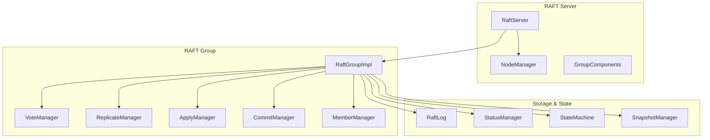

**Diagram sources**
- [RaftServer.java](file://server/src/main/java/com/github/dtprj/dongting/raft/server/RaftServer.java#L1-L718)
- [RaftGroupImpl.java](file://server/src/main/java/com/github/dtprj/dongting/raft/impl/RaftGroupImpl.java#L1-L220)

## Detailed Component Analysis

### RAFT Algorithm Implementation

#### Leader Election
The leader election process in Dongting's RAFT implementation follows the standard RAFT algorithm with pre-vote and vote phases. The VoteManager class handles the election process, with nodes transitioning through follower, candidate, and leader roles.

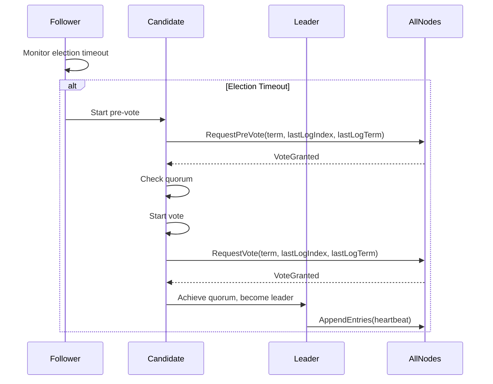

**Diagram sources**
- [VoteManager.java](file://server/src/main/java/com/github/dtprj/dongting/raft/impl/VoteManager.java#L1-L492)

#### Log Replication
Log replication is managed by the ReplicateManager, which handles both normal log replication and snapshot installation. The leader maintains replicate fibers for each follower, sending AppendEntries requests to replicate log entries.

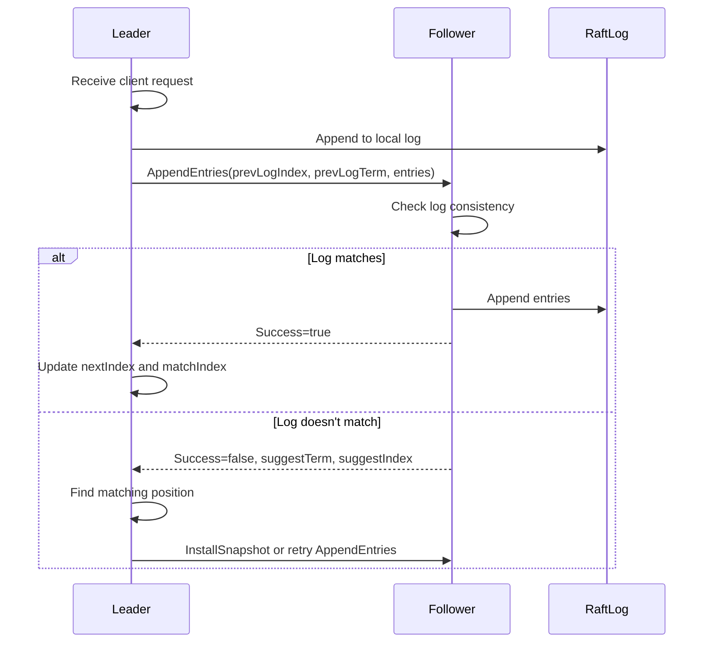

**Diagram sources**
- [ReplicateManager.java](file://server/src/main/java/com/github/dtprj/dongting/raft/impl/ReplicateManager.java#L1-L792)

#### Safety Mechanisms
The implementation includes several safety mechanisms to ensure consistency and prevent split-brain scenarios. The Raft algorithm's safety properties are maintained through term-based leadership, log matching, and leader completeness.

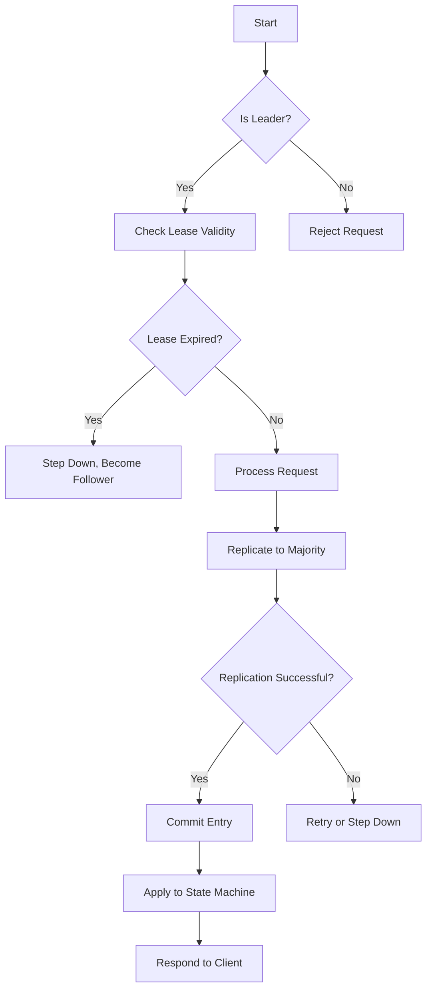

**Diagram sources**
- [RaftGroupImpl.java](file://server/src/main/java/com/github/dtprj/dongting/raft/impl/RaftGroupImpl.java#L1-L220)

### Multi-RAFT Group System
Dongting supports multiple RAFT groups within a single process, allowing for resource efficiency and simplified deployment. The RaftServer manages multiple RaftGroup instances, each operating independently.

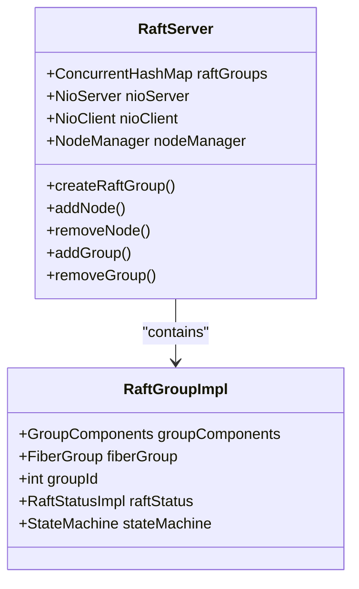

**Diagram sources**
- [RaftServer.java](file://server/src/main/java/com/github/dtprj/dongting/raft/server/RaftServer.java#L1-L718)

### Dynamic Membership Changes
Dynamic membership changes are implemented using joint consensus, allowing for safe configuration changes without downtime. The MemberManager handles prepare, commit, and abort operations for configuration changes.

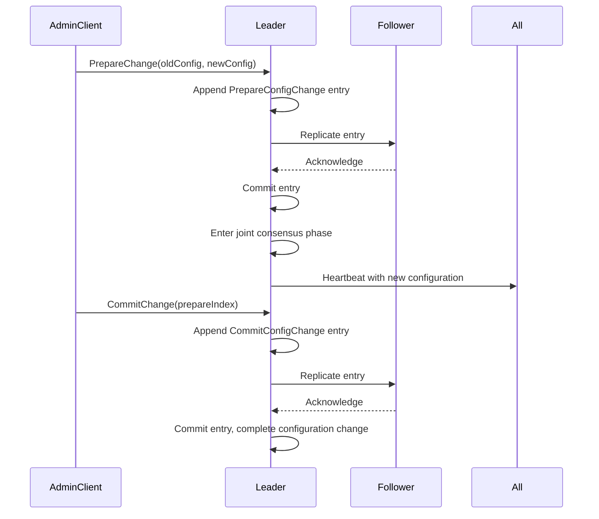

**Diagram sources**
- [MemberManager.java](file://server/src/main/java/com/github/dtprj/dongting/raft/impl/MemberManager.java#L1-L800)
- [AdminConfigChangeProcessor.java](file://server/src/main/java/com/github/dtprj/dongting/raft/rpc/AdminConfigChangeProcessor.java#L1-L104)

### Configuration Management
Configuration management is handled through the RaftServerConfig and RaftGroupConfig classes, which define server-wide and group-specific parameters respectively.

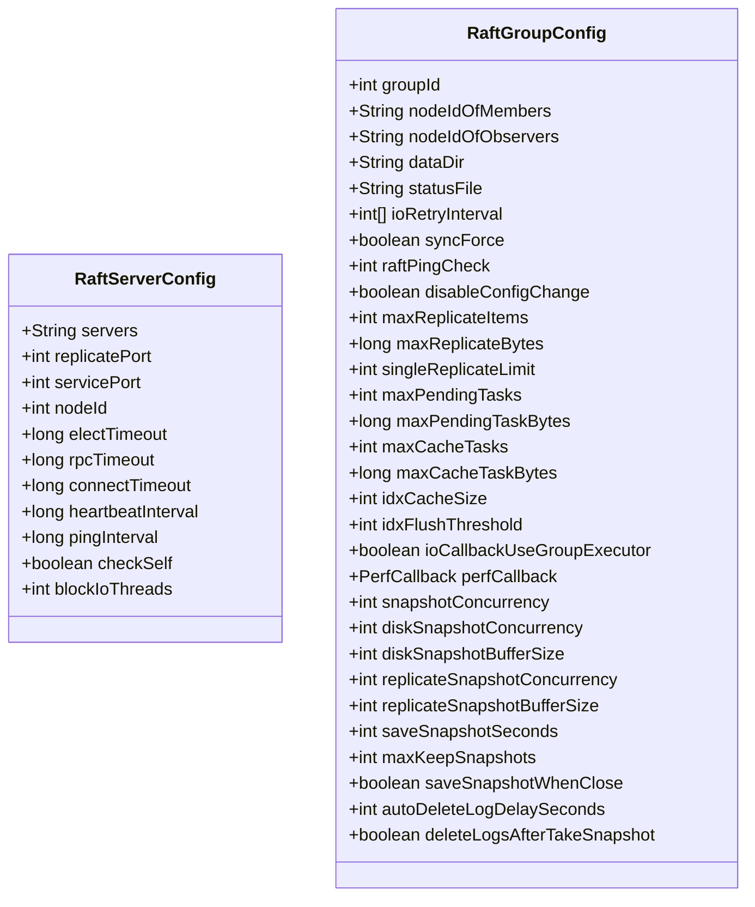

**Diagram sources**
- [RaftServerConfig.java](file://server/src/main/java/com/github/dtprj/dongting/raft/server/RaftServerConfig.java#L1-L40)
- [RaftGroupConfig.java](file://server/src/main/java/com/github/dtprj/dongting/raft/server/RaftGroupConfig.java#L1-L76)

### Group Lifecycle Operations
The system provides comprehensive APIs for managing RAFT group lifecycle, including adding, removing, and updating groups.

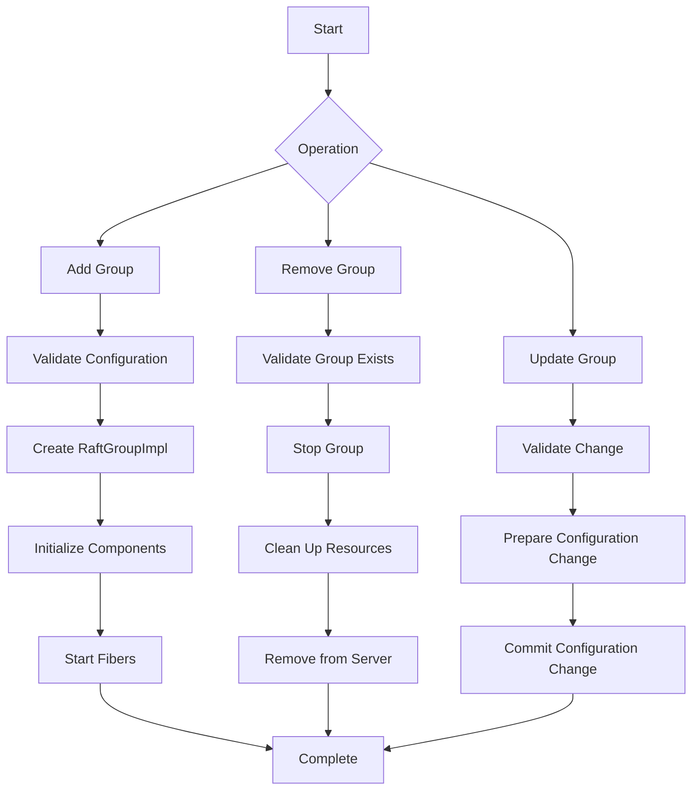

**Section sources**
- [RaftServer.java](file://server/src/main/java/com/github/dtprj/dongting/raft/server/RaftServer.java#L572-L666)

### Leadership Transfer
Leadership transfer is supported through the transferLeadership API, allowing for graceful handover of leadership to another node.

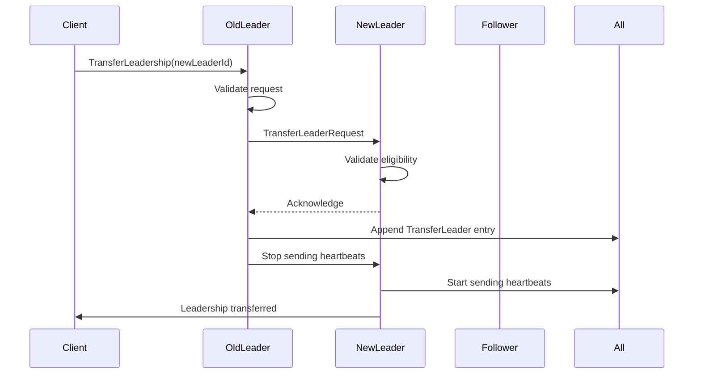

**Section sources**
- [RaftGroupImpl.java](file://server/src/main/java/com/github/dtprj/dongting/raft/impl/RaftGroupImpl.java#L164-L169)

### Admin Interfaces
Administration of RAFT clusters is facilitated through the AdminRaftClient and associated processors, providing a comprehensive API for cluster management.

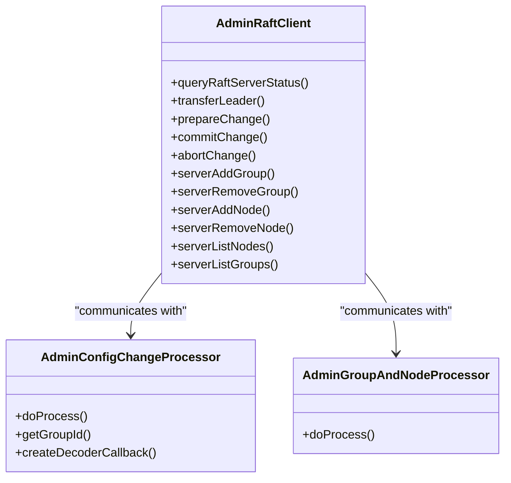

**Diagram sources**
- [AdminRaftClient.java](file://server/src/main/java/com/github/dtprj/dongting/raft/admin/AdminRaftClient.java#L1-L235)
- [AdminConfigChangeProcessor.java](file://server/src/main/java/com/github/dtprj/dongting/raft/rpc/AdminConfigChangeProcessor.java#L1-L104)

### RAFT Log and State Machine
The relationship between the RAFT log, state machine (DtKV), and snapshotting is fundamental to the system's operation. The ApplyManager coordinates log application to the state machine.

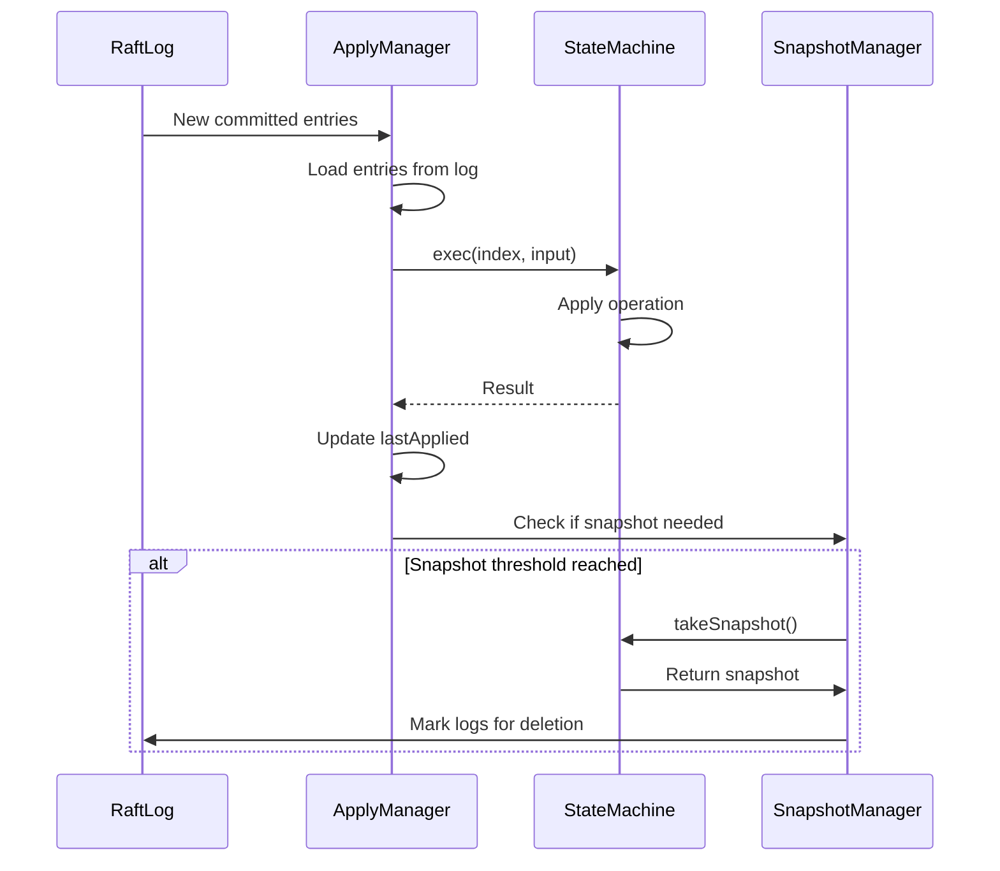

**Diagram sources**
- [ApplyManager.java](file://server/src/main/java/com/github/dtprj/dongting/raft/impl/ApplyManager.java#L1-L548)
- [StateMachine.java](file://server/src/main/java/com/github/dtprj/dongting/raft/sm/StateMachine.java#L1-L50)

## Dependency Analysis

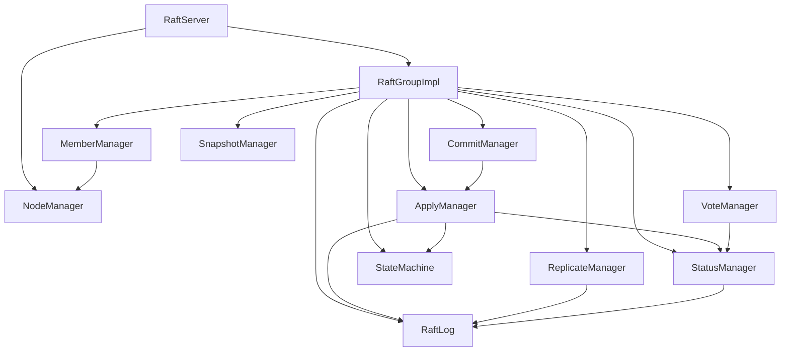

**Diagram sources**
- [RaftServer.java](file://server/src/main/java/com/github/dtprj/dongting/raft/server/RaftServer.java#L1-L718)
- [RaftGroupImpl.java](file://server/src/main/java/com/github/dtprj/dongting/raft/impl/RaftGroupImpl.java#L1-L220)

## Performance Considerations
The Dongting RAFT implementation includes several performance optimizations:
- Fiber-based concurrency model for efficient resource utilization
- Batched log replication to reduce network overhead
- Configurable replication limits (maxReplicateItems, maxReplicateBytes)
- Asynchronous persistence with configurable sync behavior (syncForce)
- Efficient snapshotting with configurable concurrency and buffer sizes
- Tail caching for frequently accessed log entries
- Flow control to prevent overwhelming followers

The system also provides performance monitoring through the PerfCallback interface, allowing for tracking of key metrics such as replication RPC times and state machine execution times.

## Troubleshooting Guide
Common issues and their solutions:

1. **Leader Election Failures**
   - Check network connectivity between nodes
   - Verify election timeout settings are appropriate for network conditions
   - Ensure clock synchronization across nodes

2. **Log Replication Issues**
   - Check RPC timeout settings
   - Verify network bandwidth is sufficient for replication traffic
   - Monitor disk I/O performance on followers

3. **Split-Brain Prevention**
   - Ensure odd-numbered clusters for quorum
   - Configure appropriate election timeouts
   - Use stable network infrastructure

4. **Log Compaction Problems**
   - Verify snapshot creation is working correctly
   - Check disk space for snapshot storage
   - Monitor snapshot creation frequency

5. **Network Partition Handling**
   - Implement proper timeout configurations
   - Use health checks to detect partitioned nodes
   - Plan for quorum loss scenarios

**Section sources**
- [RaftServer.java](file://server/src/main/java/com/github/dtprj/dongting/raft/server/RaftServer.java#L1-L718)
- [VoteManager.java](file://server/src/main/java/com/github/dtprj/dongting/raft/impl/VoteManager.java#L1-L492)

## Conclusion
The Dongting RAFT consensus implementation provides a comprehensive, high-performance solution for distributed consensus with support for multiple RAFT groups within a single process. The system implements the core RAFT algorithm with leader election, log replication, and safety mechanisms, while extending it with features like dynamic membership changes using joint consensus, comprehensive administration interfaces, and efficient state machine integration. The architecture is designed for performance and reliability, with careful attention to failure recovery, monitoring, and operational considerations.