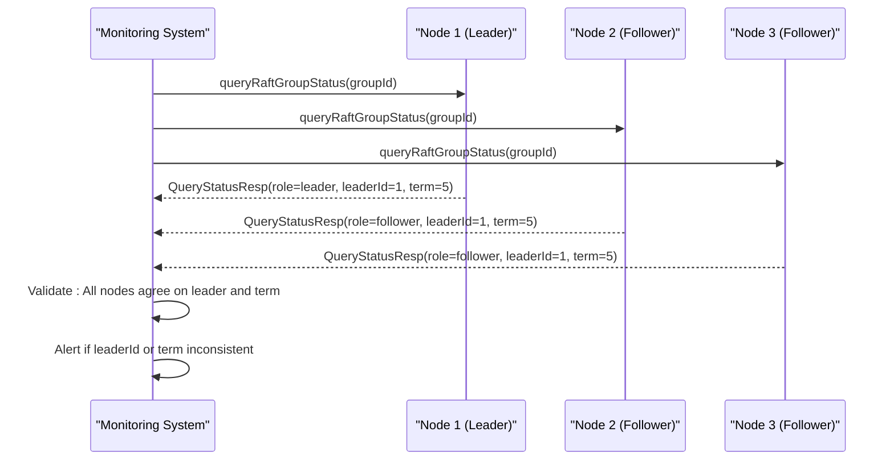
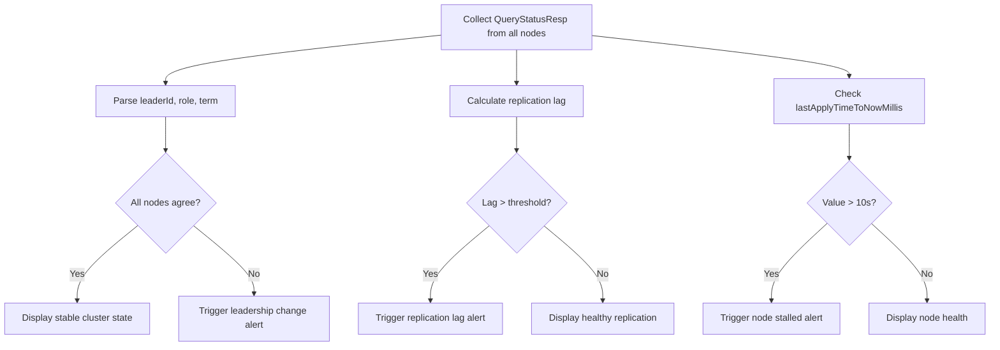

# Cluster Health Monitoring and Diagnostics

<cite>
**Referenced Files in This Document**   
- [QueryStatusResp.java](file://client/src/main/java/com/github/dtprj/dongting/raft/QueryStatusResp.java)
- [RaftServer.java](file://server/src/main/java/com/github/dtprj/dongting/raft/server/RaftServer.java)
- [QueryStatusProcessor.java](file://server/src/main/java/com/github/dtprj/dongting/raft/rpc/QueryStatusProcessor.java)
- [RaftStatusImpl.java](file://server/src/main/java/com/github/dtprj/dongting/raft/impl/RaftStatusImpl.java)
- [RaftClient.java](file://client/src/main/java/com/github/dtprj/dongting/raft/RaftClient.java)
- [AdminRaftClient.java](file://server/src/main/java/com/github/dtprj/dongting/raft/admin/AdminRaftClient.java)
- [WatchManager.java](file://client/src/main/java/com/github/dtprj/dongting/dtkv/WatchManager.java)
</cite>

## Table of Contents
1. [Introduction](#introduction)
2. [Core Monitoring API: queryRaftGroupStatus](#core-monitoring-api-queryraftgroupstatus)
3. [QueryStatusResp: Key Health Indicators](#querystatusresp-key-health-indicators)
4. [Monitoring Leader Stability and Consensus](#monitoring-leader-stability-and-consensus)
5. [Replication Lag and Node Connectivity](#replication-lag-and-node-connectivity)
6. [Building Monitoring Dashboards and Alerting Systems](#building-monitoring-dashboards-and-alerting-systems)
7. [Diagnostic Procedures for Common Issues](#diagnostic-procedures-for-common-issues)
8. [Log Analysis and Performance Counters](#log-analysis-and-performance-counters)
9. [Administrative APIs for Cluster-Wide Diagnostics](#administrative-apis-for-cluster-wide-diagnostics)
10. [Detecting and Responding to Split-Brain Scenarios](#detecting-and-responding-to-split-brain-scenarios)

## Introduction
This document provides a comprehensive guide to cluster health monitoring and diagnostics for the Dongting RAFT-based system. It focuses on the programmatic use of the `queryRaftGroupStatus` API and other diagnostic tools to ensure cluster stability and high availability. The primary mechanism for monitoring cluster health is the `QueryStatusResp` object, which provides a detailed snapshot of a RAFT group's state on a specific node. By systematically collecting and analyzing these status reports from all nodes, operators can build robust monitoring dashboards, implement effective alerting systems, and perform in-depth diagnostics to troubleshoot issues such as leadership elections, network partitions, and slow followers. This guide will detail the structure of the status response, explain how to interpret key health indicators, and provide practical procedures for maintaining a healthy cluster.

## Core Monitoring API: queryRaftGroupStatus
The `queryRaftGroupStatus` method is the primary API for programmatically checking the health of a RAFT group. This method is exposed on the `RaftServer` class and can be invoked to retrieve the current status of any RAFT group managed by the server. The method takes a `groupId` as a parameter and returns a `CompletableFuture<QueryStatusResp>`, enabling non-blocking, asynchronous status retrieval. The implementation ensures thread safety by executing the status query within the specific fiber group associated with the RAFT group, preventing any race conditions during the status collection process. This design allows for efficient and consistent monitoring without impacting the performance of the RAFT consensus algorithm. The method first validates the existence of the specified group; if the group is not found, it returns a failed future with a `NoSuchGroupException`. Otherwise, it fires a lightweight fiber to collect the status data and build the `QueryStatusResp` object, which is then completed and returned to the caller.

**Section sources**
- [RaftServer.java](file://server/src/main/java/com/github/dtprj/dongting/raft/server/RaftServer.java#L696-L714)

## QueryStatusResp: Key Health Indicators
The `QueryStatusResp` object is the central data structure for cluster health monitoring, containing a comprehensive set of fields that reflect the current state of a RAFT node within a specific group. These fields provide the raw data necessary to assess the overall health and performance of the cluster. Key indicators include the node's `role` (leader, follower, or candidate), the current `term`, and the `commitIndex`, which represents the highest log index known to be committed. The `lastApplied` index indicates the highest log entry that has been applied to the state machine, while `lastLogIndex` shows the index of the most recent entry in the log. The `leaderId` field identifies the current leader of the group, or is zero if no leader is present. The `applyLagMillis` field quantifies the time delay between when a log entry is committed and when it is applied to the state machine, serving as a critical performance metric. The `members` and `observers` sets list the node IDs of all active members and observers in the group, respectively. The `lastApplyTimeToNowMillis` field measures the time elapsed since the last log entry was applied, which is crucial for detecting stalled nodes.

**Section sources**
- [QueryStatusResp.java](file://client/src/main/java/com/github/dtprj/dongting/raft/QueryStatusResp.java#L29-L236)

## Monitoring Leader Stability and Consensus
Monitoring leader stability is paramount for ensuring the continuous operation of a RAFT cluster. The `queryRaftGroupStatus` API provides the necessary data to track leadership changes and assess the stability of the consensus process. By periodically polling the `leaderId` and `term` fields from all nodes in a group, a monitoring system can detect leadership elections and verify that all nodes agree on the current leader. A healthy cluster will show a consistent `leaderId` across all nodes, with the leader's `role` field set to "leader" and all other nodes' roles set to "follower". The `term` number should also be consistent across the cluster, as a higher term indicates a more recent election. Frequent changes in the `leaderId` or `term` can indicate network instability or performance issues that are causing the leader to lose its lease. The `groupReady` flag in the `QueryStatusResp` indicates whether the node is fully initialized and ready to participate in the consensus process; a node that is not ready cannot become a leader. Monitoring the `lastApplyTimeToNowMillis` on the leader is also critical, as a value that grows continuously suggests that the leader is unable to keep up with the workload, which can lead to a leadership transfer.

**Diagram sources **
- [QueryStatusResp.java](file://client/src/main/java/com/github/dtprj/dongting/raft/QueryStatusResp.java#L29-L236)
- [RaftServer.java](file://server/src/main/java/com/github/dtprj/dongting/raft/server/RaftServer.java#L696-L714)

## Replication Lag and Node Connectivity
Replication lag and node connectivity are critical health indicators for a RAFT cluster. The `QueryStatusResp` object provides several fields to monitor these aspects. The `commitIndex` represents the highest log index that has been replicated to a majority of the cluster and is considered committed. The `lastLogIndex` on each follower node indicates how far behind the leader that node is in terms of log replication. The difference between the leader's `lastLogIndex` and a follower's `lastLogIndex` is the replication lag. A large and growing lag indicates that a follower is unable to keep up with the leader's write rate, which could be due to network latency, disk I/O bottlenecks, or CPU contention. The `applyLagMillis` field measures the time it takes for a committed log entry to be applied to the state machine, which is a direct indicator of processing performance. Node connectivity can be inferred from the ability to successfully call the `queryRaftGroupStatus` API. If a node is unreachable, the API call will fail with a network exception. Additionally, the `lastApplyTimeToNowMillis` field on a follower node should be relatively small; a value that exceeds a few seconds suggests that the node has stopped processing logs, possibly due to a network partition or a crash.

**Section sources**
- [QueryStatusResp.java](file://client/src/main/java/com/github/dtprj/dongting/raft/QueryStatusResp.java#L29-L236)
- [RaftStatusImpl.java](file://server/src/main/java/com/github/dtprj/dongting/raft/impl/RaftStatusImpl.java#L35-L102)

## Building Monitoring Dashboards and Alerting Systems
Building effective monitoring dashboards and alerting systems involves aggregating `QueryStatusResp` data from all nodes in a RAFT group and visualizing key metrics. A dashboard should display the current leader, the term, and the role of each node in a clear, at-a-glance format. Time-series graphs should track the `commitIndex`, `lastLogIndex`, and `lastApplied` for each node to visualize replication progress and lag. The `applyLagMillis` should be graphed to monitor state machine performance. Alerts should be configured for critical conditions: a change in leadership (unless expected), a node reporting `!isGroupReady()`, a `lastApplyTimeToNowMillis` exceeding a threshold (e.g., 10 seconds), or a `leaderId` of zero indicating no leader is present. The `RaftClient` class provides a convenient `fetchLeader` method that can be used by a monitoring system to quickly determine the current leader without having to poll all nodes manually. This method internally uses the `queryRaftGroupStatus` API to find the leader, making it an efficient way to get a high-level view of the cluster's state.

**Diagram sources **
- [RaftClient.java](file://client/src/main/java/com/github/dtprj/dongting/raft/RaftClient.java#L446-L479)
- [QueryStatusResp.java](file://client/src/main/java/com/github/dtprj/dongting/raft/QueryStatusResp.java#L29-L236)

## Diagnostic Procedures for Common Issues
When issues arise, the `queryRaftGroupStatus` API is the first tool for diagnosis. For a leadership election issue, collect status responses from all nodes immediately after the event. Check if all nodes report the same `term` and `leaderId`. If nodes report different terms, it indicates a network partition where a subset of nodes elected a new leader. If a node reports `role=candidate`, it is actively trying to become the leader. For a slow follower, compare the `lastLogIndex` of the slow node with the leader's `lastLogIndex` to quantify the lag. Check the `applyLagMillis` to determine if the bottleneck is in log replication or state machine application. For a node that appears disconnected, verify that the `queryRaftGroupStatus` call fails with a network error. If the call succeeds but the node reports `lastApplyTimeToNowMillis` in the thousands, the node is likely overloaded. The `RaftStatusImpl` class contains internal state like `electTimeoutNanos` and `leaseStartNanos` that can be used for deeper diagnostics, though these are not exposed in the `QueryStatusResp`. The `WatchManager` class uses the status information to determine if a node is healthy before sending requests to it, providing a real-world example of how this data is used for operational decisions.

**Section sources**
- [QueryStatusResp.java](file://client/src/main/java/com/github/dtprj/dongting/raft/QueryStatusResp.java#L29-L236)
- [RaftStatusImpl.java](file://server/src/main/java/com/github/dtprj/dongting/raft/impl/RaftStatusImpl.java#L35-L256)
- [WatchManager.java](file://client/src/main/java/com/github/dtprj/dongting/dtkv/WatchManager.java#L495-L519)

## Log Analysis and Performance Counters
Log analysis and performance counters complement the `queryRaftGroupStatus` API by providing historical context and granular performance data. The system logs contain detailed information about leadership elections, vote requests, and append entries, which can be invaluable for diagnosing transient issues. Performance counters, implemented through the `PerfCallback` interface, track metrics such as the time taken to encode and write log entries (`RAFT_D_ENCODE_AND_WRITE`), the time to write logs to disk (`RAFT_D_LOG_WRITE1`), and the time to sync logs (`RAFT_D_LOG_SYNC`). These counters can be exposed via a Prometheus endpoint using the `PrometheusPerfCallback` class, allowing them to be scraped and visualized in monitoring tools like Grafana. High values in the `RAFT_D_LOG_SYNC` counter, for example, indicate that disk I/O is a bottleneck. The `fiberPoll` and `fiberWork` counters can reveal if the fiber scheduler is overloaded, which could cause delays in processing RAFT messages. Correlating these performance counters with the `applyLagMillis` from `QueryStatusResp` can pinpoint the root cause of performance degradation.

**Section sources**
- [RaftPerfCallback.java](file://benchmark/src/main/java/com/github/dtprj/dongting/bench/raft/RaftPerfCallback.java#L26-L148)
- [PrometheusPerfCallback.java](file://benchmark/src/main/java/com/github/dtprj/dongting/bench/common/PrometheusPerfCallback.java#L34-L102)
- [QueryStatusResp.java](file://client/src/main/java/com/github/dtprj/dongting/raft/QueryStatusResp.java#L29-L236)

## Administrative APIs for Cluster-Wide Diagnostics
In addition to the `queryRaftGroupStatus` API, the `AdminRaftClient` provides a suite of administrative APIs for cluster-wide diagnostics and management. These APIs allow an operator to list all nodes and groups on a server, add or remove nodes and groups, and transfer leadership. The `serverListNodes` and `serverListGroups` methods return the current configuration of a server, which can be used to verify that the cluster topology matches the expected state. The `transferLeader` method can be used to gracefully move leadership from one node to another, which is useful for planned maintenance. The `prepareChange` and `commitChange` methods enable dynamic reconfiguration of the RAFT group membership, allowing the cluster to adapt to changing conditions. These administrative operations are idempotent, meaning they can be safely retried if a network error occurs. The `AdminRaftClient` extends the `RaftClient` class, inheriting its ability to discover the current leader, ensuring that administrative commands are always sent to the correct node.

**Section sources**
- [AdminRaftClient.java](file://server/src/main/java/com/github/dtprj/dongting/raft/admin/AdminRaftClient.java#L53-L235)
- [RaftClient.java](file://client/src/main/java/com/github/dtprj/dongting/raft/RaftClient.java#L48-L588)

## Detecting and Responding to Split-Brain Scenarios
A split-brain scenario occurs when a network partition divides the cluster into two or more isolated groups, each of which may elect its own leader. This is a critical failure mode that can lead to data inconsistency. The `queryRaftGroupStatus` API is essential for detecting split-brain scenarios. A monitoring system should continuously poll all nodes and check for inconsistencies in the `term` and `leaderId` fields. If two nodes report different `leaderId` values with the same `term`, it is a strong indicator of a split-brain. The system should also check the `members` set to ensure that all nodes agree on the group membership. To respond to a detected split-brain, the first step is to identify which partition contains the majority of the nodes. The leader in the majority partition is the legitimate leader, and nodes in the minority partition should be isolated or restarted to prevent them from accepting writes. The `AdminRaftClient` can be used to remove nodes from the minority partition or to force a reconfiguration of the group once the network partition is resolved. Preventing split-brain scenarios involves ensuring that the cluster has an odd number of nodes and that the network infrastructure is highly reliable.

**Section sources**
- [QueryStatusResp.java](file://client/src/main/java/com/github/dtprj/dongting/raft/QueryStatusResp.java#L29-L236)
- [AdminRaftClient.java](file://server/src/main/java/com/github/dtprj/dongting/raft/admin/AdminRaftClient.java#L53-L235)