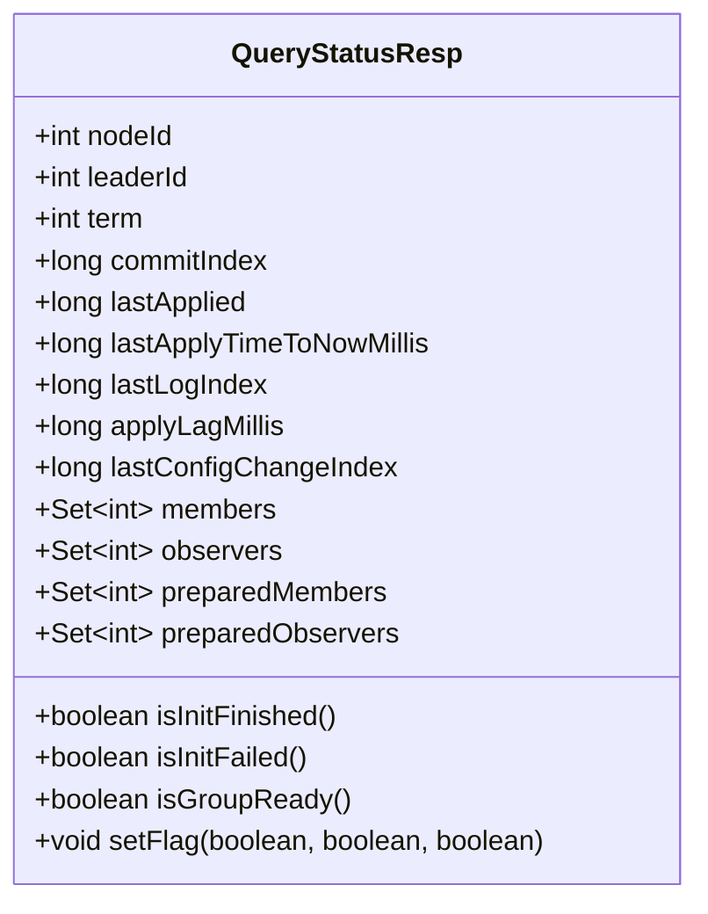
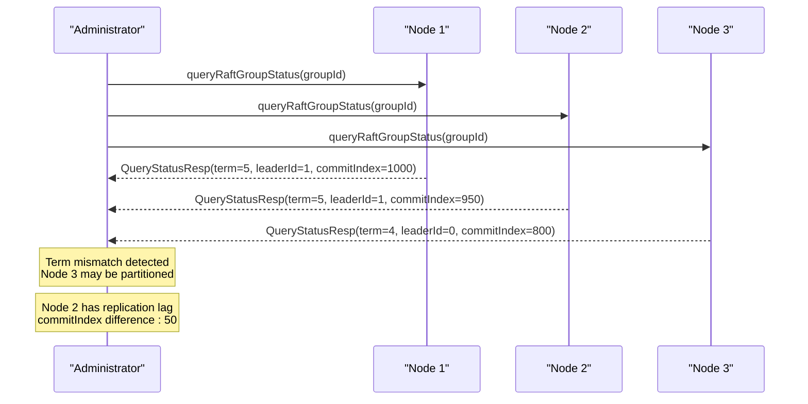
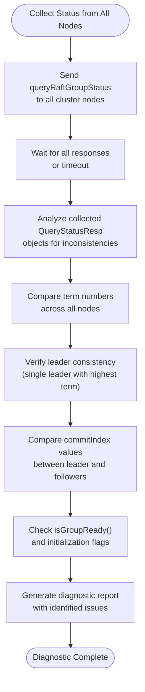
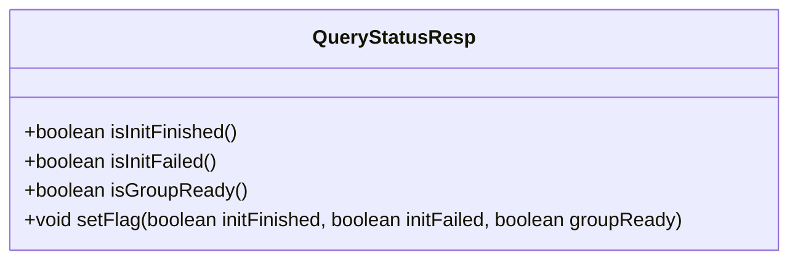

# Diagnostic Procedures

<cite>
**Referenced Files in This Document**   
- [RaftServer.java](file://server/src/main/java/com/github/dtprj/dongting/raft/server/RaftServer.java)
- [QueryStatusProcessor.java](file://server/src/main/java/com/github/dtprj/dongting/raft/rpc/QueryStatusProcessor.java)
- [QueryStatusResp.java](file://client/src/main/java/com/github/dtprj/dongting/raft/QueryStatusResp.java)
- [RaftStatusImpl.java](file://server/src/main/java/com/github/dtprj/dongting/raft/impl/RaftStatusImpl.java)
- [MemberManager.java](file://server/src/main/java/com/github/dtprj/dongting/raft/impl/MemberManager.java)
- [WatchManager.java](file://client/src/main/java/com/github/dtprj/dongting/dtkv/WatchManager.java)
</cite>

## Table of Contents
1. [Introduction](#introduction)
2. [QueryRaftGroupStatus API Overview](#queryraftgroupstatus-api-overview)
3. [Diagnostic Patterns for RAFT Cluster Issues](#diagnostic-patterns-for-raft-cluster-issues)
4. [Correlating Data Across Multiple Nodes](#correlating-data-across-multiple-nodes)
5. [Diagnostic Scripts for Cluster Status Collection](#diagnostic-scripts-for-cluster-status-collection)
6. [Troubleshooting Startup Problems](#troubleshooting-startup-problems)
7. [Conclusion](#conclusion)

## Introduction
This document provides comprehensive diagnostic procedures for troubleshooting RAFT cluster issues in the Dongting distributed system. The focus is on using the `queryRaftGroupStatus` API to diagnose common problems such as leadership elections, network partitions, and slow followers. By analyzing the `QueryStatusResp` data structure and its components, administrators can identify inconsistencies across nodes, detect split-brain scenarios, and resolve replication issues. The document covers diagnostic patterns, data correlation techniques, and practical scripts for collecting and comparing status information from all nodes in a cluster.

**Section sources**
- [RaftServer.java](file://server/src/main/java/com/github/dtprj/dongting/raft/server/RaftServer.java#L692-L717)
- [QueryStatusProcessor.java](file://server/src/main/java/com/github/dtprj/dongting/raft/rpc/QueryStatusProcessor.java#L59-L78)

## QueryRaftGroupStatus API Overview
The `queryRaftGroupStatus` API is the primary diagnostic tool for examining the internal state of RAFT groups in the Dongting system. This API provides access to critical RAFT metadata that enables administrators to diagnose cluster health and identify issues.

The API is implemented in the `RaftServer` class and returns a `QueryStatusResp` object containing comprehensive information about a RAFT group's current state:



**Diagram sources**
- [QueryStatusResp.java](file://client/src/main/java/com/github/dtprj/dongting/raft/QueryStatusResp.java#L63-L71)
- [QueryStatusResp.java](file://client/src/main/java/com/github/dtprj/dongting/raft/QueryStatusResp.java#L85-L96)

The `QueryStatusResp` object contains several key fields that are essential for diagnostics:
- **term**: The current RAFT term number, crucial for detecting split-brain scenarios
- **commitIndex**: The highest log index known to be committed, used to identify replication issues
- **lastApplied**: The highest log index applied to the state machine, indicating follower progress
- **leaderId**: The node ID of the current leader, or 0 if no leader is elected
- **isGroupReady()**: A flag indicating whether the RAFT group is ready for operations
- **applyLagMillis**: The time delay from commit to apply, sampled update
- **lastApplyTimeToNowMillis**: Time since the last application of a log entry

The API is accessible through both the replication port and service port, making it available for monitoring even when the primary service is under stress.

**Section sources**
- [RaftServer.java](file://server/src/main/java/com/github/dtprj/dongting/raft/server/RaftServer.java#L696-L717)
- [QueryStatusProcessor.java](file://server/src/main/java/com/github/dtprj/dongting/raft/rpc/QueryStatusProcessor.java#L59-L78)
- [QueryStatusResp.java](file://client/src/main/java/com/github/dtprj/dongting/raft/QueryStatusResp.java#L47-L174)

## Diagnostic Patterns for RAFT Cluster Issues
Effective RAFT cluster diagnostics rely on specific patterns that help identify and resolve common issues. These patterns leverage the data provided by the `queryRaftGroupStatus` API to detect problems such as leadership elections, network partitions, and slow followers.

### Term Number Analysis for Split-Brain Detection
One of the most critical diagnostic patterns involves checking the term number across all nodes in a cluster. In a healthy RAFT cluster, all nodes should have the same term number. When nodes have different term numbers, it indicates a potential split-brain scenario where multiple nodes believe they are leaders.

To detect split-brain scenarios:
1. Query the `QueryStatusResp` from all nodes in the cluster
2. Compare the `term` field values across all responses
3. If multiple nodes report different term numbers, a split-brain condition exists
4. The node with the highest term number is the legitimate leader

The term number is incremented during leadership elections, so discrepancies indicate that some nodes are not properly communicating with others, possibly due to network partitions.

### CommitIndex Progression Analysis for Replication Issues
Monitoring the progression of the `commitIndex` across nodes helps identify replication problems. In a properly functioning cluster, the leader's `commitIndex` should be equal to or greater than all followers' `commitIndex` values.

Diagnostic steps for replication issues:
1. Collect `QueryStatusResp` from all nodes
2. Compare the leader's `commitIndex` with followers' `commitIndex` values
3. If a follower's `commitIndex` is significantly behind the leader's, it indicates replication lag
4. Check the `applyLagMillis` value to determine if the follower is processing committed entries slowly

The `commitIndex` represents the highest log entry known to be committed, and all nodes must eventually reach this index. Persistent discrepancies suggest network connectivity issues or performance problems on the follower nodes.

### Member State Analysis for Connectivity Problems
Analyzing the member states provides insights into connectivity problems within the cluster. The `QueryStatusResp` includes information about all members, observers, and their prepared states.

Key indicators of connectivity problems:
- Nodes showing as members but with `leaderId` set to 0
- High values of `lastApplyTimeToNowMillis` (indicating no recent activity)
- Discrepancies in the `members` and `preparedMembers` sets across nodes
- Nodes with `applyLagMillis` exceeding acceptable thresholds

The `isGroupReady()` flag is particularly important, as it indicates whether the RAFT group has completed initialization and is ready to serve requests. Nodes with `isGroupReady()` returning false may be experiencing startup issues or connectivity problems.



**Diagram sources**
- [QueryStatusResp.java](file://client/src/main/java/com/github/dtprj/dongting/raft/QueryStatusResp.java#L65-L70)
- [RaftStatusImpl.java](file://server/src/main/java/com/github/dtprj/dongting/raft/impl/RaftStatusImpl.java#L65-L69)

**Section sources**
- [RaftStatusImpl.java](file://server/src/main/java/com/github/dtprj/dongting/raft/impl/RaftStatusImpl.java#L65-L77)
- [QueryStatusResp.java](file://client/src/main/java/com/github/dtprj/dongting/raft/QueryStatusResp.java#L65-L71)
- [MemberManager.java](file://server/src/main/java/com/github/dtprj/dongting/raft/impl/MemberManager.java#L200-L213)

## Correlating Data Across Multiple Nodes
Effective RAFT cluster diagnostics requires correlating data from multiple nodes to identify inconsistencies and pinpoint issues. This section explains how to collect and compare `QueryStatusResp` outputs from all nodes in a cluster.

### Data Collection Strategy
To properly correlate data across nodes:
1. Establish connections to all nodes in the cluster
2. Send `queryRaftGroupStatus` requests to each node simultaneously
3. Collect all responses within a short time window to ensure temporal consistency
4. Normalize the data for comparison

The timing of data collection is critical, as RAFT states can change rapidly during leadership elections or network partitions. Collecting responses from all nodes within a few milliseconds of each other ensures that the diagnostic snapshot is consistent.

### Inconsistency Detection Patterns
When comparing `QueryStatusResp` outputs from multiple nodes, several patterns indicate potential issues:

**Term Inconsistencies**
- Nodes reporting different term numbers suggest network partitions
- The node with the highest term should be the leader
- Multiple nodes with the same highest term indicates a split-brain scenario

**Commit Index Discrepancies**
- Followers with significantly lower `commitIndex` values than the leader indicate replication problems
- Large gaps in `commitIndex` between nodes may require log compaction or snapshot transfer

**Leader Election Anomalies**
- Multiple nodes reporting themselves as leader (leaderId equals their nodeId)
- Nodes showing leaderId=0 while others show a valid leader
- Frequent changes in leaderId across consecutive queries

**Initialization State Mismatches**
- Nodes with `isInitFinished()` returning false while others return true
- Nodes with `isInitFailed()` returning true require investigation
- Inconsistent `isGroupReady()` states across the cluster

The correlation process should also examine the membership configuration:
- Verify that all nodes agree on the current members set
- Check for discrepancies in preparedMembers during configuration changes
- Ensure observer lists are consistent across nodes



**Diagram sources**
- [QueryStatusResp.java](file://client/src/main/java/com/github/dtprj/dongting/raft/QueryStatusResp.java#L85-L108)
- [RaftStatusImpl.java](file://server/src/main/java/com/github/dtprj/dongting/raft/impl/RaftStatusImpl.java#L237-L255)

**Section sources**
- [QueryStatusResp.java](file://client/src/main/java/com/github/dtprj/dongting/raft/QueryStatusResp.java#L65-L71)
- [RaftStatusImpl.java](file://server/src/main/java/com/github/dtprj/dongting/raft/impl/RaftStatusImpl.java#L237-L255)
- [MemberManager.java](file://server/src/main/java/com/github/dtprj/dongting/raft/impl/MemberManager.java#L444-L459)

## Diagnostic Scripts for Cluster Status Collection
This section provides examples of diagnostic scripts that automate the collection and comparison of status information from all nodes in a RAFT cluster.

### Python Diagnostic Script
```python
# Note: This is a conceptual example of how a diagnostic script would work
# Actual implementation would depend on the client library availability

import asyncio
import logging
from typing import Dict, List
from dataclasses import dataclass

@dataclass
class NodeStatus:
    node_id: int
    term: int
    leader_id: int
    commit_index: int
    last_applied: int
    is_group_ready: bool
    is_init_finished: bool
    is_init_failed: bool

class RaftDiagnosticClient:
    def __init__(self, node_configs: List[dict]):
        self.node_configs = node_configs
        self.statuses: Dict[int, NodeStatus] = {}
    
    async def collect_status(self, group_id: int) -> Dict[int, NodeStatus]:
        """Collect status from all nodes in parallel"""
        tasks = []
        for config in self.node_configs:
            task = self._query_single_node(config, group_id)
            tasks.append(task)
        
        results = await asyncio.gather(*tasks, return_exceptions=True)
        
        for result in results:
            if isinstance(result, Exception):
                logging.error(f"Failed to query node: {result}")
                continue
            self.statuses[result.node_id] = result
        
        return self.statuses
    
    async def _query_single_node(self, config: dict, group_id: int) -> NodeStatus:
        # This would use the actual client library to query the node
        # For example: client = RaftClient(config['host'], config['port'])
        # status = await client.query_raft_group_status(group_id)
        pass
    
    def analyze_cluster(self) -> str:
        """Analyze collected statuses and return diagnostic report"""
        if not self.statuses:
            return "No status data collected"
        
        # Check for term inconsistencies (split-brain)
        terms = [status.term for status in self.statuses.values()]
        if len(set(terms)) > 1:
            max_term = max(terms)
            nodes_with_max_term = [nid for nid, status in self.statuses.items() if status.term == max_term]
            if len(nodes_with_max_term) > 1:
                return f"SPLIT-BRAIN DETECTED: {len(nodes_with_max_term)} nodes with term {max_term}"
        
        # Check leader consistency
        leaders = [status.leader_id for status in self.statuses.values() if status.leader_id > 0]
        if len(set(leaders)) > 1:
            return f"MULTIPLE LEADERS DETECTED: {set(leaders)}"
        
        # Check group readiness
        ready_count = sum(1 for status in self.statuses.values() if status.is_group_ready)
        total_count = len(self.statuses)
        
        return f"Cluster status: {ready_count}/{total_count} nodes ready"
```

### Shell Script for Status Comparison
```bash
#!/bin/bash
# raft-status-check.sh - Diagnostic script for RAFT cluster status

GROUP_ID=${1:-1}
TIMEOUT=${2:-5}

echo "Collecting RAFT status for group $GROUP_ID..."

# Define cluster nodes
NODES=("127.0.0.1:5001" "127.0.0.1:5002" "127.0.0.1:5003")
NODE_IDS=(1 2 3)

# Temporary file to store results
TEMP_FILE=$(mktemp)
trap 'rm -f $TEMP_FILE' EXIT

# Function to query a single node (this would call the actual client)
query_node() {
    local host_port=$1
    local node_id=$2
    local group_id=$3
    
    # This is a placeholder - in reality, this would call the client library
    # For example: ./raft-client --host $host --port $port --group $group_id status
    echo "Simulated response for node $node_id"
    echo "node_id:$node_id"
    echo "term:$(shuf -i 4-6 -n 1)"  # Simulate possible term inconsistencies
    echo "leader_id:$(shuf -i 0-3 -n 1)"  # Simulate leader election issues
    echo "commit_index:$(shuf -i 900-1000 -n 1)"
    echo "last_applied:$(shuf -i 800-950 -n 1)"
    echo "is_group_ready:true"
    echo "is_init_finished:true"
    echo "is_init_failed:false"
    echo "---"
}

# Collect status from all nodes
for i in "${!NODES[@]}"; do
    echo "Querying node ${NODE_IDS[$i]} at ${NODES[$i]}"
    query_node "${NODES[$i]}" "${NODE_IDS[$i]}" "$GROUP_ID" >> "$TEMP_FILE"
done

# Parse and analyze results
echo -e "\n=== DIAGNOSTIC REPORT ==="

# Extract terms
terms=($(grep "term:" "$TEMP_FILE" | cut -d: -f2))
unique_terms=($(printf '%s\n' "${terms[@]}" | sort -u))
if [ ${#unique_terms[@]} -gt 1 ]; then
    echo "WARNING: Term inconsistency detected: ${unique_terms[*]}"
    echo "Possible split-brain scenario"
fi

# Extract leaders
leaders=($(grep "leader_id:" "$TEMP_FILE" | cut -d: -f2 | grep -v "^0$"))
unique_leaders=($(printf '%s\n' "${leaders[@]}" | sort -u))
if [ ${#unique_leaders[@]} -gt 1 ]; then
    echo "CRITICAL: Multiple leaders detected: ${unique_leaders[*]}"
fi

# Check readiness
ready_count=$(grep "is_group_ready:true" "$TEMP_FILE" | wc -l)
total_count=$(echo "${#NODES[@]}")
echo "Cluster readiness: $ready_count/$total_count nodes ready"

echo "Diagnostic complete"
```

These scripts demonstrate how to systematically collect and analyze RAFT cluster status information. In a production environment, they would be enhanced with actual client library calls, error handling, and integration with monitoring systems.

**Section sources**
- [RaftServer.java](file://server/src/main/java/com/github/dtprj/dongting/raft/server/RaftServer.java#L696-L717)
- [QueryStatusProcessor.java](file://server/src/main/java/com/github/dtprj/dongting/raft/rpc/QueryStatusProcessor.java#L59-L78)
- [QueryStatusResp.java](file://client/src/main/java/com/github/dtprj/dongting/raft/QueryStatusResp.java#L85-L108)

## Troubleshooting Startup Problems
Startup problems in RAFT clusters can be effectively diagnosed using the initialization status flags in the `QueryStatusResp` object. This section explains how to use the `isGroupReady` flag and other initialization indicators to troubleshoot startup issues.

### Initialization Status Flags
The `QueryStatusResp` class includes three boolean flags that provide insight into the initialization state:



**Diagram sources**
- [QueryStatusResp.java](file://client/src/main/java/com/github/dtprj/dongting/raft/QueryStatusResp.java#L85-L108)

These flags are set using the `setFlag` method, which combines the three boolean values into a single integer field using bit masking:

- **initFinished**: Indicates whether the initialization process has completed
- **initFailed**: Indicates whether initialization failed
- **groupReady**: Indicates whether the RAFT group is ready to serve requests

### Diagnostic Procedure for Startup Issues
When troubleshooting startup problems, follow this procedure:

1. **Check initialization completion**
   - If `isInitFinished()` returns false, the node is still initializing
   - Monitor this flag over time to ensure it eventually becomes true
   - If it remains false, check system logs for initialization blockers

2. **Identify initialization failures**
   - If `isInitFailed()` returns true, initialization has failed
   - Examine system logs for the specific failure reason
   - Common causes include network connectivity issues, disk problems, or configuration errors

3. **Verify group readiness**
   - The `isGroupReady()` flag should be true for operational nodes
   - If false, the RAFT group may not have achieved quorum
   - Check that a sufficient number of nodes are available and communicating

4. **Analyze startup sequence**
   - Nodes must complete initialization before participating in leadership elections
   - A node with `isInitFinished()` true but `isGroupReady()` false may be waiting for other nodes
   - Compare initialization states across all nodes to identify bottlenecks

The `WatchManager` class in the client code demonstrates how these flags are used in practice:

```java
private boolean isQueryStatusOk(int groupId, RaftNode n, ReadPacket<KvStatusResp> frame, Throwable ex) {
    // ... error checking ...
    QueryStatusResp s = resp.raftServerStatus;
    if (!s.isGroupReady() || s.leaderId <= 0 || 
        s.lastApplyTimeToNowMillis > 15_000 || s.applyLagMillis > 15_000) {
        log.info("status of node {} for group {} is not ok", n.nodeId, groupId);
        return false;
    }
    return true;
}
```

This code shows that a node is considered "not ok" if it's not group ready, has no leader, or shows signs of being unresponsive (high apply lag).

**Section sources**
- [QueryStatusResp.java](file://client/src/main/java/com/github/dtprj/dongting/raft/QueryStatusResp.java#L85-L108)
- [RaftStatusImpl.java](file://server/src/main/java/com/github/dtprj/dongting/raft/impl/RaftStatusImpl.java#L158-L162)
- [WatchManager.java](file://client/src/main/java/com/github/dtprj/dongting/dtkv/WatchManager.java#L513-L517)

## Conclusion
Effective diagnostic procedures for RAFT cluster issues rely on systematic analysis of the `QueryStatusResp` data structure obtained through the `queryRaftGroupStatus` API. By following the patterns outlined in this document, administrators can quickly identify and resolve common problems such as leadership elections, network partitions, and slow followers.

Key diagnostic practices include:
- Regularly monitoring term numbers across nodes to detect split-brain scenarios
- Tracking commitIndex progression to identify replication issues
- Analyzing member states to detect connectivity problems
- Using the isGroupReady flag and initialization status to troubleshoot startup problems

The diagnostic scripts provided offer a foundation for automating cluster monitoring and can be extended to integrate with existing monitoring systems. By correlating data from multiple nodes and comparing their `QueryStatusResp` outputs, administrators gain valuable insights into cluster health and can proactively address potential issues before they impact system availability.

Regular diagnostic checks, combined with automated monitoring, ensure the reliability and performance of RAFT-based distributed systems.