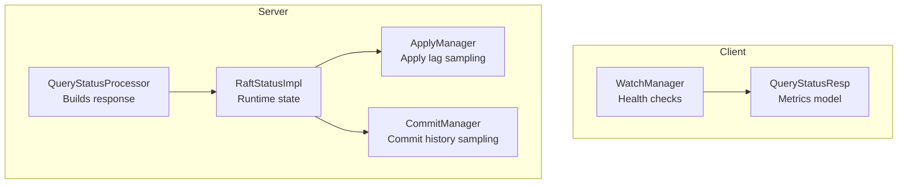
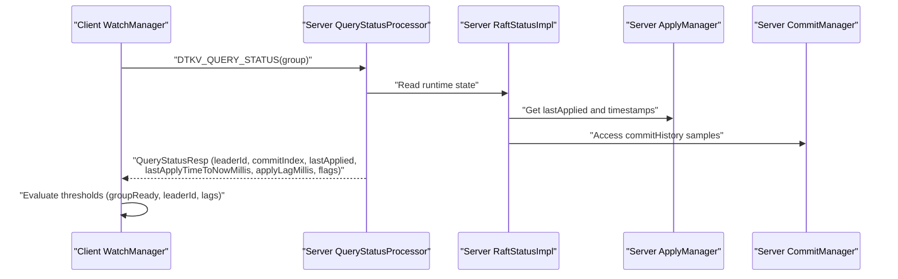
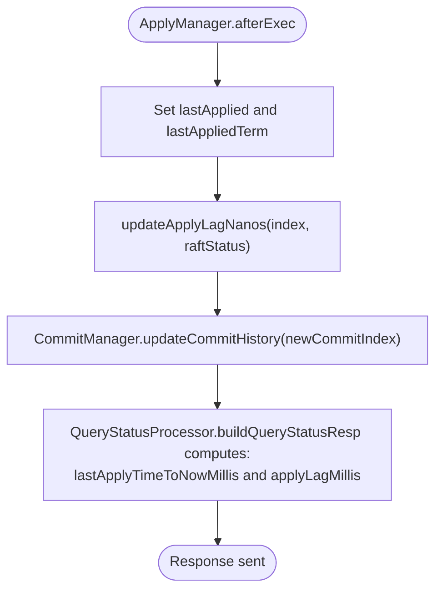
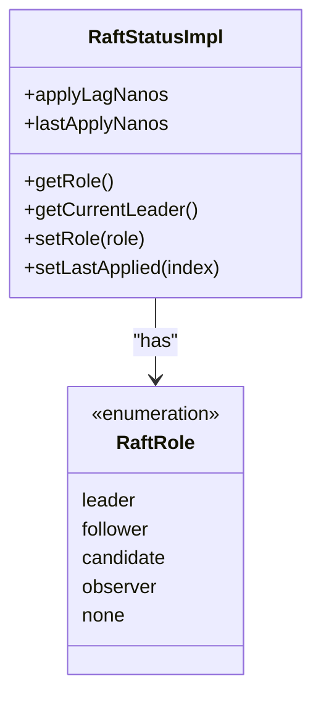
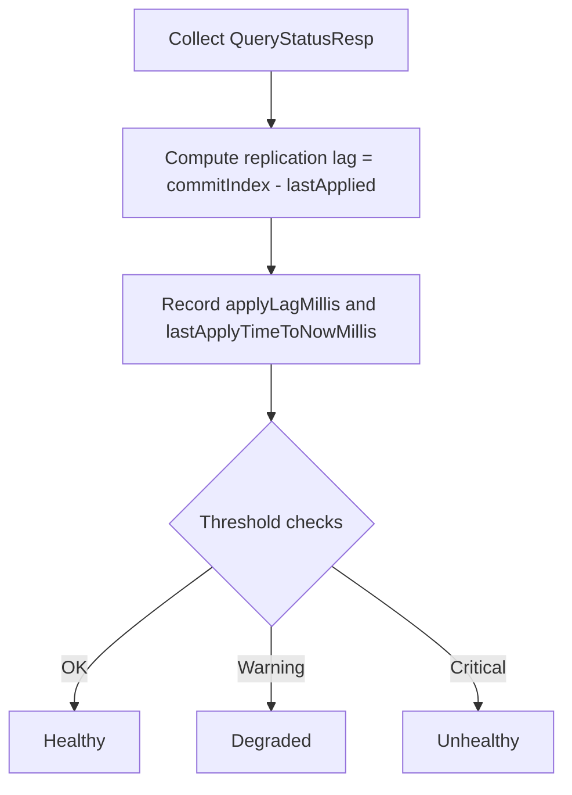
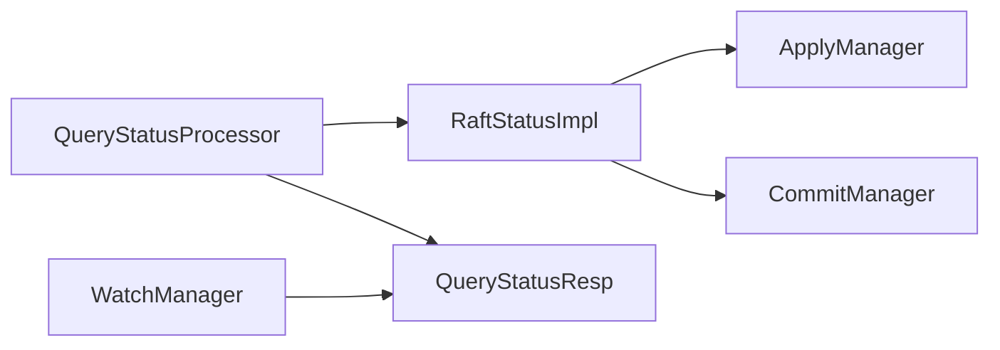

# Key Health Indicators

<cite>
**Referenced Files in This Document**
- [QueryStatusResp.java](file://client/src/main/java/com/github/dtprj/dongting/raft/QueryStatusResp.java)
- [QueryStatusProcessor.java](file://server/src/main/java/com/github/dtprj/dongting/raft/rpc/QueryStatusProcessor.java)
- [RaftStatusImpl.java](file://server/src/main/java/com/github/dtprj/dongting/raft/impl/RaftStatusImpl.java)
- [ApplyManager.java](file://server/src/main/java/com/github/dtprj/dongting/raft/impl/ApplyManager.java)
- [CommitManager.java](file://server/src/main/java/com/github/dtprj/dongting/raft/impl/CommitManager.java)
- [WatchManager.java](file://client/src/main/java/com/github/dtprj/dongting/dtkv/WatchManager.java)
- [RaftRole.java](file://server/src/main/java/com/github/dtprj/dongting/raft/impl/RaftRole.java)
</cite>

## Table of Contents
1. [Introduction](#introduction)
2. [Project Structure](#project-structure)
3. [Core Components](#core-components)
4. [Architecture Overview](#architecture-overview)
5. [Detailed Component Analysis](#detailed-component-analysis)
6. [Dependency Analysis](#dependency-analysis)
7. [Performance Considerations](#performance-considerations)
8. [Troubleshooting Guide](#troubleshooting-guide)
9. [Conclusion](#conclusion)

## Introduction
This document focuses on key cluster health indicators for monitoring RAFT consensus stability. It explains how the QueryStatusResp exposes critical metrics—leader stability (leaderId), replication lag (commitIndex vs lastApplied), application lag (applyLagMillis), and processing delays (lastApplyTimeToNowMillis)—and how clients can interpret these signals to detect anomalies such as leadership transitions, split-brain risks, and degraded performance. It also provides threshold-based monitoring guidance and examples for composing health checks that evaluate multiple indicators together.

## Project Structure
The relevant code spans client and server modules:
- Client-side: QueryStatusResp model and WatchManager health checks
- Server-side: QueryStatusProcessor builds status responses, RaftStatusImpl tracks runtime state, ApplyManager computes lag metrics, and CommitManager samples commit history

**Diagram sources**
- [WatchManager.java](file://client/src/main/java/com/github/dtprj/dongting/dtkv/WatchManager.java#L495-L519)
- [QueryStatusResp.java](file://client/src/main/java/com/github/dtprj/dongting/raft/QueryStatusResp.java#L47-L152)
- [QueryStatusProcessor.java](file://server/src/main/java/com/github/dtprj/dongting/raft/rpc/QueryStatusProcessor.java#L59-L78)
- [RaftStatusImpl.java](file://server/src/main/java/com/github/dtprj/dongting/raft/impl/RaftStatusImpl.java#L70-L120)
- [ApplyManager.java](file://server/src/main/java/com/github/dtprj/dongting/raft/impl/ApplyManager.java#L325-L337)
- [CommitManager.java](file://server/src/main/java/com/github/dtprj/dongting/raft/impl/CommitManager.java#L145-L152)

**Section sources**
- [QueryStatusResp.java](file://client/src/main/java/com/github/dtprj/dongting/raft/QueryStatusResp.java#L47-L152)
- [QueryStatusProcessor.java](file://server/src/main/java/com/github/dtprj/dongting/raft/rpc/QueryStatusProcessor.java#L59-L78)
- [RaftStatusImpl.java](file://server/src/main/java/com/github/dtprj/dongting/raft/impl/RaftStatusImpl.java#L70-L120)
- [ApplyManager.java](file://server/src/main/java/com/github/dtprj/dongting/raft/impl/ApplyManager.java#L325-L337)
- [CommitManager.java](file://server/src/main/java/com/github/dtprj/dongting/raft/impl/CommitManager.java#L145-L152)
- [WatchManager.java](file://client/src/main/java/com/github/dtprj/dongting/dtkv/WatchManager.java#L495-L519)

## Core Components
- QueryStatusResp: The client-facing model containing consensus health metrics, including leaderId, commitIndex, lastApplied, lastApplyTimeToNowMillis, applyLagMillis, and flags indicating initialization and readiness.
- QueryStatusProcessor: Server-side builder that populates QueryStatusResp from RaftStatusImpl, computing derived metrics such as lastApplyTimeToNowMillis and applyLagMillis.
- RaftStatusImpl: Tracks runtime state including lastApplied, lastApplyNanos, applyLagNanos, commitIndex, and groupReady flag.
- ApplyManager: Updates lastApplied and computes applyLagNanos by correlating applied indices with commitHistory samples.
- CommitManager: Samples commitIndex-to-time snapshots to enable lag calculations.
- WatchManager: Client-side health checker that evaluates QueryStatusResp thresholds to decide whether a node is healthy.

**Section sources**
- [QueryStatusResp.java](file://client/src/main/java/com/github/dtprj/dongting/raft/QueryStatusResp.java#L47-L152)
- [QueryStatusProcessor.java](file://server/src/main/java/com/github/dtprj/dongting/raft/rpc/QueryStatusProcessor.java#L59-L78)
- [RaftStatusImpl.java](file://server/src/main/java/com/github/dtprj/dongting/raft/impl/RaftStatusImpl.java#L70-L120)
- [ApplyManager.java](file://server/src/main/java/com/github/dtprj/dongting/raft/impl/ApplyManager.java#L325-L337)
- [CommitManager.java](file://server/src/main/java/com/github/dtprj/dongting/raft/impl/CommitManager.java#L145-L152)
- [WatchManager.java](file://client/src/main/java/com/github/dtprj/dongting/dtkv/WatchManager.java#L495-L519)

## Architecture Overview
The health pipeline:
- Clients periodically query nodes via WatchManager to obtain QueryStatusResp.
- Server responds with QueryStatusResp built from RaftStatusImpl.
- Client interprets thresholds to classify node health.

**Diagram sources**
- [WatchManager.java](file://client/src/main/java/com/github/dtprj/dongting/dtkv/WatchManager.java#L495-L519)
- [QueryStatusProcessor.java](file://server/src/main/java/com/github/dtprj/dongting/raft/rpc/QueryStatusProcessor.java#L59-L78)
- [RaftStatusImpl.java](file://server/src/main/java/com/github/dtprj/dongting/raft/impl/RaftStatusImpl.java#L70-L120)
- [ApplyManager.java](file://server/src/main/java/com/github/dtprj/dongting/raft/impl/ApplyManager.java#L325-L337)
- [CommitManager.java](file://server/src/main/java/com/github/dtprj/dongting/raft/impl/CommitManager.java#L145-L152)

## Detailed Component Analysis

### QueryStatusResp Metrics and Interpretation
- leaderId: Non-zero indicates a current leader; zero suggests no leader or leadership not yet determined.
- commitIndex vs lastApplied: Replication lag; divergence indicates followers falling behind or slow application.
- lastApplyTimeToNowMillis: Processing delay; indicates how long it has been since lastApplied was updated.
- applyLagMillis: Application lag; computed from commitHistory samples to estimate time from commit to application.
- isGroupReady flag: Indicates whether the group has reached operational readiness.

How these map to stability:
- Leader stability: A healthy leaderId should remain stable across queries. Frequent leaderId changes suggest frequent elections or split-brain symptoms.
- Replication lag: Consistent divergence between commitIndex and lastApplied implies slow followers or disk/backlog issues.
- Application lag: Rising applyLagMillis combined with rising lastApplyTimeToNowMillis indicates state machine slowdowns.
- Group readiness: isGroupReady should be true for healthy nodes; false indicates initialization or configuration issues.

Threshold guidance:
- applyLagMillis > 15 seconds (as used in WatchManager): signals unhealthy application latency.
- lastApplyTimeToNowMillis > 15 seconds: indicates the node has not applied recent commits recently.
- leaderId <= 0: indicates no leader or leadership not established.
- isGroupReady == false: indicates the group is not ready.

**Section sources**
- [QueryStatusResp.java](file://client/src/main/java/com/github/dtprj/dongting/raft/QueryStatusResp.java#L47-L152)
- [QueryStatusProcessor.java](file://server/src/main/java/com/github/dtprj/dongting/raft/rpc/QueryStatusProcessor.java#L59-L78)
- [WatchManager.java](file://client/src/main/java/com/github/dtprj/dongting/dtkv/WatchManager.java#L501-L519)

### Server-Side Metric Computation
- lastApplyTimeToNowMillis: Computed as elapsed wall-clock time since lastApplyNanos.
- applyLagMillis: Derived from commitHistory samples; when an applied index matches a committed index sample, applyLagNanos equals elapsed nanoseconds, converted to milliseconds.
- commitIndex and lastApplied: Updated during commit and apply phases respectively.

**Diagram sources**
- [ApplyManager.java](file://server/src/main/java/com/github/dtprj/dongting/raft/impl/ApplyManager.java#L275-L337)
- [CommitManager.java](file://server/src/main/java/com/github/dtprj/dongting/raft/impl/CommitManager.java#L145-L152)
- [QueryStatusProcessor.java](file://server/src/main/java/com/github/dtprj/dongting/raft/rpc/QueryStatusProcessor.java#L59-L78)

**Section sources**
- [ApplyManager.java](file://server/src/main/java/com/github/dtprj/dongting/raft/impl/ApplyManager.java#L275-L337)
- [CommitManager.java](file://server/src/main/java/com/github/dtprj/dongting/raft/impl/CommitManager.java#L145-L152)
- [QueryStatusProcessor.java](file://server/src/main/java/com/github/dtprj/dongting/raft/rpc/QueryStatusProcessor.java#L59-L78)

### Role Field and Leadership Elections
- role: Exposed via RaftStatusImpl and used to infer leadership context. While not directly part of QueryStatusResp, it underpins leadership transitions.
- leaderId: Populated from RaftStatusImpl.getCurrentLeader().node.nodeId; zero when no leader.
- Practical implication: Frequent changes in leaderId across short intervals often indicate unstable elections or split-brain conditions.

**Diagram sources**
- [RaftStatusImpl.java](file://server/src/main/java/com/github/dtprj/dongting/raft/impl/RaftStatusImpl.java#L223-L256)
- [RaftRole.java](file://server/src/main/java/com/github/dtprj/dongting/raft/impl/RaftRole.java#L18-L24)

**Section sources**
- [RaftStatusImpl.java](file://server/src/main/java/com/github/dtprj/dongting/raft/impl/RaftStatusImpl.java#L223-L256)
- [RaftRole.java](file://server/src/main/java/com/github/dtprj/dongting/raft/impl/RaftRole.java#L18-L24)
- [QueryStatusProcessor.java](file://server/src/main/java/com/github/dtprj/dongting/raft/rpc/QueryStatusProcessor.java#L59-L78)

### Threshold-Based Monitoring and Health Checks
- WatchManager’s isQueryStatusOk enforces:
  - isGroupReady == true
  - leaderId > 0
  - lastApplyTimeToNowMillis <= 15_000 ms
  - applyLagMillis <= 15_000 ms
- These thresholds can be adapted for broader monitoring:
  - Immediate alerts: applyLagMillis > 15_000 ms or lastApplyTimeToNowMillis > 15_000 ms
  - Degradation warnings: applyLagMillis > 5_000 ms or lastApplyTimeToNowMillis > 5_000 ms
  - Leadership instability: monitor leaderId changes over short windows
  - Readiness: ensure isGroupReady remains true

Health check composition example (conceptual):
- For each node, collect QueryStatusResp and compute:
  - Replication lag = commitIndex - lastApplied
  - Application lag = applyLagMillis
  - Processing delay = lastApplyTimeToNowMillis
  - Leader presence = leaderId > 0
  - Readiness = isGroupReady
- Aggregate:
  - Overall health = all indicators within thresholds AND leaderId stable over N samples
  - Partial health = readiness true, leader present, but one or more lags exceed warning thresholds
  - Unhealthy = readiness false, leaderId <= 0, or any lag exceeds critical thresholds

**Diagram sources**
- [WatchManager.java](file://client/src/main/java/com/github/dtprj/dongting/dtkv/WatchManager.java#L501-L519)
- [QueryStatusResp.java](file://client/src/main/java/com/github/dtprj/dongting/raft/QueryStatusResp.java#L47-L152)

**Section sources**
- [WatchManager.java](file://client/src/main/java/com/github/dtprj/dongting/dtkv/WatchManager.java#L501-L519)
- [QueryStatusResp.java](file://client/src/main/java/com/github/dtprj/dongting/raft/QueryStatusResp.java#L47-L152)

## Dependency Analysis
- QueryStatusProcessor depends on RaftStatusImpl to populate QueryStatusResp.
- ApplyManager updates lastApplied and triggers applyLagNanos computation.
- CommitManager maintains commitHistory samples used to compute applyLagMillis.
- WatchManager consumes QueryStatusResp to decide node health.

**Diagram sources**
- [QueryStatusProcessor.java](file://server/src/main/java/com/github/dtprj/dongting/raft/rpc/QueryStatusProcessor.java#L59-L78)
- [RaftStatusImpl.java](file://server/src/main/java/com/github/dtprj/dongting/raft/impl/RaftStatusImpl.java#L70-L120)
- [ApplyManager.java](file://server/src/main/java/com/github/dtprj/dongting/raft/impl/ApplyManager.java#L325-L337)
- [CommitManager.java](file://server/src/main/java/com/github/dtprj/dongting/raft/impl/CommitManager.java#L145-L152)
- [WatchManager.java](file://client/src/main/java/com/github/dtprj/dongting/dtkv/WatchManager.java#L495-L519)
- [QueryStatusResp.java](file://client/src/main/java/com/github/dtprj/dongting/raft/QueryStatusResp.java#L47-L152)

**Section sources**
- [QueryStatusProcessor.java](file://server/src/main/java/com/github/dtprj/dongting/raft/rpc/QueryStatusProcessor.java#L59-L78)
- [RaftStatusImpl.java](file://server/src/main/java/com/github/dtprj/dongting/raft/impl/RaftStatusImpl.java#L70-L120)
- [ApplyManager.java](file://server/src/main/java/com/github/dtprj/dongting/raft/impl/ApplyManager.java#L325-L337)
- [CommitManager.java](file://server/src/main/java/com/github/dtprj/dongting/raft/impl/CommitManager.java#L145-L152)
- [WatchManager.java](file://client/src/main/java/com/github/dtprj/dongting/dtkv/WatchManager.java#L495-L519)
- [QueryStatusResp.java](file://client/src/main/java/com/github/dtprj/dongting/raft/QueryStatusResp.java#L47-L152)

## Performance Considerations
- Sampling cadence: applyLagMillis relies on commitHistory samples taken approximately once per second; ensure monitoring intervals align with this cadence.
- Latency sources: applyLagMillis reflects state machine execution time; high values may indicate CPU-bound state machines, disk I/O bottlenecks, or excessive transaction sizes.
- Network overhead: QueryStatusResp is small; frequent polling is acceptable but should be tuned to avoid unnecessary load.

[No sources needed since this section provides general guidance]

## Troubleshooting Guide
Common issues and signals:
- No leader: leaderId <= 0; investigate network partitions, quorum loss, or misconfiguration.
- Split-brain risk: frequent leaderId changes; check network partitions and ensure majority connectivity.
- Slow application: rising applyLagMillis and lastApplyTimeToNowMillis; inspect state machine throughput and disk performance.
- Stalled replication: diverging commitIndex and lastApplied; check follower disk or network issues.

Operational tips:
- Use isGroupReady to confirm the group is operational before evaluating other metrics.
- Track trends over time rather than isolated readings to distinguish transient spikes from persistent problems.
- Correlate node-level health with cluster-wide metrics (e.g., leaderId stability across nodes).

**Section sources**
- [WatchManager.java](file://client/src/main/java/com/github/dtprj/dongting/dtkv/WatchManager.java#L501-L519)
- [QueryStatusResp.java](file://client/src/main/java/com/github/dtprj/dongting/raft/QueryStatusResp.java#L47-L152)

## Conclusion
QueryStatusResp provides a concise yet powerful set of indicators for RAFT consensus health. By monitoring leaderId stability, replication lag, and application lag alongside processing delays, operators can quickly detect leadership churn, split-brain risks, and performance degradation. Threshold-based checks grounded in the existing WatchManager logic offer a practical starting point for robust cluster monitoring.