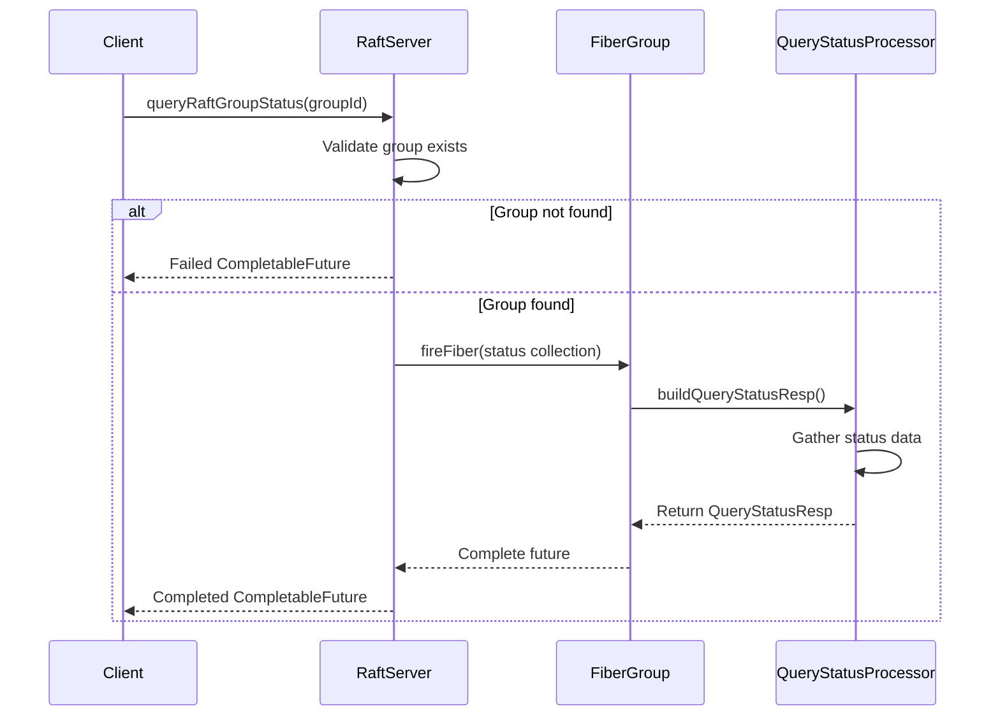
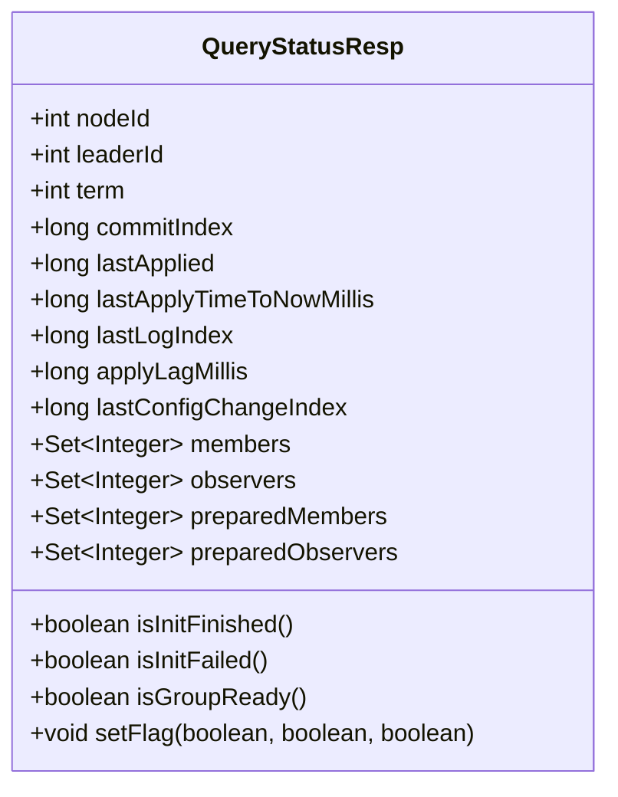
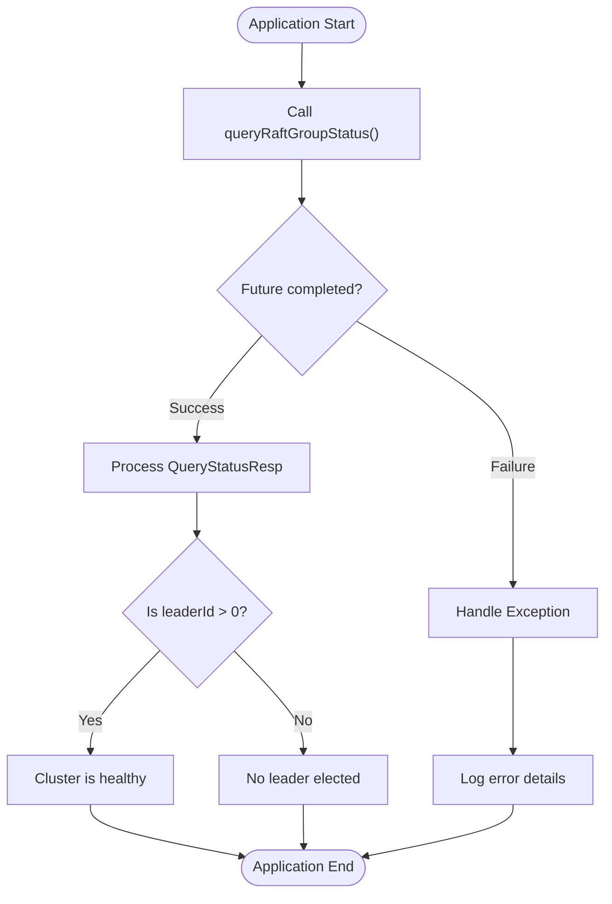
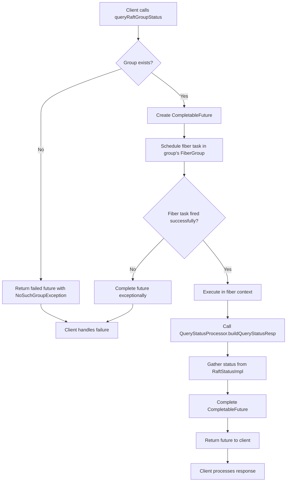
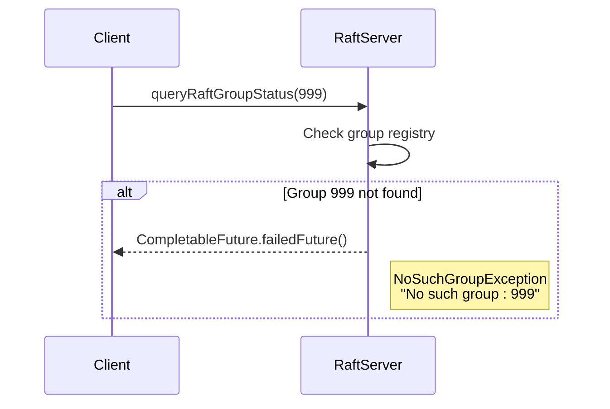
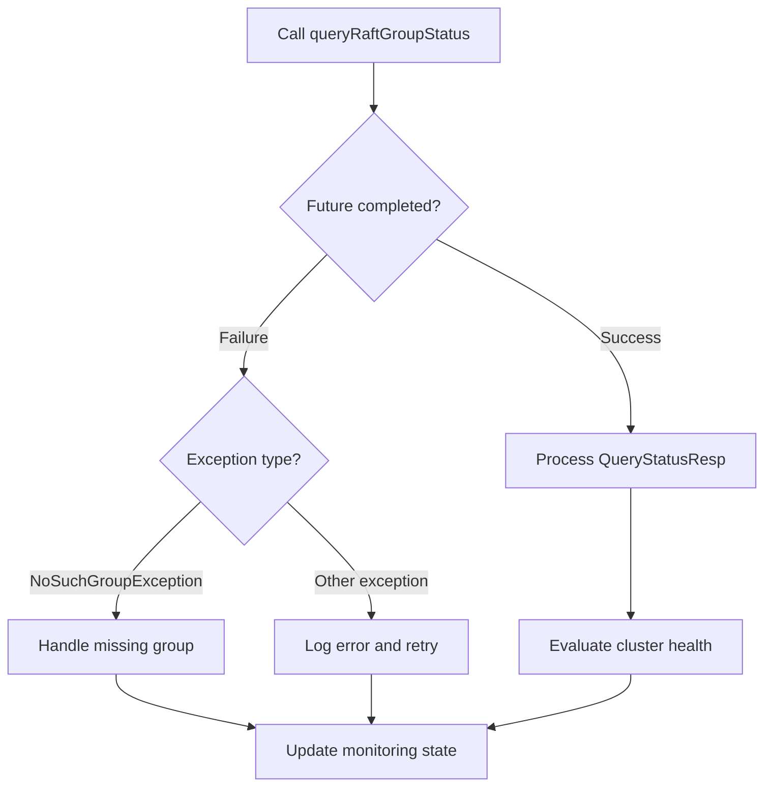
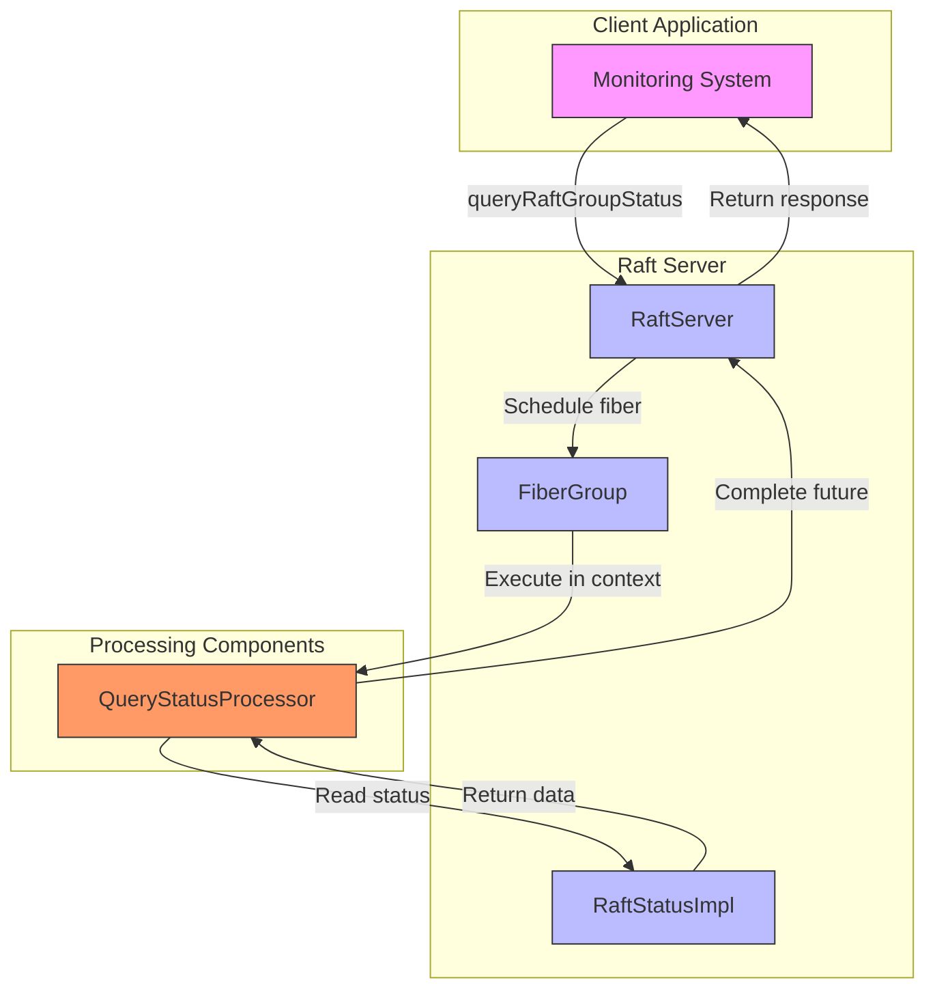

# Query Status API

<cite>
**Referenced Files in This Document**   
- [RaftServer.java](file://server/src/main/java/com/github/dtprj/dongting/raft/server/RaftServer.java)
- [QueryStatusResp.java](file://client/src/main/java/com/github/dtprj/dongting/raft/QueryStatusResp.java)
- [QueryStatusProcessor.java](file://server/src/main/java/com/github/dtprj/dongting/raft/rpc/QueryStatusProcessor.java)
- [NoSuchGroupException.java](file://client/src/main/java/com/github/dtprj/dongting/raft/NoSuchGroupException.java)
</cite>

## Table of Contents
1. [Introduction](#introduction)
2. [API Overview](#api-overview)
3. [QueryStatusResp Data Model](#querystatusresp-data-model)
4. [Usage Examples](#usage-examples)
5. [Processing Flow](#processing-flow)
6. [Error Handling](#error-handling)
7. [Architecture Overview](#architecture-overview)

## Introduction
The queryRaftGroupStatus API provides a mechanism for programmatically monitoring the health and status of RAFT consensus groups within the Dongting distributed system. This API enables administrators and monitoring systems to retrieve comprehensive status information about any RAFT group, including leadership state, replication progress, and member configuration. The API is designed to be non-intrusive and can be called even when a group is not fully initialized, making it suitable for both operational monitoring and diagnostic purposes.

**Section sources**
- [RaftServer.java](file://server/src/main/java/com/github/dtprj/dongting/raft/server/RaftServer.java#L696-L717)

## API Overview
The queryRaftGroupStatus API is exposed as a public method in the RaftServer class, which serves as the central coordination point for all RAFT groups in a server instance. The method signature is:

```java
public CompletableFuture<QueryStatusResp> queryRaftGroupStatus(int groupId)
```

This method takes a groupId parameter and returns a CompletableFuture that will be completed with a QueryStatusResp object containing detailed status information about the specified RAFT group. The API is designed to be asynchronous to avoid blocking the calling thread, which is particularly important in distributed systems where network operations and coordination tasks can introduce latency.

The method first checks if the specified group exists in the server's group registry. If the group does not exist, it immediately returns a failed future with a NoSuchGroupException. If the group exists, the method schedules a fiber task to gather the status information, ensuring that the status collection occurs within the appropriate fiber execution context for thread safety and consistency.



**Diagram sources**
- [RaftServer.java](file://server/src/main/java/com/github/dtprj/dongting/raft/server/RaftServer.java#L696-L717)
- [QueryStatusProcessor.java](file://server/src/main/java/com/github/dtprj/dongting/raft/rpc/QueryStatusProcessor.java#L59-L77)

**Section sources**
- [RaftServer.java](file://server/src/main/java/com/github/dtprj/dongting/raft/server/RaftServer.java#L696-L717)

## QueryStatusResp Data Model
The QueryStatusResp class represents the response data structure returned by the queryRaftGroupStatus API. It contains comprehensive information about the state of a RAFT group, enabling detailed health monitoring and diagnostics.



**Diagram sources**
- [QueryStatusResp.java](file://client/src/main/java/com/github/dtprj/dongting/raft/QueryStatusResp.java#L63-L71)

**Section sources**
- [QueryStatusResp.java](file://client/src/main/java/com/github/dtprj/dongting/raft/QueryStatusResp.java#L63-L71)

### Core Status Fields
The QueryStatusResp data model includes several key fields that provide insight into the health and operation of a RAFT group:

- **role**: The current role of the node within the RAFT group (leader, follower, candidate, or none)
- **term**: The current RAFT term, which indicates the current leadership period
- **commitIndex**: The highest log index known to be committed across the majority of the group
- **lastApplied**: The highest log index that has been applied to the state machine
- **leaderId**: The node ID of the current leader, or 0 if no leader is elected
- **applyLagMillis**: The time delay between when a log entry is committed and when it is applied to the state machine

### Member State Information
The response includes detailed information about the membership configuration of the RAFT group:

- **members**: The set of node IDs that are current voting members of the group
- **observers**: The set of node IDs that are current non-voting observers of the group
- **preparedMembers**: The set of node IDs that are in the process of being added or removed as voting members
- **preparedObservers**: The set of node IDs that are in the process of being added or removed as non-voting observers
- **lastConfigChangeIndex**: The log index of the last configuration change

### Health Flags
The response uses a flag field to encode several boolean health indicators:

- **initFinished**: Indicates whether the group initialization process has completed
- **initFailed**: Indicates whether the group initialization process failed
- **groupReady**: Indicates whether the group is ready to serve requests

These flags are implemented using bit masking within a single integer field for efficiency.

**Section sources**
- [QueryStatusResp.java](file://client/src/main/java/com/github/dtprj/dongting/raft/QueryStatusResp.java#L78-L108)

## Usage Examples
The queryRaftGroupStatus API can be used in various scenarios for cluster health monitoring and operational management. The following examples demonstrate common usage patterns.

### Asynchronous Status Check
The most common usage pattern is to asynchronously retrieve the status of a RAFT group and process the response:



**Diagram sources**
- [RaftServer.java](file://server/src/main/java/com/github/dtprj/dongting/raft/server/RaftServer.java#L696-L717)

**Section sources**
- [RaftServer.java](file://server/src/main/java/com/github/dtprj/dongting/raft/server/RaftServer.java#L696-L717)

### Health Monitoring Implementation
A practical implementation of cluster health monitoring might look like:

```java
raftServer.queryRaftGroupStatus(groupId)
    .thenAccept(status -> {
        if (status.isGroupReady() && status.leaderId > 0) {
            long applyLag = status.applyLagMillis;
            if (applyLag < 1000) {
                // Healthy with minimal lag
                metrics.incrementHealthyCounter();
            } else {
                // Warning: increased apply lag
                metrics.incrementDegradedCounter();
                logger.warn("Increased apply lag: {}ms for group {}", applyLag, groupId);
            }
        } else {
            // Unhealthy: no leader or group not ready
            metrics.incrementUnhealthyCounter();
            logger.error("Group {} is not healthy: ready={}, leaderId={}", 
                groupId, status.isGroupReady(), status.leaderId);
        }
    })
    .exceptionally(throwable -> {
        logger.error("Failed to query status for group {}", groupId, throwable);
        metrics.incrementErrorCounter();
        return null;
    });
```

**Section sources**
- [RaftServer.java](file://server/src/main/java/com/github/dtprj/dongting/raft/server/RaftServer.java#L696-L717)
- [QueryStatusResp.java](file://client/src/main/java/com/github/dtprj/dongting/raft/QueryStatusResp.java#L63-L71)

## Processing Flow
The queryRaftGroupStatus API follows a specific processing flow that ensures thread safety and consistency when retrieving RAFT group status.



**Diagram sources**
- [RaftServer.java](file://server/src/main/java/com/github/dtprj/dongting/raft/server/RaftServer.java#L696-L717)
- [QueryStatusProcessor.java](file://server/src/main/java/com/github/dtprj/dongting/raft/rpc/QueryStatusProcessor.java#L59-L77)

**Section sources**
- [RaftServer.java](file://server/src/main/java/com/github/dtprj/dongting/raft/server/RaftServer.java#L696-L717)

The processing flow begins when a client calls the queryRaftGroupStatus method with a specific groupId. The RaftServer first checks if the group exists in its registry. If the group does not exist, it immediately returns a failed future with a NoSuchGroupException.

If the group exists, the method creates a new CompletableFuture and attempts to schedule a fiber task within the group's FiberGroup. This ensures that the status collection occurs within the same execution context as other operations for that group, maintaining thread safety and consistency.

The fiber task calls the static buildQueryStatusResp method on QueryStatusProcessor, which gathers the current status information from the RaftStatusImpl instance associated with the group. Once the status is collected, the CompletableFuture is completed with the QueryStatusResp object.

## Error Handling
The queryRaftGroupStatus API implements robust error handling to address various failure scenarios that may occur during status retrieval.

### NoSuchGroupException
When a client requests the status of a non-existent group, the API returns a failed future with a NoSuchGroupException:



**Diagram sources**
- [RaftServer.java](file://server/src/main/java/com/github/dtprj/dongting/raft/server/RaftServer.java#L698-L700)
- [NoSuchGroupException.java](file://client/src/main/java/com/github/dtprj/dongting/raft/NoSuchGroupException.java#L24-L27)

The NoSuchGroupException is thrown when the specified groupId does not correspond to any active RAFT group on the server. This exception extends RaftException and provides a clear error message indicating which group was not found.

### Fiber Scheduling Failure
In rare cases, the fiber scheduling might fail, in which case the API also completes the future exceptionally with a NoSuchGroupException:

```java
if (!g.fiberGroup.fireFiber("queryStatus", new FiberFrame<>() {
    // ...
})) {
    f.completeExceptionally(new NoSuchGroupException(groupId));
}
```

This design choice ensures consistent error handling regardless of whether the group doesn't exist or the fiber cannot be scheduled.

### Client-Side Error Handling
Clients should implement appropriate error handling when using the API:



**Diagram sources**
- [RaftServer.java](file://server/src/main/java/com/github/dtprj/dongting/raft/server/RaftServer.java#L696-L717)
- [NoSuchGroupException.java](file://client/src/main/java/com/github/dtprj/dongting/raft/NoSuchGroupException.java#L24-L27)

**Section sources**
- [RaftServer.java](file://server/src/main/java/com/github/dtprj/dongting/raft/server/RaftServer.java#L696-L717)
- [NoSuchGroupException.java](file://client/src/main/java/com/github/dtprj/dongting/raft/NoSuchGroupException.java#L24-L27)

## Architecture Overview
The queryRaftGroupStatus API is integrated into the overall architecture of the Dongting RAFT implementation, connecting various components to provide comprehensive cluster health monitoring.



**Diagram sources**
- [RaftServer.java](file://server/src/main/java/com/github/dtprj/dongting/raft/server/RaftServer.java#L696-L717)
- [QueryStatusProcessor.java](file://server/src/main/java/com/github/dtprj/dongting/raft/rpc/QueryStatusProcessor.java#L59-L77)
- [QueryStatusResp.java](file://client/src/main/java/com/github/dtprj/dongting/raft/QueryStatusResp.java#L63-L71)

**Section sources**
- [RaftServer.java](file://server/src/main/java/com/github/dtprj/dongting/raft/server/RaftServer.java#L696-L717)

The architecture demonstrates how the queryRaftGroupStatus API integrates with the fiber-based execution model of the Dongting system. The API serves as an entry point that bridges external monitoring systems with the internal RAFT state, enabling comprehensive health checks without compromising the system's performance or consistency guarantees.

The use of CompletableFuture allows for non-blocking operation, while the fiber execution context ensures that status collection occurs safely within the appropriate thread context. This design enables efficient, scalable cluster monitoring that can be integrated into larger operational tooling and alerting systems.