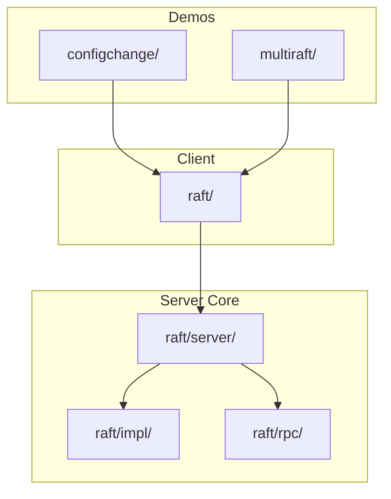
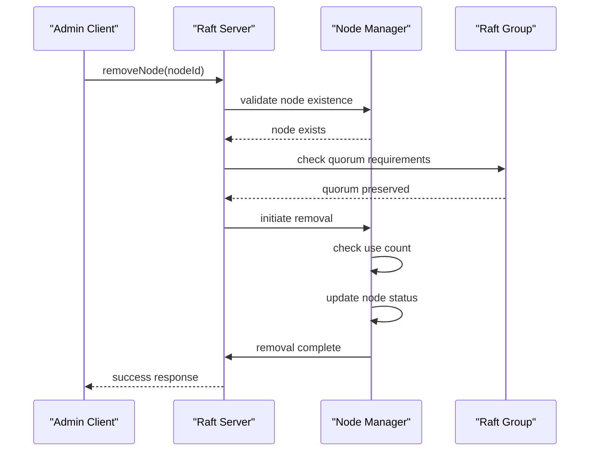
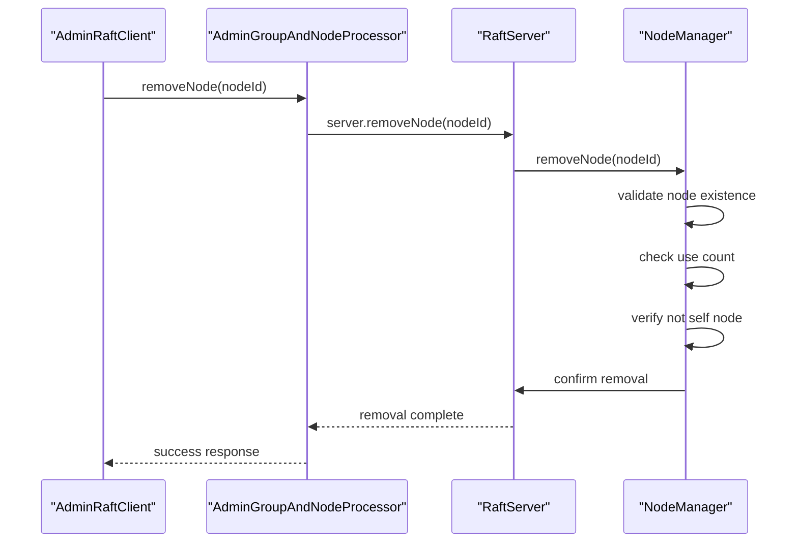
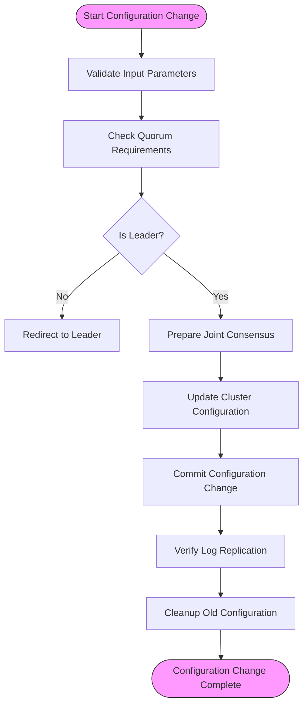
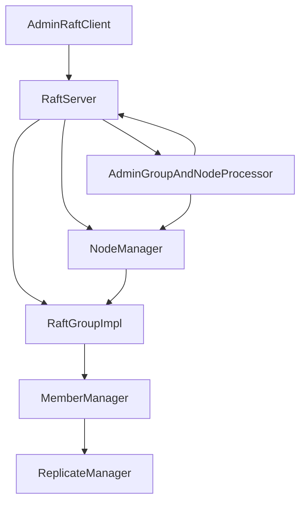

# Cluster Contraction

<cite>
**Referenced Files in This Document**   
- [NodeManager.java](file://server/src/main/java/com/github/dtprj/dongting/raft/impl/NodeManager.java)
- [AdminGroupAndNodeProcessor.java](file://server/src/main/java/com/github/dtprj/dongting/raft/rpc/AdminGroupAndNodeProcessor.java)
- [RaftServer.java](file://server/src/main/java/com/github/dtprj/dongting/raft/server/RaftServer.java)
- [AdminRaftClient.java](file://server/src/main/java/com/github/dtprj/dongting/raft/admin/AdminRaftClient.java)
- [ConfigChangeTest.java](file://server/src/test/java/com/github/dtprj/dongting/raft/server/ConfigChangeTest.java)
- [ChangeTo234Client.java](file://demos/src/main/java/com/github/dtprj/dongting/demos/configchange/ChangeTo234Client.java)
- [RemoveGroup103Demo.java](file://demos/src/main/java/com/github/dtprj/dongting/demos/multiraft/RemoveGroup103Demo.java)
</cite>

## Table of Contents
1. [Introduction](#introduction)
2. [Project Structure](#project-structure)
3. [Core Components](#core-components)
4. [Architecture Overview](#architecture-overview)
5. [Detailed Component Analysis](#detailed-component-analysis)
6. [Dependency Analysis](#dependency-analysis)
7. [Performance Considerations](#performance-considerations)
8. [Troubleshooting Guide](#troubleshooting-guide)
9. [Conclusion](#conclusion)

## Introduction
This document provides comprehensive guidance on safely removing nodes from a RAFT cluster using the Dongting framework. It covers the removeNode API usage, quorum preservation requirements, and the process of gracefully decommissioning nodes while maintaining cluster stability. The document explains the difference between temporary node removal and permanent decommissioning, and the impact on consensus performance. Examples from the multi-raft demos show proper node removal procedures, including guidance on verifying cluster health after contraction and handling edge cases such as removing leader nodes. Best practices for maintenance windows, backup procedures before node removal, and monitoring cluster stability post-contraction are also addressed.

## Project Structure
The Dongting project structure includes several key directories relevant to cluster contraction:
- **demos/**: Contains example implementations including configchange and multiraft demos
- **server/**: Contains the core RAFT implementation with node management and configuration change functionality
- **client/**: Provides client-side components for interacting with the RAFT cluster

The cluster contraction functionality is primarily implemented in the server module, with demonstration code in the demos directory.

**Diagram sources**
- [ChangeTo234Client.java](file://demos/src/main/java/com/github/dtprj/dongting/demos/configchange/ChangeTo234Client.java)
- [RemoveGroup103Demo.java](file://demos/src/main/java/com/github/dtprj/dongting/demos/multiraft/RemoveGroup103Demo.java)
- [RaftServer.java](file://server/src/main/java/com/github/dtprj/dongting/raft/server/RaftServer.java)

**Section sources**
- [demos/](file://demos/)
- [server/](file://server/)

## Core Components
The cluster contraction functionality in Dongting is built around several core components that work together to safely remove nodes from a RAFT cluster. The NodeManager class is responsible for managing the lifecycle of nodes within the cluster, including adding and removing nodes. The AdminGroupAndNodeProcessor handles administrative requests for node and group management, while the RaftServer class provides the main interface for cluster operations.

The removeNode API is implemented through a coordinated process that ensures quorum preservation and cluster stability. When a node removal is initiated, the system first verifies that the operation will not violate quorum requirements, then proceeds with a graceful decommissioning process that allows the cluster to maintain consensus throughout the operation.

**Section sources**
- [NodeManager.java](file://server/src/main/java/com/github/dtprj/dongting/raft/impl/NodeManager.java)
- [AdminGroupAndNodeProcessor.java](file://server/src/main/java/com/github/dtprj/dongting/raft/rpc/AdminGroupAndNodeProcessor.java)
- [RaftServer.java](file://server/src/main/java/com/github/dtprj/dongting/raft/server/RaftServer.java)

## Architecture Overview
The cluster contraction architecture in Dongting follows a well-defined process to ensure safe node removal while maintaining cluster stability. The system uses a two-phase approach for configuration changes, similar to the RAFT joint consensus algorithm, to prevent split-brain scenarios and ensure continuous availability.

**Diagram sources**
- [RaftServer.java](file://server/src/main/java/com/github/dtprj/dongting/raft/server/RaftServer.java)
- [NodeManager.java](file://server/src/main/java/com/github/dtprj/dongting/raft/impl/NodeManager.java)

## Detailed Component Analysis

### Node Removal Process Analysis
The node removal process in Dongting is designed to ensure cluster stability and data consistency. The process begins with the AdminRaftClient initiating a removeNode request, which is then processed by the AdminGroupAndNodeProcessor. The NodeManager performs validation checks to ensure the node can be safely removed.

#### For API/Service Components:

**Diagram sources**
- [AdminRaftClient.java](file://server/src/main/java/com/github/dtprj/dongting/raft/admin/AdminRaftClient.java)
- [AdminGroupAndNodeProcessor.java](file://server/src/main/java/com/github/dtprj/dongting/raft/rpc/AdminGroupAndNodeProcessor.java)
- [NodeManager.java](file://server/src/main/java/com/github/dtprj/dongting/raft/impl/NodeManager.java)

**Section sources**
- [AdminRaftClient.java](file://server/src/main/java/com/github/dtprj/dongting/raft/admin/AdminRaftClient.java)
- [AdminGroupAndNodeProcessor.java](file://server/src/main/java/com/github/dtprj/dongting/raft/rpc/AdminGroupAndNodeProcessor.java)
- [NodeManager.java](file://server/src/main/java/com/github/dtprj/dongting/raft/impl/NodeManager.java)

### Configuration Change Process
The configuration change process in Dongting follows the RAFT joint consensus algorithm to ensure safe cluster reconfiguration. This process involves two phases: preparation and commitment. During the preparation phase, the cluster enters a joint consensus state where both old and new configurations are active. Only after this state is established does the cluster commit to the new configuration.

#### For Complex Logic Components:

**Diagram sources**
- [RaftServer.java](file://server/src/main/java/com/github/dtprj/dongting/raft/server/RaftServer.java)
- [ConfigChangeTest.java](file://server/src/test/java/com/github/dtprj/dongting/raft/server/ConfigChangeTest.java)

**Section sources**
- [RaftServer.java](file://server/src/main/java/com/github/dtprj/dongting/raft/server/RaftServer.java)
- [ConfigChangeTest.java](file://server/src/test/java/com/github/dtprj/dongting/raft/server/ConfigChangeTest.java)

## Dependency Analysis
The cluster contraction functionality depends on several key components working together in a coordinated manner. The AdminRaftClient depends on the RaftServer for executing administrative commands, which in turn depends on the NodeManager for node lifecycle management. The NodeManager also depends on the RaftGroup components to ensure quorum requirements are met during node removal operations.

**Diagram sources**
- [RaftServer.java](file://server/src/main/java/com/github/dtprj/dongting/raft/server/RaftServer.java)
- [NodeManager.java](file://server/src/main/java/com/github/dtprj/dongting/raft/impl/NodeManager.java)
- [AdminGroupAndNodeProcessor.java](file://server/src/main/java/com/github/dtprj/dongting/raft/rpc/AdminGroupAndNodeProcessor.java)

**Section sources**
- [RaftServer.java](file://server/src/main/java/com/github/dtprj/dongting/raft/server/RaftServer.java)
- [NodeManager.java](file://server/src/main/java/com/github/dtprj/dongting/raft/impl/NodeManager.java)
- [AdminGroupAndNodeProcessor.java](file://server/src/main/java/com/github/dtprj/dongting/raft/rpc/AdminGroupAndNodeProcessor.java)

## Performance Considerations
Cluster contraction operations can impact consensus performance, particularly during the configuration change process. The joint consensus phase requires additional coordination between nodes, which can increase latency for write operations. To minimize performance impact, it is recommended to perform node removal operations during maintenance windows when possible.

The NodeManager maintains a use count for each node to prevent premature removal of nodes that are still in use by active RAFT groups. This ensures that nodes are only removed when they are no longer needed, preventing potential data loss or service disruption.

## Troubleshooting Guide
When troubleshooting node removal operations, several common issues may arise:

1. **Quorum violation**: Attempting to remove a node that would reduce the cluster below quorum requirements
2. **Node in use**: Trying to remove a node that is still part of active RAFT groups
3. **Leader node removal**: Attempting to remove the current leader without first transferring leadership
4. **Network connectivity issues**: Problems with node communication during the removal process

The system provides diagnostic information through the queryRaftServerStatus API, which can be used to verify cluster health before and after node removal operations. Additionally, the listNodes and listGroups administrative commands can be used to verify the current cluster configuration.

**Section sources**
- [ConfigChangeTest.java](file://server/src/test/java/com/github/dtprj/dongting/raft/server/ConfigChangeTest.java)
- [ChangeTo234Client.java](file://demos/src/main/java/com/github/dtprj/dongting/demos/configchange/ChangeTo234Client.java)
- [RemoveGroup103Demo.java](file://demos/src/main/java/com/github/dtprj/dongting/demos/multiraft/RemoveGroup103Demo.java)

## Conclusion
The Dongting framework provides a robust and safe mechanism for cluster contraction through its well-designed node removal process. By following the RAFT joint consensus algorithm and implementing proper validation checks, the system ensures that nodes can be safely removed from the cluster without compromising data consistency or availability.

Key best practices for cluster contraction include:
- Always verify cluster health before and after node removal operations
- Transfer leadership away from the node being removed when possible
- Perform operations during maintenance windows to minimize performance impact
- Use the administrative APIs to verify the success of configuration changes
- Monitor cluster stability post-contraction to ensure proper operation

The examples in the demos directory provide practical guidance on implementing these procedures, making it easier for operators to safely manage cluster size and composition.