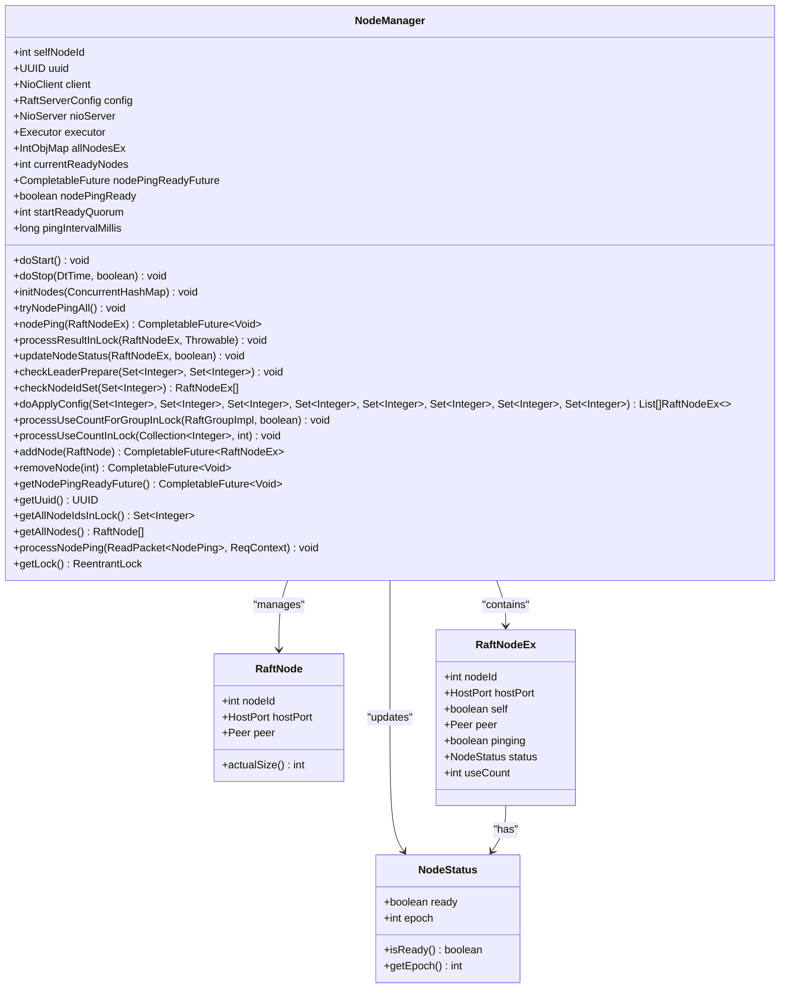
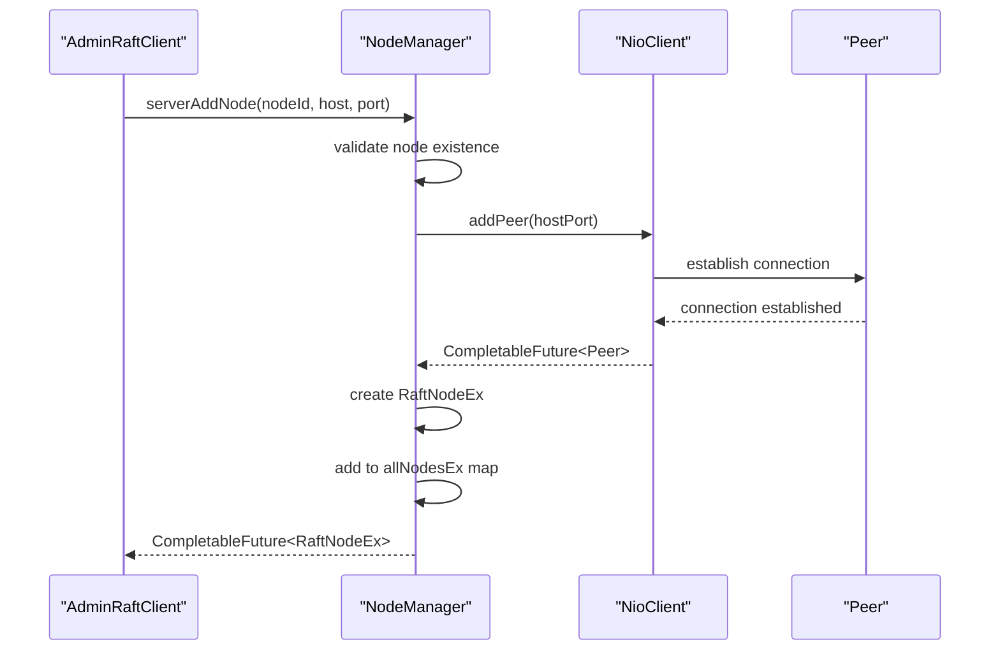
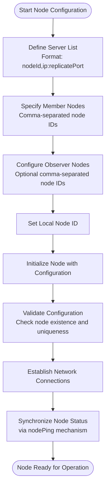
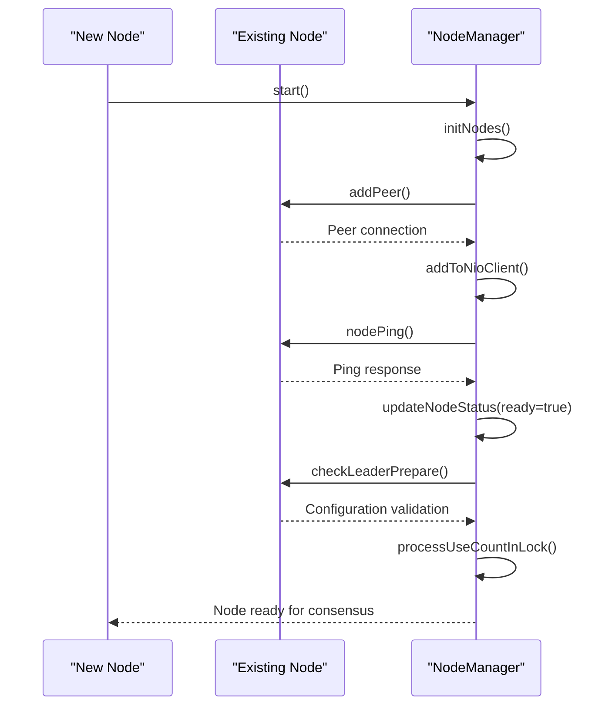
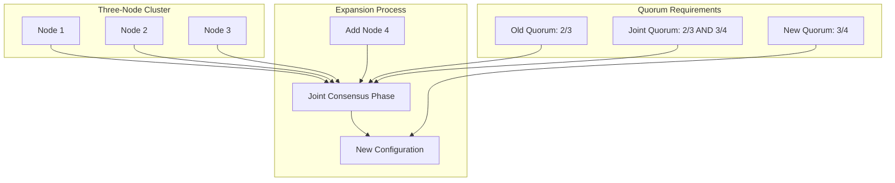
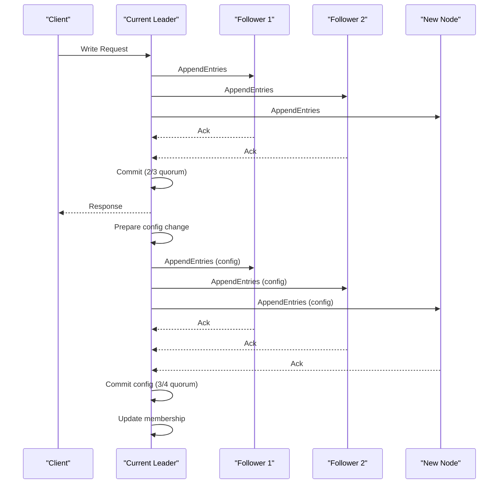
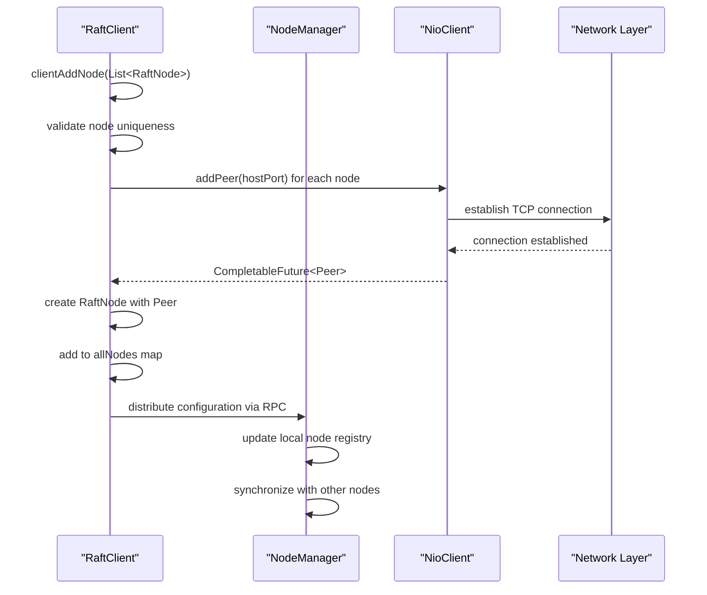
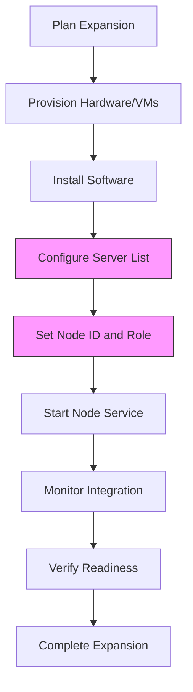
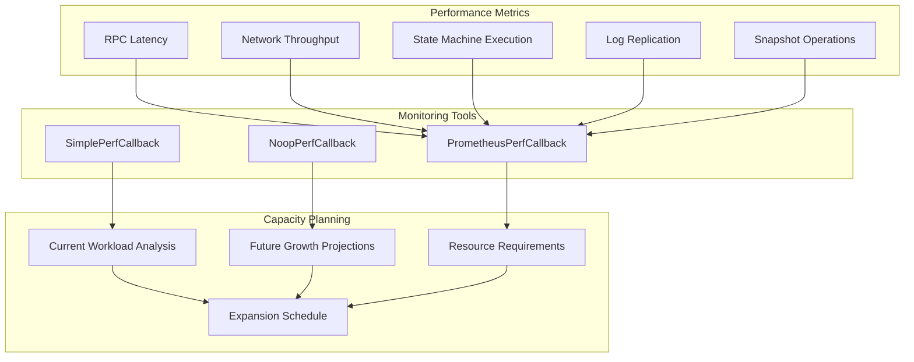
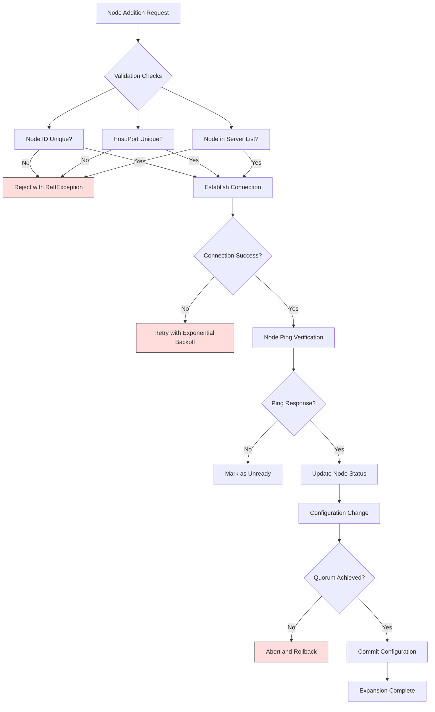

# Cluster Expansion

<cite>
**Referenced Files in This Document**   
- [NodeManager.java](file://server/src/main/java/com/github/dtprj/dongting/raft/impl/NodeManager.java)
- [AdminRaftClient.java](file://server/src/main/java/com/github/dtprj/dongting/raft/admin/AdminRaftClient.java)
- [AdminAddNodeReq.java](file://server/src/main/java/com/github/dtprj/dongting/raft/rpc/AdminAddNodeReq.java)
- [RaftClient.java](file://client/src/main/java/com/github/dtprj/dongting/raft/RaftClient.java)
- [MultiRaftDemoServer1.java](file://demos/src/main/java/com/github/dtprj/dongting/demos/multiraft/MultiRaftDemoServer1.java)
- [MultiRaftDemoServer2.java](file://demos/src/main/java/com/github/dtprj/dongting/demos/multiraft/MultiRaftDemoServer2.java)
- [MultiRaftDemoServer3.java](file://demos/src/main/java/com/github/dtprj/dongting/demos/multiraft/MultiRaftDemoServer3.java)
- [AddGroup103Demo.java](file://demos/src/main/java/com/github/dtprj/dongting/demos/multiraft/AddGroup103Demo.java)
- [RaftUtil.java](file://server/src/main/java/com/github/dtprj/dongting/raft/impl/RaftUtil.java)
- [RaftGroupImpl.java](file://server/src/main/java/com/github/dtprj/dongting/raft/impl/RaftGroupImpl.java)
</cite>

## Table of Contents
1. [Introduction](#introduction)
2. [Node Management Architecture](#node-management-architecture)
3. [addNode API Usage](#addnode-api-usage)
4. [Configuration Requirements for New Nodes](#configuration-requirements-for-new-nodes)
5. [Joining the Consensus Group](#joining-the-consensus-group)
6. [Quorum Considerations During Expansion](#quorum-considerations-during-expansion)
7. [Cluster Availability During Scaling](#cluster-availability-during-scaling)
8. [Multi-Raft Demo Examples](#multi-raft-demo-examples)
9. [Configuration Propagation and Network Setup](#configuration-propagation-and-network-setup)
10. [Best Practices for Node Provisioning](#best-practices-for-node-provisioning)
11. [Capacity Planning and Performance Monitoring](#capacity-planning-and-performance-monitoring)
12. [Error Handling and Recovery Procedures](#error-handling-and-recovery-procedures)

## Introduction
This document provides comprehensive guidance on horizontally scaling RAFT clusters by adding new nodes. It covers the complete process of cluster expansion, from API usage and configuration requirements to quorum management and error handling. The document focuses on the implementation details within the Dongting RAFT system, explaining how new nodes are integrated into existing consensus groups while maintaining cluster availability. The content includes analysis of the addNode API, configuration synchronization mechanisms, and practical examples from multi-RAFT demonstrations that show the addition of nodes to a three-node cluster.

## Node Management Architecture

The node management system in the Dongting RAFT implementation is centered around the NodeManager class, which handles the lifecycle and connectivity of all nodes within a RAFT cluster. The architecture is designed to support dynamic cluster expansion while maintaining consistency and availability.



**Diagram sources**
- [NodeManager.java](file://server/src/main/java/com/github/dtprj/dongting/raft/impl/NodeManager.java#L55-L453)
- [RaftNode.java](file://client/src/main/java/com/github/dtprj/dongting/raft/RaftNode.java#L137-L181)

**Section sources**
- [NodeManager.java](file://server/src/main/java/com/github/dtprj/dongting/raft/impl/NodeManager.java#L55-L453)

## addNode API Usage

The addNode API is the primary mechanism for introducing new nodes to an existing RAFT cluster. The API is implemented through the NodeManager class and provides asynchronous operations for node addition with proper error handling and validation.

The process begins with the AdminRaftClient, which serves as the administrative interface for cluster management operations. When adding a new node, the client sends an AdminAddNodeReq message containing the node's ID, host address, and port number. This request is processed by the AdminGroupAndNodeProcessor, which validates the node information and initiates the addition process.



The addNode operation is idempotent, meaning that attempting to add a node that already exists will not result in an error but will return the existing node reference. This design prevents race conditions when multiple administrators attempt to add the same node simultaneously. The API also validates that the node ID and host:port combination are unique within the cluster to prevent configuration conflicts.

**Section sources**
- [AdminRaftClient.java](file://server/src/main/java/com/github/dtprj/dongting/raft/admin/AdminRaftClient.java#L194-L201)
- [NodeManager.java](file://server/src/main/java/com/github/dtprj/dongting/raft/impl/NodeManager.java#L342-L368)
- [AdminAddNodeReq.java](file://server/src/main/java/com/github/dtprj/dongting/raft/rpc/AdminAddNodeReq.java#L28-L30)

## Configuration Requirements for New Nodes

Proper configuration of new nodes is critical for successful cluster expansion. The configuration process involves several key requirements that must be met to ensure the new node can integrate seamlessly with the existing cluster.

The primary configuration requirement is the specification of the server list, which contains the node ID, IP address, and replication port for all nodes in the cluster. This information is provided during node initialization and must be consistent across all cluster members. In the multi-RAFT demos, this is demonstrated by the servers string parameter that lists all nodes in the format "nodeId,ip:replicatePort".



The configuration also requires specifying whether the node is a member (participant in consensus) or an observer (passive replica). Members participate in voting and quorum calculations, while observers do not vote but maintain a copy of the data for read scalability and backup purposes. This distinction is important for maintaining the desired fault tolerance characteristics during expansion.

Another critical requirement is the proper setting of the node ID, which must be unique within the cluster and match the entry in the server list. The system validates this during initialization and will throw an exception if the self node ID is not found in the provided server list.

**Section sources**
- [MultiRaftDemoServer1.java](file://demos/src/main/java/com/github/dtprj/dongting/demos/multiraft/MultiRaftDemoServer1.java#L25-L30)
- [MultiRaftDemoServer2.java](file://demos/src/main/java/com/github/dtprj/dongting/demos/multiraft/MultiRaftDemoServer2.java#L25-L30)
- [MultiRaftDemoServer3.java](file://demos/src/main/java/com/github/dtprj/dongting/demos/multiraft/MultiRaftDemoServer3.java#L25-L30)

## Joining the Consensus Group

The process of joining a new node to an existing RAFT consensus group involves several coordinated steps that ensure the node is properly integrated while maintaining cluster consistency. This process is designed to be non-disruptive to ongoing operations.

When a new node is added, it first establishes network connectivity with the existing cluster members through the NioClient. The NodeManager handles this connection establishment and creates a RaftNodeEx object to represent the new node within the local node registry. Once the connection is established, the node enters a synchronization phase where it receives the current cluster configuration and state.

The nodePing mechanism plays a crucial role in the joining process. Each node periodically sends ping messages to other nodes in the cluster to verify connectivity and exchange status information. When a new node joins, it begins receiving these pings and responding to them, which allows the cluster to detect its presence and readiness.



The final step in joining the consensus group is the configuration change process, where the new node is formally added to the RAFT group's membership. This is accomplished through the joint consensus algorithm, which ensures that the configuration change is committed safely without compromising safety properties. The leader prepares the configuration change, replicates it to a quorum of nodes, and then commits it once sufficient acknowledgments are received.

**Section sources**
- [NodeManager.java](file://server/src/main/java/com/github/dtprj/dongting/raft/impl/NodeManager.java#L127-L170)
- [NodeManager.java](file://server/src/main/java/com/github/dtprj/dongting/raft/impl/NodeManager.java#L190-L248)
- [RaftGroupImpl.java](file://server/src/main/java/com/github/dtprj/dongting/raft/impl/RaftGroupImpl.java#L183-L198)

## Quorum Considerations During Expansion

Quorum management is a critical aspect of RAFT cluster expansion, as it directly impacts the cluster's fault tolerance and availability during configuration changes. The Dongting RAFT implementation uses a sophisticated quorum model that separates election quorum from read-write quorum to optimize performance and reliability.

During cluster expansion, the system employs the joint consensus algorithm to safely transition between configurations. This approach requires that both the old and new configurations agree on any decision, ensuring that there is no point in time where two different leaders could be elected for the same term. The quorum requirements during expansion are therefore more stringent than in steady state.



The system calculates quorum requirements based on the size of the member set. For a cluster with n members, the read-write quorum is typically ⌊n/2⌋ + 1. During expansion from three to four nodes, the joint consensus phase requires agreement from both a majority of the old configuration (2 out of 3) and a majority of the new configuration (3 out of 4). This ensures that any decision has support from nodes that overlap between the configurations, preventing split-brain scenarios.

An important consideration is that the system allows for different read-write and election quorums. As noted in the development logs, this separation enables performance optimizations where write operations can complete with fewer acknowledgments than would be required for leader election, improving throughput while maintaining safety.

**Section sources**
- [RaftUtil.java](file://server/src/main/java/com/github/dtprj/dongting/raft/impl/RaftUtil.java#L203-L243)
- [RaftUtilTest.java](file://server/src/test/java/com/github/dtprj/dongting/raft/impl/RaftUtilTest.java#L32-L95)
- [devlogs/2024_07_26_raft算法的工程实现秘笈.md](file://devlogs/2024_07_26_raft算法的工程实现秘笈.md#L59-L73)

## Cluster Availability During Scaling

Maintaining cluster availability during scaling operations is a primary design goal of the Dongting RAFT implementation. The system employs several mechanisms to ensure that client operations can continue uninterrupted while nodes are being added to the cluster.

The key to maintaining availability is the use of the joint consensus algorithm for configuration changes. This approach allows the cluster to operate with two overlapping configurations simultaneously, ensuring that there is always a quorum available for both the old and new configurations. During the expansion process, the cluster can continue to process client requests as long as a majority of either configuration is available.



The nodePing mechanism also contributes to availability by providing continuous health monitoring of all nodes. When a new node joins, it immediately begins participating in the ping protocol, allowing the cluster to quickly detect its readiness. The NodeManager tracks the currentReadyNodes count and only considers a node fully integrated when it has successfully responded to pings.

Another important aspect is the handling of network partitions during expansion. The system is designed to tolerate the failure of individual nodes during the scaling process. If a new node fails to join successfully, the cluster continues operating with the original configuration, and the failed addition can be retried without impacting availability.

**Section sources**
- [NodeManager.java](file://server/src/main/java/com/github/dtprj/dongting/raft/impl/NodeManager.java#L250-L267)
- [NodeManager.java](file://server/src/main/java/com/github/dtprj/dongting/raft/impl/NodeManager.java#L172-L188)
- [RaftGroupImpl.java](file://server/src/main/java/com/github/dtprj/dongting/raft/impl/RaftGroupImpl.java#L68-L71)

## Multi-Raft Demo Examples

The multi-RAFT demos provide concrete examples of cluster expansion in action, demonstrating how to add new nodes to an existing three-node cluster. These examples illustrate the complete workflow from node initialization to configuration change.

The demo setup consists of three server classes: MultiRaftDemoServer1, MultiRaftDemoServer2, and MultiRaftDemoServer3, each representing a node in the initial cluster configuration. These servers are configured with identical server lists and member specifications, ensuring they form a cohesive cluster.

```mermaid
graph TD
subgraph "Initial Cluster"
S1[MultiRaftDemoServer1<br>Node ID: 1]
S2[MultiRaftDemoServer2<br>Node ID: 2]
S3[MultiRaftDemoServer3<br>Node ID: 3]
end
subgraph "Configuration"
C1["servers = '1,127.0.0.1:4001;2,127.0.0.1:4002;3,127.0.0.1:4003'"]
C2["members = '1,2,3'"]
C3["observers = ''"]
end
subgraph "Expansion Process"
A[Start AdminRaftClient]
B[clientAddNode(servers)]
C[serverAddGroup() for each node]
D[Wait for completion]
end
S1 --> C1
S2 --> C1
S3 --> C1
S1 --> C2
S2 --> C2
S3 --> C2
C1 --> A
C2 --> A
A --> B
B --> C
C --> D
```

The AddGroup103Demo example demonstrates the administrative operations required to expand the cluster. It creates an AdminRaftClient instance, connects to the existing cluster nodes, and issues serverAddGroup commands to add a new RAFT group to each node. This process shows how configuration changes are propagated across the cluster in a coordinated manner.

The demo code reveals important implementation details, such as the use of CompletableFuture for asynchronous operations and the need to invoke administrative commands on multiple nodes to ensure consistency. The example also shows proper error handling and timeout management, which are critical for production deployments.

**Section sources**
- [MultiRaftDemoServer1.java](file://demos/src/main/java/com/github/dtprj/dongting/demos/multiraft/MultiRaftDemoServer1.java#L24-L30)
- [MultiRaftDemoServer2.java](file://demos/src/main/java/com/github/dtprj/dongting/demos/multiraft/MultiRaftDemoServer2.java#L24-L30)
- [MultiRaftDemoServer3.java](file://demos/src/main/java/com/github/dtprj/dongting/demos/multiraft/MultiRaftDemoServer3.java#L24-L30)
- [AddGroup103Demo.java](file://demos/src/main/java/com/github/dtprj/dongting/demos/multiraft/AddGroup103Demo.java#L28-L47)

## Configuration Propagation and Network Setup

Proper configuration propagation and network setup are essential for successful cluster expansion. The Dongting RAFT system uses a combination of client-side configuration and server-side coordination to ensure that all nodes have consistent views of the cluster topology.

The configuration propagation process begins with the AdminRaftClient, which maintains a registry of all known nodes in the allNodes map. When new nodes are added via the clientAddNode method, the client establishes connections to each node and verifies their existence. This client-side configuration is then used to route administrative commands to the appropriate nodes.



The network setup involves several layers of abstraction. The NioClient handles the low-level TCP connections, managing connection pooling and failure recovery. The Peer abstraction represents a connection to a remote node, providing a stable endpoint for message exchange even if the underlying connection is reestablished.

An important aspect of the network setup is the use of host:port pairs to uniquely identify nodes. This allows the system to detect configuration conflicts where the same node ID is assigned to different network addresses. The system validates these mappings during node addition and will reject configurations that have ambiguous node identities.

**Section sources**
- [RaftClient.java](file://client/src/main/java/com/github/dtprj/dongting/raft/RaftClient.java#L85-L113)
- [NodeManager.java](file://server/src/main/java/com/github/dtprj/dongting/raft/impl/NodeManager.java#L94-L98)
- [AdminRaftClient.java](file://server/src/main/java/com/github/dtprj/dongting/raft/admin/AdminRaftClient.java#L157-L169)

## Best Practices for Node Provisioning

Effective node provisioning is critical for successful cluster expansion. The following best practices are derived from the Dongting RAFT implementation and its usage patterns.

Pre-provisioning nodes with the complete server list before starting the RAFT service ensures that nodes can immediately establish connections with all cluster members. This reduces startup time and minimizes the window during which the node is not fully integrated. The demos illustrate this practice by specifying the complete servers string that includes all nodes in the cluster.



Another best practice is to add new nodes as observers initially, allowing them to catch up with the leader's log before promoting them to full members. This approach minimizes the impact on cluster performance during the initial synchronization phase. Although this specific observer promotion workflow is not explicitly implemented in the current code, the architecture supports it through the separation of member and observer roles.

Capacity planning should consider both current and future workloads. When adding nodes, it's important to ensure that the new configuration maintains an odd number of members to avoid split-brain scenarios in the event of network partitions. The transition from three to four nodes creates an even-numbered cluster, which is less resilient than a five-node configuration.

**Section sources**
- [MultiRaftDemoServer1.java](file://demos/src/main/java/com/github/dtprj/dongting/demos/multiraft/MultiRaftDemoServer1.java#L26-L27)
- [devlogs/2024_07_26_raft算法的工程实现秘笈.md](file://devlogs/2024_07_26_raft算法的工程实现秘笈.md#L71-L73)

## Capacity Planning and Performance Monitoring

Capacity planning and performance monitoring are essential for successful cluster expansion. The Dongting RAFT system provides several mechanisms for monitoring cluster health and performance during scaling operations.

The system includes comprehensive performance callback interfaces that can be used to track various metrics during cluster operations. These include RPC timing, network throughput, and state machine execution performance. By implementing custom PerfCallback classes, administrators can gather detailed performance data to inform capacity planning decisions.



Key performance indicators to monitor during expansion include nodePing latency, which reflects network health and node responsiveness; log replication throughput, which indicates the cluster's ability to handle write operations; and state machine execution time, which measures the processing overhead of client requests.

Capacity planning should consider both vertical and horizontal scaling options. Vertical scaling involves increasing the resources (CPU, memory, storage) of existing nodes, while horizontal scaling adds new nodes to the cluster. The choice between these approaches depends on workload characteristics, cost considerations, and operational constraints.

**Section sources**
- [SimplePerfCallback.java](file://benchmark/src/main/java/com/github/dtprj/dongting/bench/common/SimplePerfCallback.java#L37-L91)
- [RpcPerfCallback.java](file://benchmark/src/main/java/com/github/dtprj/dongting/bench/rpc/RpcPerfCallback.java#L53-L94)
- [RaftPerfCallback.java](file://benchmark/src/main/java/com/github/dtprj/dongting/bench/raft/RaftPerfCallback.java#L68-L83)

## Error Handling and Recovery Procedures

Robust error handling and recovery procedures are critical for successful cluster expansion. The Dongting RAFT implementation includes comprehensive mechanisms for handling failures during node addition and configuration changes.

The system employs a layered approach to error handling, with validation at multiple levels. The RaftClient performs client-side validation to prevent obvious configuration errors, such as duplicate node IDs or conflicting host:port mappings. The NodeManager performs server-side validation to ensure that nodes exist in the configuration and that quorum requirements can be met.



For recovery procedures, the system is designed to be resilient to partial failures. If a node addition fails, the cluster remains in its previous configuration and can continue operating normally. The failed operation can be retried after addressing the underlying issue, such as network connectivity problems or configuration errors.

The use of CompletableFuture for asynchronous operations enables non-blocking error handling and timeout management. Operations that do not complete within the specified timeout period are automatically failed, preventing indefinite blocking and allowing for retry logic to be implemented at the application level.

**Section sources**
- [RaftClient.java](file://client/src/main/java/com/github/dtprj/dongting/raft/RaftClient.java#L85-L113)
- [NodeManager.java](file://server/src/main/java/com/github/dtprj/dongting/raft/impl/NodeManager.java#L342-L368)
- [NoopPerfCallback.java](file://client/src/main/java/com/github/dtprj/dongting/common/NoopPerfCallback.java#L21-L65)