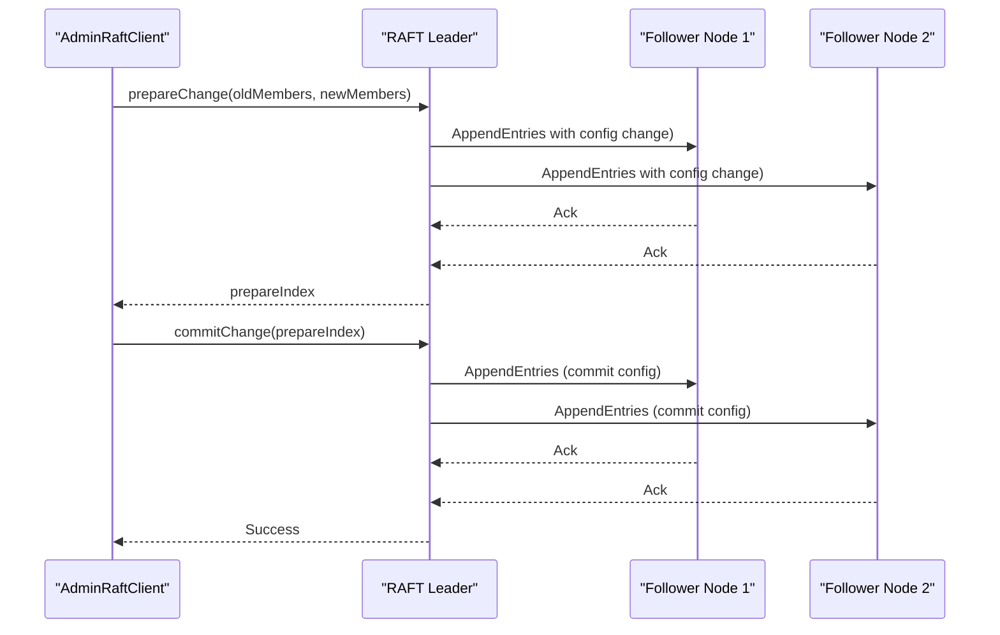
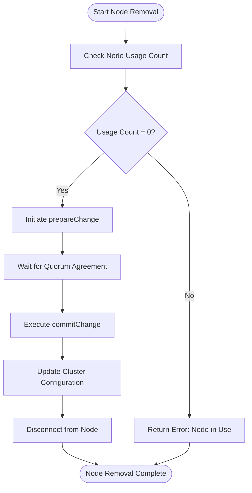
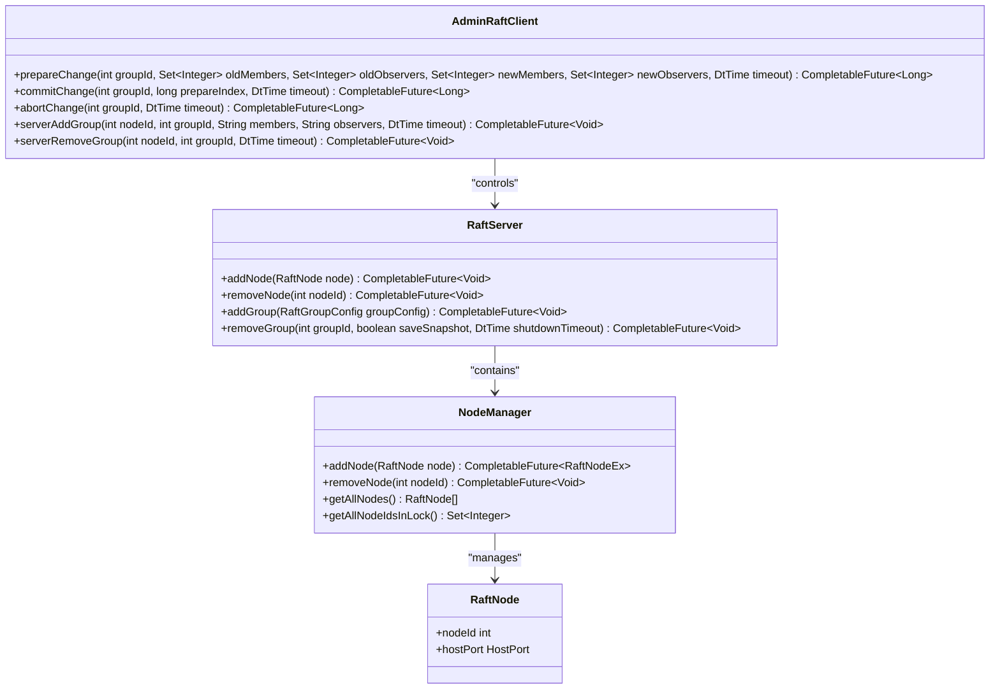
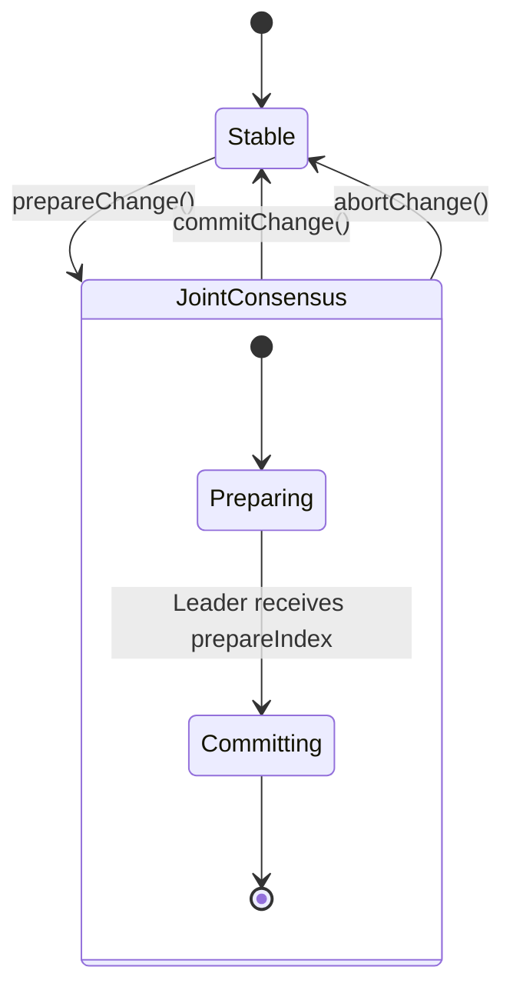
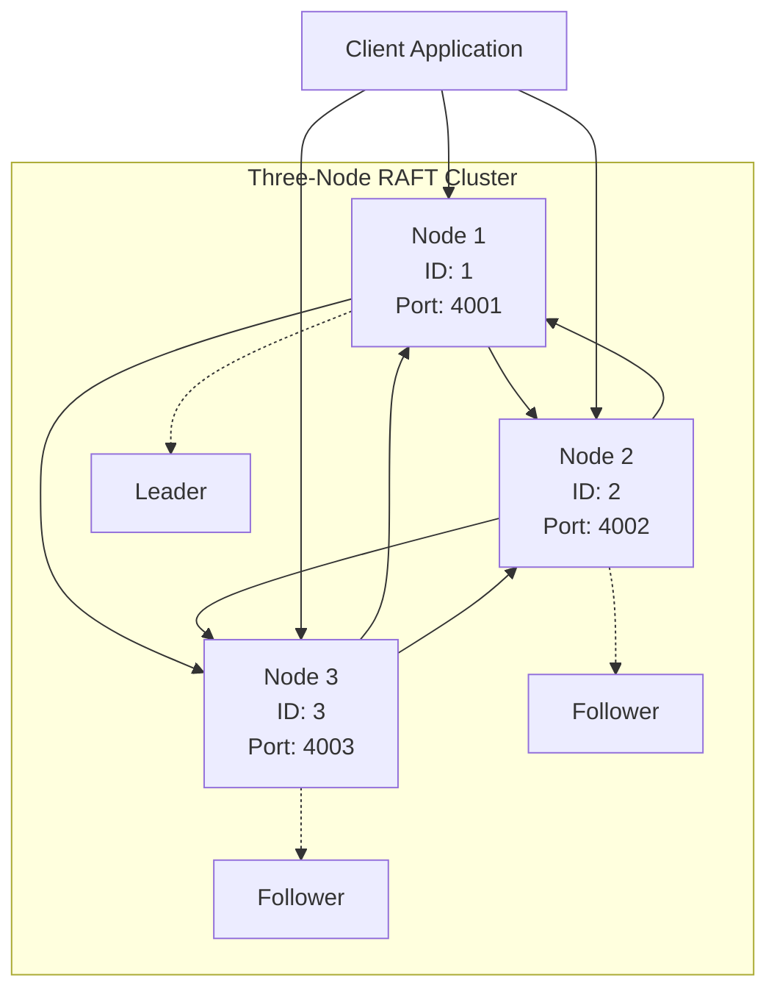

# Cluster Scaling and Node Replacement

<cite>
**Referenced Files in This Document**   
- [AddGroup103Demo.java](file://demos/src/main/java/com/github/dtprj/dongting/demos/multiraft/AddGroup103Demo.java)
- [RemoveGroup103Demo.java](file://demos/src/main/java/com/github/dtprj/dongting/demos/multiraft/RemoveGroup103Demo.java)
- [ConfigChangeDemoServer1.java](file://demos/src/main/java/com/github/dtprj/dongting/demos/configchange/ConfigChangeDemoServer1.java)
- [ConfigChangeDemoServer2.java](file://demos/src/main/java/com/github/dtprj/dongting/demos/configchange/ConfigChangeDemoServer2.java)
- [ConfigChangeDemoServer3.java](file://demos/src/main/java/com/github/dtprj/dongting/demos/configchange/ConfigChangeDemoServer3.java)
- [ConfigChangeDemoServer4.java](file://demos/src/main/java/com/github/dtprj/dongting/demos/configchange/ConfigChangeDemoServer4.java)
- [AdminRaftClient.java](file://server/src/main/java/com/github/dtprj/dongting/raft/admin/AdminRaftClient.java)
- [RaftServer.java](file://server/src/main/java/com/github/dtprj/dongting/raft/server/RaftServer.java)
- [AdminConfigChangeProcessor.java](file://server/src/main/java/com/github/dtprj/dongting/raft/rpc/AdminConfigChangeProcessor.java)
- [AdminGroupAndNodeProcessor.java](file://server/src/main/java/com/github/dtprj/dongting/raft/rpc/AdminGroupAndNodeProcessor.java)
- [NodeManager.java](file://server/src/main/java/com/github/dtprj/dongting/raft/impl/NodeManager.java)
- [DemoKvServerBase.java](file://demos/src/main/java/com/github/dtprj/dongting/demos/base/DemoKvServerBase.java)
- [PeriodPutClient.java](file://demos/src/main/java/com/github/dtprj/dongting/demos/multiraft/PeriodPutClient.java)
</cite>

## Table of Contents
1. [Introduction](#introduction)
2. [Cluster Scaling Operations](#cluster-scaling-operations)
3. [Node Replacement Process](#node-replacement-process)
4. [Configuration Change Implementation](#configuration-change-implementation)
5. [Multi-Node Cluster Management](#multi-node-cluster-management)
6. [Best Practices for Deployments](#best-practices-for-deployments)
7. [Capacity Planning and Performance](#capacity-planning-and-performance)
8. [Conclusion](#conclusion)

## Introduction
This document provides comprehensive guidance on cluster scaling and node replacement operations for the Dongting RAFT consensus system. The document covers procedures for expanding and contracting RAFT clusters, replacing failed nodes, and maintaining quorum during configuration changes. The analysis is based on the implementation details found in the demo applications and server components, which demonstrate how to manage a three-node cluster and extend it to additional nodes. The document also addresses best practices for various deployment strategies and capacity planning considerations.

**Section sources**
- [AddGroup103Demo.java](file://demos/src/main/java/com/github/dtprj/dongting/demos/multiraft/AddGroup103Demo.java)
- [RemoveGroup103Demo.java](file://demos/src/main/java/com/github/dtprj/dongting/demos/multiraft/RemoveGroup103Demo.java)
- [ConfigChangeDemoServer1.java](file://demos/src/main/java/com/github/dtprj/dongting/demos/configchange/ConfigChangeDemoServer1.java)
- [ConfigChangeDemoServer2.java](file://demos/src/main/java/com/github/dtprj/dongting/demos/configchange/ConfigChangeDemoServer2.java)
- [ConfigChangeDemoServer3.java](file://demos/src/main/java/com/github/dtprj/dongting/demos/configchange/ConfigChangeDemoServer3.java)
- [ConfigChangeDemoServer4.java](file://demos/src/main/java/com/github/dtprj/dongting/demos/configchange/ConfigChangeDemoServer4.java)

## Cluster Scaling Operations

### Scaling Up: Adding New Nodes
The Dongting RAFT implementation provides mechanisms for dynamically adding new nodes to an existing cluster. The process involves using the AdminRaftClient to send configuration change requests to the cluster. When adding a new node, the client must first be initialized with the current cluster configuration through the clientAddNode method, which establishes connections to all existing nodes.

The actual addition of a new node is performed through a two-phase commit process that ensures consistency across the cluster. The prepareChange method initiates the configuration change by specifying the current and desired cluster configurations. This operation is idempotent and will return the prepareIndex that must be used in the subsequent commit phase. The commitChange method finalizes the configuration change using the prepareIndex returned from the prepare phase.

**Diagram sources**
- [AdminRaftClient.java](file://server/src/main/java/com/github/dtprj/dongting/raft/admin/AdminRaftClient.java#L109-L140)
- [AdminConfigChangeProcessor.java](file://server/src/main/java/com/github/dtprj/dongting/raft/rpc/AdminConfigChangeProcessor.java#L69-L103)

### Scaling Down: Removing Nodes
Removing nodes from a RAFT cluster follows a similar two-phase process to ensure safety and consistency. The prepareChange method is used to initiate the removal by specifying the current configuration and the desired configuration with the node to be removed. This creates a joint consensus phase where both the old and new configurations must agree on log entries.

The NodeManager component plays a crucial role in the node removal process by tracking node usage counts. Before a node can be removed, the system verifies that the node is not currently being used by any RAFT groups. This prevents accidental removal of nodes that are still participating in consensus operations. The removeNode method in RaftServer checks the reference count of the node and will fail if the node is still in use.

**Diagram sources**
- [RaftServer.java](file://server/src/main/java/com/github/dtprj/dongting/raft/server/RaftServer.java#L560-L562)
- [NodeManager.java](file://server/src/main/java/com/github/dtprj/dongting/raft/impl/NodeManager.java#L370-L398)

**Section sources**
- [AdminRaftClient.java](file://server/src/main/java/com/github/dtprj/dongting/raft/admin/AdminRaftClient.java)
- [RaftServer.java](file://server/src/main/java/com/github/dtprj/dongting/raft/server/RaftServer.java)
- [NodeManager.java](file://server/src/main/java/com/github/dtprj/dongting/raft/impl/NodeManager.java)

## Node Replacement Process

### Handling Failed Nodes
When a node fails in a RAFT cluster, the replacement process must maintain quorum to ensure the cluster remains operational. The Dongting implementation uses a UUID-based identification system to prevent split-brain scenarios during node replacement. Each node manager has a unique UUID that is verified during the node ping process, ensuring that a replacement node cannot impersonate a failed node.

The node replacement process begins with the removal of the failed node using the removeNode operation. This requires that the node's usage count is zero, meaning it is not participating in any RAFT groups. Once the failed node is removed from the configuration, a new node can be added with the same or different node ID. The new node must be configured with the appropriate server list and port information to establish connections with the remaining cluster members.

**Diagram sources**
- [RaftServer.java](file://server/src/main/java/com/github/dtprj/dongting/raft/server/RaftServer.java)
- [AdminRaftClient.java](file://server/src/main/java/com/github/dtprj/dongting/raft/admin/AdminRaftClient.java)
- [NodeManager.java](file://server/src/main/java/com/github/dtprj/dongting/raft/impl/NodeManager.java)

### Maintaining Quorum During Replacement
Maintaining quorum during node replacement is critical for the continued operation of the RAFT cluster. The Dongting implementation ensures quorum is maintained through several mechanisms. The NodeManager tracks the number of ready nodes and compares it against the startReadyQuorum threshold, which is calculated based on the total number of nodes in the cluster.

When replacing a node, the cluster must have a majority of nodes available to vote on configuration changes. For a three-node cluster, at least two nodes must be operational to maintain quorum. The system uses a ping interval mechanism to monitor node health, with the pingIntervalMillis parameter determining how frequently nodes are checked for responsiveness.

The configuration change process itself is designed to maintain safety by using joint consensus. During the transition period, log entries must be committed by a majority in both the old and new configurations. This ensures that there is no point in time where two different servers can simultaneously believe they have leadership, preventing split-brain scenarios.

**Section sources**
- [NodeManager.java](file://server/src/main/java/com/github/dtprj/dongting/raft/impl/NodeManager.java#L73-L75)
- [AdminConfigChangeProcessor.java](file://server/src/main/java/com/github/dtprj/dongting/raft/rpc/AdminConfigChangeProcessor.java)

## Configuration Change Implementation

### Joint Consensus Algorithm
The Dongting RAFT implementation uses the joint consensus algorithm for configuration changes, which allows safe transitions between different cluster configurations. This approach, as described in the RAFT paper, enables the cluster to move from configuration C(old) to C(new) safely by going through intermediate configurations.

The process begins with the leader creating a log entry for the joint configuration C(old,new), which is a combination of both the old and new configurations. This entry is replicated to the cluster and must be agreed upon by a majority of both C(old) and C(new). Once committed, the leader creates a log entry for C(new) and replicates it. When this entry is committed by a majority of C(new), the old configuration is no longer needed.

The AdminConfigChangeProcessor handles the processing of configuration change requests, including prepare, commit, and abort operations. The prepareChange method initiates the joint consensus phase, while commitChange finalizes the transition to the new configuration. The abortChange method can be used to cancel a pending configuration change if needed.

**Diagram sources**
- [AdminConfigChangeProcessor.java](file://server/src/main/java/com/github/dtprj/dongting/raft/rpc/AdminConfigChangeProcessor.java)
- [RaftServer.java](file://server/src/main/java/com/github/dtprj/dongting/raft/server/RaftServer.java)

### Server Configuration Management
The server configuration management in Dongting is handled through the RaftServer and NodeManager components. The RaftServer maintains a list of all nodes in the cluster through the allNodesEx IntObjMap, which maps node IDs to RaftNodeEx objects containing connection and status information.

When a new node is added, the NodeManager's addNode method creates a RaftNodeEx object and establishes a connection through the NioClient. The node's usage count is tracked to prevent removal while the node is still participating in RAFT groups. The getAllNodeIdsInLock method provides a thread-safe way to retrieve all node IDs, which is used during configuration validation.

The server configuration also includes parameters for timing and timeouts, such as electTimeout, heartbeatInterval, and pingIntervalMillis. These values can be adjusted based on the network conditions and performance requirements of the deployment. The DemoKvServerBase class demonstrates how these parameters can be configured for demonstration purposes with shorter timeouts to accelerate election processes.

**Section sources**
- [RaftServer.java](file://server/src/main/java/com/github/dtprj/dongting/raft/server/RaftServer.java#L93-L94)
- [NodeManager.java](file://server/src/main/java/com/github/dtprj/dongting/raft/impl/NodeManager.java#L65-L66)
- [DemoKvServerBase.java](file://demos/src/main/java/com/github/dtprj/dongting/demos/base/DemoKvServerBase.java#L44-L47)

## Multi-Node Cluster Management

### Three-Node Cluster Operations
The three-node cluster configuration is a common setup that provides fault tolerance while maintaining high availability. In a three-node RAFT cluster, quorum is achieved with two votes, allowing the cluster to tolerate the failure of one node. The demo applications demonstrate how to set up and manage a three-node cluster using the ConfigChangeDemoServer classes.

The configuration for a three-node cluster is specified in the servers string, which lists each node with its ID, IP address, and port. For example: "1,127.0.0.1:4001;2,127.0.0.1:4002;3,127.0.0.1:4003". The members string specifies which nodes participate as voting members in the RAFT group, such as "1,2,3" for all three nodes.

The PeriodPutClient demo illustrates how a client application can interact with a multi-RAFT cluster, sending periodic PUT requests to multiple groups. The client establishes connections to all nodes and can route requests to the current leader, automatically handling leader elections and failover.

**Diagram sources**
- [ConfigChangeDemoServer1.java](file://demos/src/main/java/com/github/dtprj/dongting/demos/configchange/ConfigChangeDemoServer1.java#L26-L27)
- [PeriodPutClient.java](file://demos/src/main/java/com/github/dtprj/dongting/demos/multiraft/PeriodPutClient.java#L32-L38)

### Extending to Additional Nodes
Extending a RAFT cluster beyond three nodes follows the same configuration change process but provides increased fault tolerance. A five-node cluster, for example, can tolerate the failure of two nodes while maintaining quorum. The ConfigChangeDemoServer4 demonstrates how to configure a four-node cluster with a different membership configuration.

When extending to additional nodes, the cluster configuration must be updated to include the new node's ID, IP address, and port. The AdminRaftClient can be used to initiate the configuration change, specifying the old and new member lists. The system will validate that the new node's ID is not already in use and that the host/port combination is unique.

The NodeManager ensures that the new node is properly integrated into the cluster by establishing connections and monitoring its health through the ping mechanism. Once the configuration change is committed, the new node becomes a full participant in the RAFT consensus process, receiving log entries and participating in elections.

**Section sources**
- [ConfigChangeDemoServer4.java](file://demos/src/main/java/com/github/dtprj/dongting/demos/configchange/ConfigChangeDemoServer4.java)
- [AddGroup103Demo.java](file://demos/src/main/java/com/github/dtprj/dongting/demos/multiraft/AddGroup103Demo.java)

## Best Practices for Deployments

### Rolling Updates
Rolling updates in a RAFT environment should be performed by replacing nodes one at a time to maintain quorum. The process involves removing a node from the configuration, updating its software, and then adding it back to the cluster. This approach ensures that the cluster remains available throughout the update process.

Before removing a node for update, it should be ensured that the node is not the current leader. If necessary, leadership can be transferred to another node using the transferLeader operation. Once the node has been updated and restarted, it can be added back to the cluster using the standard node addition process.

### Blue-Green Deployments
Blue-green deployments in a RAFT environment can be implemented by maintaining two separate clusters: one running the current version (blue) and one running the new version (green). Traffic is initially routed to the blue cluster. Once the green cluster is verified to be operational, traffic is switched to the green cluster.

This approach requires careful coordination to ensure data consistency between the clusters. The data from the blue cluster may need to be migrated to the green cluster before the switchover. The AdminRaftClient can be used to manage both clusters during the transition period.

### Canary Releases
Canary releases in a RAFT environment can be implemented by gradually shifting traffic from the old cluster to the new cluster. This can be done by updating nodes in the existing cluster one at a time and monitoring the system's behavior. The PeriodPutClient demo illustrates how client applications can be used to generate load and monitor performance during such transitions.

Canary releases allow for early detection of issues with the new version while minimizing the impact on the overall system. Metrics such as request latency, error rates, and resource utilization should be closely monitored during the canary phase.

**Section sources**
- [AdminRaftClient.java](file://server/src/main/java/com/github/dtprj/dongting/raft/admin/AdminRaftClient.java#L72-L102)
- [PeriodPutClient.java](file://demos/src/main/java/com/github/dtprj/dongting/demos/multiraft/PeriodPutClient.java)

## Capacity Planning and Performance

### Resource Allocation per Node
Proper resource allocation is critical for RAFT cluster performance. Each node requires sufficient CPU, memory, and disk I/O capacity to handle the consensus protocol overhead. The RaftServerConfig allows for configuration of various parameters that affect resource usage, such as the number of business threads and connection limits.

The dataDir parameter in RaftGroupConfig specifies the directory where RAFT logs and snapshots are stored. This should be located on a fast storage device to minimize I/O latency. The syncForce parameter controls whether data is forced to disk immediately, with a trade-off between durability and performance.

Network bandwidth is also a critical consideration, as RAFT requires frequent communication between nodes for heartbeat, log replication, and configuration changes. The replicatePort and servicePort should be configured on network interfaces with sufficient bandwidth to handle the expected load.

### Performance Implications of Cluster Size
The size of a RAFT cluster has significant performance implications. Larger clusters provide greater fault tolerance but increase the latency of consensus operations. In a three-node cluster, log entries require agreement from two nodes, while in a five-node cluster, agreement from three nodes is required.

The consensus latency is affected by the round-trip time between nodes and the processing time for log entries. The heartbeatInterval parameter controls how frequently leaders send heartbeats to maintain their authority, with shorter intervals providing faster failover but increased network traffic.

The election timeout (electTimeout) should be set to a value that is long enough to avoid unnecessary elections due to transient network delays but short enough to detect actual failures promptly. The demo configurations use shorter timeouts (3000ms) for faster elections, while production systems may use longer values (10000-15000ms) for greater stability.

**Section sources**
- [RaftServer.java](file://server/src/main/java/com/github/dtprj/dongting/raft/server/RaftServer.java#L119-L120)
- [DemoKvServerBase.java](file://demos/src/main/java/com/github/dtprj/dongting/demos/base/DemoKvServerBase.java#L78-L80)

## Conclusion
The Dongting RAFT implementation provides robust mechanisms for cluster scaling and node replacement, enabling dynamic management of distributed systems while maintaining consistency and availability. The joint consensus algorithm ensures safe configuration changes, while the AdminRaftClient provides a convenient interface for administrative operations.

Key considerations for successful cluster management include maintaining quorum during node operations, properly configuring timing parameters for the specific deployment environment, and following best practices for rolling updates and deployments. The demo applications provide practical examples of how to implement these operations in real-world scenarios.

By understanding the underlying mechanisms and following the recommended practices, operators can effectively scale their RAFT clusters to meet changing demands while ensuring high availability and data consistency.