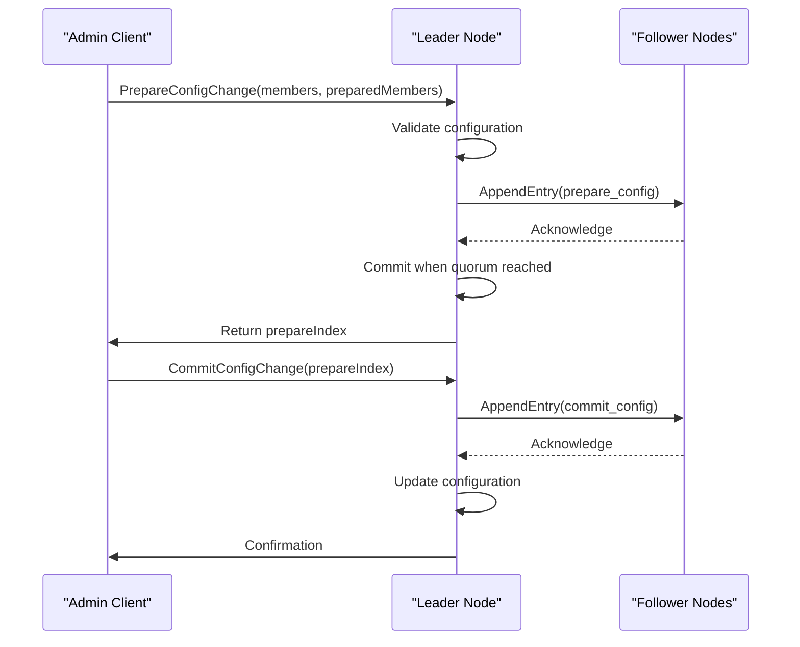
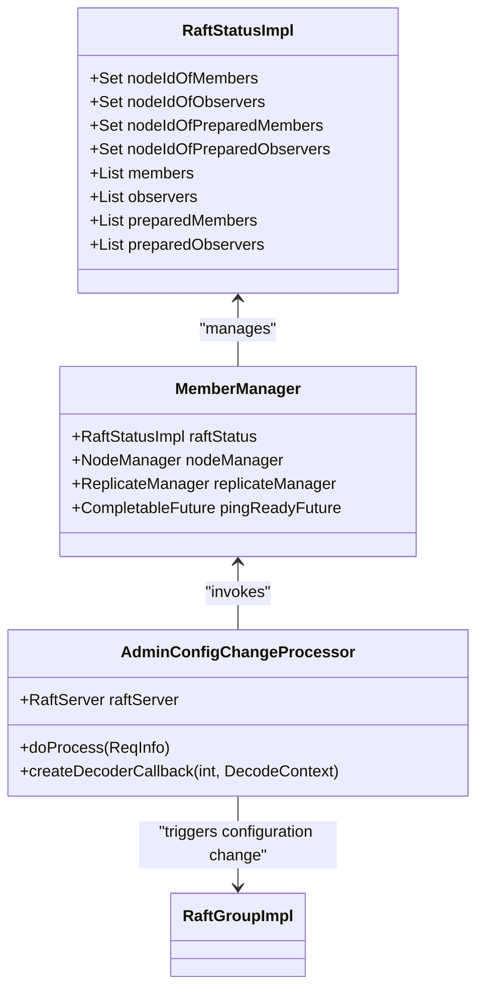
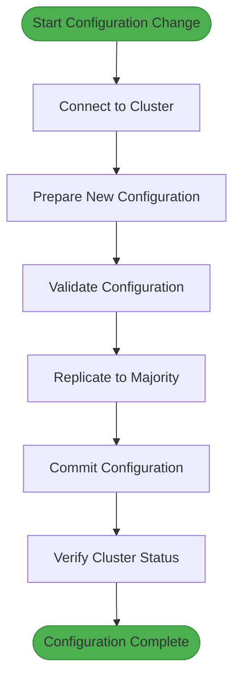
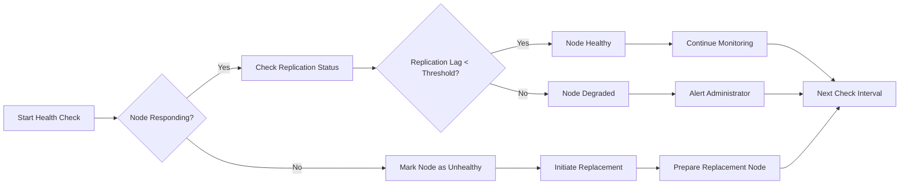
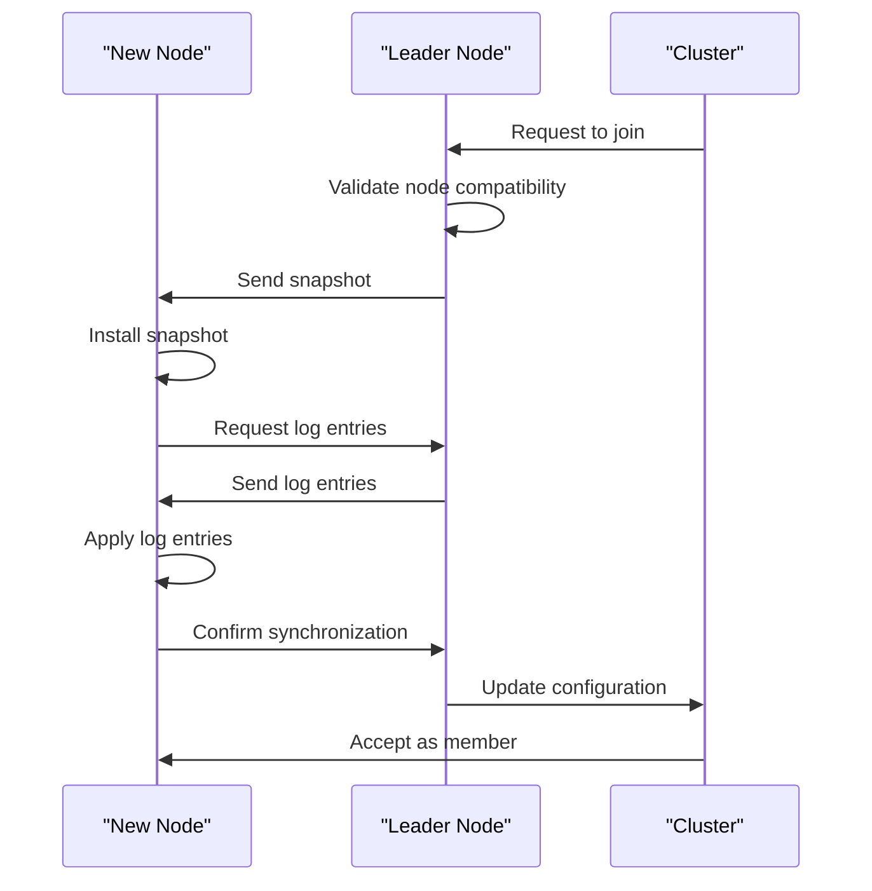
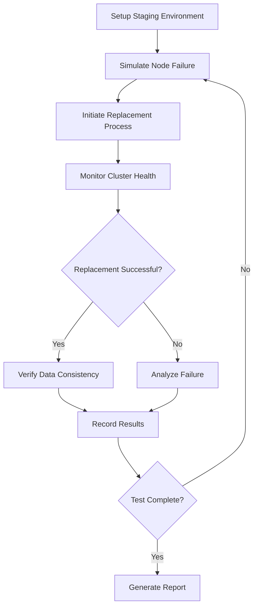

# Node Replacement

<cite>
**Referenced Files in This Document**   
- [MemberManager.java](file://server/src/main/java/com/github/dtprj/dongting/raft/impl/MemberManager.java)
- [NodeManager.java](file://server/src/main/java/com/github/dtprj/dongting/raft/impl/NodeManager.java)
- [RaftGroupImpl.java](file://server/src/main/java/com/github/dtprj/dongting/raft/impl/RaftGroupImpl.java)
- [AdminConfigChangeProcessor.java](file://server/src/main/java/com/github/dtprj/dongting/raft/rpc/AdminConfigChangeProcessor.java)
- [AdminGroupAndNodeProcessor.java](file://server/src/main/java/com/github/dtprj/dongting/raft/rpc/AdminGroupAndNodeProcessor.java)
- [MultiRaftDemoServer1.java](file://demos/src/main/java/com/github/dtprj/dongting/demos/multiraft/MultiRaftDemoServer1.java)
- [MultiRaftDemoServer2.java](file://demos/src/main/java/com/github/dtprj/dongting/demos/multiraft/MultiRaftDemoServer2.java)
- [MultiRaftDemoServer3.java](file://demos/src/main/java/com/github/dtprj/dongting/demos/multiraft/MultiRaftDemoServer3.java)
- [AddGroup103Demo.java](file://demos/src/main/java/com/github/dtprj/dongting/demos/multiraft/AddGroup103Demo.java)
- [RemoveGroup103Demo.java](file://demos/src/main/java/com/github/dtprj/dongting/demos/multiraft/RemoveGroup103Demo.java)
- [ConfigChangeDemoServer1.java](file://demos/src/main/java/com/github/dtprj/dongting/demos/configchange/ConfigChangeDemoServer1.java)
- [ConfigChangeDemoServer2.java](file://demos/src/main/java/com/github/dtprj/dongting/demos/configchange/ConfigChangeDemoServer2.java)
- [ConfigChangeDemoServer3.java](file://demos/src/main/java/com/github/dtprj/dongting/demos/configchange/ConfigChangeDemoServer3.java)
- [ConfigChangeDemoServer4.java](file://demos/src/main/java/com/github/dtprj/dongting/demos/configchange/ConfigChangeDemoServer4.java)
- [ChangeTo123Client.java](file://demos/src/main/java/com/github/dtprj/dongting/demos/configchange/ChangeTo123Client.java)
- [ChangeTo234Client.java](file://demos/src/main/java/com/github/dtprj/dongting/demos/configchange/ChangeTo234Client.java)
</cite>

## Table of Contents
1. [Introduction](#introduction)
2. [Node Replacement Process](#node-replacement-process)
3. [Configuration Change Implementation](#configuration-change-implementation)
4. [Multi-Raft Demo Examples](#multi-raft-demo-examples)
5. [Best Practices for Node Replacement](#best-practices-for-node-replacement)
6. [Health Detection and Monitoring](#health-detection-and-monitoring)
7. [State Transfer and Version Compatibility](#state-transfer-and-version-compatibility)
8. [Testing and Staging Procedures](#testing-and-staging-procedures)
9. [Conclusion](#conclusion)

## Introduction
This document details the node replacement process in the RAFT cluster implementation of the Dongting project. The system provides a robust mechanism for handling failed or outdated nodes while maintaining quorum and data consistency. The implementation follows the joint consensus approach for configuration changes, allowing safe addition and removal of nodes without compromising cluster availability.

The node replacement process is designed to be non-disruptive, ensuring that the cluster can continue to serve requests during the replacement operation. The system uses a two-phase approach for configuration changes, first preparing the new configuration and then committing it, which prevents split-brain scenarios and maintains linearizability.

**Section sources**
- [MemberManager.java](file://server/src/main/java/com/github/dtprj/dongting/raft/impl/MemberManager.java#L47-L101)
- [RaftGroupImpl.java](file://server/src/main/java/com/github/dtprj/dongting/raft/impl/RaftGroupImpl.java#L43-L60)

## Node Replacement Process

The node replacement process in the Dongting RAFT implementation follows a systematic approach to ensure cluster stability and data consistency. The process begins with health detection, where the system continuously monitors node status through periodic ping operations. When a node failure is detected, the replacement procedure can be initiated.

The replacement operation is performed through a series of administrative commands that modify the cluster configuration. The system uses a joint consensus algorithm for configuration changes, which requires agreement on two configurations: the old configuration and the new configuration. This approach ensures that any majority from the old configuration overlaps with any majority from the new configuration, preventing split-brain scenarios.

The sequence of operations for node replacement involves three key phases: preparation, transition, and commitment. During the preparation phase, the new configuration is proposed and replicated to the cluster. In the transition phase, the system operates with both old and new configurations simultaneously. Finally, in the commitment phase, the old configuration is removed, and the new configuration becomes active.

**Diagram sources**
- [AdminConfigChangeProcessor.java](file://server/src/main/java/com/github/dtprj/dongting/raft/rpc/AdminConfigChangeProcessor.java#L69-L101)
- [MemberManager.java](file://server/src/main/java/com/github/dtprj/dongting/raft/impl/MemberManager.java#L339-L419)

**Section sources**
- [MemberManager.java](file://server/src/main/java/com/github/dtprj/dongting/raft/impl/MemberManager.java#L732-L789)
- [NodeManager.java](file://server/src/main/java/com/github/dtprj/dongting/raft/impl/NodeManager.java#L369-L398)

## Configuration Change Implementation

The configuration change mechanism in the Dongting RAFT implementation is designed to maintain cluster availability and data consistency during node replacement operations. The system uses a two-phase commit protocol for configuration changes, ensuring that the transition between configurations is safe and atomic.

The implementation is centered around the MemberManager class, which manages the membership state of the RAFT group. The class maintains several data structures to track the current and pending configurations, including members, observers, preparedMembers, and preparedObservers. This allows the system to operate with two configurations simultaneously during the transition period.

The configuration change process is initiated through administrative RPC commands that are handled by the AdminConfigChangeProcessor. When a configuration change is requested, the leader node first prepares the new configuration by writing a prepare_config entry to the log. Once this entry is committed, the system enters the joint consensus phase where both old and new configurations are active. Finally, a commit_config entry is written to complete the transition.

**Diagram sources**
- [MemberManager.java](file://server/src/main/java/com/github/dtprj/dongting/raft/impl/MemberManager.java#L63-L101)
- [AdminConfigChangeProcessor.java](file://server/src/main/java/com/github/dtprj/dongting/raft/rpc/AdminConfigChangeProcessor.java#L37-L43)

**Section sources**
- [MemberManager.java](file://server/src/main/java/com/github/dtprj/dongting/raft/impl/MemberManager.java#L292-L321)
- [AdminConfigChangeProcessor.java](file://server/src/main/java/com/github/dtprj/dongting/raft/rpc/AdminConfigChangeProcessor.java#L69-L101)

## Multi-Raft Demo Examples

The Dongting project provides comprehensive demo examples that illustrate the node replacement process in a production-like environment. The multi-raft demos demonstrate how to perform configuration changes and node replacements in a realistic cluster setup.

The MultiRaftDemoServer classes (MultiRaftDemoServer1, MultiRaftDemoServer2, and MultiRaftDemoServer3) show a three-node cluster configuration where each server is initialized with the same member list. These demos provide a foundation for understanding how nodes are configured and how they form a RAFT group.

The AddGroup103Demo and RemoveGroup103Demo classes demonstrate the programmatic addition and removal of RAFT groups. These examples show how administrative clients can connect to the cluster and perform configuration changes. The AddGroup103Demo example illustrates how to add a new group with a specific configuration, while the RemoveGroup103Demo shows the process of removing a group.

The configuration change demos (ConfigChangeDemoServer1-4) provide examples of how to perform node replacement operations. The ChangeTo123Client and ChangeTo234Client demonstrate how to transition between different cluster configurations. These examples show the complete workflow from connecting to the cluster to executing configuration changes and verifying the results.

**Diagram sources**
- [AddGroup103Demo.java](file://demos/src/main/java/com/github/dtprj/dongting/demos/multiraft/AddGroup103Demo.java#L27-L47)
- [RemoveGroup103Demo.java](file://demos/src/main/java/com/github/dtprj/dongting/demos/multiraft/RemoveGroup103Demo.java#L27-L46)
- [ChangeTo123Client.java](file://demos/src/main/java/com/github/dtprj/dongting/demos/configchange/ChangeTo123Client.java)
- [ChangeTo234Client.java](file://demos/src/main/java/com/github/dtprj/dongting/demos/configchange/ChangeTo234Client.java)

**Section sources**
- [MultiRaftDemoServer1.java](file://demos/src/main/java/com/github/dtprj/dongting/demos/multiraft/MultiRaftDemoServer1.java#L23-L30)
- [AddGroup103Demo.java](file://demos/src/main/java/com/github/dtprj/dongting/demos/multiraft/AddGroup103Demo.java#L27-L47)

## Best Practices for Node Replacement

When performing node replacement in a RAFT cluster, several best practices should be followed to ensure a smooth and safe operation. These practices include rolling updates, blue-green deployment patterns, and canary releases, which can be adapted to the RAFT context.

For rolling updates, nodes should be replaced one at a time, with sufficient time between replacements to allow the cluster to stabilize. This approach minimizes the risk of multiple simultaneous failures and ensures that the cluster maintains quorum throughout the update process. The system should verify that each replaced node has successfully joined and synchronized with the cluster before proceeding to the next node.

Blue-green deployment patterns can be implemented by maintaining two identical cluster configurations and switching between them. This approach allows for rapid rollback in case of issues with the new configuration. The transition between blue and green configurations can be performed using the joint consensus mechanism, ensuring a safe and atomic switch.

Canary releases involve gradually introducing new nodes to the cluster while monitoring their performance and behavior. A small number of new nodes can be added initially, and the system can be monitored for any issues before proceeding with a full replacement. This approach reduces the risk of widespread problems caused by faulty nodes.

The system should also implement proper version compatibility checks to ensure that new nodes are compatible with the existing cluster. This includes verifying protocol versions, data formats, and feature compatibility. The configuration change process should include validation steps to prevent incompatible nodes from joining the cluster.

**Section sources**
- [ConfigChangeDemoServer1.java](file://demos/src/main/java/com/github/dtprj/dongting/demos/configchange/ConfigChangeDemoServer1.java#L23-L30)
- [ConfigChangeDemoServer2.java](file://demos/src/main/java/com/github/dtprj/dongting/demos/configchange/ConfigChangeDemoServer2.java#L23-L30)
- [ConfigChangeDemoServer3.java](file://demos/src/main/java/com/github/dtprj/dongting/demos/configchange/ConfigChangeDemoServer3.java#L23-L30)
- [ConfigChangeDemoServer4.java](file://demos/src/main/java/com/github/dtprj/dongting/demos/configchange/ConfigChangeDemoServer4.java#L23-L30)

## Health Detection and Monitoring

The Dongting RAFT implementation includes comprehensive health detection and monitoring mechanisms to identify failed or degraded nodes. The system uses a combination of network pings and RAFT-specific health checks to monitor node status.

The NodeManager class is responsible for managing the health detection process. It maintains a list of all nodes in the cluster and periodically sends ping requests to each node. The ping interval is configurable, allowing administrators to balance between timely failure detection and network overhead. When a node fails to respond to ping requests, it is marked as unhealthy, and appropriate actions can be taken.

In addition to network pings, the system performs RAFT-specific health checks by monitoring the replication status of each node. The ReplicateManager tracks the progress of log replication to each follower and can detect when a node is falling behind or has stopped receiving updates. This information is used to determine whether a node is truly failed or simply experiencing temporary network issues.

The system also implements a ready quorum mechanism that ensures a minimum number of nodes are healthy before the cluster becomes operational. This prevents the cluster from serving requests when it may not be able to tolerate additional failures. The ready quorum is configurable and can be adjusted based on the desired level of fault tolerance.

**Diagram sources**
- [NodeManager.java](file://server/src/main/java/com/github/dtprj/dongting/raft/impl/NodeManager.java#L100-L138)
- [MemberManager.java](file://server/src/main/java/com/github/dtprj/dongting/raft/impl/MemberManager.java#L173-L191)

**Section sources**
- [NodeManager.java](file://server/src/main/java/com/github/dtprj/dongting/raft/impl/NodeManager.java#L104-L138)
- [MemberManager.java](file://server/src/main/java/com/github/dtprj/dongting/raft/impl/MemberManager.java#L173-L191)

## State Transfer and Version Compatibility

State transfer to replacement nodes is a critical aspect of the node replacement process, ensuring that new nodes have the necessary data to participate in the cluster. The Dongting RAFT implementation handles state transfer through snapshot-based mechanisms and log replication.

When a new node joins the cluster, it first receives a snapshot of the current state from the leader. This snapshot contains the complete state machine up to a specific log index, allowing the new node to quickly catch up without replaying the entire log. After installing the snapshot, the node receives the remaining log entries through normal replication.

The system implements version compatibility checks to ensure that replacement nodes are compatible with the existing cluster. This includes verifying protocol versions, data formats, and feature support. The configuration change process includes validation steps that prevent incompatible nodes from joining the cluster, maintaining the integrity of the system.

The implementation also handles backward and forward compatibility between different versions of the software. This allows for rolling upgrades where nodes can run different versions temporarily during the upgrade process. The system ensures that all nodes can understand the messages and data formats used by other nodes, preventing communication failures.

**Diagram sources**
- [MemberManager.java](file://server/src/main/java/com/github/dtprj/dongting/raft/impl/MemberManager.java#L318-L337)
- [RaftGroupImpl.java](file://server/src/main/java/com/github/dtprj/dongting/raft/impl/RaftGroupImpl.java#L182-L217)

**Section sources**
- [MemberManager.java](file://server/src/main/java/com/github/dtprj/dongting/raft/impl/MemberManager.java#L318-L337)
- [RaftGroupImpl.java](file://server/src/main/java/com/github/dtprj/dongting/raft/impl/RaftGroupImpl.java#L182-L217)

## Testing and Staging Procedures

Testing node replacement procedures in staging environments is essential to ensure reliability and prevent issues in production. The Dongting project provides several mechanisms for testing configuration changes and node replacement operations in controlled environments.

The demo examples serve as a foundation for testing, allowing developers to simulate various scenarios and verify the behavior of the system. These demos can be modified to test edge cases, such as network partitions, node failures during configuration changes, and version incompatibilities.

Staging environments should mirror production as closely as possible, including the same number of nodes, network topology, and workload patterns. This ensures that the testing results are representative of actual production behavior. The system should be tested under various load conditions to verify that node replacement operations do not degrade performance or availability.

Automated testing scripts can be developed to simulate the complete node replacement process, from health detection to configuration changes and state transfer. These scripts should include assertions to verify that the cluster maintains quorum, data consistency is preserved, and the replacement node is properly integrated.

**Diagram sources**
- [NodeManager.java](file://server/src/main/java/com/github/dtprj/dongting/raft/impl/NodeManager.java#L342-L368)
- [AdminGroupAndNodeProcessor.java](file://server/src/main/java/com/github/dtprj/dongting/raft/rpc/AdminGroupAndNodeProcessor.java#L128-L137)

**Section sources**
- [NodeManager.java](file://server/src/main/java/com/github/dtprj/dongting/raft/impl/NodeManager.java#L342-L368)
- [AdminGroupAndNodeProcessor.java](file://server/src/main/java/com/github/dtprj/dongting/raft/rpc/AdminGroupAndNodeProcessor.java#L128-L137)

## Conclusion
The node replacement mechanism in the Dongting RAFT implementation provides a robust and safe way to handle failed or outdated nodes while maintaining cluster availability and data consistency. The system uses a joint consensus approach for configuration changes, ensuring that the transition between configurations is atomic and prevents split-brain scenarios.

The implementation includes comprehensive health detection, state transfer, and version compatibility mechanisms to ensure reliable operation. The provided demo examples illustrate how to perform node replacement operations in a production-like environment, serving as a valuable resource for understanding and testing the system.

By following best practices such as rolling updates, blue-green deployments, and thorough testing in staging environments, administrators can safely perform node replacements and upgrades with minimal impact on cluster availability. The system's design prioritizes safety and consistency, making it suitable for mission-critical applications where data integrity is paramount.

[No sources needed since this section summarizes without analyzing specific files]