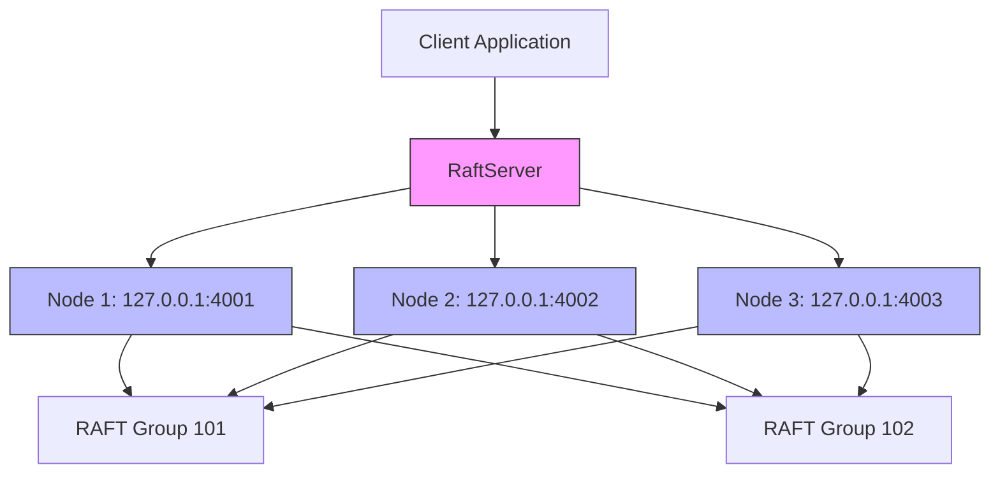
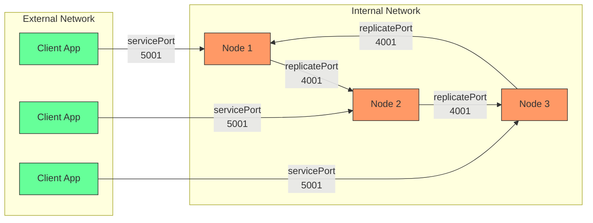
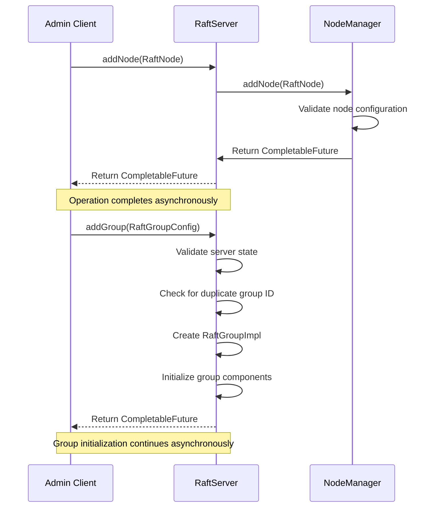
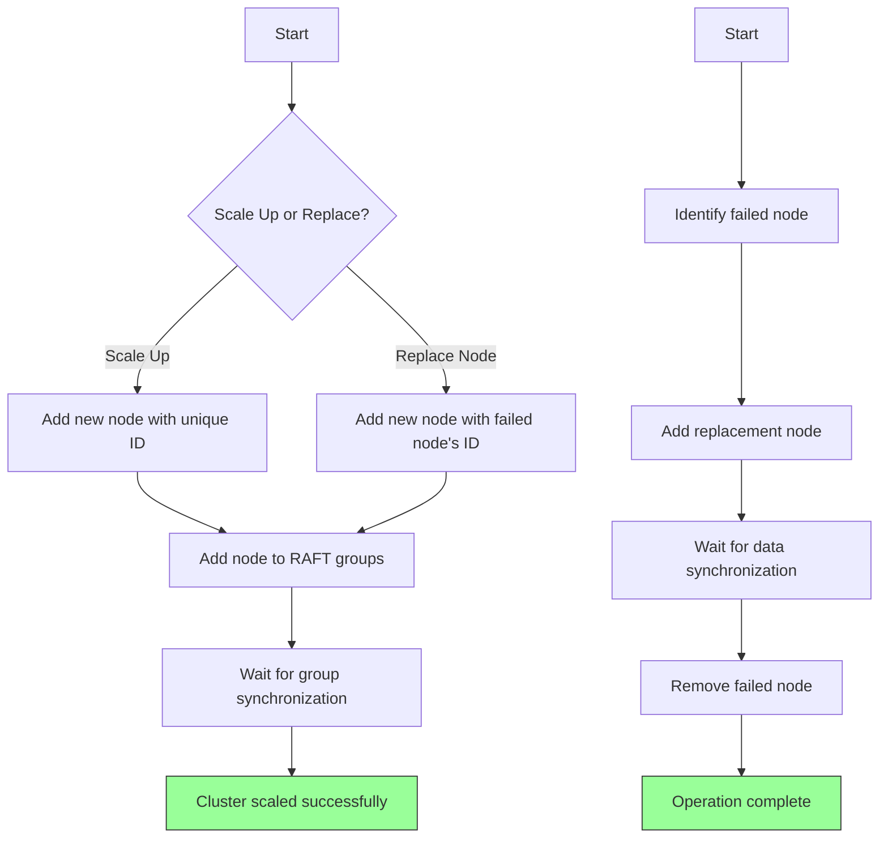
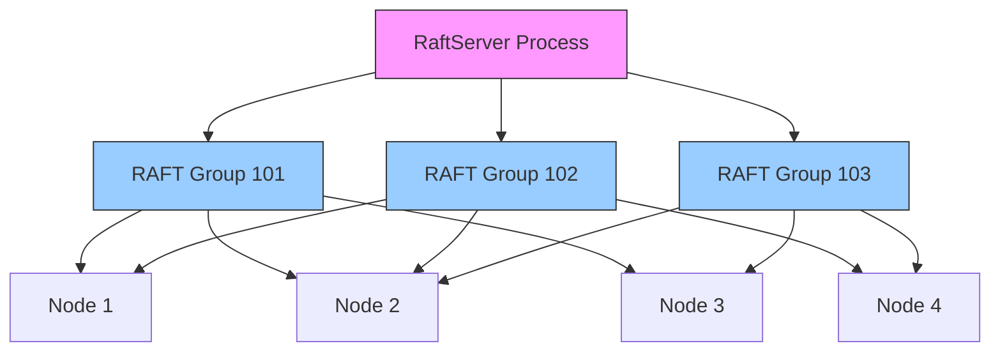
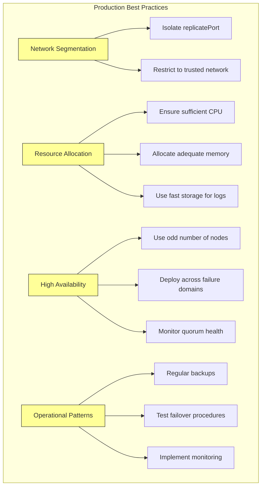
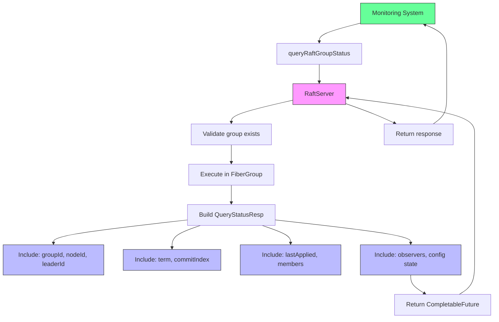
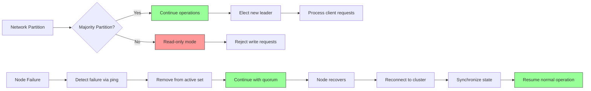

# Deployment Topology and Cluster Management

<cite>
**Referenced Files in This Document**   
- [RaftServer.java](file://server/src/main/java/com/github/dtprj/dongting/raft/server/RaftServer.java)
- [RaftServerConfig.java](file://server/src/main/java/com/github/dtprj/dongting/raft/server/RaftServerConfig.java)
- [RaftGroupConfig.java](file://server/src/main/java/com/github/dtprj/dongting/raft/server/RaftGroupConfig.java)
- [AdminAddNodeReq.java](file://server/src/main/java/com/github/dtprj/dongting/raft/rpc/AdminAddNodeReq.java)
- [AdminAddGroupReq.java](file://server/src/main/java/com/github/dtprj/dongting/raft/rpc/AdminAddGroupReq.java)
- [AdminGroupAndNodeProcessor.java](file://server/src/main/java/com/github/dtprj/dongting/raft/rpc/AdminGroupAndNodeProcessor.java)
- [NodeManager.java](file://server/src/main/java/com/github/dtprj/dongting/raft/impl/NodeManager.java)
- [MemberManager.java](file://server/src/main/java/com/github/dtprj/dongting/raft/impl/MemberManager.java)
- [QueryStatusProcessor.java](file://server/src/main/java/com/github/dtprj/dongting/raft/rpc/QueryStatusProcessor.java)
- [RaftStatusImpl.java](file://server/src/main/java/com/github/dtprj/dongting/raft/impl/RaftStatusImpl.java)
- [DemoServer1.java](file://demos/src/main/java/com/github/dtprj/dongting/demos/cluster/DemoServer1.java)
- [MultiRaftDemoServer1.java](file://demos/src/main/java/com/github/dtprj/dongting/demos/multiraft/MultiRaftDemoServer1.java)
- [ConfigChangeDemoServer1.java](file://demos/src/main/java/com/github/dtprj/dongting/demos/configchange/ConfigChangeDemoServer1.java)
</cite>

## Table of Contents
1. [Multi-Node RAFT Cluster Setup](#multi-node-raft-cluster-setup)
2. [Port Configuration and Network Separation](#port-configuration-and-network-separation)
3. [Dynamic Cluster Management Operations](#dynamic-cluster-management-operations)
4. [Scaling and Node Replacement](#scaling-and-node-replacement)
5. [Multi-RAFT Group Management](#multi-raft-group-management)
6. [Production Deployment Best Practices](#production-deployment-best-practices)
7. [Cluster Health Monitoring](#cluster-health-monitoring)
8. [Common Deployment Issues and Recovery](#common-deployment-issues-and-recovery)

## Multi-Node RAFT Cluster Setup

The Dongting RAFT implementation provides a robust framework for configuring and launching multi-node RAFT clusters. The cluster setup process begins with the `RaftServer` class, which serves as the central component for managing the entire RAFT cluster. Each server instance is configured with a unique node ID and a list of all server nodes in the cluster through the `RaftServerConfig` object.

The configuration process requires specifying the server list in the format "nodeId,host:replicatePort" separated by semicolons. For example, a three-node cluster would be configured as "1,127.0.0.1:4001;2,127.0.0.1:4002;3,127.0.0.1:4003". The `RaftServer` constructor validates this configuration, ensuring there are no duplicate node IDs or host-port combinations, and confirms that the current node's ID is present in the server list.

Each RAFT group within the cluster is defined by a `RaftGroupConfig` that specifies the group ID and the member nodes that participate in consensus. Members are specified as a comma-separated list of node IDs. The system supports both active members that participate in voting and observers that receive replicated data without voting rights.

**Diagram sources**
- [RaftServer.java](file://server/src/main/java/com/github/dtprj/dongting/raft/server/RaftServer.java#L126-L139)
- [DemoServer1.java](file://demos/src/main/java/com/github/dtprj/dongting/demos/cluster/DemoServer1.java#L27-L30)

**Section sources**
- [RaftServer.java](file://server/src/main/java/com/github/dtprj/dongting/raft/server/RaftServer.java#L109-L140)
- [RaftServerConfig.java](file://server/src/main/java/com/github/dtprj/dongting/raft/server/RaftServerConfig.java#L22-L27)
- [DemoServer1.java](file://demos/src/main/java/com/github/dtprj/dongting/demos/cluster/DemoServer1.java#L25-L31)

## Port Configuration and Network Separation

The Dongting RAFT implementation employs a clear separation between internal consensus traffic and client access through distinct port assignments. This network segmentation is a critical aspect of the deployment topology that enhances both security and performance.

The `replicatePort` is dedicated to internal RAFT consensus traffic between server nodes. This port handles all RAFT protocol messages including AppendEntries, RequestVote, and other internal coordination messages. The replicate port is used exclusively for server-to-server communication and should be exposed only within a trusted network segment.

The `servicePort` is designated for client access, allowing applications to read and write data to the RAFT cluster. When a service port is configured (non-zero value), the server listens on both the replicate port and service port. This dual-port architecture enables network segmentation where the replicate port can be restricted to internal cluster communication while the service port is accessible to client applications.

**Diagram sources**
- [RaftServer.java](file://server/src/main/java/com/github/dtprj/dongting/raft/server/RaftServer.java#L148-L153)
- [RaftServerConfig.java](file://server/src/main/java/com/github/dtprj/dongting/raft/server/RaftServerConfig.java#L24-L26)

**Section sources**
- [RaftServer.java](file://server/src/main/java/com/github/dtprj/dongting/raft/server/RaftServer.java#L148-L158)
- [RaftServerConfig.java](file://server/src/main/java/com/github/dtprj/dongting/raft/server/RaftServerConfig.java#L23-L26)

## Dynamic Cluster Management Operations

The Dongting RAFT implementation provides comprehensive administrative APIs for dynamic cluster management, allowing operators to modify the cluster configuration without requiring a full restart. These operations are exposed through the `RaftServer` class and can be invoked programmatically or through administrative commands.

The `addNode` and `removeNode` operations enable the addition and removal of server nodes from the cluster. The `addNode` method is idempotent and will establish connections to the new node if it's not already present in the cluster configuration. The `removeNode` operation requires that the node has no active references from RAFT groups before it can be removed, preventing accidental disruption of consensus quorums.

For RAFT group management, the `addGroup` and `removeGroup` operations allow dynamic creation and deletion of RAFT groups within the cluster. The `addGroup` operation is not idempotent and will fail if a group with the same ID already exists. When adding a group, the operation returns immediately once the group is created, but the group may not be fully ready for operations until its initialization completes.

**Diagram sources**
- [RaftServer.java](file://server/src/main/java/com/github/dtprj/dongting/raft/server/RaftServer.java#L552-L666)
- [AdminGroupAndNodeProcessor.java](file://server/src/main/java/com/github/dtprj/dongting/raft/rpc/AdminGroupAndNodeProcessor.java#L117-L137)
- [NodeManager.java](file://server/src/main/java/com/github/dtprj/dongting/raft/impl/NodeManager.java#L342-L398)

**Section sources**
- [RaftServer.java](file://server/src/main/java/com/github/dtprj/dongting/raft/server/RaftServer.java#L552-L666)
- [AdminAddNodeReq.java](file://server/src/main/java/com/github/dtprj/dongting/raft/rpc/AdminAddNodeReq.java#L28-L30)
- [AdminAddGroupReq.java](file://server/src/main/java/com/github/dtprj/dongting/raft/rpc/AdminAddGroupReq.java#L28-L30)

## Scaling and Node Replacement

The Dongting RAFT implementation supports both horizontal scaling of the cluster and replacement of failed nodes through its dynamic management APIs. Scaling operations can be performed incrementally, allowing the cluster to maintain availability during topology changes.

To scale up the cluster, new nodes are first added using the `addNode` operation, which establishes network connectivity to the new server. Once the node is connected, it can be incorporated into existing RAFT groups or used to create new groups. The `addNode` operation is idempotent, allowing multiple attempts without side effects if the node is already connected.

Node replacement follows a similar process but requires careful coordination to maintain cluster availability. When replacing a failed node, the new node should use the same node ID as the failed node to maintain consistency in the cluster configuration. The `removeNode` operation should only be called after the replacement node has been successfully added and synchronized with the cluster state.

**Diagram sources**
- [RaftServer.java](file://server/src/main/java/com/github/dtprj/dongting/raft/server/RaftServer.java#L552-L666)
- [NodeManager.java](file://server/src/main/java/com/github/dtprj/dongting/raft/impl/NodeManager.java#L342-L398)

**Section sources**
- [RaftServer.java](file://server/src/main/java/com/github/dtprj/dongting/raft/server/RaftServer.java#L552-L666)
- [NodeManager.java](file://server/src/main/java/com/github/dtprj/dongting/raft/impl/NodeManager.java#L342-L398)
- [ConfigChangeDemoServer1.java](file://demos/src/main/java/com/github/dtprj/dongting/demos/configchange/ConfigChangeDemoServer1.java#L26-L29)

## Multi-RAFT Group Management

The Dongting implementation supports multiple RAFT groups within a single process, enabling efficient resource utilization and simplified deployment topology. Each RAFT group operates independently with its own consensus quorum, log, and state machine, while sharing the underlying network and I/O resources.

Multiple RAFT groups are configured during server initialization by providing a list of `RaftGroupConfig` objects to the `RaftServer` constructor. Each group can have different membership configurations, allowing for flexible deployment patterns where different data sets can have different fault tolerance requirements.

The `RaftServer` maintains a registry of all RAFT groups through its `raftGroups` ConcurrentHashMap, enabling efficient lookup and management of individual groups. Administrative operations like `addGroup` and `removeGroup` can be used to modify the set of RAFT groups dynamically at runtime.

**Diagram sources**
- [RaftServer.java](file://server/src/main/java/com/github/dtprj/dongting/raft/server/RaftServer.java#L93-L94)
- [RaftServer.java](file://server/src/main/java/com/github/dtprj/dongting/raft/server/RaftServer.java#L212-L221)
- [MultiRaftDemoServer1.java](file://demos/src/main/java/com/github/dtprj/dongting/demos/multiraft/MultiRaftDemoServer1.java#L29)

**Section sources**
- [RaftServer.java](file://server/src/main/java/com/github/dtprj/dongting/raft/server/RaftServer.java#L93-L94)
- [RaftServer.java](file://server/src/main/java/com/github/dtprj/dongting/raft/server/RaftServer.java#L212-L221)
- [MultiRaftDemoServer1.java](file://demos/src/main/java/com/github/dtprj/dongting/demos/multiraft/MultiRaftDemoServer1.java#L24-L31)

## Production Deployment Best Practices

For production deployments of the Dongting RAFT cluster, several best practices should be followed to ensure high availability, performance, and reliability. These practices address network configuration, resource allocation, and operational patterns that contribute to a robust deployment.

Network segmentation is critical for security and performance. The replicate port should be exposed only within a private, trusted network segment, while the service port can be exposed to client applications. This separation prevents client traffic from interfering with the time-sensitive consensus messages that require low latency.

Resource allocation should consider the computational requirements of RAFT consensus. The implementation uses a fiber-based concurrency model that is highly efficient, but sufficient CPU resources should be allocated to handle the consensus overhead, especially during leader elections and log replication under heavy load.

High availability patterns include deploying an odd number of nodes (typically 3 or 5) to ensure a clear majority can be established during leader elections. For larger clusters, consider using observers for read scaling without increasing the consensus overhead.

**Diagram sources**
- [RaftServerConfig.java](file://server/src/main/java/com/github/dtprj/dongting/raft/server/RaftServerConfig.java#L23-L26)
- [RaftGroupConfig.java](file://server/src/main/java/com/github/dtprj/dongting/raft/server/RaftGroupConfig.java#L28-L30)

**Section sources**
- [RaftServerConfig.java](file://server/src/main/java/com/github/dtprj/dongting/raft/server/RaftServerConfig.java#L23-L37)
- [RaftGroupConfig.java](file://server/src/main/java/com/github/dtprj/dongting/raft/server/RaftGroupConfig.java#L28-L65)

## Cluster Health Monitoring

Monitoring cluster health is essential for maintaining the reliability and performance of a RAFT cluster. The Dongting implementation provides the `queryRaftGroupStatus` API to retrieve detailed status information about each RAFT group, enabling comprehensive health monitoring and diagnostics.

The `queryRaftGroupStatus` method returns a `QueryStatusResp` object containing critical metrics such as the current leader ID, term, commit index, last applied index, and membership configuration. This information can be used to verify cluster health, detect leadership changes, and monitor replication lag.

The status information includes both current state (such as the current leader and term) and historical metrics (like the last configuration change index). This comprehensive view allows operators to diagnose issues, verify the success of configuration changes, and ensure that all nodes are properly synchronized.

**Diagram sources**
- [RaftServer.java](file://server/src/main/java/com/github/dtprj/dongting/raft/server/RaftServer.java#L696-L717)
- [QueryStatusProcessor.java](file://server/src/main/java/com/github/dtprj/dongting/raft/rpc/QueryStatusProcessor.java#L59-L78)
- [RaftStatusImpl.java](file://server/src/main/java/com/github/dtprj/dongting/raft/impl/RaftStatusImpl.java#L65-L77)

**Section sources**
- [RaftServer.java](file://server/src/main/java/com/github/dtprj/dongting/raft/server/RaftServer.java#L696-L717)
- [QueryStatusProcessor.java](file://server/src/main/java/com/github/dtprj/dongting/raft/rpc/QueryStatusProcessor.java#L59-L78)

## Common Deployment Issues and Recovery

RAFT clusters can encounter various operational issues that require careful handling to maintain data consistency and availability. The Dongting implementation includes mechanisms to address common problems such as network partitioning, split-brain scenarios, and node failures.

Network partitioning occurs when network connectivity between nodes is disrupted, potentially leading to split-brain scenarios where multiple nodes believe they are the leader. The RAFT consensus algorithm inherently prevents split-brain by requiring a majority quorum for leader election. When a network partition occurs, only the partition containing a majority of nodes can elect a leader and make progress.

For node failure recovery, the implementation supports automatic reconnection and state synchronization. When a failed node comes back online, it automatically reconnects to the cluster and synchronizes its state with the current leader. The `NodeManager` handles the node ping mechanism that detects node availability and manages the connection lifecycle.

**Diagram sources**
- [NodeManager.java](file://server/src/main/java/com/github/dtprj/dongting/raft/impl/NodeManager.java#L190-L248)
- [MemberManager.java](file://server/src/main/java/com/github/dtprj/dongting/raft/impl/MemberManager.java#L216-L238)
- [RaftStatusImpl.java](file://server/src/main/java/com/github/dtprj/dongting/raft/impl/RaftStatusImpl.java#L65-L77)

**Section sources**
- [NodeManager.java](file://server/src/main/java/com/github/dtprj/dongting/raft/impl/NodeManager.java#L190-L248)
- [MemberManager.java](file://server/src/main/java/com/github/dtprj/dongting/raft/impl/MemberManager.java#L216-L238)
- [RaftStatusImpl.java](file://server/src/main/java/com/github/dtprj/dongting/raft/impl/RaftStatusImpl.java#L65-L77)