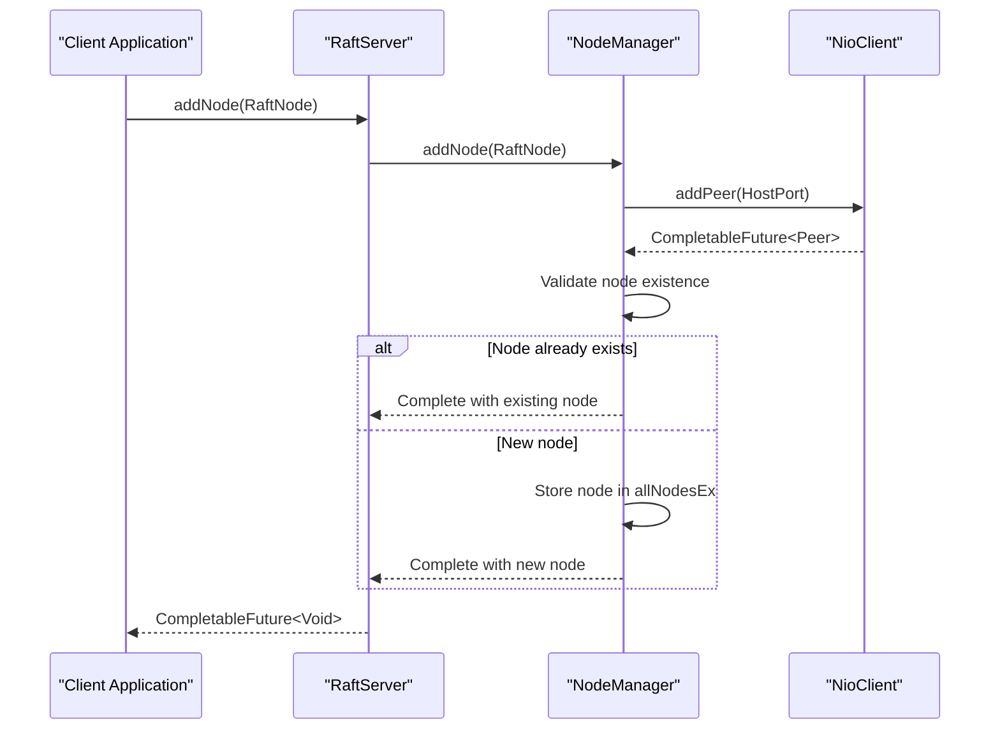
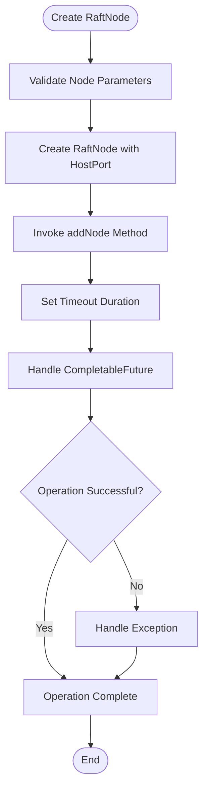
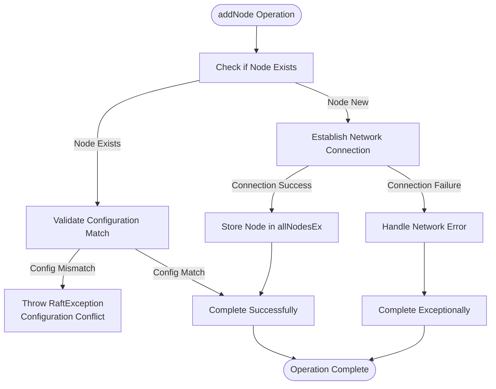
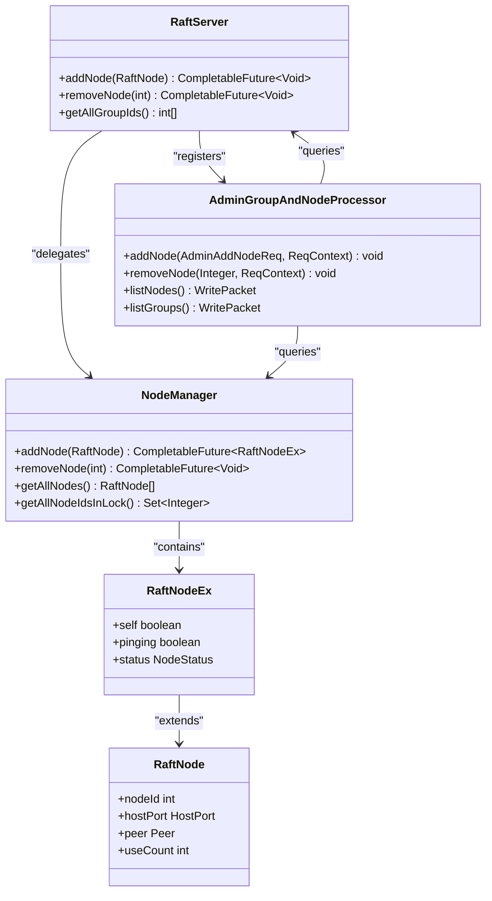

# Add Node Operation

<cite>
**Referenced Files in This Document**   
- [RaftServer.java](file://server/src/main/java/com/github/dtprj/dongting/raft/server/RaftServer.java)
- [NodeManager.java](file://server/src/main/java/com/github/dtprj/dongting/raft/impl/NodeManager.java)
- [RaftNode.java](file://client/src/main/java/com/github/dtprj/dongting/raft/RaftNode.java)
- [AdminGroupAndNodeProcessor.java](file://server/src/main/java/com/github/dtprj/dongting/raft/rpc/AdminGroupAndNodeProcessor.java)
- [RaftNodeEx.java](file://server/src/main/java/com/github/dtprj/dongting/raft/impl/RaftNodeEx.java)
</cite>

## Table of Contents
1. [Introduction](#introduction)
2. [Operation Overview](#operation-overview)
3. [Implementation Details](#implementation-details)
4. [Code Example](#code-example)
5. [Error Handling](#error-handling)
6. [Verification Process](#verification-process)
7. [Relationship to RAFT Membership](#relationship-to-raft-membership)

## Introduction
The addNode operation in the Dongting RAFT implementation provides a mechanism for dynamically adding new nodes to the cluster configuration. This operation establishes network connectivity and updates peer tracking through the NodeManager component, but does not automatically add nodes to RAFT consensus groups. The operation is designed to be idempotent and blocking, ensuring that the node connection is fully established before completion.

## Operation Overview
The addNode operation allows administrators to dynamically expand the cluster by adding new nodes to the configuration. This operation is performed at the configuration level and focuses on establishing network connectivity between nodes rather than modifying RAFT consensus membership. When a new node is added, the system establishes network connections and updates internal tracking of cluster peers, but the node is not automatically included in any RAFT groups.

The operation is idempotent, meaning that attempting to add a node that already exists in the configuration will not cause an error if the node details match. However, if a node with the same ID but different host/port configuration exists, the operation will fail to prevent configuration conflicts. The operation is also blocking, as it waits for the network connection to be established before completing.

**Section sources**
- [RaftServer.java](file://server/src/main/java/com/github/dtprj/dongting/raft/server/RaftServer.java#L548-L554)
- [NodeManager.java](file://server/src/main/java/com/github/dtprj/dongting/raft/impl/NodeManager.java#L55-L65)

## Implementation Details
The addNode operation is implemented through a delegation pattern where the RaftServer class delegates to the NodeManager component to handle the actual node addition process. This separation of concerns allows the RaftServer to focus on high-level cluster management while the NodeManager handles the network connectivity aspects.

**Diagram sources**
- [RaftServer.java](file://server/src/main/java/com/github/dtprj/dongting/raft/server/RaftServer.java#L551-L553)
- [NodeManager.java](file://server/src/main/java/com/github/dtprj/dongting/raft/impl/NodeManager.java#L341-L367)

The RaftServer's addNode method (line 551) serves as a thin wrapper that delegates to the NodeManager's addNode method. The NodeManager first attempts to establish a network connection through the NioClient component by calling addPeer with the node's HostPort information. This asynchronous operation returns a CompletableFuture that will be completed when the connection is established.

Once the network connection is initiated, the NodeManager acquires a lock and performs validation to ensure consistency. If a node with the same ID already exists, the system checks whether the host/port configuration matches. If it matches, the operation is considered idempotent and completes successfully with the existing node. If the host/port differs, the operation fails to prevent configuration conflicts. For new nodes, the system creates a RaftNodeEx instance that extends RaftNode with additional tracking information and stores it in the allNodesEx map.

**Section sources**
- [RaftServer.java](file://server/src/main/java/com/github/dtprj/dongting/raft/server/RaftServer.java#L551-L553)
- [NodeManager.java](file://server/src/main/java/com/github/dtprj/dongting/raft/impl/NodeManager.java#L341-L367)
- [RaftNodeEx.java](file://server/src/main/java/com/github/dtprj/dongting/raft/impl/RaftNodeEx.java#L25-L37)

## Code Example
The following example demonstrates how to create a RaftNode instance and invoke the addNode operation with proper timeout handling:

**Diagram sources**
- [RaftNode.java](file://client/src/main/java/com/github/dtprj/dongting/raft/RaftNode.java#L51-L59)
- [RaftServer.java](file://server/src/main/java/com/github/dtprj/dongting/raft/server/RaftServer.java#L551-L553)

To add a new node to the cluster configuration:

1. Create a HostPort instance with the target node's address and port
2. Create a RaftNode instance with the node ID and HostPort
3. Call the addNode method on the RaftServer instance
4. Handle the returned CompletableFuture with appropriate timeout settings

The operation should be wrapped in proper exception handling to manage potential connection failures or validation errors. The CompletableFuture returned by addNode can be joined with a timeout to prevent indefinite blocking in case of network issues.

**Section sources**
- [RaftNode.java](file://client/src/main/java/com/github/dtprj/dongting/raft/RaftNode.java#L51-L59)
- [RaftServer.java](file://server/src/main/java/com/github/dtprj/dongting/raft/server/RaftServer.java#L551-L553)

## Error Handling
The addNode operation includes comprehensive error handling for various failure scenarios. The primary error conditions include duplicate nodes with conflicting configurations and connection failures during network establishment.

When attempting to add a node that already exists in the configuration, the system performs a detailed validation. If the existing node has the same ID but a different host/port configuration, the operation fails with a RaftException indicating the conflict. This prevents configuration inconsistencies that could lead to cluster instability. The error message includes both the new node's configuration and the existing node's configuration to aid in troubleshooting.

Network connection failures are handled through the underlying NioClient component. If the connection to the specified host/port cannot be established within the configured timeout period, the CompletableFuture will complete exceptionally with a NetTimeoutException. This allows the calling code to implement appropriate retry logic or alerting mechanisms.

**Diagram sources**
- [NodeManager.java](file://server/src/main/java/com/github/dtprj/dongting/raft/impl/NodeManager.java#L347-L355)
- [NioClient.java](file://client/src/main/java/com/github/dtprj/dongting/net/NioClient.java#L115-L130)

**Section sources**
- [NodeManager.java](file://server/src/main/java/com/github/dtprj/dongting/raft/impl/NodeManager.java#L341-L367)
- [NioClient.java](file://client/src/main/java/com/github/dtprj/dongting/net/NioClient.java#L115-L130)

## Verification Process
After adding a node to the cluster configuration, administrators can verify the operation's success using the listNodes administrative command. This command provides a comprehensive view of all nodes currently tracked in the configuration, allowing verification that the new node has been properly added.

The listNodes command is processed by the AdminGroupAndNodeProcessor, which retrieves the current node list from the NodeManager's getAllNodes method. This method acquires the NodeManager's lock to ensure consistency during the read operation, then iterates through the allNodesEx map to create a list of RaftNode instances for return to the client.

**Diagram sources**
- [RaftServer.java](file://server/src/main/java/com/github/dtprj/dongting/raft/server/RaftServer.java#L551-L562)
- [NodeManager.java](file://server/src/main/java/com/github/dtprj/dongting/raft/impl/NodeManager.java#L417-L428)
- [AdminGroupAndNodeProcessor.java](file://server/src/main/java/com/github/dtprj/dongting/raft/rpc/AdminGroupAndNodeProcessor.java#L139-L143)

The verification process typically involves:
1. Calling the listNodes command through the administrative interface
2. Examining the returned list for the presence of the newly added node
3. Confirming that the node's ID and host/port configuration match the expected values
4. Optionally checking the node's status through additional monitoring commands

This verification ensures that the node has been successfully integrated into the cluster configuration and is available for potential inclusion in RAFT groups through separate membership change operations.

**Section sources**
- [NodeManager.java](file://server/src/main/java/com/github/dtprj/dongting/raft/impl/NodeManager.java#L417-L428)
- [AdminGroupAndNodeProcessor.java](file://server/src/main/java/com/github/dtprj/dongting/raft/rpc/AdminGroupAndNodeProcessor.java#L139-L143)
- [RaftNode.java](file://client/src/main/java/com/github/dtprj/dongting/raft/RaftNode.java#L43-L45)

## Relationship to RAFT Membership
It is critical to understand that the addNode operation is distinct from RAFT membership changes. Adding a node to the cluster configuration through addNode only establishes network connectivity and peer tracking; it does not automatically add the node to any RAFT consensus groups.

The separation between configuration-level operations and consensus-level operations provides flexibility in cluster management. Administrators can first establish network connectivity with a new node, verify the connection, and perform any necessary configuration before initiating a RAFT membership change to include the node in the consensus process.

RAFT membership changes are handled through separate administrative commands such as prepareConfigChange, commitConfigChange, and abortConfigChange. These operations follow the RAFT protocol's joint consensus approach to safely change the membership of a RAFT group. Only after a node has been added to the cluster configuration through addNode can it be included in a membership change operation.

This two-step process ensures that network connectivity is established and stable before attempting to integrate the node into the consensus protocol, reducing the risk of instability during membership changes. It also allows for administrative operations like configuration validation and security checks to be performed on the new node before granting it consensus participation rights.

**Section sources**
- [RaftServer.java](file://server/src/main/java/com/github/dtprj/dongting/raft/server/RaftServer.java#L551-L553)
- [AdminGroupAndNodeProcessor.java](file://server/src/main/java/com/github/dtprj/dongting/raft/rpc/AdminGroupAndNodeProcessor.java#L127-L132)