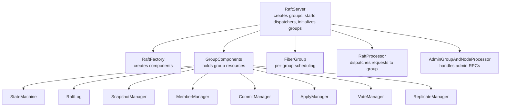
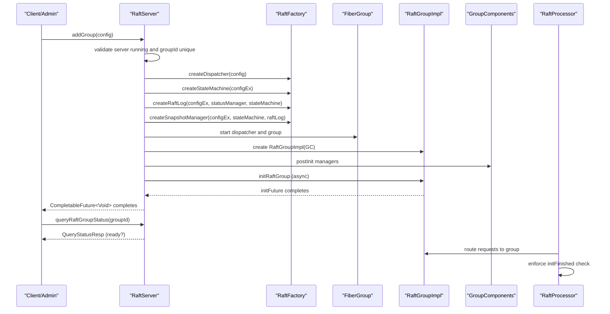
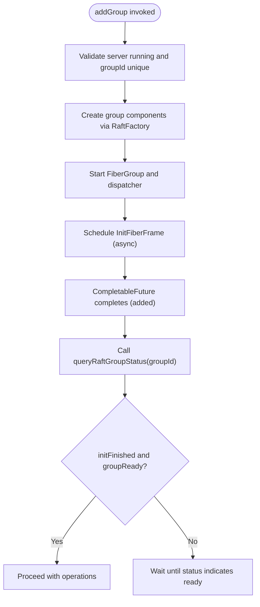
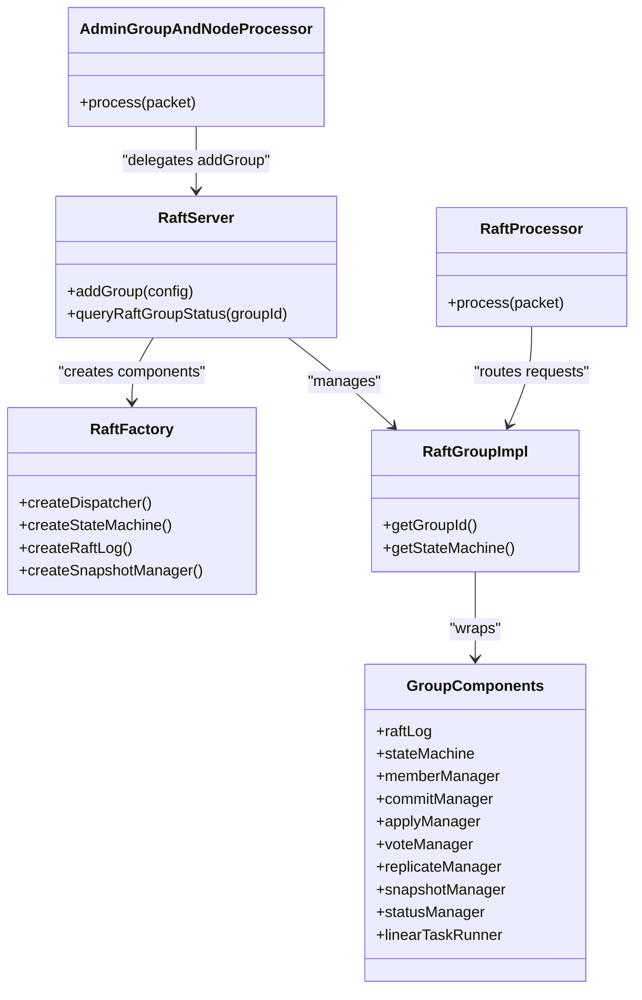

# Add RAFT Group Operation

<cite>
**Referenced Files in This Document**
- [RaftServer.java](file://server/src/main/java/com/github/dtprj/dongting/raft/server/RaftServer.java)
- [RaftGroupConfig.java](file://server/src/main/java/com/github/dtprj/dongting/raft/server/RaftGroupConfig.java)
- [RaftFactory.java](file://server/src/main/java/com/github/dtprj/dongting/raft/server/RaftFactory.java)
- [DefaultRaftFactory.java](file://server/src/main/java/com/github/dtprj/dongting/raft/server/DefaultRaftFactory.java)
- [RaftGroupImpl.java](file://server/src/main/java/com/github/dtprj/dongting/raft/impl/RaftGroupImpl.java)
- [GroupComponents.java](file://server/src/main/java/com/github/dtprj/dongting/raft/impl/GroupComponents.java)
- [AdminGroupAndNodeProcessor.java](file://server/src/main/java/com/github/dtprj/dongting/raft/rpc/AdminGroupAndNodeProcessor.java)
- [AdminAddGroupReq.java](file://server/src/main/java/com/github/dtprj/dongting/raft/rpc/AdminAddGroupReq.java)
- [RaftProcessor.java](file://server/src/main/java/com/github/dtprj/dongting/raft/server/RaftProcessor.java)
- [AddGroup103Demo.java](file://demos/src/main/java/com/github/dtprj/dongting/demos/multiraft/AddGroup103Demo.java)
</cite>

## Table of Contents
1. [Introduction](#introduction)
2. [Project Structure](#project-structure)
3. [Core Components](#core-components)
4. [Architecture Overview](#architecture-overview)
5. [Detailed Component Analysis](#detailed-component-analysis)
6. [Dependency Analysis](#dependency-analysis)
7. [Performance Considerations](#performance-considerations)
8. [Troubleshooting Guide](#troubleshooting-guide)
9. [Conclusion](#conclusion)
10. [Appendices](#appendices)

## Introduction
This document explains the addGroup operation for creating new RAFT consensus groups within a server instance. It focuses on how RaftServer constructs a new RaftGroupImpl with associated resources (FiberGroup, StateMachine, RaftLog, SnapshotManager, and managers), how the operation is non-idempotent and fails if the groupId already exists, and how to properly verify readiness after invoking addGroup. It also covers the asynchronous initialization of groups and the role of RaftFactory in creating group components.

## Project Structure
The addGroup operation spans several modules:
- Server-side orchestration and lifecycle management
- Factory-based component creation
- Group runtime components and managers
- RPC handling for administrative commands

**Diagram sources**
- [RaftServer.java](file://server/src/main/java/com/github/dtprj/dongting/raft/server/RaftServer.java#L222-L301)
- [RaftFactory.java](file://server/src/main/java/com/github/dtprj/dongting/raft/server/RaftFactory.java#L13-L31)
- [GroupComponents.java](file://server/src/main/java/com/github/dtprj/dongting/raft/impl/GroupComponents.java#L31-L53)
- [RaftGroupImpl.java](file://server/src/main/java/com/github/dtprj/dongting/raft/impl/RaftGroupImpl.java#L43-L60)
- [AdminGroupAndNodeProcessor.java](file://server/src/main/java/com/github/dtprj/dongting/raft/rpc/AdminGroupAndNodeProcessor.java#L61-L80)
- [RaftProcessor.java](file://server/src/main/java/com/github/dtprj/dongting/raft/server/RaftProcessor.java#L102-L123)

**Section sources**
- [RaftServer.java](file://server/src/main/java/com/github/dtprj/dongting/raft/server/RaftServer.java#L180-L220)
- [RaftFactory.java](file://server/src/main/java/com/github/dtprj/dongting/raft/server/RaftFactory.java#L13-L31)
- [GroupComponents.java](file://server/src/main/java/com/github/dtprj/dongting/raft/impl/GroupComponents.java#L31-L53)

## Core Components
- RaftServer: Creates and manages groups, starts dispatchers, and initializes groups asynchronously.
- RaftFactory: Interface for constructing group components (StateMachine, RaftLog, SnapshotManager, Dispatcher).
- RaftGroupImpl: Runtime wrapper around GroupComponents and FiberGroup; exposes group operations.
- GroupComponents: Aggregates all group-related resources and managers.
- AdminGroupAndNodeProcessor: RPC handler for administrative commands including addGroup.
- RaftProcessor: Routes requests to the appropriate group; enforces initialization checks.

Key characteristics of addGroup:
- Non-idempotent: Fails if the groupId already exists.
- Asynchronous initialization: Returns a CompletableFuture that completes when the group is added; readiness requires separate verification.
- Resource allocation: Uses RaftFactory to create StateMachine, RaftLog, SnapshotManager, and Dispatcher; wraps them in GroupComponents and RaftGroupImpl.

**Section sources**
- [RaftServer.java](file://server/src/main/java/com/github/dtprj/dongting/raft/server/RaftServer.java#L564-L717)
- [RaftFactory.java](file://server/src/main/java/com/github/dtprj/dongting/raft/server/RaftFactory.java#L13-L31)
- [RaftGroupImpl.java](file://server/src/main/java/com/github/dtprj/dongting/raft/impl/RaftGroupImpl.java#L43-L60)
- [GroupComponents.java](file://server/src/main/java/com/github/dtprj/dongting/raft/impl/GroupComponents.java#L31-L53)
- [AdminGroupAndNodeProcessor.java](file://server/src/main/java/com/github/dtprj/dongting/raft/rpc/AdminGroupAndNodeProcessor.java#L61-L80)
- [RaftProcessor.java](file://server/src/main/java/com/github/dtprj/dongting/raft/server/RaftProcessor.java#L102-L123)

## Architecture Overview
The addGroup flow integrates server orchestration, factory creation, and asynchronous initialization.

**Diagram sources**
- [RaftServer.java](file://server/src/main/java/com/github/dtprj/dongting/raft/server/RaftServer.java#L564-L717)
- [RaftFactory.java](file://server/src/main/java/com/github/dtprj/dongting/raft/server/RaftFactory.java#L13-L31)
- [RaftGroupImpl.java](file://server/src/main/java/com/github/dtprj/dongting/raft/impl/RaftGroupImpl.java#L43-L60)
- [RaftProcessor.java](file://server/src/main/java/com/github/dtprj/dongting/raft/server/RaftProcessor.java#L102-L123)

## Detailed Component Analysis

### addGroup in RaftServer
- Validates server status and groupId uniqueness.
- Acquires nodeManager lock, creates the group via createRaftGroup, updates node use counts, and stores the group.
- Starts the dispatcher and FiberGroup for the new group.
- Initiates asynchronous initialization of the group and logs completion.
- Returns a CompletableFuture<Void> that completes when the group is added; readiness must be verified separately.

Important behaviors:
- Non-idempotent: Throws an exception if groupId already exists.
- Asynchronous: Initialization runs in the group’s FiberGroup; readiness is signaled by initFuture.
- Requires explicit readiness check via queryRaftGroupStatus.

**Section sources**
- [RaftServer.java](file://server/src/main/java/com/github/dtprj/dongting/raft/server/RaftServer.java#L564-L717)

### Creating a RaftGroupImpl with Associated Resources
- Dispatcher and FiberGroup: Created by RaftFactory and used to schedule group tasks.
- RaftStatusImpl: Captures group metadata and timing for status reporting.
- GroupComponents: Aggregates RaftLog, StateMachine, SnapshotManager, and managers (MemberManager, CommitManager, ApplyManager, VoteManager, ReplicateManager).
- RaftGroupImpl: Wraps GroupComponents and FiberGroup; exposes operations like leaseRead and transferLeadership.

Resource allocation flow:
- RaftFactory.createDispatcher
- RaftFactory.createStateMachine
- RaftFactory.createRaftLog (with StatusManager and StateMachine)
- RaftFactory.createSnapshotManager (with StateMachine and RaftLog)
- Managers are constructed and postInit is called
- RaftGroupImpl is instantiated with GroupComponents

**Section sources**
- [RaftServer.java](file://server/src/main/java/com/github/dtprj/dongting/raft/server/RaftServer.java#L222-L301)
- [RaftFactory.java](file://server/src/main/java/com/github/dtprj/dongting/raft/server/RaftFactory.java#L13-L31)
- [GroupComponents.java](file://server/src/main/java/com/github/dtprj/dongting/raft/impl/GroupComponents.java#L31-L53)
- [RaftGroupImpl.java](file://server/src/main/java/com/github/dtprj/dongting/raft/impl/RaftGroupImpl.java#L43-L60)

### Role of RaftFactory
- Provides pluggable creation of:
  - Block I/O executor
  - StateMachine
  - RaftLog
  - SnapshotManager
  - Dispatcher
- DefaultRaftFactory demonstrates default implementations and shared I/O executor management.

**Section sources**
- [RaftFactory.java](file://server/src/main/java/com/github/dtprj/dongting/raft/server/RaftFactory.java#L13-L31)
- [DefaultRaftFactory.java](file://server/src/main/java/com/github/dtprj/dongting/raft/server/DefaultRaftFactory.java#L58-L117)

### Asynchronous Initialization and Readiness Verification
- After addGroup, the group is added to raftGroups and its FiberGroup is started.
- initRaftGroup schedules an InitFiberFrame to initialize the group asynchronously.
- The CompletableFuture returned by addGroup completes when the group is added; readiness is indicated by initFuture inside RaftStatusImpl.
- Use queryRaftGroupStatus to check whether the group is initialized and ready.

**Diagram sources**
- [RaftServer.java](file://server/src/main/java/com/github/dtprj/dongting/raft/server/RaftServer.java#L564-L717)
- [RaftProcessor.java](file://server/src/main/java/com/github/dtprj/dongting/raft/server/RaftProcessor.java#L102-L123)

**Section sources**
- [RaftServer.java](file://server/src/main/java/com/github/dtprj/dongting/raft/server/RaftServer.java#L564-L717)
- [RaftProcessor.java](file://server/src/main/java/com/github/dtprj/dongting/raft/server/RaftProcessor.java#L102-L123)

### Constructing RaftGroupConfig and Invoking addGroup
- RaftGroupConfig holds groupId, member node IDs, observer node IDs, and storage/log parameters.
- Use RaftGroupConfig.newInstance(groupId, members, observers) to build a configuration.
- Invoke RaftServer.addGroup(config) and handle the returned CompletableFuture.
- For error handling, catch exceptions indicating server not running or duplicate groupId.
- After addGroup completes, call queryRaftGroupStatus to confirm readiness.

Practical example references:
- [AddGroup103Demo.java](file://demos/src/main/java/com/github/dtprj/dongting/demos/multiraft/AddGroup103Demo.java#L28-L48) demonstrates adding a group across multiple nodes.

**Section sources**
- [RaftGroupConfig.java](file://server/src/main/java/com/github/dtprj/dongting/raft/server/RaftGroupConfig.java#L24-L75)
- [AddGroup103Demo.java](file://demos/src/main/java/com/github/dtprj/dongting/demos/multiraft/AddGroup103Demo.java#L28-L48)
- [RaftServer.java](file://server/src/main/java/com/github/dtprj/dongting/raft/server/RaftServer.java#L564-L717)

### RPC Path for Administrative addGroup
- AdminGroupAndNodeProcessor handles RAFT_ADMIN_ADD_GROUP and delegates to RaftServer.addGroup.
- Requests are routed by RaftProcessor, which enforces that non-status commands require initFinished.

**Section sources**
- [AdminGroupAndNodeProcessor.java](file://server/src/main/java/com/github/dtprj/dongting/raft/rpc/AdminGroupAndNodeProcessor.java#L61-L80)
- [AdminAddGroupReq.java](file://server/src/main/java/com/github/dtprj/dongting/raft/rpc/AdminAddGroupReq.java#L39-L68)
- [RaftProcessor.java](file://server/src/main/java/com/github/dtprj/dongting/raft/server/RaftProcessor.java#L102-L123)

## Dependency Analysis
- Coupling:
  - RaftServer depends on RaftFactory for component creation and on NodeManager for node accounting.
  - RaftGroupImpl depends on GroupComponents and FiberGroup.
  - GroupComponents aggregates managers and core services.
- Cohesion:
  - RaftFactory centralizes construction of group components.
  - GroupComponents encapsulates all group resources for cohesive management.
- External dependencies:
  - FiberGroup and Dispatcher provide scheduling and execution model.
  - Network processors (AppendProcessor, VoteProcessor, QueryStatusProcessor) integrate with RaftServer.

**Diagram sources**
- [RaftServer.java](file://server/src/main/java/com/github/dtprj/dongting/raft/server/RaftServer.java#L222-L301)
- [RaftFactory.java](file://server/src/main/java/com/github/dtprj/dongting/raft/server/RaftFactory.java#L13-L31)
- [RaftGroupImpl.java](file://server/src/main/java/com/github/dtprj/dongting/raft/impl/RaftGroupImpl.java#L43-L60)
- [GroupComponents.java](file://server/src/main/java/com/github/dtprj/dongting/raft/impl/GroupComponents.java#L31-L53)
- [AdminGroupAndNodeProcessor.java](file://server/src/main/java/com/github/dtprj/dongting/raft/rpc/AdminGroupAndNodeProcessor.java#L61-L80)
- [RaftProcessor.java](file://server/src/main/java/com/github/dtprj/dongting/raft/server/RaftProcessor.java#L102-L123)

**Section sources**
- [RaftServer.java](file://server/src/main/java/com/github/dtprj/dongting/raft/server/RaftServer.java#L222-L301)
- [RaftFactory.java](file://server/src/main/java/com/github/dtprj/dongting/raft/server/RaftFactory.java#L13-L31)
- [RaftGroupImpl.java](file://server/src/main/java/com/github/dtprj/dongting/raft/impl/RaftGroupImpl.java#L43-L60)
- [GroupComponents.java](file://server/src/main/java/com/github/dtprj/dongting/raft/impl/GroupComponents.java#L31-L53)
- [AdminGroupAndNodeProcessor.java](file://server/src/main/java/com/github/dtprj/dongting/raft/rpc/AdminGroupAndNodeProcessor.java#L61-L80)
- [RaftProcessor.java](file://server/src/main/java/com/github/dtprj/dongting/raft/server/RaftProcessor.java#L102-L123)

## Performance Considerations
- Asynchronous initialization avoids blocking the caller; however, heavy initialization may impact early availability.
- Using a shared block I/O executor (as in DefaultRaftFactory) reduces overhead when multiple groups share I/O threads.
- Properly sizing group concurrency parameters (e.g., snapshot concurrency) affects throughput and latency.

[No sources needed since this section provides general guidance]

## Troubleshooting Guide
Common issues and resolutions:
- Duplicate groupId: addGroup throws an exception; ensure unique group IDs.
- Server not running: addGroup completes exceptionally if the server is not in RUNNING state.
- Not ready yet: addGroup completes when added, but the group may not be ready; use queryRaftGroupStatus to confirm.
- RPC routing: RaftProcessor rejects non-status commands for uninitialized groups; ensure the group is initialized before sending normal requests.

**Section sources**
- [RaftServer.java](file://server/src/main/java/com/github/dtprj/dongting/raft/server/RaftServer.java#L564-L717)
- [RaftProcessor.java](file://server/src/main/java/com/github/dtprj/dongting/raft/server/RaftProcessor.java#L102-L123)

## Conclusion
The addGroup operation in RaftServer is designed to be non-idempotent and asynchronous. It constructs a new RaftGroupImpl with associated resources via RaftFactory, starts the group’s dispatcher and FiberGroup, and initializes the group asynchronously. While addGroup completes upon successful addition, readiness must be verified using queryRaftGroupStatus. Proper error handling and readiness checks are essential for robust dynamic group management.

## Appendices

### Example: Constructing RaftGroupConfig and Invoking addGroup
- Build a RaftGroupConfig using RaftGroupConfig.newInstance(groupId, members, observers).
- Invoke RaftServer.addGroup(config) and handle the returned CompletableFuture.
- After completion, call queryRaftGroupStatus to verify readiness before issuing normal operations.

References:
- [RaftGroupConfig.java](file://server/src/main/java/com/github/dtprj/dongting/raft/server/RaftGroupConfig.java#L24-L75)
- [RaftServer.java](file://server/src/main/java/com/github/dtprj/dongting/raft/server/RaftServer.java#L564-L717)
- [AddGroup103Demo.java](file://demos/src/main/java/com/github/dtprj/dongting/demos/multiraft/AddGroup103Demo.java#L28-L48)