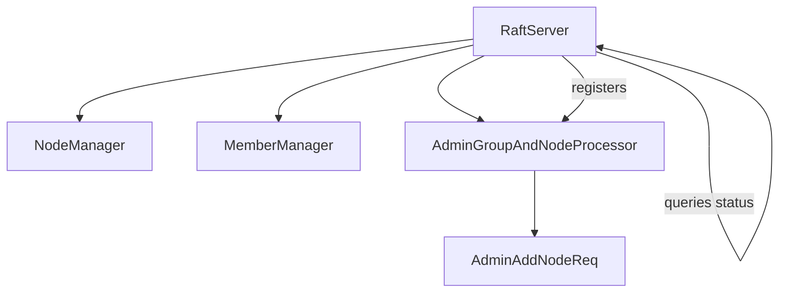
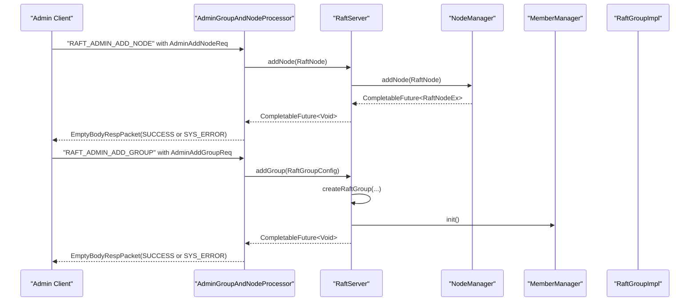
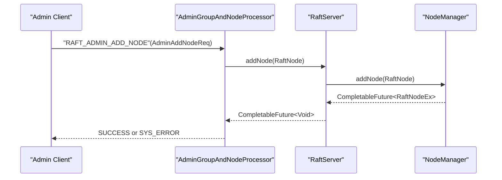
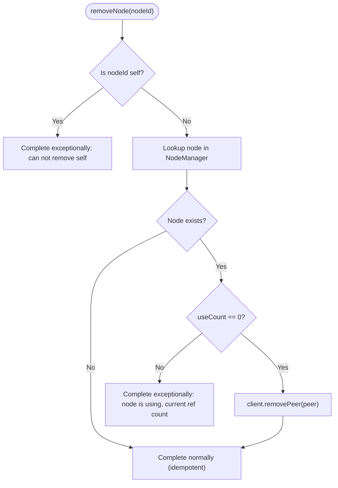
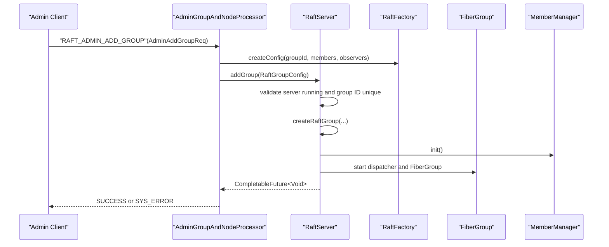
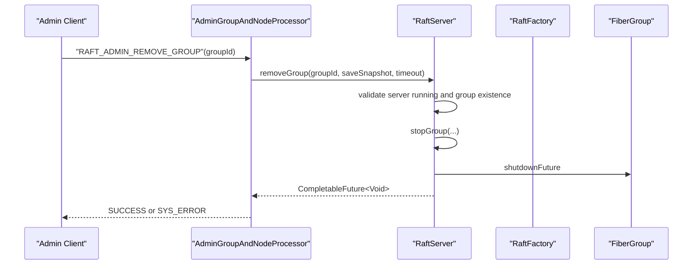
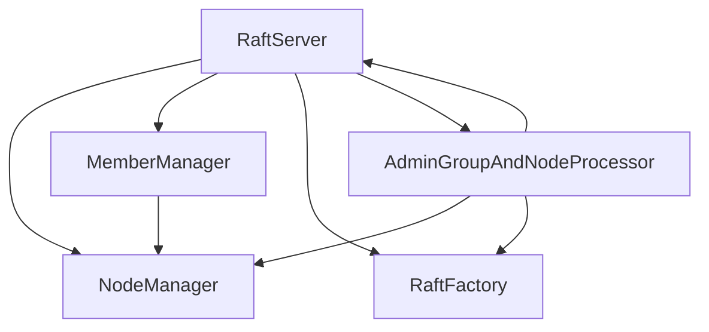

# Dynamic Cluster Management Operations

<cite>
**Referenced Files in This Document**
- [RaftServer.java](file://server/src/main/java/com/github/dtprj/dongting/raft/server/RaftServer.java)
- [NodeManager.java](file://server/src/main/java/com/github/dtprj/dongting/raft/impl/NodeManager.java)
- [MemberManager.java](file://server/src/main/java/com/github/dtprj/dongting/raft/impl/MemberManager.java)
- [AdminGroupAndNodeProcessor.java](file://server/src/main/java/com/github/dtprj/dongting/raft/rpc/AdminGroupAndNodeProcessor.java)
- [AdminAddNodeReq.java](file://server/src/main/java/com/github/dtprj/dongting/raft/rpc/AdminAddNodeReq.java)
- [RaftStatusImpl.java](file://server/src/main/java/com/github/dtprj/dongting/raft/impl/RaftStatusImpl.java)
- [RaftServerConfig.java](file://server/src/main/java/com/github/dtprj/dongting/raft/server/RaftServerConfig.java)
- [RaftGroupConfig.java](file://server/src/main/java/com/github/dtprj/dongting/raft/server/RaftGroupConfig.java)
- [AdminRaftClient.java](file://server/src/main/java/com/github/dtprj/dongting/raft/admin/AdminRaftClient.java)
</cite>

## Table of Contents
1. [Introduction](#introduction)
2. [Project Structure](#project-structure)
3. [Core Components](#core-components)
4. [Architecture Overview](#architecture-overview)
5. [Detailed Component Analysis](#detailed-component-analysis)
6. [Dependency Analysis](#dependency-analysis)
7. [Performance Considerations](#performance-considerations)
8. [Troubleshooting Guide](#troubleshooting-guide)
9. [Conclusion](#conclusion)
10. [Appendices](#appendices)

## Introduction
This document explains dynamic cluster management operations for modifying cluster composition in the RaftServer administrative API. It focuses on four methods:
- addNode
- removeNode
- addGroup
- removeGroup

It details their idempotent nature and operational semantics, how they affect the list of known peers and node connectivity through NodeManager, and how they create or destroy RAFT consensus groups within the server instance. It also covers resource allocation and cleanup, error handling patterns, and success verification via queryRaftGroupStatus. Finally, it clarifies the relationship between these configuration-level operations and RAFT membership changes, noting that configuration-level changes may trigger subsequent consensus-level reconfiguration.

## Project Structure
The dynamic cluster management functionality spans several modules:
- RaftServer: orchestrates lifecycle, manages groups, and exposes administrative APIs.
- NodeManager: maintains the set of known nodes, tracks connectivity, and enforces reference counts for safe removal.
- MemberManager: manages per-group membership, replication, and readiness checks.
- AdminGroupAndNodeProcessor: RPC handler for administrative commands.
- AdminAddNodeReq: request payload for adding a node.
- RaftStatusImpl: per-group runtime status used for verification.
- RaftServerConfig and RaftGroupConfig: configuration objects for server and group initialization.
- AdminRaftClient: client-side helpers for invoking administrative commands.

**Diagram sources**
- [RaftServer.java](file://server/src/main/java/com/github/dtprj/dongting/raft/server/RaftServer.java#L160-L184)
- [NodeManager.java](file://server/src/main/java/com/github/dtprj/dongting/raft/impl/NodeManager.java#L127-L170)
- [MemberManager.java](file://server/src/main/java/com/github/dtprj/dongting/raft/impl/MemberManager.java#L98-L137)
- [AdminGroupAndNodeProcessor.java](file://server/src/main/java/com/github/dtprj/dongting/raft/rpc/AdminGroupAndNodeProcessor.java#L54-L83)
- [AdminAddNodeReq.java](file://server/src/main/java/com/github/dtprj/dongting/raft/rpc/AdminAddNodeReq.java#L27-L69)

**Section sources**
- [RaftServer.java](file://server/src/main/java/com/github/dtprj/dongting/raft/server/RaftServer.java#L160-L184)
- [NodeManager.java](file://server/src/main/java/com/github/dtprj/dongting/raft/impl/NodeManager.java#L127-L170)
- [MemberManager.java](file://server/src/main/java/com/github/dtprj/dongting/raft/impl/MemberManager.java#L98-L137)
- [AdminGroupAndNodeProcessor.java](file://server/src/main/java/com/github/dtprj/dongting/raft/rpc/AdminGroupAndNodeProcessor.java#L54-L83)
- [AdminAddNodeReq.java](file://server/src/main/java/com/github/dtprj/dongting/raft/rpc/AdminAddNodeReq.java#L27-L69)

## Core Components
- RaftServer administrative APIs:
  - addNode: idempotent; adds a node to the known peers and ensures connectivity; may block until connected.
  - removeNode: idempotent; removes a node if its reference count is zero; otherwise fails.
  - addGroup: not idempotent; creates a new RAFT group with provided configuration; returns when added (not necessarily ready).
  - removeGroup: idempotent; stops and removes a group; returns when removed (not necessarily fully shut down).
- NodeManager:
  - Tracks all nodes, maintains peer connections via NIO client, and enforces reference counting across groups.
  - Provides initNodes, addNode, removeNode, and use-count accounting for groups.
- MemberManager:
  - Initializes per-group membership lists and observers, computes quorums, and performs readiness checks.
  - Manages RAFT ping cycles and updates readiness based on node status and epoch.
- AdminGroupAndNodeProcessor:
  - RPC endpoint for addNode, removeNode, addGroup, removeGroup, listNodes, listGroups.
  - Delegates to RaftServer and NodeManager.
- RaftStatusImpl:
  - Exposes group-ready and initialization status used by queryRaftGroupStatus.

**Section sources**
- [RaftServer.java](file://server/src/main/java/com/github/dtprj/dongting/raft/server/RaftServer.java#L548-L666)
- [NodeManager.java](file://server/src/main/java/com/github/dtprj/dongting/raft/impl/NodeManager.java#L342-L398)
- [MemberManager.java](file://server/src/main/java/com/github/dtprj/dongting/raft/impl/MemberManager.java#L98-L137)
- [AdminGroupAndNodeProcessor.java](file://server/src/main/java/com/github/dtprj/dongting/raft/rpc/AdminGroupAndNodeProcessor.java#L117-L137)
- [RaftStatusImpl.java](file://server/src/main/java/com/github/dtprj/dongting/raft/impl/RaftStatusImpl.java#L118-L121)

## Architecture Overview
The administrative APIs are exposed via RPC and processed by AdminGroupAndNodeProcessor, which delegates to RaftServer. RaftServer coordinates NodeManager for peer management and MemberManager for per-group membership and readiness.

**Diagram sources**
- [AdminGroupAndNodeProcessor.java](file://server/src/main/java/com/github/dtprj/dongting/raft/rpc/AdminGroupAndNodeProcessor.java#L117-L137)
- [RaftServer.java](file://server/src/main/java/com/github/dtprj/dongting/raft/server/RaftServer.java#L548-L618)
- [NodeManager.java](file://server/src/main/java/com/github/dtprj/dongting/raft/impl/NodeManager.java#L342-L368)
- [MemberManager.java](file://server/src/main/java/com/github/dtprj/dongting/raft/impl/MemberManager.java#L98-L137)

## Detailed Component Analysis

### addNode
- Purpose: Add a node to the known peers and ensure it is connected.
- Idempotency: Yes. If the node already exists with the same host/port, the operation completes successfully immediately.
- Behavior:
  - Uses NodeManager.addNode to register the peer with the NIO client and record it in the in-memory map.
  - Completes when the peer is registered; may block until the peer becomes reachable depending on internal scheduling and connection attempts.
- Connectivity impact:
  - NodeManager registers the peer with the NIO client and starts periodic node ping to verify reachability and correctness.
  - The node’s status is tracked; once enough nodes meet the quorum threshold, the server considers the node “ready.”
- Error handling:
  - If a node with the same ID exists but with a different host/port, the operation fails.
  - Self-node removal is prevented.
- Example usage:
  - Use AdminRaftClient.serverAddNode to send the administrative request to a target node.

**Diagram sources**
- [AdminGroupAndNodeProcessor.java](file://server/src/main/java/com/github/dtprj/dongting/raft/rpc/AdminGroupAndNodeProcessor.java#L128-L131)
- [RaftServer.java](file://server/src/main/java/com/github/dtprj/dongting/raft/server/RaftServer.java#L548-L554)
- [NodeManager.java](file://server/src/main/java/com/github/dtprj/dongting/raft/impl/NodeManager.java#L342-L368)

**Section sources**
- [RaftServer.java](file://server/src/main/java/com/github/dtprj/dongting/raft/server/RaftServer.java#L548-L554)
- [NodeManager.java](file://server/src/main/java/com/github/dtprj/dongting/raft/impl/NodeManager.java#L342-L368)
- [AdminRaftClient.java](file://server/src/main/java/com/github/dtprj/dongting/raft/admin/AdminRaftClient.java#L191-L201)

### removeNode
- Purpose: Remove a node definition from the known peers.
- Idempotency: Yes. If the node does not exist, the operation completes successfully immediately.
- Behavior:
  - Enforces a reference count check: if the node is still used by any group, the operation fails.
  - Removes the peer from the NIO client and updates internal bookkeeping.
- Error handling:
  - Self-node removal is rejected.
  - If the reference count is non-zero, the operation completes exceptionally.
- Example usage:
  - Use AdminRaftClient.serverRemoveNode to send the administrative request.

**Diagram sources**
- [NodeManager.java](file://server/src/main/java/com/github/dtprj/dongting/raft/impl/NodeManager.java#L370-L398)

**Section sources**
- [RaftServer.java](file://server/src/main/java/com/github/dtprj/dongting/raft/server/RaftServer.java#L556-L562)
- [NodeManager.java](file://server/src/main/java/com/github/dtprj/dongting/raft/impl/NodeManager.java#L370-L398)
- [AdminRaftClient.java](file://server/src/main/java/com/github/dtprj/dongting/raft/admin/AdminRaftClient.java#L203-L210)

### addGroup
- Purpose: Create a new RAFT consensus group within the server instance.
- Idempotency: No. Adding a group with an existing ID fails.
- Behavior:
  - Validates server state and group ID uniqueness.
  - Creates a new RaftGroupImpl with GroupComponents, initializes state machine, log, snapshot manager, and managers.
  - Starts the group’s FiberGroup and dispatcher, then initializes the group asynchronously.
  - Returns when the group is added; it may not yet be ready. Use queryRaftGroupStatus to verify readiness.
- Resource allocation and cleanup:
  - Allocates per-group components: ApplyManager, CommitManager, ReplicateManager, MemberManager, VoteManager, SnapshotManager, StatusManager, TailCache.
  - Starts the dispatcher and FiberGroup for the new group.
- Error handling:
  - Fails early if the server is not running or if the group ID already exists.
  - Propagates exceptions during creation or startup to the returned future.
- Example usage:
  - Use AdminRaftClient.serverAddGroup to send the administrative request with RaftGroupConfig-like parameters.

**Diagram sources**
- [AdminGroupAndNodeProcessor.java](file://server/src/main/java/com/github/dtprj/dongting/raft/rpc/AdminGroupAndNodeProcessor.java#L117-L121)
- [RaftServer.java](file://server/src/main/java/com/github/dtprj/dongting/raft/server/RaftServer.java#L572-L618)
- [MemberManager.java](file://server/src/main/java/com/github/dtprj/dongting/raft/impl/MemberManager.java#L98-L137)

**Section sources**
- [RaftServer.java](file://server/src/main/java/com/github/dtprj/dongting/raft/server/RaftServer.java#L572-L618)
- [AdminRaftClient.java](file://server/src/main/java/com/github/dtprj/dongting/raft/admin/AdminRaftClient.java#L183-L190)

### removeGroup
- Purpose: Remove a RAFT consensus group from the server instance.
- Idempotency: Yes. Removing a non-existent group completes successfully immediately.
- Behavior:
  - Validates server state and whether the group is already stopping.
  - Stops the group gracefully (optionally saving a snapshot), waits for shutdown completion, and removes it from the in-memory map.
  - Decrements reference counts for nodes used by the group.
  - Returns when the group removal process is initiated; the group may still be shutting down. Use queryRaftGroupStatus to verify shutdown completion.
- Resource allocation and cleanup:
  - Shuts down the group’s FiberGroup and closes log, snapshot manager, and status manager.
  - Cleans up TailCache and BlockIO executor via factory.
- Error handling:
  - Fails early if the server is not running.
  - Logs warnings for non-existent or already stopping groups.
- Example usage:
  - Use AdminRaftClient.serverRemoveGroup to send the administrative request.

**Diagram sources**
- [AdminGroupAndNodeProcessor.java](file://server/src/main/java/com/github/dtprj/dongting/raft/rpc/AdminGroupAndNodeProcessor.java#L123-L126)
- [RaftServer.java](file://server/src/main/java/com/github/dtprj/dongting/raft/server/RaftServer.java#L631-L666)

**Section sources**
- [RaftServer.java](file://server/src/main/java/com/github/dtprj/dongting/raft/server/RaftServer.java#L631-L666)
- [AdminRaftClient.java](file://server/src/main/java/com/github/dtprj/dongting/raft/admin/AdminRaftClient.java#L183-L189)

### Relationship to RAFT Membership Changes
- Configuration-level operations:
  - addNode modifies the list of known peers and affects connectivity through NodeManager.
  - addGroup and removeGroup manage RAFT consensus groups within the server instance.
- Consensus-level reconfiguration:
  - These administrative operations are configuration-level changes. They do not directly trigger RAFT membership changes in the log.
  - RAFT membership changes are handled separately via the configuration-change protocol (prepare/commit/abort), managed by MemberManager and the RAFT log. The administrative APIs expose the configuration-level primitives; the consensus-level reconfiguration is a separate process that uses these configurations as inputs.

**Section sources**
- [MemberManager.java](file://server/src/main/java/com/github/dtprj/dongting/raft/impl/MemberManager.java#L339-L580)
- [RaftServer.java](file://server/src/main/java/com/github/dtprj/dongting/raft/server/RaftServer.java#L548-L666)

### Safe Operations and Verification
- Safe addition of a new node:
  - Use AdminRaftClient.serverAddNode to send the request.
  - The operation is idempotent; if the node is already present with the same host/port, it completes successfully.
  - Verify connectivity via node ping and readiness thresholds.
- Graceful removal of a node:
  - Ensure the node is not used by any group (reference count must be zero).
  - Use AdminRaftClient.serverRemoveNode to send the request.
  - The operation is idempotent; if the node does not exist, it completes successfully.
- Verifying success:
  - Use queryRaftGroupStatus to check group readiness and initialization status.
  - For node operations, monitor NodeManager’s nodePingReadyFuture and per-node status.

**Section sources**
- [AdminRaftClient.java](file://server/src/main/java/com/github/dtprj/dongting/raft/admin/AdminRaftClient.java#L191-L210)
- [RaftServer.java](file://server/src/main/java/com/github/dtprj/dongting/raft/server/RaftServer.java#L696-L715)
- [NodeManager.java](file://server/src/main/java/com/github/dtprj/dongting/raft/impl/NodeManager.java#L400-L407)

## Dependency Analysis
- RaftServer depends on:
  - NodeManager for peer registration and connectivity.
  - MemberManager for per-group membership initialization and readiness.
  - RaftFactory for creating group components.
- AdminGroupAndNodeProcessor depends on:
  - RaftServer for administrative actions.
  - NodeManager for listing nodes.
  - RaftFactory for creating group configs.
- NodeManager depends on:
  - NIO client/server for network communication.
  - RaftServerConfig for timeouts and quorum computation.
- MemberManager depends on:
  - NodeManager for node status and peer references.
  - ReplicateManager for starting replication fibers.

**Diagram sources**
- [RaftServer.java](file://server/src/main/java/com/github/dtprj/dongting/raft/server/RaftServer.java#L160-L184)
- [AdminGroupAndNodeProcessor.java](file://server/src/main/java/com/github/dtprj/dongting/raft/rpc/AdminGroupAndNodeProcessor.java#L48-L52)

**Section sources**
- [RaftServer.java](file://server/src/main/java/com/github/dtprj/dongting/raft/server/RaftServer.java#L160-L184)
- [AdminGroupAndNodeProcessor.java](file://server/src/main/java/com/github/dtprj/dongting/raft/rpc/AdminGroupAndNodeProcessor.java#L48-L52)

## Performance Considerations
- Administrative operations may block while establishing connections or initializing groups. Use timeouts and asynchronous completion patterns to avoid deadlocks.
- NodeManager’s node ping runs periodically; tune ping intervals and timeouts according to network conditions.
- Group initialization and startup involve multiple futures; batch operations where appropriate to reduce overhead.
- Reference counting prevents premature removal of nodes used by groups; ensure groups are properly configured before attempting removal.

## Troubleshooting Guide
- addNode fails with “node already exist but host/port is not same”:
  - Indicates a conflicting node definition. Correct the host/port or remove the existing node first.
- removeNode fails with “node is using, current ref count”:
  - The node is still referenced by one or more groups. Remove the node from all group memberships first, or stop the groups using it.
- addGroup fails with “group already exist”:
  - Choose a unique group ID.
- removeGroup returns immediately but group is still running:
  - Use queryRaftGroupStatus to confirm shutdown completion.
- queryRaftGroupStatus returns NoSuchGroupException:
  - The group ID does not exist or was removed.

**Section sources**
- [NodeManager.java](file://server/src/main/java/com/github/dtprj/dongting/raft/impl/NodeManager.java#L342-L368)
- [RaftServer.java](file://server/src/main/java/com/github/dtprj/dongting/raft/server/RaftServer.java#L696-L715)

## Conclusion
The RaftServer administrative APIs provide robust mechanisms for dynamic cluster management:
- addNode and removeNode operate on the set of known peers and enforce safe connectivity and reference counting.
- addGroup and removeGroup manage RAFT consensus groups, allocating and cleaning up resources appropriately.
- These operations are configuration-level; RAFT membership changes occur via the consensus protocol and are coordinated by MemberManager.
- Use queryRaftGroupStatus to verify readiness and completion of administrative operations.

## Appendices

### API Definitions and Semantics
- addNode(RaftNode):
  - Idempotent: yes
  - Blocks: may block until connected
  - Returns: CompletableFuture<Void>
- removeNode(int nodeId):
  - Idempotent: yes
  - Blocks: no
  - Returns: CompletableFuture<Void>; fails if reference count > 0
- addGroup(RaftGroupConfig):
  - Idempotent: no
  - Blocks: may block during creation and startup
  - Returns: CompletableFuture<Void>; group may not be ready yet
- removeGroup(int groupId, boolean saveSnapshot, DtTime timeout):
  - Idempotent: yes
  - Blocks: may block during shutdown
  - Returns: CompletableFuture<Void>; group may still be stopping

**Section sources**
- [RaftServer.java](file://server/src/main/java/com/github/dtprj/dongting/raft/server/RaftServer.java#L548-L666)

### Example Workflows
- Safely add a new node:
  - Send AdminRaftClient.serverAddNode to the target node.
  - Verify node connectivity via node ping and readiness thresholds.
- Gracefully remove a node:
  - Ensure reference count is zero.
  - Send AdminRaftClient.serverRemoveNode to the target node.
  - Confirm removal via listNodes.

**Section sources**
- [AdminRaftClient.java](file://server/src/main/java/com/github/dtprj/dongting/raft/admin/AdminRaftClient.java#L191-L210)
- [AdminGroupAndNodeProcessor.java](file://server/src/main/java/com/github/dtprj/dongting/raft/rpc/AdminGroupAndNodeProcessor.java#L139-L149)