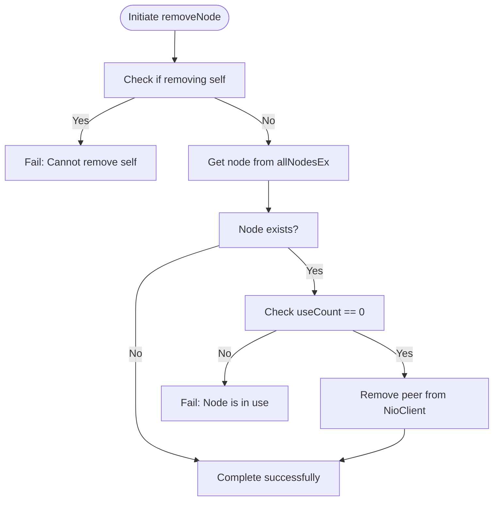
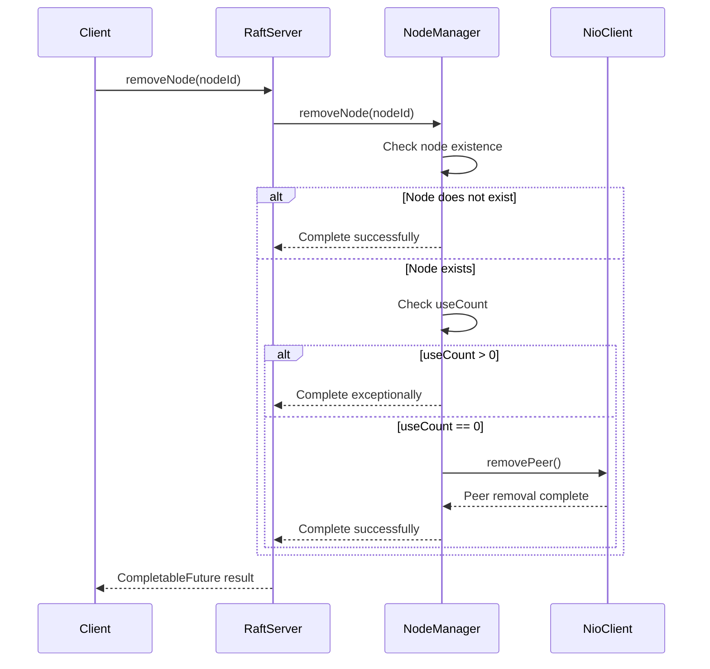
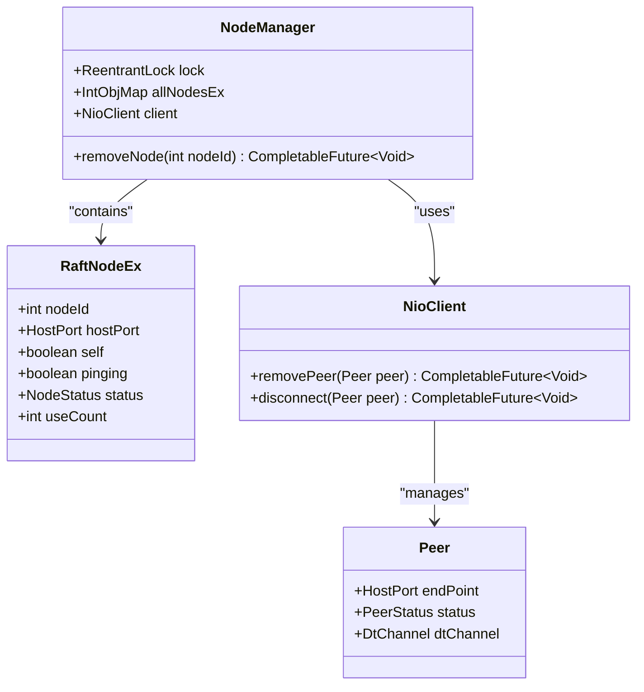
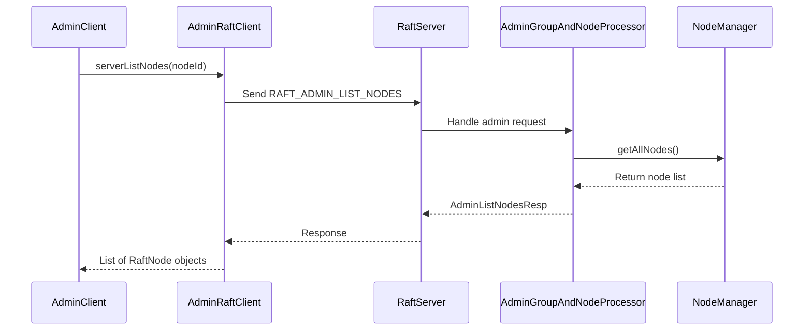

# Remove Node Operation

<cite>
**Referenced Files in This Document**   
- [RaftServer.java](file://server/src/main/java/com/github/dtprj/dongting/raft/server/RaftServer.java)
- [NodeManager.java](file://server/src/main/java/com/github/dtprj/dongting/raft/impl/NodeManager.java)
- [RaftNode.java](file://client/src/main/java/com/github/dtprj/dongting/raft/RaftNode.java)
- [AdminGroupAndNodeProcessor.java](file://server/src/main/java/com/github/dtprj/dongting/raft/rpc/AdminGroupAndNodeProcessor.java)
- [AdminListNodesResp.java](file://server/src/main/java/com/github/dtprj/dongting/raft/rpc/AdminListNodesResp.java)
- [AdminRaftClient.java](file://server/src/main/java/com/github/dtprj/dongting/raft/admin/AdminRaftClient.java)
</cite>

## Table of Contents
1. [Introduction](#introduction)
2. [Reference Count Validation](#reference-count-validation)
3. [Idempotent Behavior](#idempotent-behavior)
4. [Node Removal Process](#node-removal-process)
5. [Cleanup Process in NodeManager](#cleanup-process-in-nodemanager)
6. [Error Handling](#error-handling)
7. [Verification with listNodes Command](#verification-with-listnodes-command)
8. [Code Example](#code-example)
9. [Conclusion](#conclusion)

## Introduction
The removeNode operation in the Raft implementation provides a safe mechanism for removing nodes from the cluster configuration. This operation ensures cluster consistency by preventing the removal of nodes that are still actively referenced by RAFT groups. The operation is designed to be idempotent, allowing repeated calls without side effects, and handles both existing and non-existent nodes gracefully. This document details the implementation, behavior, and usage patterns of the removeNode operation.

## Reference Count Validation
The removeNode method in RaftServer delegates to NodeManager to check reference counts before allowing node removal. Each RaftNode maintains a useCount field that tracks how many RAFT groups are currently using the node. When a node is part of a RAFT group configuration (as a member, observer, or in prepared state), its reference count is incremented. The removal process only proceeds when the reference count reaches zero, ensuring that no active RAFT groups depend on the node.



**Diagram sources**
- [NodeManager.java](file://server/src/main/java/com/github/dtprj/dongting/raft/impl/NodeManager.java#L370-L398)

**Section sources**
- [NodeManager.java](file://server/src/main/java/com/github/dtprj/dongting/raft/impl/NodeManager.java#L370-L398)
- [RaftNode.java](file://client/src/main/java/com/github/dtprj/dongting/raft/RaftNode.java#L47)

## Idempotent Behavior
The removeNode operation is designed to be idempotent, meaning that multiple identical requests have the same effect as a single request. This property is essential for reliable distributed systems where network issues might cause clients to retry operations. When attempting to remove a non-existent node, the operation completes successfully rather than throwing an exception. Similarly, attempting to remove a node that has already been removed results in successful completion.



**Diagram sources**
- [RaftServer.java](file://server/src/main/java/com/github/dtprj/dongting/raft/server/RaftServer.java#L560-L562)
- [NodeManager.java](file://server/src/main/java/com/github/dtprj/dongting/raft/impl/NodeManager.java#L370-L398)

**Section sources**
- [RaftServer.java](file://server/src/main/java/com/github/dtprj/dongting/raft/server/RaftServer.java#L560-L562)
- [NodeManager.java](file://server/src/main/java/com/github/dtprj/dongting/raft/impl/NodeManager.java#L370-L398)

## Node Removal Process
The node removal process begins with a call to RaftServer.removeNode(int nodeId), which delegates to NodeManager.removeNode(int nodeId). The operation first checks if the node being removed is the local node (self), which is prohibited to prevent accidental self-removal. Then, it acquires a lock to ensure thread safety during the operation. The method checks if the node exists in the allNodesEx map and verifies that its useCount is zero before proceeding with removal.

When the reference count validation passes, the operation initiates peer removal through the NioClient, which handles the network-level disconnection. The CompletableFuture returned by removeNode completes when the peer removal is confirmed, ensuring that clients can properly handle the asynchronous nature of the operation.

**Section sources**
- [RaftServer.java](file://server/src/main/java/com/github/dtprj/dongting/raft/server/RaftServer.java#L560-L562)
- [NodeManager.java](file://server/src/main/java/com/github/dtprj/dongting/raft/impl/NodeManager.java#L370-L398)

## Cleanup Process in NodeManager
When a node is successfully removed, NodeManager performs comprehensive cleanup of associated resources. The primary cleanup action is the termination of the network connection through NioClient.removePeer(), which disconnects the underlying TCP connection and cleans up associated I/O resources. The peer object is removed from the client's peer list, and any pending requests to the removed node are canceled.

The cleanup process also includes removing the node from the allNodesEx map, which stores all known nodes in the cluster. This ensures that subsequent operations will not attempt to communicate with the removed node. The useCount field is not explicitly reset since the entire RaftNodeEx object is removed from the map, effectively deallocating all resources associated with the node.



**Diagram sources**
- [NodeManager.java](file://server/src/main/java/com/github/dtprj/dongting/raft/impl/NodeManager.java#L65-L66)
- [NioClient.java](file://client/src/main/java/com/github/dtprj/dongting/net/NioClient.java#L256-L274)
- [RaftNode.java](file://client/src/main/java/com/github/dtprj/dongting/raft/RaftNode.java#L43-L48)

**Section sources**
- [NodeManager.java](file://server/src/main/java/com/github/dtprj/dongting/raft/impl/NodeManager.java#L385)
- [NioClient.java](file://client/src/main/java/com/github/dtprj/dongting/net/NioClient.java#L256-L274)

## Error Handling
The removeNode operation implements comprehensive error handling to address various failure scenarios. The primary error condition occurs when attempting to remove a node with an active reference count (useCount > 0), which results in a RaftException with a descriptive message indicating the current reference count. This prevents accidental removal of nodes that are still in use by RAFT groups, maintaining cluster consistency.

Additional error handling includes preventing self-removal, which would destabilize the local node, and handling non-existent nodes gracefully by completing successfully rather than throwing an exception. Network-level errors during peer removal are propagated through the CompletableFuture, allowing callers to handle timeouts or connection issues appropriately.

**Section sources**
- [NodeManager.java](file://server/src/main/java/com/github/dtprj/dongting/raft/impl/NodeManager.java#L372-L388)

## Verification with listNodes Command
After initiating node removal, administrators can verify the operation's success using the listNodes administrative command. This command returns a list of all nodes currently configured in the cluster, allowing verification that the removed node no longer appears in the configuration. The listNodes operation is implemented in AdminGroupAndNodeProcessor and returns an AdminListNodesResp containing the current node list.

The verification process typically involves calling serverListNodes through AdminRaftClient, which sends a RAFT_ADMIN_LIST_NODES command to the target node and returns the current node configuration. This provides a reliable way to confirm that the node removal has been fully processed and reflected in the cluster state.



**Diagram sources**
- [AdminRaftClient.java](file://server/src/main/java/com/github/dtprj/dongting/raft/admin/AdminRaftClient.java#L215-L221)
- [AdminGroupAndNodeProcessor.java](file://server/src/main/java/com/github/dtprj/dongting/raft/rpc/AdminGroupAndNodeProcessor.java#L139-L142)
- [NodeManager.java](file://server/src/main/java/com/github/dtprj/dongting/raft/impl/NodeManager.java#L417-L425)

**Section sources**
- [AdminRaftClient.java](file://server/src/main/java/com/github/dtprj/dongting/raft/admin/AdminRaftClient.java#L215-L221)
- [AdminGroupAndNodeProcessor.java](file://server/src/main/java/com/github/dtprj/dongting/raft/rpc/AdminGroupAndNodeProcessor.java#L139-L142)
- [NodeManager.java](file://server/src/main/java/com/github/dtprj/dongting/raft/impl/NodeManager.java#L417-L425)

## Code Example
The following example demonstrates how to initiate node removal and handle the result using the CompletableFuture API:

```java
// Initiate node removal by nodeId
CompletableFuture<Void> removalFuture = raftServer.removeNode(targetNodeId);

// Handle the result asynchronously
removalFuture.whenComplete((result, throwable) -> {
    if (throwable != null) {
        if (throwable.getCause() instanceof RaftException) {
            System.err.println("Node removal failed: " + throwable.getCause().getMessage());
            // Handle specific RaftException cases
            if (throwable.getCause().getMessage().contains("can not remove self")) {
                // Handle self-removal attempt
            } else if (throwable.getCause().getMessage().contains("node is using")) {
                // Handle active reference case
                String countStr = throwable.getCause().getMessage().replaceAll(".*current ref count: ", "");
                int currentCount = Integer.parseInt(countStr);
                System.err.println("Node has " + currentCount + " active references");
            }
        } else {
            // Handle network or timeout errors
            System.err.println("Node removal failed due to: " + throwable.getMessage());
        }
    } else {
        System.out.println("Node removal completed successfully");
        
        // Verify removal with listNodes command
        adminClient.serverListNodes(targetNodeId).thenAccept(nodes -> {
            boolean removed = nodes.stream().noneMatch(n -> n.nodeId == targetNodeId);
            System.out.println("Node removal verified: " + removed);
        }).exceptionally(ex -> {
            System.err.println("Failed to verify node removal: " + ex.getMessage());
            return null;
        });
    }
});

// Alternatively, wait synchronously with timeout
try {
    removalFuture.get(30, TimeUnit.SECONDS);
    System.out.println("Node removal completed successfully");
} catch (TimeoutException e) {
    System.err.println("Node removal timed out");
    removalFuture.cancel(true);
} catch (ExecutionException e) {
    Throwable cause = e.getCause();
    if (cause instanceof RaftException) {
        System.err.println("Node removal failed: " + cause.getMessage());
    } else {
        System.err.println("Node removal failed due to: " + cause.getMessage());
    }
} catch (InterruptedException e) {
    Thread.currentThread().interrupt();
    System.err.println("Node removal interrupted");
}
```

**Section sources**
- [RaftServer.java](file://server/src/main/java/com/github/dtprj/dongting/raft/server/RaftServer.java#L560-L562)
- [AdminRaftClient.java](file://server/src/main/java/com/github/dtprj/dongting/raft/admin/AdminRaftClient.java#L215-L221)

## Conclusion
The removeNode operation in the Raft implementation provides a safe and reliable mechanism for removing nodes from the cluster configuration. By checking reference counts before removal, the system ensures that nodes actively used by RAFT groups cannot be accidentally removed, maintaining cluster consistency. The idempotent nature of the operation allows for safe retries, while comprehensive error handling provides clear feedback for various failure scenarios. The integration with the listNodes administrative command enables verification of successful removal, completing a robust node management workflow.