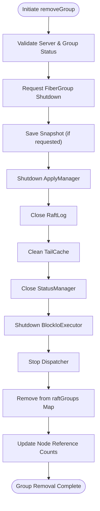
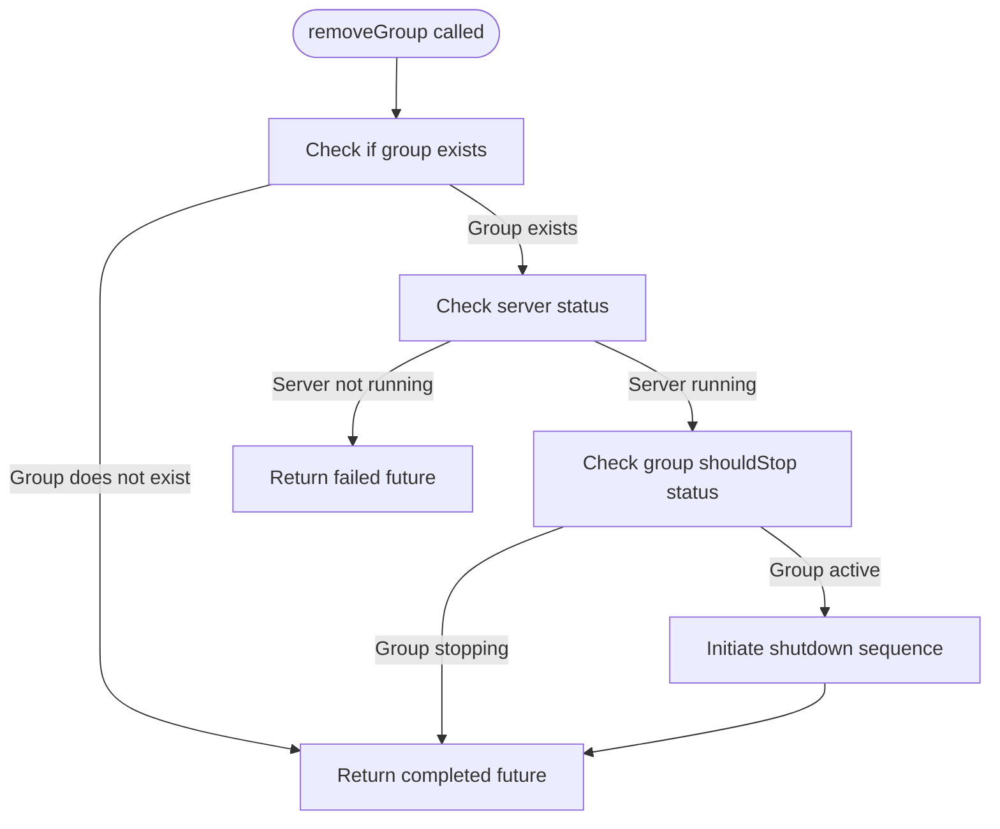
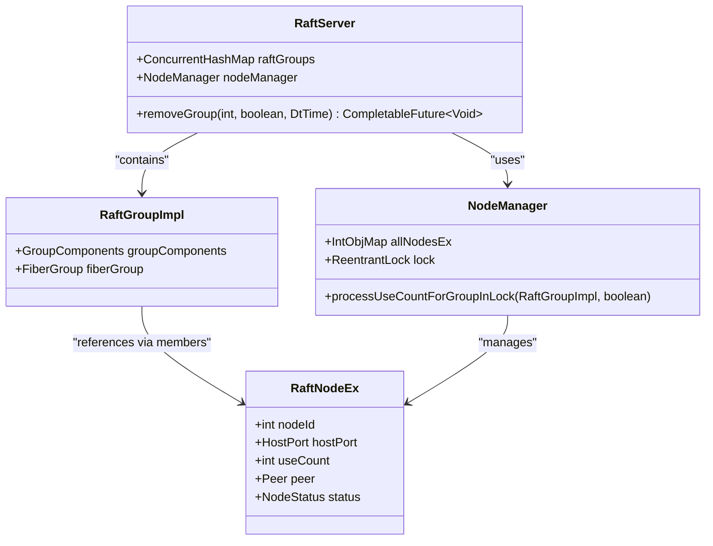
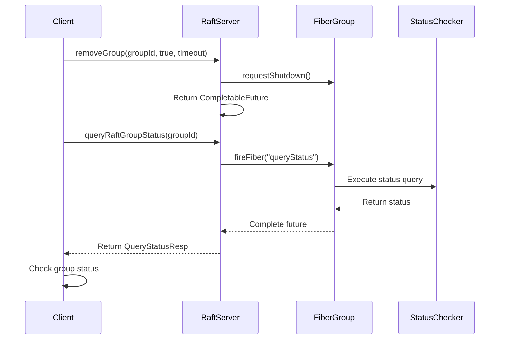

# Remove RAFT Group Operation

<cite>
**Referenced Files in This Document**   
- [RaftServer.java](file://server/src/main/java/com/github/dtprj/dongting/raft/server/RaftServer.java)
- [RaftGroupImpl.java](file://server/src/main/java/com/github/dtprj/dongting/raft/impl/RaftGroupImpl.java)
- [NodeManager.java](file://server/src/main/java/com/github/dtprj/dongting/raft/impl/NodeManager.java)
- [FiberGroup.java](file://server/src/main/java/com/github/dtprj/dongting/fiber/FiberGroup.java)
- [RaftLog.java](file://server/src/main/java/com/github/dtprj/dongting/raft/store/RaftLog.java)
- [DefaultRaftLog.java](file://server/src/main/java/com/github/dtprj/dongting/raft/store/DefaultRaftLog.java)
- [DefaultSnapshotManager.java](file://server/src/main/java/com/github/dtprj/dongting/raft/sm/DefaultSnapshotManager.java)
- [AdminGroupAndNodeProcessor.java](file://server/src/main/java/com/github/dtprj/dongting/raft/rpc/AdminGroupAndNodeProcessor.java)
</cite>

## Table of Contents
1. [Introduction](#introduction)
2. [removeGroup Operation Overview](#removegroup-operation-overview)
3. [Graceful Shutdown Sequence](#graceful-shutdown-sequence)
4. [Idempotent Behavior and Error Handling](#idempotent-behavior-and-error-handling)
5. [Resource Cleanup Process](#resource-cleanup-process)
6. [Code Example: Initiating Group Removal](#code-example-initiating-group-removal)
7. [Verification Using queryRaftGroupStatus](#verification-using-queryraftgroupstatus)
8. [Conclusion](#conclusion)

## Introduction
The removeGroup operation in the RAFT consensus system provides a mechanism for gracefully shutting down and removing a RAFT consensus group from a running RaftServer instance. This operation ensures proper cleanup of resources, maintains data consistency, and follows a well-defined shutdown sequence. The operation is designed to be idempotent, allowing safe repeated calls without adverse effects. This document details the implementation, behavior, and usage patterns of the removeGroup operation, focusing on its role in maintaining system stability during group removal.

## removeGroup Operation Overview

The removeGroup operation is an administrative API provided by the RaftServer class that initiates the removal of a specified RAFT consensus group. This operation is accessible through both direct method calls and remote procedure calls (RPC) via the AdminGroupAndNodeProcessor. The operation follows a structured approach to ensure that the group is properly shut down before being removed from the server's management structures.

The primary method signature for removeGroup is:
```java
public CompletableFuture<Void> removeGroup(int groupId, boolean saveSnapshot, DtTime shutdownTimeout)
```

This method takes three parameters:
- **groupId**: The identifier of the RAFT group to be removed
- **saveSnapshot**: A boolean flag indicating whether to save a snapshot before shutdown
- **shutdownTimeout**: A timeout value specifying the maximum time allowed for the shutdown process

The operation is designed to be non-blocking, returning a CompletableFuture that completes when the removal request has been processed, though the actual shutdown may continue asynchronously. The method is idempotent, meaning that calling it multiple times with the same groupId will not cause errors or duplicate processing.

**Section sources**
- [RaftServer.java](file://server/src/main/java/com/github/dtprj/dongting/raft/server/RaftServer.java#L631-L666)
- [AdminGroupAndNodeProcessor.java](file://server/src/main/java/com/github/dtprj/dongting/raft/rpc/AdminGroupAndNodeProcessor.java#L123-L126)

## Graceful Shutdown Sequence

The removeGroup operation initiates a comprehensive shutdown sequence that ensures all components of the RAFT group are properly terminated in the correct order. This sequence is implemented through the stopGroup method in RaftServer, which coordinates the shutdown of various components in a specific order to maintain data consistency and system stability.



**Diagram sources **
- [RaftServer.java](file://server/src/main/java/com/github/dtprj/dongting/raft/server/RaftServer.java#L504-L546)
- [FiberGroup.java](file://server/src/main/java/com/github/dtprj/dongting/fiber/FiberGroup.java#L94-L110)

The shutdown sequence begins with validating the server and group status to ensure the operation can proceed. The FiberGroup is then requested to shut down, which stops the execution of all fibers associated with the group. If the saveSnapshot parameter is true, the snapshot manager is invoked to create a persistent snapshot of the current state. Following this, the ApplyManager is shut down, which stops the application of new log entries to the state machine. The RaftLog is then closed, ensuring all pending writes are flushed to disk and file handles are properly released. The TailCache is cleaned, the StatusManager is closed, and the block I/O executor is shut down. Finally, the dispatcher is stopped, completing the shutdown of the group's execution environment.

## Idempotent Behavior and Error Handling

The removeGroup operation is designed to be idempotent, meaning that multiple invocations with the same parameters produce the same result as a single invocation. This design choice enhances system reliability by allowing clients to retry the operation without concern for unintended side effects. The idempotent nature is implemented through careful state checking at the beginning of the operation.



**Diagram sources **
- [RaftServer.java](file://server/src/main/java/com/github/dtprj/dongting/raft/server/RaftServer.java#L632-L643)

When removeGroup is called for a non-existent group, the operation logs a warning and returns a completed CompletableFuture, treating the operation as successful since the desired end state (group not present) is already achieved. Similarly, if the group is already in the process of stopping (indicated by the shouldStop flag in RaftStatus), the operation returns a completed future without taking further action. This prevents race conditions and ensures consistent behavior regardless of the number of times the operation is invoked.

Error handling is implemented through CompletableFuture exceptions. If the RaftServer itself is not in a running state, the operation returns a failed future with a RaftException indicating that the server is not running. This prevents group removal during server shutdown or initialization phases, maintaining system integrity.

**Section sources**
- [RaftServer.java](file://server/src/main/java/com/github/dtprj/dongting/raft/server/RaftServer.java#L631-L666)
- [RaftStatusImpl.java](file://server/src/main/java/com/github/dtprj/dongting/raft/impl/RaftStatusImpl.java)

## Resource Cleanup Process

The resource cleanup process during group removal involves two critical aspects: removal from the server's internal data structures and updating reference counts in the NodeManager. These operations ensure that system resources are properly released and that the server's state remains consistent.

The primary data structure for managing RAFT groups is the ConcurrentHashMap named raftGroups in the RaftServer class. When a group is successfully shut down, it is removed from this map using a compute operation that ensures atomicity:

```java
raftGroups.compute(groupId, (k, oldGroupInMap) -> {
    if (oldGroupInMap == g) {
        removed[0] = true;
        return null;
    }
    return oldGroupInMap;
});
```

This atomic operation prevents race conditions that could occur if multiple threads attempted to remove the same group simultaneously. The compute operation ensures that the group is only removed if it still references the same RaftGroupImpl instance, providing a thread-safe mechanism for map modification.

Concurrently, the NodeManager is responsible for tracking reference counts for each node in the cluster. When a group is removed, the node references must be decremented to reflect that the group no longer uses those nodes. This is accomplished through the processUseCountForGroupInLock method:



**Diagram sources **
- [RaftServer.java](file://server/src/main/java/com/github/dtprj/dongting/raft/server/RaftServer.java#L93)
- [NodeManager.java](file://server/src/main/java/com/github/dtprj/dongting/raft/impl/NodeManager.java#L65)
- [RaftGroupImpl.java](file://server/src/main/java/com/github/dtprj/dongting/raft/impl/RaftGroupImpl.java#L46)

The reference count update occurs within a lock to ensure thread safety, preventing concurrent modifications that could lead to incorrect reference counts. This is particularly important in distributed systems where multiple administrative operations might be occurring simultaneously. The use of reference counting allows the system to determine when a node is no longer needed by any group, enabling potential cleanup or reconfiguration of cluster nodes.

**Section sources**
- [RaftServer.java](file://server/src/main/java/com/github/dtprj/dongting/raft/server/RaftServer.java#L645-L663)
- [NodeManager.java](file://server/src/main/java/com/github/dtprj/dongting/raft/impl/NodeManager.java#L323-L330)

## Code Example: Initiating Group Removal

The following code example demonstrates how to initiate the removal of a RAFT group with proper shutdown timeout and snapshot policy. This example shows both direct method invocation and the typical usage pattern within an administrative context.

```java
// Example of initiating group removal with proper parameters
public void removeRaftGroupExample(RaftServer server, int groupId) {
    // Define shutdown timeout (30 seconds)
    DtTime shutdownTimeout = new DtTime(30, TimeUnit.SECONDS);
    
    // Specify whether to save snapshot before shutdown
    boolean saveSnapshot = true;
    
    // Initiate group removal
    CompletableFuture<Void> removalFuture = server.removeGroup(
        groupId, 
        saveSnapshot, 
        shutdownTimeout
    );
    
    // Handle completion asynchronously
    removalFuture.whenComplete((result, exception) -> {
        if (exception == null) {
            System.out.println("Group " + groupId + " removal initiated successfully");
        } else {
            System.err.println("Failed to remove group " + groupId + ": " + exception.getMessage());
        }
    });
}
```

The example illustrates the recommended approach for calling removeGroup:
1. Create a DtTime object to specify the maximum allowed shutdown duration
2. Determine the snapshot policy based on operational requirements
3. Call removeGroup with the appropriate parameters
4. Use the returned CompletableFuture to handle completion asynchronously

The shutdown timeout parameter is crucial for preventing indefinite blocking in cases where the shutdown process encounters issues. The snapshot policy should be set to true in production environments to ensure that the latest state is preserved before shutdown, facilitating faster recovery if the group is later recreated.

**Section sources**
- [RaftServer.java](file://server/src/main/java/com/github/dtprj/dongting/raft/server/RaftServer.java#L631-L666)
- [DtTime.java](file://client/src/main/java/com/github/dtprj/dongting/common/DtTime.java)

## Verification Using queryRaftGroupStatus

After initiating the removeGroup operation, it is essential to verify that the group has been successfully removed and its resources have been properly cleaned up. The RaftServer provides the queryRaftGroupStatus method specifically for this purpose, allowing clients to monitor the status of RAFT groups during and after administrative operations.



**Diagram sources **
- [RaftServer.java](file://server/src/main/java/com/github/dtprj/dongting/raft/server/RaftServer.java#L696-L714)
- [QueryStatusProcessor.java](file://server/src/main/java/com/github/dtprj/dongting/raft/rpc/QueryStatusProcessor.java)

The verification process typically involves periodically calling queryRaftGroupStatus with the target groupId until the operation completes. Initially, this will return status information about the group. Once the group has been successfully removed, subsequent calls will return a NoSuchGroupException. This pattern allows clients to implement robust verification logic:

```java
public void verifyGroupRemoval(RaftServer server, int groupId) {
    CompletableFuture<QueryStatusResp> statusFuture = server.queryRaftGroupStatus(groupId);
    
    statusFuture.whenComplete((status, exception) -> {
        if (exception != null) {
            if (exception.getCause() instanceof NoSuchGroupException) {
                System.out.println("Group " + groupId + " has been successfully removed");
            } else {
                System.err.println("Error checking group status: " + exception.getMessage());
            }
        } else {
            System.out.println("Group " + groupId + " still exists with status: " + status.getRole());
            // Group still exists, check again later or take appropriate action
        }
    });
}
```

This verification approach ensures that administrative operations can confirm the success of group removal before proceeding with subsequent tasks, such as cluster reconfiguration or resource reallocation.

**Section sources**
- [RaftServer.java](file://server/src/main/java/com/github/dtprj/dongting/raft/server/RaftServer.java#L696-L714)
- [QueryStatusProcessor.java](file://server/src/main/java/com/github/dtprj/dongting/raft/rpc/QueryStatusProcessor.java)

## Conclusion
The removeGroup operation in the RAFT consensus system provides a robust mechanism for gracefully shutting down and removing RAFT groups. Through its idempotent design, comprehensive shutdown sequence, and proper resource cleanup, the operation ensures system stability and data consistency during administrative changes. The operation follows a well-defined sequence that stops the FiberGroup, flushes the RaftLog, optionally saves a snapshot, and properly cleans up all associated resources. The integration with NodeManager for reference counting ensures that cluster-wide node usage is accurately tracked. By leveraging the queryRaftGroupStatus method for verification, administrators can confidently manage group lifecycle operations within the RAFT consensus framework.