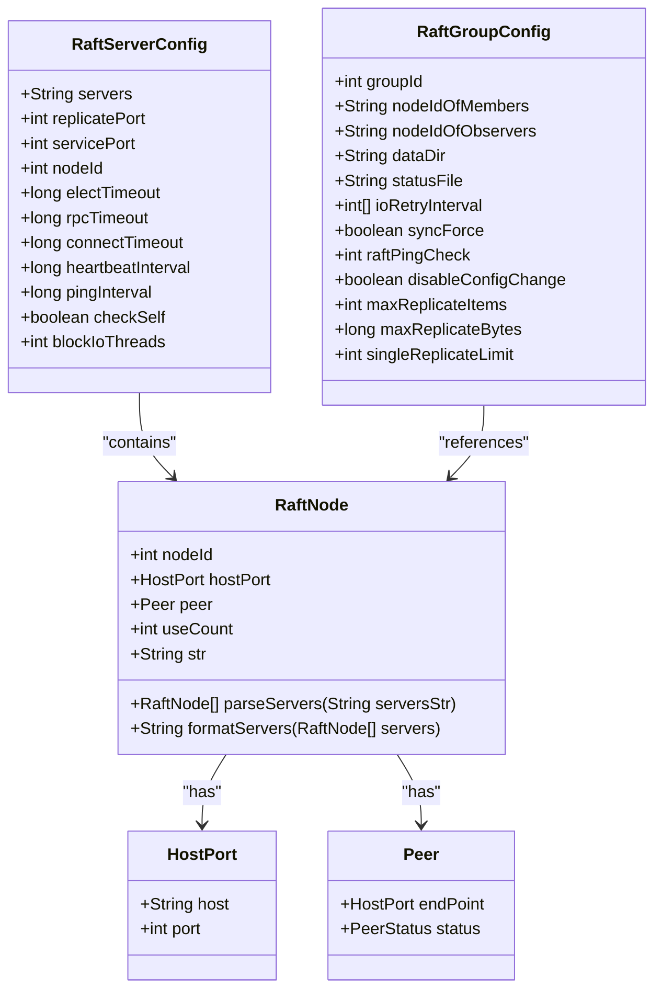
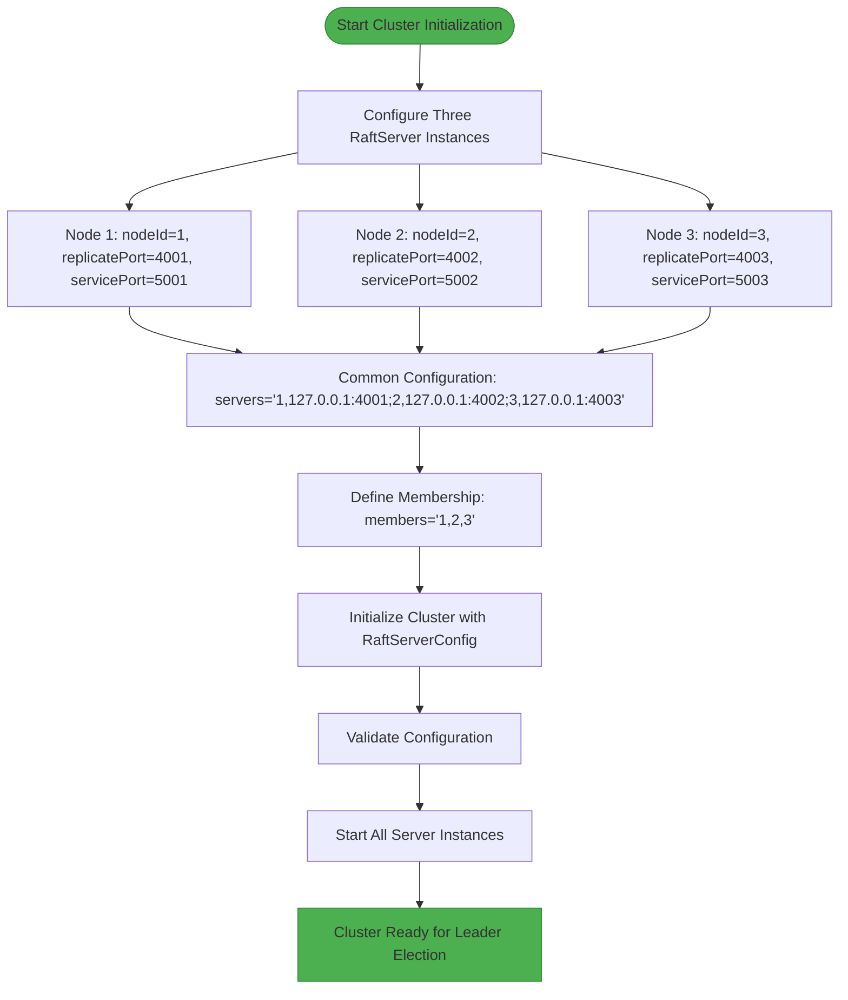
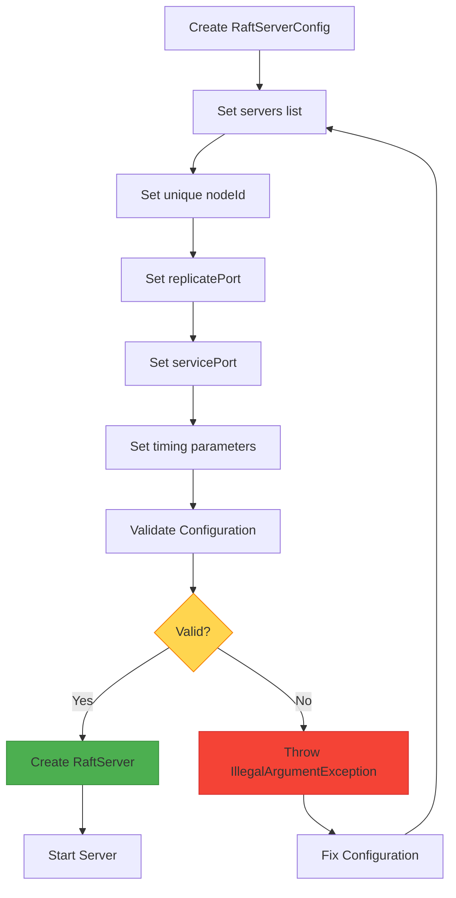
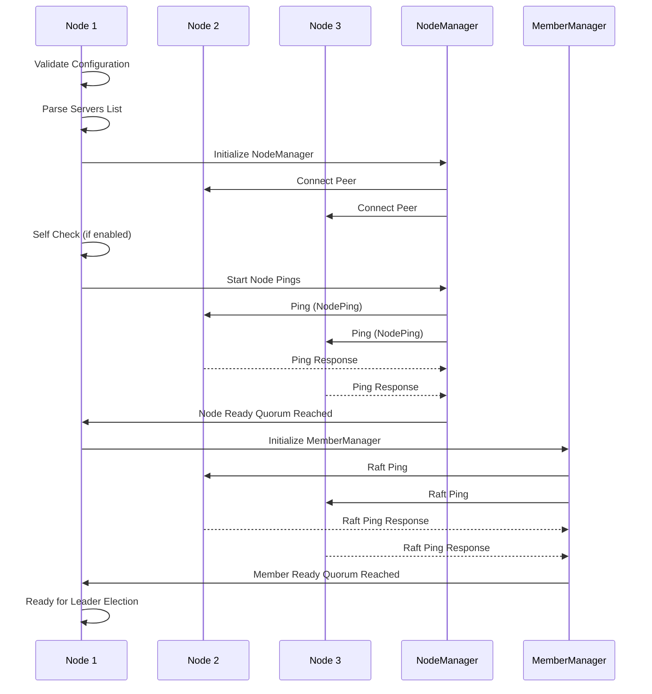
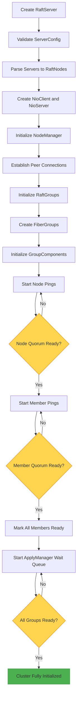
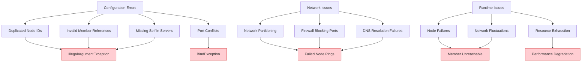

# Cluster Initialization

<cite>
**Referenced Files in This Document**   
- [MultiRaftDemoServer1.java](file://demos/src/main/java/com/github/dtprj/dongting/demos/multiraft/MultiRaftDemoServer1.java)
- [MultiRaftDemoServer2.java](file://demos/src/main/java/com/github/dtprj/dongting/demos/multiraft/MultiRaftDemoServer2.java)
- [MultiRaftDemoServer3.java](file://demos/src/main/java/com/github/dtprj/dongting/demos/multiraft/MultiRaftDemoServer3.java)
- [DemoKvServerBase.java](file://demos/src/main/java/com/github/dtprj/dongting/demos/base/DemoKvServerBase.java)
- [RaftServerConfig.java](file://server/src/main/java/com/github/dtprj/dongting/raft/server/RaftServerConfig.java)
- [RaftServer.java](file://server/src/main/java/com/github/dtprj/dongting/raft/server/RaftServer.java)
- [RaftNode.java](file://client/src/main/java/com/github/dtprj/dongting/raft/RaftNode.java)
- [RaftGroupConfig.java](file://server/src/main/java/com/github/dtprj/dongting/raft/server/RaftGroupConfig.java)
- [NodeManager.java](file://server/src/main/java/com/github/dtprj/dongting/raft/impl/NodeManager.java)
- [MemberManager.java](file://server/src/main/java/com/github/dtprj/dongting/raft/impl/MemberManager.java)
</cite>

## Table of Contents
1. [Introduction](#introduction)
2. [Core Configuration Components](#core-configuration-components)
3. [Multi-Node Cluster Setup](#multi-node-cluster-setup)
4. [RaftServer Configuration](#raftserver-configuration)
5. [Cluster Topology Definition](#cluster-topology-definition)
6. [Bootstrapping Process](#bootstrapping-process)
7. [Startup Sequence and Initialization](#startup-sequence-and-initialization)
8. [Common Pitfalls and Error Handling](#common-pitfalls-and-error-handling)
9. [Conclusion](#conclusion)

## Introduction
This document provides comprehensive guidance for initializing a multi-node RAFT cluster using the Dongting framework. The focus is on configuring three or more RaftServer instances with proper node IDs, host-port specifications, and initial membership lists. The documentation leverages the MultiRaftDemoServer examples to illustrate correct configuration patterns and startup sequences for establishing a resilient distributed consensus system.

The RAFT consensus algorithm implementation in this framework enables fault-tolerant distributed systems through leader election, log replication, and cluster membership management. This guide details the step-by-step process for cluster initialization, covering configuration of RaftNode objects in RaftServerConfig to establish cluster topology, the bootstrapping process, leader election, and log replication setup.

**Section sources**
- [MultiRaftDemoServer1.java](file://demos/src/main/java/com/github/dtprj/dongting/demos/multiraft/MultiRaftDemoServer1.java#L1-L32)
- [MultiRaftDemoServer2.java](file://demos/src/main/java/com/github/dtprj/dongting/demos/multiraft/MultiRaftDemoServer2.java#L1-L32)
- [MultiRaftDemoServer3.java](file://demos/src/main/java/com/github/dtprj/dongting/demos/multiraft/MultiRaftDemoServer3.java#L1-L32)

## Core Configuration Components

The RAFT cluster initialization process relies on several key components that work together to establish cluster topology and ensure proper communication between nodes. The primary configuration classes include RaftServerConfig for server-level settings, RaftGroupConfig for group-specific parameters, and RaftNode for representing individual cluster members.

The RaftServerConfig class contains essential server configuration parameters such as the node ID, replicate port for internal server-to-server communication, service port for client access, and various timeout values for election and heartbeat intervals. The servers field contains a comma-separated list of all nodes in the cluster with their node IDs and host-port specifications.

The RaftNode class represents individual cluster members and contains the node ID, HostPort information, and Peer connection details. It provides utility methods for parsing server lists and formatting them for configuration purposes. The RaftGroupConfig class defines the membership configuration for a RAFT group, specifying which nodes are members and which are observers.



**Diagram sources **
- [RaftServerConfig.java](file://server/src/main/java/com/github/dtprj/dongting/raft/server/RaftServerConfig.java#L21-L39)
- [RaftGroupConfig.java](file://server/src/main/java/com/github/dtprj/dongting/raft/server/RaftGroupConfig.java#L24-L76)
- [RaftNode.java](file://client/src/main/java/com/github/dtprj/dongting/raft/RaftNode.java#L37-L182)
- [net/HostPort.java](file://client/src/main/java/com/github/dtprj/dongting/net/HostPort.java)
- [net/Peer.java](file://client/src/main/java/com/github/dtprj/dongting/net/Peer.java)

**Section sources**
- [RaftServerConfig.java](file://server/src/main/java/com/github/dtprj/dongting/raft/server/RaftServerConfig.java#L21-L39)
- [RaftGroupConfig.java](file://server/src/main/java/com/github/dtprj/dongting/raft/server/RaftGroupConfig.java#L24-L76)
- [RaftNode.java](file://client/src/main/java/com/github/dtprj/dongting/raft/RaftNode.java#L37-L182)

## Multi-Node Cluster Setup

Setting up a multi-node RAFT cluster requires configuring three or more RaftServer instances with unique node IDs and proper host-port specifications. The MultiRaftDemoServer examples demonstrate the correct pattern for initializing a three-node cluster. Each server instance must be configured with the same list of servers but with a unique node ID corresponding to its position in the cluster.

The cluster configuration follows a specific format where each server is specified as "nodeId,host:replicatePort" separated by semicolons. For example, a three-node cluster on localhost would use the configuration: "1,127.0.0.1:4001;2,127.0.0.1:4002;3,127.0.0.1:4003". Each node in the cluster uses the same servers string but sets its own nodeId field to match its designated position (1, 2, or 3).

The replicatePort is used for internal RAFT log replication and admin commands between servers, while the servicePort is used for client access. In the demo configuration, these ports are calculated based on the node ID (replicatePort = 4000 + nodeId, servicePort = 5000 + nodeId) to ensure unique ports for each instance on the same host.



**Diagram sources **
- [MultiRaftDemoServer1.java](file://demos/src/main/java/com/github/dtprj/dongting/demos/multiraft/MultiRaftDemoServer1.java#L25-L29)
- [MultiRaftDemoServer2.java](file://demos/src/main/java/com/github/dtprj/dongting/demos/multiraft/MultiRaftDemoServer2.java#L25-L29)
- [MultiRaftDemoServer3.java](file://demos/src/main/java/com/github/dtprj/dongting/demos/multiraft/MultiRaftDemoServer3.java#L25-L29)
- [DemoKvServerBase.java](file://demos/src/main/java/com/github/dtprj/dongting/demos/base/DemoKvServerBase.java#L38-L47)

**Section sources**
- [MultiRaftDemoServer1.java](file://demos/src/main/java/com/github/dtprj/dongting/demos/multiraft/MultiRaftDemoServer1.java#L25-L29)
- [MultiRaftDemoServer2.java](file://demos/src/main/java/com/github/dtprj/dongting/demos/multiraft/MultiRaftDemoServer2.java#L25-L29)
- [MultiRaftDemoServer3.java](file://demos/src/main/java/com/github/dtprj/dongting/demos/multiraft/MultiRaftDemoServer3.java#L25-L29)

## RaftServer Configuration

The RaftServerConfig class is central to configuring a RAFT server instance with the necessary parameters for cluster operation. This configuration object must be properly initialized with unique node identifiers, network specifications, and timing parameters to ensure reliable cluster formation and operation.

Key configuration parameters include:
- **servers**: A string containing all cluster nodes in "nodeId,host:replicatePort" format, separated by semicolons
- **nodeId**: The unique identifier for this server instance within the cluster
- **replicatePort**: The port used for internal server-to-server communication for log replication
- **servicePort**: The port used for client access (0 to disable)
- **electTimeout**: The election timeout duration in milliseconds
- **heartbeatInterval**: The interval between heartbeats from the leader
- **rpcTimeout**: The timeout for RPC calls between servers
- **connectTimeout**: The timeout for establishing connections
- **pingInterval**: The interval for node health checks

The configuration validation process ensures that all nodes in the servers list have unique IDs and host-port combinations, and that the local node's ID is included in the list. This prevents common configuration errors that could lead to split-brain scenarios or network partitioning.



**Diagram sources **
- [RaftServerConfig.java](file://server/src/main/java/com/github/dtprj/dongting/raft/server/RaftServerConfig.java#L21-L39)
- [RaftServer.java](file://server/src/main/java/com/github/dtprj/dongting/raft/server/RaftServer.java#L122-L139)

**Section sources**
- [RaftServerConfig.java](file://server/src/main/java/com/github/dtprj/dongting/raft/server/RaftServerConfig.java#L21-L39)
- [RaftServer.java](file://server/src/main/java/com/github/dtprj/dongting/raft/server/RaftServer.java#L122-L139)

## Cluster Topology Definition

Defining the cluster topology involves establishing the membership configuration through RaftNode objects in the RaftServerConfig. The servers string is parsed into RaftNode instances that represent each member of the cluster, creating a complete picture of the cluster's network topology.

The RaftNode.parseServers() method processes the servers string, validating the format and creating RaftNode objects for each entry. Each RaftNode contains the nodeId, HostPort information, and will later be associated with a Peer object for network communication. The NodeManager component uses this information to establish connections between all cluster members.

For multi-RAFT group support, the RaftGroupConfig specifies which nodes are members and which are observers for each group. The nodeIdOfMembers string contains a comma-separated list of node IDs that are active participants in the consensus process, while nodeIdOfObservers lists nodes that receive replicated logs but do not participate in leader election.

The cluster topology establishment process includes:
1. Parsing the servers string into RaftNode objects
2. Validating uniqueness of node IDs and host-port combinations
3. Ensuring the local node's ID is present in the servers list
4. Creating Peer connections for all remote nodes
5. Establishing the initial membership list for each RAFT group

```mermaid
graph TD
A[Raw Servers String] --> B["1,127.0.0.1:4001;2,127.0.0.1:4002;3,127.0.0.1:4003"]
B --> C[RaftNode.parseServers()]
C --> D[Node 1: nodeId=1, host=127.0.0.1, port=4001]
C --> E[Node 2: nodeId=2, host=127.0.0.1, port=4002]
C --> F[Node 3: nodeId=3, host=127.0.0.1, port=4003]
D --> G[Validate Unique Node IDs]
E --> G
F --> G
G --> H[Validate Local Node Presence]
H --> I[Create Peer Connections]
I --> J[Establish NodeManager]
J --> K[Initialize Membership Lists]
K --> L[Cluster Topology Ready]
style L fill:#4CAF50,stroke:#388E3C
```

**Diagram sources **
- [RaftNode.java](file://client/src/main/java/com/github/dtprj/dongting/raft/RaftNode.java#L69-L96)
- [RaftServer.java](file://server/src/main/java/com/github/dtprj/dongting/raft/server/RaftServer.java#L126-L136)
- [NodeManager.java](file://server/src/main/java/com/github/dtprj/dongting/raft/impl/NodeManager.java#L77-L92)

**Section sources**
- [RaftNode.java](file://client/src/main/java/com/github/dtprj/dongting/raft/RaftNode.java#L69-L96)
- [RaftServer.java](file://server/src/main/java/com/github/dtprj/dongting/raft/server/RaftServer.java#L126-L136)

## Bootstrapping Process

The bootstrapping process for a multi-node RAFT cluster involves a coordinated sequence of initialization steps that ensure all nodes properly discover each other and establish the necessary network connections before beginning the leader election process. This process is critical for preventing network partitioning and ensuring cluster stability during startup.

The bootstrapping sequence begins with each RaftServer instance validating its configuration and parsing the servers list into RaftNode objects. The NodeManager component then establishes Peer connections to all other nodes in the cluster using the NioClient. A node self-check is performed if configured, ensuring the local node can communicate with itself through the network stack.

Following network connection establishment, the NodeManager initiates periodic node pings to monitor the health and connectivity of all cluster members. These pings serve as a keep-alive mechanism and help detect network partitions. The MemberManager component then performs RAFT-specific pings to verify that each member is ready to participate in the consensus protocol.

The bootstrapping process completes when a quorum of nodes (majority) has successfully established connectivity and responded to pings. At this point, the cluster is ready to begin leader election, with any node that detects a lack of leadership starting the election process after the election timeout period.



**Diagram sources **
- [RaftServer.java](file://server/src/main/java/com/github/dtprj/dongting/raft/server/RaftServer.java#L330-L367)
- [NodeManager.java](file://server/src/main/java/com/github/dtprj/dongting/raft/impl/NodeManager.java#L101-L121)
- [MemberManager.java](file://server/src/main/java/com/github/dtprj/dongting/raft/impl/MemberManager.java#L106-L137)

**Section sources**
- [RaftServer.java](file://server/src/main/java/com/github/dtprj/dongting/raft/server/RaftServer.java#L330-L367)
- [NodeManager.java](file://server/src/main/java/com/github/dtprj/dongting/raft/impl/NodeManager.java#L101-L121)

## Startup Sequence and Initialization

The startup sequence for a multi-node RAFT cluster follows a specific order of operations that ensures proper initialization of all components before the cluster becomes active. This sequence is critical for establishing a stable cluster topology and preventing race conditions during the leader election process.

The initialization process begins with the creation of the RaftServer instance, which validates the RaftServerConfig and parses the servers list into RaftNode objects. The NodeManager is then initialized to establish network connections with all cluster members through the NioClient. Following network connectivity establishment, the MemberManager initializes the membership lists for each RAFT group, creating RaftMember objects for all nodes.

The startup sequence continues with the initialization of fiber groups for each RAFT group, providing the execution context for RAFT protocol operations. The initRaftGroup() method creates the necessary components for each group, including the RaftStatus, StateMachine, RaftLog, and various managers (ApplyManager, CommitManager, ReplicateManager, etc.).

Once all groups are initialized, the system starts the node ping process to verify connectivity with all cluster members. When a quorum of nodes responds to pings, the member ping process begins, verifying RAFT protocol readiness. The cluster is considered ready when all groups have reached the groupReady state, at which point the server can participate in leader election and process client requests.



**Diagram sources **
- [RaftServer.java](file://server/src/main/java/com/github/dtprj/dongting/raft/server/RaftServer.java#L330-L367)
- [RaftServer.java](file://server/src/main/java/com/github/dtprj/dongting/raft/server/RaftServer.java#L382-L390)
- [RaftServer.java](file://server/src/main/java/com/github/dtprj/dongting/raft/server/RaftServer.java#L392-L406)

**Section sources**
- [RaftServer.java](file://server/src/main/java/com/github/dtprj/dongting/raft/server/RaftServer.java#L330-L423)

## Common Pitfalls and Error Handling

When initializing a multi-node RAFT cluster, several common pitfalls can prevent successful cluster formation. Understanding these issues and their solutions is critical for reliable cluster deployment and operation.

**Duplicate Node IDs**: The system validates that all node IDs in the servers list are unique. Duplicate node IDs will cause an IllegalArgumentException during RaftServer construction. Each node in the cluster must have a unique identifier.

**Incorrect Initial Membership Configuration**: The nodeIdOfMembers string must contain valid node IDs that exist in the servers list. References to non-existent nodes will cause an IllegalArgumentException. Additionally, a node cannot be both a member and observer of the same group.

**Network Partitioning During Startup**: If network connectivity is not established between a quorum of nodes, the cluster will not progress beyond the bootstrapping phase. The NodeManager requires a majority of nodes to respond to pings before proceeding to the member ping phase.

**Missing Self in Servers List**: The local node's ID must be present in the servers list. If the nodeId is not found in the servers list, an IllegalArgumentException is thrown during RaftServer construction.

**Port Conflicts**: Each node must have unique replicatePort and servicePort values. Port conflicts will prevent the NioServer from binding to the specified ports, causing startup failures.

The system provides comprehensive error handling through validation checks during configuration and initialization. These checks prevent common configuration errors and provide clear error messages to aid in troubleshooting. The NodeManager and MemberManager components also provide ongoing health monitoring through periodic pings, detecting and responding to network partitions and node failures.



**Diagram sources **
- [RaftServer.java](file://server/src/main/java/com/github/dtprj/dongting/raft/server/RaftServer.java#L130-L139)
- [RaftServer.java](file://server/src/main/java/com/github/dtprj/dongting/raft/server/RaftServer.java#L230-L248)
- [NodeManager.java](file://server/src/main/java/com/github/dtprj/dongting/raft/impl/NodeManager.java#L89-L91)
- [MemberManager.java](file://server/src/main/java/com/github/dtprj/dongting/raft/impl/MemberManager.java#L216-L237)

**Section sources**
- [RaftServer.java](file://server/src/main/java/com/github/dtprj/dongting/raft/server/RaftServer.java#L130-L139)
- [RaftServer.java](file://server/src/main/java/com/github/dtprj/dongting/raft/server/RaftServer.java#L230-L248)

## Conclusion
Initializing a multi-node RAFT cluster requires careful configuration of server instances with unique node IDs, proper host-port specifications, and accurate membership lists. The Dongting framework provides a robust implementation of the RAFT consensus algorithm with comprehensive configuration options and error handling.

The key to successful cluster initialization is following the proper sequence: configuring RaftServerConfig with the complete servers list, setting unique node IDs and ports for each instance, defining membership through RaftGroupConfig, and allowing the bootstrapping process to establish network connectivity and verify node readiness.

By leveraging the MultiRaftDemoServer examples as a reference, developers can ensure proper configuration patterns and avoid common pitfalls such as duplicate node IDs, incorrect membership configuration, and network partitioning during startup. The framework's validation mechanisms and health monitoring provide robust error detection and recovery capabilities, ensuring cluster stability and reliability.

Proper cluster initialization establishes the foundation for leader election, log replication, and distributed consensus, enabling the creation of fault-tolerant distributed systems that can withstand node failures while maintaining data consistency and availability.