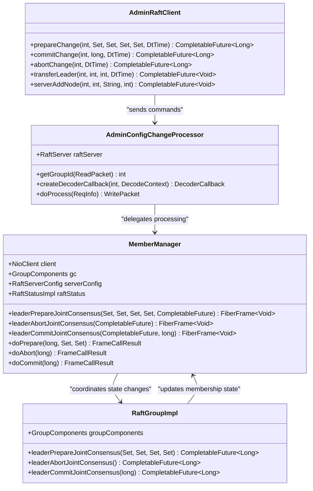
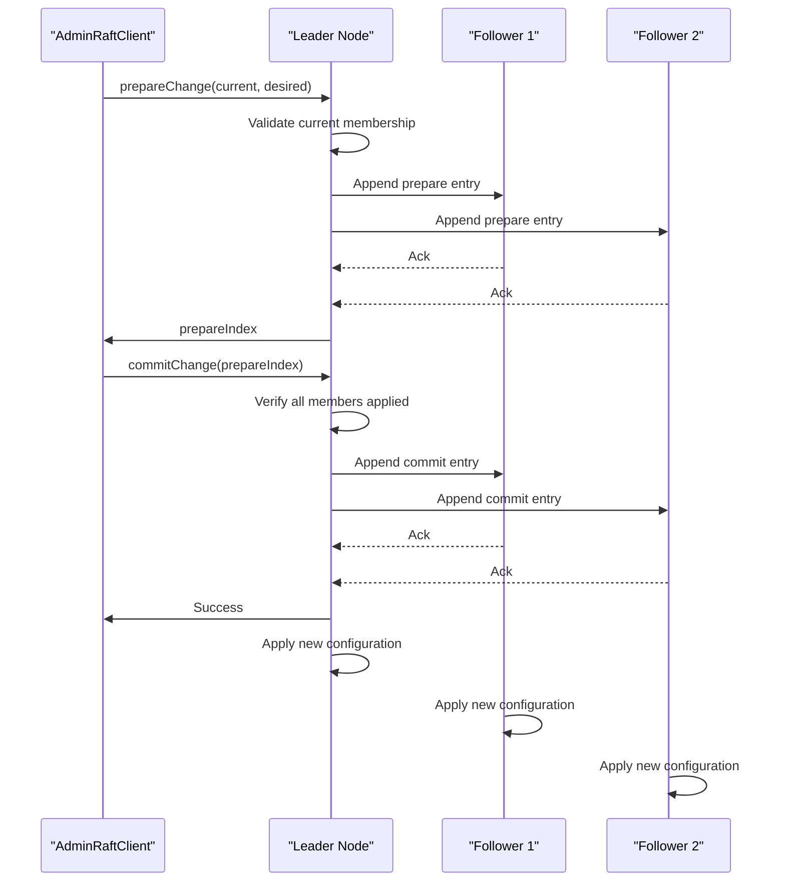
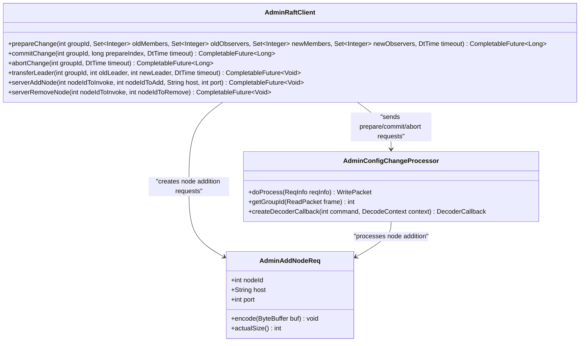
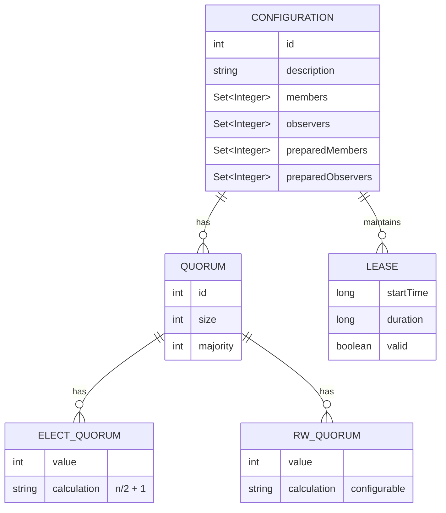
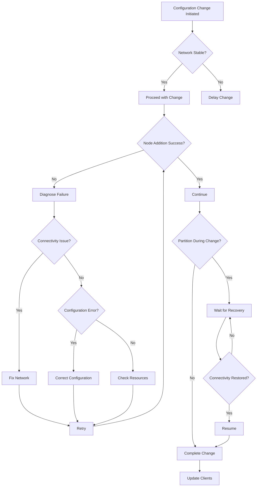
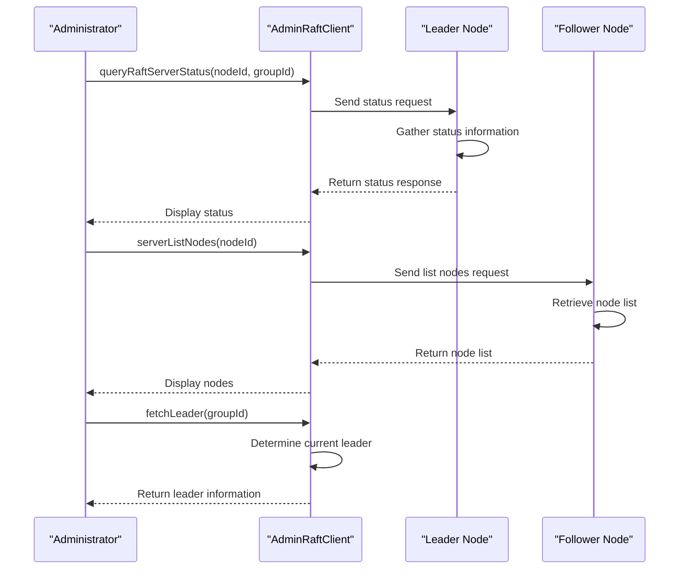
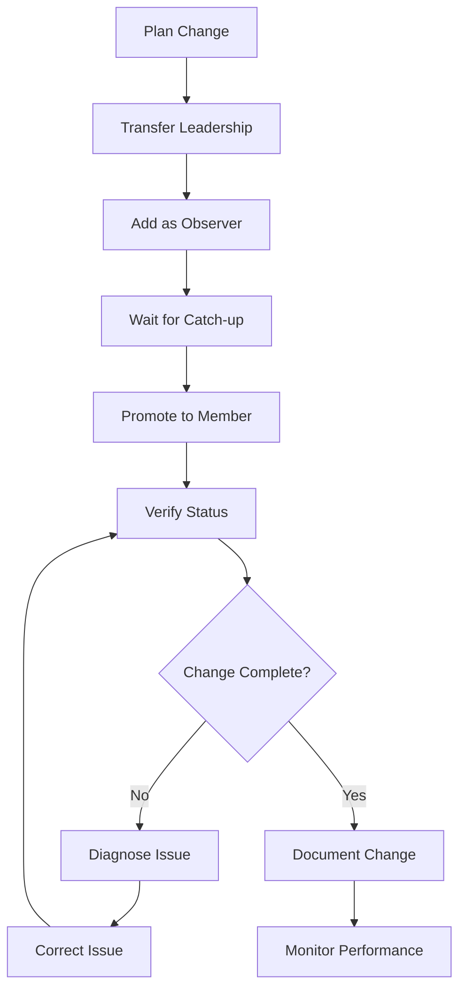

# Dynamic Cluster Management

<cite>
**Referenced Files in This Document**   
- [AdminConfigChangeProcessor.java](file://server/src/main/java/com/github/dtprj/dongting/raft/rpc/AdminConfigChangeProcessor.java)
- [AdminAddNodeReq.java](file://server/src/main/java/com/github/dtprj/dongting/raft/rpc/AdminAddNodeReq.java)
- [AdminRaftClient.java](file://server/src/main/java/com/github/dtprj/dongting/raft/admin/AdminRaftClient.java)
- [MemberManager.java](file://server/src/main/java/com/github/dtprj/dongting/raft/impl/MemberManager.java)
- [RaftGroupImpl.java](file://server/src/main/java/com/github/dtprj/dongting/raft/impl/RaftGroupImpl.java)
- [RaftServer.java](file://server/src/main/java/com/github/dtprj/dongting/raft/server/RaftServer.java)
- [ChangeTo123Client.java](file://demos/src/main/java/com/github/dtprj/dongting/demos/configchange/ChangeTo123Client.java)
- [ChangeTo234Client.java](file://demos/src/main/java/com/github/dtprj/dongting/demos/configchange/ChangeTo234Client.java)
- [ConfigChangeDemoServer1.java](file://demos/src/main/java/com/github/dtprj/dongting/demos/configchange/ConfigChangeDemoServer1.java)
- [ConfigChangeDemoServer2.java](file://demos/src/main/java/com/github/dtprj/dongting/demos/configchange/ConfigChangeDemoServer2.java)
- [ConfigChangeDemoServer3.java](file://demos/src/main/java/com/github/dtprj/dongting/demos/configchange/ConfigChangeDemoServer3.java)
- [ConfigChangeDemoServer4.java](file://demos/src/main/java/com/github/dtprj/dongting/demos/configchange/ConfigChangeDemoServer4.java)
- [RaftUtil.java](file://server/src/main/java/com/github/dtprj/dongting/raft/impl/RaftUtil.java)
- [NodeManager.java](file://server/src/main/java/com/github/dtprj/dongting/raft/impl/NodeManager.java)
</cite>

## Table of Contents
1. [Introduction](#introduction)
2. [Core Components](#core-components)
3. [Configuration Change Process](#configuration-change-process)
4. [Joint Consensus Algorithm](#joint-consensus-algorithm)
5. [Administrative RPC Commands](#administrative-rpc-commands)
6. [Quorum Requirements and Safety](#quorum-requirements-and-safety)
7. [Operational Challenges](#operational-challenges)
8. [Monitoring and Verification](#monitoring-and-verification)
9. [Best Practices](#best-practices)
10. [Conclusion](#conclusion)

## Introduction

Dynamic cluster management in the Dongting RAFT-based system enables administrators to modify cluster membership without downtime. This capability allows for scaling, maintenance, and fault recovery while maintaining data consistency and availability. The system implements a joint consensus approach for safe membership transitions, ensuring that configuration changes do not compromise the safety guarantees of the RAFT consensus algorithm.

The dynamic reconfiguration process involves adding, removing, or updating nodes through administrative RPC commands. These operations are coordinated through the AdminConfigChangeProcessor and AdminRaftClient components, which handle the complex state transitions required for safe membership changes. The implementation follows the joint consensus algorithm described in the RAFT paper, using a two-phase approach to prevent split-brain scenarios during topology changes.

This document details the mechanisms for dynamic cluster management, including the administrative commands, safety guarantees, and operational considerations for maintaining cluster stability during reconfiguration.

**Section sources**
- [AdminConfigChangeProcessor.java](file://server/src/main/java/com/github/dtprj/dongting/raft/rpc/AdminConfigChangeProcessor.java)
- [AdminRaftClient.java](file://server/src/main/java/com/github/dtprj/dongting/raft/admin/AdminRaftClient.java)

## Core Components

The dynamic cluster management system in Dongting consists of several key components that work together to enable safe membership changes. The AdminConfigChangeProcessor handles incoming configuration change requests, validating and processing them through the RAFT consensus mechanism. This processor is registered with the RAFT server to handle specific administrative commands related to configuration changes.

The AdminRaftClient provides the client-side interface for initiating configuration changes. It offers methods for preparing, committing, and aborting configuration changes, as well as utilities for transferring leadership and querying cluster status. This client abstracts the complexity of the underlying RPC protocol, providing a straightforward API for cluster administration.

The MemberManager component maintains the current membership state of each RAFT group, tracking both active members and observers. It coordinates the application of configuration changes across the cluster, ensuring that all nodes transition through the joint consensus phases correctly. The MemberManager also handles the quorum calculations for both election and read/write operations during configuration changes.



**Diagram sources **
- [AdminConfigChangeProcessor.java](file://server/src/main/java/com/github/dtprj/dongting/raft/rpc/AdminConfigChangeProcessor.java)
- [AdminRaftClient.java](file://server/src/main/java/com/github/dtprj/dongting/raft/admin/AdminRaftClient.java)
- [MemberManager.java](file://server/src/main/java/com/github/dtprj/dongting/raft/impl/MemberManager.java)
- [RaftGroupImpl.java](file://server/src/main/java/com/github/dtprj/dongting/raft/impl/RaftGroupImpl.java)

**Section sources**
- [AdminConfigChangeProcessor.java](file://server/src/main/java/com/github/dtprj/dongting/raft/rpc/AdminConfigChangeProcessor.java)
- [AdminRaftClient.java](file://server/src/main/java/com/github/dtprj/dongting/raft/admin/AdminRaftClient.java)
- [MemberManager.java](file://server/src/main/java/com/github/dtprj/dongting/raft/impl/MemberManager.java)
- [RaftGroupImpl.java](file://server/src/main/java/com/github/dtprj/dongting/raft/impl/RaftGroupImpl.java)

## Configuration Change Process

The configuration change process in Dongting follows a structured three-phase approach: prepare, commit, and apply. This sequence ensures that membership changes are applied safely across the cluster while maintaining consistency and availability. The process begins with the prepare phase, where the proposed configuration change is validated and recorded in the RAFT log.

During the prepare phase, the AdminRaftClient sends a prepareChange request to the current leader, specifying both the current and desired membership configurations. The leader validates that the current membership matches the expected state before accepting the change. This validation prevents conflicting configuration changes from being applied simultaneously. Once validated, the configuration change is logged as a special RAFT entry (TYPE_PREPARE_CONFIG_CHANGE) and replicated to all cluster members.

The commit phase follows successful replication of the prepared configuration. The AdminRaftClient calls commitChange with the prepareIndex returned from the prepare phase. Before committing, the system verifies that all members have applied the prepared configuration by checking their last applied index. This ensures that no member is left behind during the transition. The commit operation is recorded as another RAFT log entry (TYPE_COMMIT_CONFIG_CHANGE) and replicated across the cluster.

Finally, the apply phase occurs when each member applies the committed configuration change to its local state. This involves updating the membership lists, recalculating quorum requirements, and adjusting role assignments as necessary. Members that are being removed stop participating in consensus, while new members begin replicating logs and participating in voting.



**Diagram sources **
- [AdminRaftClient.java](file://server/src/main/java/com/github/dtprj/dongting/raft/admin/AdminRaftClient.java)
- [MemberManager.java](file://server/src/main/java/com/github/dtprj/dongting/raft/impl/MemberManager.java)
- [RaftGroupImpl.java](file://server/src/main/java/com/github/dtprj/dongting/raft/impl/RaftGroupImpl.java)

**Section sources**
- [AdminRaftClient.java](file://server/src/main/java/com/github/dtprj/dongting/raft/admin/AdminRaftClient.java)
- [MemberManager.java](file://server/src/main/java/com/github/dtprj/dongting/raft/impl/MemberManager.java)
- [RaftGroupImpl.java](file://server/src/main/java/com/github/dtprj/dongting/raft/impl/RaftGroupImpl.java)

## Joint Consensus Algorithm

The Dongting RAFT implementation uses the joint consensus algorithm to ensure safe membership transitions. This approach allows the cluster to operate with two overlapping configurations simultaneously, preventing split-brain scenarios that could occur with direct configuration switches. The algorithm works by requiring agreement from a majority of both the old and new configurations during the transition period.

During the joint consensus phase, the cluster operates with both the old and new membership configurations active. For election quorum, a candidate must receive votes from a majority of both the old configuration and the new configuration. Similarly, for read/write quorum, operations require acknowledgment from a majority of both configurations. This dual quorum requirement ensures that any decision made during the transition has support from both the outgoing and incoming membership sets.

The joint consensus algorithm is implemented through the preparedMembers and preparedObservers fields in the RaftStatusImpl class. When a configuration change is prepared, the new members are added to these prepared lists while maintaining the existing membership. The quorum calculations take into account both the active and prepared membership sets, effectively creating a union of the two configurations.

The transition completes when the commit phase finalizes the configuration change. At this point, the prepared membership becomes the active membership, and the previous configuration is discarded. The algorithm guarantees that once the commit is replicated, all future operations will use the new configuration, ensuring a clean transition without ambiguity.

```mermaid
flowchart TD
A[Start Configuration C(old)] --> B[Prepare Change to C(new)]
B --> C[Joint Consensus Phase]
C --> D{Quorum Requirements}
D --> E[Maj(C(old)) AND Maj(C(new))]
E --> F[Commit Change]
F --> G[Final Configuration C(new)]
G --> H[Normal Operation]
style C fill:#f9f,stroke:#333,stroke-width:2px
style D fill:#ccf,stroke:#333,stroke-width:2px
style E fill:#ccf,stroke:#333,stroke-width:2px
```

**Diagram sources **
- [MemberManager.java](file://server/src/main/java/com/github/dtprj/dongting/raft/impl/MemberManager.java)
- [RaftUtil.java](file://server/src/main/java/com/github/dtprj/dongting/raft/impl/RaftUtil.java)

**Section sources**
- [MemberManager.java](file://server/src/main/java/com/github/dtprj/dongting/raft/impl/MemberManager.java)
- [RaftUtil.java](file://server/src/main/java/com/github/dtprj/dongting/raft/impl/RaftUtil.java)

## Administrative RPC Commands

The Dongting RAFT system provides a comprehensive set of administrative RPC commands for cluster management. These commands are exposed through the AdminRaftClient interface and processed by the AdminConfigChangeProcessor on the server side. The primary commands for configuration changes are prepareChange, commitChange, and abortChange, which implement the three-phase configuration change protocol.

The prepareChange command initiates a configuration change by specifying both the current and desired membership configurations. This command requires the caller to provide the current members and observers as validation, preventing conflicting changes. The command returns a prepareIndex that must be used in the subsequent commitChange operation. This index serves as a reference point to ensure that the correct configuration change is being committed.

The commitChange command finalizes a previously prepared configuration change. It requires the prepareIndex returned by prepareChange to identify which change to commit. Before committing, the system verifies that all members have applied the prepared configuration by checking their last applied index. This safety check prevents commits of outdated or superseded configuration changes.

The abortChange command cancels a prepared configuration change without committing it. This is useful when a configuration change needs to be abandoned due to errors or changing requirements. The abort operation is idempotent, meaning it can be safely called multiple times without side effects.



**Diagram sources **
- [AdminRaftClient.java](file://server/src/main/java/com/github/dtprj/dongting/raft/admin/AdminRaftClient.java)
- [AdminConfigChangeProcessor.java](file://server/src/main/java/com/github/dtprj/dongting/raft/rpc/AdminConfigChangeProcessor.java)
- [AdminAddNodeReq.java](file://server/src/main/java/com/github/dtprj/dongting/raft/rpc/AdminAddNodeReq.java)

**Section sources**
- [AdminRaftClient.java](file://server/src/main/java/com/github/dtprj/dongting/raft/admin/AdminRaftClient.java)
- [AdminConfigChangeProcessor.java](file://server/src/main/java/com/github/dtprj/dongting/raft/rpc/AdminConfigChangeProcessor.java)
- [AdminAddNodeReq.java](file://server/src/main/java/com/github/dtprj/dongting/raft/rpc/AdminAddNodeReq.java)

## Quorum Requirements and Safety

The Dongting RAFT implementation maintains strict safety guarantees during configuration changes through careful quorum management. The system separates election quorum from read/write quorum, allowing for performance optimizations while maintaining safety. The election quorum is calculated as a majority of the membership size, while the read/write quorum can be configured independently.

During joint consensus phases, the quorum requirements become more stringent to ensure safety. For election quorum, a candidate must receive votes from a majority of both the old configuration and the new configuration. This dual majority requirement prevents split-brain scenarios where two leaders could be elected in overlapping configurations. The read/write quorum similarly requires acknowledgment from a majority of both configurations during the transition period.

The RaftUtil class provides utility methods for calculating quorum values based on membership size. The getElectQuorum method calculates the election quorum as (n/2 + 1) where n is the number of members, while the getRwQuorum method calculates the read/write quorum which can be configured independently. These calculations are updated dynamically as membership changes occur.

The system also implements lease-based leadership to enhance safety during network partitions. The leader maintains a lease that must be renewed by receiving acknowledgments from a quorum of members. If the leader cannot communicate with a quorum, the lease expires and the leader steps down, preventing stale leaders from making decisions during network partitions.



**Diagram sources **
- [RaftUtil.java](file://server/src/main/java/com/github/dtprj/dongting/raft/impl/RaftUtil.java)
- [MemberManager.java](file://server/src/main/java/com/github/dtprj/dongting/raft/impl/MemberManager.java)

**Section sources**
- [RaftUtil.java](file://server/src/main/java/com/github/dtprj/dongting/raft/impl/RaftUtil.java)
- [MemberManager.java](file://server/src/main/java/com/github/dtprj/dongting/raft/impl/MemberManager.java)

## Operational Challenges

Dynamic cluster management presents several operational challenges that must be addressed to maintain system stability. One common challenge is failed node additions, which can occur due to network connectivity issues, configuration errors, or resource constraints on the new node. The system handles these failures through idempotent operations and comprehensive error reporting, allowing administrators to retry failed operations after addressing the underlying issues.

Network partitions during reconfiguration pose a significant risk to cluster availability and consistency. The joint consensus algorithm mitigates this risk by requiring agreement from both old and new configurations, preventing split-brain scenarios. However, administrators should avoid initiating configuration changes during known network instability periods. If a partition occurs during reconfiguration, the system will stall the change until connectivity is restored, maintaining safety at the cost of availability.

Maintaining availability during topology changes requires careful planning and execution. The recommended approach is to add new nodes as observers first, allowing them to catch up with the log before promoting them to full members. This staged approach minimizes the impact on cluster performance and ensures that new members are fully synchronized before participating in consensus decisions.

Another challenge is the coordination of client connections during membership changes. Clients must be updated to reflect the new cluster topology to ensure they can reach the current leader. The AdminRaftClient provides methods for updating client-side membership information, but administrators must ensure this update is performed consistently across all clients.



**Diagram sources **
- [AdminRaftClient.java](file://server/src/main/java/com/github/dtprj/dongting/raft/admin/AdminRaftClient.java)
- [NodeManager.java](file://server/src/main/java/com/github/dtprj/dongting/raft/impl/NodeManager.java)

**Section sources**
- [AdminRaftClient.java](file://server/src/main/java/com/github/dtprj/dongting/raft/admin/AdminRaftClient.java)
- [NodeManager.java](file://server/src/main/java/com/github/dtprj/dongting/raft/impl/NodeManager.java)

## Monitoring and Verification

Effective monitoring and verification are essential for successful dynamic cluster management. The system provides several mechanisms for monitoring the state of configuration changes and verifying their successful completion. The AdminRaftClient includes methods for querying cluster status, allowing administrators to track the progress of configuration changes.

The queryRaftServerStatus method returns detailed information about a node's view of the cluster, including current membership, leader status, and replication progress. This information can be used to verify that all nodes have applied the configuration change and are operating with the expected topology. Administrators should check the status of multiple nodes to ensure consistency across the cluster.

The system also provides administrative commands for listing nodes and groups, allowing administrators to verify the current configuration. The serverListNodes and serverListGroups methods return the complete set of nodes and RAFT groups known to a particular server, providing a comprehensive view of the cluster topology.

For automated monitoring, the system generates log entries at key points in the configuration change process. These logs include information about the start and completion of prepare and commit phases, as well as any errors encountered. Administrators should monitor these logs to detect and diagnose issues promptly.



**Diagram sources **
- [AdminRaftClient.java](file://server/src/main/java/com/github/dtprj/dongting/raft/admin/AdminRaftClient.java)
- [RaftServer.java](file://server/src/main/java/com/github/dtprj/dongting/raft/server/RaftServer.java)

**Section sources**
- [AdminRaftClient.java](file://server/src/main/java/com/github/dtprj/dongting/raft/admin/AdminRaftClient.java)
- [RaftServer.java](file://server/src/main/java/com/github/dtprj/dongting/raft/server/RaftServer.java)

## Best Practices

When performing dynamic cluster management in the Dongting RAFT system, several best practices should be followed to ensure reliability and minimize disruption. First, always transfer leadership away from nodes that are being removed from the cluster. This prevents potential unavailability during the removal process and ensures a smooth transition of leadership to a node that will remain in the cluster.

Second, use the staged approach for adding new nodes by first adding them as observers and then promoting them to full members. This allows the new node to catch up with the log without participating in consensus decisions, reducing the risk of performance degradation or consistency issues. Once the node has caught up, it can be safely promoted to a full member.

Third, perform configuration changes during periods of low activity to minimize the impact on application performance. While the system is designed to handle changes during normal operation, peak loads can exacerbate the performance impact of reconfiguration.

Fourth, verify the success of each configuration change before proceeding to the next operation. Use the monitoring commands to confirm that all nodes have applied the change and that the cluster is operating with the expected topology. This verification step helps catch issues early and prevents compounding problems from multiple concurrent changes.

Finally, maintain up-to-date backups before performing major topology changes. While the system is designed to be safe, having recent backups provides an additional layer of protection against unforeseen issues.



**Diagram sources **
- [ChangeTo123Client.java](file://demos/src/main/java/com/github/dtprj/dongting/demos/configchange/ChangeTo123Client.java)
- [ChangeTo234Client.java](file://demos/src/main/java/com/github/dtprj/dongting/demos/configchange/ChangeTo234Client.java)

**Section sources**
- [ChangeTo123Client.java](file://demos/src/main/java/com/github/dtprj/dongting/demos/configchange/ChangeTo123Client.java)
- [ChangeTo234Client.java](file://demos/src/main/java/com/github/dtprj/dongting/demos/configchange/ChangeTo234Client.java)

## Conclusion

Dynamic cluster management in the Dongting RAFT-based system provides a robust mechanism for modifying cluster membership while maintaining data consistency and availability. The implementation of the joint consensus algorithm ensures safe transitions between configurations, preventing split-brain scenarios and maintaining the safety guarantees of the RAFT consensus protocol.

The administrative interface, centered around the AdminRaftClient and AdminConfigChangeProcessor components, provides a comprehensive set of tools for adding, removing, and updating nodes in a running cluster. The three-phase process of prepare, commit, and apply ensures that configuration changes are applied consistently across all members.

Key safety features, including dual quorum requirements during transitions and lease-based leadership, protect against common failure modes such as network partitions and failed node additions. The system's monitoring capabilities allow administrators to verify the success of configuration changes and maintain visibility into cluster state.

By following best practices such as staged node additions, leadership transfer before removal, and verification of changes, administrators can effectively manage cluster topology while minimizing disruption to applications. The combination of robust safety mechanisms and comprehensive administrative tools makes the Dongting RAFT system well-suited for dynamic environments requiring flexible cluster management.