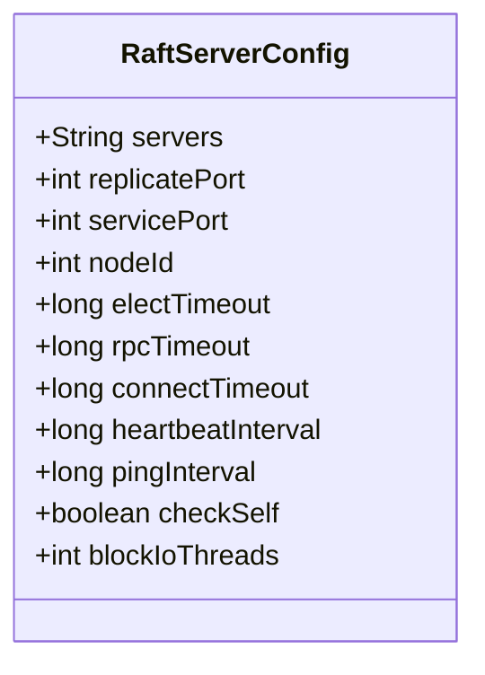
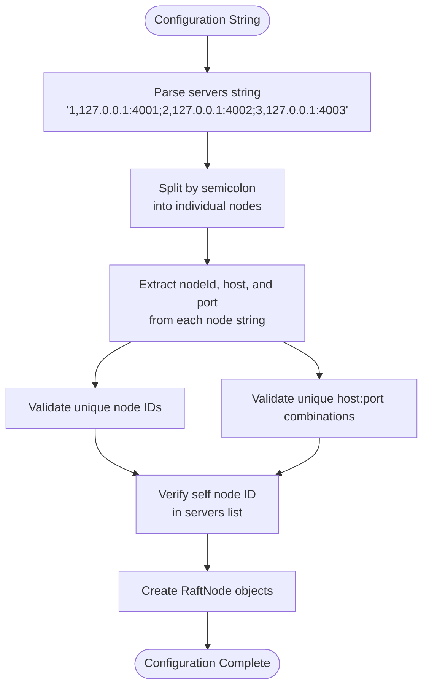
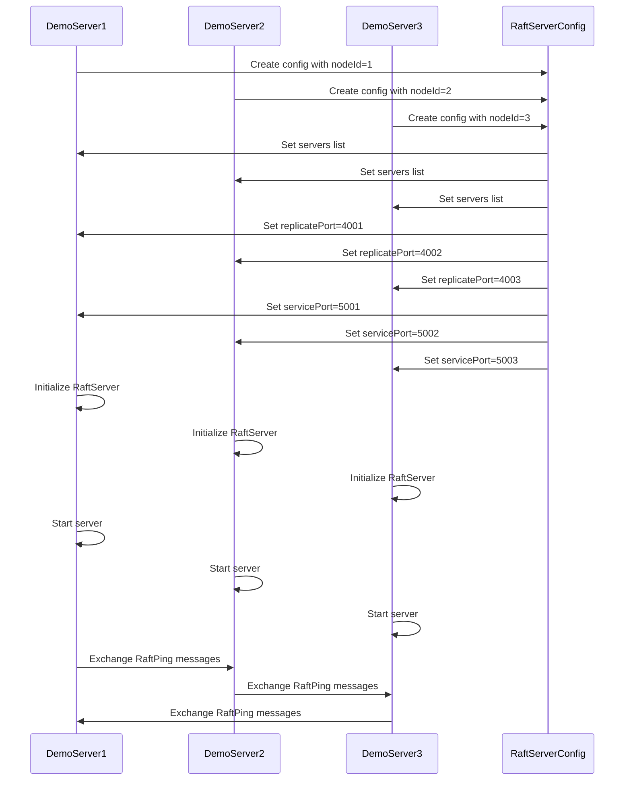
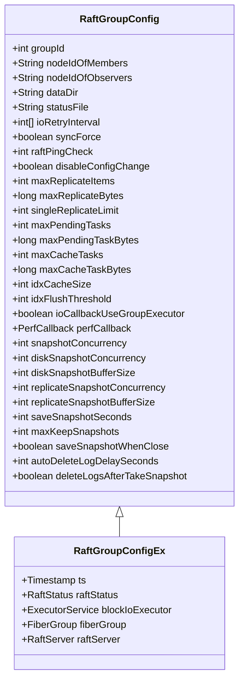
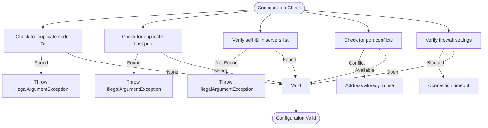
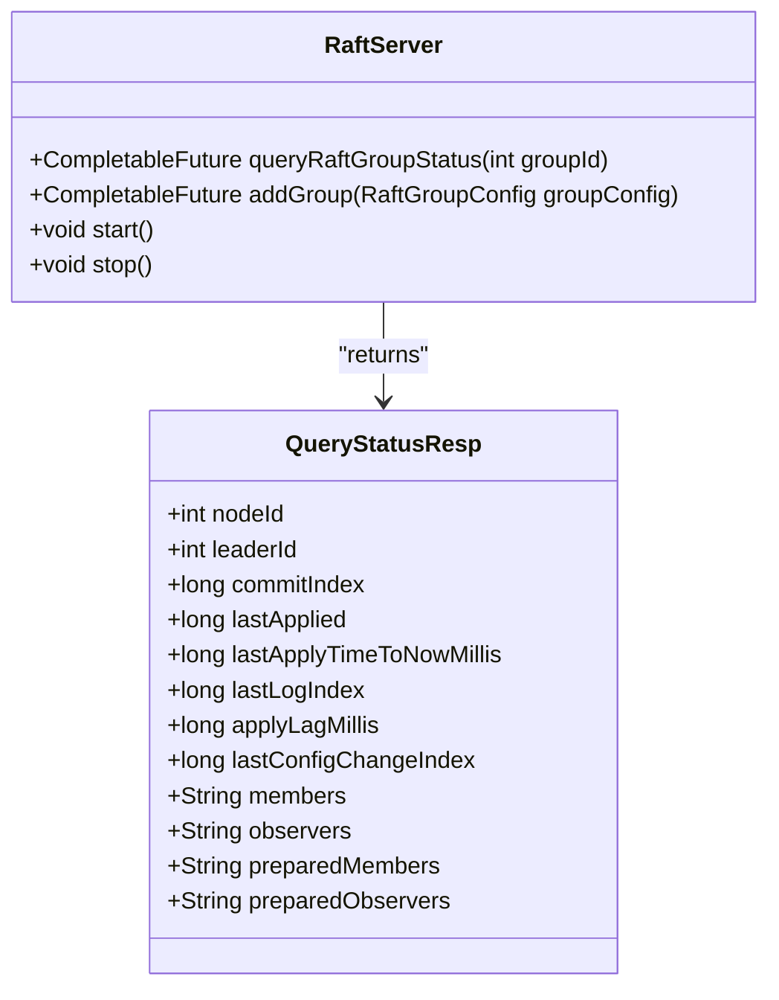

# Multi-Node Cluster Setup

<cite>
**Referenced Files in This Document**   
- [RaftServerConfig.java](file://server/src/main/java/com/github/dtprj/dongting/raft/server/RaftServerConfig.java)
- [RaftGroupConfig.java](file://server/src/main/java/com/github/dtprj/dongting/raft/server/RaftGroupConfig.java)
- [RaftNode.java](file://client/src/main/java/com/github/dtprj/dongting/raft/RaftNode.java)
- [DemoServer1.java](file://demos/src/main/java/com/github/dtprj/dongting/demos/cluster/DemoServer1.java)
- [DemoServer2.java](file://demos/src/main/java/com/github/dtprj/dongting/demos/cluster/DemoServer2.java)
- [DemoServer3.java](file://demos/src/main/java/com/github/dtprj/dongting/demos/cluster/DemoServer3.java)
- [DemoKvServerBase.java](file://demos/src/main/java/com/github/dtprj/dongting/demos/base/DemoKvServerBase.java)
- [RaftServer.java](file://server/src/main/java/com/github/dtprj/dongting/raft/server/RaftServer.java)
- [QueryStatusResp.java](file://client/src/main/java/com/github/dtprj/dongting/raft/QueryStatusResp.java)
</cite>

## Table of Contents
1. [Introduction](#introduction)
2. [Raft Server Configuration](#raft-server-configuration)
3. [Defining Server Lists and Node Configuration](#defining-server-lists-and-node-configuration)
4. [Port Configuration: replicatePort vs servicePort](#port-configuration-replicateport-vs-serviceport)
5. [Initializing a Multi-Node Cluster](#initializing-a-multi-node-cluster)
6. [Cluster Membership Configuration](#cluster-membership-configuration)
7. [Common Configuration Pitfalls](#common-configuration-pitfalls)
8. [Verifying Cluster Formation](#verifying-cluster-formation)
9. [Conclusion](#conclusion)

## Introduction
This document provides comprehensive guidance for setting up a multi-node distributed RAFT cluster using the Dongting framework. The focus is on configuring and launching a robust distributed system with proper node identification, network configuration, and membership management. The documentation leverages the demo servers as reference implementations to illustrate best practices for cluster initialization and configuration. The RAFT consensus algorithm ensures data consistency across distributed nodes, making proper cluster setup critical for system reliability and performance.

**Section sources**
- [DemoServer1.java](file://demos/src/main/java/com/github/dtprj/dongting/demos/cluster/DemoServer1.java#L1-L33)
- [DemoServer2.java](file://demos/src/main/java/com/github/dtprj/dongting/demos/cluster/DemoServer2.java#L1-L33)
- [DemoServer3.java](file://demos/src/main/java/com/github/dtprj/dongting/demos/cluster/DemoServer3.java#L1-L33)

## Raft Server Configuration
The `RaftServerConfig` class serves as the primary configuration container for a RAFT node, defining essential parameters for cluster operation. This configuration object must be properly initialized for each node in the cluster to ensure consistent behavior and proper inter-node communication. Key configuration parameters include node identification, network ports, and timing parameters that govern the RAFT consensus algorithm's behavior.



**Diagram sources **
- [RaftServerConfig.java](file://server/src/main/java/com/github/dtprj/dongting/raft/server/RaftServerConfig.java#L21-L40)

**Section sources**
- [RaftServerConfig.java](file://server/src/main/java/com/github/dtprj/dongting/raft/server/RaftServerConfig.java#L1-L40)

## Defining Server Lists and Node Configuration
The server list configuration is a critical component of the RAFT cluster setup, defined through the `servers` property in `RaftServerConfig`. This string parameter contains a semicolon-separated list of all nodes in the cluster, with each node specified in the format `nodeId,host:replicatePort`. The `RaftNode.parseServers()` method processes this string to create a list of `RaftNode` objects, each representing a cluster member with a unique identifier and network address.

Each node in the cluster must have a unique `nodeId` that serves as its identifier within the RAFT consensus algorithm. The configuration validation process checks for duplicate node IDs and host specifications, throwing an `IllegalArgumentException` if duplicates are detected. Additionally, the configuration verifies that the current node's ID is present in the servers list, ensuring that each node recognizes itself as part of the cluster.



**Diagram sources **
- [RaftNode.java](file://client/src/main/java/com/github/dtprj/dongting/raft/RaftNode.java#L68-L95)
- [RaftServer.java](file://server/src/main/java/com/github/dtprj/dongting/raft/server/RaftServer.java#L126-L138)

**Section sources**
- [RaftNode.java](file://client/src/main/java/com/github/dtprj/dongting/raft/RaftNode.java#L68-L95)
- [RaftServer.java](file://server/src/main/java/com/github/dtprj/dongting/raft/server/RaftServer.java#L126-L138)

## Port Configuration: replicatePort vs servicePort
The RAFT cluster utilizes two distinct network ports for different communication purposes: `replicatePort` and `servicePort`. The `replicatePort` is dedicated to internal RAFT consensus traffic between nodes, handling critical operations such as log replication, leader election, and heartbeats. This port facilitates the core RAFT protocol messages that maintain consistency across the cluster.

In contrast, the `servicePort` provides client access to services running on the RAFT nodes, such as the DtKV key-value store. This port allows external applications to read and write data to the distributed system. When `servicePort` is set to 0, the node does not start the client service server, operating solely as a consensus participant without direct client access.

```mermaid
graph TB
subgraph "Node 1"
repPort1["replicatePort: 4001"]
svcPort1["servicePort: 5001"]
end
subgraph "Node 2"
repPort2["replicatePort: 4002"]
svcPort2["servicePort: 5002"]
end
subgraph "Node 3"
repPort3["replicatePort: 4003"]
svcPort3["servicePort: 5003"]
end
repPort1 < --> repPort2
repPort2 < --> repPort3
repPort3 < --> repPort1
Client1 --> svcPort1
Client2 --> svcPort2
Client3 --> svcPort3
style repPort1 fill:#f9f,stroke:#333
style repPort2 fill:#f9f,stroke:#333
style repPort3 fill:#f9f,stroke:#333
style svcPort1 fill:#bbf,stroke:#333
style svcPort2 fill:#bbf,stroke:#333
style svcPort3 fill:#bbf,stroke:#333
```

**Diagram sources **
- [RaftServerConfig.java](file://server/src/main/java/com/github/dtprj/dongting/raft/server/RaftServerConfig.java#L23-L26)
- [RaftServer.java](file://server/src/main/java/com/github/dtprj/dongting/raft/server/RaftServer.java#L148-L153)

**Section sources**
- [RaftServerConfig.java](file://server/src/main/java/com/github/dtprj/dongting/raft/server/RaftServerConfig.java#L23-L26)
- [RaftServer.java](file://server/src/main/java/com/github/dtprj/dongting/raft/server/RaftServer.java#L148-L153)

## Initializing a Multi-Node Cluster
Initializing a multi-node RAFT cluster involves creating and starting `RaftServer` instances on each node with consistent configuration. The demo implementation in `DemoKvServerBase` provides a reference pattern for cluster initialization, using the `startServer` method to configure and launch each node. This method creates a `RaftServerConfig` object with node-specific parameters and initializes the server with the appropriate group configurations.

The initialization process follows a consistent pattern across all demo servers (DemoServer1, DemoServer2, DemoServer3), with only the `nodeId` and port numbers differing between instances. Each server is configured with the same servers list, membership configuration, and group IDs, ensuring that all nodes have a consistent view of the cluster topology. The `start()` method on the `RaftServer` instance begins the node's participation in the RAFT consensus process.



**Diagram sources **
- [DemoKvServerBase.java](file://demos/src/main/java/com/github/dtprj/dongting/demos/base/DemoKvServerBase.java#L36-L73)
- [DemoServer1.java](file://demos/src/main/java/com/github/dtprj/dongting/demos/cluster/DemoServer1.java#L26-L31)
- [DemoServer2.java](file://demos/src/main/java/com/github/dtprj/dongting/demos/cluster/DemoServer2.java#L26-L31)
- [DemoServer3.java](file://demos/src/main/java/com/github/dtprj/dongting/demos/cluster/DemoServer3.java#L26-L31)

**Section sources**
- [DemoKvServerBase.java](file://demos/src/main/java/com/github/dtprj/dongting/demos/base/DemoKvServerBase.java#L36-L73)
- [DemoServer1.java](file://demos/src/main/java/com/github/dtprj/dongting/demos/cluster/DemoServer1.java#L26-L31)
- [DemoServer2.java](file://demos/src/main/java/com/github/dtprj/dongting/demos/cluster/DemoServer2.java#L26-L31)
- [DemoServer3.java](file://demos/src/main/java/com/github/dtprj/dongting/demos/cluster/DemoServer3.java#L26-L31)

## Cluster Membership Configuration
Cluster membership is defined through the `RaftGroupConfig` class, which specifies the nodes that participate in a particular RAFT group. The `nodeIdOfMembers` parameter contains a comma-separated list of node IDs that are active voting members of the group, while `nodeIdOfObservers` lists non-voting observer nodes. The demo configuration uses a simple three-node setup where all nodes are members: "1,2,3".

The `RaftServer` constructor processes the group configuration, validating that there are members in the group and ensuring no node appears as both a member and observer. During initialization, the server determines whether the current node is a member or observer of each group and logs a warning if the node is not part of a group. This membership configuration is critical for determining quorum requirements and leader election eligibility within the RAFT consensus algorithm.



**Diagram sources **
- [RaftGroupConfig.java](file://server/src/main/java/com/github/dtprj/dongting/raft/server/RaftGroupConfig.java#L24-L76)
- [RaftGroupConfigEx.java](file://server/src/main/java/com/github/dtprj/dongting/raft/server/RaftGroupConfigEx.java#L26-L37)

**Section sources**
- [RaftGroupConfig.java](file://server/src/main/java/com/github/dtprj/dongting/raft/server/RaftGroupConfig.java#L24-L76)
- [RaftServer.java](file://server/src/main/java/com/github/dtprj/dongting/raft/server/RaftServer.java#L228-L243)

## Common Configuration Pitfalls
Several common configuration issues can prevent successful cluster formation. Duplicate node IDs are detected during configuration validation and result in an `IllegalArgumentException`, as each node must have a unique identifier within the cluster. Similarly, duplicate host:port combinations are rejected to prevent network conflicts.

Another critical pitfall is the absence of a node's own ID in the servers list, which prevents the node from recognizing itself as part of the cluster. Network configuration issues such as firewall rules blocking the replicatePort or servicePort can also disrupt cluster communication. Additionally, inconsistent configuration across nodes—such as different membership lists or group IDs—can lead to split-brain scenarios or failed consensus.



**Diagram sources **
- [RaftServer.java](file://server/src/main/java/com/github/dtprj/dongting/raft/server/RaftServer.java#L130-L138)

**Section sources**
- [RaftServer.java](file://server/src/main/java/com/github/dtprj/dongting/raft/server/RaftServer.java#L130-L138)

## Verifying Cluster Formation
Cluster formation can be verified through both logging output and status queries. The `QueryStatusResp` class provides a comprehensive status report for a RAFT group, including the current node ID, leader ID, term, commit index, and membership information. This status can be queried using the `queryRaftGroupStatus` method on the `RaftServer`.

Key indicators of successful cluster formation include a non-zero leader ID (indicating leader election has completed), matching membership lists across nodes, and consistent term numbers. The logging output during startup shows the exchange of RaftPing messages between nodes, confirming network connectivity. Additionally, the presence of "group ready" messages in the logs indicates that the group has completed initialization and is ready to serve requests.



**Diagram sources **
- [QueryStatusResp.java](file://client/src/main/java/com/github/dtprj/dongting/raft/QueryStatusResp.java#L63-L72)
- [RaftServer.java](file://server/src/main/java/com/github/dtprj/dongting/raft/server/RaftServer.java#L572-L573)

**Section sources**
- [QueryStatusResp.java](file://client/src/main/java/com/github/dtprj/dongting/raft/QueryStatusResp.java#L63-L72)
- [RaftServer.java](file://server/src/main/java/com/github/dtprj/dongting/raft/server/RaftServer.java#L572-L573)

## Conclusion
Setting up a multi-node RAFT cluster requires careful configuration of server lists, node IDs, and network ports. The distinction between `replicatePort` for internal consensus traffic and `servicePort` for client access is fundamental to the architecture. By following the demo implementations and adhering to the configuration guidelines, a robust distributed system can be established. Proper validation of configuration parameters and verification of cluster status are essential for ensuring reliable operation. The Dongting framework provides comprehensive tools and patterns for managing distributed consensus, making it possible to build scalable and fault-tolerant applications.