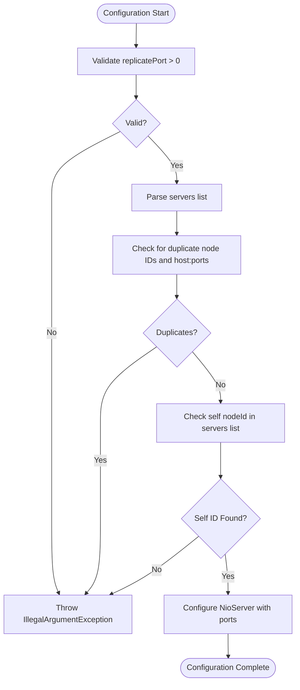
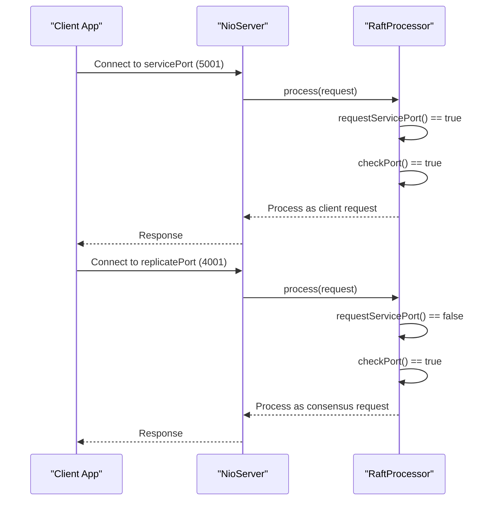

# Port Configuration

<cite>
**Referenced Files in This Document**   
- [RaftServerConfig.java](file://server/src/main/java/com/github/dtprj/dongting/raft/server/RaftServerConfig.java)
- [RaftServer.java](file://server/src/main/java/com/github/dtprj/dongting/raft/server/RaftServer.java)
- [RaftProcessor.java](file://server/src/main/java/com/github/dtprj/dongting/raft/server/RaftProcessor.java)
- [NioServerConfig.java](file://client/src/main/java/com/github/dtprj/dongting/net/NioServerConfig.java)
- [DemoKvServerBase.java](file://demos/src/main/java/com/github/dtprj/dongting/demos/base/DemoKvServerBase.java)
- [DemoServer1.java](file://demos/src/main/java/com/github/dtprj/dongting/demos/cluster/DemoServer1.java)
- [DemoServer2.java](file://demos/src/main/java/com/github/dtprj/dongting/demos/cluster/DemoServer2.java)
- [DemoServer3.java](file://demos/src/main/java/com/github/dtprj/dongting/demos/cluster/DemoServer3.java)
</cite>

## Table of Contents
1. [Introduction](#introduction)
2. [Port Configuration Overview](#port-configuration-overview)
3. [Configuration in RaftServerConfig](#configuration-in-raftserverconfig)
4. [Network Binding Behavior](#network-binding-behavior)
5. [Multi-Node Configuration Examples](#multi-node-configuration-examples)
6. [Security and Deployment Considerations](#security-and-deployment-considerations)
7. [Common Issues and Troubleshooting](#common-issues-and-troubleshooting)

## Introduction
This document provides comprehensive guidance on port configuration for a multi-node RAFT cluster. It explains the purpose and usage of two critical ports: replicatePort for internal RAFT consensus communication between nodes, and servicePort for client-facing services such as DtKV operations. The document covers configuration details, validation rules, network binding behavior, and deployment considerations for both ports across multiple nodes to ensure proper cluster operation.

**Section sources**
- [RaftServerConfig.java](file://server/src/main/java/com/github/dtprj/dongting/raft/server/RaftServerConfig.java#L23-L26)

## Port Configuration Overview
The RAFT cluster utilizes two distinct ports for different communication purposes:

- **replicatePort**: This port is used exclusively for internal RAFT consensus communication between nodes. It handles log replication, voting, leader election, and other RAFT protocol messages. This port should only be accessible within the cluster network and not exposed to external clients.

- **servicePort**: This port serves client-facing services such as DtKV operations. When set to a positive value, it enables the server to accept client connections for key-value operations, distributed locking, and watch functionality. Setting this value to 0 disables the client service server.

The separation of these ports allows for better security practices, network isolation, and performance optimization by dedicating separate network pathways for consensus traffic and client traffic.

```mermaid
graph TD
subgraph "Node 1"
RP1[replicatePort: 4001]
SP1[servicePort: 5001]
end
subgraph "Node 2"
RP2[replicatePort: 4002]
SP2[servicePort: 5002]
end
subgraph "Node 3"
RP3[replicatePort: 4003]
SP3[servicePort: 5003]
end
RP1 < --> RP2
RP2 < --> RP3
RP1 < --> RP3
Client1 --> SP1
Client2 --> SP2
Client3 --> SP3
style RP1 fill:#f9f,stroke:#333
style RP2 fill:#f9f,stroke:#333
style RP3 fill:#f9f,stroke:#333
style SP1 fill:#bbf,stroke:#333
style SP2 fill:#bbf,stroke:#333
style SP3 fill:#bbf,stroke:#333
```

**Diagram sources**
- [RaftServerConfig.java](file://server/src/main/java/com/github/dtprj/dongting/raft/server/RaftServerConfig.java#L23-L26)
- [DemoKvServerBase.java](file://demos/src/main/java/com/github/dtprj/dongting/demos/base/DemoKvServerBase.java#L41-L43)

## Configuration in RaftServerConfig
The port configuration is managed through the RaftServerConfig class, which contains specific fields and validation rules for both ports.

### Configuration Parameters
The RaftServerConfig class defines the following port-related parameters:

- **replicatePort**: An integer value representing the port for internal RAFT consensus communication. This field is mandatory and must be positive.
- **servicePort**: An integer value representing the port for client-facing services. A value of 0 indicates that the client service server should not be started.

### Default Values and Validation
The configuration system enforces the following rules:

- The replicatePort must be a positive integer, validated using DtUtil.checkPositive() during server initialization.
- The servicePort can be zero (to disable client services) or a positive integer.
- Both ports are validated during the RaftServer construction process before any network components are created.

The configuration also includes validation for the servers list, ensuring no duplicate server IDs or host-port combinations exist, which helps prevent port conflicts in the cluster.



**Diagram sources**
- [RaftServer.java](file://server/src/main/java/com/github/dtprj/dongting/raft/server/RaftServer.java#L124-L138)
- [RaftServerConfig.java](file://server/src/main/java/com/github/dtprj/dongting/raft/server/RaftServerConfig.java#L23-L26)

**Section sources**
- [RaftServerConfig.java](file://server/src/main/java/com/github/dtprj/dongting/raft/server/RaftServerConfig.java#L23-L26)
- [RaftServer.java](file://server/src/main/java/com/github/dtprj/dongting/raft/server/RaftServer.java#L124-L138)

## Network Binding Behavior
The network binding behavior for the RAFT cluster ports is implemented through the NioServer configuration system, which determines how the server binds to network interfaces and handles multiple ports.

### Port Binding Logic
The binding behavior is determined by the servicePort value:

- When servicePort > 0: The NioServer is configured with both replicatePort and servicePort using the ports array. This allows a single NioServer instance to listen on multiple ports simultaneously.
- When servicePort = 0: The NioServer is configured with only the replicatePort using the port field, as client services are disabled.

This design allows for efficient resource utilization by sharing a single NioServer instance across multiple ports when both services are enabled, while still allowing independent configuration when client services are disabled.

### Request Routing
The system uses request routing to direct incoming connections to the appropriate processing path:

- Requests received on the servicePort are handled by client-facing processors for DtKV operations.
- Requests received on the replicatePort are handled by RAFT consensus processors for log replication and cluster management.
- The RaftProcessor class contains logic to check which port received a request and validate that the request type is appropriate for that port.



**Diagram sources**
- [RaftServer.java](file://server/src/main/java/com/github/dtprj/dongting/raft/server/RaftServer.java#L148-L153)
- [RaftProcessor.java](file://server/src/main/java/com/github/dtprj/dongting/raft/server/RaftProcessor.java#L56-L65)

**Section sources**
- [RaftServer.java](file://server/src/main/java/com/github/dtprj/dongting/raft/server/RaftServer.java#L148-L153)
- [RaftProcessor.java](file://server/src/main/java/com/github/dtprj/dongting/raft/server/RaftProcessor.java#L56-L65)

## Multi-Node Configuration Examples
This section provides practical examples of port configuration for a three-node RAFT cluster, demonstrating proper configuration patterns to avoid conflicts.

### Example 1: Three-Node Cluster Configuration
The following example shows the configuration for a three-node cluster with sequential port assignments:

**Node 1 Configuration:**
- nodeId: 1
- replicatePort: 4001
- servicePort: 5001
- servers: "1,127.0.0.1:4001;2,127.0.0.1:4002;3,127.0.0.1:4003"

**Node 2 Configuration:**
- nodeId: 2
- replicatePort: 4002
- servicePort: 5002
- servers: "1,127.0.0.1:4001;2,127.0.0.1:4002;3,127.0.0.1:4003"

**Node 3 Configuration:**
- nodeId: 3
- replicatePort: 4003
- servicePort: 5003
- servers: "1,127.0.0.1:4001;2,127.0.0.1:4002;3,127.0.0.1:4003"

### Example 2: Configuration Pattern
The demo code shows a consistent pattern for port assignment:

```java
serverConfig.replicatePort = 4000 + nodeId;
serverConfig.servicePort = 5000 + nodeId;
```

This pattern ensures:
- No port conflicts between nodes
- Easy to remember and configure port assignments
- Clear separation between replicate and service ports
- Scalability to additional nodes

The servers list uses the replicatePort for inter-node communication, while clients connect to the servicePort for DtKV operations.

```mermaid
graph TB
subgraph "Node 1"
RP1[replicatePort: 4001]
SP1[servicePort: 5001]
end
subgraph "Node 2"
RP2[replicatePort: 4002]
SP2[servicePort: 5002]
end
subgraph "Node 3"
RP3[replicatePort: 4003]
SP3[servicePort: 5003]
end
RP1 < --> RP2
RP2 < --> RP3
RP1 < --> RP3
Client --> SP1
Client --> SP2
Client --> SP3
style RP1 fill:#f9f,stroke:#333
style RP2 fill:#f9f,stroke:#333
style RP3 fill:#f9f,stroke:#333
style SP1 fill:#bbf,stroke:#333
style SP2 fill:#bbf,stroke:#333
style SP3 fill:#bbf,stroke:#333
classDef replicatePort fill:#f9f,stroke:#333;
classDef servicePort fill:#bbf,stroke:#333;
```

**Diagram sources**
- [DemoKvServerBase.java](file://demos/src/main/java/com/github/dtprj/dongting/demos/base/DemoKvServerBase.java#L41-L43)
- [DemoServer1.java](file://demos/src/main/java/com/github/dtprj/dongting/demos/cluster/DemoServer1.java#L27)
- [DemoServer2.java](file://demos/src/main/java/com/github/dtprj/dongting/demos/cluster/DemoServer2.java#L27)
- [DemoServer3.java](file://demos/src/main/java/com/github/dtprj/dongting/demos/cluster/DemoServer3.java#L27)

**Section sources**
- [DemoKvServerBase.java](file://demos/src/main/java/com/github/dtprj/dongting/demos/base/DemoKvServerBase.java#L41-L43)
- [DemoServer1.java](file://demos/src/main/java/com/github/dtprj/dongting/demos/cluster/DemoServer1.java#L27)
- [DemoServer2.java](file://demos/src/main/java/com/github/dtprj/dongting/demos/cluster/DemoServer2.java#L27)
- [DemoServer3.java](file://demos/src/main/java/com/github/dtprj/dongting/demos/cluster/DemoServer3.java#L27)

## Security and Deployment Considerations
When deploying the RAFT cluster in production environments, several security and deployment considerations must be addressed regarding port configuration.

### Firewall and Network Security
For secure deployment:

- **replicatePort**: Should be restricted to internal cluster network traffic only. Configure firewalls or security groups to allow traffic only between cluster nodes on the replicatePort range.
- **servicePort**: Can be exposed to client networks, but should be protected by appropriate security measures such as authentication, encryption, and rate limiting.

In cloud environments, use network security groups to:
- Allow inbound traffic on replicatePort only from other cluster nodes
- Allow inbound traffic on servicePort from client subnets or load balancers
- Block all other inbound traffic to these ports

### Container and Pod Networking
When deploying in containerized environments:

- **Port Mapping**: Ensure proper port mapping between container and host ports, especially when running multiple instances on the same host.
- **Service Discovery**: Use service discovery mechanisms to dynamically resolve node addresses and ports.
- **Health Checks**: Configure health checks on both ports appropriately:
  - replicatePort health checks for cluster internal monitoring
  - servicePort health checks for client-facing load balancers

For Kubernetes deployments:
- Define separate ports in the Service definition for replicate and service ports
- Use Network Policies to control traffic between pods
- Consider using headless services for direct pod-to-pod communication on replicatePort

**Section sources**
- [RaftServerConfig.java](file://server/src/main/java/com/github/dtprj/dongting/raft/server/RaftServerConfig.java#L23-L26)
- [RaftServer.java](file://server/src/main/java/com/github/dtprj/dongting/raft/server/RaftServer.java#L148-L153)

## Common Issues and Troubleshooting
This section addresses common issues related to port configuration in the RAFT cluster and provides troubleshooting guidance.

### Port Conflicts
**Symptoms**: Server fails to start with "Address already in use" errors.

**Causes**:
- Multiple processes attempting to bind to the same port
- Previous server instance not properly terminated
- Incorrect port configuration in RaftServerConfig

**Solutions**:
- Verify port availability before starting the server
- Use the sequential port pattern (4000 + nodeId, 5000 + nodeId) to avoid conflicts
- Check for lingering processes using the ports
- Implement proper shutdown procedures to release ports

### Unreachable Replicate Ports
**Symptoms**: Nodes cannot form a cluster, election failures, log replication issues.

**Causes**:
- Firewall rules blocking replicatePort traffic
- Incorrect server addresses in the servers list
- Network connectivity issues between nodes
- Security groups not allowing inter-node communication

**Solutions**:
- Verify network connectivity between nodes using tools like telnet or nc
- Check firewall and security group configurations
- Validate that the servers list uses the correct replicatePort values
- Test connectivity on the specific replicatePort between all nodes

### Misconfigured Service Endpoints
**Symptoms**: Clients cannot connect to the service, connection timeouts, "command not supported on this port" errors.

**Causes**:
- Clients connecting to replicatePort instead of servicePort
- servicePort set to 0 (disabled) when client access is required
- Load balancer configured with incorrect port
- DNS or service discovery pointing to wrong port

**Solutions**:
- Verify that clients are connecting to the servicePort, not replicatePort
- Ensure servicePort is set to a positive value when client access is needed
- Double-check client connection strings and service discovery configurations
- Use the createWrongPortRest() method in RaftProcessor to identify and debug port misconfiguration issues

**Section sources**
- [RaftProcessor.java](file://server/src/main/java/com/github/dtprj/dongting/raft/server/RaftProcessor.java#L68-L74)
- [RaftServer.java](file://server/src/main/java/com/github/dtprj/dongting/raft/server/RaftServer.java#L124-L138)
- [RaftServerConfig.java](file://server/src/main/java/com/github/dtprj/dongting/raft/server/RaftServerConfig.java#L23-L26)