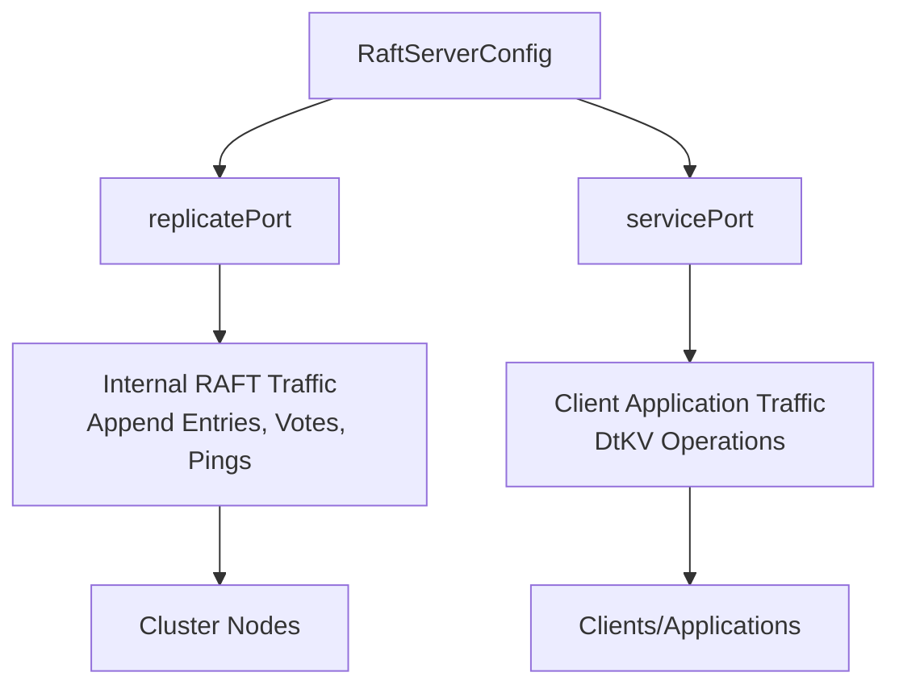
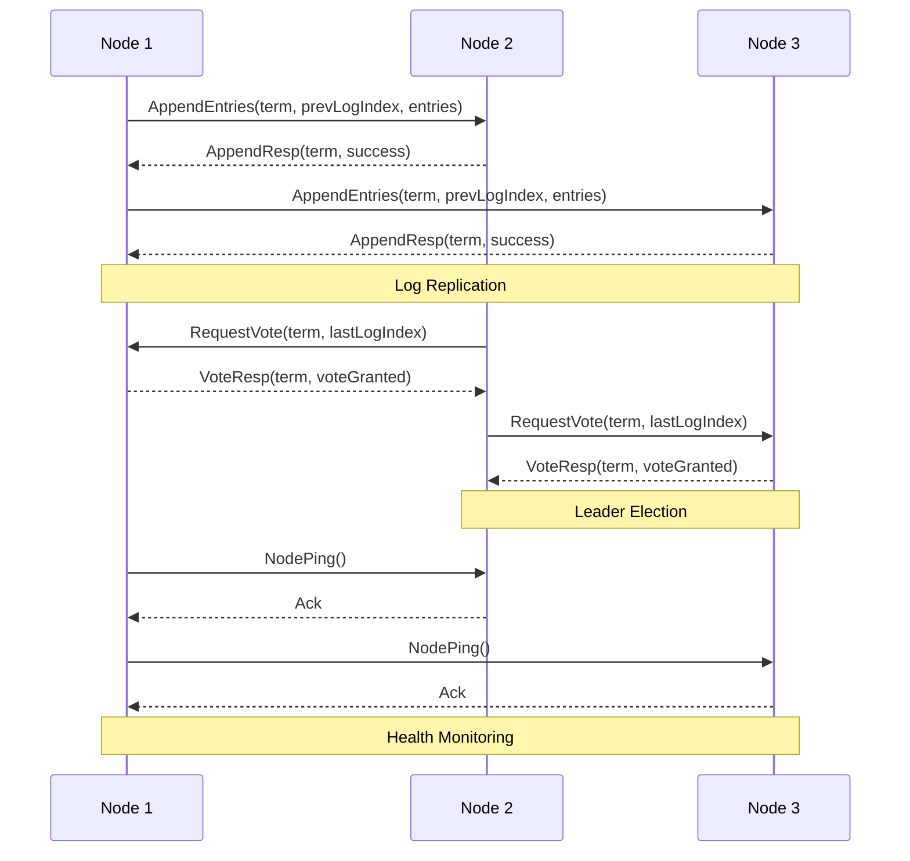
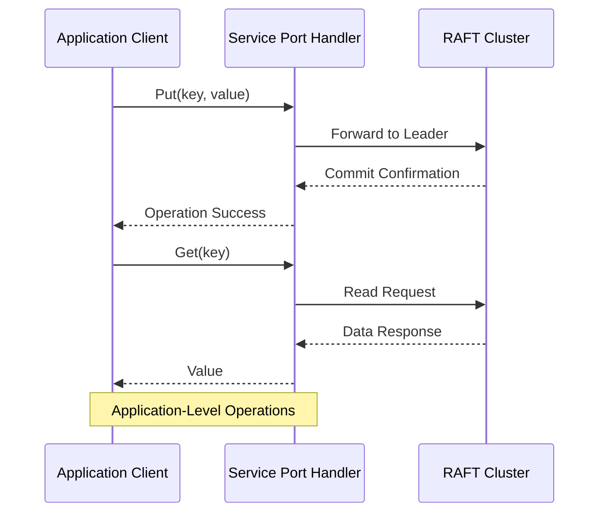

# Port Configuration and Network Separation

<cite>
**Referenced Files in This Document**   
- [RaftServerConfig.java](file://server/src/main/java/com/github/dtprj/dongting/raft/server/RaftServerConfig.java)
- [RaftServer.java](file://server/src/main/java/com/github/dtprj/dongting/raft/server/RaftServer.java)
- [NioServerConfig.java](file://client/src/main/java/com/github/dtprj/dongting/net/NioServerConfig.java)
- [DemoKvServerBase.java](file://demos/src/main/java/com/github/dtprj/dongting/demos/base/DemoKvServerBase.java)
- [NodePingProcessor.java](file://server/src/main/java/com/github/dtprj/dongting/raft/rpc/NodePingProcessor.java)
- [RaftPingProcessor.java](file://server/src/main/java/com/github/dtprj/dongting/raft/rpc/RaftPingProcessor.java)
- [AppendReq.java](file://server/src/main/java/com/github/dtprj/dongting/raft/rpc/AppendReq.java)
- [VoteReq.java](file://server/src/main/java/com/github/dtprj/dongting/raft/rpc/VoteReq.java)
</cite>

## Table of Contents
1. [Introduction](#introduction)
2. [Core Port Configuration](#core-port-configuration)
3. [replicatePort: Internal RAFT Consensus Traffic](#replicateport-internal-raft-consensus-traffic)
4. [servicePort: Client-Facing Application Traffic](#serviceport-client-facing-application-traffic)
5. [Network Separation and Security](#network-separation-and-security)
6. [Configuration Examples](#configuration-examples)
7. [Firewall and Network Performance](#firewall-and-network-performance)
8. [Default Behavior and Trade-offs](#default-behavior-and-trade-offs)
9. [Production Best Practices](#production-best-practices)

## Introduction
This document provides comprehensive guidance on port configuration and network separation in the Dongting distributed system, focusing on the `replicatePort` and `servicePort` settings in `RaftServerConfig`. The system implements the RAFT consensus algorithm for distributed coordination, requiring careful network configuration to ensure both performance and security. Understanding the distinct roles of these ports is critical for proper deployment, as they serve fundamentally different purposes within the cluster architecture.

**Section sources**
- [RaftServerConfig.java](file://server/src/main/java/com/github/dtprj/dongting/raft/server/RaftServerConfig.java#L23-L26)

## Core Port Configuration
The `RaftServerConfig` class defines two critical port configuration parameters: `replicatePort` and `servicePort`. These ports serve distinct network roles within the distributed system architecture. The `replicatePort` is dedicated to internal RAFT consensus traffic between cluster nodes, handling critical operations such as log replication, leader election, and cluster health monitoring. In contrast, the `servicePort` is designed for client-facing traffic, enabling applications like DtKV to interact with the distributed system. This separation allows for optimized network routing, enhanced security through network segmentation, and improved performance by isolating high-frequency consensus traffic from application workloads.



**Diagram sources**
- [RaftServerConfig.java](file://server/src/main/java/com/github/dtprj/dongting/raft/server/RaftServerConfig.java#L23-L26)

**Section sources**
- [RaftServerConfig.java](file://server/src/main/java/com/github/dtprj/dongting/raft/server/RaftServerConfig.java#L21-L39)

## replicatePort: Internal RAFT Consensus Traffic
The `replicatePort` handles all internal RAFT consensus traffic between cluster nodes, forming the backbone of the distributed system's coordination mechanism. This port manages critical RAFT protocol operations including log replication (AppendEntries), leader election (RequestVote), and cluster health monitoring (NodePing and RaftPing). The traffic on this port is essential for maintaining cluster consistency, leader election, and data replication across nodes. According to the implementation in `RaftServer.java`, when `servicePort` is configured, the `replicatePort` is explicitly used for consensus traffic, ensuring that internal cluster communication is isolated from client-facing operations. This separation enhances security by limiting exposure of the consensus protocol to only trusted cluster nodes.



**Diagram sources**
- [AppendReq.java](file://server/src/main/java/com/github/dtprj/dongting/raft/rpc/AppendReq.java#L34-L43)
- [VoteReq.java](file://server/src/main/java/com/github/dtprj/dongting/raft/rpc/VoteReq.java#L28-L34)
- [NodePingProcessor.java](file://server/src/main/java/com/github/dtprj/dongting/raft/rpc/NodePingProcessor.java#L30-L55)

**Section sources**
- [RaftServerConfig.java](file://server/src/main/java/com/github/dtprj/dongting/raft/server/RaftServerConfig.java#L24)
- [RaftServer.java](file://server/src/main/java/com/github/dtprj/dongting/raft/server/RaftServer.java#L148-L153)

## servicePort: Client-Facing Application Traffic
The `servicePort` handles client-facing traffic for applications interacting with the distributed system, such as the DtKV key-value store. This port serves as the entry point for application-level operations, including data reads, writes, and other business logic interactions. When configured, the `servicePort` allows the system to separate application traffic from internal RAFT consensus traffic, enabling independent scaling and security policies for client access. The implementation in `RaftServer.java` shows that when `servicePort` is greater than zero, the NIO server is configured to listen on both ports, with the `servicePort` specifically designated for client access. This separation ensures that high-volume client operations do not interfere with the critical consensus protocol operations running on the `replicatePort`.



**Diagram sources**
- [RaftServer.java](file://server/src/main/java/com/github/dtprj/dongting/raft/server/RaftServer.java#L149-L151)
- [DemoKvServerBase.java](file://demos/src/main/java/com/github/dtprj/dongting/demos/base/DemoKvServerBase.java#L43)

**Section sources**
- [RaftServerConfig.java](file://server/src/main/java/com/github/dtprj/dongting/raft/server/RaftServerConfig.java#L26)
- [RaftServer.java](file://server/src/main/java/com/github/dtprj/dongting/raft/server/RaftServer.java#L149-L151)

## Network Separation and Security
Network separation through dedicated ports for consensus and client traffic provides significant security benefits for the distributed system. By configuring the `replicatePort` to operate on a private network interface and the `servicePort` on a public interface, administrators can implement strict network segmentation. This architecture ensures that the sensitive RAFT consensus protocol is only accessible within the trusted cluster network, protecting against external attacks on the consensus mechanism. The internal consensus traffic on `replicatePort` should be restricted to cluster nodes only, while the `servicePort` can be exposed to application servers with appropriate authentication and rate limiting. This separation follows the principle of least privilege, minimizing the attack surface of the critical consensus layer while still providing necessary access for client applications.

```mermaid
graph TB
subgraph "Public Network"
ClientApp[Application Server]
ClientApp --> |servicePort| LoadBalancer
LoadBalancer --> |servicePort| PublicInterface[Public Network Interface]
end
subgraph "Private Network"
PublicInterface --> |servicePort| RaftNode[Raft Node]
RaftNode < --> |replicatePort| RaftNode2[Raft Node]
RaftNode < --> |replicatePort| RaftNode3[Raft Node]
PrivateInterface[Private Network Interface] < --> RaftNode
end
style PublicInterface stroke:#ff0000,stroke-width:2px
style PrivateInterface stroke:#0000ff,stroke-width:2px
style RaftNode stroke:#008000,stroke-width:2px
Note over PublicInterface: Public Interface<br/>servicePort Only
Note over PrivateInterface: Private Interface<br/>replicatePort Only
```

**Diagram sources**
- [RaftServer.java](file://server/src/main/java/com/github/dtprj/dongting/raft/server/RaftServer.java#L148-L153)
- [RaftServerConfig.java](file://server/src/main/java/com/github/dtprj/dongting/raft/server/RaftServerConfig.java#L24-L26)

**Section sources**
- [RaftServer.java](file://server/src/main/java/com/github/dtprj/dongting/raft/server/RaftServer.java#L148-L153)

## Configuration Examples
The demo examples in the codebase illustrate proper configuration of `replicatePort` and `servicePort` for a production-like setup. In `DemoKvServerBase.java`, the configuration shows `replicatePort` set to `4000 + nodeId` and `servicePort` set to `5000 + nodeId`, demonstrating the use of distinct port ranges for each purpose. This pattern ensures that each node in the cluster has unique ports for both consensus and client traffic. The configuration also includes the `servers` parameter that specifies the cluster topology with node IDs and their corresponding `replicatePort` addresses. This separation allows for clear network routing policies, where firewall rules can be established to permit `replicatePort` traffic only between cluster nodes, while `servicePort` traffic can be controlled based on application server requirements.

```mermaid
flowchart TD
Config[RaftServerConfig] --> RepPort[replicatePort = 4000 + nodeId]
Config --> ServicePort[servicePort = 5000 + nodeId]
Config --> Servers[servers = "1,127.0.0.1:4001;2,127.0.0.1:4002;3,127.0.0.1:4003"]
Node1[Node 1] --> Rep1[replicatePort: 4001]
Node1 --> Service1[servicePort: 5001]
Node2[Node 2] --> Rep2[replicatePort: 4002]
Node2 --> Service2[servicePort: 5002]
Node3[Node 3] --> Rep3[replicatePort: 4003]
Node3 --> Service3[servicePort: 5003]
RepPort --> Node1
RepPort --> Node2
RepPort --> Node3
ServicePort --> Node1
ServicePort --> Node2
ServicePort --> Node3
style Rep1 fill:#f9f,stroke:#333
style Rep2 fill:#f9f,stroke:#333
style Rep3 fill:#f9f,stroke:#333
style Service1 fill:#9f9,stroke:#333
style Service2 fill:#9f9,stroke:#333
style Service3 fill:#9f9,stroke:#333
Note over Rep1,Rep3: replicatePort<br/>Private Network
Note over Service1,Service3: servicePort<br/>Public Network
```

**Diagram sources**
- [DemoKvServerBase.java](file://demos/src/main/java/com/github/dtprj/dongting/demos/base/DemoKvServerBase.java#L42-L43)
- [DemoServer1.java](file://demos/src/main/java/com/github/dtprj/dongting/demos/cluster/DemoServer1.java#L27)

**Section sources**
- [DemoKvServerBase.java](file://demos/src/main/java/com/github/dtprj/dongting/demos/base/DemoKvServerBase.java#L38-L43)

## Firewall and Network Performance
Proper firewall configuration is essential for securing the separated port architecture while maintaining optimal network performance. For the `replicatePort`, firewall rules should restrict access to only the IP addresses of other cluster nodes, preventing unauthorized access to the RAFT consensus protocol. This port typically requires low latency and high reliability, as consensus operations are sensitive to network delays. For the `servicePort`, firewall rules can be more permissive, allowing access from application servers while potentially implementing rate limiting to prevent abuse. Network performance considerations include ensuring sufficient bandwidth for log replication on the `replicatePort`, especially during leader elections or cluster recovery, while the `servicePort` should be optimized for the expected client workload patterns, which may involve different bandwidth and connection handling requirements.

**Section sources**
- [RaftServer.java](file://server/src/main/java/com/github/dtprj/dongting/raft/server/RaftServer.java#L148-L153)
- [NioServerConfig.java](file://client/src/main/java/com/github/dtprj/dongting/net/NioServerConfig.java#L22-L23)

## Default Behavior and Trade-offs
When `servicePort` is not specified (set to 0 or not configured), the system defaults to using the `replicatePort` for both consensus and client traffic. This configuration simplifies deployment by requiring only a single port to be opened in firewalls and network configurations. However, this approach has significant trade-offs in terms of security and performance. Combining both traffic types on a single port eliminates network separation, potentially exposing the consensus protocol to client-side attacks or overwhelming it with application traffic. The implementation in `RaftServer.java` shows this behavior through the conditional logic that configures the NIO server to listen on either a single port (when `servicePort` is 0) or multiple ports (when `servicePort` is specified). While this default behavior is convenient for development and testing, it is not recommended for production environments due to the reduced security posture and potential performance interference between consensus and application workloads.

```mermaid
flowchart TD
Start{servicePort Configured?}
Start --> |Yes| MultiplePorts[Configure NIO Server<br/>with replicatePort and servicePort]
Start --> |No| SinglePort[Configure NIO Server<br/>with replicatePort only]
MultiplePorts --> Benefit1[Network Separation]
MultiplePorts --> Benefit2[Enhanced Security]
MultiplePorts --> Benefit3[Performance Isolation]
SinglePort --> Drawback1[No Network Separation]
SinglePort --> Drawback2[Reduced Security]
SinglePort --> Drawback3[Potential Performance Interference]
style MultiplePorts fill:#9f9,stroke:#333
style SinglePort fill:#f99,stroke:#333
style Benefit1 fill:#9f9,stroke:#333
style Benefit2 fill:#9f9,stroke:#333
style Benefit3 fill:#9f9,stroke:#333
style Drawback1 fill:#f99,stroke:#333
style Drawback2 fill:#f99,stroke:#333
style Drawback3 fill:#f99,stroke:#333
Note over MultiplePorts: Production Recommended
Note over SinglePort: Development Only
```

**Diagram sources**
- [RaftServer.java](file://server/src/main/java/com/github/dtprj/dongting/raft/server/RaftServer.java#L149-L152)

**Section sources**
- [RaftServer.java](file://server/src/main/java/com/github/dtprj/dongting/raft/server/RaftServer.java#L149-L153)
- [RaftServerConfig.java](file://server/src/main/java/com/github/dtprj/dongting/raft/server/RaftServerConfig.java#L26)

## Production Best Practices
For production deployments, it is strongly recommended to configure separate `replicatePort` and `servicePort` values to achieve optimal security and performance. The `replicatePort` should be placed on a private network interface with firewall rules restricting access to only other cluster nodes, protecting the RAFT consensus protocol from external threats. The `servicePort` can be exposed on a public interface with appropriate security measures such as authentication, rate limiting, and monitoring. Network performance should be optimized by ensuring low-latency connections between cluster nodes on the `replicatePort`, as consensus operations are sensitive to network delays. Additionally, monitoring and alerting should be implemented for both ports to detect anomalies in traffic patterns that might indicate security issues or performance bottlenecks. This separation of concerns allows for independent scaling, security policies, and performance tuning for the consensus and application layers of the distributed system.

**Section sources**
- [RaftServerConfig.java](file://server/src/main/java/com/github/dtprj/dongting/raft/server/RaftServerConfig.java#L23-L26)
- [RaftServer.java](file://server/src/main/java/com/github/dtprj/dongting/raft/server/RaftServer.java#L148-L153)
- [DemoKvServerBase.java](file://demos/src/main/java/com/github/dtprj/dongting/demos/base/DemoKvServerBase.java#L42-L43)