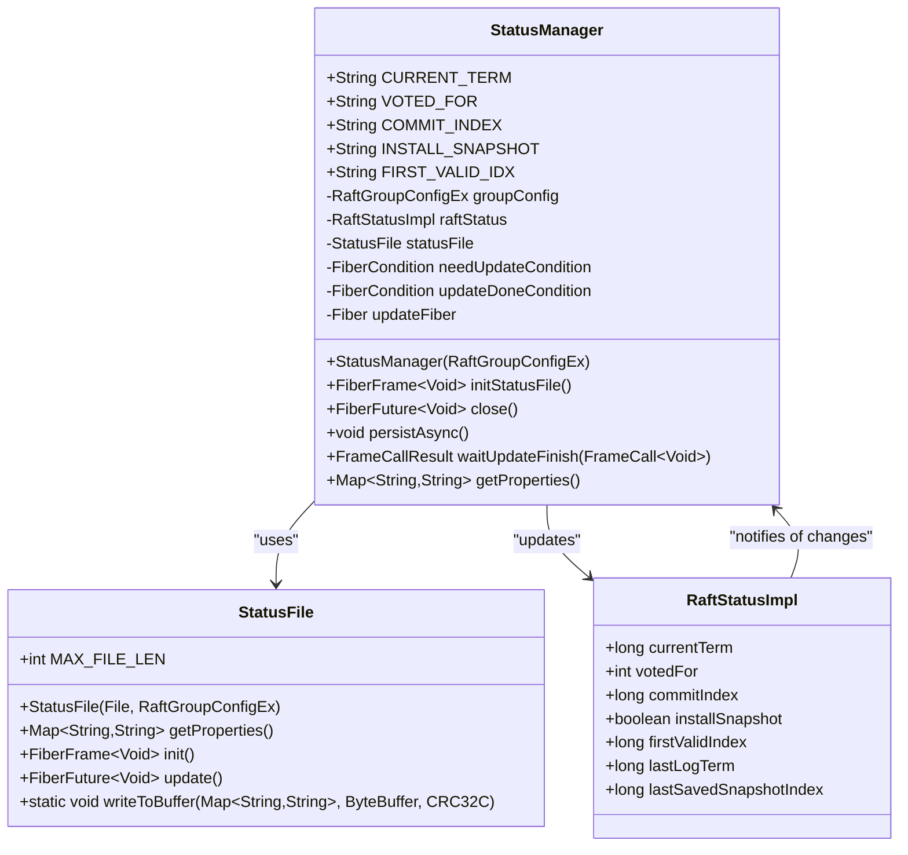
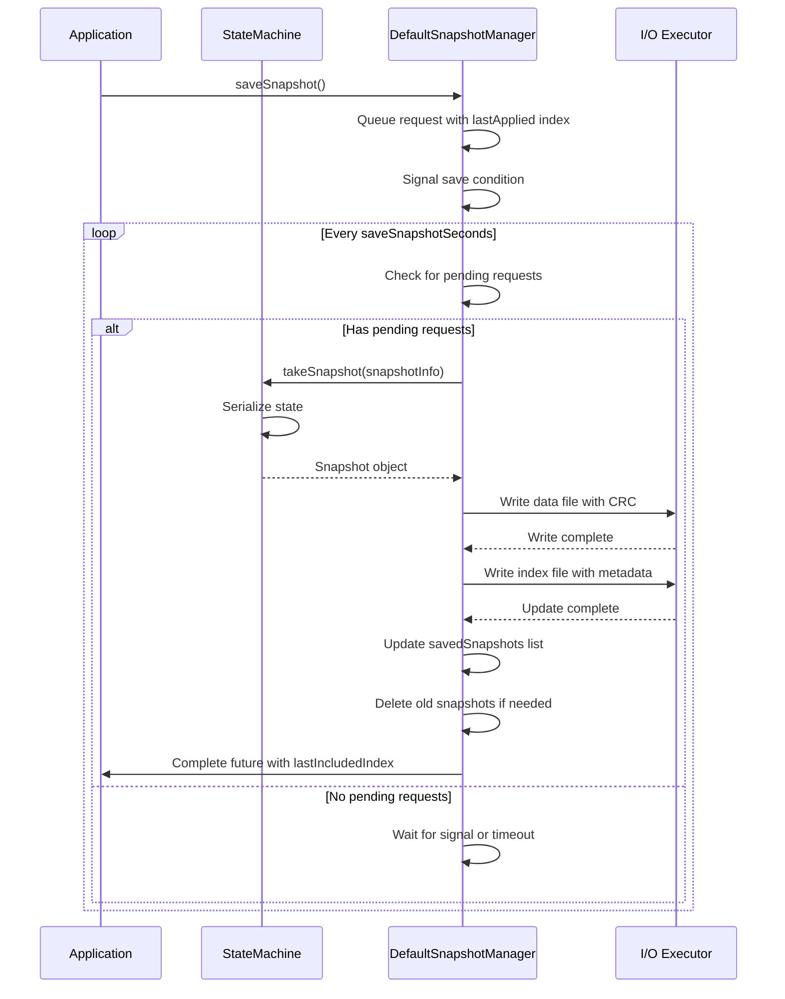
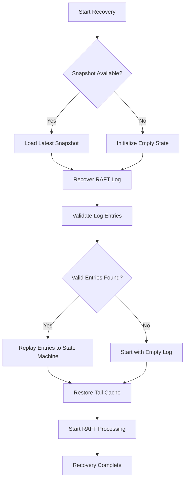
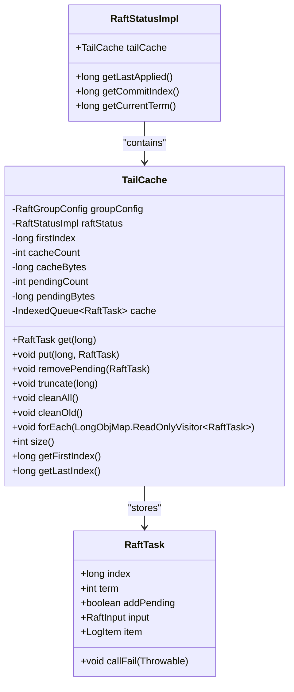

# Backup and Recovery Procedures

<cite>
**Referenced Files in This Document**   
- [StatusManager.java](file://server/src/main/java/com/github/dtprj/dongting/raft/store/StatusManager.java)
- [DefaultSnapshotManager.java](file://server/src/main/java/com/github/dtprj/dongting/raft/sm/DefaultSnapshotManager.java)
- [Restorer.java](file://server/src/main/java/com/github/dtprj/dongting/raft/store/Restorer.java)
- [TailCache.java](file://server/src/main/java/com/github/dtprj/dongting/raft/impl/TailCache.java)
- [RaftGroupConfig.java](file://server/src/main/java/com/github/dtprj/dongting/raft/server/RaftGroupConfig.java)
- [StatusFile.java](file://server/src/main/java/com/github/dtprj/dongting/raft/store/StatusFile.java)
</cite>

## Table of Contents
1. [Introduction](#introduction)
2. [RAFT Log and Snapshot-Based Persistence](#raft-log-and-snapshot-based-persistence)
3. [StatusManager and Persistent State Storage](#statusmanager-and-persistent-state-storage)
4. [Snapshot Configuration and Management](#snapshot-configuration-and-management)
5. [Consistent Backup Procedures](#consistent-backup-procedures)
6. [Recovery Processes](#recovery-processes)
7. [Handling Corrupted Log Files](#handling-corrupted-log-files)
8. [Conclusion](#conclusion)

## Introduction
This document provides comprehensive procedures for backup and recovery in the Dongting RAFT-based distributed system. It details the mechanisms for data protection and disaster recovery, focusing on the RAFT log and snapshot-based persistence model. The document explains how the StatusManager handles persistent state storage, the role of the saveSnapshotWhenClose configuration option, and procedures for performing consistent backups while the server is running. It also covers recovery processes for node replacement and cluster restoration, including handling corrupted log files and the role of the tailCache in recovery operations.

## RAFT Log and Snapshot-Based Persistence
The Dongting system implements a RAFT consensus algorithm with log and snapshot-based persistence for data durability and recovery. The RAFT log stores all state transitions as a sequence of log entries, while snapshots capture the state machine state at specific log indices to prevent unbounded log growth.

The persistence mechanism consists of:
- **RAFT Log Files**: Sequentially written log entries stored in segmented files
- **Snapshot Files**: Complete state machine snapshots stored in data and index files
- **Status Files**: Persistent storage of RAFT metadata (current term, voted for, commit index)

Log entries are written to disk in batches and are only considered committed when a majority of the cluster has persisted them. Snapshots are created periodically or when the log reaches a certain size, capturing the entire state machine state at a specific log index. This allows the system to truncate the log up to the snapshot index, reducing storage requirements and speeding up recovery.

The snapshot mechanism uses a two-file approach:
- `.data` files containing the serialized state machine state
- `.idx` files containing metadata about the snapshot (last included index, term, members, etc.)

This separation allows for efficient validation and loading of snapshot metadata without reading the potentially large data file.

**Section sources**
- [DefaultSnapshotManager.java](file://server/src/main/java/com/github/dtprj/dongting/raft/sm/DefaultSnapshotManager.java#L63-L578)
- [Restorer.java](file://server/src/main/java/com/github/dtprj/dongting/raft/store/Restorer.java#L1-L327)

## StatusManager and Persistent State Storage
The StatusManager component is responsible for managing the persistent storage of RAFT metadata, including the current term, voted-for candidate, and commit index. It ensures these critical state variables survive server restarts and crashes.

The StatusManager operates as follows:
1. **Initialization**: During startup, it reads the status file to restore the RAFT state
2. **Asynchronous Persistence**: Changes to the state are persisted asynchronously to avoid blocking the RAFT algorithm
3. **Synchronous Guarantees**: Provides methods to wait for persistence operations to complete when necessary
4. **Atomic Updates**: Uses a temporary file and atomic rename to ensure updates are atomic

The StatusManager uses a dedicated fiber (lightweight thread) to handle persistence operations, preventing I/O from blocking the main RAFT processing. It maintains in-memory copies of the state variables and only writes to disk when changes occur. The persistence is triggered by calling `persistAsync()`, and callers can use `waitUpdateFinish()` to ensure the write has completed.

Key state variables managed by StatusManager:
- **currentTerm**: The current RAFT term number
- **votedFor**: The candidate ID this node voted for in the current term
- **commitIndex**: The highest log index known to be committed
- **installSnapshot**: Flag indicating if the node is currently installing a snapshot

The StatusManager also handles the `firstValidIndex` which marks the earliest log index that should be considered valid, particularly after snapshot installation.



**Diagram sources**
- [StatusManager.java](file://server/src/main/java/com/github/dtprj/dongting/raft/store/StatusManager.java#L39-L183)
- [StatusFile.java](file://server/src/main/java/com/github/dtprj/dongting/raft/store/StatusFile.java#L49-L220)

**Section sources**
- [StatusManager.java](file://server/src/main/java/com/github/dtprj/dongting/raft/store/StatusManager.java#L39-L183)
- [StatusFile.java](file://server/src/main/java/com/github/dtprj/dongting/raft/store/StatusFile.java#L49-L220)

## Snapshot Configuration and Management
The snapshot mechanism is controlled by several configuration options in the RaftGroupConfig class. These options determine when and how snapshots are created and managed.

Key configuration options:
- **saveSnapshotSeconds**: Interval in seconds between automatic snapshot attempts (default: 3600)
- **maxKeepSnapshots**: Maximum number of snapshots to retain (default: 2)
- **saveSnapshotWhenClose**: Whether to save a snapshot when the server closes (default: true)
- **deleteLogsAfterTakeSnapshot**: Whether to delete logs after successfully taking a snapshot (default: true)
- **diskSnapshotBufferSize**: Buffer size for disk snapshot operations (default: 64KB)
- **diskSnapshotConcurrency**: Number of concurrent disk operations for snapshots (default: 4)

The `saveSnapshotWhenClose` option is particularly important for graceful shutdowns. When enabled, the system will attempt to create a final snapshot before shutting down, ensuring that the most recent state is captured. This reduces recovery time after restarts, as the system can start from a more recent state rather than replaying many log entries.

The DefaultSnapshotManager handles all snapshot operations:
1. **Initialization**: Loads existing snapshots during startup and identifies the most recent valid snapshot
2. **Snapshot Creation**: Coordinates with the state machine to create snapshots at appropriate intervals
3. **Snapshot Retention**: Enforces the maxKeepSnapshots policy by deleting older snapshots
4. **Metadata Management**: Maintains snapshot metadata in index files with CRC protection

When a snapshot is created, it captures the state machine state at the last applied index, along with RAFT metadata such as the current term, member configuration, and last configuration change index. The snapshot includes a timestamp for human readability and debugging purposes.

The system prevents snapshot creation during certain operations like installing a snapshot from another node, ensuring consistency.



**Diagram sources**
- [DefaultSnapshotManager.java](file://server/src/main/java/com/github/dtprj/dongting/raft/sm/DefaultSnapshotManager.java#L63-L578)
- [RaftGroupConfig.java](file://server/src/main/java/com/github/dtprj/dongting/raft/server/RaftGroupConfig.java#L35-L75)

**Section sources**
- [DefaultSnapshotManager.java](file://server/src/main/java/com/github/dtprj/dongting/raft/sm/DefaultSnapshotManager.java#L63-L578)
- [RaftGroupConfig.java](file://server/src/main/java/com/github/dtprj/dongting/raft/server/RaftGroupConfig.java#L35-L75)

## Consistent Backup Procedures
Performing consistent backups of the RAFT log and snapshots while the server is running requires careful coordination to ensure data integrity. The following procedures should be followed:

### Backup Directory Structure
The backup should include:
```
data/
├── raft_log/
│   ├── log_00000000000000000001.dat
│   ├── log_00000000000000000002.dat
│   └── ...
├── snapshot/
│   ├── 20231201_120000_1.idx
│   ├── 20231201_120000_1.data
│   ├── 20231201_130000_2.idx
│   └── 20231201_130000_2.data
└── status.txt
```

### Online Backup Procedure
1. **Initiate Snapshot**: Call `saveSnapshot()` on the DefaultSnapshotManager to create a fresh snapshot
2. **Wait for Completion**: Use the returned FiberFuture to wait for the snapshot operation to complete
3. **Copy Files**: Copy all snapshot files and the most recent log files while the system continues to operate
4. **Include Status File**: Copy the status file to capture the current RAFT state

The backup can be performed while the server is running because:
- Snapshots are written to new files with unique names
- The status file uses atomic updates (write to temporary file, then rename)
- Log files are append-only and segmented

### Backup Best Practices
- Perform backups during periods of lower activity to minimize I/O impact
- Verify the integrity of backup files using the CRC values in the index files
- Store backups in multiple locations to protect against media failure
- Test the recovery process regularly to ensure backups are valid

The system's design allows for hot backups without requiring the server to be stopped, minimizing downtime and ensuring business continuity.

**Section sources**
- [DefaultSnapshotManager.java](file://server/src/main/java/com/github/dtprj/dongting/raft/sm/DefaultSnapshotManager.java#L63-L578)
- [StatusManager.java](file://server/src/main/java/com/github/dtprj/dongting/raft/store/StatusManager.java#L39-L183)

## Recovery Processes
Recovery processes are essential for node replacement and cluster restoration from backups. The system provides robust mechanisms for both scenarios.

### Node Replacement Recovery
When replacing a failed node:
1. **Prepare New Node**: Install the software and configure network settings
2. **Copy Backup Data**: Transfer the backup data to the new node's data directory
3. **Start Node**: Start the RAFT node, which will automatically detect and use the existing data
4. **Synchronization**: The new node will synchronize with the leader to catch up on any missing log entries

The recovery process begins with the Restorer component, which validates and loads the RAFT log files. It checks CRC values, ensures log continuity, and identifies the correct starting point for replication.

### Cluster Restoration from Backup
To restore an entire cluster from backup:
1. **Stop All Nodes**: Gracefully stop all cluster nodes
2. **Restore Data**: Replace the data directory on each node with the backup
3. **Start Majority First**: Start a majority of the original nodes to establish leadership
4. **Start Remaining Nodes**: Start the remaining nodes, which will join the cluster

The sequencing is critical to maintain consistency:
- The cluster must have a quorum of nodes with the most recent data
- Nodes should be started in an order that allows the most up-to-date node to become leader
- The system uses the term and vote information in the status files to determine the correct leader

During recovery, the system:
1. Loads the most recent snapshot if available
2. Recovers the RAFT log from disk, validating each entry with CRC
3. Replays log entries to bring the state machine to the latest committed state
4. Restores the tail cache with recent uncommitted entries



**Diagram sources**
- [Restorer.java](file://server/src/main/java/com/github/dtprj/dongting/raft/store/Restorer.java#L1-L327)
- [DefaultSnapshotManager.java](file://server/src/main/java/com/github/dtprj/dongting/raft/sm/DefaultSnapshotManager.java#L63-L578)

**Section sources**
- [Restorer.java](file://server/src/main/java/com/github/dtprj/dongting/raft/store/Restorer.java#L1-L327)
- [DefaultSnapshotManager.java](file://server/src/main/java/com/github/dtprj/dongting/raft/sm/DefaultSnapshotManager.java#L63-L578)

## Handling Corrupted Log Files
The system includes mechanisms to detect and handle corrupted log files, ensuring data integrity and preventing the propagation of corrupted data.

### Corruption Detection
The system uses multiple layers of protection:
- **CRC32C Checksums**: Each log entry includes a CRC32C checksum for both the header and data
- **Length Validation**: Entry lengths are validated against available data
- **Sequence Validation**: Log entries are checked for proper sequence (index and term progression)
- **Atomic File Operations**: Uses atomic file operations to prevent partial writes

When a corrupted log file is detected during recovery, the system throws a RaftException with details about the corruption. The Restorer component handles various corruption scenarios:
- Header CRC mismatch
- Data CRC mismatch
- Index sequence breaks
- Term inconsistencies
- Invalid magic numbers

### Recovery from Corruption
When corruption is detected:
1. **Isolate Corrupted File**: The corrupted file is identified and isolated
2. **Truncate Log**: The log is truncated at the point of corruption
3. **Use Snapshot**: The system falls back to the most recent snapshot
4. **Re-sync**: The node re-synchronizes with the leader to recover missing data

The tailCache plays a crucial role in recovery operations by maintaining recent log entries in memory. This allows the system to recover recent uncommitted entries even if the corresponding log files are corrupted or incomplete.

The TailCache component:
- Stores recent RAFT tasks in memory
- Provides fast access to recent log entries
- Helps in log compaction and recovery
- Automatically cleans up entries that are no longer needed

During recovery, the tailCache is used to:
- Validate the consistency of recovered log entries
- Provide quick access to recent entries during re-synchronization
- Help reconstruct the state when log files are missing or corrupted



**Diagram sources**
- [TailCache.java](file://server/src/main/java/com/github/dtprj/dongting/raft/impl/TailCache.java#L30-L207)
- [Restorer.java](file://server/src/main/java/com/github/dtprj/dongting/raft/store/Restorer.java#L1-L327)

**Section sources**
- [TailCache.java](file://server/src/main/java/com/github/dtprj/dongting/raft/impl/TailCache.java#L30-L207)
- [Restorer.java](file://server/src/main/java/com/github/dtprj/dongting/raft/store/Restorer.java#L1-L327)

## Conclusion
The Dongting RAFT-based system provides robust backup and recovery mechanisms for data protection and disaster recovery. The combination of RAFT log persistence and snapshot-based state management ensures data durability while maintaining performance. The StatusManager component reliably stores critical RAFT metadata, and the configurable snapshot system allows administrators to balance storage requirements with recovery time objectives.

Key takeaways:
- Snapshots capture the state machine state at specific log indices, enabling log compaction
- The saveSnapshotWhenClose option ensures graceful shutdowns preserve the latest state
- Consistent backups can be performed while the server is running due to atomic file operations
- Recovery processes are designed to maintain consistency through proper sequencing
- Corruption detection and handling mechanisms protect data integrity

By following the procedures outlined in this document, administrators can ensure the reliability and availability of the Dongting system, even in the face of hardware failures or other disasters.