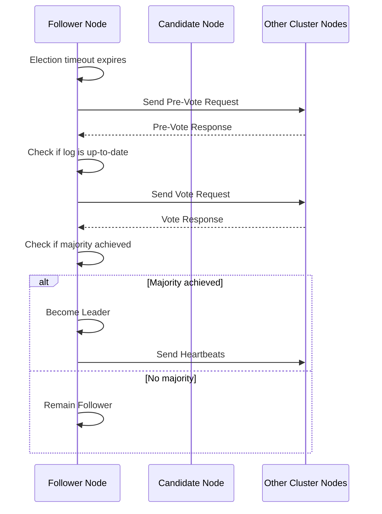
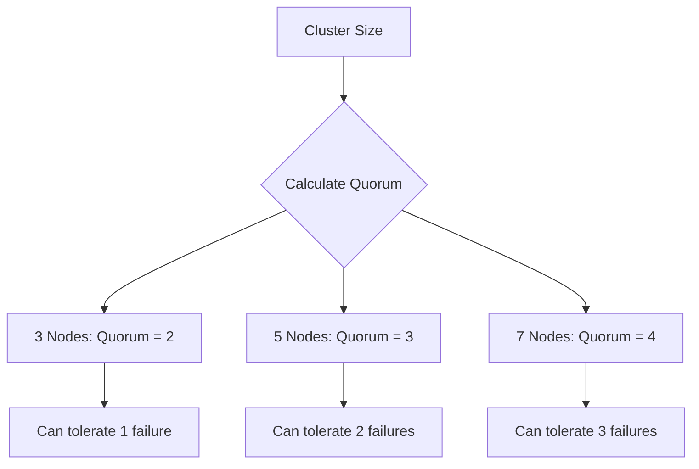
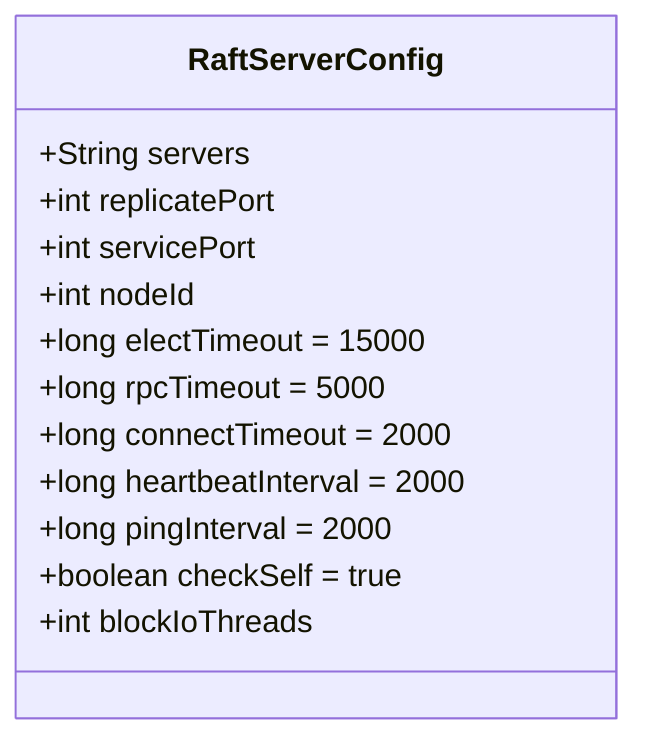
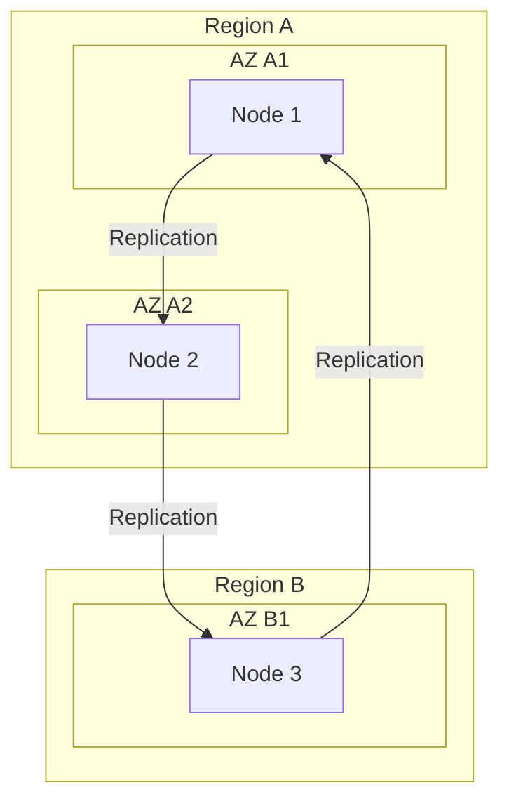
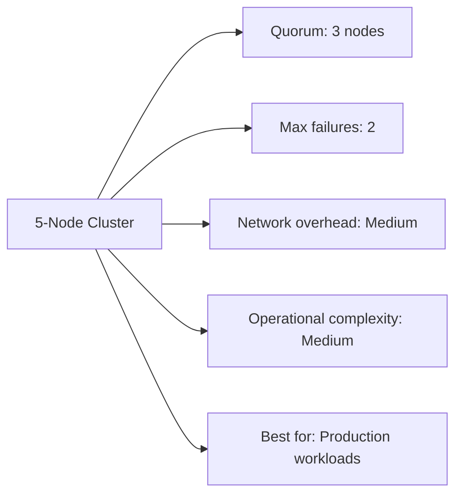
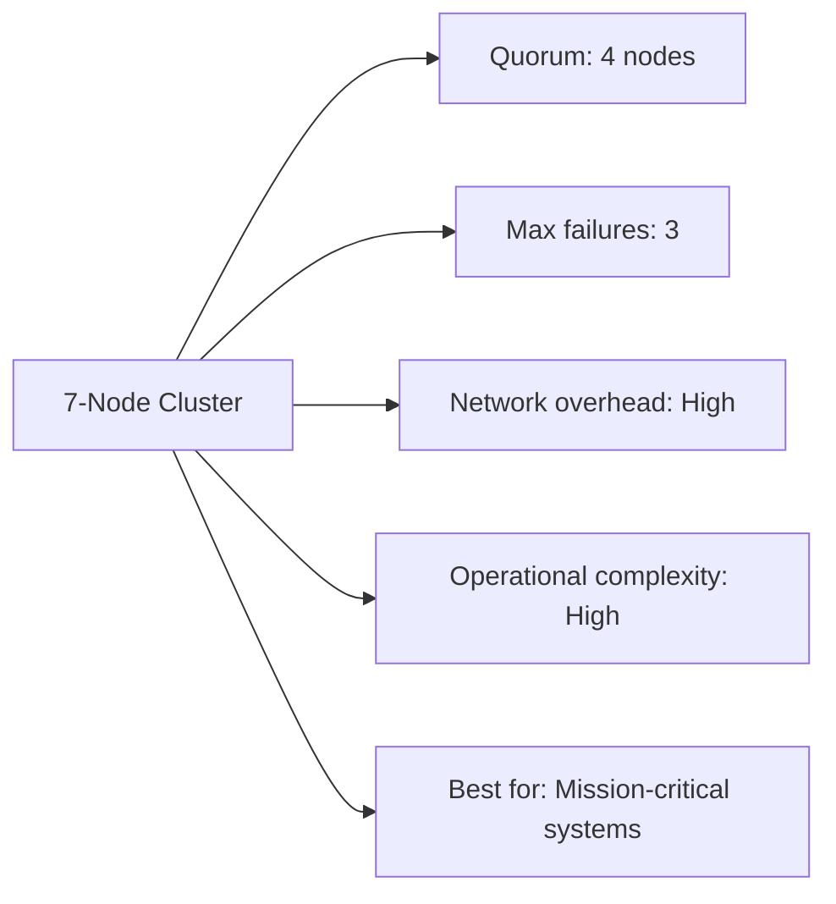
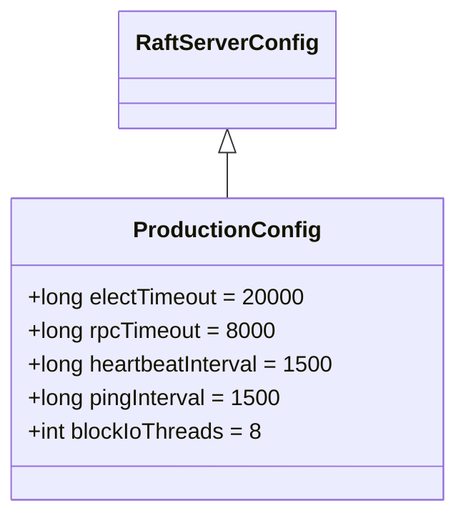

# High Availability Topologies

<cite>
**Referenced Files in This Document**   
- [RaftServerConfig.java](file://server/src/main/java/com/github/dtprj/dongting/raft/server/RaftServerConfig.java)
- [RaftGroupConfig.java](file://server/src/main/java/com/github/dtprj/dongting/raft/server/RaftGroupConfig.java)
- [RaftGroupConfigEx.java](file://server/src/main/java/com/github/dtprj/dongting/raft/server/RaftGroupConfigEx.java)
- [VoteManager.java](file://server/src/main/java/com/github/dtprj/dongting/raft/impl/VoteManager.java)
- [NodeManager.java](file://server/src/main/java/com/github/dtprj/dongting/raft/impl/NodeManager.java)
- [MemberManager.java](file://server/src/main/java/com/github/dtprj/dongting/raft/impl/MemberManager.java)
- [RaftUtil.java](file://server/src/main/java/com/github/dtprj/dongting/raft/impl/RaftUtil.java)
- [DemoServer1.java](file://demos/src/main/java/com/github/dtprj/dongting/demos/cluster/DemoServer1.java)
- [DemoServer2.java](file://demos/src/main/java/com/github/dtprj/dongting/demos/cluster/DemoServer2.java)
- [DemoServer3.java](file://demos/src/main/java/com/github/dtprj/dongting/demos/cluster/DemoServer3.java)
</cite>

## Table of Contents
1. [Introduction](#introduction)
2. [Cluster Configuration Principles](#cluster-configuration-principles)
3. [Raft Consensus Algorithm](#raft-consensus-algorithm)
4. [Configuration Parameters](#configuration-parameters)
5. [Node Placement Strategies](#node-placement-strategies)
6. [Cluster Size Trade-offs](#cluster-size-trade-offs)
7. [Configuration Examples](#configuration-examples)
8. [Conclusion](#conclusion)

## Introduction
This document provides comprehensive guidance on implementing high availability topologies using the Dongting Raft consensus algorithm. The focus is on ensuring maximum uptime and fault tolerance in production environments through proper cluster configuration, quorum management, and network resilience. The document covers recommended practices for cluster sizing, configuration parameters, node placement, and failure handling to prevent split-brain scenarios and maintain data consistency.

## Cluster Configuration Principles

The Dongting Raft implementation follows the principle of using odd-numbered nodes (3, 5, 7) to prevent split-brain scenarios and maintain quorum during network partitions. This approach ensures that a clear majority can always be established for leader election and decision-making processes.

The system uses a quorum-based approach where a majority of nodes must agree on state changes. For a cluster of N nodes, the quorum size is calculated as (N/2) + 1. This means that a 3-node cluster requires 2 nodes to form a quorum, a 5-node cluster requires 3 nodes, and a 7-node cluster requires 4 nodes.

The configuration supports both member nodes (which participate in voting and consensus) and observer nodes (which replicate data but don't vote). This allows for flexible deployment patterns where read scalability can be achieved without compromising the quorum requirements.

**Section sources**
- [RaftServerConfig.java](file://server/src/main/java/com/github/dtprj/dongting/raft/server/RaftServerConfig.java#L22-L39)
- [RaftGroupConfig.java](file://server/src/main/java/com/github/dtprj/dongting/raft/server/RaftGroupConfig.java#L25-L76)
- [RaftUtil.java](file://server/src/main/java/com/github/dtprj/dongting/raft/impl/RaftUtil.java#L72-L82)

## Raft Consensus Algorithm

The Dongting implementation of the Raft consensus algorithm ensures data consistency across nodes through a leader-based approach with strict quorum requirements. The algorithm handles leader election, log replication, and safety properties to maintain consistency even during network partitions and node failures.

### Leader Election Process
The leader election process uses a two-phase approach with pre-vote and vote phases to prevent unnecessary leader changes:

1. **Pre-vote phase**: Before starting a formal election, candidates verify they have up-to-date logs by polling other nodes
2. **Vote phase**: Nodes with up-to-date logs can become candidates and request votes from the cluster

The election process is triggered when a follower doesn't receive heartbeats from the leader within the election timeout period. The system uses randomized election timeouts to minimize the chance of split votes.



**Diagram sources**
- [VoteManager.java](file://server/src/main/java/com/github/dtprj/dongting/raft/impl/VoteManager.java#L81-L492)
- [RaftUtil.java](file://server/src/main/java/com/github/dtprj/dongting/raft/impl/RaftUtil.java#L254-L292)

### Quorum and Fault Tolerance
The system calculates quorum requirements based on the number of voting members in the cluster:



The quorum calculation ensures that the system can tolerate up to (N-1)/2 node failures while maintaining availability. This provides a clear trade-off between fault tolerance and resource requirements.

**Diagram sources**
- [RaftUtil.java](file://server/src/main/java/com/github/dtprj/dongting/raft/impl/RaftUtil.java#L72-L82)
- [RaftGroupConfig.java](file://server/src/main/java/com/github/dtprj/dongting/raft/server/RaftGroupConfig.java#L30-L38)

## Configuration Parameters

The Dongting Raft implementation provides several key configuration parameters that should be tuned based on the specific network environment and performance requirements.

### Server Configuration Parameters
The `RaftServerConfig` class defines the core server-level parameters:



**Diagram sources**
- [RaftServerConfig.java](file://server/src/main/java/com/github/dtprj/dongting/raft/server/RaftServerConfig.java#L21-L39)

### Key Configuration Parameters

#### Election Timeout (electTimeout)
- **Default value**: 15,000 milliseconds (15 seconds)
- **Purpose**: Time after which a follower will initiate a leader election if no heartbeat is received
- **Recommendation**: Set to 3-5 times the heartbeat interval to allow for network jitter
- **Trade-off**: Shorter timeouts enable faster failover but increase the risk of unnecessary elections

#### Heartbeat Interval (heartbeatInterval)
- **Default value**: 2,000 milliseconds (2 seconds)
- **Purpose**: Frequency at which the leader sends heartbeats to maintain leadership
- **Recommendation**: Should be significantly shorter than the election timeout
- **Trade-off**: More frequent heartbeats provide faster failure detection but increase network overhead

#### RPC Timeout (rpcTimeout)
- **Default value**: 5,000 milliseconds (5 seconds)
- **Purpose**: Maximum time to wait for RPC responses during consensus operations
- **Recommendation**: Should account for network latency and processing time
- **Trade-off**: Longer timeouts reduce false negatives but delay failure detection

#### Ping Interval (pingInterval)
- **Default value**: 2,000 milliseconds (2 seconds)
- **Purpose**: Frequency of node health checks between cluster members
- **Recommendation**: Should be similar to or slightly longer than the heartbeat interval
- **Trade-off**: More frequent pings provide better health monitoring but increase network traffic

**Section sources**
- [RaftServerConfig.java](file://server/src/main/java/com/github/dtprj/dongting/raft/server/RaftServerConfig.java#L28-L38)

## Node Placement Strategies

Proper node placement is critical for maximizing fault tolerance and minimizing correlated failures. The following strategies are recommended for production deployments.

### Multi-Availability Zone Deployment
For maximum resilience, nodes should be distributed across multiple availability zones or data centers:



This configuration ensures that the cluster can survive the failure of an entire availability zone while maintaining quorum.

**Diagram sources**
- [NodeManager.java](file://server/src/main/java/com/github/dtprj/dongting/raft/impl/NodeManager.java#L77-L453)
- [MemberManager.java](file://server/src/main/java/com/github/dtprj/dongting/raft/impl/MemberManager.java#L79-L800)

### Network Latency Considerations
When placing nodes across different geographical locations, network latency must be considered:

1. **Intra-region**: Nodes within the same region typically have latency < 5ms
2. **Inter-region**: Nodes across regions may have latency > 50ms
3. **Cross-continent**: Nodes across continents may have latency > 100ms

The configuration parameters should be adjusted based on the expected network characteristics:

- **High-latency networks**: Increase rpcTimeout and electTimeout values
- **Unstable networks**: Consider increasing heartbeatInterval to reduce false positives
- **High-throughput requirements**: Optimize blockIoThreads for the available CPU resources

**Section sources**
- [RaftServerConfig.java](file://server/src/main/java/com/github/dtprj/dongting/raft/server/RaftServerConfig.java#L28-L38)
- [NodeManager.java](file://server/src/main/java/com/github/dtprj/dongting/raft/impl/NodeManager.java#L75-L76)

## Cluster Size Trade-offs

Different cluster sizes offer varying trade-offs between fault tolerance, performance, and operational complexity.

### 3-Node Cluster


**Advantages:**
- Minimal resource requirements
- Fast consensus decisions
- Simple to manage and operate

**Disadvantages:**
- Limited fault tolerance (only one node can fail)
- No room for rolling upgrades without reduced fault tolerance

**Section sources**
- [RaftUtil.java](file://server/src/main/java/com/github/dtprj/dongting/raft/impl/RaftUtil.java#L72-L82)
- [DemoServer1.java](file://demos/src/main/java/com/github/dtprj/dongting/demos/cluster/DemoServer1.java#L26-L32)

### 5-Node Cluster


**Advantages:**
- Higher fault tolerance (two nodes can fail)
- Supports rolling upgrades without reducing fault tolerance
- Better distribution across availability zones

**Disadvantages:**
- Higher resource requirements
- Slightly slower consensus due to more nodes

**Section sources**
- [RaftGroupConfig.java](file://server/src/main/java/com/github/dtprj/dongting/raft/server/RaftGroupConfig.java#L26-L27)
- [MemberManager.java](file://server/src/main/java/com/github/dtprj/dongting/raft/impl/MemberManager.java#L93-L95)

### 7-Node Cluster


**Advantages:**
- Maximum fault tolerance (three nodes can fail)
- Can tolerate multiple availability zone failures
- Ideal for geographically distributed deployments

**Disadvantages:**
- Highest resource requirements
- Slowest consensus due to more coordination
- Most complex to manage and troubleshoot

**Section sources**
- [RaftUtil.java](file://server/src/main/java/com/github/dtprj/dongting/raft/impl/RaftUtil.java#L72-L82)
- [RaftGroupConfig.java](file://server/src/main/java/com/github/dtprj/dongting/raft/server/RaftGroupConfig.java#L26-L27)

## Configuration Examples

### Basic 3-Node Cluster Configuration
The following example demonstrates a basic 3-node cluster configuration as shown in the demo applications:

```java
int nodeId = 1;
String servers = "1,127.0.0.1:4001;2,127.0.0.1:4002;3,127.0.0.1:4003";
String members = "1,2,3";
String observers = "";
startServer(nodeId, servers, members, observers, new int[]{GROUP_ID});
```

This configuration creates a 3-node cluster with all nodes as voting members, providing protection against single-node failures.

**Section sources**
- [DemoServer1.java](file://demos/src/main/java/com/github/dtprj/dongting/demos/cluster/DemoServer1.java#L26-L31)
- [DemoServer2.java](file://demos/src/main/java/com/github/dtprj/dongting/demos/cluster/DemoServer2.java#L26-L31)
- [DemoServer3.java](file://demos/src/main/java/com/github/dtprj/dongting/demos/cluster/DemoServer3.java#L26-L31)

### Production-Ready 5-Node Configuration
For production environments, a 5-node configuration with optimized parameters is recommended:



This configuration provides:
- Longer timeouts for more stable networks
- More frequent heartbeats for faster failure detection
- Increased I/O threads for better performance
- Five nodes for higher fault tolerance

**Section sources**
- [RaftServerConfig.java](file://server/src/main/java/com/github/dtprj/dongting/raft/server/RaftServerConfig.java#L28-L38)
- [RaftGroupConfig.java](file://server/src/main/java/com/github/dtprj/dongting/raft/server/RaftGroupConfig.java#L30-L38)

## Conclusion
The Dongting Raft implementation provides a robust foundation for building highly available systems. By following the principles outlined in this document—using odd-numbered clusters, properly configuring timeout parameters, and strategically placing nodes across failure domains—organizations can achieve maximum uptime and fault tolerance in production environments.

The key recommendations are:
1. Use 3, 5, or 7 node clusters to prevent split-brain scenarios
2. Tune election timeout, heartbeat interval, and RPC timeout based on network characteristics
3. Distribute nodes across multiple availability zones to minimize correlated failures
4. Choose cluster size based on the required level of fault tolerance and operational complexity

By implementing these best practices, systems can maintain quorum during network partitions, ensure data consistency through the Raft consensus algorithm, and provide reliable service even in the face of node failures.