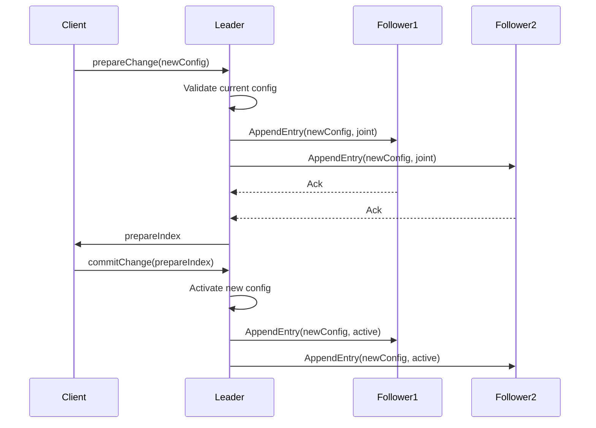
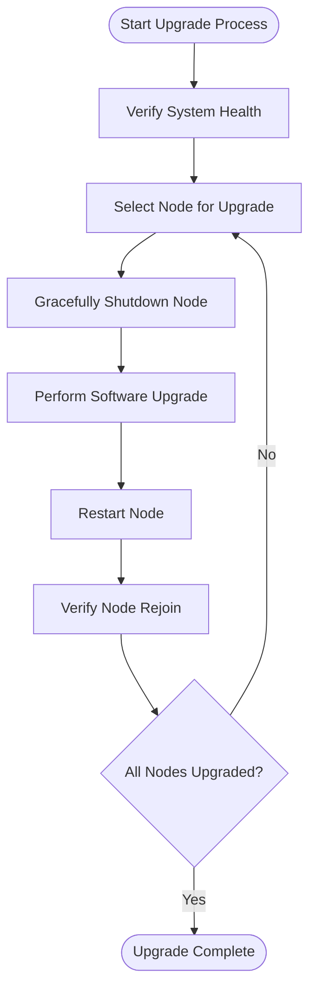
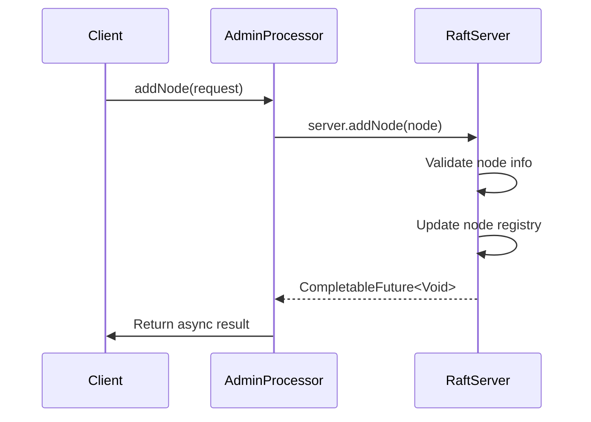
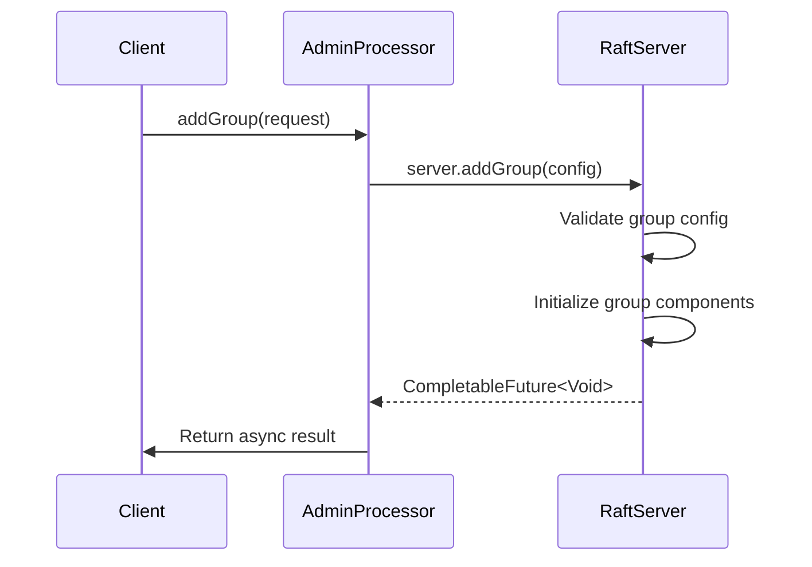
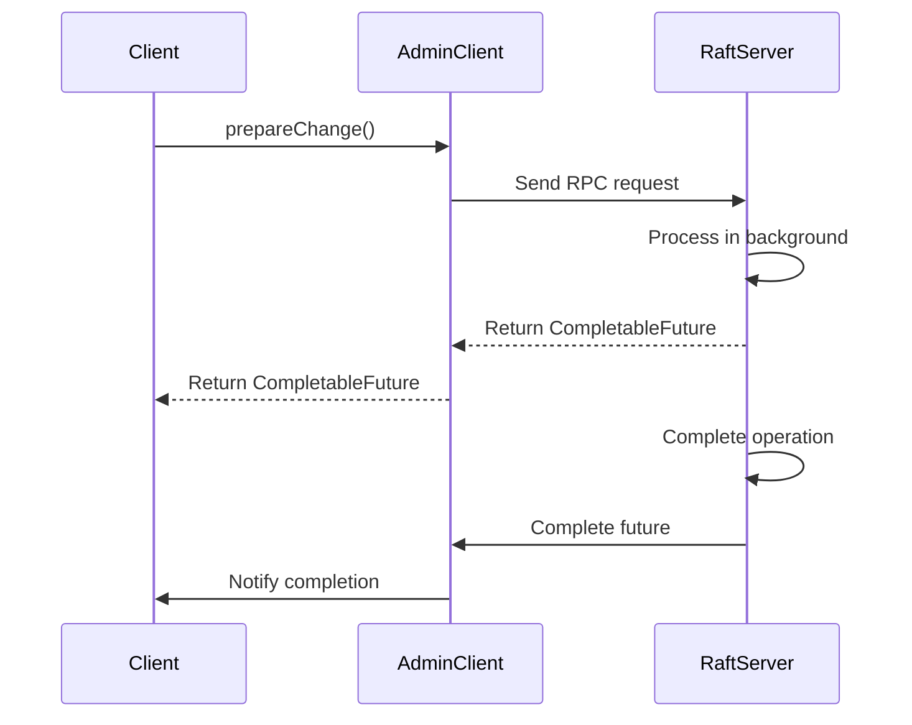

# Maintenance Operations

<cite>
**Referenced Files in This Document**   
- [AdminConfigChangeProcessor.java](file://server/src/main/java/com/github/dtprj/dongting/raft/rpc/AdminConfigChangeProcessor.java)
- [AdminGroupAndNodeProcessor.java](file://server/src/main/java/com/github/dtprj/dongting/raft/rpc/AdminGroupAndNodeProcessor.java)
- [AdminRaftClient.java](file://server/src/main/java/com/github/dtprj/dongting/raft/admin/AdminRaftClient.java)
- [RaftServer.java](file://server/src/main/java/com/github/dtprj/dongting/raft/server/RaftServer.java)
- [RaftGroup.java](file://server/src/main/java/com/github/dtprj/dongting/raft/server/RaftGroup.java)
- [AdminAddGroupReq.java](file://server/src/main/java/com/github/dtprj/dongting/raft/rpc/AdminAddGroupReq.java)
- [AdminAddNodeReq.java](file://server/src/main/java/com/github/dtprj/dongting/raft/rpc/AdminAddNodeReq.java)
- [AdminPrepareConfigChangeReq.java](file://server/src/main/java/com/github/dtprj/dongting/raft/rpc/AdminPrepareConfigChangeReq.java)
- [AdminCommitOrAbortReq.java](file://server/src/main/java/com/github/dtprj/dongting/raft/rpc/AdminCommitOrAbortReq.java)
</cite>

## Table of Contents
1. [Introduction](#introduction)
2. [Dynamic Membership Management](#dynamic-membership-management)
3. [Rolling Upgrades and Quorum Maintenance](#rolling-upgrades-and-quorum-maintenance)
4. [Administrative APIs](#administrative-apis)
5. [Runtime Configuration and Resource Adjustment](#runtime-configuration-and-resource-adjustment)
6. [Best Practices for Maintenance Operations](#best-practices-for-maintenance-operations)
7. [Asynchronous Operations with CompletableFuture](#asynchronous-operations-with-completablefuture)

## Introduction
This document provides comprehensive guidance on performing maintenance operations in the Dongting distributed system without service disruption. It covers dynamic membership changes, rolling upgrades, administrative APIs, and runtime configuration adjustments. The system leverages Raft consensus algorithm to ensure data consistency and high availability during maintenance operations. All administrative operations are designed to be non-blocking and idempotent, allowing safe execution in production environments.

## Dynamic Membership Management
The system supports dynamic membership changes through the AdminConfigChangeProcessor, which handles joint consensus configuration changes. This allows for safe addition and removal of nodes from the cluster while maintaining system availability and data consistency.

The membership change process follows the Raft joint consensus protocol, which ensures that the cluster maintains quorum throughout the reconfiguration process. The process involves three stages: preparation, transition, and commitment. During the preparation phase, the new configuration is proposed but not yet active. In the transition phase, both old and new configurations are used for quorum decisions. Finally, in the commitment phase, the new configuration becomes fully active.

**Diagram sources**
- [AdminConfigChangeProcessor.java](file://server/src/main/java/com/github/dtprj/dongting/raft/rpc/AdminConfigChangeProcessor.java#L69-L101)
- [RaftGroup.java](file://server/src/main/java/com/github/dtprj/dongting/raft/server/RaftGroup.java#L90-L101)

**Section sources**
- [AdminConfigChangeProcessor.java](file://server/src/main/java/com/github/dtprj/dongting/raft/rpc/AdminConfigChangeProcessor.java#L37-L104)
- [RaftGroup.java](file://server/src/main/java/com/github/dtprj/dongting/raft/server/RaftGroup.java#L90-L101)

## Rolling Upgrades and Quorum Maintenance
Rolling upgrades can be performed by sequentially updating nodes while maintaining quorum. The system ensures that at least a majority of nodes remain operational during the upgrade process, preserving the ability to make progress and maintain data consistency.

The upgrade process should follow these steps:
1. Verify system health and ensure all nodes are in a stable state
2. Select a node for upgrade that is not currently the leader (if possible)
3. Gracefully shut down the node and perform the upgrade
4. Restart the node with the new version
5. Verify the node rejoins the cluster successfully
6. Repeat for remaining nodes

During the upgrade process, the Raft consensus algorithm automatically handles leader election and log replication, ensuring that client requests continue to be processed by the remaining nodes. The system's fault tolerance allows for the temporary unavailability of minority nodes without affecting overall cluster operation.

**Diagram sources**
- [RaftServer.java](file://server/src/main/java/com/github/dtprj/dongting/raft/server/RaftServer.java#L84-L200)
- [RaftGroup.java](file://server/src/main/java/com/github/dtprj/dongting/raft/server/RaftGroup.java#L31-L105)

## Administrative APIs
The system provides several administrative APIs for cluster management, all of which are designed to be idempotent and safe for production use.

### addNode() and removeNode()
The addNode() and removeNode() APIs allow for dynamic addition and removal of nodes from the cluster. These operations are handled by the AdminGroupAndNodeProcessor and are executed asynchronously.

**Diagram sources**
- [AdminGroupAndNodeProcessor.java](file://server/src/main/java/com/github/dtprj/dongting/raft/rpc/AdminGroupAndNodeProcessor.java#L128-L136)
- [RaftServer.java](file://server/src/main/java/com/github/dtprj/dongting/raft/server/RaftServer.java#L250-L270)

### addGroup() and removeGroup()
The addGroup() and removeGroup() APIs manage raft groups within the cluster. These operations are also asynchronous and idempotent, allowing safe repeated calls.

**Diagram sources**
- [AdminGroupAndNodeProcessor.java](file://server/src/main/java/com/github/dtprj/dongting/raft/rpc/AdminGroupAndNodeProcessor.java#L117-L125)
- [RaftServer.java](file://server/src/main/java/com/github/dtprj/dongting/raft/server/RaftServer.java#L230-L250)

## Runtime Configuration and Resource Adjustment
The system supports runtime reconfiguration of server settings and resource allocations. This allows administrators to adjust system parameters without requiring restarts or service interruption.

Configuration changes are applied dynamically through the AdminConfigChangeProcessor, which handles the joint consensus protocol for configuration changes. Resource allocations such as memory pools and thread counts can be adjusted at runtime through the RaftServer's configuration management system.

The configuration change process ensures that all nodes in the cluster agree on the new configuration before it becomes active, maintaining consistency across the distributed system. Changes are propagated through the Raft log, ensuring that they are applied in the same order on all nodes.

**Section sources**
- [AdminConfigChangeProcessor.java](file://server/src/main/java/com/github/dtprj/dongting/raft/rpc/AdminConfigChangeProcessor.java#L37-L104)
- [RaftServer.java](file://server/src/main/java/com/github/dtprj/dongting/raft/server/RaftServer.java#L84-L200)

## Best Practices for Maintenance Operations
To ensure successful maintenance operations, follow these best practices:

1. **Perform maintenance during low-traffic periods**: Schedule maintenance operations during periods of low system activity to minimize impact on performance and latency.

2. **Verify system stability after changes**: After each maintenance operation, verify system stability by checking:
   - Cluster health and node status
   - Log replication status
   - Client request success rates
   - System performance metrics

3. **Use idempotent operations**: Leverage the idempotent nature of administrative APIs to safely retry operations if needed.

4. **Monitor quorum status**: Ensure that the cluster maintains quorum throughout maintenance operations by monitoring the number of active nodes.

5. **Validate configuration changes**: Before applying configuration changes, validate that the new configuration is compatible with the current system state.

6. **Implement proper error handling**: Handle potential errors such as network partitions, node failures, and configuration conflicts gracefully.

**Section sources**
- [AdminRaftClient.java](file://server/src/main/java/com/github/dtprj/dongting/raft/admin/AdminRaftClient.java#L53-L235)
- [RaftServer.java](file://server/src/main/java/com/github/dtprj/dongting/raft/server/RaftServer.java#L84-L200)

## Asynchronous Operations with CompletableFuture
All maintenance operations use CompletableFuture-based asynchronous operations to ensure non-blocking execution. This allows administrative tasks to be performed without disrupting normal system operations.

The CompletableFuture pattern provides several benefits:
- Non-blocking execution that doesn't interfere with client request processing
- Flexible composition of asynchronous operations
- Proper error handling and propagation
- Integration with the system's fiber-based concurrency model

Administrative operations return CompletableFuture instances that can be used to monitor operation progress, handle completion, or chain additional operations. This enables efficient management of maintenance tasks while maintaining system responsiveness.

**Diagram sources**
- [AdminRaftClient.java](file://server/src/main/java/com/github/dtprj/dongting/raft/admin/AdminRaftClient.java#L109-L140)
- [AdminConfigChangeProcessor.java](file://server/src/main/java/com/github/dtprj/dongting/raft/rpc/AdminConfigChangeProcessor.java#L69-L101)

**Section sources**
- [AdminRaftClient.java](file://server/src/main/java/com/github/dtprj/dongting/raft/admin/AdminRaftClient.java#L49-L235)
- [RaftServer.java](file://server/src/main/java/com/github/dtprj/dongting/raft/server/RaftServer.java#L76-L78)