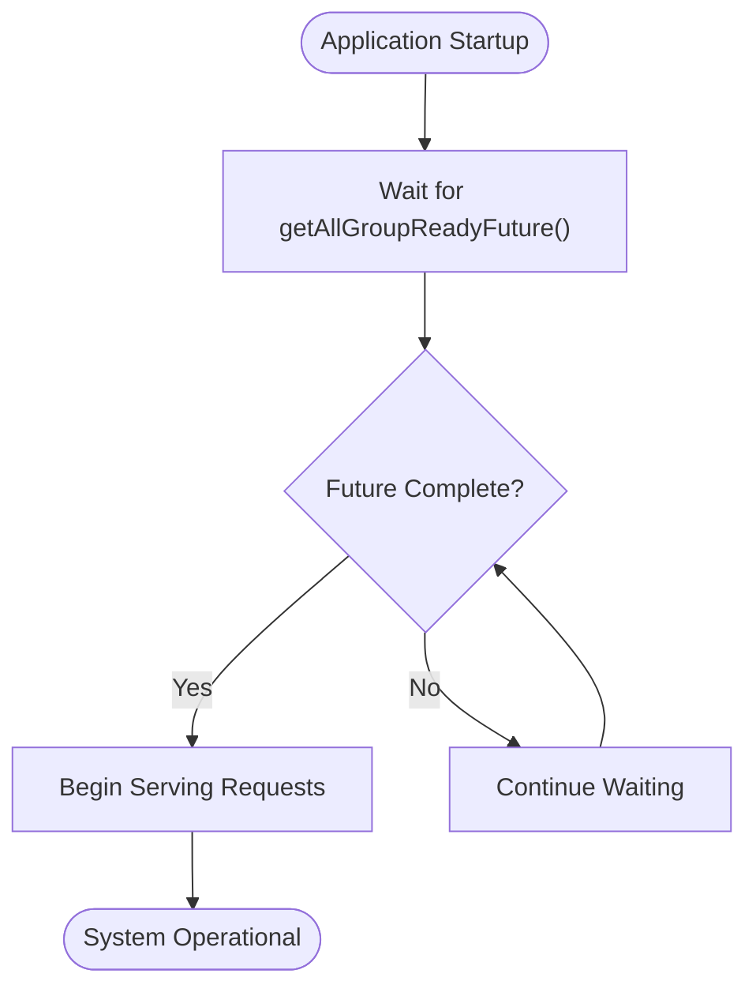
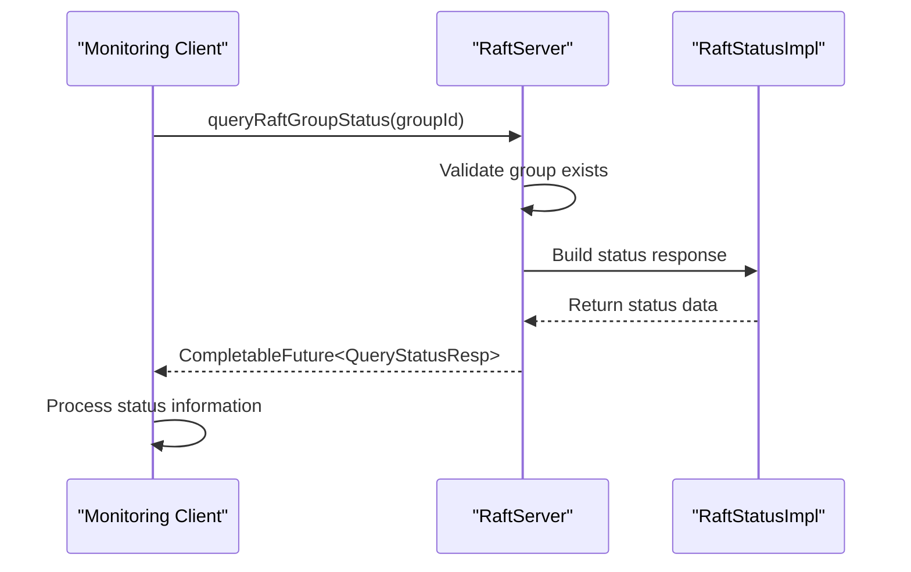
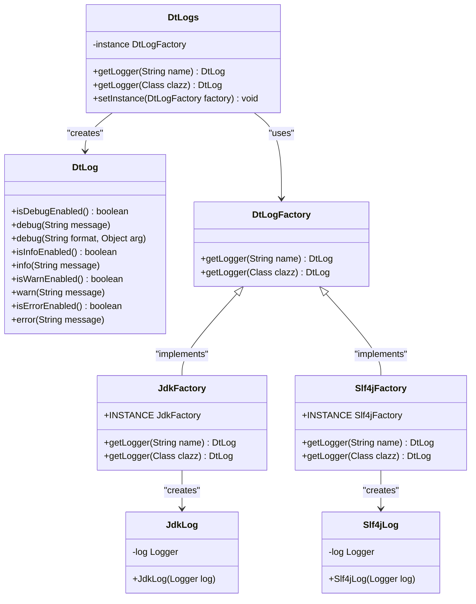

# Monitoring, Logging, and Alerting

<cite>
**Referenced Files in This Document**   
- [RaftStatusImpl.java](file://server/src/main/java/com/github/dtprj/dongting/raft/impl/RaftStatusImpl.java)
- [QueryStatusProcessor.java](file://server/src/main/java/com/github/dtprj/dongting/raft/rpc/QueryStatusProcessor.java)
- [QueryStatusResp.java](file://client/src/main/java/com/github/dtprj/dongting/raft/QueryStatusResp.java)
- [RaftServer.java](file://server/src/main/java/com/github/dtprj/dongting/raft/server/RaftServer.java)
- [RaftClient.java](file://client/src/main/java/com/github/dtprj/dongting/raft/RaftClient.java)
- [DtLogs.java](file://client/src/main/java/com/github/dtprj/dongting/log/DtLogs.java)
- [JdkLog.java](file://client/src/main/java/com/github/dtprj/dongting/log/JdkLog.java)
- [Slf4jLog.java](file://client/src/main/java/com/github/dtprj/dongting/log/Slf4jLog.java)
- [ApplyManager.java](file://server/src/main/java/com/github/dtprj/dongting/raft/impl/ApplyManager.java)
- [ReplicateManager.java](file://server/src/main/java/com/github/dtprj/dongting/raft/impl/ReplicateManager.java)
- [VoteManager.java](file://server/src/main/java/com/github/dtprj/dongting/raft/impl/VoteManager.java)
- [CommitManager.java](file://server/src/main/java/com/github/dtprj/dongting/raft/impl/CommitManager.java)
- [logback.xml](file://benchmark/src/main/resources/logback.xml)
</cite>

## Table of Contents
1. [Introduction](#introduction)
2. [Key Metrics for Monitoring](#key-metrics-for-monitoring)
3. [Cluster Health Assessment](#cluster-health-assessment)
4. [Logging Framework and Configuration](#logging-framework-and-configuration)
5. [Critical Log Messages](#critical-log-messages)
6. [Alerting Thresholds](#alerting-thresholds)
7. [Conclusion](#conclusion)

## Introduction
This document provides comprehensive guidance on monitoring, logging, and alerting for the Dongting distributed system in production environments. The system implements the Raft consensus algorithm for maintaining data consistency across a cluster of nodes. Effective monitoring and logging are essential for ensuring high availability, detecting issues early, and maintaining system reliability. This guide covers key metrics to monitor, methods for programmatically assessing cluster health, the built-in logging framework, critical log messages to watch for, and recommended alerting thresholds for various system conditions.

**Section sources**
- [RaftStatusImpl.java](file://server/src/main/java/com/github/dtprj/dongting/raft/impl/RaftStatusImpl.java#L77-L256)

## Key Metrics for Monitoring

### Leader Status
Monitoring leader status is critical for understanding the current state of the Raft cluster. The leader is responsible for accepting client requests and replicating log entries to followers. The `RaftStatusImpl` class maintains the current leader information through the `currentLeader` field and provides methods to access this information. When a node becomes the leader, it transitions to the `RaftRole.leader` state, and its lease start time is recorded in `leaseStartNanos`. The leader maintains its position through a lease mechanism, and if it fails to renew its lease within the election timeout period, a new election will be triggered.

The leader status can be monitored by checking the `getRole()` method of the `RaftStatusImpl` class, which returns the current role of the node (leader, follower, candidate, or observer). Additionally, the `getCurrentLeader()` method provides access to the current leader node information, including its node ID and network address. Monitoring changes in leader status is essential for detecting potential issues with cluster stability.

### Commit Index Progression
The commit index represents the highest log index that has been safely replicated to a majority of nodes in the cluster. This metric is crucial for understanding the progress of the consensus algorithm and the durability of committed operations. The `RaftStatusImpl` class maintains the commit index in the `commitIndex` field, which is updated when a majority of nodes have acknowledged replication of a log entry.

Commit index progression should be monitored to ensure that the cluster is making forward progress. A stalled commit index may indicate network partitioning, node failures, or performance issues preventing successful replication. The `leaderTryCommit()` method in the `CommitManager` class is responsible for advancing the commit index when sufficient replication has occurred. Monitoring the rate of commit index progression can help identify performance bottlenecks in the system.

### Election Timeouts
Election timeouts are a fundamental mechanism in the Raft algorithm for detecting leader failures and initiating leader elections. Each node maintains an election timer that is reset whenever it receives a valid message from the current leader. If the timer expires without receiving a message, the node initiates a new election by transitioning to the candidate state.

The election timeout duration is configurable through the `electTimeoutNanos` field in `RaftStatusImpl`. The actual timeout value is randomized within a range to prevent split votes during elections. Monitoring election timeouts is essential for detecting network issues or leader unavailability. Frequent election timeouts may indicate network instability, high latency, or resource constraints preventing timely message processing.

### Network Latency Between Nodes
Network latency between nodes directly impacts the performance and stability of the Raft cluster. High latency can cause increased election timeouts, slower log replication, and reduced overall throughput. The system measures network latency through the round-trip time of RPC calls between nodes, particularly during the append entries and vote request processes.

Latency can be inferred from the timing of various operations, such as the time between sending an append request and receiving a response in the `ReplicateManager`. Monitoring network latency helps identify connectivity issues between specific nodes and can guide network optimization efforts. Persistent high latency between nodes may require investigation into network configuration, hardware issues, or routing problems.

**Section sources**
- [RaftStatusImpl.java](file://server/src/main/java/com/github/dtprj/dongting/raft/impl/RaftStatusImpl.java#L77-L256)
- [CommitManager.java](file://server/src/main/java/com/github/dtprj/dongting/raft/impl/CommitManager.java#L121-L138)
- [ReplicateManager.java](file://server/src/main/java/com/github/dtprj/dongting/raft/impl/ReplicateManager.java#L417-L451)
- [VoteManager.java](file://server/src/main/java/com/github/dtprj/dongting/raft/impl/VoteManager.java#L275-L306)

## Cluster Health Assessment

### Using getAllGroupReadyFuture()
The `getAllGroupReadyFuture()` method provides a convenient way to assess when all Raft groups in a server instance have reached a ready state. This method returns a `CompletableFuture<Void>` that completes when all groups have initialized and are ready to serve requests. The future completes successfully when all groups have achieved group readiness, which occurs when the node has applied all entries up to the `groupReadyIndex`.

This method is particularly useful during system startup or after a restart to determine when the server is fully operational. Applications can use this future to coordinate startup sequences, ensuring that dependent services are not activated until the Raft cluster is ready. The implementation in `RaftServer` creates a future that waits for all individual group readiness futures to complete, providing a comprehensive view of the server's readiness state.

**Diagram sources**
- [RaftServer.java](file://server/src/main/java/com/github/dtprj/dongting/raft/server/RaftServer.java#L471-L473)

**Section sources**
- [RaftServer.java](file://server/src/main/java/com/github/dtprj/dongting/raft/server/RaftServer.java#L412-L473)

### Using queryRaftGroupStatus()
The `queryRaftGroupStatus()` method allows for detailed, programmatic assessment of individual Raft group health. This method returns a `CompletableFuture<QueryStatusResp>` containing comprehensive status information about a specific Raft group. The `QueryStatusResp` object includes critical metrics such as the current leader ID, commit index, last applied index, and member configuration.

To use this method effectively, applications should periodically query the status of critical Raft groups and analyze the returned information. Key indicators of cluster health include:
- Leader stability (consistent leader ID over time)
- Commit index progression (steady increase)
- Low apply lag (difference between commit index and last applied)
- Consistent member configuration

The method is implemented in `RaftServer` and processes the request within the appropriate fiber group to ensure thread safety. It delegates to `QueryStatusProcessor.buildQueryStatusResp()` to construct the response from the current `RaftStatusImpl` state.

**Diagram sources**
- [RaftServer.java](file://server/src/main/java/com/github/dtprj/dongting/raft/server/RaftServer.java#L696-L715)
- [QueryStatusProcessor.java](file://server/src/main/java/com/github/dtprj/dongting/raft/rpc/QueryStatusProcessor.java#L59-L77)
- [QueryStatusResp.java](file://client/src/main/java/com/github/dtprj/dongting/raft/QueryStatusResp.java#L47-L152)

**Section sources**
- [RaftServer.java](file://server/src/main/java/com/github/dtprj/dongting/raft/server/RaftServer.java#L696-L715)
- [QueryStatusProcessor.java](file://server/src/main/java/com/github/dtprj/dongting/raft/rpc/QueryStatusProcessor.java#L59-L77)

## Logging Framework and Configuration

### DtLogs Framework Overview
The Dongting system includes a built-in logging framework called DtLogs that provides abstraction over different logging implementations. The framework is designed to be lightweight and efficient while supporting both JDK logging and SLF4J as backend implementations. The primary interface is `DtLog`, which defines standard logging methods for different log levels (debug, info, warn, error).

The `DtLogs` class serves as the entry point for obtaining logger instances. It automatically detects the presence of SLF4J on the classpath and uses it as the default logging backend. If SLF4J is not available, it falls back to JDK logging. This design allows applications to use their preferred logging framework without requiring changes to the Dongting codebase.

The framework supports dynamic logger creation through the `getLogger()` methods, which accept either a class or a string name. This flexibility enables fine-grained control over logging configuration and output.

**Diagram sources**
- [DtLogs.java](file://client/src/main/java/com/github/dtprj/dongting/log/DtLogs.java#L21-L43)
- [DtLog.java](file://client/src/main/java/com/github/dtprj/dongting/log/DtLog.java#L21-L49)
- [JdkFactory.java](file://client/src/main/java/com/github/dtprj/dongting/log/JdkFactory.java#L24-L40)
- [Slf4jFactory.java](file://client/src/main/java/com/github/dtprj/dongting/log/Slf4jFactory.java#L24-L51)

**Section sources**
- [DtLogs.java](file://client/src/main/java/com/github/dtprj/dongting/log/DtLogs.java#L21-L43)
- [DtLog.java](file://client/src/main/java/com/github/dtprj/dongting/log/DtLog.java#L21-L49)
- [JdkFactory.java](file://client/src/main/java/com/github/dtprj/dongting/log/JdkFactory.java#L24-L40)
- [Slf4jFactory.java](file://client/src/main/java/com/github/dtprj/dongting/log/Slf4jFactory.java#L24-L51)

### Configuration Options
The logging framework can be configured through standard logging configuration files such as logback.xml when using SLF4J, or through JDK logging configuration when using the default backend. The system includes example configuration files in the benchmark and demo modules that demonstrate typical logging setups.

Key configuration options include:
- Log level thresholds for different packages
- Output appenders (console, file, etc.)
- Log message formatting
- Performance considerations for high-volume logging

The example logback.xml files show configurations with console appenders and specific log levels for different components. For production environments, it is recommended to configure file appenders with appropriate rotation policies and to adjust log levels based on the operational context.

**Section sources**
- [logback.xml](file://benchmark/src/main/resources/logback.xml#L1-L15)
- [logback.xml](file://demos/src/main/resources/logback.xml#L1-L15)

## Critical Log Messages

### Election Failures
Election failures are critical events that indicate potential issues with cluster stability. The system logs detailed information about election attempts and outcomes through the `VoteManager` class. Key log messages to monitor include:

- "elect timer timeout" - Indicates that a node's election timer expired, triggering a new election
- "start pre vote" - Logs the initiation of a pre-vote phase in the election process
- "successfully elected, change to leader" - Confirms successful leader election
- "vote fail" - Indicates failure to obtain sufficient votes during an election

Monitoring the frequency and context of these messages helps identify underlying issues such as network instability, clock skew, or resource constraints affecting election stability.

**Section sources**
- [VoteManager.java](file://server/src/main/java/com/github/dtprj/dongting/raft/impl/VoteManager.java#L153-L157)
- [VoteManager.java](file://server/src/main/java/com/github/dtprj/dongting/raft/impl/VoteManager.java#L275-L306)

### Log Replication Issues
Log replication is fundamental to the Raft consensus algorithm, and issues in this area can severely impact system availability. The `ReplicateManager` class logs important information about replication attempts and failures. Critical log messages include:

- "append fail" - Indicates failure to replicate log entries to a follower
- "log not match" - Occurs when a follower's log diverges from the leader's log
- "begin install snapshot" - Triggered when log divergence requires snapshot installation
- "install snapshot for member finished success" - Confirms successful snapshot installation

These messages provide insights into replication health and can help diagnose network issues, storage problems, or configuration mismatches between nodes.

**Section sources**
- [ReplicateManager.java](file://server/src/main/java/com/github/dtprj/dongting/raft/impl/ReplicateManager.java#L441-L448)
- [ReplicateManager.java](file://server/src/main/java/com/github/dtprj/dongting/raft/impl/ReplicateManager.java#L515-L522)
- [ReplicateManager.java](file://server/src/main/java/com/github/dtprj/dongting/raft/impl/ReplicateManager.java#L751-L753)
- [ReplicateManager.java](file://server/src/main/java/com/github/dtprj/dongting/raft/impl/ReplicateManager.java#L781-L783)

### Snapshot Operations
Snapshot operations are critical for managing log growth and enabling new nodes to catch up with the cluster state. The `ApplyManager` and `ReplicateManager` classes log important information about snapshot creation and installation. Key log messages include:

- "apply manager init complete" - Indicates successful initialization after snapshot application
- "mark group ready" - Signals that a node has completed initialization and is ready to participate in the cluster
- "takeSnapshot fail" - Indicates failure to create a snapshot
- "install snapshot error" - Logs errors during snapshot installation

Monitoring these messages helps ensure that snapshot operations are functioning correctly and that new nodes can join the cluster efficiently.

**Section sources**
- [ApplyManager.java](file://server/src/main/java/com/github/dtprj/dongting/raft/impl/ApplyManager.java#L288-L290)
- [ApplyManager.java](file://server/src/main/java/com/github/dtprj/dongting/raft/impl/ApplyManager.java#L298-L300)
- [ReplicateManager.java](file://server/src/main/java/com/github/dtprj/dongting/raft/impl/ReplicateManager.java#L658-L661)
- [ReplicateManager.java](file://server/src/main/java/com/github/dtprj/dongting/raft/impl/ReplicateManager.java#L635-L637)

## Alerting Thresholds

### Increased Election Frequency
Frequent leader elections can destabilize the cluster and impact availability. An alert should be triggered if the number of leader changes exceeds a threshold within a specified time window. Recommended thresholds:

- Warning: More than 3 leader changes in 10 minutes
- Critical: More than 5 leader changes in 5 minutes

These thresholds indicate potential issues with network stability, resource contention, or configuration problems. When such alerts occur, operators should investigate network connectivity, system resource utilization, and clock synchronization between nodes.

### Leader Changes
While occasional leader changes are normal during maintenance or node failures, frequent changes indicate instability. Alerting thresholds should consider both the frequency and pattern of leader changes:

- Warning: Leader changes more than twice within 15 minutes
- Critical: Same node becomes leader and loses leadership within 5 minutes (indicates flapping)

Monitoring the duration of leadership can also provide valuable insights. Short leadership periods may indicate resource constraints or network issues preventing the leader from maintaining its lease.

### Replication Lag
Replication lag measures the delay between when an operation is committed and when it is applied to the state machine. Excessive lag can impact consistency and performance. Recommended alerting thresholds:

- Warning: Apply lag exceeds 1 second for more than 1 minute
- Critical: Apply lag exceeds 5 seconds or commit index progression stalls for more than 30 seconds

These thresholds help detect performance bottlenecks in the application layer, storage subsystem, or network connectivity issues affecting replication.

**Section sources**
- [RaftStatusImpl.java](file://server/src/main/java/com/github/dtprj/dongting/raft/impl/RaftStatusImpl.java#L100-L102)
- [ApplyManager.java](file://server/src/main/java/com/github/dtprj/dongting/raft/impl/ApplyManager.java#L325-L337)
- [CommitManager.java](file://server/src/main/java/com/github/dtprj/dongting/raft/impl/CommitManager.java#L145-L152)

## Conclusion
Effective monitoring, logging, and alerting are essential for maintaining the reliability and performance of the Dongting distributed system in production environments. By tracking key metrics such as leader status, commit index progression, election timeouts, and network latency, operators can gain valuable insights into cluster health. The `getAllGroupReadyFuture()` and `queryRaftGroupStatus()` methods provide powerful tools for programmatically assessing cluster state and implementing automated health checks.

The built-in DtLogs framework offers flexible logging capabilities with support for both JDK logging and SLF4J, allowing integration with existing logging infrastructure. Monitoring critical log messages related to election failures, log replication issues, and snapshot operations enables early detection of potential problems. Implementing appropriate alerting thresholds for increased election frequency, leader changes, and replication lag helps prevent minor issues from escalating into major outages.

By following the guidance in this document, operations teams can ensure the Dongting system remains stable, performant, and resilient in production environments.