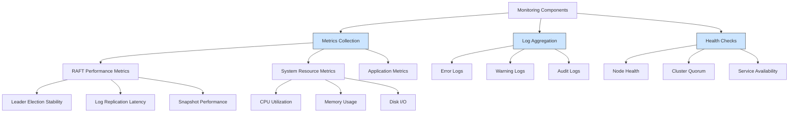
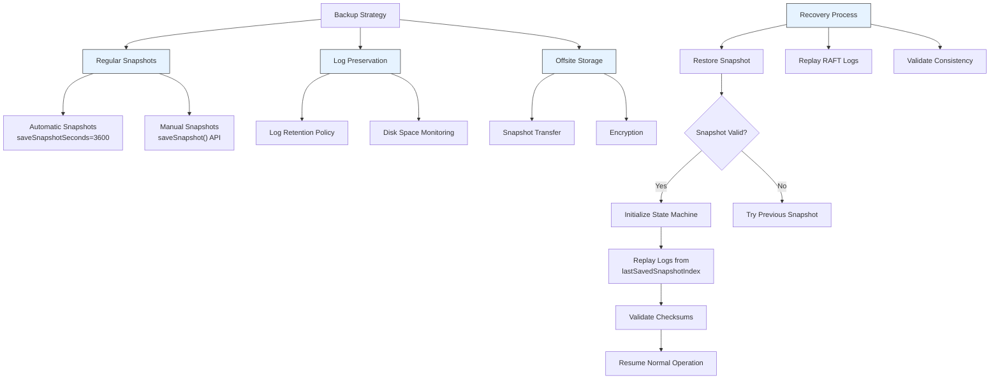

# Production Deployment Patterns

<cite>
**Referenced Files in This Document**   
- [RaftServer.java](file://server/src/main/java/com/github/dtprj/dongting/raft/server/RaftServer.java)
- [RaftServerConfig.java](file://server/src/main/java/com/github/dtprj/dongting/raft/server/RaftServerConfig.java)
- [RaftGroupConfig.java](file://server/src/main/java/com/github/dtprj/dongting/raft/server/RaftGroupConfig.java)
- [DemoServer1.java](file://demos/src/main/java/com/github/dtprj/dongting/demos/cluster/DemoServer1.java)
- [DemoServer2.java](file://demos/src/main/java/com/github/dtprj/dongting/demos/cluster/DemoServer2.java)
- [DemoServer3.java](file://demos/src/main/java/com/github/dtprj/dongting/demos/cluster/DemoServer3.java)
- [README.md](file://README.md)
- [developer.md](file://docs/developer.md)
- [DefaultSnapshotManager.java](file://server/src/main/java/com/github/dtprj/dongting/raft/sm/DefaultSnapshotManager.java)
- [RaftPerfCallback.java](file://benchmark/src/main/java/com/github/dtprj/dongting/bench/raft/RaftPerfCallback.java)
</cite>

## Table of Contents
1. [Introduction](#introduction)
2. [RAFT Cluster Topologies](#raft-cluster-topologies)
3. [High Availability Patterns](#high-availability-patterns)
4. [Resource Allocation Guidelines](#resource-allocation-guidelines)
5. [Monitoring and Observability](#monitoring-and-observability)
6. [Security Considerations](#security-considerations)
7. [Backup and Recovery Procedures](#backup-and-recovery-procedures)
8. [Maintenance Operations](#maintenance-operations)
9. [Conclusion](#conclusion)

## Introduction
Dongting is a high-performance RAFT-based distributed system that integrates RAFT consensus, distributed configuration management (DtKV), and low-level RPC. The system is designed for high throughput and low latency, with performance benchmarks showing over 900,000 TPS in a 3-node RAFT group with asynchronous storage writes. This document provides comprehensive guidance for production deployment patterns, focusing on high availability, fault tolerance, and operational best practices for Dongting RAFT clusters.

**Section sources**
- [README.md](file://README.md#L4-L141)

## RAFT Cluster Topologies
Dongting RAFT clusters should be deployed with odd-numbered node counts (3, 5, or 7) to prevent split-brain scenarios and ensure quorum availability during failures. The quorum requirement follows the standard RAFT formula of (N/2 + 1), where N is the total number of nodes in the cluster. For production environments, a 3-node configuration is the minimum recommended setup, providing fault tolerance for one node failure while maintaining system availability.

The cluster topology is defined through the `RaftServerConfig` and `RaftGroupConfig` classes, where nodes are identified by unique integer IDs and their network addresses. Each node in the cluster exposes two ports: a replicate port for internal RAFT communication between nodes, and a service port for client access. The configuration ensures that each node can identify itself within the cluster definition, preventing misconfiguration that could lead to cluster partitioning.

For optimal performance and reliability, nodes should be distributed across different physical hosts or availability zones to minimize the risk of correlated failures. The system supports both member nodes that participate in voting and data replication, and observer nodes that receive replicated data but do not participate in leader elections, allowing for read scaling without compromising write performance.

```mermaid
graph TB
subgraph "RAFT Cluster"
Node1[Node 1<br/>Replicate Port: 4001<br/>Service Port: 5001]
Node2[Node 2<br/>Replicate Port: 4002<br/>Service Port: 5002]
Node3[Node 3<br/>Replicate Port: 4003<br/>Service Port: 5003]
end
Client1[Client Application] --> Node1
Client2[Client Application] --> Node2
Client3[Client Application] --> Node3
Node1 < --> Node2
Node2 < --> Node3
Node3 < --> Node1
style Node1 fill:#f9f,stroke:#333
style Node2 fill:#f9f,stroke:#333
style Node3 fill:#f9f,stroke:#333
```

**Diagram sources**
- [RaftServerConfig.java](file://server/src/main/java/com/github/dtprj/dongting/raft/server/RaftServerConfig.java#L22-L39)
- [DemoServer1.java](file://demos/src/main/java/com/github/dtprj/dongting/demos/cluster/DemoServer1.java#L27-L30)
- [DemoServer2.java](file://demos/src/main/java/com/github/dtprj/dongting/demos/cluster/DemoServer2.java#L27-L30)
- [DemoServer3.java](file://demos/src/main/java/com/github/dtprj/dongting/demos/cluster/DemoServer3.java#L27-L30)

**Section sources**
- [RaftServer.java](file://server/src/main/java/com/github/dtprj/dongting/raft/server/RaftServer.java#L126-L139)
- [RaftServerConfig.java](file://server/src/main/java/com/github/dtprj/dongting/raft/server/RaftServerConfig.java#L22-L39)

## High Availability Patterns
Dongting supports multiple high availability patterns for production deployments, including multi-datacenter configurations, active-passive setups, and disaster recovery scenarios. The system's architecture allows for dynamic membership changes, enabling seamless transitions between different availability patterns without service disruption.

In multi-datacenter deployments, nodes can be distributed across geographically separated datacenters to provide protection against datacenter-level failures. For optimal performance, it's recommended to have a majority of nodes in a primary datacenter with minority nodes in secondary locations. This ensures that the cluster can maintain quorum and continue operations even if network connectivity to secondary datacenters is lost.

Active-passive configurations can be implemented using observer nodes, where the active cluster handles both read and write operations while passive clusters in secondary locations serve as hot standbys. These observer nodes receive replicated data in real-time and can be promoted to full members during failover scenarios. The system supports automated leader election, ensuring that leadership transitions occur quickly when the current leader becomes unavailable.

Disaster recovery setups can leverage Dongting's snapshot and log replication capabilities to maintain backup clusters in remote locations. These backup clusters can be kept in sync with the primary cluster through periodic snapshot transfers and log replication, allowing for rapid recovery in the event of a catastrophic failure. The system's support for dynamic group addition and removal enables seamless failover and failback operations.

```mermaid
graph TD
subgraph "Primary Datacenter"
P_Node1[Node 1]
P_Node2[Node 2]
P_Node3[Node 3]
end
subgraph "Secondary Datacenter"
S_Node4[Node 4]
S_Node5[Node 5]
end
Client[Client Application] --> P_Node1
Client --> P_Node2
Client --> P_Node3
P_Node1 < --> P_Node2
P_Node2 < --> P_Node3
P_Node3 < --> P_Node1
P_Node1 < --> S_Node4
P_Node2 < --> S_Node5
style P_Node1 fill:#aqua,stroke:#333
style P_Node2 fill:#aqua,stroke:#333
style P_Node3 fill:#aqua,stroke:#333
style S_Node4 fill:#lightgray,stroke:#333
style S_Node5 fill:#lightgray,stroke:#333
```

**Diagram sources**
- [RaftServer.java](file://server/src/main/java/com/github/dtprj/dongting/raft/server/RaftServer.java#L228-L239)
- [RaftGroupConfig.java](file://server/src/main/java/com/github/dtprj/dongting/raft/server/RaftGroupConfig.java#L26-L27)

**Section sources**
- [RaftServer.java](file://server/src/main/java/com/github/dtprj/dongting/raft/server/RaftServer.java#L587-L606)
- [AdminConfigChangeProcessor.java](file://server/src/main/java/com/github/dtprj/dongting/raft/rpc/AdminConfigChangeProcessor.java#L76-L87)

## Resource Allocation Guidelines
Proper resource allocation is critical for optimal performance and stability of Dongting RAFT clusters. The system provides configuration parameters to tune CPU, memory, and disk I/O based on expected workload characteristics. Resource allocation should be based on the anticipated transaction volume, data size, and latency requirements of the application.

For CPU allocation, the system automatically configures the number of block I/O threads based on available processors, with a minimum of 4 threads. This ensures that disk I/O operations do not become a bottleneck for RAFT log persistence. For high-throughput workloads, it's recommended to deploy on machines with multiple CPU cores to handle the parallel processing requirements of RAFT consensus, network I/O, and state machine execution.

Memory allocation should account for several components: the RAFT log cache, snapshot buffers, and the state machine's working memory. The `RaftGroupConfig` provides parameters to control memory usage, including `maxPendingTasks` (default 2000) and `maxPendingTaskBytes` (default 256MB) to limit the memory footprint of pending operations. For workloads with large values or high concurrency, these values may need to be increased proportionally.

Disk I/O performance is a critical factor in RAFT performance, particularly for the `syncForce` parameter which controls whether data is synchronously written to storage. When `syncForce` is enabled (default), the system ensures data durability by calling `fsync` after each write, providing protection against data loss in case of power failure. For higher throughput at the cost of some durability, `syncForce` can be disabled, allowing the operating system to manage write caching.

```mermaid
flowchart TD
A["Workload Assessment"] --> B{"Expected TPS?"}
B --> |Low (< 10K)| C["Standard Configuration"]
B --> |Medium (10K-100K)| D["Enhanced Configuration"]
B --> |High (> 100K)| E["Performance Configuration"]
C --> F["CPU: 2-4 cores<br/>Memory: 4-8GB<br/>Disk: SSD"]
D --> G["CPU: 4-8 cores<br/>Memory: 8-16GB<br/>Disk: NVMe SSD"]
E --> H["CPU: 8+ cores<br/>Memory: 16GB+<br/>Disk: High-performance NVMe"]
I["Storage Configuration"] --> J{"syncForce?"}
J --> |Enabled| K["Data durability prioritized<br/>Lower throughput"]
J --> |Disabled| L["Higher throughput<br/>Reduced durability"]
style C fill:#e0ffe0,stroke:#333
style D fill:#e0ffe0,stroke:#333
style E fill:#e0ffe0,stroke:#333
style K fill:#ffcccc,stroke:#333
style L fill:#ccffcc,stroke:#333
```

**Diagram sources**
- [RaftGroupConfig.java](file://server/src/main/java/com/github/dtprj/dongting/raft/server/RaftGroupConfig.java#L31-L47)
- [RaftServerConfig.java](file://server/src/main/java/com/github/dtprj/dongting/raft/server/RaftServerConfig.java#L37-L39)

**Section sources**
- [RaftGroupConfig.java](file://server/src/main/java/com/github/dtprj/dongting/raft/server/RaftGroupConfig.java#L28-L65)
- [RaftServerConfig.java](file://server/src/main/java/com/github/dtprj/dongting/raft/server/RaftServerConfig.java#L28-L39)

## Monitoring and Observability
Effective monitoring and observability are essential for maintaining the health and performance of Dongting RAFT clusters in production. The system provides comprehensive metrics through the `PerfCallback` interface, which can be implemented to collect and report performance data. The `RaftPerfCallback` class provides a Prometheus-compatible implementation that exposes key metrics for monitoring.

Critical metrics to monitor include RAFT leader election stability, log replication latency, disk I/O performance, and fiber thread utilization. The leader election timeout (default 15 seconds) and heartbeat interval (default 2 seconds) should be monitored to detect network partitions or node failures. Log replication metrics such as `raft_log_write_time` and `raft_log_sync_time` provide insights into storage performance and potential bottlenecks.

The system also provides operational commands for querying cluster status through the `QueryStatusProcessor`, allowing administrators to check the current role (leader, follower, candidate), term, and commit index of each node. This information is crucial for diagnosing cluster state and ensuring that all nodes are properly synchronized.

Alerting should be configured for critical conditions such as loss of quorum, prolonged leader elections, disk space exhaustion, and abnormal increases in request latency. The system's fiber-based execution model provides metrics on fiber poll and work times, which can indicate CPU saturation or scheduling issues that may affect overall system performance.



**Diagram sources**
- [RaftPerfCallback.java](file://benchmark/src/main/java/com/github/dtprj/dongting/bench/raft/RaftPerfCallback.java#L26-L77)
- [QueryStatusProcessor.java](file://server/src/main/java/com/github/dtprj/dongting/raft/rpc/QueryStatusProcessor.java)
- [RaftServer.java](file://server/src/main/java/com/github/dtprj/dongting/raft/server/RaftServer.java#L171-L172)

**Section sources**
- [RaftPerfCallback.java](file://benchmark/src/main/java/com/github/dtprj/dongting/bench/raft/RaftPerfCallback.java#L26-L183)
- [RaftServerConfig.java](file://server/src/main/java/com/github/dtprj/dongting/raft/server/RaftServerConfig.java#L28-L34)

## Security Considerations
While the current implementation of Dongting focuses on performance and reliability, several security considerations should be addressed in production deployments. The system currently does not include built-in network encryption, so it's recommended to deploy RAFT clusters within trusted network boundaries or use external mechanisms such as IPsec or TLS termination proxies to secure inter-node and client-node communications.

Access controls are implemented through the application layer, where clients must be configured with the correct node addresses and group memberships to participate in the cluster. The system supports dynamic addition and removal of nodes and groups through administrative commands, which should be restricted to authorized operators to prevent unauthorized configuration changes.

Audit logging is provided through the system's logging framework, which records critical operations such as leader elections, configuration changes, and error conditions. These logs should be collected and monitored to detect suspicious activities or security incidents. The logging system supports SLF4J, allowing integration with enterprise logging solutions for centralized log management and analysis.

For enhanced security, production deployments should implement network segmentation to isolate RAFT traffic from other application traffic. The replicate port (used for internal RAFT communication) should be restricted to only allow connections from other cluster nodes, while the service port (used for client access) should be protected by firewalls and access control lists. Regular security assessments and vulnerability scanning should be performed on the underlying infrastructure to ensure the overall security posture of the deployment.

**Section sources**
- [RaftServer.java](file://server/src/main/java/com/github/dtprj/dongting/raft/server/RaftServer.java#L163-L183)
- [AdminTransferLeaderProcessor.java](file://server/src/main/java/com/github/dtprj/dongting/raft/rpc/AdminTransferLeaderProcessor.java#L54-L58)
- [README.md](file://README.md#L50-L56)

## Backup and Recovery Procedures
Dongting provides robust backup and recovery capabilities through its snapshot and log management system. The `DefaultSnapshotManager` automatically creates periodic snapshots of the state machine based on the `saveSnapshotSeconds` configuration parameter (default 3600 seconds), ensuring that the system can recover quickly after restarts or failures.

The backup strategy should include both regular snapshots and preservation of RAFT logs for point-in-time recovery. Snapshots capture the complete state of the system at a specific point in time, while RAFT logs contain the sequence of operations that led to that state. The system automatically manages snapshot retention through the `maxKeepSnapshots` parameter (default 2), keeping recent snapshots while removing older ones to conserve disk space.

For disaster recovery, snapshots can be manually triggered using the `saveSnapshot` method and transferred to offsite storage. The recovery process involves restoring the most recent snapshot and replaying subsequent RAFT logs to bring the system to its current state. The system ensures consistency during recovery by validating snapshot integrity and ensuring that log replay starts from the correct position.

The `deleteLogsAfterTakeSnapshot` parameter (default true) controls whether RAFT logs are automatically deleted after a snapshot is created, helping to manage disk usage. For environments requiring audit trails or the ability to reconstruct historical states, this parameter can be disabled to retain all logs indefinitely, though this requires careful monitoring of disk space usage.



**Diagram sources**
- [DefaultSnapshotManager.java](file://server/src/main/java/com/github/dtprj/dongting/raft/sm/DefaultSnapshotManager.java#L110-L117)
- [RaftGroupConfig.java](file://server/src/main/java/com/github/dtprj/dongting/raft/server/RaftGroupConfig.java#L59-L65)
- [InitFiberFrame.java](file://server/src/main/java/com/github/dtprj/dongting/raft/impl/InitFiberFrame.java#L119-L142)

**Section sources**
- [DefaultSnapshotManager.java](file://server/src/main/java/com/github/dtprj/dongting/raft/sm/DefaultSnapshotManager.java#L82-L518)
- [RaftGroupConfig.java](file://server/src/main/java/com/github/dtprj/dongting/raft/server/RaftGroupConfig.java#L59-L65)

## Maintenance Operations
Dongting supports several maintenance operations that can be performed without service disruption, enabling zero-downtime maintenance in production environments. The system's support for dynamic membership changes allows for rolling upgrades, node replacements, and capacity adjustments while maintaining cluster availability.

Node maintenance can be performed by first removing a node from the cluster configuration using the `adminRemoveNode` command, allowing the remaining nodes to maintain quorum and continue operations. After maintenance is complete, the node can be re-added to the cluster, where it will automatically catch up with the current state through log replication and snapshot installation.

Configuration changes, including adding or removing RAFT groups, can be performed dynamically through administrative commands. The `adminAddGroup` and `adminRemoveGroup` commands allow for scaling the system's capacity up or down based on changing workload requirements. These operations are designed to be idempotent and can be safely retried in case of transient failures.

Leader transfer operations can be initiated using the `adminTransferLeader` command, allowing administrators to move leadership to a specific node before performing maintenance on the current leader. This ensures that the maintenance operation does not trigger an automatic leader election, reducing cluster instability during the maintenance window.

The system also supports graceful shutdown through the `stop` method, which ensures that all pending operations are completed and state is properly persisted before termination. For rolling restarts, nodes can be restarted one at a time, with the remaining nodes maintaining quorum and service availability throughout the process.

**Section sources**
- [AdminConfigChangeProcessor.java](file://server/src/main/java/com/github/dtprj/dongting/raft/rpc/AdminConfigChangeProcessor.java#L76-L87)
- [AdminTransferLeaderProcessor.java](file://server/src/main/java/com/github/dtprj/dongting/raft/rpc/AdminTransferLeaderProcessor.java#L59-L70)
- [RaftServer.java](file://server/src/main/java/com/github/dtprj/dongting/raft/server/RaftServer.java#L587-L606)

## Conclusion
Dongting provides a high-performance RAFT-based distributed system with comprehensive capabilities for production deployment. By following the recommended patterns for cluster topology, high availability, resource allocation, monitoring, security, backup, and maintenance, organizations can deploy robust and reliable distributed systems that meet demanding production requirements. The system's focus on performance, simplicity, and operational flexibility makes it well-suited for a wide range of distributed applications, from configuration management to distributed locking and beyond.