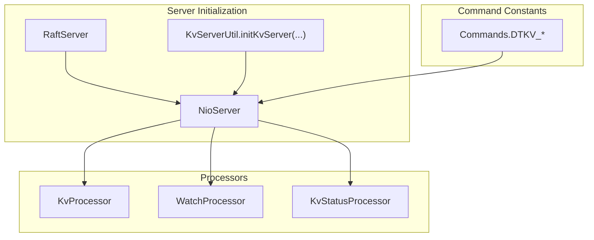
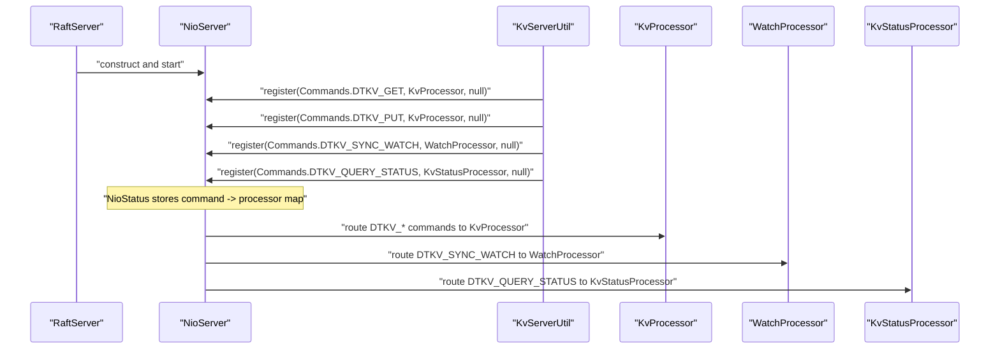
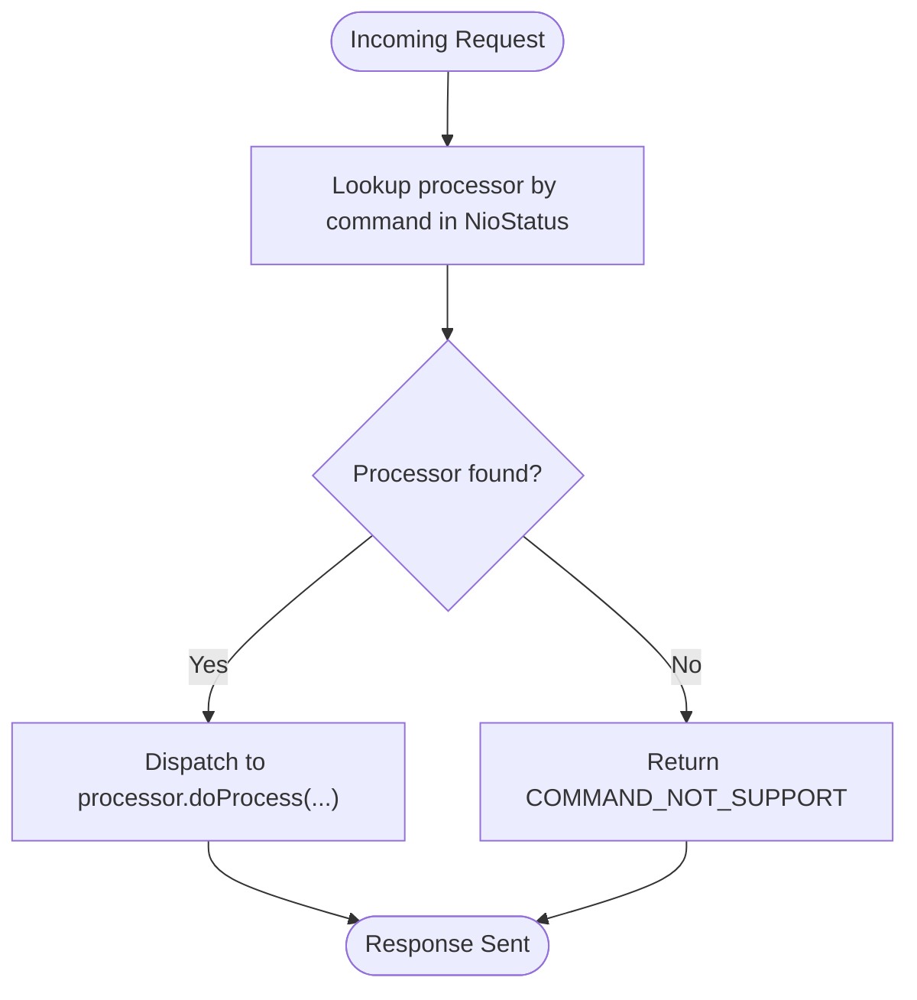
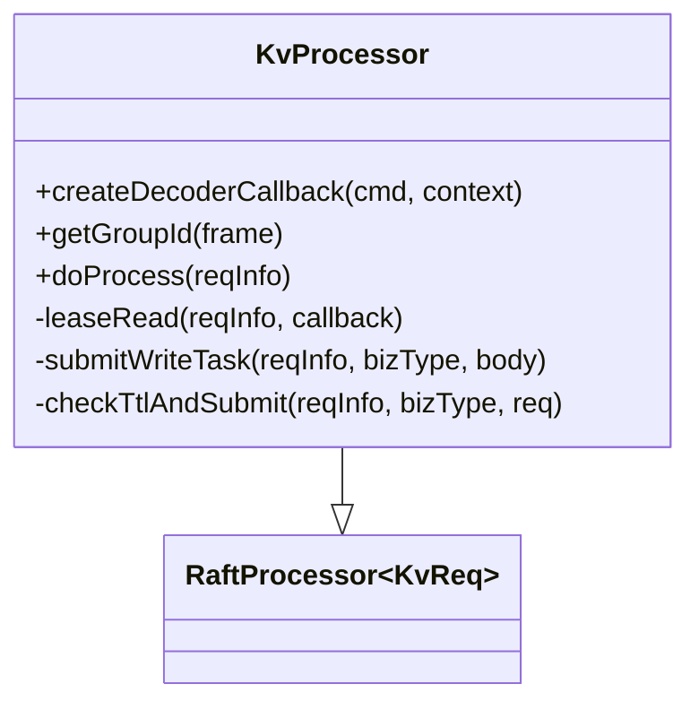
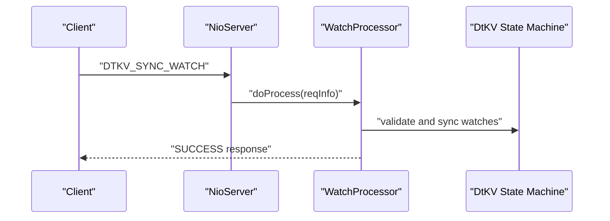
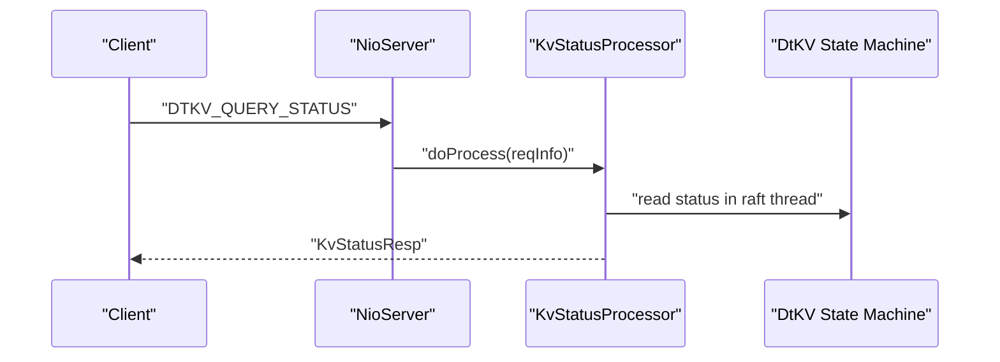
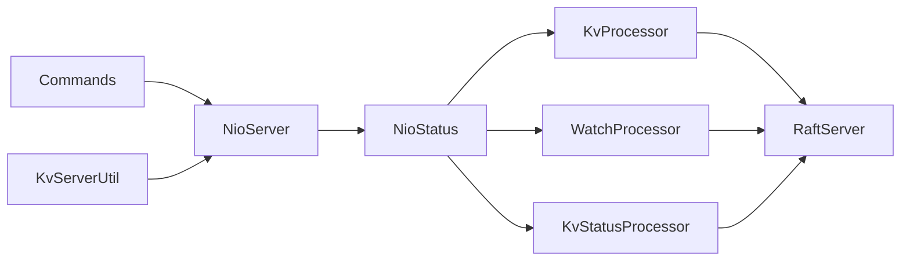

# Command Processor Registration

<cite>
**Referenced Files in This Document**
- [KvServerUtil.java](file://server/src/main/java/com/github/dtprj/dongting/dtkv/server/KvServerUtil.java)
- [KvProcessor.java](file://server/src/main/java/com/github/dtprj/dongting/dtkv/server/KvProcessor.java)
- [WatchProcessor.java](file://server/src/main/java/com/github/dtprj/dongting/dtkv/server/WatchProcessor.java)
- [KvStatusProcessor.java](file://server/src/main/java/com/github/dtprj/dongting/dtkv/server/KvStatusProcessor.java)
- [Commands.java](file://client/src/main/java/com/github/dtprj/dongting/net/Commands.java)
- [NioServer.java](file://client/src/main/java/com/github/dtprj/dongting/net/NioServer.java)
- [NioNet.java](file://client/src/main/java/com/github/dtprj/dongting/net/NioNet.java)
- [NioStatus.java](file://client/src/main/java/com/github/dtprj/dongting/net/NioStatus.java)
- [RaftServer.java](file://server/src/main/java/com/github/dtprj/dongting/raft/server/RaftServer.java)
- [NioServerTest.java](file://client/src/test/java/com/github/dtprj/dongting/net/NioServerTest.java)
</cite>

## Table of Contents
1. [Introduction](#introduction)
2. [Project Structure](#project-structure)
3. [Core Components](#core-components)
4. [Architecture Overview](#architecture-overview)
5. [Detailed Component Analysis](#detailed-component-analysis)
6. [Dependency Analysis](#dependency-analysis)
7. [Performance Considerations](#performance-considerations)
8. [Troubleshooting Guide](#troubleshooting-guide)
9. [Conclusion](#conclusion)

## Introduction
This document explains the command processor registration mechanism used by the DtKV subsystem. It focuses on how the server initializes and registers processors for K/V operations (GET, PUT, REMOVE, MKDIR, LIST, BATCH operations, CAS) and specialized commands (watch/notify and status queries). It also documents the mapping from Commands.DTKV_* constants to their respective processors, the role of the null parameter in register() calls, internal command routing, and best practices for extending the system with custom processors.

## Project Structure
The registration occurs during server initialization and involves:
- A server-side utility that registers processors with the NIO server
- Command constants defined in the network layer
- NIO server and net infrastructure that maintains a command-to-processor map

**Diagram sources**
- [KvServerUtil.java](file://server/src/main/java/com/github/dtprj/dongting/dtkv/server/KvServerUtil.java#L52-L76)
- [NioServer.java](file://client/src/main/java/com/github/dtprj/dongting/net/NioServer.java#L86-L88)
- [Commands.java](file://client/src/main/java/com/github/dtprj/dongting/net/Commands.java#L27-L69)

**Section sources**
- [KvServerUtil.java](file://server/src/main/java/com/github/dtprj/dongting/dtkv/server/KvServerUtil.java#L52-L76)
- [NioServer.java](file://client/src/main/java/com/github/dtprj/dongting/net/NioServer.java#L86-L88)
- [Commands.java](file://client/src/main/java/com/github/dtprj/dongting/net/Commands.java#L27-L69)

## Core Components
- KvServerUtil.initKvServer(): Registers all K/V and watch/status processors with the NIO server using Commands.DTKV_* constants.
- KvProcessor: Handles K/V operations (GET, PUT, REMOVE, MKDIR, LIST, BATCH GET/PUT/REMOVE, CAS, TTL-related, lock-related).
- WatchProcessor: Handles watch synchronization and notifications.
- KvStatusProcessor: Handles status queries and builds responses.
- Commands: Defines the DTKV command constants used for registration and routing.
- NioNet.register(): Provides the registration API with two overloads; the null parameter selects default vs. custom executor for processing.

**Section sources**
- [KvServerUtil.java](file://server/src/main/java/com/github/dtprj/dongting/dtkv/server/KvServerUtil.java#L52-L76)
- [KvProcessor.java](file://server/src/main/java/com/github/dtprj/dongting/dtkv/server/KvProcessor.java#L51-L145)
- [WatchProcessor.java](file://server/src/main/java/com/github/dtprj/dongting/dtkv/server/WatchProcessor.java#L35-L113)
- [KvStatusProcessor.java](file://server/src/main/java/com/github/dtprj/dongting/dtkv/server/KvStatusProcessor.java#L35-L83)
- [Commands.java](file://client/src/main/java/com/github/dtprj/dongting/net/Commands.java#L27-L69)
- [NioNet.java](file://client/src/main/java/com/github/dtprj/dongting/net/NioNet.java#L70-L90)

## Architecture Overview
The registration flow is:
1. RaftServer constructs and starts NioServer.
2. KvServerUtil.initKvServer() obtains the NioServer and registers processors for each DTKV command.
3. When a client sends a request, NioServer routes it to the registered processor based on the command constant.

**Diagram sources**
- [RaftServer.java](file://server/src/main/java/com/github/dtprj/dongting/raft/server/RaftServer.java#L163-L177)
- [KvServerUtil.java](file://server/src/main/java/com/github/dtprj/dongting/dtkv/server/KvServerUtil.java#L52-L76)
- [NioServer.java](file://client/src/main/java/com/github/dtprj/dongting/net/NioServer.java#L86-L88)
- [NioStatus.java](file://client/src/main/java/com/github/dtprj/dongting/net/NioStatus.java#L36-L42)

## Detailed Component Analysis

### Command Registration in KvServerUtil.initKvServer()
- Registers K/V processors for:
  - DTKV_GET, DTKV_PUT, DTKV_REMOVE, DTKV_MKDIR, DTKV_LIST
  - DTKV_BATCH_GET, DTKV_BATCH_PUT, DTKV_BATCH_REMOVE
  - DTKV_CAS
  - DTKV_UPDATE_LOCK_LEASE
  - DTKV_PUT_TEMP_NODE, DTKV_MAKE_TEMP_DIR, DTKV_UPDATE_TTL
  - DTKV_TRY_LOCK, DTKV_UNLOCK
- Registers specialized processors:
  - DTKV_SYNC_WATCH -> WatchProcessor
  - DTKV_QUERY_STATUS -> KvStatusProcessor

The null parameter in register() selects the default executor for processing. This ensures processors run in the appropriate thread pool configured by NioNet.

**Section sources**
- [KvServerUtil.java](file://server/src/main/java/com/github/dtprj/dongting/dtkv/server/KvServerUtil.java#L52-L76)
- [NioNet.java](file://client/src/main/java/com/github/dtprj/dongting/net/NioNet.java#L70-L90)

### Command Mapping from Commands.DTKV_* to Processors
- DTKV_GET, DTKV_PUT, DTKV_REMOVE, DTKV_MKDIR, DTKV_LIST, DTKV_BATCH_GET, DTKV_BATCH_PUT, DTKV_BATCH_REMOVE, DTKV_CAS, DTKV_UPDATE_LOCK_LEASE, DTKV_PUT_TEMP_NODE, DTKV_MAKE_TEMP_DIR, DTKV_UPDATE_TTL, DTKV_TRY_LOCK, DTKV_UNLOCK -> KvProcessor
- DTKV_SYNC_WATCH -> WatchProcessor
- DTKV_QUERY_STATUS -> KvStatusProcessor

These mappings are established by the register() calls in KvServerUtil.initKvServer().

**Section sources**
- [KvServerUtil.java](file://server/src/main/java/com/github/dtprj/dongting/dtkv/server/KvServerUtil.java#L52-L76)
- [Commands.java](file://client/src/main/java/com/github/dtprj/dongting/net/Commands.java#L27-L69)

### Role of the Null Parameter in register() Calls
- NioNet.register(int cmd, ReqProcessor processor, Executor executor) accepts an executor parameter.
- Passing null delegates processing to the default executor managed by NioNet.
- Passing a non-null executor runs the processor in the provided executor.

This allows flexibility in how business logic is executed (e.g., offloading heavy tasks to a dedicated thread pool).

**Section sources**
- [NioNet.java](file://client/src/main/java/com/github/dtprj/dongting/net/NioNet.java#L70-L90)

### Internal Command Routing
- NioStatus maintains a map from command integer to ReqProcessor.
- NioNet.register() stores the mapping before the server starts.
- When a request arrives, NioServer retrieves the processor from NioStatus.getProcessor(cmd) and invokes it.

**Diagram sources**
- [NioStatus.java](file://client/src/main/java/com/github/dtprj/dongting/net/NioStatus.java#L36-L42)
- [NioNet.java](file://client/src/main/java/com/github/dtprj/dongting/net/NioNet.java#L70-L90)
- [NioServerTest.java](file://client/src/test/java/com/github/dtprj/dongting/net/NioServerTest.java#L350-L365)

**Section sources**
- [NioStatus.java](file://client/src/main/java/com/github/dtprj/dongting/net/NioStatus.java#L36-L42)
- [NioNet.java](file://client/src/main/java/com/github/dtprj/dongting/net/NioNet.java#L70-L90)
- [NioServerTest.java](file://client/src/test/java/com/github/dtprj/dongting/net/NioServerTest.java#L350-L365)

### KvProcessor: K/V Operations
- Implements RaftProcessor<KvReq>.
- Routes commands to either leaseRead (for read-like operations) or submitWriteTask (for write-like operations).
- Supports:
  - Single ops: GET, PUT, REMOVE, MKDIR, LIST, CAS
  - Batch ops: BATCH_GET, BATCH_PUT, BATCH_REMOVE
  - TTL-related: PUT_TEMP_NODE, MAKE_TEMP_DIR, UPDATE_TTL
  - Lock-related: TRY_LOCK, UNLOCK, UPDATE_LOCK_LEASE
- Uses leaseRead for read operations to avoid Raft writes and improve latency.
- Submits linear tasks to Raft for write operations.

**Diagram sources**
- [KvProcessor.java](file://server/src/main/java/com/github/dtprj/dongting/dtkv/server/KvProcessor.java#L51-L145)

**Section sources**
- [KvProcessor.java](file://server/src/main/java/com/github/dtprj/dongting/dtkv/server/KvProcessor.java#L51-L145)

### WatchProcessor: Watch/Notify Commands
- Handles DTKV_SYNC_WATCH.
- Validates request parameters and checks state machine readiness.
- Schedules watch synchronization via the server’s executor and writes a success response.

**Diagram sources**
- [WatchProcessor.java](file://server/src/main/java/com/github/dtprj/dongting/dtkv/server/WatchProcessor.java#L51-L113)

**Section sources**
- [WatchProcessor.java](file://server/src/main/java/com/github/dtprj/dongting/dtkv/server/WatchProcessor.java#L51-L113)

### KvStatusProcessor: Status Queries
- Handles DTKV_QUERY_STATUS.
- Builds a status response combining Raft server status and watch counts.
- Executes in a fiber thread and writes the response asynchronously.

**Diagram sources**
- [KvStatusProcessor.java](file://server/src/main/java/com/github/dtprj/dongting/dtkv/server/KvStatusProcessor.java#L51-L83)

**Section sources**
- [KvStatusProcessor.java](file://server/src/main/java/com/github/dtprj/dongting/dtkv/server/KvStatusProcessor.java#L51-L83)

### Extending the System with Custom Command Processors
To add a new command:
1. Define a new command constant in Commands (e.g., DTKV_MY_CMD).
2. Implement a processor that extends ReqProcessor or RaftProcessor depending on whether Raft coordination is needed.
3. Register the processor in KvServerUtil.initKvServer() using NioServer.register(Commands.DTKV_MY_CMD, MyProcessor, nullOrCustomExecutor).
4. Ensure the processor handles decoding via createDecoderCallback and routing via getGroupId when applicable.

Best practices:
- Keep decoding lightweight; delegate heavy work to executors.
- Validate inputs early and return appropriate business codes.
- Use leaseRead for read-only operations to avoid Raft writes.
- For write operations, submit linear tasks to Raft and handle responses in callbacks.

**Section sources**
- [Commands.java](file://client/src/main/java/com/github/dtprj/dongting/net/Commands.java#L27-L69)
- [NioNet.java](file://client/src/main/java/com/github/dtprj/dongting/net/NioNet.java#L70-L90)
- [KvServerUtil.java](file://server/src/main/java/com/github/dtprj/dongting/dtkv/server/KvServerUtil.java#L52-L76)

## Dependency Analysis
- KvServerUtil depends on NioServer and Commands to register processors.
- KvProcessor depends on RaftServer and RaftProcessor for write operations and leaseRead for reads.
- WatchProcessor and KvStatusProcessor depend on the state machine and NioServer for notifications and responses.
- NioNet and NioStatus provide the command-to-processor registry and lifecycle enforcement.

**Diagram sources**
- [KvServerUtil.java](file://server/src/main/java/com/github/dtprj/dongting/dtkv/server/KvServerUtil.java#L52-L76)
- [NioServer.java](file://client/src/main/java/com/github/dtprj/dongting/net/NioServer.java#L86-L88)
- [NioStatus.java](file://client/src/main/java/com/github/dtprj/dongting/net/NioStatus.java#L36-L42)
- [RaftServer.java](file://server/src/main/java/com/github/dtprj/dongting/raft/server/RaftServer.java#L163-L177)

**Section sources**
- [KvServerUtil.java](file://server/src/main/java/com/github/dtprj/dongting/dtkv/server/KvServerUtil.java#L52-L76)
- [NioStatus.java](file://client/src/main/java/com/github/dtprj/dongting/net/NioStatus.java#L36-L42)
- [RaftServer.java](file://server/src/main/java/com/github/dtprj/dongting/raft/server/RaftServer.java#L163-L177)

## Performance Considerations
- Use leaseRead for read-heavy workloads to avoid Raft writes.
- Offload heavy processing to custom executors via the third register() overload when needed.
- Ensure proper batching (e.g., BATCH_GET/PUT/REMOVE) to reduce round trips.
- Monitor flow control and adjust bizThreads and max packet sizes to prevent backpressure.

## Troubleshooting Guide
Common issues and resolutions:
- Duplicate command registration: The registration API enforces registration before start. Attempting to register after start throws an exception. Ensure all processors are registered before starting the server.
- Unknown command: If a command is not registered, the server responds with COMMAND_NOT_SUPPORT. Verify the command constant and registration call.
- Processor exceptions: Exceptions thrown by processors are caught and responded with SYS_ERROR. Ensure robust error handling and logging in custom processors.
- Flow control: Excessive pending requests or bytes trigger flow control errors. Tune maxInRequests and maxInBytes to match workload characteristics.

**Section sources**
- [NioNet.java](file://client/src/main/java/com/github/dtprj/dongting/net/NioNet.java#L70-L90)
- [NioServerTest.java](file://client/src/test/java/com/github/dtprj/dongting/net/NioServerTest.java#L646-L651)
- [NioServerTest.java](file://client/src/test/java/com/github/dtprj/dongting/net/NioServerTest.java#L350-L365)

## Conclusion
The DtKV command processor registration mechanism cleanly separates concerns:
- Commands.DTKV_* define the contract.
- KvServerUtil.initKvServer() wires processors to the NIO server.
- NioStatus maintains the command-to-processor map.
- KvProcessor, WatchProcessor, and KvStatusProcessor implement the business logic for their respective domains.
Extending the system requires adding a command constant, implementing a processor, and registering it with the NIO server before startup. Following best practices around read/write routing, executor selection, and error handling ensures reliable and performant operation.