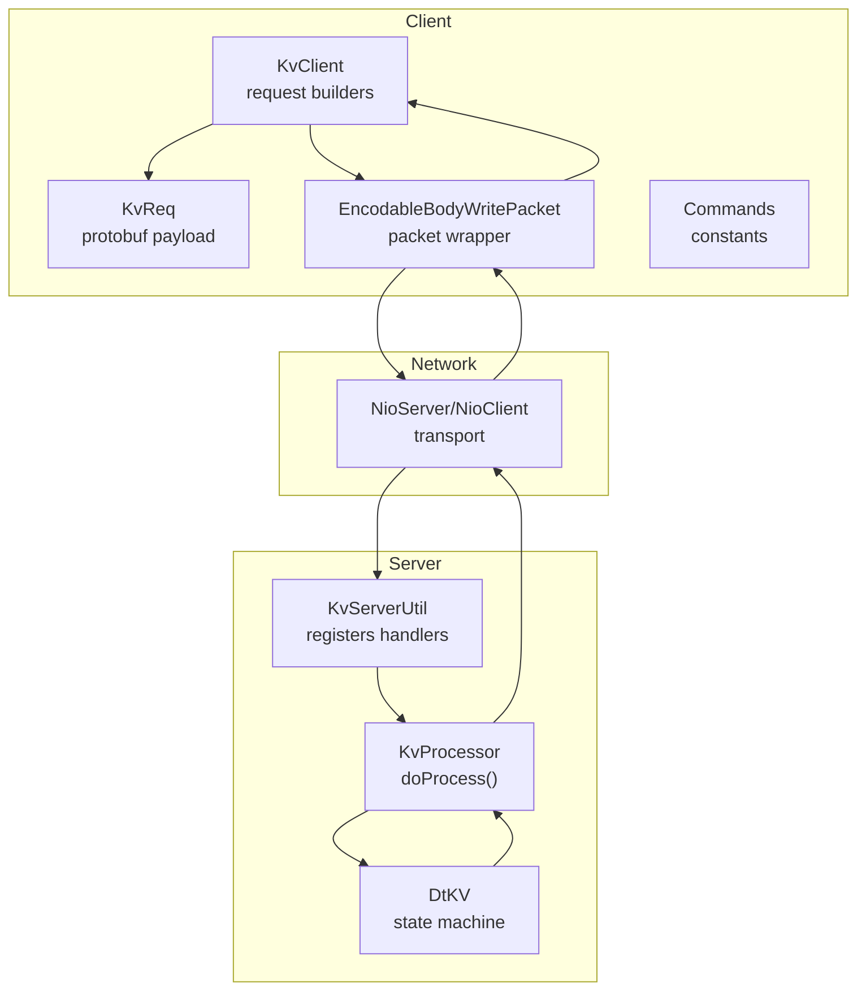
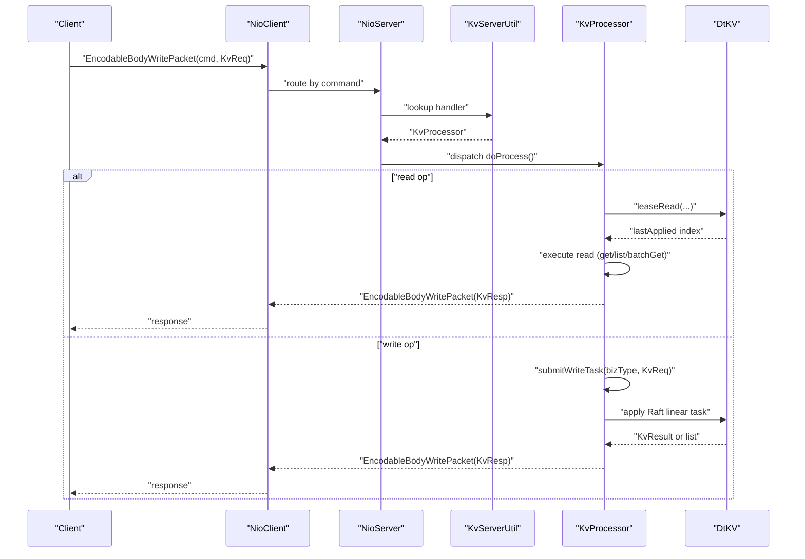
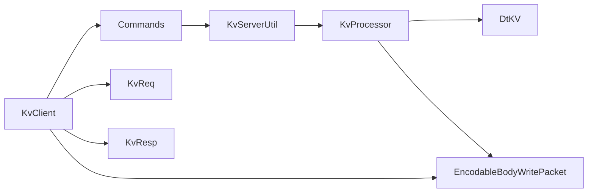

# Core K/V Operations

<cite>
**Referenced Files in This Document**
- [KvServerUtil.java](file://server/src/main/java/com/github/dtprj/dongting/dtkv/server/KvServerUtil.java)
- [KvProcessor.java](file://server/src/main/java/com/github/dtprj/dongting/dtkv/server/KvProcessor.java)
- [Commands.java](file://client/src/main/java/com/github/dtprj/dongting/net/Commands.java)
- [KvReq.java](file://client/src/main/java/com/github/dtprj/dongting/dtkv/KvReq.java)
- [KvResp.java](file://client/src/main/java/com/github/dtprj/dongting/dtkv/KvResp.java)
- [EncodableBodyWritePacket.java](file://client/src/main/java/com/github/dtprj/dongting/net/EncodableBodyWritePacket.java)
- [KvClient.java](file://client/src/main/java/com/github/dtprj/dongting/dtkv/KvClient.java)
- [KvCodes.java](file://client/src/main/java/com/github/dtprj/dongting/dtkv/KvCodes.java)
</cite>

## Table of Contents
1. [Introduction](#introduction)
2. [Project Structure](#project-structure)
3. [Core Components](#core-components)
4. [Architecture Overview](#architecture-overview)
5. [Detailed Component Analysis](#detailed-component-analysis)
6. [Dependency Analysis](#dependency-analysis)
7. [Performance Considerations](#performance-considerations)
8. [Troubleshooting Guide](#troubleshooting-guide)
9. [Conclusion](#conclusion)

## Introduction
This document explains how the Dongting K/V subsystem registers and processes core K/V operations. It focuses on how the server initializes command handlers, how the processor executes read and write operations, and how clients interact with the system. It also covers response handling, error semantics, and best practices for bulk operations.

## Project Structure
The core K/V operations span two layers:
- Server-side: command registration and processing logic
- Client-side: request construction, sending, and response decoding

**Diagram sources**
- [KvServerUtil.java](file://server/src/main/java/com/github/dtprj/dongting/dtkv/server/KvServerUtil.java#L52-L76)
- [KvProcessor.java](file://server/src/main/java/com/github/dtprj/dongting/dtkv/server/KvProcessor.java#L71-L145)
- [KvClient.java](file://client/src/main/java/com/github/dtprj/dongting/dtkv/KvClient.java#L132-L181)
- [KvReq.java](file://client/src/main/java/com/github/dtprj/dongting/dtkv/KvReq.java#L33-L168)
- [EncodableBodyWritePacket.java](file://client/src/main/java/com/github/dtprj/dongting/net/EncodableBodyWritePacket.java#L26-L56)
- [Commands.java](file://client/src/main/java/com/github/dtprj/dongting/net/Commands.java#L21-L69)

**Section sources**
- [KvServerUtil.java](file://server/src/main/java/com/github/dtprj/dongting/dtkv/server/KvServerUtil.java#L52-L76)
- [KvProcessor.java](file://server/src/main/java/com/github/dtprj/dongting/dtkv/server/KvProcessor.java#L71-L145)
- [KvClient.java](file://client/src/main/java/com/github/dtprj/dongting/dtkv/KvClient.java#L132-L181)

## Core Components
- Command constants define the wire protocol identifiers for operations such as GET, PUT, REMOVE, MKDIR, LIST, and BATCH variants.
- Server registration binds each command to the shared processor.
- Processor implements read/write dispatch, lease-based reads, and write task submission.
- Client builds requests, sends them, and decodes responses.

**Section sources**
- [Commands.java](file://client/src/main/java/com/github/dtprj/dongting/net/Commands.java#L21-L69)
- [KvServerUtil.java](file://server/src/main/java/com/github/dtprj/dongting/dtkv/server/KvServerUtil.java#L52-L76)
- [KvProcessor.java](file://server/src/main/java/com/github/dtprj/dongting/dtkv/server/KvProcessor.java#L71-L145)
- [KvClient.java](file://client/src/main/java/com/github/dtprj/dongting/dtkv/KvClient.java#L132-L181)

## Architecture Overview
The server registers the processor for multiple commands. On receipt, the processor validates and dispatches to either a lease-based read (linearizable reads) or a write task submitted to the Raft linearized execution pipeline.

**Diagram sources**
- [KvServerUtil.java](file://server/src/main/java/com/github/dtprj/dongting/dtkv/server/KvServerUtil.java#L52-L76)
- [KvProcessor.java](file://server/src/main/java/com/github/dtprj/dongting/dtkv/server/KvProcessor.java#L71-L145)
- [EncodableBodyWritePacket.java](file://client/src/main/java/com/github/dtprj/dongting/net/EncodableBodyWritePacket.java#L26-L56)
- [KvResp.java](file://client/src/main/java/com/github/dtprj/dongting/dtkv/KvResp.java#L32-L121)
- [KvReq.java](file://client/src/main/java/com/github/dtprj/dongting/dtkv/KvReq.java#L33-L168)

## Detailed Component Analysis

### Command Registration in KvServerUtil.initKvServer()
- Registers the processor for:
  - GET, PUT, REMOVE, MKDIR, LIST
  - BATCH_GET, BATCH_PUT, BATCH_REMOVE
  - CAS, UPDATE_LOCK_LEASE
  - Temp node ops: PUT_TEMP_NODE, MAKE_TEMP_DIR, UPDATE_TTL
  - Lock ops: TRY_LOCK, UNLOCK
- Also registers auxiliary processors for WATCH and STATUS.

Implementation highlights:
- Uses NioServer.register(command, processor, null) to bind each command to the shared processor.
- Ensures the processor is ready before Raft starts.

**Section sources**
- [KvServerUtil.java](file://server/src/main/java/com/github/dtprj/dongting/dtkv/server/KvServerUtil.java#L52-L76)

### Command Constants and Mapping
- Commands.DTKV_GET, DTKV_PUT, DTKV_REMOVE, DTKV_MKDIR, DTKV_LIST, DTKV_BATCH_GET, DTKV_BATCH_PUT, DTKV_BATCH_REMOVE, DTKV_CAS, DTKV_UPDATE_LOCK_LEASE, DTKV_PUT_TEMP_NODE, DTKV_MAKE_TEMP_DIR, DTKV_UPDATE_TTL, DTKV_TRY_LOCK, DTKV_UNLOCK.

Mapping in processor:
- The processor switches on frame.command and invokes:
  - leaseRead for reads (GET, LIST, BATCH_GET)
  - submitWriteTask for writes (PUT, REMOVE, MKDIR, BATCH_PUT, BATCH_REMOVE, CAS, PUT_TEMP_NODE, MAKE_TEMP_DIR, UPDATE_TTL, TRY_LOCK, UNLOCK, UPDATE_LOCK_LEASE)

**Section sources**
- [Commands.java](file://client/src/main/java/com/github/dtprj/dongting/net/Commands.java#L21-L69)
- [KvProcessor.java](file://server/src/main/java/com/github/dtprj/dongting/dtkv/server/KvProcessor.java#L82-L140)

### KvProcessor.doProcess(): Read and Write Dispatch
- Validates state machine and request context.
- Reads the command from the incoming frame.
- Dispatches to:
  - leaseRead for read operations: constructs a response packet and writes it back via write-in-biz-thread.
  - submitWriteTask for write operations: submits a linear task to Raft; response is handled in the Raft callback.

Response construction:
- Single-result writes (PUT, REMOVE, MKDIR, CAS, TEMP ops, TRY_LOCK, UPDATE_LOCK_LEASE) produce a KvResp with a single KvResult.
- BATCH_PUT/BATCH_REMOVE return a KvResp with a list of KvResult; the list may be empty when bizCode indicates failure.
- LIST and BATCH_GET return a KvResp with a list of KvResult.

Error handling:
- Exceptions thrown during processing are caught and mapped to an error response via writeErrorResp.

**Section sources**
- [KvProcessor.java](file://server/src/main/java/com/github/dtprj/dongting/dtkv/server/KvProcessor.java#L71-L145)
- [KvProcessor.java](file://server/src/main/java/com/github/dtprj/dongting/dtkv/server/KvProcessor.java#L174-L211)
- [KvProcessor.java](file://server/src/main/java/com/github/dtprj/dongting/dtkv/server/KvProcessor.java#L199-L202)
- [KvProcessor.java](file://server/src/main/java/com/github/dtprj/dongting/dtkv/server/KvProcessor.java#L204-L276)

### Lease Read Path (leaseRead)
- Captures the IO worker’s timestamp and performs a leaseRead against the Raft group with the request timeout.
- On success, applies the read callback to compute a response packet and writes it back in the business thread.
- On error, writes an error response.

This ensures linearizable reads while minimizing latency by avoiding consensus for reads.

**Section sources**
- [KvProcessor.java](file://server/src/main/java/com/github/dtprj/dongting/dtkv/server/KvProcessor.java#L174-L192)

### Write Task Submission (submitWriteTask)
- Wraps the request into a RaftInput and submits a linear task to the Raft group.
- The Raft callback constructs the appropriate response (single or list) and writes it back.
- Special handling for UNLOCK: sends the response immediately, then notifies the new lock owner via a one-way push.

**Section sources**
- [KvProcessor.java](file://server/src/main/java/com/github/dtprj/dongting/dtkv/server/KvProcessor.java#L199-L202)
- [KvProcessor.java](file://server/src/main/java/com/github/dtprj/dongting/dtkv/server/KvProcessor.java#L204-L276)

### Client Interaction Patterns
- Build a KvReq with groupId, key(s)/value(s), optional expectValue for CAS, and optional TTL for temp nodes.
- Wrap in EncodableBodyWritePacket with the appropriate command constant.
- Send via RaftClient with decoder callback for KvResp.
- Decode and map to KvNode or KvResult depending on operation.

Common patterns:
- GET: sendSync with Commands.DTKV_GET; map to KvNode.
- PUT: sendSync with Commands.DTKV_PUT; map to success/failure.
- REMOVE: sendSync with Commands.DTKV_REMOVE; map to success/failure.
- MKDIR: sendSync with Commands.DTKV_MKDIR; map to success/failure.
- LIST: sendSync with Commands.DTKV_LIST; map to list of KvResult.
- BATCH_GET: sendSync with Commands.DTKV_BATCH_GET; map to list of KvNode.
- BATCH_PUT: sendSync with Commands.DTKV_BATCH_PUT; map to list of KvResult.
- BATCH_REMOVE: sendSync with Commands.DTKV_BATCH_REMOVE; map to list of KvResult.
- CAS: sendSync with Commands.DTKV_CAS; map to boolean success.
- Temp node ops: PUT_TEMP_NODE, MAKE_TEMP_DIR, UPDATE_TTL.
- Lock ops: TRY_LOCK, UNLOCK.

Response handling:
- Client checks bizCode and throws KvException on failure.
- Success mapping depends on operation: single node, list of nodes/results, or boolean.

**Section sources**
- [KvReq.java](file://client/src/main/java/com/github/dtprj/dongting/dtkv/KvReq.java#L33-L168)
- [EncodableBodyWritePacket.java](file://client/src/main/java/com/github/dtprj/dongting/net/EncodableBodyWritePacket.java#L26-L56)
- [KvClient.java](file://client/src/main/java/com/github/dtprj/dongting/dtkv/KvClient.java#L132-L181)
- [KvClient.java](file://client/src/main/java/com/github/dtprj/dongting/dtkv/KvClient.java#L303-L338)
- [KvClient.java](file://client/src/main/java/com/github/dtprj/dongting/dtkv/KvClient.java#L341-L376)
- [KvClient.java](file://client/src/main/java/com/github/dtprj/dongting/dtkv/KvClient.java#L379-L411)
- [KvClient.java](file://client/src/main/java/com/github/dtprj/dongting/dtkv/KvClient.java#L414-L439)
- [KvClient.java](file://client/src/main/java/com/github/dtprj/dongting/dtkv/KvClient.java#L488-L517)
- [KvClient.java](file://client/src/main/java/com/github/dtprj/dongting/dtkv/KvClient.java#L534-L561)
- [KvClient.java](file://client/src/main/java/com/github/dtprj/dongting/dtkv/KvClient.java#L583-L610)
- [KvClient.java](file://client/src/main/java/com/github/dtprj/dongting/dtkv/KvClient.java#L613-L650)
- [KvClient.java](file://client/src/main/java/com/github/dtprj/dongting/dtkv/KvClient.java#L657-L686)

### Data Model: KvReq and KvResp
- KvReq encodes groupId, key/value, optional expectValue, owner UUID, TTL, and lists for batch operations.
- KvResp encodes raftIndex and a list of KvResult; client decoders map to KvNode or list of results.

**Section sources**
- [KvReq.java](file://client/src/main/java/com/github/dtprj/dongting/dtkv/KvReq.java#L33-L168)
- [KvResp.java](file://client/src/main/java/com/github/dtprj/dongting/dtkv/KvResp.java#L32-L121)

### Best Practices for Bulk Operations
- Batch operations:
  - BATCH_GET: pass a non-empty list of keys; server returns a list of results (may include NOT_FOUND).
  - BATCH_PUT: pass equal-sized keys/values; server returns a list of results with per-item bizCode.
  - BATCH_REMOVE: pass a non-empty list of keys; server returns a list of results.
- Validate inputs:
  - Keys must be non-empty and valid; values must be non-null/empty for non-temp nodes.
  - For batch operations, ensure keys and values sizes match.
- Error handling:
  - Client maps bizCode to success/failure; exceptions indicate transport/network errors.
  - For BATCH_* operations, inspect per-item results to handle partial failures.
- Performance:
  - Use batch operations to reduce round-trips.
  - Prefer leaseRead for reads (already used by GET/LIST/BATCH_GET) to avoid consensus overhead.
  - Avoid excessively large batches; tune based on payload size and network conditions.

**Section sources**
- [KvClient.java](file://client/src/main/java/com/github/dtprj/dongting/dtkv/KvClient.java#L488-L517)
- [KvClient.java](file://client/src/main/java/com/github/dtprj/dongting/dtkv/KvClient.java#L534-L561)
- [KvClient.java](file://client/src/main/java/com/github/dtprj/dongting/dtkv/KvClient.java#L583-L610)
- [KvReq.java](file://client/src/main/java/com/github/dtprj/dongting/dtkv/KvReq.java#L59-L95)

## Dependency Analysis
- Server registration depends on:
  - NioServer for routing
  - Commands constants for command IDs
  - KvProcessor for handling
- Processor depends on:
  - Raft group for leaseRead and linear task submission
  - DtKV state machine for read/write execution
  - WritePacket/EncodableBodyWritePacket for response encoding
- Client depends on:
  - RaftClient for transport
  - Commands for command IDs
  - KvReq/KvResp for serialization
  - KvCodes for bizCode semantics

**Diagram sources**
- [Commands.java](file://client/src/main/java/com/github/dtprj/dongting/net/Commands.java#L21-L69)
- [KvServerUtil.java](file://server/src/main/java/com/github/dtprj/dongting/dtkv/server/KvServerUtil.java#L52-L76)
- [KvProcessor.java](file://server/src/main/java/com/github/dtprj/dongting/dtkv/server/KvProcessor.java#L71-L145)
- [EncodableBodyWritePacket.java](file://client/src/main/java/com/github/dtprj/dongting/net/EncodableBodyWritePacket.java#L26-L56)
- [KvReq.java](file://client/src/main/java/com/github/dtprj/dongting/dtkv/KvReq.java#L33-L168)
- [KvResp.java](file://client/src/main/java/com/github/dtprj/dongting/dtkv/KvResp.java#L32-L121)
- [KvClient.java](file://client/src/main/java/com/github/dtprj/dongting/dtkv/KvClient.java#L132-L181)

**Section sources**
- [KvServerUtil.java](file://server/src/main/java/com/github/dtprj/dongting/dtkv/server/KvServerUtil.java#L52-L76)
- [KvProcessor.java](file://server/src/main/java/com/github/dtprj/dongting/dtkv/server/KvProcessor.java#L71-L145)
- [KvClient.java](file://client/src/main/java/com/github/dtprj/dongting/dtkv/KvClient.java#L132-L181)

## Performance Considerations
- Lease reads:
  - GET, LIST, and BATCH_GET use leaseRead to avoid consensus for reads, improving throughput and latency.
- Write path:
  - Writes are submitted as linear tasks to Raft; batching reduces overhead.
- Payload sizing:
  - Batch operations reduce network overhead; however, large payloads increase memory pressure.
- Concurrency:
  - Responses are written in business threads; ensure downstream processing remains lightweight.

[No sources needed since this section provides general guidance]

## Troubleshooting Guide
- BizCode semantics:
  - Use KvCodes to interpret success/failure and categorize errors (e.g., NOT_FOUND, DIR_EXISTS, INVALID_KEY, INVALID_VALUE, CAS_MISMATCH, INVALID_TTL, NOT_OWNER, etc.).
- Client-side error handling:
  - Client maps bizCode to success/failure; exceptions indicate transport/network errors.
- Server-side error handling:
  - Processor catches exceptions and writes error responses; ensure logs capture the cause.
- Bulk operation diagnostics:
  - For BATCH_* operations, inspect per-item results to identify which keys failed.

**Section sources**
- [KvCodes.java](file://client/src/main/java/com/github/dtprj/dongting/dtkv/KvCodes.java#L21-L118)
- [KvClient.java](file://client/src/main/java/com/github/dtprj/dongting/dtkv/KvClient.java#L107-L130)
- [KvProcessor.java](file://server/src/main/java/com/github/dtprj/dongting/dtkv/server/KvProcessor.java#L141-L145)

## Conclusion
The core K/V operations are registered centrally and dispatched efficiently: reads leverage leaseRead for linearizable performance, while writes are submitted to Raft for strict ordering. Clients construct requests with appropriate command constants, decode responses, and handle bizCode semantics. For bulk operations, batch APIs improve throughput and should be used judiciously with proper validation and error inspection.