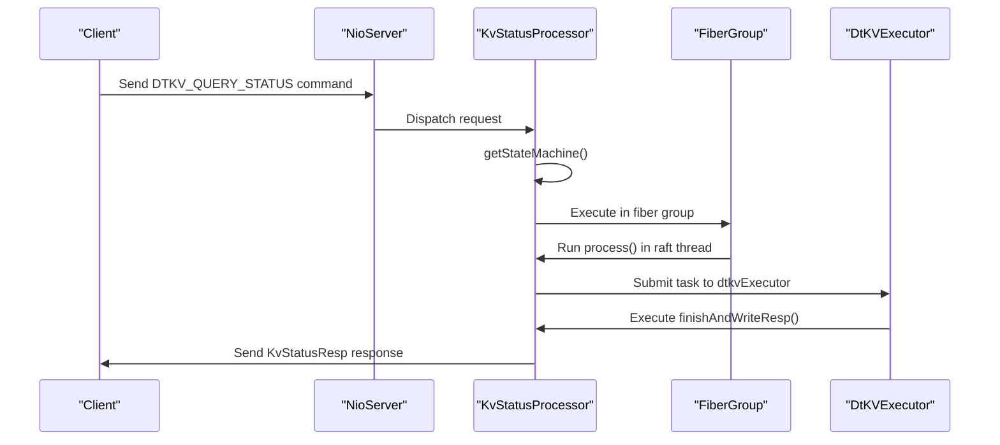
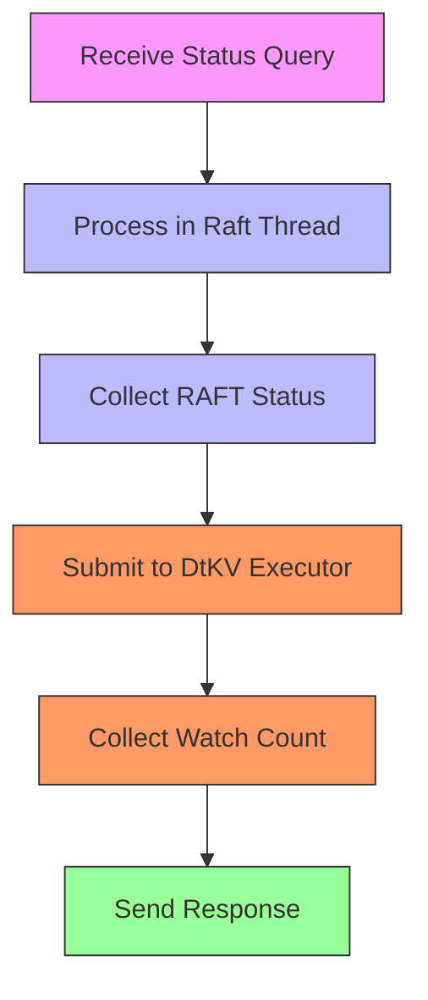
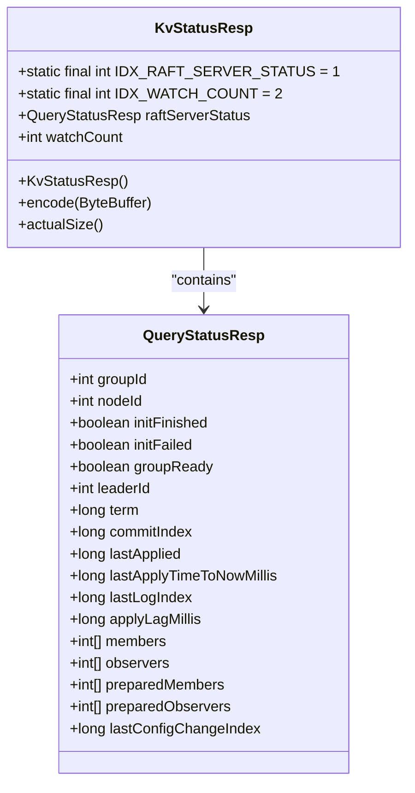

# Status Query Operations

<cite>
**Referenced Files in This Document**   
- [KvServerUtil.java](file://server/src/main/java/com/github/dtprj/dongting/dtkv/server/KvServerUtil.java)
- [KvStatusProcessor.java](file://server/src/main/java/com/github/dtprj/dongting/dtkv/server/KvStatusProcessor.java)
- [KvStatusResp.java](file://client/src/main/java/com/github/dtprj/dongting/dtkv/KvStatusResp.java)
- [QueryStatusProcessor.java](file://server/src/main/java/com/github/dtprj/dongting/raft/rpc/QueryStatusProcessor.java)
- [ServerWatchManager.java](file://server/src/main/java/com/github/dtprj/dongting/dtkv/server/ServerWatchManager.java)
- [DtKV.java](file://server/src/main/java/com/github/dtprj/dongting/dtkv/server/DtKV.java)
- [DtKVExecutor.java](file://server/src/main/java/com/github/dtprj/dongting/dtkv/server/DtKVExecutor.java)
- [FiberGroup.java](file://server/src/main/java/com/github/dtprj/dongting/fiber/FiberGroup.java)
- [Commands.java](file://client/src/main/java/com/github/dtprj/dongting/net/Commands.java)
</cite>

## Table of Contents
1. [Status Query Command Registration](#status-query-command-registration)
2. [KvStatusProcessor Implementation](#kvstatusprocessor-implementation)
3. [Asynchronous Processing Pattern](#asynchronous-processing-pattern)
4. [KvStatusResp Response Structure](#kvstatusresp-response-structure)
5. [Monitoring Scenarios and Best Practices](#monitoring-scenarios-and-best-practices)

## Status Query Command Registration

The DtKV status query command registration is handled by the `KvServerUtil.initKvServer()` method, which registers various command processors with the NioServer during server initialization. This method is called after the RaftServer initialization but before it starts processing requests.

The status query command, identified by `Commands.DTKV_QUERY_STATUS`, is registered with the NioServer through the `KvStatusProcessor` instance. This registration occurs alongside other DtKV command processors such as GET, PUT, and REMOVE operations. The `initKvServer()` method establishes the command routing infrastructure by associating each command code with its corresponding processor implementation.

The registration process follows a consistent pattern where each command is mapped to its processor with a null executor parameter, indicating that the default execution context should be used. This approach ensures that all DtKV commands are properly registered and can be dispatched to their respective handlers when received by the server.

**Section sources**
- [KvServerUtil.java](file://server/src/main/java/com/github/dtprj/dongting/dtkv/server/KvServerUtil.java#L52-L69)

## KvStatusProcessor Implementation

The `KvStatusProcessor` class handles the processing of status query commands in the DtKV system. As a subclass of `RaftProcessor<Integer>`, it implements the necessary methods to decode, route, and process status query requests within the Raft consensus framework.

The processor follows a multi-stage processing pattern. First, it creates a decoder callback through the `createDecoderCallback()` method, which utilizes the cached protobuf integer callback from the decode context. This optimization reduces object allocation overhead for frequently processed status queries.

The `getGroupId()` method extracts the group identifier from the request body, which is used to route the request to the appropriate Raft group. This allows the system to support multiple independent DtKV instances within the same deployment.

The core processing logic resides in the `doProcess()` method, which implements an asynchronous processing pattern. When a status query request arrives, the method first retrieves the DtKV state machine instance using `KvServerUtil.getStateMachine()`. If the state machine is unavailable, the method returns null, indicating that no response should be sent.

**Diagram sources**
- [KvStatusProcessor.java](file://server/src/main/java/com/github/dtprj/dongting/dtkv/server/KvStatusProcessor.java#L51-L82)

**Section sources**
- [KvStatusProcessor.java](file://server/src/main/java/com/github/dtprj/dongting/dtkv/server/KvStatusProcessor.java#L35-L83)

## Asynchronous Processing Pattern

The status query processing in DtKV employs a sophisticated asynchronous pattern that leverages the fiber-based concurrency model to ensure efficient resource utilization and non-blocking operations. This pattern is implemented through coordinated interaction between the fiber group executor and the DtKV executor.

When a status query is received, the `KvStatusProcessor.doProcess()` method dispatches the initial processing stage to the Raft group's fiber group executor via `reqInfo.raftGroup.fiberGroup.getExecutor().execute()`. This ensures that the first phase of processing occurs in the raft thread, where critical state information can be safely accessed without synchronization overhead.

The `process()` method, executed in the raft thread, performs the initial status collection by building the RAFT server status using `QueryStatusProcessor.buildQueryStatusResp()`. This method captures essential RAFT consensus state including leader information, term, commit index, and member configuration. By performing this operation in the raft thread, the system guarantees consistency of the reported state.

After collecting the RAFT status, the processing transitions to the DtKV executor through `dtkvExecutor.submitTaskInFiberThread()`. This second asynchronous stage handles the integration with the watch manager to collect monitoring information. The separation of concerns between RAFT state collection and watch management allows for optimal performance and modularity.

The `finishAndWriteResp()` method, executed in the DtKV executor context, completes the response by querying the watch manager for current watch counts and sending the final response back to the client. This method calls `watchManager.updateWatchStatus()` to retrieve the number of active watches associated with the requesting channel, providing valuable monitoring insights.

**Diagram sources**
- [KvStatusProcessor.java](file://server/src/main/java/com/github/dtprj/dongting/dtkv/server/KvStatusProcessor.java#L58-L82)
- [DtKVExecutor.java](file://server/src/main/java/com/github/dtprj/dongting/dtkv/server/DtKVExecutor.java#L66-L77)

**Section sources**
- [KvStatusProcessor.java](file://server/src/main/java/com/github/dtprj/dongting/dtkv/server/KvStatusProcessor.java#L51-L82)
- [DtKVExecutor.java](file://server/src/main/java/com/github/dtprj/dongting/dtkv/server/DtKVExecutor.java#L40-L120)

## KvStatusResp Response Structure

The `KvStatusResp` class defines the response packet structure for DtKV status queries, encapsulating both RAFT consensus state and DtKV-specific monitoring information. This response structure is designed to provide comprehensive system health information to monitoring tools and administrators.

The response packet contains two primary components: `raftServerStatus` and `watchCount`. The `raftServerStatus` field is a `QueryStatusResp` object that includes detailed RAFT consensus information such as group ID, node ID, leadership status, term, commit index, last applied index, and member configuration. This information is essential for monitoring the health and consistency of the RAFT cluster.

The `watchCount` field provides DtKV-specific monitoring data, representing the number of active watches associated with the requesting client connection. This metric is valuable for understanding client subscription patterns and detecting potential resource leaks.

The response structure implements the protobuf encoding interface, with field indices defined as constants `IDX_RAFT_SERVER_STATUS` (1) and `IDX_WATCH_COUNT` (2). These low index values are strategically chosen to optimize protobuf encoding efficiency, as values 1-15 require only a single byte in the varint encoding format.

The class implements the `SimpleEncodable` interface, providing `encode()` and `actualSize()` methods for efficient serialization. The `encode()` method writes both components to the destination buffer, while `actualSize()` calculates the total encoded size for buffer allocation purposes.

**Diagram sources**
- [KvStatusResp.java](file://client/src/main/java/com/github/dtprj/dongting/dtkv/KvStatusResp.java#L29-L74)
- [QueryStatusProcessor.java](file://server/src/main/java/com/github/dtprj/dongting/raft/rpc/QueryStatusProcessor.java#L59-L77)

**Section sources**
- [KvStatusResp.java](file://client/src/main/java/com/github/dtprj/dongting/dtkv/KvStatusResp.java#L29-L74)

## Monitoring Scenarios and Best Practices

The DtKV status query functionality supports various monitoring scenarios in production environments, providing essential insights into system health and performance. These monitoring capabilities enable administrators to proactively identify and address potential issues before they impact service availability.

One key monitoring scenario involves tracking RAFT cluster health through the `raftServerStatus` information. Administrators can monitor leadership stability by tracking changes in the `leaderId` field over time. Frequent leadership changes may indicate network instability or resource contention that requires investigation. The `applyLagMillis` metric provides insight into processing delays, with sustained high values potentially indicating performance bottlenecks in the state machine.

The `watchCount` metric enables monitoring of client subscription patterns. A steadily increasing watch count for a particular client may indicate a subscription leak that could eventually exhaust server resources. Conversely, a sudden drop in watch counts across multiple clients might indicate network connectivity issues or client application problems.

Best practices for using status queries in production include implementing regular polling with appropriate intervals to avoid overwhelming the system. For critical production environments, status queries should be integrated into existing monitoring frameworks alongside other system metrics. The response data can be used to trigger alerts for conditions such as leadership changes, high apply lag, or unexpected watch count patterns.

When designing monitoring solutions, it's important to consider the asynchronous nature of the status query processing. The two-stage processing pattern ensures that status queries do not block critical RAFT operations, but this also means that the reported state represents a snapshot taken at different points in time for different components. Monitoring systems should account for this potential inconsistency when correlating metrics.

For high-frequency monitoring requirements, consider implementing client-side caching of status information to reduce the load on the server. The efficient protobuf encoding and small response size make status queries suitable for frequent polling, but excessive query rates should be avoided to prevent unnecessary network and processing overhead.

**Section sources**
- [KvStatusProcessor.java](file://server/src/main/java/com/github/dtprj/dongting/dtkv/server/KvStatusProcessor.java#L51-L82)
- [ServerWatchManager.java](file://server/src/main/java/com/github/dtprj/dongting/dtkv/server/ServerWatchManager.java#L575-L587)
- [QueryStatusProcessor.java](file://server/src/main/java/com/github/dtprj/dongting/raft/rpc/QueryStatusProcessor.java#L48-L57)