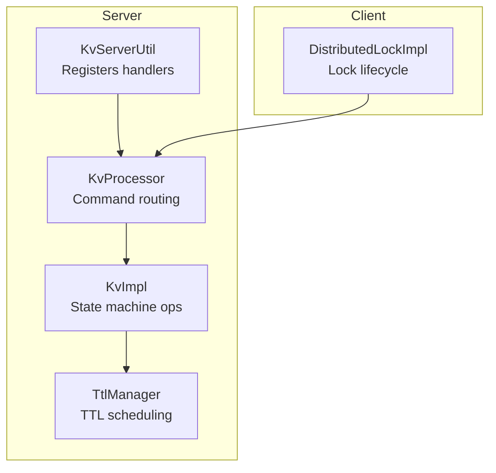
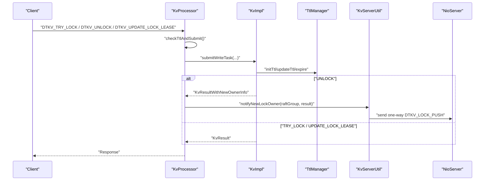
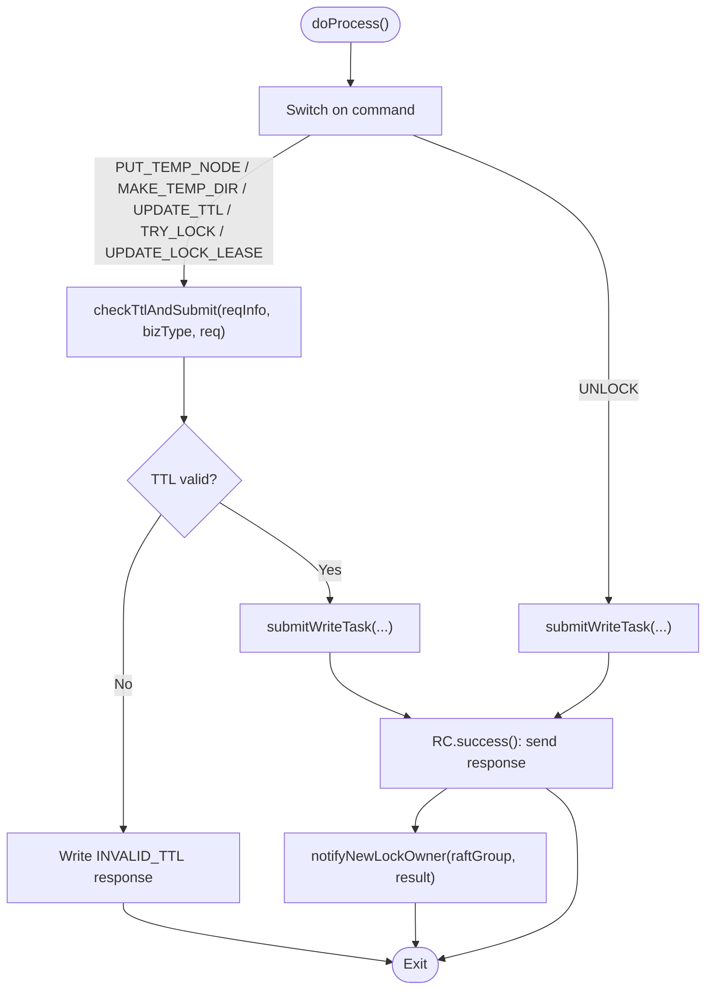
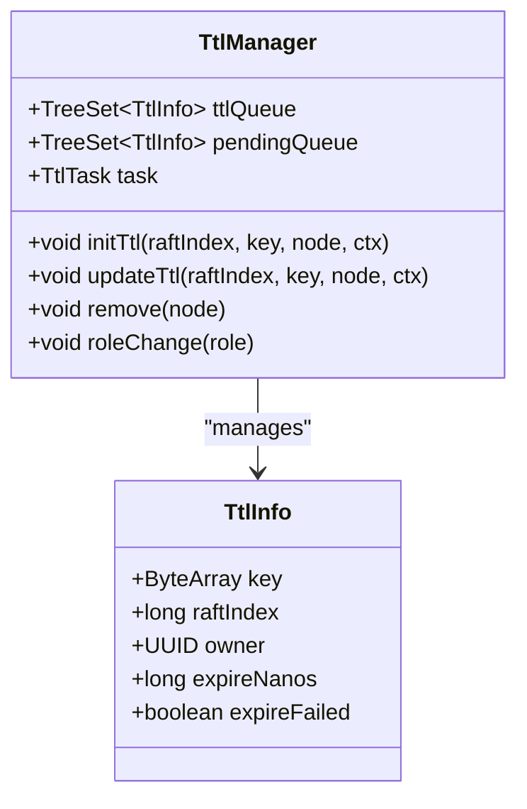
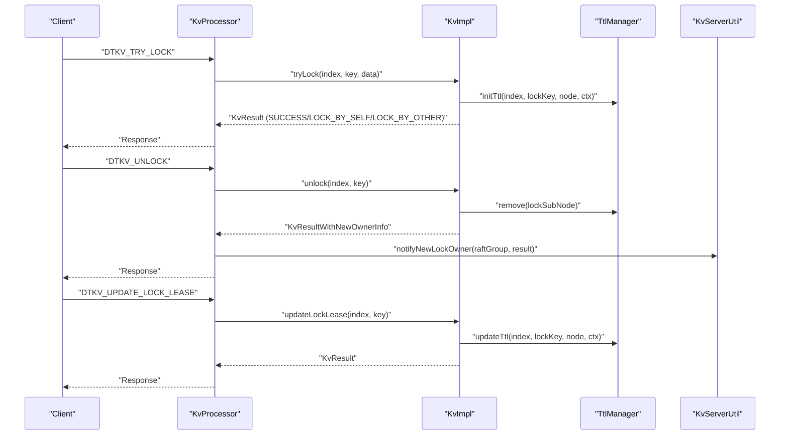
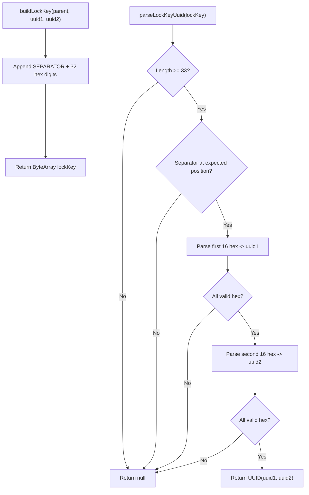
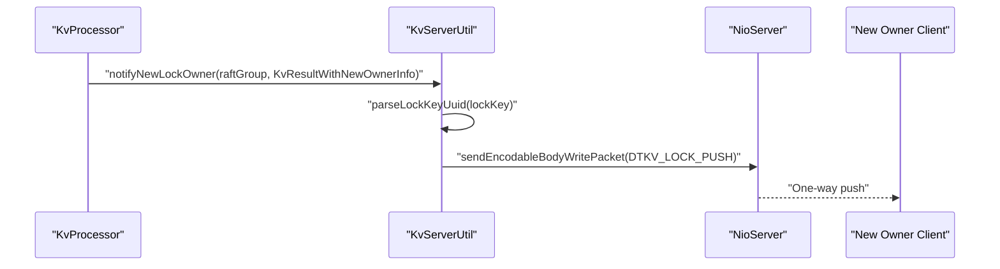
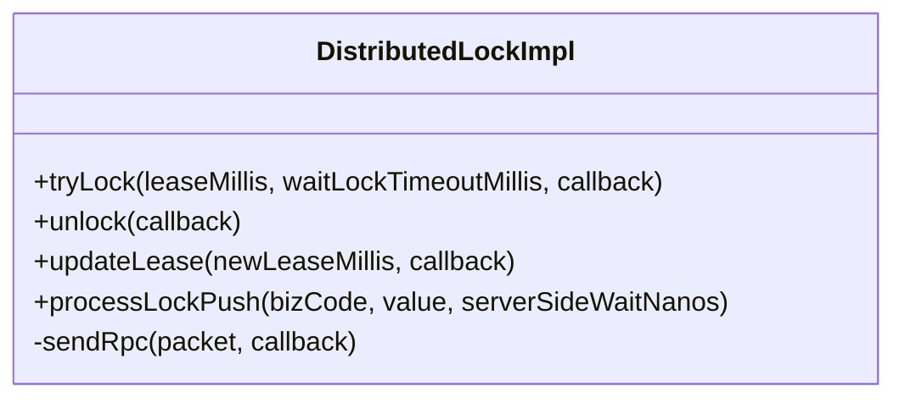
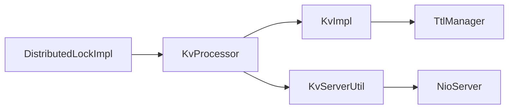

# TTL and Distributed Lock Operations

<cite>
**Referenced Files in This Document**
- [KvServerUtil.java](file://server/src/main/java/com/github/dtprj/dongting/dtkv/server/KvServerUtil.java)
- [KvProcessor.java](file://server/src/main/java/com/github/dtprj/dongting/dtkv/server/KvProcessor.java)
- [KvImpl.java](file://server/src/main/java/com/github/dtprj/dongting/dtkv/server/KvImpl.java)
- [TtlManager.java](file://server/src/main/java/com/github/dtprj/dongting/dtkv/server/TtlManager.java)
- [DistributedLockImpl.java](file://client/src/main/java/com/github/dtprj/dongting/dtkv/DistributedLockImpl.java)
- [LockDemoClient.java](file://demos/src/main/java/com/github/dtprj/dongting/demos/lock/LockDemoClient.java)
- [TtlDemoClient.java](file://demos/src/main/java/com/github/dtprj/dongting/demos/ttl/TtlDemoClient.java)
- [KvServerUtilTest.java](file://server/src/test/java/com/github/dtprj/dongting/dtkv/server/KvServerUtilTest.java)
</cite>

## Table of Contents
1. [Introduction](#introduction)
2. [Project Structure](#project-structure)
3. [Core Components](#core-components)
4. [Architecture Overview](#architecture-overview)
5. [Detailed Component Analysis](#detailed-component-analysis)
6. [Dependency Analysis](#dependency-analysis)
7. [Performance Considerations](#performance-considerations)
8. [Troubleshooting Guide](#troubleshooting-guide)
9. [Conclusion](#conclusion)
10. [Appendices](#appendices)

## Introduction
This document explains how the DtKV system implements TTL (time-to-live) and distributed lock operations. It focuses on:
- How KvServerUtil.initKvServer() registers the KvProcessor for handling PUT_TEMP_NODE, MAKE_TEMP_DIR, UPDATE_TTL, TRY_LOCK, UNLOCK, and UPDATE_LOCK_LEASE commands.
- How KvProcessor.doProcess() validates TTL inputs via checkTtlAndSubmit() and delegates to the state machine.
- Special handling of UNLOCK operations that trigger notifications to new lock owners via KvServerUtil.notifyNewLockOwner().
- Integration with TtlManager and LockManager components.
- Lock key generation and parsing mechanisms using buildLockKey() and parseLockKeyUuid().
- Practical usage patterns and best practices for TTL and distributed locks.

## Project Structure
The TTL and distributed lock features span server-side processors, state machine logic, TTL scheduling, and client-side lock management.

**Diagram sources**
- [KvServerUtil.java](file://server/src/main/java/com/github/dtprj/dongting/dtkv/server/KvServerUtil.java#L52-L76)
- [KvProcessor.java](file://server/src/main/java/com/github/dtprj/dongting/dtkv/server/KvProcessor.java#L71-L145)
- [KvImpl.java](file://server/src/main/java/com/github/dtprj/dongting/dtkv/server/KvImpl.java#L842-L1090)
- [TtlManager.java](file://server/src/main/java/com/github/dtprj/dongting/dtkv/server/TtlManager.java#L1-L242)
- [DistributedLockImpl.java](file://client/src/main/java/com/github/dtprj/dongting/dtkv/DistributedLockImpl.java#L1-L652)

**Section sources**
- [KvServerUtil.java](file://server/src/main/java/com/github/dtprj/dongting/dtkv/server/KvServerUtil.java#L52-L76)
- [KvProcessor.java](file://server/src/main/java/com/github/dtprj/dongting/dtkv/server/KvProcessor.java#L71-L145)

## Core Components
- KvServerUtil: Registers command handlers for TTL and lock operations and provides utilities for lock key construction/parsing and notifying new lock owners.
- KvProcessor: Routes incoming commands to the state machine, validates TTL inputs, and submits write tasks to Raft.
- KvImpl: Implements the core business logic for TTL and lock operations, integrates with TtlManager, and manages lock ownership transitions.
- TtlManager: Schedules and executes TTL expiration callbacks, batching retries and expirations.
- DistributedLockImpl: Client-side lock lifecycle, RPC interactions, and lock push notifications.

**Section sources**
- [KvServerUtil.java](file://server/src/main/java/com/github/dtprj/dongting/dtkv/server/KvServerUtil.java#L52-L76)
- [KvProcessor.java](file://server/src/main/java/com/github/dtprj/dongting/dtkv/server/KvProcessor.java#L71-L145)
- [KvImpl.java](file://server/src/main/java/com/github/dtprj/dongting/dtkv/server/KvImpl.java#L842-L1090)
- [TtlManager.java](file://server/src/main/java/com/github/dtprj/dongting/dtkv/server/TtlManager.java#L1-L242)
- [DistributedLockImpl.java](file://client/src/main/java/com/github/dtprj/dongting/dtkv/DistributedLockImpl.java#L1-L652)

## Architecture Overview
The server registers handlers for TTL and lock commands. Incoming requests are validated and submitted to Raft. The state machine applies changes and interacts with TtlManager. For lock operations, KvServerUtil.notifyNewLockOwner() sends a one-way push to the new owner’s client.

**Diagram sources**
- [KvProcessor.java](file://server/src/main/java/com/github/dtprj/dongting/dtkv/server/KvProcessor.java#L120-L137)
- [KvProcessor.java](file://server/src/main/java/com/github/dtprj/dongting/dtkv/server/KvProcessor.java#L147-L157)
- [KvProcessor.java](file://server/src/main/java/com/github/dtprj/dongting/dtkv/server/KvProcessor.java#L244-L257)
- [KvImpl.java](file://server/src/main/java/com/github/dtprj/dongting/dtkv/server/KvImpl.java#L842-L1090)
- [TtlManager.java](file://server/src/main/java/com/github/dtprj/dongting/dtkv/server/TtlManager.java#L137-L201)
- [KvServerUtil.java](file://server/src/main/java/com/github/dtprj/dongting/dtkv/server/KvServerUtil.java#L162-L201)

## Detailed Component Analysis

### Command Registration in KvServerUtil.initKvServer()
KvServerUtil registers the KvProcessor for TTL and lock commands, enabling the server to handle:
- PUT_TEMP_NODE
- MAKE_TEMP_DIR
- UPDATE_TTL
- TRY_LOCK
- UNLOCK
- UPDATE_LOCK_LEASE

It also registers other commands for general KV operations and status/watch processors.

**Section sources**
- [KvServerUtil.java](file://server/src/main/java/com/github/dtprj/dongting/dtkv/server/KvServerUtil.java#L52-L76)

### TTL Validation and Submission in KvProcessor
KvProcessor.doProcess() routes commands to the state machine. For TTL-related commands, it invokes checkTtlAndSubmit() to validate TTL constraints before submitting write tasks. For UNLOCK, it submits a write task directly and handles the response asynchronously.

**Diagram sources**
- [KvProcessor.java](file://server/src/main/java/com/github/dtprj/dongting/dtkv/server/KvProcessor.java#L71-L145)
- [KvProcessor.java](file://server/src/main/java/com/github/dtprj/dongting/dtkv/server/KvProcessor.java#L147-L157)
- [KvProcessor.java](file://server/src/main/java/com/github/dtprj/dongting/dtkv/server/KvProcessor.java#L244-L257)
- [KvServerUtil.java](file://server/src/main/java/com/github/dtprj/dongting/dtkv/server/KvServerUtil.java#L162-L201)

**Section sources**
- [KvProcessor.java](file://server/src/main/java/com/github/dtprj/dongting/dtkv/server/KvProcessor.java#L71-L145)
- [KvProcessor.java](file://server/src/main/java/com/github/dtprj/dongting/dtkv/server/KvProcessor.java#L147-L157)

### TTL Validation Logic in KvImpl.checkTtl()
KvImpl.checkTtl() enforces TTL constraints:
- For lock operations, TTL must be non-negative and the payload must include a valid hold TTL (at least 8 bytes, big-endian long).
- For non-lock operations, TTL must be positive.
- Maximum TTL is bounded by a constant.

This validation is invoked by KvProcessor.checkTtlAndSubmit() before submitting write tasks.

**Section sources**
- [KvImpl.java](file://server/src/main/java/com/github/dtprj/dongting/dtkv/server/KvImpl.java#L939-L965)
- [KvProcessor.java](file://server/src/main/java/com/github/dtprj/dongting/dtkv/server/KvProcessor.java#L147-L157)

### TTL Management with TtlManager
TtlManager maintains two queues:
- ttlQueue: nodes ready to expire.
- pendingQueue: nodes that failed to expire and are retried.

It schedules expiration callbacks, batches retries and expirations, and pauses when the node is not leader. It also exposes methods to initialize TTL on new nodes and update TTL on existing nodes.

**Diagram sources**
- [TtlManager.java](file://server/src/main/java/com/github/dtprj/dongting/dtkv/server/TtlManager.java#L1-L242)

**Section sources**
- [TtlManager.java](file://server/src/main/java/com/github/dtprj/dongting/dtkv/server/TtlManager.java#L137-L201)
- [TtlManager.java](file://server/src/main/java/com/github/dtprj/dongting/dtkv/server/TtlManager.java#L1-L120)

### Distributed Lock Operations in KvImpl
- TRY_LOCK: Creates a lock sub-node under the target key using a generated lock key derived from the parent key and the operator UUID. The lock holds TTL from the payload. If another owner exists, returns LOCK_BY_OTHER.
- UNLOCK: Removes the lock sub-node owned by the caller. If the parent becomes empty or the caller was the owner, it updates the next owner and prepares new owner info for notification.
- UPDATE_LOCK_LEASE: Updates TTL for the caller’s lock sub-node if it is still the current owner.

**Diagram sources**
- [KvProcessor.java](file://server/src/main/java/com/github/dtprj/dongting/dtkv/server/KvProcessor.java#L120-L137)
- [KvProcessor.java](file://server/src/main/java/com/github/dtprj/dongting/dtkv/server/KvProcessor.java#L244-L257)
- [KvImpl.java](file://server/src/main/java/com/github/dtprj/dongting/dtkv/server/KvImpl.java#L1028-L1090)
- [KvServerUtil.java](file://server/src/main/java/com/github/dtprj/dongting/dtkv/server/KvServerUtil.java#L162-L201)

**Section sources**
- [KvImpl.java](file://server/src/main/java/com/github/dtprj/dongting/dtkv/server/KvImpl.java#L1028-L1090)
- [KvProcessor.java](file://server/src/main/java/com/github/dtprj/dongting/dtkv/server/KvProcessor.java#L244-L257)

### Lock Key Generation and Parsing
KvServerUtil.buildLockKey() constructs a lock sub-key by appending a separator and two 16-hex-digit UUID parts to the parent key. parseLockKeyUuid() extracts the UUID from the lock key, validating the separator position and hex characters.

**Diagram sources**
- [KvServerUtil.java](file://server/src/main/java/com/github/dtprj/dongting/dtkv/server/KvServerUtil.java#L94-L150)

**Section sources**
- [KvServerUtil.java](file://server/src/main/java/com/github/dtprj/dongting/dtkv/server/KvServerUtil.java#L94-L150)
- [KvServerUtilTest.java](file://server/src/test/java/com/github/dtprj/dongting/dtkv/server/KvServerUtilTest.java#L30-L90)

### Notification of New Lock Owner
After UNLOCK, KvProcessor sends a response immediately and then calls KvServerUtil.notifyNewLockOwner(). This method:
- Checks the result and new owner info.
- Parses the lock key to extract the owner UUID.
- Sends a one-way DTKV_LOCK_PUSH to the new owner’s client via NioServer.

**Diagram sources**
- [KvProcessor.java](file://server/src/main/java/com/github/dtprj/dongting/dtkv/server/KvProcessor.java#L244-L257)
- [KvServerUtil.java](file://server/src/main/java/com/github/dtprj/dongting/dtkv/server/KvServerUtil.java#L162-L201)

**Section sources**
- [KvProcessor.java](file://server/src/main/java/com/github/dtprj/dongting/dtkv/server/KvProcessor.java#L244-L257)
- [KvServerUtil.java](file://server/src/main/java/com/github/dtprj/dongting/dtkv/server/KvServerUtil.java#L162-L201)

### Client-Side Lock Lifecycle (DistributedLockImpl)
DistributedLockImpl manages:
- tryLock: Sends TRY_LOCK RPC with leaseMillis encoded in the value and waits for a push or timeout.
- unlock: Sends UNLOCK RPC and cancels local expire task.
- updateLease: Sends UPDATE_LOCK_LEASE RPC to renew the lock.
- processLockPush: Handles DTKV_LOCK_PUSH messages, validates lockId/opId, and completes the pending operation.

**Diagram sources**
- [DistributedLockImpl.java](file://client/src/main/java/com/github/dtprj/dongting/dtkv/DistributedLockImpl.java#L1-L652)

**Section sources**
- [DistributedLockImpl.java](file://client/src/main/java/com/github/dtprj/dongting/dtkv/DistributedLockImpl.java#L338-L560)
- [DistributedLockImpl.java](file://client/src/main/java/com/github/dtprj/dongting/dtkv/DistributedLockImpl.java#L612-L644)

## Dependency Analysis
- KvProcessor depends on KvServerUtil for state machine retrieval and lock key utilities, and on KvImpl for applying operations.
- KvImpl depends on TtlManager for TTL initialization, updates, and removal.
- KvServerUtil depends on RaftStatusImpl and NioServer to send lock push notifications.
- DistributedLockImpl depends on KvClient and RaftClient to send RPCs and schedule tasks.

**Diagram sources**
- [KvProcessor.java](file://server/src/main/java/com/github/dtprj/dongting/dtkv/server/KvProcessor.java#L71-L145)
- [KvImpl.java](file://server/src/main/java/com/github/dtprj/dongting/dtkv/server/KvImpl.java#L842-L1090)
- [TtlManager.java](file://server/src/main/java/com/github/dtprj/dongting/dtkv/server/TtlManager.java#L137-L201)
- [KvServerUtil.java](file://server/src/main/java/com/github/dtprj/dongting/dtkv/server/KvServerUtil.java#L162-L201)
- [DistributedLockImpl.java](file://client/src/main/java/com/github/dtprj/dongting/dtkv/DistributedLockImpl.java#L1-L652)

**Section sources**
- [KvProcessor.java](file://server/src/main/java/com/github/dtprj/dongting/dtkv/server/KvProcessor.java#L71-L145)
- [KvImpl.java](file://server/src/main/java/com/github/dtprj/dongting/dtkv/server/KvImpl.java#L842-L1090)
- [TtlManager.java](file://server/src/main/java/com/github/dtprj/dongting/dtkv/server/TtlManager.java#L137-L201)
- [KvServerUtil.java](file://server/src/main/java/com/github/dtprj/dongting/dtkv/server/KvServerUtil.java#L162-L201)
- [DistributedLockImpl.java](file://client/src/main/java/com/github/dtprj/dongting/dtkv/DistributedLockImpl.java#L1-L652)

## Performance Considerations
- TTL expiration batching: TtlManager processes up to MAX_EXPIRE_BATCH items per cycle and yields when retry queue requires processing, preventing starvation.
- Leader-only execution: TtlTask pauses when role is not leader, reducing unnecessary work.
- Lock key parsing: buildLockKey() and parseLockKeyUuid() use fixed-size buffers and simple loops, minimizing overhead.
- Client-side lock scheduling: DistributedLockImpl uses scheduled tasks for lease renewal and expiration, avoiding busy-waiting.

[No sources needed since this section provides general guidance]

## Troubleshooting Guide
Common issues and resolutions:
- INVALID_TTL errors: Ensure TTL is positive for non-lock operations and non-negative with a valid hold TTL for lock operations. The maximum TTL is bounded.
- NOT_OWNER on REMOVE/UPDATE_TTL: Only the original owner can modify TTL of a temporary node.
- LOCK_BY_OTHER on TRY_LOCK/UNLOCK: Another client holds the lock; wait or adjust lock acquisition strategy.
- UNLOCK returns LOCK_BY_OTHER: Caller is not the current lock owner; ensure the correct client unlocks.
- Expiration push failures: KvServerUtil.notifyNewLockOwner() logs warnings when the new owner is offline; the system continues without blocking.

**Section sources**
- [KvImpl.java](file://server/src/main/java/com/github/dtprj/dongting/dtkv/server/KvImpl.java#L939-L965)
- [KvProcessor.java](file://server/src/main/java/com/github/dtprj/dongting/dtkv/server/KvProcessor.java#L244-L257)
- [KvServerUtil.java](file://server/src/main/java/com/github/dtprj/dongting/dtkv/server/KvServerUtil.java#L162-L201)

## Conclusion
The DtKV TTL and distributed lock system integrates tightly with Raft and a dedicated TTL scheduler. KvServerUtil.initKvServer() wires the necessary handlers, KvProcessor validates TTL inputs and coordinates responses, and KvImpl implements precise lock semantics with owner transitions and TTL updates. KvServerUtil.notifyNewLockOwner() ensures clients are promptly informed of lock handovers. Clients use DistributedLockImpl to manage lock lifecycles reliably.

[No sources needed since this section summarizes without analyzing specific files]

## Appendices

### Example Usage Patterns and Best Practices
- Temporary nodes with TTL:
  - Use PUT_TEMP_NODE or MAKE_TEMP_DIR with a positive TTL.
  - Monitor availability; nodes expire automatically after TTL.
  - Use UPDATE_TTL to extend TTL when needed.
- Distributed locks:
  - TRY_LOCK with a reasonable leaseMillis and waitLockTimeoutMillis.
  - UPDATE_LOCK_LEASE to renew the lock before expiration.
  - Always unlock explicitly to release the lock and avoid stale ownership.
- Lock key safety:
  - Lock keys are derived deterministically from parent key and operator UUID; do not construct lock keys manually.
  - Validate lockId and opId in lock push handling to prevent replay attacks.

**Section sources**
- [TtlDemoClient.java](file://demos/src/main/java/com/github/dtprj/dongting/demos/ttl/TtlDemoClient.java#L30-L56)
- [LockDemoClient.java](file://demos/src/main/java/com/github/dtprj/dongting/demos/lock/LockDemoClient.java#L30-L48)
- [DistributedLockImpl.java](file://client/src/main/java/com/github/dtprj/dongting/dtkv/DistributedLockImpl.java#L338-L560)